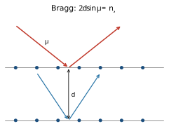
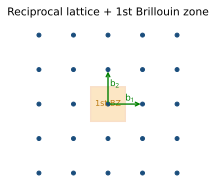
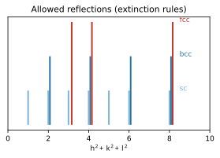

<!-- 固態物理 單元02：倒晶格與繞射（Reciprocal Lattice & Diffraction） · 從高中到資格考 -->

# 固態物理 單元02 — 倒晶格與繞射（Reciprocal Lattice & Diffraction）
### 從高中概念建到資格考

> **使用說明**：本篇從你高中會的東西（波的干涉、畢氏定理、向量內積/外積、行列式）出發，一路接到 Kittel 第 2 章等級。符號點 `▸` 就地展開（你高中學過的→為什麼→定義→範例1/2/3）。專有名詞第一次出現用「中文（English）」對照。配套：[單元整理](../考古題/單元整理.html)（出題頻率）、[逐題詳解](../考古題/詳解/index.html)、[教材直讀](../教材/index.html)。
> **慣例（本篇符號）**：晶格向量（lattice vectors）$\mathbf a_1,\mathbf a_2,\mathbf a_3$；倒晶格向量（reciprocal lattice vectors）$\mathbf b_1,\mathbf b_2,\mathbf b_3$，且 $\mathbf a_i\cdot\mathbf b_j=2\pi\delta_{ij}$（Kittel 慣例，帶 $2\pi$）；倒晶格點 $\mathbf G=h\mathbf b_1+k\mathbf b_2+l\mathbf b_3$（$h,k,l\in\mathbb Z$）；入射波向量 $\mathbf k$、散射波向量 $\mathbf k'$、動量轉移 $\Delta\mathbf k=\mathbf k'-\mathbf k$；波數 $k=2\pi/\lambda$；面間距 $d_{hkl}$；散射角 $\theta$（量自晶面），入射束與繞射束夾角 $2\theta$。
>
> 📖 **本單元權威出處與教材對照（Textbook & Reference Alignment）**：
> - **Kittel 原文 8e**：Chapter 2（Wave Diffraction and the Reciprocal Lattice, pp. 29–52），核心公式：Eq. (1) 布拉格定律、Eq. (13) 倒晶格基底向量、Eq. (24) 勞厄條件、Eq. (39) 幾何結構因子、Eq. (42)–(44) 消光規則。
> - **林盛煇《固態物理導論》**：第 2 章（§2.1 X 光繞射、§2.2 倒晶格性質、§2.3 勞厄條件與 Ewald 球、§2.4 幾何結構因子與消光、§2.5 探針比較）。
> - **Ashcroft & Mermin**：Ch. 5（The Reciprocal Lattice）、Ch. 6（X-ray Diffraction）。
> - **臺大資格考真題對照**：2013–2025 共 11 次命題（2013 Q2/Q3/Q17, 2014 Q2, 2015 Q2, 2016 Q1, 2018 Q1, 2019 Q2, 2020 Q2, 2021 Q2, 2022 Q2, 2023 Q2, 2025 Q1），第一梯隊核心命題區。

---

## 🧭 為什麼要這個單元？（在解決什麼問題、與其他章節的關係）

### 為什麼要學「倒晶格與繞射」？

unit01 告訴你原子排成什麼格子，但你**用眼睛看不到原子**——怎麼證明、怎麼量出那個格子？答案是拿波（X 光、中子、電子）去打晶體、看**繞射圖樣**。可是描述繞射時，實空間的 $\mathbf a_i$ 很難用；必須換到一個專為「週期性」設計的新空間——**倒空間（reciprocal space）**。倒晶格是固態物理的第二根支柱，第一梯隊、年年必考，也是後面聲子與能帶共用的畫布。

### 在解決什麼問題？

> **核心問題**：給定一個實空間晶格，**哪些方向的波會被它相長干涉放大**（出現繞射峰）？峰的位置與強度又怎麼反推出晶格與原子位置？

答案分兩層：峰的**位置**由勞厄條件 $\Delta\mathbf k=\mathbf G$（等價於布拉格 $2d\sin\theta=n\lambda$）決定；峰的**強度**由 basis 貢獻的**結構因子** $S_{\mathbf G}=\sum_j f_j e^{i\mathbf G\cdot\mathbf r_j}$ 決定（某些峰會消光）。要寫下這些，先得會手算倒晶格基底 $\mathbf b_i$。

### 與其他章節的關係

倒晶格是「把 unit01 翻成可量測的語言」，再往後變成所有 $k$-空間理論的舞台：

| 相關章節 | 關係 |
|---|---|
| **01 晶體結構（往前接）** | $\mathbf a_i\to\mathbf b_i$、$(hkl)\to\mathbf G$、basis$\to$結構因子；WS cell $\to$ 第一布里淵區 |
| **04 聲子（往後給）** | 色散 $\omega(k)$ 畫在第一布里淵區內 |
| **06 能帶（往後給）** | 能帶、能隙都在 BZ 中；能隙開在 BZ 邊界（Bragg 反射） |
| **10 實驗（往後給）** | XRD、蛋白質結晶、X 光反射率全用這裡的繞射原理 |

> **一句話**：unit01 是實空間的語言，unit02 把它翻成倒空間的語言——之後每次看到「第一布里淵區」「$\mathbf G$」「$k$ 限在 BZ 內」，根都在這裡。

---

## 🎯 這個單元在考什麼（出題地位）

倒晶格與繞射是**第一梯隊（幾乎年年考）**單元：2013–2025 共 13 卷裡出現 **11 次**，且 2019 起的「四大段固定結構」（Crystal structure / **Diffraction** / Phonons / Electrons）每卷必有一段就是它。典型配分 **20–35%**。

| 最常見題型 | 出過的年份 | 對應本篇章節 |
|---|---|---|
| 由 $\mathbf a_i$ 推倒晶格 $\mathbf b_i$、畫第一布里淵區（BZ） | 2015, 2016, 2022, 2024, 2025 | §3, §4 |
| 結構因子（structure factor）與消光（sc/bcc/fcc/diamond） | 2013, 2014, 2016, 2018, 2020, 2021 | §6 |
| Bragg ↔ von Laue 等價、$\Delta\mathbf k=\mathbf G$ 推 Bragg | 2013, 2014, 2015, 2016, 2018, 2023 | §2, §5 |
| 繞射條件 = BZ 邊界（用 Wigner–Seitz cell 證） | 2018 | §5 |
| 三種探針（X 光/中子/電子）為何同峰位、異強度 | 2014, 2016, 2023 | §7 |
| 數值題：給 $\lambda,\theta$ 算 $d$／繞射角／最高階 | 2021, 2025 | §8 |
| bcc↔fcc 互為倒晶格 | 2015, 2016 | §3 |

> **一句話**：這個單元的主軸是「**位置 ← 倒晶格（lattice）；強度 ← 結構因子（basis）**」。把這條分工背熟，再加上「由 $\mathbf a_i$ 算 $\mathbf b_i$」與「結構因子消光規則」兩條手算，就能吃下大部分配分。

## 🧗 高中起點：你已經會的

- **波的干涉**：兩道波路徑差 = 整數倍波長 → 建設性干涉（亮）。雙狹縫 $d\sin\theta=n\lambda$。← 布拉格定律的直系祖先。
- **畢氏定理 / 餘弦定理**：$|\mathbf k'-\mathbf k|^2=k^2+k^2-2k^2\cos2\theta$。← 算動量轉移大小。
- **向量內積 $\mathbf u\cdot\mathbf v=|\mathbf u||\mathbf v|\cos\phi$**：投影、垂直（內積為 0）。← 倒晶格定義、BZ 中垂面。
- **向量外積 $\mathbf u\times\mathbf v$**：得到「垂直於兩向量的新向量」，大小 = 平行四邊形面積。← $\mathbf b_i$ 的建構。
- **$3\times3$ 行列式 / 純量三重積 $\mathbf a_1\cdot(\mathbf a_2\times\mathbf a_3)$**：等於平行六面體體積。← 倒晶格分母、原胞體積。
- **等比級數 / 指數 $e^{i\phi}=\cos\phi+i\sin\phi$**：相位相加。← 結構因子的相位和。
- **單位矩陣 $\delta_{ij}$**：$i=j$ 時 1、否則 0。← $\mathbf a_i\cdot\mathbf b_j=2\pi\delta_{ij}$。

---

## 📚 主線：從高中一路推到考試級

### 1. 布拉格定律（Bragg law）：從高中干涉直接長出來

> 📖 **本節核心出處與說明（Ref）**：
> - **權威教材**：Kittel 8e Ch. 2 Eq. (1) p. 30 ｜ 林盛煇 §2.1 ｜ A&M Ch. 6
> - **歷年考題**：[NTU 2013](../考古題/詳解/固態_2013_詳解.html), [2014](../考古題/詳解/固態_2014_詳解.html), [2016](../考古題/詳解/固態_2016_詳解.html), [2021](../考古題/詳解/固態_2021_詳解.html)
> - **觀念說明**：實空間幾何光程差干涉條件 $2d\sin\theta = n\lambda$。注意 $\theta$ 為掠角（glancing angle），入射束與出射束偏轉夾角為 $2\theta$。

**你高中學過的**：雙狹縫實驗——兩道光走的路徑長度差 = $n\lambda$（整數倍波長）時，波峰對波峰，亮紋出現。

**為什麼需要新東西**：晶體裡原子不是「兩條縫」，而是一層一層平行的**晶面（crystal planes）**，每層都會反射一點點 X 光。要讓所有層反射的波同相疊加（建設性干涉），需要一個條件——這就是布拉格定律。

**定義（中英對照）**：把晶體看成間距 $d$ 的一疊平行晶面，X 光以掠角 $\theta$（量自晶面，不是法線）入射並「鏡面反射」。相鄰兩層反射波的路徑差 = 整數倍波長時繞射峰出現：

$$\boxed{2d\sin\theta=n\lambda}\qquad(\text{布拉格定律，Bragg law})$$

#### Step 1 — 畫出兩條相鄰晶面的反射光路

取兩層平行晶面，間距 $d$。一道平行光打在上層、一道打在下層，掠角都是 $\theta$（入射與反射對稱）。下層那道要多走一段路才回到同一波前。

> **小結**：多走的路 = 「進到下層」+「離開下層」兩段，各長 $d\sin\theta$。

#### Step 2 — 算路徑差（純幾何，用 $\sin$）

從上層的反射點作垂線到下層光路。下層光比上層光多走的總長度為兩個直角三角形的對邊和：

$$\Delta L = d\sin\theta + d\sin\theta = \boxed{2d\sin\theta.}$$

> **小結**：路徑差只跟「層距 $d$」與「掠角 $\theta$」有關，與光走多遠無關——這是把無數層壓成一條公式的關鍵。

#### Step 3 — 套建設性干涉條件

兩道反射波同相（亮）⟺ 路徑差 = 整數倍波長：

$$2d\sin\theta=n\lambda,\qquad n=1,2,3,\dots\ (\text{繞射階數，order})$$

> **小結**：$n=1$ 是一階繞射、$n=2$ 二階……。$\sin\theta\le1$ 故 $\lambda\le 2d$——**波長太長就照不出繞射**（X 光波長 ~Å 與晶格 ~Å 同量級，正是為此選 X 光）。

<figure style="margin:1.3em 0;text-align:center">
<svg viewBox="0 0 480 235" width="100%" style="max-width:640px;border:1px solid #ddd;border-radius:8px;background:#fff;padding:6px;box-sizing:border-box" xmlns="http://www.w3.org/2000/svg">
<defs>
<marker id="arA2" markerWidth="9" markerHeight="9" refX="6.5" refY="3" orient="auto"><path d="M0,0 L6,3 L0,6 Z" fill="#2f4f7a"/></marker>
</defs>
<g font-family="-apple-system,sans-serif">
<line x1="100" y1="80" x2="400" y2="80" stroke="#888" stroke-width="1.3"/>
<line x1="100" y1="140" x2="400" y2="140" stroke="#888" stroke-width="1.3"/>
<g fill="#c9c9c9"><circle cx="130" cy="80" r="3"/><circle cx="170" cy="80" r="3"/><circle cx="210" cy="80" r="3"/><circle cx="250" cy="80" r="3"/><circle cx="290" cy="80" r="3"/><circle cx="330" cy="80" r="3"/><circle cx="370" cy="80" r="3"/><circle cx="130" cy="140" r="3"/><circle cx="170" cy="140" r="3"/><circle cx="210" cy="140" r="3"/><circle cx="250" cy="140" r="3"/><circle cx="290" cy="140" r="3"/><circle cx="330" cy="140" r="3"/><circle cx="370" cy="140" r="3"/></g>
<g stroke="#2f4f7a" stroke-width="1.8" fill="none"><line x1="146" y1="20" x2="247" y2="78" marker-end="url(#arA2)"/><line x1="250" y1="80" x2="354" y2="20" marker-end="url(#arA2)"/><line x1="146" y1="80" x2="247" y2="138" marker-end="url(#arA2)"/><line x1="250" y1="140" x2="354" y2="80" marker-end="url(#arA2)"/></g>
<g stroke="#bbb" stroke-width="1" stroke-dasharray="3,3"><line x1="250" y1="80" x2="224" y2="125"/><line x1="250" y1="80" x2="276" y2="125"/></g>
<g stroke="#c0392b" stroke-width="2.6" fill="none"><line x1="224" y1="125" x2="250" y2="140"/><line x1="250" y1="140" x2="276" y2="125"/></g>
<rect x="221" y="118" width="7" height="7" fill="none" stroke="#c0392b" stroke-width="0.8" transform="rotate(30 224 125)"/>
<rect x="272" y="118" width="7" height="7" fill="none" stroke="#c0392b" stroke-width="0.8" transform="rotate(-30 276 125)"/>
<circle cx="250" cy="80" r="3.5" fill="#1a4d7c"/><circle cx="250" cy="140" r="3.5" fill="#1a4d7c"/>
<path d="M225,80 A25,25 0 0,0 232,67" fill="none" stroke="#333" stroke-width="1"/>
<text x="222" y="74" font-size="11" fill="#333">θ</text>
<line x1="120" y1="80" x2="120" y2="140" stroke="#1a4d7c" stroke-width="1"/>
<line x1="116" y1="84" x2="120" y2="80" stroke="#1a4d7c" stroke-width="1"/><line x1="124" y1="84" x2="120" y2="80" stroke="#1a4d7c" stroke-width="1"/>
<line x1="116" y1="136" x2="120" y2="140" stroke="#1a4d7c" stroke-width="1"/><line x1="124" y1="136" x2="120" y2="140" stroke="#1a4d7c" stroke-width="1"/>
<text x="108" y="114" font-size="12" fill="#1a4d7c">d</text>
<text x="150" y="16" font-size="11" fill="#2f4f7a">入射</text>
<text x="330" y="16" font-size="11" fill="#2f4f7a">繞射</text>
<text x="206" y="138" font-size="10.5" fill="#c0392b">d sinθ</text>
<text x="280" y="138" font-size="10.5" fill="#c0392b">d sinθ</text>
<text x="240" y="170" text-anchor="middle" font-size="12.5" fill="#333">紅色程差 = 2·(d sinθ) = nλ</text>
<text x="240" y="190" text-anchor="middle" font-size="11" fill="#777">θ 量自晶面；入射束與繞射束夾角 = 2θ</text>
</g>
</svg>
<figcaption style="font-size:0.9em;color:#555;margin-top:0.5em">布拉格反射的程差幾何：下層那道波多走的「進＋出」兩段紅線各長 d·sinθ（虛線是從上層反射點落下的垂足，標出兩個直角）。兩段相加 = 2d·sinθ，等於 nλ 時相鄰各層同相疊加 → 繞射峰。注意 θ 量自晶面、入射–繞射夾角是 2θ（數值題最常錯這裡）。</figcaption>
</figure>

<b>▸ 布拉格幾何：θ, d, n, λ</b>

### 你高中學過的
雙狹縫 $d\sin\theta=n\lambda$、$\sin$ 在直角三角形是「對邊／斜邊」。

### 為什麼要這個
晶體是「一疊鏡面」，$\theta$ 量自**晶面**（不是法線！），$d$ 是面間距，$n$ 是第幾階亮紋。

### 定義
$2d\sin\theta=n\lambda$；$\theta$=掠角（glancing angle），入射束與繞射束的夾角是 $2\theta$；$d=d_{hkl}$；$n$=繞射階數。

**範例 1（熱身）**：$\lambda=1.5\,$Å、$d=3\,$Å、$n=1$：$\sin\theta=\dfrac{n\lambda}{2d}=\dfrac{1.5}{6}=0.25\Rightarrow\theta=14.5^\circ$，入射–繞射夾角 $2\theta=29^\circ$。
**範例 2（中階）**：最高階 $n_{\max}$ 由 $\sin\theta\le1$ 定：$n_{\max}=\lfloor 2d/\lambda\rfloor$。$d=3\,$Å、$\lambda=1.5\,$Å → $n_{\max}=4$。
**範例 3（對到 2021 / NaCl）**：$\lambda=0.084\,$nm、$\theta=8.35^\circ$、$n=1$ → $d=\dfrac{\lambda}{2\sin\theta}=\dfrac{0.084}{2\sin8.35^\circ}=0.289\,$nm（NaCl 面間距）。

> **小結**：布拉格定律就是「雙狹縫干涉」搬到「一疊晶面」；唯一要小心的是 $\theta$ **量自晶面**、入射–繞射夾角是 $2\theta$。

<b>📝 更多範例（點開）：布拉格定律 2d sinθ = nλ 算 d、θ、最高階</b>

**範例 A（給 $\lambda,\theta,n$ → 反推面間距 $d$）**：銅靶 X 光 $\lambda=1.54\,$Å，在某晶面測到一階（$n=1$）峰於掠角 $\theta=22^\circ$。由 $2d\sin\theta=n\lambda$ 解 $d$：

$$d=\frac{n\lambda}{2\sin\theta}=\frac{1\times1.54}{2\sin22^\circ}=\frac{1.54}{2\times0.3746}=\frac{1.54}{0.7492}=2.06\ \text{Å}.$$

逐步：先算 $\sin22^\circ=0.3746$；分母 $2\times0.3746=0.7492$；$1.54\div0.7492=2.055\approx2.06\,$Å。注意題目給的是掠角 $\theta=22^\circ$，所以入射–繞射夾角是 $2\theta=44^\circ$，別把 $44^\circ$ 代進公式。

**範例 B（給 $d,\lambda$ → 算各階繞射角，並找最高階）**：$d=2.82\,$Å（NaCl (200)）、$\lambda=1.54\,$Å。逐階代 $\sin\theta_n=\dfrac{n\lambda}{2d}=\dfrac{n\times1.54}{2\times2.82}=\dfrac{n\times1.54}{5.64}=0.2730\,n$：

$$n=1:\ \sin\theta_1=0.2730\Rightarrow\theta_1=15.85^\circ;\qquad n=2:\ \sin\theta_2=0.5460\Rightarrow\theta_2=33.10^\circ;$$
$$n=3:\ \sin\theta_3=0.8191\Rightarrow\theta_3=55.00^\circ;\qquad n=4:\ \sin\theta_4=1.0921>1\ \Rightarrow\ \text{不存在}.$$

所以最高階 $n_{\max}=3$。也可直接用 $n_{\max}=\big\lfloor\dfrac{2d}{\lambda}\big\rfloor=\big\lfloor\dfrac{5.64}{1.54}\big\rfloor=\lfloor3.66\rfloor=3$，與逐階結果一致 ✓。

**範例 C（同一晶面、不同波長 → 為何要選短波長）**：$d=3.0\,$Å。若用可見光 $\lambda=5000\,$Å，則 $\sin\theta=\dfrac{n\lambda}{2d}=\dfrac{1\times5000}{6.0}=833\gg1$ → 連一階都不存在，**完全照不出繞射**。改用 $\lambda=1.0\,$Å 的 X 光：$\sin\theta_1=\dfrac{1.0}{6.0}=0.1667\Rightarrow\theta_1=9.59^\circ$，且 $n_{\max}=\lfloor6.0/1.0\rfloor=6$ → 看得到 6 階。這就是「$\lambda\le2d$ 才可能繞射、且 X 光 ~Å 與晶格 ~Å 同量級」的具體算術。

---

### 2. 為什麼還需要倒晶格？布拉格的兩個盲點

布拉格圖像很漂亮，但它**預設你已經知道晶面在哪、$d$ 是多少**，而且它把繞射講成「鏡面反射」——這在三維、含多原子基元（basis）的真實晶體裡有兩個盲點：

1. **「哪些晶面」並不顯然**：一個三維晶格有無限多組平行晶面（不同 $hkl$），每組 $d$ 不同。要系統地枚舉它們、算出 $d$，需要一個工具。
2. **「同位置卻不同強度（甚至消失）」布拉格說不清**：bcc 的 (100) 峰位置存在（布拉格算得出角度），實驗卻看不到。布拉格只管「位置」，管不了「強度/消光」。

**解法**：引入**倒晶格（reciprocal lattice）**。倒晶格把「一族 $(hkl)$ 晶面」濃縮成「倒空間裡的一個點 $\mathbf G$」，於是：

$$\underbrace{\text{峰的位置}}_{\text{倒晶格}\ \mathbf G}\quad\text{與}\quad\underbrace{\text{峰的強度}}_{\text{結構因子}\ S_{\mathbf G}}\quad\text{被乾淨地分開。}$$

這條分工是本單元一切題目的脊椎。下面先建倒晶格（§3），再用它把繞射條件寫成 $\Delta\mathbf k=\mathbf G$（§5），最後用結構因子處理強度（§6）。

> **小結**：倒晶格不是「另一個世界的玄學」，它是「把週期晶體做傅立葉分析後，自然冒出來的格點」——下一節就建給你看。

---

### 3. 倒晶格向量 $\mathbf b_i$ 的建構（核心手算）

> 📖 **本節核心出處與說明（Ref）**：
> - **權威教材**：Kittel 8e Ch. 2 Eq. (13) p. 34 ｜ 林盛煇 §2.2 ｜ A&M Ch. 5
> - **歷年考題**：[NTU 2015](../考古題/詳解/固態_2015_詳解.html), [2016](../考古題/詳解/固態_2016_詳解.html), [2022](../考古題/詳解/固態_2022_詳解.html), [2024](../考古題/詳解/固態_2024_詳解.html), [2025](../考古題/詳解/固態_2025_詳解.html)
> - **觀念說明**：倒空間基底向量 $\mathbf b_1 = 2\pi \frac{\mathbf a_2 \times \mathbf a_3}{V_p}$，滿足正交關聯 $\mathbf a_i \cdot \mathbf b_j = 2\pi \delta_{ij}$。BCC 與 FCC 互為倒晶格。

**你高中學過的**：向量外積 $\mathbf u\times\mathbf v$ 給出「同時垂直於 $\mathbf u,\mathbf v$」的向量；純量三重積 $\mathbf a_1\cdot(\mathbf a_2\times\mathbf a_3)$ = 平行六面體體積。

**為什麼需要新東西**：我們要一組新向量 $\mathbf b_1,\mathbf b_2,\mathbf b_3$，使「實空間平移 $\mathbf a_i$」與「倒空間 $\mathbf b_j$」配對乾淨——具體就是 $\mathbf a_i\cdot\mathbf b_j=2\pi\delta_{ij}$。下面這個公式正好辦到。

**定義（reciprocal lattice vectors，Kittel 第 2 章）**：

$$
\boxed{\;\mathbf b_1=2\pi\,\frac{\mathbf a_2\times\mathbf a_3}{\mathbf a_1\cdot(\mathbf a_2\times\mathbf a_3)},\qquad
\mathbf b_2=2\pi\,\frac{\mathbf a_3\times\mathbf a_1}{\mathbf a_1\cdot(\mathbf a_2\times\mathbf a_3)},\qquad
\mathbf b_3=2\pi\,\frac{\mathbf a_1\times\mathbf a_2}{\mathbf a_1\cdot(\mathbf a_2\times\mathbf a_3)}.\;}
$$

分母 $V_{\text{cell}}=\mathbf a_1\cdot(\mathbf a_2\times\mathbf a_3)$ 是實空間原胞體積（三者共用同一個分母）。

#### Step 1 — 驗證對角項 $\mathbf a_i\cdot\mathbf b_i=2\pi$

以 $\mathbf b_1$ 為例，與**自己這軸** $\mathbf a_1$ 做內積：

$$\mathbf a_1\cdot\mathbf b_1=2\pi\,\frac{\mathbf a_1\cdot(\mathbf a_2\times\mathbf a_3)}{\mathbf a_1\cdot(\mathbf a_2\times\mathbf a_3)}=2\pi.$$

分子分母同為那個三重積，約掉得 $2\pi$。

> **小結**：$\mathbf a_1\cdot\mathbf b_1=2\pi$ ✓——這就是公式裡放 $2\pi$ 的原因。

#### Step 2 — 驗證非對角項 $\mathbf a_i\cdot\mathbf b_j=0\ (i\ne j)$

以 $\mathbf a_2\cdot\mathbf b_1$ 為例：

$$\mathbf a_2\cdot\mathbf b_1=2\pi\,\frac{\mathbf a_2\cdot(\mathbf a_2\times\mathbf a_3)}{V_{\text{cell}}}.$$

外積 $\mathbf a_2\times\mathbf a_3$ **垂直於 $\mathbf a_2$**，故 $\mathbf a_2\cdot(\mathbf a_2\times\mathbf a_3)=0$（內積為 0）。同理 $\mathbf a_3\cdot\mathbf b_1=0$。

> **小結**：合起來 $\boxed{\mathbf a_i\cdot\mathbf b_j=2\pi\delta_{ij}}$——這是倒晶格的「身分證」。考試常用它**反向驗算**你算的 $\mathbf b_i$ 對不對。

<figure style="margin:1.3em 0;text-align:center">
<svg viewBox="0 0 560 215" width="100%" style="max-width:660px;border:1px solid #ddd;border-radius:8px;background:#fff;padding:6px;box-sizing:border-box" xmlns="http://www.w3.org/2000/svg">
<defs>
<marker id="arB2" markerWidth="10" markerHeight="10" refX="7" refY="3" orient="auto"><path d="M0,0 L6,3 L0,6 Z" fill="#1a4d7c"/></marker>
<marker id="arB2g" markerWidth="9" markerHeight="9" refX="7" refY="3" orient="auto"><path d="M0,0 L6,3 L0,6 Z" fill="#666"/></marker>
</defs>
<g font-family="-apple-system,sans-serif">
<g transform="translate(0,0)">
<text x="110" y="20" text-anchor="middle" font-size="13" font-weight="bold" fill="#1a4d7c">實空間（a 短、c 長）</text>
<g fill="#9cc3e6"><circle cx="60" cy="180" r="4"/><circle cx="102" cy="180" r="4"/><circle cx="144" cy="180" r="4"/><circle cx="60" cy="108" r="4"/><circle cx="102" cy="108" r="4"/><circle cx="144" cy="108" r="4"/><circle cx="60" cy="36" r="4"/><circle cx="102" cy="36" r="4"/><circle cx="144" cy="36" r="4"/></g>
<rect x="60" y="108" width="42" height="72" fill="#6aa1d6" fill-opacity="0.16" stroke="#1a4d7c" stroke-width="1"/>
<line x1="60" y1="194" x2="100" y2="194" stroke="#1a4d7c" stroke-width="1.6" marker-end="url(#arB2)"/>
<text x="78" y="208" text-anchor="middle" font-size="11" fill="#1a4d7c">a</text>
<line x1="46" y1="180" x2="46" y2="112" stroke="#1a4d7c" stroke-width="1.6" marker-end="url(#arB2)"/>
<text x="38" y="148" font-size="11" fill="#1a4d7c">c</text>
</g>
<g transform="translate(250,0)">
<text x="40" y="20" text-anchor="middle" font-size="20" fill="#666">→</text>
<text x="40" y="46" text-anchor="middle" font-size="10.5" fill="#666">倒晶格</text>
<text x="40" y="60" text-anchor="middle" font-size="10.5" fill="#666">（反比）</text>
</g>
<g transform="translate(320,0)">
<text x="120" y="20" text-anchor="middle" font-size="13" font-weight="bold" fill="#1a4d7c">倒空間（2π/a 長、2π/c 短）</text>
<g fill="#f0a79b"><circle cx="40" cy="150" r="4"/><circle cx="132" cy="150" r="4"/><circle cx="224" cy="150" r="4"/><circle cx="40" cy="108" r="4"/><circle cx="132" cy="108" r="4"/><circle cx="224" cy="108" r="4"/><circle cx="40" cy="66" r="4"/><circle cx="132" cy="66" r="4"/><circle cx="224" cy="66" r="4"/></g>
<rect x="40" y="108" width="92" height="42" fill="#e8a99d" fill-opacity="0.18" stroke="#c0392b" stroke-width="1"/>
<line x1="40" y1="164" x2="130" y2="164" stroke="#c0392b" stroke-width="1.6" marker-end="url(#arB2g)"/>
<text x="86" y="178" text-anchor="middle" font-size="11" fill="#c0392b">b₁ = 2π/a</text>
<line x1="26" y1="150" x2="26" y2="110" stroke="#c0392b" stroke-width="1.6" marker-end="url(#arB2g)"/>
<text x="2" y="134" font-size="11" fill="#c0392b">b₃=2π/c</text>
</g>
</g>
</svg>
<figcaption style="font-size:0.9em;color:#555;margin-top:0.5em">「週期 → 倒週期」是<b>反比</b>：實空間最長的軸（c）對應倒空間最短的軸（2π/c），反之亦然。對到 2022 tetragonal（a=b=5 Å、c=8 Å）：b₁=b₂=2π/5≈1.257 Å⁻¹、b₃=2π/8≈0.785 Å⁻¹——c 最長 → 倒空間 b₃ 最短，第一 BZ 在 c 方向「扁」。</figcaption>
</figure>

<b>▸ 倒晶格向量與正交關係：b_i, V_cell, δ_ij</b>

### 你高中學過的
外積垂直、三重積 = 體積、$\delta_{ij}$ 是單位矩陣的元素。

### 為什麼要這個
$\mathbf b_i$ 把「週期 $a$」翻成「倒空間間距 $2\pi/a$」；$\mathbf a_i\cdot\mathbf b_j=2\pi\delta_{ij}$ 讓後面所有相位 $\mathbf G\cdot\mathbf r$ 算起來都變整數 $\times2\pi$。

### 定義
$\mathbf b_1=2\pi\dfrac{\mathbf a_2\times\mathbf a_3}{V},\ V=\mathbf a_1\cdot(\mathbf a_2\times\mathbf a_3)$（$\mathbf b_2,\mathbf b_3$ 循環輪換）；$\mathbf a_i\cdot\mathbf b_j=2\pi\delta_{ij}$。

**範例 1（熱身，正交格）**：$\mathbf a_1=a\hat x,\mathbf a_2=b\hat y,\mathbf a_3=c\hat z$ → $\mathbf b_1=\tfrac{2\pi}a\hat x,\ \mathbf b_2=\tfrac{2\pi}b\hat y,\ \mathbf b_3=\tfrac{2\pi}c\hat z$（逐軸取倒數再乘 $2\pi$）。
**範例 2（中階，2D 矩陣法）**：把 $\mathbf a_1,\mathbf a_2$ 排成 $A=\begin{pmatrix}\mathbf a_1\\\mathbf a_2\end{pmatrix}$，則 $\begin{pmatrix}\mathbf b_1\\\mathbf b_2\end{pmatrix}=2\pi(A^{-1})^{\mathsf T}$（由 $AB^{\mathsf T}=2\pi I$）。斜方格也自動處理。
**範例 3（對到 2016 / bcc→fcc）**：見下方 Step，bcc 的倒晶格算出來剛好是 fcc。

<b>📝 更多範例（點開）：由 a_i 算 b_i 並用 a_i · b_j = 2π δ_ij 驗算</b>

**範例 A（正交格，逐軸取倒數）**：tetragonal $\mathbf a_1=a\hat x,\ \mathbf a_2=a\hat y,\ \mathbf a_3=c\hat z$（$a\ne c$）。先算分母三重積：

$$V=\mathbf a_1\cdot(\mathbf a_2\times\mathbf a_3)=a\hat x\cdot(a\hat y\times c\hat z)=a\hat x\cdot(ac\,\hat x)=a^2c.$$

外積 $\mathbf a_2\times\mathbf a_3=a\hat y\times c\hat z=ac\,\hat x$，故

$$\mathbf b_1=2\pi\frac{\mathbf a_2\times\mathbf a_3}{V}=2\pi\frac{ac\,\hat x}{a^2c}=\frac{2\pi}{a}\hat x,\qquad \text{同理}\ \mathbf b_2=\frac{2\pi}{a}\hat y,\ \mathbf b_3=\frac{2\pi}{c}\hat z.$$

驗算對角項：$\mathbf a_1\cdot\mathbf b_1=a\hat x\cdot\tfrac{2\pi}a\hat x=2\pi$ ✓；非對角：$\mathbf a_1\cdot\mathbf b_3=a\hat x\cdot\tfrac{2\pi}c\hat z=0$ ✓（$\hat x\cdot\hat z=0$）。長軸 $c$ → 短倒軸 $2\pi/c$，反比關係。

**範例 B（2D 斜方格，矩陣 / 外積法）**：$\mathbf a_1=a\hat x,\ \mathbf a_2=a(\tfrac12\hat x+\tfrac{\sqrt3}2\hat y)$（夾 $60^\circ$），補 $\mathbf a_3=\hat z$。三重積 = 底面積：

$$V=\mathbf a_1\cdot(\mathbf a_2\times\mathbf a_3)=|\mathbf a_1\times\mathbf a_2|=a\cdot a\sin60^\circ=\frac{\sqrt3}{2}a^2.$$

算 $\mathbf b_1=2\pi\dfrac{\mathbf a_2\times\hat z}{V}$。$\mathbf a_2\times\hat z=a(\tfrac12\hat x+\tfrac{\sqrt3}2\hat y)\times\hat z=a(\tfrac12(\hat x\times\hat z)+\tfrac{\sqrt3}2(\hat y\times\hat z))=a(-\tfrac12\hat y+\tfrac{\sqrt3}2\hat x)$，故

$$\mathbf b_1=2\pi\frac{a(\tfrac{\sqrt3}2\hat x-\tfrac12\hat y)}{\tfrac{\sqrt3}2a^2}=\frac{2\pi}{a}\Big(\hat x-\tfrac1{\sqrt3}\hat y\Big).$$

同理 $\mathbf b_2=2\pi\dfrac{\hat z\times\mathbf a_1}{V}=\dfrac{2\pi}{a}\cdot\dfrac{2}{\sqrt3}\hat y=\dfrac{4\pi}{\sqrt3 a}\hat y$。驗算：$\mathbf a_2\cdot\mathbf b_1=a(\tfrac12\hat x+\tfrac{\sqrt3}2\hat y)\cdot\tfrac{2\pi}a(\hat x-\tfrac1{\sqrt3}\hat y)=2\pi(\tfrac12-\tfrac{\sqrt3}2\cdot\tfrac1{\sqrt3})=2\pi(\tfrac12-\tfrac12)=0$ ✓。

**範例 C（用矩陣法 $B^{\mathsf T}=2\pi A^{-1}$ 一次算完，並驗 $AB^{\mathsf T}=2\pi I$）**：取 $A=\begin{pmatrix}2&0\\1&2\end{pmatrix}$（列為 $\mathbf a_1,\mathbf a_2$，單位 Å）。$\det A=4$，$A^{-1}=\dfrac1{4}\begin{pmatrix}2&0\\-1&2\end{pmatrix}$，故

$$B^{\mathsf T}=2\pi A^{-1}=\frac{2\pi}{4}\begin{pmatrix}2&0\\-1&2\end{pmatrix}=\frac{\pi}{2}\begin{pmatrix}2&0\\-1&2\end{pmatrix}\Rightarrow \mathbf b_1=(\pi,-\tfrac{\pi}2),\ \mathbf b_2=(0,\pi).$$

驗 $A B^{\mathsf T}=2\pi I$：$\mathbf a_1\cdot\mathbf b_1=(2,0)\cdot(\pi,-\tfrac\pi2)=2\pi$ ✓；$\mathbf a_1\cdot\mathbf b_2=(2,0)\cdot(0,\pi)=0$ ✓；$\mathbf a_2\cdot\mathbf b_1=(1,2)\cdot(\pi,-\tfrac\pi2)=\pi-\pi=0$ ✓；$\mathbf a_2\cdot\mathbf b_2=(1,2)\cdot(0,\pi)=2\pi$ ✓。四項全中 → $\mathbf b_i$ 正確。

#### Step 3 — 招牌結果：bcc↔fcc 互為倒晶格（2015/2016 必考）

取 bcc（立方邊 $a$）的 primitive vectors：

$$\mathbf a_1=\tfrac a2(-\hat x+\hat y+\hat z),\quad \mathbf a_2=\tfrac a2(\hat x-\hat y+\hat z),\quad \mathbf a_3=\tfrac a2(\hat x+\hat y-\hat z).$$

**(i) 算原胞體積**（bcc 每立方含 2 格點，故 $V=a^3/2$）：

$$V=\mathbf a_1\cdot(\mathbf a_2\times\mathbf a_3)=\frac{a^3}{2}.$$

**(ii) 算 $\mathbf b_1=2\pi\dfrac{\mathbf a_2\times\mathbf a_3}{V}$**。先算外積：

$$\mathbf a_2\times\mathbf a_3=\frac{a^2}{4}(\hat x-\hat y+\hat z)\times(\hat x+\hat y-\hat z)=\frac{a^2}{4}(0,\,2,\,2)=\frac{a^2}{2}(\hat y+\hat z).$$

故

$$\mathbf b_1=2\pi\cdot\frac{\tfrac{a^2}2(\hat y+\hat z)}{a^3/2}=\frac{2\pi}{a}(\hat y+\hat z),$$

同理循環輪換：

$$\boxed{\mathbf b_1=\tfrac{2\pi}a(\hat y+\hat z),\quad \mathbf b_2=\tfrac{2\pi}a(\hat x+\hat z),\quad \mathbf b_3=\tfrac{2\pi}a(\hat x+\hat y).}$$

**(iii) 認形狀**：這三個正是「立方邊 $4\pi/a$ 的 **fcc**」的 primitive vectors。

$$\boxed{\text{bcc 的倒晶格 = fcc；同理 fcc 的倒晶格 = bcc（兩者互為倒晶格）。}}$$

> **小結**：考題若給 fcc 問倒晶格，答 bcc；給 bcc 問倒晶格，答 fcc。記住「互為倒晶格」這對即可，臨場再用上面三步補推導。

<figure style="margin:1.3em 0;text-align:center">
<svg viewBox="0 0 470 205" width="100%" style="max-width:600px;border:1px solid #ddd;border-radius:8px;background:#fff;padding:6px;box-sizing:border-box" xmlns="http://www.w3.org/2000/svg">
<defs>
<radialGradient id="blC2" cx="35%" cy="30%" r="75%"><stop offset="0" stop-color="#84b4df"/><stop offset="1" stop-color="#1a4d7c"/></radialGradient>
<radialGradient id="reC2" cx="35%" cy="30%" r="75%"><stop offset="0" stop-color="#f0a79b"/><stop offset="1" stop-color="#c0392b"/></radialGradient>
<marker id="arC2" markerWidth="10" markerHeight="10" refX="7" refY="3" orient="auto"><path d="M0,0 L6,3 L0,6 Z" fill="#666"/></marker>
<marker id="arC2b" markerWidth="10" markerHeight="10" refX="7" refY="3" orient="auto"><path d="M6,0 L0,3 L6,6 Z" fill="#666"/></marker>
</defs>
<g font-family="-apple-system,sans-serif">
<g transform="translate(0,0)">
<text x="90" y="16" text-anchor="middle" font-size="13.5" font-weight="bold" fill="#1a4d7c">實空間 bcc（邊 a）</text>
<path d="M25,150 115,150 M115,150 155,122 M25,60 115,60 M115,60 155,32 M155,32 65,32 M65,32 25,60 M25,150 25,60 M115,150 115,60 M155,122 155,32" fill="none" stroke="#666" stroke-width="1.4"/>
<path d="M155,122 65,122 M65,122 25,150 M65,122 65,32" fill="none" stroke="#bbb" stroke-width="1.1" stroke-dasharray="4,3"/>
<g fill="url(#blC2)" stroke="#13395d" stroke-width="0.7"><circle cx="25" cy="150" r="7.5"/><circle cx="115" cy="150" r="7.5"/><circle cx="115" cy="60" r="7.5"/><circle cx="25" cy="60" r="7.5"/><circle cx="65" cy="122" r="7.5"/><circle cx="155" cy="122" r="7.5"/><circle cx="155" cy="32" r="7.5"/><circle cx="65" cy="32" r="7.5"/></g>
<circle cx="90" cy="91" r="7.5" fill="url(#reC2)" stroke="#7d2418" stroke-width="0.7"/>
<text x="90" y="193" text-anchor="middle" font-size="11" fill="#555">角 + 體心</text>
</g>
<g transform="translate(190,0)">
<line x1="10" y1="95" x2="70" y2="95" stroke="#666" stroke-width="1.4" marker-start="url(#arC2b)" marker-end="url(#arC2)"/>
<text x="40" y="84" text-anchor="middle" font-size="11" fill="#444">倒晶格</text>
</g>
<g transform="translate(250,0)">
<text x="90" y="16" text-anchor="middle" font-size="13.5" font-weight="bold" fill="#1a4d7c">倒空間 fcc（邊 4π/a）</text>
<path d="M25,150 115,150 M115,150 155,122 M25,60 115,60 M115,60 155,32 M155,32 65,32 M65,32 25,60 M25,150 25,60 M115,150 115,60 M155,122 155,32" fill="none" stroke="#666" stroke-width="1.4"/>
<path d="M155,122 65,122 M65,122 25,150 M65,122 65,32" fill="none" stroke="#bbb" stroke-width="1.1" stroke-dasharray="4,3"/>
<g fill="url(#blC2)" stroke="#13395d" stroke-width="0.7"><circle cx="25" cy="150" r="7.5"/><circle cx="115" cy="150" r="7.5"/><circle cx="115" cy="60" r="7.5"/><circle cx="25" cy="60" r="7.5"/><circle cx="65" cy="122" r="7.5"/><circle cx="155" cy="122" r="7.5"/><circle cx="155" cy="32" r="7.5"/><circle cx="65" cy="32" r="7.5"/></g>
<g fill="url(#reC2)" stroke="#7d2418" stroke-width="0.7"><circle cx="70" cy="105" r="7.5"/><circle cx="110" cy="77" r="7.5"/><circle cx="90" cy="136" r="7.5"/><circle cx="90" cy="46" r="7.5"/><circle cx="45" cy="91" r="7.5"/><circle cx="135" cy="91" r="7.5"/></g>
<text x="90" y="193" text-anchor="middle" font-size="11" fill="#555">角 + 6 面心</text>
</g>
</g>
</svg>
<figcaption style="font-size:0.9em;color:#555;margin-top:0.5em">bcc 與 fcc <b>互為倒晶格</b>：對 bcc（實空間立方邊 a）做 b₁=2π(a₂×a₃)/V 三步，算出來剛好是立方邊 4π/a 的 fcc；反過來 fcc 的倒晶格是 bcc。所以考題「給 fcc 問倒晶格」直接答 bcc。（這也解釋 §6 為何「h+k+l 奇」的點不是 bcc 的倒格點。）</figcaption>
</figure>

<b>📝 更多範例（點開）：外積／行列式算 bcc↔fcc 互為倒晶格（每步展開）</b>

**範例 A（補完 bcc→fcc 的 $\mathbf a_2\times\mathbf a_3$ 外積每一項）**：bcc primitive $\mathbf a_2=\tfrac a2(\hat x-\hat y+\hat z),\ \mathbf a_3=\tfrac a2(\hat x+\hat y-\hat z)$。用行列式展開外積：

$$\mathbf a_2\times\mathbf a_3=\frac{a^2}{4}\det\begin{pmatrix}\hat x&\hat y&\hat z\\ 1&-1&1\\ 1&1&-1\end{pmatrix}=\frac{a^2}{4}\big[\hat x((-1)(-1)-(1)(1))-\hat y((1)(-1)-(1)(1))+\hat z((1)(1)-(-1)(1))\big].$$

逐項：$\hat x$ 係數 $=1-1=0$；$\hat y$ 係數 $=-(-1-1)=2$；$\hat z$ 係數 $=1+1=2$。故 $\mathbf a_2\times\mathbf a_3=\tfrac{a^2}4(0,2,2)=\tfrac{a^2}2(\hat y+\hat z)$，除以 $V=a^3/2$ 再乘 $2\pi$ 得 $\mathbf b_1=\tfrac{2\pi}a(\hat y+\hat z)$ ✓（與正文一致）。

**範例 B（反向：fcc→bcc）**：fcc primitive $\mathbf a_1=\tfrac a2(\hat y+\hat z),\ \mathbf a_2=\tfrac a2(\hat x+\hat z),\ \mathbf a_3=\tfrac a2(\hat x+\hat y)$，體積 $V=a^3/4$。算 $\mathbf a_2\times\mathbf a_3$：

$$\mathbf a_2\times\mathbf a_3=\frac{a^2}{4}\det\begin{pmatrix}\hat x&\hat y&\hat z\\ 1&0&1\\ 1&1&0\end{pmatrix}=\frac{a^2}{4}\big[\hat x(0-1)-\hat y(0-1)+\hat z(1-0)\big]=\frac{a^2}{4}(-\hat x+\hat y+\hat z).$$

$$\mathbf b_1=2\pi\frac{\tfrac{a^2}4(-\hat x+\hat y+\hat z)}{a^3/4}=\frac{2\pi}{a}(-\hat x+\hat y+\hat z).$$

這正是「立方邊 $4\pi/a$ 的 **bcc**」primitive vector（形如 $\tfrac12(\text{邊})(-\hat x+\hat y+\hat z)$，邊 $=4\pi/a$）→ **fcc 的倒晶格是 bcc** ✓。

**範例 C（驗算 $\mathbf a_i\cdot\mathbf b_j=2\pi\delta_{ij}$ 確認 bcc→fcc 對）**：用 bcc 的 $\mathbf a_1=\tfrac a2(-\hat x+\hat y+\hat z)$ 與算出的 $\mathbf b_1=\tfrac{2\pi}a(\hat y+\hat z)$：

$$\mathbf a_1\cdot\mathbf b_1=\frac a2(-1,1,1)\cdot\frac{2\pi}a(0,1,1)=\pi(0+1+1)=2\pi\ ✓.$$

再驗一個非對角：$\mathbf a_2\cdot\mathbf b_1=\tfrac a2(1,-1,1)\cdot\tfrac{2\pi}a(0,1,1)=\pi(0-1+1)=0$ ✓。對角 $2\pi$、非對角 $0$ → $\mathbf b_1$ 確實正確。

---

### 4. 倒晶格向量 $\mathbf G$、晶面與第一布里淵區（first Brillouin zone）

**你高中學過的**：向量內積判垂直；Wigner–Seitz cell（單元 01 學過，實空間「最近鄰中垂面圍出的最小胞」）。

**定義**：倒晶格的格點向量
$$\mathbf G=h\mathbf b_1+k\mathbf b_2+l\mathbf b_3,\qquad h,k,l\in\mathbb Z.$$

它有兩個關鍵性質，把「倒晶格」和「實空間晶面」綁在一起：

#### Step 1 — $\mathbf G$ 對一切晶格向量 $\mathbf R$ 滿足 $e^{i\mathbf G\cdot\mathbf R}=1$

取 $\mathbf R=u_1\mathbf a_1+u_2\mathbf a_2+u_3\mathbf a_3$（$u_i\in\mathbb Z$），用 $\mathbf a_i\cdot\mathbf b_j=2\pi\delta_{ij}$：

$$\mathbf G\cdot\mathbf R=2\pi(hu_1+ku_2+lu_3)=2\pi\times(\text{整數})\ \Rightarrow\ e^{i\mathbf G\cdot\mathbf R}=1.$$

> **小結**：$\mathbf G$ 就是「與晶格同週期的平面波」之波向量——這正是傅立葉展開週期函數時，唯一被允許的那些波向量。

#### Step 2 — $\mathbf G_{hkl}$ 垂直於 $(hkl)$ 晶面，且 $|\mathbf G_{hkl}|=2\pi/d_{hkl}$

一族密勒指標 $(hkl)$（Miller indices）晶面，其法線方向正是 $\mathbf G=h\mathbf b_1+k\mathbf b_2+l\mathbf b_3$；最短的那個 $\mathbf G$ 的長度與面間距互為倒數：

$$\boxed{|\mathbf G_{hkl}|=\frac{2\pi}{d_{hkl}}.}$$

（cubic 時更簡單：$\mathbf b_i=\tfrac{2\pi}a\hat e_i$，故 $\mathbf G=\tfrac{2\pi}a(h,k,l)$，$|\mathbf G|=\tfrac{2\pi}a\sqrt{h^2+k^2+l^2}$，於是 $d_{hkl}=\dfrac{a}{\sqrt{h^2+k^2+l^2}}$——這就是單元 01 的面間距公式，從倒晶格自動掉出來。）

> **小結**：「一族晶面 $(hkl)$」 ↔ 「一個倒晶格點 $\mathbf G$」是一對一的字典。記住 $|\mathbf G|=2\pi/d$，後面 Bragg 與 von Laue 互換全靠它。

<figure style="margin:1.3em 0;text-align:center">
<svg viewBox="0 0 440 215" width="100%" style="max-width:560px;border:1px solid #ddd;border-radius:8px;background:#fff;padding:6px;box-sizing:border-box" xmlns="http://www.w3.org/2000/svg">
<defs>
<marker id="arD2" markerWidth="10" markerHeight="10" refX="7" refY="3" orient="auto"><path d="M0,0 L6,3 L0,6 Z" fill="#c0392b"/></marker>
<marker id="arD2d" markerWidth="9" markerHeight="9" refX="6" refY="3" orient="auto"><path d="M0,0 L6,3 L0,6 Z" fill="#1a4d7c"/></marker>
<marker id="arD2d2" markerWidth="9" markerHeight="9" refX="6" refY="3" orient="auto"><path d="M6,0 L0,3 L6,6 Z" fill="#1a4d7c"/></marker>
</defs>
<g font-family="-apple-system,sans-serif">
<g stroke="#2f6ba3" stroke-width="1.6">
<line x1="34" y1="178" x2="146" y2="94"/>
<line x1="59" y1="178" x2="171" y2="94"/>
<line x1="84" y1="178" x2="196" y2="94"/>
<line x1="109" y1="178" x2="221" y2="94"/>
</g>
<g fill="#9cc3e6"><circle cx="90" cy="136" r="3"/><circle cx="115" cy="136" r="3"/><circle cx="65" cy="136" r="3"/><circle cx="140" cy="136" r="3"/></g>
<line x1="90" y1="136" x2="156" y2="48" stroke="#c0392b" stroke-width="2.2" marker-end="url(#arD2)"/>
<text x="162" y="46" font-size="13" font-weight="bold" fill="#c0392b">G</text>
<text x="178" y="62" font-size="11" fill="#c0392b">|G| = 2π/d</text>
<line x1="60" y1="166" x2="84" y2="134" stroke="#1a4d7c" stroke-width="1.4" marker-start="url(#arD2d2)" marker-end="url(#arD2d)"/>
<text x="55" y="150" font-size="12" fill="#1a4d7c">d</text>
<rect x="84" y="129" width="7" height="7" fill="none" stroke="#c0392b" stroke-width="0.8" transform="rotate(-37 87 132)"/>
<text x="250" y="96" font-size="12" fill="#333">藍線 = 一族 (hkl) 晶面</text>
<text x="250" y="118" font-size="12" fill="#333">紅箭 G ⊥ 晶面</text>
<text x="250" y="140" font-size="12" fill="#333">面越密 (d 小) → |G| 越長</text>
<text x="250" y="170" font-size="11.5" fill="#777">cubic：|G| = (2π/a)√(h²+k²+l²)</text>
</g>
</svg>
<figcaption style="font-size:0.9em;color:#555;margin-top:0.5em">倒格向量 G 與它代表的 (hkl) 晶面族<b>互相垂直</b>，長度與面間距<b>互為倒數</b>：|G|=2π/d。一族越靠近的晶面（d 小）對應越長的 G。cubic 時 bᵢ=(2π/a)êᵢ，故 |G|=(2π/a)√(h²+k²+l²)，倒推回 d_hkl=a/√(h²+k²+l²)——unit01 的面間距公式從倒晶格自動掉出來。</figcaption>
</figure>

<b>▸ 倒晶格向量 G、面間距 d_hkl、第一布里淵區（first BZ）</b>

### 你高中學過的
內積判垂直；中垂線（到兩點等距的線）；單元 01 的 Wigner–Seitz cell。

### 為什麼要這個
$\mathbf G$ 是「一族晶面」的代號（決定峰位置）；第一 BZ 是「倒晶格的 Wigner–Seitz cell」，是能帶、聲子全部畫圖的舞台。

### 定義
$\mathbf G=h\mathbf b_1+k\mathbf b_2+l\mathbf b_3$；$|\mathbf G_{hkl}|=2\pi/d_{hkl}$；**第一布里淵區 = 倒晶格的 Wigner–Seitz cell**（以一個倒格點為中心，到所有最近倒格點連線的中垂面圍出的最小區域）。

**範例 1（熱身，2D 正方）**：$\mathbf b_i=\tfrac{2\pi}a\hat e_i$ → BZ = 邊長 $2\pi/a$、中心在 $\Gamma$ 的正方形。
**範例 2（對到 2022 / tetragonal）**：$a=b=5\,$Å、$c=8\,$Å → $\mathbf b_1=\mathbf b_2=\tfrac{2\pi}5\hat e$、$\mathbf b_3=\tfrac{2\pi}8\hat e$ → BZ = 長方盒，邊長 $1.257\times1.257\times0.785\,\text{Å}^{-1}$（實空間長軸 $c$ → 倒空間短軸，**反比**）。
**範例 3（對到 2023 / graphene）**：實空間三角格（$\mathbf a_i$ 夾 $60^\circ$）→ 倒晶格仍三角格（$\mathbf b_i$ 夾 $120^\circ$）→ 第一 BZ = 正六邊形（$\Gamma$ 中心、$K$ 角、$M$ 邊心，$|\Gamma K|=\tfrac{4\pi}{3a}$）。

<b>📝 更多範例（點開）：用 |G_hkl| = 2π/d_hkl 算面間距與 |G|</b>

**範例 A（cubic 各晶面的 $d$ 與 $|\mathbf G|$ 排序）**：simple cubic 邊 $a=4\,$Å，$\mathbf b_i=\tfrac{2\pi}a\hat e_i$，故 $|\mathbf G_{hkl}|=\tfrac{2\pi}a\sqrt{h^2+k^2+l^2}$、$d_{hkl}=\dfrac{a}{\sqrt{h^2+k^2+l^2}}$。逐一算：

$$d_{100}=\frac{4}{\sqrt1}=4.00\,\text{Å};\quad d_{110}=\frac{4}{\sqrt2}=2.83\,\text{Å};\quad d_{111}=\frac{4}{\sqrt3}=2.31\,\text{Å};\quad d_{200}=\frac{4}{\sqrt4}=2.00\,\text{Å}.$$

對應 $|\mathbf G_{100}|=\tfrac{2\pi}4=1.571\,\text{Å}^{-1}$、$|\mathbf G_{110}|=1.571\sqrt2=2.221$、$|\mathbf G_{111}|=1.571\sqrt3=2.721$。「面越密（$d$ 小）→ $|\mathbf G|$ 越長」一目了然：$d_{100}>d_{110}>d_{111}>d_{200}$，$|\mathbf G|$ 恰反序。

**範例 B（tetragonal 一般面間距公式）**：tetragonal $a=b=3\,$Å、$c=5\,$Å，$\mathbf G_{hkl}=(\tfrac{2\pi}a h,\tfrac{2\pi}a k,\tfrac{2\pi}c l)$，故

$$|\mathbf G_{hkl}|^2=(2\pi)^2\Big(\frac{h^2+k^2}{a^2}+\frac{l^2}{c^2}\Big)\ \Rightarrow\ \frac1{d_{hkl}^2}=\frac{h^2+k^2}{a^2}+\frac{l^2}{c^2}.$$

代 (101)：$\dfrac1{d_{101}^2}=\dfrac{1}{9}+\dfrac{1}{25}=0.1111+0.0400=0.1511\Rightarrow d_{101}=\sqrt{1/0.1511}=2.57\,$Å，$|\mathbf G_{101}|=\tfrac{2\pi}{d}=2.44\,\text{Å}^{-1}$。

**範例 C（由實驗 $d$ 反推指標）**：cubic $a=5.64\,$Å（NaCl），某峰測得 $d=1.63\,$Å。由 $\dfrac{a}{d}=\sqrt{h^2+k^2+l^2}$：

$$\sqrt{h^2+k^2+l^2}=\frac{5.64}{1.63}=3.46\ \Rightarrow\ h^2+k^2+l^2=3.46^2=11.97\approx12.$$

$h^2+k^2+l^2=12$ 只有 $(2,2,2)$（$4+4+4=12$）→ 該峰是 (222)。驗算 $d_{222}=\dfrac{5.64}{\sqrt{12}}=\dfrac{5.64}{3.464}=1.628\,$Å ✓。

> **小結**：第一 BZ 對 simple（P）正交格永遠是「盒子」；只有面心/體心格（fcc→截角八面體、bcc→菱形十二面體）才變複雜多面體。考試多半只考 cubic/tetragonal/2D，畫盒子或六邊形即可。

<figure style="margin:1.3em 0;text-align:center">
<svg viewBox="0 0 520 235" width="100%" style="max-width:660px;border:1px solid #ddd;border-radius:8px;background:#fff;padding:6px;box-sizing:border-box" xmlns="http://www.w3.org/2000/svg">
<g font-family="-apple-system,sans-serif">
<g transform="translate(0,0)">
<text x="120" y="20" text-anchor="middle" font-size="13" font-weight="bold" fill="#1a4d7c">正方格 → 正方 BZ</text>
<g fill="#9cc3e6"><circle cx="50" cy="60" r="3.5"/><circle cx="120" cy="60" r="3.5"/><circle cx="190" cy="60" r="3.5"/><circle cx="50" cy="130" r="3.5"/><circle cx="190" cy="130" r="3.5"/><circle cx="50" cy="200" r="3.5"/><circle cx="120" cy="200" r="3.5"/><circle cx="190" cy="200" r="3.5"/></g>
<rect x="85" y="95" width="70" height="70" fill="#6aa1d6" fill-opacity="0.4" stroke="#1a4d7c" stroke-width="1.4"/>
<circle cx="120" cy="130" r="4.5" fill="#1a4d7c"/>
<g font-size="11" font-weight="bold" fill="#1a4d7c"><text x="126" y="126">Γ</text><text x="158" y="134">X</text><text x="158" y="92">M</text></g>
<circle cx="155" cy="130" r="2.6" fill="#c0392b"/><circle cx="155" cy="95" r="2.6" fill="#c0392b"/>
</g>
<g transform="translate(270,0)">
<text x="120" y="20" text-anchor="middle" font-size="13" font-weight="bold" fill="#1a4d7c">三角格(graphene) → 六邊 BZ</text>
<g fill="#9cc3e6"><circle cx="120" cy="130" r="3.5"/><circle cx="200" cy="130" r="3.5"/><circle cx="40" cy="130" r="3.5"/><circle cx="160" cy="61" r="3.5"/><circle cx="80" cy="61" r="3.5"/><circle cx="160" cy="199" r="3.5"/><circle cx="80" cy="199" r="3.5"/></g>
<polygon points="166,130 143,90 97,90 74,130 97,170 143,170" fill="#6aa1d6" fill-opacity="0.4" stroke="#1a4d7c" stroke-width="1.4"/>
<circle cx="120" cy="130" r="4.5" fill="#1a4d7c"/>
<circle cx="166" cy="130" r="2.8" fill="#c0392b"/><circle cx="154.5" cy="110" r="2.8" fill="#2e8b2e"/>
<g font-size="11" font-weight="bold"><text x="126" y="126" fill="#1a4d7c">Γ</text><text x="171" y="128" fill="#c0392b">K</text><text x="158" y="106" fill="#2e8b2e">M</text></g>
</g>
</g>
</svg>
<figcaption style="font-size:0.9em;color:#555;margin-top:0.5em">第一布里淵區 = 倒晶格的 Wigner–Seitz cell（對每個最近倒格點作中垂面圍出）。<b>正方格</b>→正方 BZ（Γ 中心、X 邊心、M 角）。<b>graphene 三角格</b>（倒晶格仍三角格、bᵢ 夾 120°）→正六邊 BZ（Γ 中心、K 角、M 邊心，|ΓK|=4π/3a，2023 考點）。能帶與聲子的色散圖都畫在這塊區域裡。</figcaption>
</figure>

---

### 5. 勞厄條件（Laue condition）$\Delta\mathbf k=\mathbf G$、Ewald 球、繞射 = BZ 邊界

> 📖 **本節核心出處與說明（Ref）**：
> - **權威教材**：Kittel 8e Ch. 2 Eq. (20)–(25) pp. 36–37 ｜ 林盛煇 §2.3 ｜ A&M Ch. 6
> - **歷年考題**：[NTU 2013](../考古題/詳解/固態_2013_詳解.html), [2014](../考古題/詳解/固態_2014_詳解.html), [2016](../考古題/詳解/固態_2016_詳解.html), [2018](../考古題/詳解/固態_2018_詳解.html), [2023](../考古題/詳解/固態_2023_詳解.html)
> - **觀念說明**：彈性散射動量轉移守恆 $\Delta\mathbf k = \mathbf G$ 等價於 $2\mathbf k \cdot \mathbf G = |\mathbf G|^2$，幾何意義即為波矢 $\mathbf k$ 落在第一布里淵區垂直平分邊界上。

這是本單元最常被要求「**證明**」的一塊（2013/2014/2016/2018/2023 都考過）。我們把「繞射」從頭推到 $\Delta\mathbf k=\mathbf G$，再證它等價於 BZ 邊界，最後證它等價於 Bragg。

#### Step 1 — 散射振幅 = 電子密度的傅立葉變換

入射平面波 $e^{i\mathbf k\cdot\mathbf r}$、出射 $e^{i\mathbf k'\cdot\mathbf r}$，散射源是晶體的電子密度 $n(\mathbf r)$。第一玻恩近似（first Born approximation）下，總散射振幅

$$F=\int n(\mathbf r)\,e^{i(\mathbf k-\mathbf k')\cdot\mathbf r}\,d^3r=\int n(\mathbf r)\,e^{-i\Delta\mathbf k\cdot\mathbf r}\,d^3r,\qquad \Delta\mathbf k\equiv\mathbf k'-\mathbf k.$$

> **小結**：繞射圖樣 = 電子密度的傅立葉變換。「峰在哪」就看「$n(\mathbf r)$ 有哪些傅立葉分量」。

#### Step 2 — 用週期性展開 $n(\mathbf r)$

晶體 $n(\mathbf r)=n(\mathbf r+\mathbf R)$ 是週期函數，只能展成 $\mathbf G$ 的傅立葉級數（§4 Step 1 的結論）：

$$n(\mathbf r)=\sum_{\mathbf G}n_{\mathbf G}\,e^{i\mathbf G\cdot\mathbf r}\ \Rightarrow\ F=\sum_{\mathbf G}n_{\mathbf G}\int e^{i(\mathbf G-\Delta\mathbf k)\cdot\mathbf r}\,d^3r.$$

#### Step 3 — 積分只在 $\Delta\mathbf k=\mathbf G$ 不為零

對無限大晶體，$\displaystyle\int e^{i(\mathbf G-\Delta\mathbf k)\cdot\mathbf r}\,d^3r=V\,\delta_{\mathbf G,\,\Delta\mathbf k}$（指數在相位非零時平均掉、唯有相位恆為 0 才存活）。故 $F\ne0$ 要求

$$\boxed{\Delta\mathbf k=\mathbf k'-\mathbf k=\mathbf G.}\qquad(\text{勞厄條件，Laue condition})$$

> **小結**：繞射發生 ⟺ **動量轉移剛好等於某個倒晶格向量**。這就是 von Laue 表述。

#### Step 4 — 加上彈性散射 → 等價形 $2\mathbf k\cdot\mathbf G=G^2$

X 光繞射是**彈性散射（elastic scattering）**：$|\mathbf k'|=|\mathbf k|=k$。把 $\mathbf k'=\mathbf k+\mathbf G$ 兩邊取平方：

$$|\mathbf k+\mathbf G|^2=|\mathbf k|^2\ \Rightarrow\ 2\mathbf k\cdot\mathbf G+G^2=0.$$

由於 $\mathbf G$ 與 $-\mathbf G$ 都是倒晶格向量，可改寫成標準形：

$$\boxed{2\mathbf k\cdot\mathbf G=G^2.}$$

> **小結**：這個形式是接下來「繞射 = BZ 邊界」的橋。

<b>▸ Δk、彈性散射、Ewald 球（Ewald sphere）</b>

### 你高中學過的
波的動量 $p=h/\lambda$；彈性碰撞動能不變（這裡是 $|\mathbf k|$ 不變）；圓/球的幾何。

### 為什麼要這個
$\Delta\mathbf k=\mathbf G$ 是「位置條件」；Ewald 球是它的圖像化——一眼看出「給定 $\lambda$ 與晶體取向，哪些 $\mathbf G$ 會亮」。

### 定義
$\mathbf k$=入射波向量（$|\mathbf k|=2\pi/\lambda$）、$\mathbf k'$=出射、$\Delta\mathbf k=\mathbf k'-\mathbf k$；彈性 $|\mathbf k'|=|\mathbf k|$。**Ewald 球**：以 $\mathbf k$ 的起點為球心、半徑 $k=2\pi/\lambda$ 畫球；$\mathbf k$ 的終點放在某倒格點上。**球面通過另一個倒格點時，該點對應的 $\mathbf G$ 滿足繞射條件**，繞射束方向 $\mathbf k'=\mathbf k+\mathbf G$。

**範例 1（熱身，能否繞射）**：要存在 $0<|\mathbf G|\le 2k$ 才可能繞射（球最多伸到直徑 $2k$）。$\lambda$ 太長 → $k$ 太小 → 球碰不到任何倒格點 → 不繞射。
**範例 2（中階，最高階）**：沿某 $\mathbf b_1$，最高可見階 $|h|\le 2k/|\mathbf b_1|$。
**範例 3（對到 2025）**：$\lambda=2a/5$ → $k=5\pi/a$、$2k=10\pi/a$；最短 $|\mathbf b_1|=2\pi/a<2k$ → 會繞射；$\sin\theta=|\mathbf b_1|/2k=1/5$。

<figure style="margin:1.3em 0;text-align:center">
<svg viewBox="0 0 430 295" width="100%" style="max-width:560px;border:1px solid #ddd;border-radius:8px;background:#fff;padding:6px;box-sizing:border-box" xmlns="http://www.w3.org/2000/svg">
<defs>
<marker id="kF2" markerWidth="10" markerHeight="10" refX="7" refY="3" orient="auto"><path d="M0,0 L6,3 L0,6 Z" fill="#1a4d7c"/></marker>
<marker id="kpF2" markerWidth="10" markerHeight="10" refX="7" refY="3" orient="auto"><path d="M0,0 L6,3 L0,6 Z" fill="#2e8b2e"/></marker>
<marker id="gF2" markerWidth="10" markerHeight="10" refX="7" refY="3" orient="auto"><path d="M0,0 L6,3 L0,6 Z" fill="#c0392b"/></marker>
</defs>
<g font-family="-apple-system,sans-serif">
<g fill="#cfe0f0"><circle cx="110" cy="135" r="3"/><circle cx="250" cy="135" r="3"/><circle cx="320" cy="135" r="3"/><circle cx="110" cy="205" r="3"/><circle cx="180" cy="205" r="3"/><circle cx="320" cy="205" r="3"/><circle cx="110" cy="275" r="3"/><circle cx="180" cy="275" r="3"/><circle cx="250" cy="275" r="3"/><circle cx="320" cy="275" r="3"/></g>
<circle cx="195" cy="190" r="57" fill="none" stroke="#999" stroke-width="1.2"/>
<line x1="195" y1="190" x2="247" y2="204" stroke="#1a4d7c" stroke-width="2" marker-end="url(#kF2)"/>
<line x1="195" y1="190" x2="182" y2="139" stroke="#2e8b2e" stroke-width="2" marker-end="url(#kpF2)"/>
<line x1="250" y1="205" x2="184" y2="137" stroke="#c0392b" stroke-width="2.2" marker-end="url(#gF2)"/>
<rect x="190" y="185" width="10" height="10" fill="#333"/>
<circle cx="250" cy="205" r="5" fill="#1a4d7c"/><circle cx="180" cy="135" r="5" fill="#c0392b"/>
<g font-size="11.5" font-weight="bold"><text x="222" y="222" fill="#1a4d7c">k（入射）</text><text x="150" y="128" fill="#2e8b2e">k′</text><text x="196" y="150" fill="#c0392b">G</text></g>
<g font-size="11"><text x="258" y="210" fill="#333">O（倒格原點）</text><text x="120" y="130" fill="#333">P（在球面上）</text><text x="150" y="180" fill="#444">晶體</text></g>
<text x="215" y="285" text-anchor="middle" font-size="11" fill="#777">球半徑 = k = 2π/λ；倒格點落在球面 → 該 G 繞射</text>
</g>
</svg>
<figcaption style="font-size:0.9em;color:#555;margin-top:0.5em">Ewald 球作圖：以晶體為球心、半徑 k=2π/λ 畫球，入射 k 的尖端落在倒格原點 O。當另一個倒格點 P 也恰好落在球面上，G=k′−k 就滿足勞厄條件 Δk=G，繞射束沿 k′ 射出。能否繞射的硬條件：要存在 0&lt;|G|≤2k（球最多伸到直徑 2k）——λ 太長→k 太小→球碰不到任何倒格點→不繞射。</figcaption>
</figure>

#### Step 5 — 繞射條件 = 布里淵區邊界（2018 (b) 標準證法）

把 $2\mathbf k\cdot\mathbf G=G^2$ 兩邊除以 $2|\mathbf G|$：

$$\mathbf k\cdot\frac{\mathbf G}{|\mathbf G|}=\frac{|\mathbf G|}{2}\ \Longrightarrow\ \boxed{\mathbf k\cdot\hat{\mathbf G}=\frac{G}{2}.}$$

**幾何意義**：左邊是「$\mathbf k$ 在 $\hat{\mathbf G}$ 方向的投影」，等於 $G/2$ ——這正是**通過 $\mathbf G/2$、垂直於 $\mathbf G$ 的平面**，也就是「原點到倒格點 $\mathbf G$ 連線的**中垂面**」。

而第一布里淵區（= 倒晶格的 Wigner–Seitz cell）的造法，就是「對每個倒格點 $\mathbf G$ 作原點–$\mathbf G$ 連線的中垂面，圍出的最小區域」。所以：

$$\boxed{\Delta\mathbf k=\mathbf G\ (\text{繞射}) \iff \mathbf k\ \text{落在第一 BZ 邊界（某 }\mathbf G\text{ 的中垂面）上。}}$$

> **小結**：繞射條件與 BZ 邊界是**同一個方程** $\mathbf k\cdot\hat{\mathbf G}=G/2$ 的兩種讀法——一個說「波被晶面反射」，一個說「$\mathbf k$ 觸到能帶邊界」。這也解釋了**為什麼能隙開在 BZ 邊界**（接單元 06）。

<figure style="margin:1.3em 0;text-align:center">
<svg viewBox="0 0 360 300" width="100%" style="max-width:440px;border:1px solid #ddd;border-radius:8px;background:#fff;padding:6px;box-sizing:border-box" xmlns="http://www.w3.org/2000/svg">
<defs>
<marker id="gG2" markerWidth="10" markerHeight="10" refX="7" refY="3" orient="auto"><path d="M0,0 L6,3 L0,6 Z" fill="#c0392b"/></marker>
<marker id="kG2" markerWidth="10" markerHeight="10" refX="7" refY="3" orient="auto"><path d="M0,0 L6,3 L0,6 Z" fill="#2e8b2e"/></marker>
</defs>
<g font-family="-apple-system,sans-serif">
<rect x="85" y="85" width="130" height="130" fill="#6aa1d6" fill-opacity="0.18" stroke="#1a4d7c" stroke-width="1"/>
<line x1="215" y1="85" x2="215" y2="215" stroke="#c0392b" stroke-width="2.4"/>
<g fill="#2f6ba3"><circle cx="280" cy="150" r="4.5"/><circle cx="20" cy="150" r="4.5"/><circle cx="150" cy="20" r="4.5"/><circle cx="150" cy="280" r="4.5"/></g>
<circle cx="150" cy="150" r="5.5" fill="#1a4d7c"/>
<line x1="150" y1="150" x2="274" y2="150" stroke="#c0392b" stroke-width="2" marker-end="url(#gG2)"/>
<line x1="150" y1="150" x2="213" y2="111" stroke="#2e8b2e" stroke-width="2" marker-end="url(#kG2)"/>
<line x1="215" y1="111" x2="215" y2="150" stroke="#888" stroke-width="1" stroke-dasharray="3,3"/>
<line x1="150" y1="150" x2="215" y2="150" stroke="#888" stroke-width="1" stroke-dasharray="3,3"/>
<rect x="208" y="143" width="7" height="7" fill="none" stroke="#888" stroke-width="0.8"/>
<g font-size="11.5" font-weight="bold"><text x="232" y="146" fill="#c0392b">G</text><text x="180" y="104" fill="#2e8b2e">k</text></g>
<g font-size="11"><text x="156" y="166" fill="#1a4d7c">O</text><text x="178" y="166" fill="#444">G/2</text><text x="120" y="150" text-anchor="middle" fill="#444">第一 BZ</text><text x="224" y="100" fill="#c0392b">中垂面</text></g>
</g>
</svg>
<figcaption style="font-size:0.9em;color:#555;margin-top:0.5em">把彈性繞射條件 2k·G=G² 整理成 <b>k·Ĝ = G/2</b>：它要求「k 在 Ĝ 方向的投影 = G/2」，正是「O 到倒格點 G 連線的<b>中垂面</b>（紅）」，也就是第一布里淵區的邊界。所以 k 一旦觸到 BZ 邊界就滿足繞射——這同時是 unit06「能隙開在 BZ 邊界」的根。藍方框是第一 BZ（四個最近倒格點的中垂面圍出）。</figcaption>
</figure>

<b>📝 更多範例（點開）：Δk = G、彈性 2k · G = G²、k · Ĝ = G/2 實算</b>

**範例 A（由 $\mathbf k'=\mathbf k+\mathbf G$ 取平方推 $2\mathbf k\cdot\mathbf G=G^2$，每步展開）**：彈性 $|\mathbf k'|=|\mathbf k|$。把 $\mathbf k'=\mathbf k+\mathbf G$ 兩邊取模平方：

$$|\mathbf k'|^2=|\mathbf k+\mathbf G|^2=\mathbf k\cdot\mathbf k+2\mathbf k\cdot\mathbf G+\mathbf G\cdot\mathbf G=k^2+2\mathbf k\cdot\mathbf G+G^2.$$

令左邊 $=|\mathbf k|^2=k^2$，相減消去 $k^2$：$0=2\mathbf k\cdot\mathbf G+G^2$，即 $2\mathbf k\cdot\mathbf G=-G^2$。把 $\mathbf G\to-\mathbf G$（也是倒格向量）即得標準形 $\boxed{2\mathbf k\cdot\mathbf G=G^2}$，再除 $2|\mathbf G|$ 得 $\mathbf k\cdot\hat{\mathbf G}=G/2$。

**範例 B（具體數字驗證 $\mathbf k$ 落在中垂面）**：2D 正方格 $\mathbf b_1=\tfrac{2\pi}a\hat x$，取 $\mathbf G=\mathbf b_1=(\tfrac{2\pi}a,0)$，故 $G=\tfrac{2\pi}a$、$\hat{\mathbf G}=\hat x$。BZ 邊界要求 $\mathbf k\cdot\hat{\mathbf G}=G/2=\tfrac\pi a$，即 $k_x=\tfrac\pi a$（與 $k_y$ 無關，正是 $x=\pi/a$ 那條垂直線）。取邊界上一點 $\mathbf k=(\tfrac\pi a,\tfrac\pi a)$ 代回驗 $2\mathbf k\cdot\mathbf G=G^2$：

$$2\mathbf k\cdot\mathbf G=2\Big(\frac\pi a\cdot\frac{2\pi}a+\frac\pi a\cdot0\Big)=\frac{4\pi^2}{a^2}=\Big(\frac{2\pi}a\Big)^2=G^2\ ✓.$$

**範例 C（由 $\Delta\mathbf k=\mathbf G$ 直接得繞射角）**：入射 $\mathbf k$ 打到 $\mathbf G=\mathbf b_1=(\tfrac{2\pi}a,0)$ 這個峰，$|\mathbf k|=k=\tfrac{2\pi}\lambda$。由 $\mathbf k\cdot\hat{\mathbf G}=G/2$ 得 $k\cos\alpha=G/2$（$\alpha$=入射 $\mathbf k$ 與 $\mathbf G$ 夾角），而掠角 $\theta=90^\circ-\alpha$ → $\sin\theta=\cos\alpha=\dfrac{G}{2k}$。若 $\lambda=a$：$k=\tfrac{2\pi}a$、$G=\tfrac{2\pi}a$ → $\sin\theta=\dfrac{2\pi/a}{2\cdot2\pi/a}=\dfrac12\Rightarrow\theta=30^\circ$，入射–繞射夾角 $2\theta=60^\circ$。與 Bragg $2d\sin\theta=\lambda$（$d=2\pi/G=a$）一致：$\sin\theta=\tfrac{\lambda}{2d}=\tfrac a{2a}=\tfrac12$ ✓。

---

### 6. 結構因子（structure factor）與消光（systematic absence）：逐一推導

> 📖 **本節核心出處與說明（Ref）**：
> - **權威教材**：Kittel 8e Ch. 2 Eq. (39)–(44) pp. 42–45 ｜ 林盛煇 §2.4
> - **歷年考題**：[NTU 2013](../考古題/詳解/固態_2013_詳解.html), [2014](../考古題/詳解/固態_2014_詳解.html), [2016](../考古題/詳解/固態_2016_詳解.html), [2018](../考古題/詳解/固態_2018_詳解.html), [2021](../考古題/詳解/固態_2021_詳解.html)
> - **觀念說明**：繞射強度 $I \propto |S_{\mathbf G}|^2$。BCC：$h+k+l$ 奇數消光；FCC：$h,k,l$ 奇偶混雜消光；Diamond：除 FCC 規則外，$h+k+l=4n+2$ 亦消光（如 (200), (222)）。

到此為止 §5 只處理了「**位置**」（峰在 $\Delta\mathbf k=\mathbf G$）。但 $\Delta\mathbf k=\mathbf G$ **不保證峰出現**——basis（一個原胞裡的多顆原子）會讓某些峰因相位相消而**消失**。管這件事的是結構因子。

**你高中學過的**：兩道同頻波相加，相位差 $\pi$（反相）時相消（$e^{i0}+e^{i\pi}=1+(-1)=0$）。

**定義**：一個原胞內有原子 $j$ 在分數座標 $\mathbf r_j=x_j\mathbf a_1+y_j\mathbf a_2+z_j\mathbf a_3$，各帶**原子形狀因子（atomic form factor）** $f_j$（單顆原子的散射本領）。把胞內各原子的相位加起來：

$$S_{\mathbf G}=\sum_j f_j\,e^{i\mathbf G\cdot\mathbf r_j}.$$

用 $\mathbf G=h\mathbf b_1+k\mathbf b_2+l\mathbf b_3$、$\mathbf a_i\cdot\mathbf b_j=2\pi\delta_{ij}$，相位變成漂亮的整數式：

$$\mathbf G\cdot\mathbf r_j=2\pi(hx_j+ky_j+lz_j)\ \Rightarrow\ \boxed{S_{hkl}=\sum_j f_j\,e^{\,i2\pi(hx_j+ky_j+lz_j)}.}$$

繞射峰強度 $I\propto|S_{hkl}|^2$；$S_{hkl}=0$ 即「**消光（systematic absence / extinction）**」。

<b>▸ 原子形狀因子 f_j、結構因子 S_hkl、消光規則</b>

### 你高中學過的
波的相位相加；$e^{i\pi}=-1$、$1+(-1)=0$（反相相消）。

### 為什麼要這個
$S_{hkl}$ 把「basis 怎麼排」翻成「哪些峰有、哪些峰沒」；這是把 Bravais 與 basis 在繞射上分工的關鍵。

### 定義
$S_{hkl}=\sum_j f_j e^{i2\pi(hx_j+ky_j+lz_j)}$；強度 $I\propto|S_{hkl}|^2$；$S=0$ → 消光。$f_j$ = 單顆原子散射振幅（X 光時 $f\propto Z$）。

**範例 1（熱身，sc basis 1）**：唯一原子在 $(0,0,0)$ → $S=f$，**所有 $hkl$ 都有峰**，無消光。
**範例 2（中階，反相相消）**：兩原子 $(0,0,0),(\tfrac12,\tfrac12,\tfrac12)$ → $S=f[1+e^{i\pi(h+k+l)}]$；$h+k+l$ 奇 → $S=0$。
**範例 3（對到 2018 / bcc）**：(100)(111)(300) 因 $h+k+l$ 奇而消光（見下方逐一推）。

#### Step 1 — 簡單立方（sc）：無消光

basis 只有 1 顆原子在 $(0,0,0)$：

$$S_{hkl}=f\,e^{0}=f\quad(\text{對一切 }hkl).$$

$$\boxed{\text{sc：所有 }(hkl)\text{ 都出現，無消光。}}$$

> **小結**：basis 只有 1 顆 → 沒有「胞內相位相消」可言。

#### Step 2 — 體心立方（bcc）：$h+k+l$ 為奇 → 消失

bcc 用慣用立方胞描述 = 簡單立方 + 2 原子 basis $\mathbf r_1=(0,0,0)$、$\mathbf r_2=(\tfrac12,\tfrac12,\tfrac12)$，同種 $f_1=f_2=f$：

$$S_{hkl}=f\Big[1+e^{i2\pi(\frac h2+\frac k2+\frac l2)}\Big]=f\big[1+e^{i\pi(h+k+l)}\big]=f\big[1+(-1)^{h+k+l}\big].$$

$$\boxed{S_{hkl}=\begin{cases}2f, & h+k+l\ \text{偶（峰出現）}\\[2pt]0, & h+k+l\ \text{奇（消光）}\end{cases}}$$

**逐一檢驗（2018 第 3(c) 原題）**：
- (100)：$h+k+l=1$（奇）→ $S=0$ → **消光** ✓
- (111)：$h+k+l=3$（奇）→ $S=0$ → **消光** ✓
- (300)：$h+k+l=3$（奇）→ $S=0$ → **消光** ✓
- 允許出現的最低幾個：(110)、(200)、(211)、(220)…（$h+k+l$ 偶）。

> **小結**：物理上，體心原子 $(\tfrac12\tfrac12\tfrac12)$ 比角原子多走相位 $\pi(h+k+l)$；當 $h+k+l$ 奇，兩者恰好反相相消。等價說法：bcc 的倒晶格是 fcc，$h+k+l$ 奇的立方指標點根本不是 bcc 倒晶格點。**2021 考的「bcc (110) 一階可見」就是因為 $1+1+0=2$ 偶**。

#### Step 3 — 面心立方（fcc）：$hkl$ 須全奇或全偶

fcc = 簡單立方 + 4 原子 basis $(000),(\tfrac12\tfrac120),(\tfrac120\tfrac12),(0\tfrac12\tfrac12)$，同種 $f$：

$$S_{hkl}=f\Big[1+e^{i\pi(h+k)}+e^{i\pi(h+l)}+e^{i\pi(k+l)}\Big].$$

分兩種情況看：
- $h,k,l$ **全奇或全偶** → 三個指數的指標 $h{+}k,\ h{+}l,\ k{+}l$ **都是偶數** → 三項皆 $+1$ → $S=4f$（峰出現）。
- $h,k,l$ **奇偶混合**（如兩奇一偶）→ 三項中恰有兩個 $-1$、一個 $+1$ → $1+1-1-1=0$ → 消光。

$$\boxed{S_{hkl}=\begin{cases}4f, & h,k,l\ \text{全奇 或 全偶（峰出現）}\\[2pt]0, & \text{奇偶混合（消光）}\end{cases}}$$

**逐一檢驗**：(111) 全奇 → 見；(200) 全偶 → 見；(110) 混合 → **消光**（2021 考的「fcc (110) 不可見」就是這個，因為 1 奇 1 奇 0 偶屬混合）；(100) 混合 → 消光。允許的最低幾個：(111)、(200)、(220)、(311)…

> **小結**：bcc 看「和的奇偶」、fcc 看「三者是否同奇偶」——這兩條是最常考的消光規則，務必背到能默寫。

#### Step 4 — 鑽石（diamond）：fcc 之上再加額外條件

鑽石結構 = fcc + 額外一顆位移 $(\tfrac14,\tfrac14,\tfrac14)$ 的同種原子。可把它寫成「fcc 結構因子」乘上「兩原子 basis $(000),(\tfrac14\tfrac14\tfrac14)$ 的因子」：

$$S_{hkl}=S_{\text{fcc}}\times\Big[1+e^{i\frac{\pi}{2}(h+k+l)}\Big].$$

在 fcc 已允許（全奇或全偶）的前提下，再看第二個括號 $[1+e^{i\pi(h+k+l)/2}]$：
- $h+k+l$ **全奇**（如 111、311）→ $e^{i\pi(\text{奇})/2}=\pm i$ → $|1\pm i|^2=2$ → **出現**。
- $h+k+l\equiv 0\pmod 4$（如 400、220→和為 4）→ $e^{i\pi\cdot(\text{4 的倍數})/2}=+1$ → $|2|^2=4$ → **出現（最強）**。
- $h+k+l\equiv 2\pmod 4$（如 **200**、222、420）→ $e^{i\pi}=-1$ → $1+(-1)=0$ → **消光**。

$$\boxed{\text{diamond 出現：111, 220, 311, 400, 331, 422…；額外消光：200, 222, 420…}}$$

> **小結**：鑽石比 fcc **多一層消光**——即使 fcc 允許（如 200、222 全偶），只要 $h+k+l\equiv2\pmod 4$ 還是被鑽石的額外原子消掉。**2020 考的「diamond vs zincblende 能否由繞射區分」**就靠這裡：zincblende（如 GaAs）兩個次晶格是**不同原子**（$f_{\text{Ga}}\ne f_{\text{As}}$），原本鑽石消光的 (200) 不再完全相消（變成 $\propto|f_1-f_2|$ 的弱峰），於是可以區分。

<figure style="margin:1.3em 0;text-align:center">
<svg viewBox="0 0 500 230" width="100%" style="max-width:680px;border:1px solid #ddd;border-radius:8px;background:#fff;padding:6px;box-sizing:border-box" xmlns="http://www.w3.org/2000/svg">
<g font-family="-apple-system,sans-serif">
<text x="250" y="20" text-anchor="middle" font-size="13" font-weight="bold" fill="#1a4d7c">同一條 √(h²+k²+l²) 軸上「哪些峰存在」</text>
<g stroke="#eee" stroke-width="1"><line x1="140" y1="40" x2="140" y2="190"/><line x1="179" y1="40" x2="179" y2="190"/><line x1="210" y1="40" x2="210" y2="190"/></g>
<g stroke="#ddd" stroke-width="1"><line x1="40" y1="90" x2="470" y2="90"/><line x1="40" y1="140" x2="470" y2="140"/><line x1="40" y1="190" x2="470" y2="190"/></g>
<g font-size="12" font-weight="bold"><text x="12" y="94" fill="#888">sc</text><text x="10" y="144" fill="#1a4d7c">bcc</text><text x="12" y="194" fill="#c0392b">fcc</text></g>
<g stroke="#888" stroke-width="2.4"><line x1="140" y1="90" x2="140" y2="58"/><line x1="179" y1="90" x2="179" y2="58"/><line x1="210" y1="90" x2="210" y2="58"/><line x1="235" y1="90" x2="235" y2="58"/><line x1="257" y1="90" x2="257" y2="58"/><line x1="278" y1="90" x2="278" y2="58"/><line x1="314" y1="90" x2="314" y2="58"/></g>
<g stroke="#1a4d7c" stroke-width="2.6"><line x1="179" y1="140" x2="179" y2="108"/><line x1="235" y1="140" x2="235" y2="108"/><line x1="278" y1="140" x2="278" y2="108"/><line x1="314" y1="140" x2="314" y2="108"/><line x1="345" y1="140" x2="345" y2="108"/><line x1="374" y1="140" x2="374" y2="108"/></g>
<g stroke="#c0392b" stroke-width="2.6"><line x1="210" y1="190" x2="210" y2="158"/><line x1="235" y1="190" x2="235" y2="158"/><line x1="314" y1="190" x2="314" y2="158"/><line x1="360" y1="190" x2="360" y2="158"/><line x1="374" y1="190" x2="374" y2="158"/><line x1="425" y1="190" x2="425" y2="158"/></g>
<g font-size="8.5" fill="#999"><text x="140" y="52" text-anchor="middle">100</text><text x="179" y="52" text-anchor="middle">110</text><text x="210" y="52" text-anchor="middle">111</text><text x="235" y="52" text-anchor="middle">200</text><text x="278" y="52" text-anchor="middle">211</text><text x="314" y="52" text-anchor="middle">220</text></g>
<text x="179" y="104" text-anchor="middle" font-size="8.5" font-weight="bold" fill="#1a4d7c">110</text>
<text x="210" y="154" text-anchor="middle" font-size="8.5" font-weight="bold" fill="#c0392b">111</text>
<text x="250" y="216" text-anchor="middle" font-size="11" fill="#777">→ √(h²+k²+l²)（∝ sinθ）越大、繞射角越大 →</text>
</g>
</svg>
<figcaption style="font-size:0.9em;color:#555;margin-top:0.5em">把允許的反射畫在同一軸上，「缺哪些峰」就是結構辨識的指紋。<b style="color:#888">sc</b> 幾乎全有（第一峰 100）；<b style="color:#1a4d7c">bcc</b> 只留 h+k+l 偶（第一峰挪到 110，缺 100）；<b style="color:#c0392b">fcc</b> 只留全奇/全偶（第一峰挪到 111，缺 100、110）。相位上：體心原子多走 π(h+k+l)，奇時 1+(−1)=0 相消。2021 考的「bcc(110) 可見、fcc(110) 不可見」一眼可讀。</figcaption>
</figure>

<b>📝 更多範例（點開）：結構因子 S_hkl 逐峰展開（bcc / fcc / diamond / 異種 basis）</b>

**範例 A（bcc 逐峰：(110)(111)(200)(210)）**：$S_{hkl}=f[1+e^{i\pi(h+k+l)}]=f[1+(-1)^{h+k+l}]$。逐峰代入：

$$(110):\ h+k+l=2\ \text{偶}\Rightarrow S=f(1+1)=2f\ (\text{見});\qquad (111):\ =3\ \text{奇}\Rightarrow S=f(1-1)=0\ (\text{消光});$$
$$(200):\ =2\ \text{偶}\Rightarrow S=2f\ (\text{見});\qquad (210):\ =3\ \text{奇}\Rightarrow S=0\ (\text{消光}).$$

強度 $I\propto|S|^2$：(110)、(200) 各 $4f^2$，(111)、(210) 全消。第一個出現的峰是 (110)，正是 bcc 指紋。

**範例 B（fcc 逐峰：(111)(200)(110)(210)，把四項指數寫全）**：$S=f[1+e^{i\pi(h+k)}+e^{i\pi(h+l)}+e^{i\pi(k+l)}]$。

$$(111)\ \text{全奇}:\ h{+}k,h{+}l,k{+}l=2,2,2\ \text{偶}\Rightarrow S=f(1+1+1+1)=4f\ (\text{見});$$
$$(200)\ \text{全偶}:\ 2,2,0\ \text{偶}\Rightarrow S=4f\ (\text{見});\qquad (110)\ \text{混}:\ h{+}k=2,h{+}l=1,k{+}l=1\Rightarrow S=f(1+1-1-1)=0\ (\text{消光});$$
$$(210)\ \text{混}:\ h{+}k=3,h{+}l=2,k{+}l=1\Rightarrow S=f(1-1+1-1)=0\ (\text{消光}).$$

→ fcc 第一峰是 (111)，缺 (100)、(110)。

**範例 C（diamond 的 (111)、(200)、(220)、(400)）**：$S=S_{\text{fcc}}\,[1+e^{i\frac\pi2(h+k+l)}]$，先要 fcc 允許（全奇或全偶），再看第二括號。

$$(111):\ S_{\text{fcc}}=4f,\ h{+}k{+}l=3\Rightarrow e^{i3\pi/2}=-i,\ |1-i|^2=2\Rightarrow I\propto|4f|^2\cdot2\ne0\ (\text{見});$$
$$(200):\ S_{\text{fcc}}=4f,\ h{+}k{+}l=2\Rightarrow e^{i\pi}=-1,\ 1+(-1)=0\Rightarrow S=0\ (\textbf{額外消光});$$
$$(220):\ h{+}k{+}l=4\Rightarrow e^{i2\pi}=+1,\ |2|^2=4\ (\text{見、強});\qquad (400):\ =4\Rightarrow +1\ (\text{見、強}).$$

即使 fcc 允許 (200)（全偶），diamond 因 $h+k+l=2\equiv2\pmod4$ 仍把它消掉。

**範例 D（異種 basis / CsCl：消光被「打開」）**：CsCl = sc + basis Cs$(000)$、Cl$(\tfrac12\tfrac12\tfrac12)$，但 $f_{\text{Cs}}\ne f_{\text{Cl}}$：

$$S_{hkl}=f_{\text{Cs}}+f_{\text{Cl}}e^{i\pi(h+k+l)}=f_{\text{Cs}}+(-1)^{h+k+l}f_{\text{Cl}}.$$

$h+k+l$ 偶 → $S=f_{\text{Cs}}+f_{\text{Cl}}$（強峰）；$h+k+l$ 奇 → $S=f_{\text{Cs}}-f_{\text{Cl}}\ne0$（**弱峰，不再完全消光**）。對比同種 bcc 的 (111) 全消——這就是「異種 basis 把 bcc 消光峰變成弱峰」（zincblende vs diamond 同理，2020 考點）。

---

### 7. 三種探針：X 光 vs 中子 vs 電子，為何同峰位、異強度（2014/2016/2023）

> 📖 **本節核心出處與說明（Ref）**：
> - **權威教材**：Kittel 8e Ch. 2 p. 46 ｜ 林盛煇 §2.5
> - **歷年考題**：[NTU 2014](../考古題/詳解/固態_2014_詳解.html), [2016](../考古題/詳解/固態_2016_詳解.html), [2023 Q2](../考古題/詳解/固態_2023_詳解.html)
> - **觀念說明**：散射峰位置由晶格週期性（倒晶格 $\mathbf G$）決定，故三者峰位相同；繞射峰強度由散射機構與原子形狀因子 $f$ 決定（X-ray 作用於電子雲、中子作用於原子核與磁矩、電子作用於總庫侖位能）。

**核心分工**（這是 §5+§6 的直接推論）：

$$\boxed{\text{峰位置}\leftarrow\text{倒晶格 }\mathbf G\ (\text{三束相同});\qquad \text{峰強度}\leftarrow f\times S_{\mathbf G}\ (\text{三束的 }f\text{ 不同}).}$$

#### Step 1 — 為何峰位置相同

建設性干涉條件 $\Delta\mathbf k=\mathbf G$ 只由**晶格的週期性（倒晶格）**決定，與「用什麼束、束跟誰作用」無關。X 光、中子、電子（甚至氦原子）打的是**同一塊晶體、同一個倒晶格** → 同一組允許的 $\mathbf G$ → 對給定 $\lambda$ 得同樣的 Bragg 角 → **峰位置相同**。

#### Step 2 — 為何峰強度不同（$f$ 取決於「束跟什麼作用」）

| 探針 | 散射對象 | 形狀因子 $f$ 的特性 | 擅長 |
|---|---|---|---|
| **X 光（photon）** | **電子雲** | $f\propto Z$（原子序）→ 對輕原子（H）幾乎看不到 | 一般結構、電子密度 |
| **中子（neutron）** | **原子核**（短程核力）＋**磁矩** | 散射長度隨同位素/元素**不規則跳動**；可定輕原子（H/D）位置；**可測磁結構** | 輕原子、磁有序 |
| **電子（electron）** | **總靜電位**（核＋電子） | 截面大、$f$ 強 → 適合薄膜/表面，但**多重散射**強 | 薄膜、表面、奈米區 |
| **氦原子（He，2023 附帶）** | **最外層表面電子密度起伏** | 能量低、不穿入 → 純表面探針 | 表面結構/吸附 |

> **小結**：同一首曲子（晶格）用不同樂器（束）演奏——**音高（峰位）相同，音色強弱（強度）不同**。一句話答題：位置 ← 倒晶格（與機制無關）；強度 ← $f$（X 光打電子雲、中子打核+磁、電子打總電位）。

---

### 8. Bragg 由 $\Delta\mathbf k=\mathbf G$ 推回、與數值題（2021/2023/2025）

#### Step 1 — 由 $\Delta\mathbf k=\mathbf G$ 推 Bragg（2023 第 5 題、2016、2013、2014 必證）

彈性散射，$\mathbf k,\mathbf k'$ 夾角 $2\theta$，用餘弦定理算動量轉移大小：

$$|\Delta\mathbf k|^2=k^2+k^2-2k^2\cos2\theta=2k^2(1-\cos2\theta)=4k^2\sin^2\theta\ \Rightarrow\ |\Delta\mathbf k|=2k\sin\theta.$$

套繞射條件 $|\Delta\mathbf k|=|\mathbf G|$，取對應 $d$ 的最短 $|\mathbf G|=2\pi/d$，並代 $k=2\pi/\lambda$：

$$2k\sin\theta=\frac{2\pi}{d}\ \Rightarrow\ 2\cdot\frac{2\pi}{\lambda}\sin\theta=\frac{2\pi}{d}\ \Rightarrow\ \boxed{2d\sin\theta=\lambda.}$$

高階用 $|\mathbf G|=2\pi n/d$ → $2d\sin\theta=n\lambda$。

> **小結**：Bragg 與 von Laue **完全等價**——前者是後者在「鏡面反射幾何」下的投影。$\theta$ 量自晶面、入射–繞射夾角 $2\theta$。

<figure style="margin:1.3em 0;text-align:center">
<svg viewBox="0 0 440 230" width="100%" style="max-width:560px;border:1px solid #ddd;border-radius:8px;background:#fff;padding:6px;box-sizing:border-box" xmlns="http://www.w3.org/2000/svg">
<defs>
<marker id="arH2k" markerWidth="10" markerHeight="10" refX="7" refY="3" orient="auto"><path d="M0,0 L6,3 L0,6 Z" fill="#1a4d7c"/></marker>
<marker id="arH2kp" markerWidth="10" markerHeight="10" refX="7" refY="3" orient="auto"><path d="M0,0 L6,3 L0,6 Z" fill="#2e8b2e"/></marker>
<marker id="arH2g" markerWidth="10" markerHeight="10" refX="7" refY="3" orient="auto"><path d="M0,0 L6,3 L0,6 Z" fill="#c0392b"/></marker>
</defs>
<g font-family="-apple-system,sans-serif">
<line x1="70" y1="175" x2="220" y2="70" stroke="#1a4d7c" stroke-width="2.2" marker-end="url(#arH2k)"/>
<line x1="220" y1="70" x2="370" y2="175" stroke="#2e8b2e" stroke-width="2.2" marker-end="url(#arH2kp)"/>
<line x1="70" y1="175" x2="370" y2="175" stroke="#c0392b" stroke-width="2.4" stroke-dasharray="6,4" marker-end="url(#arH2g)"/>
<path d="M196,86 A40,40 0 0,1 244,86" fill="none" stroke="#333" stroke-width="1"/>
<text x="214" y="60" text-anchor="middle" font-size="12" fill="#333">2θ</text>
<text x="135" y="112" text-anchor="middle" font-size="12.5" font-weight="bold" fill="#1a4d7c">k（入射）</text>
<text x="305" y="112" text-anchor="middle" font-size="12.5" font-weight="bold" fill="#2e8b2e">k′（出射）</text>
<text x="220" y="198" text-anchor="middle" font-size="12.5" font-weight="bold" fill="#c0392b">Δk = k′ − k = G</text>
<circle cx="70" cy="175" r="3.5" fill="#333"/><circle cx="220" cy="70" r="3.5" fill="#333"/><circle cx="370" cy="175" r="3.5" fill="#333"/>
<text x="200" y="222" text-anchor="middle" font-size="11" fill="#777">|k|=|k′|=k → 等腰三角形 → |Δk| = 2k sinθ = |G| = 2π/d</text>
</g>
</svg>
<figcaption style="font-size:0.9em;color:#555;margin-top:0.5em">由勞厄條件推 Bragg 的向量三角形：入射 k 與出射 k′ 等長（彈性散射），夾角 2θ；第三邊就是動量轉移 Δk=k′−k=G。用餘弦定理（或等腰三角形對半）得 |Δk|=2k sinθ。令它等於 |G|=2π/d、代 k=2π/λ，整段約掉 2π 後就回到 2d sinθ=nλ——Bragg 與 von Laue 完全等價。</figcaption>
</figure>

#### Step 2 — 數值題標準流程（對到 2025 第 2(c) / 2021）

給 $\lambda$ 與晶格、問「會不會繞射、夾角多少、最高階」：
1. **波數** $k=2\pi/\lambda$，球直徑 $2k$。
2. **能否繞射**：存在 $0<|\mathbf G|\le 2k$？最短 $|\mathbf G|$ 通常是最短 $|\mathbf b_i|$。
3. **夾角**：$\sin\theta=\dfrac{|\mathbf G|}{2k}$，入射–繞射夾角 $=2\theta$。
4. **最高階**：$|\mathbf G|=|h|\,|\mathbf b_1|\le 2k\Rightarrow|h|\le 2k/|\mathbf b_1|$。

**範例（2025 第 2(c)）**：2D 格 $\mathbf b_1=\tfrac{2\pi}a\hat e_x$，X 光 $\lambda=2a/5$。
- $k=\dfrac{2\pi}{\lambda}=\dfrac{5\pi}a$，$2k=\dfrac{10\pi}a$。
- 最短 $|\mathbf b_1|=\dfrac{2\pi}a\approx\dfrac{6.28}a<\dfrac{10\pi}a$ → **會繞射（YES）**。
- $\sin\theta=\dfrac{|\mathbf b_1|}{2k}=\dfrac{2\pi/a}{10\pi/a}=\dfrac15\Rightarrow\theta\approx11.5^\circ$，$\boxed{2\theta\approx23.1^\circ.}$
- 最高階 $|h|\le\dfrac{10\pi/a}{2\pi/a}=5$ → 沿 $\mathbf b_1$ 共 5 階。
- **Bragg 驗**：$d_{10}=2\pi/|\mathbf b_1|=a$，$\sin\theta=\lambda/2d=\dfrac{2a/5}{2a}=\dfrac15$ ✓。

**範例（2021 / NaCl）**：$\lambda=0.084\,$nm、$\theta=8.35^\circ$、$n=1$ → $d=\dfrac{\lambda}{2\sin\theta}=0.289\,$nm；最高階 $n_{\max}=\lfloor 2d/\lambda\rfloor=\lfloor 6.9\rfloor=6$。

> **小結**：數值題只有兩條公式：$\sin\theta=\dfrac{|\mathbf G|}{2k}$ 與 $2d\sin\theta=n\lambda$。先換到同單位，再代——別忘了 $\sin\theta\le1$ 是「能否繞射」的硬上限。

<b>📝 更多範例（點開）：數值題全流程（能否繞射 → 2θ → 最高階）</b>

**範例 A（給 $\lambda$ 與 $\mathbf b_i$：判繞射＋算夾角＋最高階）**：2D 正方格 $\mathbf b_1=\tfrac{2\pi}a\hat x$、$a=3\,$Å，X 光 $\lambda=1.2\,$Å。
1. 波數 $k=\dfrac{2\pi}\lambda=\dfrac{2\pi}{1.2}=5.236\,\text{Å}^{-1}$，球直徑 $2k=10.47\,\text{Å}^{-1}$。
2. 最短 $|\mathbf b_1|=\dfrac{2\pi}3=2.094\,\text{Å}^{-1}$。因 $0<2.094\le10.47$ → **會繞射**。
3. 一階夾角：$\sin\theta=\dfrac{|\mathbf b_1|}{2k}=\dfrac{2.094}{10.47}=0.2\Rightarrow\theta=11.54^\circ$，$\boxed{2\theta=23.07^\circ}$。
4. 最高階：$|h|\le\dfrac{2k}{|\mathbf b_1|}=\dfrac{10.47}{2.094}=5.0$ → 沿 $\mathbf b_1$ 共 5 階（$h=1,\dots,5$）。
   驗第 5 階 $\sin\theta_5=5\times0.2=1.0\Rightarrow\theta_5=90^\circ$（恰好掠到，背反射）。

**範例 B（給 $\lambda,\theta,n$ → 算 $d$ 與最高階，對到 NaCl 2021）**：$\lambda=0.84\,$Å、一階 $\theta=8.35^\circ$。
$$d=\frac{n\lambda}{2\sin\theta}=\frac{1\times0.84}{2\sin8.35^\circ}=\frac{0.84}{2\times0.1452}=\frac{0.84}{0.2904}=2.89\,\text{Å}.$$
最高階 $n_{\max}=\big\lfloor\dfrac{2d}{\lambda}\big\rfloor=\big\lfloor\dfrac{2\times2.89}{0.84}\big\rfloor=\big\lfloor\dfrac{5.78}{0.84}\big\rfloor=\lfloor6.88\rfloor=6$。驗 $n=6$：$\sin\theta_6=\dfrac{6\times0.84}{2\times2.89}=\dfrac{5.04}{5.78}=0.872<1$ ✓；$n=7$：$\dfrac{5.88}{5.78}=1.017>1$ ✗，故確為 6。

**範例 C（不會繞射的反例：波長太長）**：simple cubic $a=2\,$Å，$|\mathbf b_1|=\tfrac{2\pi}2=\pi=3.14\,\text{Å}^{-1}$。若 $\lambda=5\,$Å：
$$k=\frac{2\pi}5=1.257\,\text{Å}^{-1},\quad 2k=2.513\,\text{Å}^{-1}<|\mathbf b_1|=3.14\,\text{Å}^{-1}.$$
沒有任何 $0<|\mathbf G|\le2k$ → **不繞射**。等價判準 $\lambda\le2d_{\max}=2a=4\,$Å 也告訴你 $\lambda=5>4$ 太長。改 $\lambda=3\,$Å：$2k=\tfrac{4\pi}3=4.19>3.14$ → 會繞射，$\sin\theta=\dfrac{3.14}{4.19}=0.75\Rightarrow\theta=48.6^\circ$、$2\theta=97.2^\circ$。

---

## 🔑 必背公式速查（考前最後看）

| 公式與物理主題 | $\boxed{\ }$ 數學形式 | 物理說明與何時用 | 權威出處（Ref） |
|---|---|---|---|
| 布拉格定律 | $2d\sin\theta=n\lambda$ | 實空間幾何光程差干涉條件；$\theta$ 為掠角（glancing angle） | Kittel 8e Ch. 2 Eq. (1) p. 30 ｜ 林盛煇 §2.1 ｜ 2013, 2014, 2016, 2021 |
| 倒晶格基底向量 | $\mathbf b_1=2\pi\frac{\mathbf a_2\times\mathbf a_3}{\mathbf a_1\cdot(\mathbf a_2\times\mathbf a_3)}$ | 倒空間基底定義，滿足 $\mathbf a_i\cdot\mathbf b_j=2\pi\delta_{ij}$ | Kittel 8e Ch. 2 Eq. (13) p. 34 ｜ 林盛煇 §2.2 ｜ 2015, 2016, 2022, 2024, 2025 |
| 倒晶格向量與晶面法線 | $\mathbf G_{hkl}=h\mathbf b_1+k\mathbf b_2+l\mathbf b_3,\ |\mathbf G|=2\pi/d$ | 連結實空間面間距與倒空間向量長度 | Kittel 8e Ch. 2 Eq. (16) p. 35 ｜ 林盛煇 §2.2 ｜ 2013, 2014, 2016 |
| 勞厄繞射條件 | $\Delta\mathbf k=\mathbf k'-\mathbf k=\mathbf G$ | 彈性散射波矢動量轉移守恆 | Kittel 8e Ch. 2 Eq. (20) p. 36 ｜ 林盛煇 §2.3 ｜ 2013, 2014, 2016, 2023 |
| 彈性散射布里淵區條件 | $2\mathbf k\cdot\mathbf G=|\mathbf G|^2 \iff \mathbf k\cdot\hat{\mathbf G}=G/2$ | 繞射條件等價於動量落在第一布里淵區垂直平分邊界面上 | Kittel 8e Ch. 2 Eq. (25) p. 37 ｜ 林盛煇 §2.3 ｜ 2016, 2018 |
| 幾何結構因子 | $S_{\mathbf G}=\sum_{j=1}^p f_j e^{-i\mathbf G\cdot\mathbf r_j}$ | 計算原胞基底原子干涉對繞射峰強度的貢獻（$I\propto |S_{\mathbf G}|^2$） | Kittel 8e Ch. 2 Eq. (39) p. 42 ｜ 林盛煇 §2.4 ｜ 2013, 2014, 2016, 2018 |
| BCC 消光規則 | $h+k+l$ 奇數消光 ($S=0$)，偶數允許 ($S=2f$) | 判斷體心立方晶格繞射峰出現與否 | Kittel 8e Ch. 2 Eq. (42) p. 43 ｜ 林盛煇 §2.4 ｜ 2013, 2016, 2018, 2021 |
| FCC 消光規則 | $h,k,l$ 全奇或全偶允許 ($S=4f$)，奇偶混雜消光 | 判斷面心立方晶格繞射峰系統性消光 | Kittel 8e Ch. 2 Eq. (43) p. 44 ｜ 林盛煇 §2.4 ｜ 2013, 2016, 2021 |
| Diamond 消光規則 | 全奇數允許；全偶且 $h+k+l=4n$ 允許；$4n+2$ 消光 | 鑽石結構兩套互嵌 FCC 基底相消（如 (200), (222) 消光） | Kittel 8e Ch. 2 Eq. (44) p. 45 ｜ 林盛煇 §2.4 ｜ 2013, 2016, 2020 |
| BCC 倒晶格為 FCC | $\mathbf a_{\text{bcc}} \implies \mathbf b_i = \frac{2\pi}{a}(\text{fcc vectors})$ | 立方邊為 $4\pi/a$ 的 FCC 點陣 | Kittel 8e Ch. 2 p. 38 ｜ 林盛煇 §2.2 ｜ 2015, 2016, 2024 |
| FCC 倒晶格為 BCC | $\mathbf a_{\text{fcc}} \implies \mathbf b_i = \frac{2\pi}{a}(\text{bcc vectors})$ | 立方邊為 $4\pi/a$ 的 BCC 點陣 | Kittel 8e Ch. 2 p. 39 ｜ 林盛煇 §2.2 ｜ 2015, 2016 |
| 三種繞射探針物理差異 | X-ray（電子）、Neutron（原子核/磁矩）、Electron（靜電位） | 解釋同繞射峰位下強度不同與磁結構偵測 | Kittel 8e Ch. 2 p. 46 ｜ 林盛煇 §2.5 ｜ 2014, 2016, 2023 |
| 繞射最高階數 | $n_{\max} \le \frac{2d}{\lambda}$ | 數值題估算可觀測到的最大反射階數 | Kittel 8e Ch. 2 p. 31 ｜ 2021 |

## 📚 本單元權威參考文獻與出處對照（References）

1. **Charles Kittel, *Introduction to Solid State Physics***, 8th Edition, John Wiley & Sons, 2005.
   - **Chapter 2: Wave Diffraction and the Reciprocal Lattice** (pp. 29–52)
     - Diffraction of waves by crystals & Bragg law: pp. 29–31, Eq. (1)
     - Scattered wave amplitude & Fourier analysis: pp. 31–34
     - Reciprocal lattice vectors & evaluation of b1, b2, b3: pp. 34–36, Eq. (13)
     - Diffraction conditions (Laue equations & Ewald sphere): pp. 36–38, Eq. (18)–(25)
     - Brillouin zones (Reciprocal lattice to SC, BCC, FCC): pp. 38–41
     - Fourier analysis of the basis & structure factor: pp. 41–45, Eq. (39)–(44)
     - Atomic form factor: pp. 46–48, Eq. (47)
2. **林盛煇,《固態物理導論》**, 新文京開發出版.
   - **第 2 章：倒晶格與晶體繞射** (pp. 39–80)
     - §2.1 X 光繞射與布拉格定律
     - §2.2 倒晶格之定義與幾何性質
     - §2.3 勞厄條件與厄瓦爾德球建構
     - §2.4 幾何結構因子與晶體消光規則
     - §2.5 繞射實驗探針之比較（光子、中子、電子）
3. **Neil W. Ashcroft & N. David Mermin, *Solid State Physics***, Saunders College Publishing, 1976.
   - **Chapter 5: The Reciprocal Lattice** (pp. 85–110)
   - **Chapter 6: Determination of Crystal Structures by X-ray Diffraction** (pp. 111–132)
4. **國立臺灣大學應用物理學研究所博士班資格考試題**：
   - 2025 Q1: 2D 倒晶格向量推導與 X-ray 繞射夾角計算
   - 2023 Q2 (25分): 四種探針繞射強度比較、勞厄與布拉格等價性證明
   - 2022 Q2 (30分): Tetragonal 晶系倒晶格與第一 BZ、蛋白質晶體 X 光結構測定
   - 2021 Q2: BCC vs FCC (110) 繞射消光、NaCl 晶格常數與最高繞射階數
   - 2020 Q2: 繞射斑點成因、鑽石結構 vs 閃鋅礦結構繞射區分
   - 2018 Q1: X-ray 繞射條件與布里淵區邊界等價性、BCC 消光證明
   - 2016 Q1 (25分): BCC 倒晶格為 FCC、結構因子消光全套推導、探針比較
   - 2015 Q2: 倒晶格基底推導、FCC 倒晶格
   - 2014 Q2 & 2013 Q2/Q3: Bragg ↔ Laue 等價性證明、幾何結構因子、Mo/Si 多層膜 X-ray 反射率消光

---

## 📝 歷年考題實戰

> 完整逐題詳解見下方連結（皆 .html）。本單元 anchor 年份：2013, 2014, 2015, 2016, 2018, 2021, 2022, 2023, 2025。

- **[2025 Q2]** 由 1(a)/1(b) 的 $\mathbf a_i$ 推倒晶格 $\mathbf b_i$（矩陣法＋驗算）；$\lambda=2a/5$ 是否繞射、算夾角 $2\theta\approx23.1^\circ$、最高階 5；同種/異種 basis 的消光差異。→ [2025 詳解](../考古題/詳解/固態_2025_詳解.html)
- **[2023 Q2]** 為何 electron/X 光/neutron/He 給相同峰位但強度不同（位置←倒晶格、強度←$f$）；解釋 $\mathbf G$、由 $\Delta\mathbf k=\mathbf G$ 推 Bragg $2d\sin\theta=n\lambda$。→ [2023 詳解](../考古題/詳解/固態_2023_詳解.html)
- **[2022 Q2]** tetragonal（$a=b=5\,$Å、$c=8\,$Å）倒晶格、畫第一 BZ（長方盒，邊長 $1.257\times1.257\times0.785\,\text{Å}^{-1}$）；**[Q3]** 蛋白質結晶 X 光如何定形狀（強度=$|F|^2$=電子密度傅立葉、相位問題）。→ [2022 詳解](../考古題/詳解/固態_2022_詳解.html)
- **[2018 Q3]** 證 X 光繞射條件 $\Delta\mathbf k=\mathbf G$；證該條件 = BZ 邊界（用 Wigner–Seitz cell，$\mathbf k\cdot\hat{\mathbf G}=G/2$）；bcc (100)/(111)/(300) 消光。→ [2018 詳解](../考古題/詳解/固態_2018_詳解.html)
- **[2016 Q1]** bcc 倒晶格（=fcc，立方邊 $4\pi/a$）；structure factor bcc/fcc/diamond 全套；$[hkl]\perp(hkl)$ 與面間距；三種繞射差異；Bragg/von Laue 等價。→ [2016 詳解](../考古題/詳解/固態_2016_詳解.html)
- **[2013 Q2/Q3/Q17]** Bragg/von Laue 等價；structure factor sc/bcc/fcc/diamond；**多層膜 X 光反射率每第三峰消失**（form factor $\sin(\pi mD_1/D)$ 零點，與結構因子消光同構）。→ [2013 詳解](../考古題/詳解/固態_2013_詳解.html)
- **[2015]** Bragg/von Laue；倒晶格基底（含 hcp）；fcc 倒晶格結構。（同型推導見 2016 詳解）
- **[2014]** Bragg/von Laue 等價；structure factor；三種繞射（photon/neutron/electron）差異。（同型推導見 2016 詳解）
- **[2021]** 晶格常數定義；為何 bcc (110) 一階可見而 fcc (110) 不可見（消光規則）；NaCl 給 $\lambda,\theta$ 算間距、最高階。（數值流程見本篇 §8）

## ✅ 自我檢核 ＋ 常見陷阱

**你應該能默寫/回答：**
1. 從雙狹縫干涉推出 $2d\sin\theta=n\lambda$（路徑差 $2d\sin\theta$ = $n\lambda$）。
2. 寫出 $\mathbf b_1=2\pi\dfrac{\mathbf a_2\times\mathbf a_3}{\mathbf a_1\cdot(\mathbf a_2\times\mathbf a_3)}$ 並驗 $\mathbf a_i\cdot\mathbf b_j=2\pi\delta_{ij}$。
3. 算出 bcc 的倒晶格是 fcc（三步：primitive vectors → 體積 $a^3/2$ → 外積）。
4. 由 $F=\int n(\mathbf r)e^{-i\Delta\mathbf k\cdot\mathbf r}d^3r$ 推出 $\Delta\mathbf k=\mathbf G$。
5. 證 $\Delta\mathbf k=\mathbf G\Leftrightarrow\mathbf k\cdot\hat{\mathbf G}=G/2$ = BZ 邊界。
6. 寫 $S_{hkl}=\sum_j f_j e^{i2\pi(hx_j+ky_j+lz_j)}$，默出 bcc/fcc/diamond 三條消光規則。
7. 一句話說清「三種探針同峰位、異強度」的原因（位置←倒晶格、強度←$f$）。
8. 數值題：給 $\lambda,\theta$ 算 $d$、最高階；給 $\lambda$ 與 $\mathbf b_i$ 判能否繞射＋算 $2\theta$。

**常見陷阱（中英對照）：**
- **$\theta$ 量自晶面，不是法線**：Bragg 的 $\theta$ 是掠角（glancing angle），**入射束與繞射束的夾角是 $2\theta$**——數值題常因混淆 $\theta/2\theta$ 而錯。
- **$2\pi$ 慣例（Kittel）**：本科用 $\mathbf a_i\cdot\mathbf b_j=2\pi\delta_{ij}$（晶體物理慣例）。有些晶體學書用 $\mathbf a_i\cdot\mathbf b_j=\delta_{ij}$（不帶 $2\pi$），$\mathbf b_i$ 差一個 $2\pi$、$|\mathbf G|=1/d$——**答題前先確認用哪套**，Kittel 一律帶 $2\pi$。
- **位置 vs 強度搞混**：「峰消失」是 $S_{\mathbf G}=0$（結構因子/basis），**不是**倒晶格沒這個點，也不是 $f$ 的差異——三種探針強度差是 $f$，消光是 $S$，兩者不同源。
- **bcc 是「$h+k+l$ 奇消」、fcc 是「混奇偶消」**：方向別記反。bcc 看「**和**的奇偶」、fcc 看「三者是否**同**奇偶」。
- **實空間長軸 → 倒空間短軸（反比）**：tetragonal $c>a$ → $c^*=2\pi/c<a^*=2\pi/a$，BZ 在該方向「扁」。

## 🔭 信心評估 ＋ 下一步

**信心評估**：本單元是第一梯隊高頻、且題型穩定（由 $\mathbf a_i$ 算 $\mathbf b_i$、消光規則、$\Delta\mathbf k=\mathbf G$ 推 Bragg 三大塊年年輪流出）。把 §3 的 bcc→fcc 三步、§6 的三條消光規則、§5+§8 的「$\Delta\mathbf k=\mathbf G\Rightarrow$ Bragg / BZ 邊界」練到能默寫，配分幾乎全拿。

**下一步**：
- 倒晶格的格點 $\mathbf a_i$、$\mathbf b_i$、原胞、Wigner–Seitz 來自 **單元 01 晶體結構（Crystal Structure）**——若 §3/§4 卡住，回去補 primitive cell 與填充率。
- 「繞射 = BZ 邊界 → 能隙開在 BZ 邊界」直接接到 **單元 06 能帶理論／Bloch 電子（Energy Bands / Bloch Electrons）**；第一 BZ 是那邊畫色散圖的舞台。
- 「同峰位異強度」的中子磁散射伏筆，連到 **單元 08 磁性（Magnetism）**。
