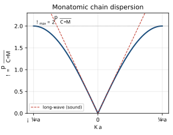
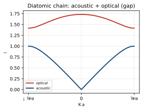
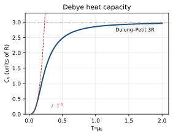

<!-- 固態物理 單元04：聲子／晶格振動（Phonons / Lattice Vibrations） · 從高中到資格考 -->

# 固態物理 單元04 — 聲子／晶格振動（Phonons / Lattice Vibrations）
### 從高中概念建到資格考

> **使用說明**：本篇從你高中會的東西（簡諧運動 $F=-kx$、波 $y=A\sin(kx-\omega t)$、單變數微分、等比級數）出發，一路接到 Kittel 第 4–5 章等級。符號點 `▸` 就地展開（你高中學過的→為什麼→定義→範例1/2/3）。專有名詞第一次出現用「中文（English）」對照。配套：[單元整理](../考古題/單元整理.html)（出題頻率）、[逐題詳解](../考古題/詳解/index.html)、[教材直讀](../教材/index.html)。
> **慣例（本篇符號）**：原子質量 $M$（雙原子鏈用 $M_1,M_2$）；最近鄰力常數／等效彈簧常數（force constant / spring constant）$C$；晶格間距（lattice spacing）$a$；第 $n$（或第 $s$）顆原子的位移 $u_n$；波向量（wavevector）$k$（部分題目寫 $K$，本篇統一用 $k$，引用原卷時保留）；角頻率（angular frequency）$\omega$；行波 $u_n=A\,e^{i(kna-\omega t)}$；普朗克常數 $\hbar$、波茲曼常數 $k_B$；第一布里淵區（first Brillouin zone, BZ）$-\pi/a\le k\le\pi/a$；截止頻率（cutoff frequency）$\omega_{\max}$；德拜頻率（Debye frequency）$\omega_D$、德拜溫度 $\Theta_D$。
>
> 📖 **本單元權威出處與教材對照（Textbook & Reference Alignment）**：
> - **Kittel 原文 8e**：Chapter 4（Phonons I: Crystal Vibrations, pp. 85–104）＆ Chapter 5（Phonons II: Thermal Properties, pp. 105–130），核心公式：Ch. 4 Eq. (9)–(16) 單原子鏈色散、Eq. (20)–(27) 雙原子鏈光學/聲學支；Ch. 5 Eq. (27)–(30) 德拜 $T^3$ 定律。
> - **林盛煇《固態物理導論》**：第 4 章（§4.1 晶格振動、§4.2 單原子鏈色散、§4.3 雙原子鏈與聲學/光學支、§4.4 德拜與愛因斯坦熱容模型、§4.5 非諧振效應）。
> - **Ashcroft & Mermin**：Ch. 22（Harmonic Crystal）、Ch. 23（Thermal Properties of the Harmonic Crystal）。
> - **臺大資格考真題對照**：2013–2025 共 11 次命題（2013, 2014, 2015, 2016, 2018, 2019, 2020, 2021, 2022, 2023, 2024），第一梯隊高頻命題區。

---

## 🧭 為什麼要這個單元？（在解決什麼問題、與其他章節的關係）

### 為什麼要學「聲子／晶格振動」？

unit01 把原子**釘死**在格點上（靜態圖像）。但原子其實一直在平衡位置附近**振動**——這些振動帶走熱、決定固體比熱、還會散射電子（這是金屬電阻隨溫度上升的主因）。把「晶格的集體振動」量子化，就得到**聲子（phonon）**。第一梯隊、年年必考。

### 在解決什麼問題？

> **核心問題**：一整排用彈簧連起來的原子會怎麼**集體振動**？由此得到的振動如何解釋固體比熱在低溫趨近 $T^3$（古典理論完全給不出來）？

做法：把晶體當成一串彈簧，解簡正模得**色散關係** $\omega(k)$；單原子鏈 $\omega=\omega_{\max}|\sin(ka/2)|$，雙原子鏈分出**聲學支與光學支**。再用德拜模型把模式數加總，得到 $C_V\propto T^3$。

### 與其他章節的關係

| 相關章節 | 關係 |
|---|---|
| **01 晶體結構（往前接）** | 原胞與 basis 原子數 $p$ 決定支數：3D 共 $3p$ 支（3 聲學 + $3p-3$ 光學） |
| **02 倒晶格（往前接）** | 色散畫在第一布里淵區內；$k$ 只取 BZ 範圍 |
| **03 鍵結（往前接）** | 彈簧常數 = 鍵結位能井的曲率 $U''(r_0)$ |
| **05 自由電子（對照）** | 低溫總比熱 = 電子 $\gamma T$ + 聲子 $A T^3$，故 $C/T=\gamma+AT^2$ |

> **一句話**：unit01 講晶格「不動的樣子」，unit04 講它「怎麼動」——而動的舞台（BZ）來自 unit02、彈簧硬度來自 unit03。

---

## 🎯 這個單元在考什麼（出題地位）

聲子是**第一梯隊（幾乎年年考）**單元：2013–2025 共 13 卷裡出現 **11 次**，且 2019 起的「四大段固定結構」（Crystal structure / Diffraction / **Phonons** / Electrons）每卷必有一段就是它。典型配分 **10–25%**。整個單元其實只繞著**一條色散關係** $\omega=2\sqrt{C/M}\,|\sin(ka/2)|$ 打轉——把它推熟，再延伸到複數 $k$、雙原子鏈、與比熱，就能吃下絕大多數配分。

| 最常見題型 | 出過的年份 | 對應本篇章節 |
|---|---|---|
| 單原子鏈色散、$\omega_{\max}$、群速 vs 相速 | 2013, 2019, 2020, 2021, 2023 | §3, §4 |
| $\omega>\omega_{\max}\Rightarrow k$ 複數 → 衰減波（evanescent） | 2020, 2021, 2024 | §5 |
| 由聲速／質量／間距求彈簧常數 $C$ 與 $\omega_{\max}$ | 2023 | §6 |
| 雙原子鏈：聲學支／光學支、能隙 | （高頻變化題；2016/2018 點名） | §7 |
| 德拜 $T^3$（低溫）與杜隆–珀蒂（高溫）、愛因斯坦模型 | 2013, 2014, 2015, 2016 | §8, §9 |
| 電子＋聲子比熱 $C/T=\gamma+AT^2$ | 2014, 2015 | §9 |
| 聲子為何是準粒子、非諧性與熱膨脹 | 2018, 2020, 2021 | §10 |

> **一句話**：這個單元的主軸是「**把晶格當一串彈簧→寫牛頓方程→代行波解→得色散關係**」，剩下全是這條關係的不同讀法（最高頻、群速、衰減波、態數→比熱）。

## 🧗 高中起點：你已經會的

- **簡諧運動（simple harmonic motion）$F=-kx$**：彈簧把質量拉回平衡點，解是 $x=A\cos(\omega t+\phi)$、$\omega=\sqrt{k/m}$。← 每顆原子就是一個被鄰居彈簧拉住的諧振子。
- **波 $y=A\sin(kx-\omega t)$**：波向量 $k=2\pi/\lambda$、角頻率 $\omega=2\pi f$、波速 $v=\omega/k$。← 晶格振動就是這種波，只是格點是離散的。
- **單變數微分**：求極值令 $d\omega/dk=0$、求斜率 $d\omega/dk$。← 找 $\omega_{\max}$、算群速。
- **三角恆等式**：$2\cos\theta-2=-4\sin^2(\theta/2)$、和差化積。← 把離散牛頓方程化成 $\sin^2$ 形式。
- **歐拉公式 $e^{i\phi}=\cos\phi+i\sin\phi$**：相位相加、$e^{ika}+e^{-ika}=2\cos ka$。← 代行波解的核心代數。
- **等比級數 $\sum r^n$、定積分**：算「$k$ 空間裡有幾個模」、算比熱積分。← 德拜模型的態數計算。
- **能量均分定理（equipartition）每自由度 $\tfrac12k_BT$**：← 杜隆–珀蒂高溫極限。

---

## 📚 主線：從高中一路推到考試級

### 1. 從一顆諧振子到「一串彈簧」（normal modes）

**你高中學過的**：一個質量 $m$ 掛在彈簧上，受力 $F=-kx$（胡克定律，Hooke's law），牛頓第二定律 $m\ddot x=-kx$，解出 $x=A\cos(\omega t)$、$\omega=\sqrt{k/m}$。這是**一個**自由度的振動。

**為什麼需要新東西**：晶體裡有 $\sim10^{23}$ 顆原子，每顆都被左右鄰居的「鍵」（在小位移下等效成彈簧）拉住。它們不是各自獨立振動，而是**耦合**在一起——推一顆，鄰居跟著動。我們需要一套方法描述「一整串耦合彈簧」的集體運動。

**關鍵概念：簡正模（normal mode）**。耦合系統的運動看似很亂，但永遠可以拆成若干個「**整體一起以同一頻率振動**」的基本花樣，每個花樣叫一個簡正模。一維單原子鏈的簡正模，恰好就是一個個**行波**（travelling wave）$u_n=A\,e^{i(kna-\omega t)}$——每個波向量 $k$ 對應一個模、一個頻率 $\omega(k)$。

<b>▸ 第 n 顆原子的位移 u_n（displacement）</b>

### 你高中學過的
單一質量振動寫 $x(t)=A\cos\omega t$，$x$ 是「離開平衡點多遠」。

### 為什麼要這個
現在有很多顆原子排成一列，第 $n$ 顆的平衡位置在 $x_n=na$（$a$ 是間距）。我們要的是「**每一顆各自離開自己平衡點多遠**」，所以位移要帶下標 $n$，寫 $u_n(t)$。

### 定義
$u_n(t)=$ 第 $n$ 顆原子在時刻 $t$ 偏離平衡位置 $na$ 的位移。對縱波（longitudinal）$u_n$ 沿鏈方向、對橫波（transverse）垂直鏈方向，數學形式一樣。

**範例 1（最接近高中）**：只有一顆原子（$N=1$），$u_0=A\cos\omega t$，退化回普物的諧振子。
**範例 2（中階）**：行波解 $u_n=A\cos(kna-\omega t)$——把連續波 $y=A\cos(kx-\omega t)$ 的 $x$ 換成離散的 $x_n=na$。
**範例 3（考題用法）**：2013 用 $u_s=u\cos(\omega t-sKa)$ 算每顆原子的平均能量；2021 用 $u_n=A\cos(kna-\omega t)$ 畫振幅分布。

<b>▸ 力常數／等效彈簧常數 C（force constant）</b>

### 你高中學過的
彈簧的胡克定律 $F=-kx$，$k$ 是「拉長單位長度要多大力」。

### 為什麼要這個
原子之間不是真的有彈簧，而是有鍵結位能 $U(r)$。但在平衡點 $r_0$ 附近做泰勒展開（Taylor expansion）：
$$U(r)\approx U(r_0)+\tfrac12 U''(r_0)\,(r-r_0)^2+\cdots$$
一次項為零（平衡點是極小），二次項就是「等效彈簧」，其係數 $C\equiv U''(r_0)$。這叫**諧近似（harmonic approximation）**——只保留到二次。

### 定義
$C=U''(r_0)$＝鍵結位能在平衡點的曲率＝原子間的等效彈簧常數，單位 N/m。

**範例 1（最接近高中）**：拋物線位能 $U=\tfrac12 C x^2$ → 力 $F=-Cx$，標準彈簧。
**範例 2（中階）**：由聲速反推 $C$（見 §6）：$C=M(v_s/a)^2$。
**範例 3（考題用法）**：2023 給 $v_s,M,a$ 算出 $C\approx30$ N/m（典型共價／離子鍵量級）。

> **小結**：把晶格看成「質量 $M$ ＋ 彈簧 $C$ ＋ 間距 $a$」的一串耦合諧振子；它的簡正模就是行波，每個 $k$ 一個模。下一步寫出運動方程。

<figure style="margin:1.3em 0;text-align:center">
<svg viewBox="0 0 640 180" width="100%" style="max-width:680px;border:1px solid #ddd;border-radius:8px;background:#fff;padding:6px;box-sizing:border-box" xmlns="http://www.w3.org/2000/svg">
<defs>
<radialGradient id="ballm1" cx="35%" cy="30%" r="75%"><stop offset="0" stop-color="#84b4df"/><stop offset="1" stop-color="#1a4d7c"/></radialGradient>
<marker id="arm1" markerWidth="9" markerHeight="9" refX="6.5" refY="3" orient="auto"><path d="M0,0 L6,3 L0,6 Z" fill="#c0392b"/></marker>
</defs>
<g font-family="-apple-system,sans-serif" font-size="12">
<line x1="20" y1="100" x2="620" y2="100" stroke="#eee" stroke-width="1"/>
<path d="M70,100 L92,100 L98,90 L110,110 L122,90 L134,110 L146,90 L152,100 L170,100" fill="none" stroke="#888" stroke-width="1.6"/>
<path d="M190,100 L212,100 L218,90 L230,110 L242,90 L254,110 L266,90 L272,100 L290,100" fill="none" stroke="#888" stroke-width="1.6"/>
<path d="M310,100 L332,100 L338,90 L350,110 L362,90 L374,110 L386,90 L392,100 L410,100" fill="none" stroke="#888" stroke-width="1.6"/>
<path d="M430,100 L452,100 L458,90 L470,110 L482,90 L494,110 L506,90 L512,100 L530,100" fill="none" stroke="#888" stroke-width="1.6"/>
<path d="M20,100 L40,100 L46,92 L34,108 L52,92 L40,100 L70,100" fill="none" stroke="#bbb" stroke-width="1.4" stroke-dasharray="3,3"/>
<path d="M550,100 L572,100 L578,92 L566,108 L584,92 L572,100 L620,100" fill="none" stroke="#bbb" stroke-width="1.4" stroke-dasharray="3,3"/>
<g fill="url(#ballm1)" stroke="#13395d" stroke-width="0.8"><circle cx="60" cy="100" r="14"/><circle cx="180" cy="100" r="14"/><circle cx="300" cy="100" r="14"/><circle cx="420" cy="100" r="14"/><circle cx="540" cy="100" r="14"/></g>
<text x="300" y="105" text-anchor="middle" fill="#fff" font-size="11">M</text>
<line x1="300" y1="100" x2="332" y2="100" stroke="#c0392b" stroke-width="2" marker-end="url(#arm1)"/>
<text x="316" y="80" text-anchor="middle" fill="#c0392b" font-size="11">uₙ</text>
<line x1="60" y1="148" x2="180" y2="148" stroke="#1a4d7c" stroke-width="1.2"/>
<line x1="60" y1="144" x2="60" y2="152" stroke="#1a4d7c" stroke-width="1.2"/>
<line x1="180" y1="144" x2="180" y2="152" stroke="#1a4d7c" stroke-width="1.2"/>
<text x="120" y="164" text-anchor="middle" fill="#1a4d7c" font-size="11">間距 a</text>
<text x="240" y="135" text-anchor="middle" fill="#888" font-size="11">彈簧常數 C</text>
<text x="60" y="46" text-anchor="middle" fill="#555" font-size="11">n−1</text>
<text x="180" y="46" text-anchor="middle" fill="#555" font-size="11">n</text>
<text x="300" y="46" text-anchor="middle" fill="#1a4d7c" font-size="11" font-weight="bold">n+1（位移 uₙ）</text>
<text x="420" y="46" text-anchor="middle" fill="#555" font-size="11">n+2</text>
<text x="540" y="46" text-anchor="middle" fill="#555" font-size="11">n+3</text>
</g>
</svg>
<figcaption style="font-size:0.9em;color:#555;margin-top:0.5em">一維單原子鏈的物理模型：等質量 <b>M</b> 的原子排成一列、平衡間距 <b style="color:#1a4d7c">a</b>，相鄰用等效彈簧（力常數 <b>C</b>）相連。第 n 顆偏離平衡位置的量記作 <b style="color:#c0392b">uₙ</b>。推一顆，左右鄰居被彈簧拉著一起動 → 這是「耦合諧振子串」，它的簡正模就是行波 uₙ = A·cos(kna−ωt)。<b>考點</b>：別把 uₙ 想成原子的「絕對位置」，它是相對平衡點 na 的小位移。</figcaption>
</figure>

### 2. 單原子鏈的運動方程（equation of motion）

**你高中學過的**：單一彈簧 $m\ddot x=-kx$。

**為什麼需要新東西**：第 $n$ 顆原子被**左右兩條**彈簧拉。右邊彈簧的伸長量 = $u_{n+1}-u_n$，左邊彈簧的伸長量 = $u_n-u_{n-1}$。每條彈簧的回復力 = $C\times$ 伸長量。

#### Step 1 — 把兩條彈簧的力加起來

右鄰把第 $n$ 顆往右拉的力 = $C(u_{n+1}-u_n)$；左鄰把它往左拉的力 = $-C(u_n-u_{n-1})$。合力：
$$F_n=C(u_{n+1}-u_n)-C(u_n-u_{n-1})=C\,(u_{n+1}+u_{n-1}-2u_n).$$

> **小結**：合力只看「鄰居比我高還是比我低」——這是**離散版的二階空間微分**（$u_{n+1}+u_{n-1}-2u_n\approx a^2\,d^2u/dx^2$）。

#### Step 2 — 牛頓第二定律

$$\boxed{M\ddot u_n=C\,(u_{n+1}+u_{n-1}-2u_n).}$$

這就是單原子鏈的運動方程，對每一個 $n$ 都成立（無限多條耦合方程）。下一節用一個聰明的試解，把這無限多條方程壓成**一條** $\omega(k)$。

> **小結**：$M\ddot u_n=C(u_{n+1}+u_{n-1}-2u_n)$ 是本單元的「母方程」，後面所有結果（色散、$\omega_{\max}$、群速、衰減波）都從它長出來。

### 3. 單原子鏈色散關係（dispersion relation）★本單元核心

> 📖 **本節核心出處與說明（Ref）**：
> - **權威教材**：Kittel 8e Ch. 4 Eq. (13)–(16) pp. 89–91 ｜ 林盛煇 §4.2 ｜ A&M Ch. 22
> - **歷年考題**：[NTU 2013](../考古題/詳解/固態_2013_詳解.html), [2019](../考古題/詳解/固態_2019_詳解.html), [2021](../考古題/詳解/固態_2021_詳解.html), [2023 Q3](../考古題/詳解/固態_2023_詳解.html)
> - **觀念說明**：波動色散 $\omega(K) = 2\sqrt{C/M}|\sin(Ka/2)|$；長波聲速 $v_s = a\sqrt{C/M}$；第一布里淵區邊界群速度 $v_g = d\omega/dK = 0$（駐波形成）。

**你高中學過的**：波 $y=A\sin(kx-\omega t)$，且對一般的繩波 $\omega=vk$（頻率正比於波向量，**線性、無色散**）。

**為什麼需要新東西**：晶格是離散的（格點間距 $a$），不是連續弦。我們會發現 $\omega$ 與 $k$ **不再是線性**關係，而是 $\sin$ 函數——這個 $\omega(k)$ 就叫**色散關係（dispersion relation）**。「色散」一詞來自：不同 $k$（波長）的波跑得速度不同。

<b>▸ 波向量 k（wavevector）與第一布里淵區（first BZ）</b>

### 你高中學過的
波 $y=A\sin(kx-\omega t)$ 裡 $k=2\pi/\lambda$，描述「每單位長度轉幾圈相位」。

### 為什麼要這個
在離散晶格上，位移只在格點 $x_n=na$ 取值。相鄰格點相位差 $=ka$。但 $ka$ 和 $ka+2\pi$ 給**完全相同**的格點運動（$e^{i(ka+2\pi)n}=e^{ikan}$，因為 $n$ 是整數）。所以 $k$ 只有 $2\pi/a$ 寬的範圍是「不同的物理」，習慣取
$$-\frac\pi a\le k\le\frac\pi a\quad(\text{第一布里淵區，first BZ}).$$

### 定義
$k$＝相鄰格點相位差除以 $a$；物理上不同的 $k$ 全落在第一 BZ 內。$k=\pi/a$（區邊界）對應最短波長 $\lambda=2a$（相鄰原子反相）。

**範例 1（最接近高中）**：$k\to0$ → $\lambda\to\infty$，整段一起平移（長波、聲波）。
**範例 2（中階）**：$k=\pi/a$ → 相鄰原子一上一下、波長 $2a$（駐波）。
**範例 3（考題用法）**：2018 比較「聲子能帶 vs 電子能帶在 BZ 中的 momentum/$k$ 差異」；兩者都週期、都限在第一 BZ。

#### Step 1 — 代入行波試解

設第 $n$ 顆原子做行波運動：
$$u_n=A\,e^{i(kna-\omega t)}.$$
則 $\ddot u_n=-\omega^2 u_n$。又
$$u_{n\pm1}=A\,e^{i(k(n\pm1)a-\omega t)}=u_n\,e^{\pm ika}.$$

> **小結**：行波試解的妙處——所有原子只差一個相位因子 $e^{\pm ika}$，無限多條方程會塌成同一條。

#### Step 2 — 代入母方程

把上面代入 $M\ddot u_n=C(u_{n+1}+u_{n-1}-2u_n)$：
$$-M\omega^2 u_n=C\big(e^{ika}+e^{-ika}-2\big)u_n.$$
兩邊約掉 $u_n$，用歐拉公式 $e^{ika}+e^{-ika}=2\cos ka$：
$$-M\omega^2=C(2\cos ka-2).$$

> **小結**：$u_n$ 約掉了——這正是「行波是簡正模」的數學表現。剩下一條純 $\omega$–$k$ 關係。

#### Step 3 — 用三角恆等式整理

用 $2\cos ka-2=-4\sin^2(ka/2)$（半角恆等式）：
$$-M\omega^2=-4C\sin^2\!\frac{ka}{2}\quad\Longrightarrow\quad \omega^2=\frac{4C}{M}\sin^2\!\frac{ka}{2}.$$
開根號（$\omega\ge0$）：
$$\boxed{\omega(k)=2\sqrt{\frac{C}{M}}\;\Big|\sin\frac{ka}{2}\Big|.}\qquad(\text{單原子鏈色散關係})$$

> **小結**：一個試波 ＋ 一行三角恆等式，把無限多顆耦合方程壓成**這一條**。背它！後面所有東西都是它的讀法。

#### Step 4 — 兩個極限讀數

- **長波（小 $k$，聲學極限）**：$\sin(ka/2)\approx ka/2$，所以
$$\omega\approx2\sqrt{\frac{C}{M}}\cdot\frac{ka}{2}=a\sqrt{\frac{C}{M}}\;k\equiv v_s\,k.$$
線性！跟普通聲波一樣，**聲速** $v_s=a\sqrt{C/M}$。
- **區邊界（$k=\pi/a$）**：$\sin(\pi/2)=1$，$\omega$ 取最大值
$$\boxed{\omega_{\max}=2\sqrt{\frac{C}{M}}.}$$
這是這條鏈能撐起的**最高頻率（截止頻率）**——能帶有頂。

> **小結**：低頻像聲波（線性、聲速 $v_s=a\sqrt{C/M}$）；高頻飽和到 $\omega_{\max}=2\sqrt{C/M}$。這兩個讀數＋一條色散，幾乎涵蓋所有單原子鏈考題。

<b>📝 更多範例（點開）：色散關係的代數推導逐步練</b>

**範例 A（從歐拉公式到 $\cos ka$，每步展開）**：行波代入後出現 $e^{ika}+e^{-ika}$。用歐拉公式 $e^{i\theta}=\cos\theta+i\sin\theta$ 與 $e^{-i\theta}=\cos\theta-i\sin\theta$ 相加：

$$e^{ika}+e^{-ika}=(\cos ka+i\sin ka)+(\cos ka-i\sin ka).$$

把實部與虛部分開：$\cos ka+\cos ka=2\cos ka$；$+i\sin ka-i\sin ka=0$。所以

$$e^{ika}+e^{-ika}=2\cos ka.$$

於是 $C(e^{ika}+e^{-ika}-2)=C(2\cos ka-2)$，這正是 Step 2 用到的那一步——虛部完全抵消、結果是純實數（因為 $\omega^2$ 必須是實的）。

**範例 B（半角恆等式 $2\cos\theta-2=-4\sin^2(\theta/2)$ 的來源）**：取餘弦的倍角公式 $\cos\theta=1-2\sin^2(\theta/2)$。代入：

$$2\cos\theta-2=2\big(1-2\sin^2\tfrac\theta2\big)-2=2-4\sin^2\tfrac\theta2-2=-4\sin^2\tfrac\theta2.$$

令 $\theta=ka$ 即得 $2\cos ka-2=-4\sin^2(ka/2)$。代回 $-M\omega^2=C(2\cos ka-2)$：

$$-M\omega^2=-4C\sin^2\!\frac{ka}{2}\ \Rightarrow\ \omega^2=\frac{4C}{M}\sin^2\!\frac{ka}{2}\ \Rightarrow\ \omega=2\sqrt{\tfrac CM}\,\big|\sin\tfrac{ka}2\big|.$$

開根號時 $\sqrt{\sin^2 x}=|\sin x|$（不是 $\sin x$），所以要加絕對值——$\omega\ge0$ 是頻率。

**範例 C（長波極限的近似，逐步代）**：小 $k$ 時 $\dfrac{ka}{2}$ 很小，用 $\sin x\approx x$（$x\ll1$）：

$$\omega=2\sqrt{\tfrac CM}\,\sin\tfrac{ka}2\approx2\sqrt{\tfrac CM}\cdot\tfrac{ka}2=\sqrt{\tfrac CM}\,a\,k.$$

中間的 $2$ 與 $\tfrac12$ 相消，得 $\omega\approx(a\sqrt{C/M})\,k$，係數 $v_s=a\sqrt{C/M}$ 就是聲速。對照普通弦波 $\omega=vk$，形狀一模一樣——這說明長波聲子就是聲波。

**範例 D（區邊界數值，代 $k=\pi/a$）**：把 $k=\pi/a$ 代入 $\dfrac{ka}{2}=\dfrac{\pi}{2}$：

$$\omega=2\sqrt{\tfrac CM}\,\big|\sin\tfrac\pi2\big|=2\sqrt{\tfrac CM}\times1=2\sqrt{\tfrac CM}=\omega_{\max}.$$

驗一個具體數：若 $C=15$ N/m、$M=2\times10^{-26}$ kg，則 $\sqrt{C/M}=\sqrt{15/2\times10^{-26}}=\sqrt{7.5\times10^{26}}\approx2.74\times10^{13}$ s⁻¹，故 $\omega_{\max}=2\times2.74\times10^{13}\approx5.48\times10^{13}$ rad/s。

<figure style="margin:1.3em 0;text-align:center">
<svg viewBox="0 0 560 320" width="100%" style="max-width:600px;border:1px solid #ddd;border-radius:8px;background:#fff;padding:6px;box-sizing:border-box" xmlns="http://www.w3.org/2000/svg">
<g font-family="-apple-system,sans-serif" font-size="12">
<line x1="60" y1="250" x2="520" y2="250" stroke="#333" stroke-width="1.4"/>
<line x1="290" y1="270" x2="290" y2="40" stroke="#333" stroke-width="1.4"/>
<rect x="135" y="40" width="310" height="210" fill="#6aa1d6" fill-opacity="0.10"/>
<line x1="135" y1="40" x2="135" y2="258" stroke="#c0392b" stroke-width="1.2" stroke-dasharray="5,4"/>
<line x1="445" y1="40" x2="445" y2="258" stroke="#c0392b" stroke-width="1.2" stroke-dasharray="5,4"/>
<line x1="135" y1="65" x2="445" y2="65" stroke="#2e8b2e" stroke-width="1" stroke-dasharray="4,3"/>
<polyline points="135,107 152,109 170,116 188,127 206,142 224,161 242,183 260,207 278,233 290,250 302,233 320,207 338,183 356,161 374,142 392,127 410,116 428,109 445,107" fill="none" stroke="#1a4d7c" stroke-width="2.4"/>
<line x1="290" y1="250" x2="335" y2="195" stroke="#e67e22" stroke-width="2"/>
<text x="350" y="200" fill="#e67e22" font-size="11">斜率 = vₛ（聲速）</text>
<circle cx="445" cy="65" r="3.5" fill="#c0392b"/>
<circle cx="135" cy="65" r="3.5" fill="#c0392b"/>
<text x="460" y="58" fill="#2e8b2e" font-size="11">群速 vg = 0</text>
<text x="455" y="80" fill="#2e8b2e" font-size="10.5">（切線水平）</text>
<text x="62" y="62" fill="#2e8b2e" font-size="11">ωmax = 2√(C/M)</text>
<text x="530" y="254" text-anchor="middle" fill="#333" font-size="13">k</text>
<text x="290" y="32" text-anchor="middle" fill="#333" font-size="13">ω</text>
<text x="135" y="274" text-anchor="middle" fill="#c0392b" font-size="11">−π/a</text>
<text x="445" y="274" text-anchor="middle" fill="#c0392b" font-size="11">+π/a</text>
<text x="290" y="290" text-anchor="middle" fill="#555" font-size="11.5">第一布里淵區（first BZ）：−π/a ≤ k ≤ +π/a</text>
<text x="290" y="308" text-anchor="middle" fill="#888" font-size="10.5">區外 k 與區內某 k 等價（差一個倒晶格向量 2π/a）→ 只畫第一區即可</text>
</g>
</svg>
<figcaption style="font-size:0.9em;color:#555;margin-top:0.5em">單原子鏈色散 ω = 2√(C/M)·|sin(ka/2)|。<b>三個必背讀數</b>：(1) 原點附近近似直線，斜率 = <b style="color:#e67e22">聲速 vₛ = a√(C/M)</b>；(2) <b style="color:#2e8b2e">BZ 邊界 k = ±π/a 處曲線變平 → 群速 vg = dω/dk = 0</b>（聲子在此「站住不傳」，形成駐波）；(3) 頂端飽和到 <b style="color:#2e8b2e">ωmax = 2√(C/M)</b>。只需畫<b style="color:#c0392b">第一布里淵區 [−π/a, +π/a]</b>，因為區外的 k 都能減去倒晶格向量 2π/a 折回區內、代表同一個物理模。</figcaption>
</figure>

### 4. 群速 vs 相速（group velocity vs phase velocity）

**你高中學過的**：波速 $v=\omega/k=f\lambda$。對 $y=A\sin(kx-\omega t)$，波形以這個速度前進。

**為什麼需要新東西**：當色散非線性（$\omega$ 不正比於 $k$），「波形前進速度」和「能量／訊號傳遞速度」**不再相同**。聲子是一份局域化的振動量子（一包波，wave packet），它攜帶能量的速度是**群速**，不是相速。

<b>▸ 相速 v_p（phase velocity）與群速 v_g（group velocity）</b>

### 你高中學過的
單一正弦波 $y=A\cos(kx-\omega t)$ 的波前以 $v_p=\omega/k$ 前進。

### 為什麼要這個
「一包波」（很多接近 $k$ 的波疊起來的波包）整體移動的速度是 $v_g=d\omega/dk$。色散非線性時 $v_p\ne v_g$。聲子＝波包，能量輸運用 $v_g$。

### 定義
$$v_p=\frac{\omega}{k}\quad(\text{單一波前}),\qquad v_g=\frac{d\omega}{dk}\quad(\text{波包／能量}).$$
長波極限 $k\to0$ 兩者相等，等於聲速 $v_s$。

**範例 1（最接近高中）**：無色散弦 $\omega=vk$ → $v_p=v_g=v$（常數，兩者同）。
**範例 2（中階）**：單原子鏈長波 $\omega\approx a\sqrt{C/M}\,k$ → $v_p=v_g=v_s=a\sqrt{C/M}$。
**範例 3（考題用法）**：2019 問「聲子速度」，答案取群速 $v_g=a\sqrt{C/M}\cos(ka/2)$；BZ 邊界 $v_g=0$（駐波），但 $v_p=\dfrac{2\sqrt{C/M}}{\pi/a}\ne0$——必須用群速才對。

#### Step 1 — 算群速

對 $\omega=2\sqrt{C/M}\,\sin(ka/2)$（取 $0\le k\le\pi/a$，$\sin>0$ 去掉絕對值）微分：
$$v_g=\frac{d\omega}{dk}=2\sqrt{\frac{C}{M}}\cdot\frac{a}{2}\cos\frac{ka}{2}=\boxed{a\sqrt{\frac{C}{M}}\cos\frac{ka}{2}.}$$

- **長波 $k\to0$**：$\cos\to1$ → $v_g=v_s=a\sqrt{C/M}$（聲速）。
- **區邊界 $k=\pi/a$**：$\cos(\pi/2)=0$ → $v_g=0$ → **駐波，不傳能量**。

#### Step 2 — 速度 vs 頻率（消去 $k$）

令 $\sin(ka/2)=\omega/\omega_{\max}$，則 $\cos(ka/2)=\sqrt{1-(\omega/\omega_{\max})^2}$，代入 $v_g$：
$$\boxed{v_g=v_s\sqrt{1-\Big(\frac{\omega}{\omega_{\max}}\Big)^2}.}$$
這是一條**四分之一橢圓**：$\omega=0$ 時 $v_g=v_s$（最快）；$\omega\to\omega_{\max}$ 時 $v_g\to0$。**低頻聲子跑得快（接近聲速），高頻越跑越慢，到截止頻率成駐波。**

> **小結**：聲子速度＝群速 $v_g=a\sqrt{C/M}\cos(ka/2)$；長波值＝聲速、區邊界＝0。問「聲子跑多快」一律用 $v_g$。

<b>📝 更多範例（點開）：群速、相速、BZ 邊界為何為 0</b>

**範例 A（對 $\omega=2\sqrt{C/M}\sin(ka/2)$ 微分，逐步用連鎖律）**：令 $f(k)=\sin(ka/2)$。連鎖律 $\dfrac{d}{dk}\sin(u)=\cos(u)\cdot\dfrac{du}{dk}$，其中 $u=ka/2$、$\dfrac{du}{dk}=\dfrac a2$。所以

$$v_g=\frac{d\omega}{dk}=2\sqrt{\tfrac CM}\cdot\cos\tfrac{ka}2\cdot\frac a2=a\sqrt{\tfrac CM}\,\cos\frac{ka}2.$$

那個 $2$（來自 $\omega$ 前係數）與 $\tfrac a2$（來自連鎖律）的 $2$ 又相消，留下乾淨的 $a\sqrt{C/M}\cos(ka/2)$。

**範例 B（區邊界 $v_g=0$ 但 $v_p\ne0$，兩個都算給你看）**：在 $k=\pi/a$，群速

$$v_g=a\sqrt{\tfrac CM}\,\cos\tfrac\pi2=a\sqrt{\tfrac CM}\times0=0\quad(\text{駐波，不傳能量}).$$

相速則是 $v_p=\dfrac\omega k=\dfrac{2\sqrt{C/M}}{\pi/a}=\dfrac{2a}{\pi}\sqrt{\tfrac CM}\approx0.637\,a\sqrt{\tfrac CM}\ne0$。同一點 $v_g=0$ 卻 $v_p\ne0$——這就是「問聲子速度必須用群速」的鐵證。

**範例 C（速度–頻率關係 $v_g=v_s\sqrt{1-(\omega/\omega_{\max})^2}$ 的推導）**：由 $\sin(ka/2)=\omega/\omega_{\max}$，用 $\cos^2+\sin^2=1$：

$$\cos\tfrac{ka}2=\sqrt{1-\sin^2\tfrac{ka}2}=\sqrt{1-\Big(\frac\omega{\omega_{\max}}\Big)^2}.$$

代入 $v_g=a\sqrt{C/M}\cos(ka/2)=v_s\cos(ka/2)$（因 $v_s=a\sqrt{C/M}$）：

$$v_g=v_s\sqrt{1-\Big(\frac\omega{\omega_{\max}}\Big)^2}.$$

這是一條四分之一橢圓：$\omega=0\Rightarrow v_g=v_s$（最快）；$\omega=\omega_{\max}\Rightarrow v_g=0$。

**範例 D（中段一個數值點）**：取 $\omega=\tfrac12\omega_{\max}$，即 $\sin(ka/2)=\tfrac12\Rightarrow ka/2=\pi/6$。則

$$v_g=v_s\cos\tfrac\pi6=v_s\cdot\frac{\sqrt3}2\approx0.866\,v_s.$$

用橢圓公式對照：$v_g=v_s\sqrt{1-(1/2)^2}=v_s\sqrt{3/4}=\tfrac{\sqrt3}2 v_s$——兩種算法一致 ✓。

### 5. $\omega>\omega_{\max}$：複數 $k$ 與衰減波（evanescent wave）★高頻必考

> 📖 **本節核心出處與說明（Ref）**：
> - **權威教材**：Kittel 8e Ch. 4 p. 91 ｜ 林盛煇 §4.2
> - **歷年考題**：[NTU 2020 Q4](../考古題/詳解/固態_2020_詳解.html), [2021 Q4](../考古題/詳解/固態_2021_詳解.html), [2024 Q3](../考古題/詳解/固態_2024_詳解.html)
> - **觀念說明**：頻率超過最高截止頻率 $\omega > \omega_{\max}$ 時波數變為複數 $k = \pi/a + i\kappa$，行波轉變為指數衰減的倏逝波（Evanescent wave），相鄰原子反相震盪。

**你高中學過的**：方程 $\sin\theta=2$ 在**實數**裡無解（$\sin$ 最大只到 1）。但延拓到複數，$\sin$ 可以超過 1。

**為什麼需要新東西**：色散 $\sin(ka/2)=\omega/\omega_{\max}$。若外界硬用 $\omega>\omega_{\max}$ 的頻率去驅動晶格（例如一側受高頻聲壓、或拿可見光打離子），右邊 $>1$——**沒有實數 $k$ 滿足**。物理上會發生什麼？$k$ 變成複數，波不再傳播，而是**指數衰減**。

#### Step 1 — 為何沒有實 $k$

要 $\omega>\omega_{\max}=2\sqrt{C/M}$，需 $\sin^2(ka/2)=\dfrac{M\omega^2}{4C}>1$。實數 $k$ 做不到（$\sin^2\le1$）→ $k$ 必為複數。

#### Step 2 — 設 $k=\dfrac{\pi}{a}+i\kappa$（$\kappa>0$ 實）

代入並用 $\sin(\tfrac\pi2+i\theta)=\cos(i\theta)=\cosh\theta$：
$$\sin\!\Big(\frac{ka}{2}\Big)=\sin\!\Big(\frac\pi2+\frac{i\kappa a}{2}\Big)=\cosh\!\Big(\frac{\kappa a}{2}\Big)\ge1.$$
代回色散：$\omega=2\sqrt{C/M}\,\cosh(\kappa a/2)$，由 $\cosh(\kappa a/2)=\omega/\omega_{\max}$ 可解出 $\kappa>0$。

> **小結**：用 $\cosh$（雙曲餘弦，恒 $\ge1$）接手 $\sin$ 超過 1 的需求——這是複數 $k$ 延拓的關鍵代數。

#### Step 3 — 位移形態：指數衰減

$$u_n=A\,e^{ikna}=A\,e^{i\pi n}\,e^{-\kappa na}=\boxed{A\,(-1)^n\,e^{-\kappa na}.}$$
解讀：
- 因子 $(-1)^n$：相鄰原子**反相**（一上一下）。
- 因子 $e^{-\kappa na}$：振幅**隨深入晶體指數衰減**——只有靠近驅動面的幾層在動，再往裡幾乎不動。

這種「不傳播、指數衰減」的波叫**倏逝波／衰減波（evanescent wave）**。

#### Step 4 — 物理意義

晶體對 $\omega>\omega_{\max}$ 的擾動像「**全反射的帶止濾波器**」：能量被反射、只能滲入晶格數個原胞就死掉，沒有淨能量流（$v_g\to0$）。所以**單原子鏈是一個低通力學濾波器（low-pass mechanical filter）**，$\omega_{\max}$ 是截止頻率（cutoff），高於它的頻段是「禁帶／stop band」。

<b>▸ 衰減常數 κ（decay constant）與滲透深度</b>

### 你高中學過的
指數衰減 $N=N_0 e^{-x/\lambda}$（如放射性、RC 電路），$\lambda$ 是衰減的特徵長度。

### 為什麼要這個
$\omega>\omega_{\max}$ 時 $u_n\propto e^{-\kappa na}$，$\kappa$ 控制「衰減多快」。滲透深度（penetration depth）$\sim1/\kappa$。

### 定義
$\kappa$ 由 $\cosh(\kappa a/2)=\omega/\omega_{\max}$ 解出，$\kappa>0$。$\omega$ 越高於 $\omega_{\max}$，$\kappa$ 越大、衰減越快。

**範例 1（最接近高中）**：$\omega\to\omega_{\max}^+$ → $\cosh\to1$ → $\kappa\to0$（衰減長度發散，連續接上傳遞頻段）。
**範例 2（中階）**：$\omega\gg\omega_{\max}$ → $\kappa\approx\dfrac{2}{a}\ln(2\omega/\omega_{\max})$，衰減更快、滲透更淺。
**範例 3（考題用法）**：2024 整題就是「$\omega>\omega_{\max}$ 的波傳播方程式與物理意義」，答 $u_n\propto(-1)^n e^{-\kappa na}$ 的 evanescent 波；2020/2021 問「不傳音的振幅分布」也是這個。

> **小結**：$\omega>\omega_{\max}\Rightarrow k=\pi/a+i\kappa$ 複數 $\Rightarrow u_n\propto(-1)^n e^{-\kappa na}$ 指數衰減、不傳播。這是 2020/2021/2024 的共同答案。

<b>📝 更多範例（點開）：複數 k 與衰減波的代數細節</b>

**範例 A（$\sin(\pi/2+i\theta)=\cosh\theta$，逐步推）**：用和角公式 $\sin(\alpha+\beta)=\sin\alpha\cos\beta+\cos\alpha\sin\beta$，取 $\alpha=\pi/2$、$\beta=i\theta$：

$$\sin\!\Big(\tfrac\pi2+i\theta\Big)=\sin\tfrac\pi2\cos(i\theta)+\cos\tfrac\pi2\sin(i\theta)=1\cdot\cos(i\theta)+0\cdot\sin(i\theta)=\cos(i\theta).$$

再用 $\cos(i\theta)=\cosh\theta$（因 $\cos(ix)=\dfrac{e^{-x}+e^{x}}2=\cosh x$）。所以 $\sin(\pi/2+i\theta)=\cosh\theta\ge1$——這就是讓 $\sin$「超過 1」的機制。令 $\theta=\kappa a/2$，得色散 $\omega=2\sqrt{C/M}\cosh(\kappa a/2)$。

**範例 B（位移如何變成 $(-1)^n e^{-\kappa na}$，逐項拆）**：代 $k=\dfrac\pi a+i\kappa$ 進 $u_n=A e^{ikna}$：

$$u_n=A\,e^{i(\pi/a+i\kappa)na}=A\,e^{i\pi n}\,e^{i\cdot i\kappa na}=A\,e^{i\pi n}\,e^{-\kappa na}.$$

其中 $e^{i\pi n}=(\,e^{i\pi}\,)^n=(-1)^n$（因 $e^{i\pi}=-1$），且 $i\cdot i=-1$ 把指數變實負號。所以 $u_n=A(-1)^n e^{-\kappa na}$：$(-1)^n$ 給「相鄰反相」、$e^{-\kappa na}$ 給「往內指數衰減」。

**範例 C（解出 $\kappa$，給一個數值）**：由 $\cosh(\kappa a/2)=\omega/\omega_{\max}$ 反解 $\kappa=\dfrac2a\,\mathrm{arccosh}\dfrac{\omega}{\omega_{\max}}$。取 $\omega=1.2\,\omega_{\max}$：$\mathrm{arccosh}(1.2)=\ln(1.2+\sqrt{1.2^2-1})=\ln(1.2+\sqrt{0.44})=\ln(1.2+0.663)=\ln(1.863)\approx0.622$。故

$$\kappa=\frac2a\times0.622=\frac{1.24}{a},\qquad \text{滲透深度 }\frac1\kappa\approx0.8\,a.$$

只滲入不到一個晶格間距——波幾乎打不進去。

**範例 D（$\omega\gg\omega_{\max}$ 的漸近，用 $\cosh x\approx\tfrac12 e^x$）**：大 $x$ 時 $\cosh x\approx\tfrac12 e^x$，所以 $\dfrac{\omega}{\omega_{\max}}\approx\tfrac12 e^{\kappa a/2}$，兩邊取對數：

$$\frac{\kappa a}2\approx\ln\frac{2\omega}{\omega_{\max}}\ \Rightarrow\ \kappa\approx\frac2a\ln\frac{2\omega}{\omega_{\max}}.$$

頻率越高，$\kappa$ 越大、衰減越快、滲透越淺——高頻擾動完全被擋在表面。

### 6. 由聲速／質量／間距求彈簧常數與 $\omega_{\max}$（數值題）★2023

**你高中學過的**：$\omega=\sqrt{k/m}$ 反解 $k=m\omega^2$；單位換算。

**為什麼需要新東西**：考題常給「聲速 $v_s$、原子質量 $M$、間距 $a$」三個可測量，要你反推「等效彈簧常數 $C$」與「最高聲頻 $\omega_{\max}$」。鑰匙就是 §3 的兩個極限。

#### Step 1 — 由長波極限定聲速

長波斜率＝聲速：$v_s=a\sqrt{C/M}$。反解：
$$\boxed{C=M\Big(\frac{v_s}{a}\Big)^2.}$$

#### Step 2 — 代數字（2023 原題：$v_s=1.08\times10^4$ m/s，$M=6.1\times10^{-26}$ kg，$a=0.485$ nm）

$$\frac{v_s}{a}=\frac{1.08\times10^4}{0.485\times10^{-9}}=2.227\times10^{13}\ \text{s}^{-1},$$
$$C=6.1\times10^{-26}\times(2.227\times10^{13})^2\approx\boxed{30\ \text{N/m}.}$$
合理：典型共價／離子鍵彈簧常數就是數十 N/m。

#### Step 3 — 最高頻（捷徑）

$$\omega_{\max}=2\sqrt{\frac{C}{M}}=\frac{2v_s}{a}=2\times2.227\times10^{13}\approx\boxed{4.45\times10^{13}\ \text{rad/s}.}$$
對應 $f_{\max}=\omega_{\max}/2\pi\approx7.1$ THz，落在真實聲子頻段。

> **小結**：$C=M(v_s/a)^2$、$\omega_{\max}=2v_s/a$ 是兩條捷徑——後者根本不必先算 $C$。順帶可由 $\omega_{\max}$ 估德拜溫度 $\Theta_D=\hbar\omega_{\max}/k_B$。

<b>📝 更多範例（點開）：由可測量反推 C、ω_max、Θ_D（含單位）</b>

**範例 A（最直接：給 $C,M,a$ 求 $\omega_{\max}$）**：$C=20$ N/m、$M=4\times10^{-26}$ kg。先算

$$\frac CM=\frac{20}{4\times10^{-26}}=5\times10^{26}\ \text{s}^{-2},\qquad \sqrt{\frac CM}=\sqrt{5\times10^{26}}=2.236\times10^{13}\ \text{s}^{-1}.$$

故 $\omega_{\max}=2\sqrt{C/M}=2\times2.236\times10^{13}=4.47\times10^{13}$ rad/s。對應 $f_{\max}=\omega_{\max}/2\pi=4.47\times10^{13}/6.283\approx7.1\times10^{12}$ Hz $=7.1$ THz。

**範例 B（給聲速反推 $C$，逐步代單位）**：$v_s=5000$ m/s、$M=5\times10^{-26}$ kg、$a=0.3$ nm $=3\times10^{-10}$ m。

$$\frac{v_s}{a}=\frac{5000}{3\times10^{-10}}=1.667\times10^{13}\ \text{s}^{-1},$$
$$C=M\Big(\frac{v_s}a\Big)^2=5\times10^{-26}\times(1.667\times10^{13})^2=5\times10^{-26}\times2.778\times10^{26}=13.9\ \text{N/m}.$$

數十 N/m，典型共價／離子鍵量級 ✓。

**範例 C（不必先算 $C$ 的捷徑）**：同 B 的數據求 $\omega_{\max}$，直接用 $\omega_{\max}=2v_s/a$：

$$\omega_{\max}=\frac{2\times5000}{3\times10^{-10}}=\frac{10^4}{3\times10^{-10}}=3.33\times10^{13}\ \text{rad/s}.$$

驗：$2\sqrt{C/M}=2\sqrt{13.9/5\times10^{-26}}=2\sqrt{2.78\times10^{26}}=2\times1.667\times10^{13}=3.33\times10^{13}$ ✓——兩條路殊途同歸。

**範例 D（由 $\omega_{\max}$ 估德拜溫度）**：取 $\omega_{\max}=4\times10^{13}$ rad/s，$\hbar=1.055\times10^{-34}$ J·s、$k_B=1.381\times10^{-23}$ J/K：

$$\Theta_D=\frac{\hbar\omega_{\max}}{k_B}=\frac{1.055\times10^{-34}\times4\times10^{13}}{1.381\times10^{-23}}=\frac{4.22\times10^{-21}}{1.381\times10^{-23}}\approx306\ \text{K}.$$

落在常見固體 $\Theta_D\sim100$–$500$ K 的範圍內，量級合理。

### 7. 雙原子鏈（diatomic chain）：聲學支與光學支

> 📖 **本節核心出處與說明（Ref）**：
> - **權威教材**：Kittel 8e Ch. 4 Eq. (20)–(27) pp. 93–97 ｜ 林盛煇 §4.3 ｜ A&M Ch. 22
> - **歷年考題**：[NTU 2014](../考古題/詳解/固態_2014_詳解.html), [2016](../考古題/詳解/固態_2016_詳解.html), [2018](../考古題/詳解/固態_2018_詳解.html)
> - **觀念說明**：每原胞含 2 原子對應 2 支振動色散：聲學支（質心平移震盪，$\omega(0)=0$）與光學支（兩子晶格反相相對震盪，$\omega(0)=\sqrt{2C(M_1^{-1}+M_2^{-1})}$），兩者在 BZ 邊界開振動能隙。

**你高中學過的**：兩個不同質量用彈簧連起來，會有兩個簡正模（一起動／相對動）。

**為什麼需要新東西**：當原胞裡有**兩種原子**（質量 $M_1,M_2$，或兩種鍵），色散關係會**分裂成兩支**——下面一支叫**聲學支（acoustic branch）**、上面一支叫**光學支（optical branch）**，中間出現一個**頻率能隙（frequency gap）**。離子晶體（NaCl）、雙原子半導體（GaAs）都屬此類。

#### Step 1 — 兩套運動方程

設質量 $M_1$ 的位移為 $u_s$、質量 $M_2$ 的為 $v_s$，最近鄰力常數同為 $C$，原胞重複距離 $a$：
$$M_1\ddot u_s=C(v_s+v_{s-1}-2u_s),\qquad M_2\ddot v_s=C(u_{s+1}+u_s-2v_s).$$

#### Step 2 — 代行波試解

$u_s=u\,e^{i(ska-\omega t)}$、$v_s=v\,e^{i(ska-\omega t)}$（兩種原子振幅不同：$u\ne v$）。代入得兩條線性方程：
$$-M_1\omega^2 u=C v(1+e^{-ika})-2Cu,\qquad -M_2\omega^2 v=Cu(1+e^{ika})-2Cv.$$

#### Step 3 — 行列式為零

非零解需係數行列式為零，解出
$$\boxed{\omega^2=C\!\left(\frac{1}{M_1}+\frac{1}{M_2}\right)\pm C\sqrt{\left(\frac{1}{M_1}+\frac{1}{M_2}\right)^2-\frac{4\sin^2(ka/2)}{M_1M_2}}.}$$
$+$ 號＝光學支，$-$ 號＝聲學支。

#### Step 4 — 兩個極限（這才是考點）

**$k\to0$（長波）**：
- 聲學支 $\omega\to0$（兩原子**同相**一起動，像聲波；$u\approx v$）。
- 光學支 $\omega\to\sqrt{2C\big(\tfrac1{M_1}+\tfrac1{M_2}\big)}$（兩原子**反相**對撞，質心不動；若帶異號電荷則可被光的電場激發，故名「光學」）。

**$k=\pi/a$（BZ 邊界）**：兩支分別飽和到
$$\omega_{\text{ac}}=\sqrt{\frac{2C}{M_{\text{重}}}},\qquad \omega_{\text{op}}=\sqrt{\frac{2C}{M_{\text{輕}}}}\quad(M_{\text{重}}=\max(M_1,M_2)).$$

**能隙（frequency gap）**：BZ 邊界上聲學支頂 $\sqrt{2C/M_{\text{重}}}$ 與光學支底 $\sqrt{2C/M_{\text{輕}}}$ 之間**沒有實數 $k$ 的傳播模**——落在這頻段的擾動同樣是 evanescent。質量差越大，能隙越寬。

<b>▸ 聲學支（acoustic）vs 光學支（optical）的物理圖像</b>

### 你高中學過的
兩質量＋彈簧的兩個簡正模：對稱模（一起動）、反對稱模（相對動）。

### 為什麼要這個
雙原子鏈在每個 $k$ 都有這兩種模；長波下它們分別變成「聲波」和「離子對撞」。

### 定義
- **聲學支**：$k\to0$ 時 $\omega\to0$，相鄰原子同相、整段平移，長波即一般聲波。
- **光學支**：$k\to0$ 時 $\omega\to$ 有限值，原胞內兩原子反相、質心不動；異號離子反相＝電偶極振盪，能與紅外光耦合（紅外吸收、Raman）。

**範例 1（最接近高中）**：$M_1=M_2$ 時兩支在 BZ 邊界相接——退化回單原子鏈（用「半個 BZ」摺疊）。
**範例 2（中階）**：$N$ 個原胞、每胞 $p$ 個原子 → 3 條聲學支 ＋ $(3p-3)$ 條光學支。
**範例 3（考題用法）**：2016/2021/2023 的「變化題」都點名雙原子鏈 optical/acoustic gap；2018 比較聲子與電子能帶。銀與金聲子色散相似（2022）也因都是 fcc 單原子、只有聲學支。

> **小結**：原胞內兩原子 → 色散裂成聲學支（$k\to0$ 趨 0）＋光學支（$k\to0$ 趨有限），中間有能隙；能隙寬度由質量比決定。

<b>📝 更多範例（點開）：雙原子鏈兩極限與能隙逐步算</b>

**範例 A（$k=0$ 光學支起點，逐步代）**：色散 $\omega^2=C\big(\tfrac1{M_1}+\tfrac1{M_2}\big)\pm C\sqrt{\big(\tfrac1{M_1}+\tfrac1{M_2}\big)^2-\tfrac{4\sin^2(ka/2)}{M_1M_2}}$。$k=0$ 時 $\sin(0)=0$，根號內第二項消失：

$$\sqrt{\Big(\tfrac1{M_1}+\tfrac1{M_2}\Big)^2-0}=\frac1{M_1}+\frac1{M_2}.$$

取 $+$ 號（光學支）：$\omega^2=C\big(\tfrac1{M_1}+\tfrac1{M_2}\big)+C\big(\tfrac1{M_1}+\tfrac1{M_2}\big)=2C\big(\tfrac1{M_1}+\tfrac1{M_2}\big)$，故 $\omega_{\text{op}}(0)=\sqrt{2C\big(\tfrac1{M_1}+\tfrac1{M_2}\big)}$。取 $-$ 號（聲學支）：$\omega^2=C(\cdots)-C(\cdots)=0\Rightarrow\omega_{\text{ac}}(0)=0$ ✓。

**範例 B（小 $k$ 聲學支的聲速，用近似）**：聲學支取 $-$ 號。小 $k$ 時 $\sin(ka/2)\approx ka/2$，先把根號展開。令 $S=\tfrac1{M_1}+\tfrac1{M_2}$，根號 $=S\sqrt{1-\dfrac{4\,(ka/2)^2}{M_1M_2S^2}}=S\sqrt{1-\dfrac{(ka)^2}{M_1M_2S^2}}$。用 $\sqrt{1-x}\approx1-\tfrac x2$：

$$\omega^2\approx CS-CS\Big(1-\frac{(ka)^2}{2M_1M_2S^2}\Big)=\frac{C(ka)^2}{2M_1M_2S}=\frac{C a^2 k^2}{2(M_1+M_2)},$$

（用 $M_1M_2 S=M_1M_2(\tfrac1{M_1}+\tfrac1{M_2})=M_2+M_1$）。所以 $\omega\approx a\sqrt{\dfrac{C}{2(M_1+M_2)}}\,k$，聲速 $v_s=a\sqrt{\dfrac{C}{2(M_1+M_2)}}$——聲學支長波就是聲波。

**範例 C（BZ 邊界兩支飽和值，代 $\sin=1$）**：$k=\pi/a$ 時 $\sin^2(ka/2)=1$。根號內 $=\big(\tfrac1{M_1}+\tfrac1{M_2}\big)^2-\dfrac4{M_1M_2}$。通分展開：

$$=\frac{M_1^2+2M_1M_2+M_2^2-4M_1M_2}{M_1^2M_2^2}=\frac{(M_1-M_2)^2}{M_1^2M_2^2}=\Big(\frac{M_1-M_2}{M_1M_2}\Big)^2.$$

開根號得 $\dfrac{|M_1-M_2|}{M_1M_2}$。取 $\pm$：$\omega^2=C\big(\tfrac1{M_1}+\tfrac1{M_2}\big)\pm C\dfrac{|M_1-M_2|}{M_1M_2}$。設 $M_1>M_2$：$+$ 號給 $\omega^2=\dfrac{2C}{M_2}$（光學底，輕質量）、$-$ 號給 $\omega^2=\dfrac{2C}{M_1}$（聲學頂，重質量），即 $\sqrt{2C/M_{\text{輕}}}$ 與 $\sqrt{2C/M_{\text{重}}}$。

**範例 D（能隙寬度一個數值）**：$M_1=2M_2$（如 $M_2=m$、$M_1=2m$）。聲學頂 $\sqrt{2C/M_1}=\sqrt{2C/2m}=\sqrt{C/m}$；光學底 $\sqrt{2C/M_2}=\sqrt{2C/m}$。能隙 $\Delta\omega=\sqrt{2C/m}-\sqrt{C/m}=(\sqrt2-1)\sqrt{C/m}\approx0.414\sqrt{C/m}$。若 $M_1=M_2$ 則兩值相等、能隙 $=0$（退回單原子鏈）✓。

<figure style="margin:1.3em 0;text-align:center">
<svg viewBox="0 0 560 330" width="100%" style="max-width:600px;border:1px solid #ddd;border-radius:8px;background:#fff;padding:6px;box-sizing:border-box" xmlns="http://www.w3.org/2000/svg">
<g font-family="-apple-system,sans-serif" font-size="12">
<line x1="70" y1="270" x2="520" y2="270" stroke="#333" stroke-width="1.4"/>
<line x1="70" y1="285" x2="70" y2="40" stroke="#333" stroke-width="1.4"/>
<rect x="70" y="120" width="380" height="55" fill="#c0392b" fill-opacity="0.10"/>
<line x1="70" y1="120" x2="450" y2="120" stroke="#c0392b" stroke-width="1" stroke-dasharray="4,3"/>
<line x1="70" y1="175" x2="450" y2="175" stroke="#c0392b" stroke-width="1" stroke-dasharray="4,3"/>
<line x1="450" y1="40" x2="450" y2="278" stroke="#888" stroke-width="1.1" stroke-dasharray="5,4"/>
<polyline points="70,270 108,255 146,232 184,210 222,194 260,184 298,180 336,177 374,176 412,175 450,175" fill="none" stroke="#1a4d7c" stroke-width="2.4"/>
<polyline points="70,75 108,77 146,82 184,90 222,100 260,109 298,115 336,118 374,119 412,120 450,120" fill="none" stroke="#e67e22" stroke-width="2.4"/>
<text x="120" y="248" fill="#1a4d7c" font-size="12" font-weight="bold">聲學支 acoustic</text>
<text x="300" y="68" fill="#e67e22" font-size="12" font-weight="bold">光學支 optical</text>
<text x="455" y="300" text-anchor="middle" fill="#888" font-size="11">k = π/a（BZ 邊界）</text>
<text x="530" y="274" text-anchor="middle" fill="#333" font-size="13">k</text>
<text x="70" y="32" text-anchor="middle" fill="#333" font-size="13">ω</text>
<circle cx="70" cy="75" r="3.5" fill="#e67e22"/>
<text x="78" y="60" fill="#e67e22" font-size="10.5">ωop(0) = √(2C(1/M₁+1/M₂))</text>
<text x="465" y="124" fill="#c0392b" font-size="10.5">√(2C/M輕)</text>
<text x="465" y="179" fill="#c0392b" font-size="10.5">√(2C/M重)</text>
<text x="245" y="151" text-anchor="middle" fill="#c0392b" font-size="11.5" font-weight="bold">頻率能隙（gap）</text>
<text x="245" y="166" text-anchor="middle" fill="#888" font-size="10">此頻段無實 k 傳播模</text>
</g>
</svg>
<figcaption style="font-size:0.9em;color:#555;margin-top:0.5em">雙原子鏈（兩質量 M₁ ≠ M₂）的色散：<b style="color:#1a4d7c">聲學支</b>從原點 ω → 0 升上來，<b style="color:#e67e22">光學支</b>在 k=0 就有非零起點 ωop(0) = √(2C(1/M₁+1/M₂))。BZ 邊界 k = π/a 上，兩支分別飽和到 <b style="color:#c0392b">√(2C/M重)（聲學頂）與 √(2C/M輕)（光學底）</b>；中間夾出一條<b style="color:#c0392b">頻率能隙</b>——落在此頻段的擾動沒有實數 k、只能 evanescent（指數衰減）。<b>考點</b>：質量差越大，輕重兩個 √(2C/M) 拉得越開，能隙越寬；M₁ = M₂ 時能隙閉合、退回單原子鏈。</figcaption>
</figure>

<figure style="margin:1.3em 0;text-align:center">
<svg viewBox="0 0 640 280" width="100%" style="max-width:680px;border:1px solid #ddd;border-radius:8px;background:#fff;padding:6px;box-sizing:border-box" xmlns="http://www.w3.org/2000/svg">
<defs>
<marker id="aro4" markerWidth="9" markerHeight="9" refX="6.5" refY="3" orient="auto"><path d="M0,0 L6,3 L0,6 Z" fill="#c0392b"/></marker>
</defs>
<g font-family="-apple-system,sans-serif" font-size="12">
<text x="320" y="22" text-anchor="middle" fill="#1a4d7c" font-size="13" font-weight="bold">聲學模（acoustic）：同相 — 整段一起平移</text>
<line x1="40" y1="70" x2="600" y2="70" stroke="#eee" stroke-width="1"/>
<g fill="#1a4d7c"><circle cx="100" cy="70" r="13"/><circle cx="260" cy="70" r="13"/><circle cx="420" cy="70" r="13"/></g>
<g fill="#2e8b2e"><circle cx="180" cy="70" r="9"/><circle cx="340" cy="70" r="9"/><circle cx="500" cy="70" r="9"/></g>
<g stroke="#c0392b" stroke-width="2.2" marker-end="url(#aro4)"><line x1="100" y1="70" x2="135" y2="70"/><line x1="180" y1="70" x2="215" y2="70"/><line x1="260" y1="70" x2="295" y2="70"/><line x1="340" y1="70" x2="375" y2="70"/><line x1="420" y1="70" x2="455" y2="70"/><line x1="500" y1="70" x2="535" y2="70"/></g>
<text x="320" y="108" text-anchor="middle" fill="#555" font-size="11">所有原子（大=重 M₁、小=輕 M₂）箭頭<b>同向</b> → 質心平移、長波即一般聲波，ω → 0</text>
<line x1="40" y1="135" x2="600" y2="135" stroke="#ccc" stroke-width="0.8"/>
<text x="320" y="170" text-anchor="middle" fill="#e67e22" font-size="13" font-weight="bold">光學模（optical）：反相 — 輕重原子對撞</text>
<line x1="40" y1="210" x2="600" y2="210" stroke="#eee" stroke-width="1"/>
<g fill="#1a4d7c"><circle cx="100" cy="210" r="13"/><circle cx="260" cy="210" r="13"/><circle cx="420" cy="210" r="13"/></g>
<g fill="#2e8b2e"><circle cx="180" cy="210" r="9"/><circle cx="340" cy="210" r="9"/><circle cx="500" cy="210" r="9"/></g>
<g stroke="#c0392b" stroke-width="2.2" marker-end="url(#aro4)"><line x1="100" y1="210" x2="130" y2="210"/><line x1="260" y1="210" x2="290" y2="210"/><line x1="420" y1="210" x2="450" y2="210"/></g>
<g stroke="#c0392b" stroke-width="2.2" marker-end="url(#aro4)"><line x1="180" y1="210" x2="150" y2="210"/><line x1="340" y1="210" x2="310" y2="210"/><line x1="500" y1="210" x2="470" y2="210"/></g>
<text x="320" y="250" text-anchor="middle" fill="#555" font-size="11">相鄰輕重原子箭頭<b>反向</b> → 質心不動；若帶異號電荷＝振盪電偶極，能與紅外光耦合（故名「光學」）</text>
<text x="565" y="74" fill="#1a4d7c" font-size="10.5">M₁(重)</text>
<text x="565" y="214" fill="#2e8b2e" font-size="10.5">M₂(輕)</text>
</g>
</svg>
<figcaption style="font-size:0.9em;color:#555;margin-top:0.5em">雙原子鏈兩種模的原子位移圖（紅箭頭＝瞬時位移方向）。<b style="color:#1a4d7c">聲學模</b>：原胞內兩原子<b>同相</b>，整段像剛體一起平移，長波下就是普通聲波（ω → 0）。<b style="color:#e67e22">光學模</b>：兩原子<b>反相</b>對撞、質心保持不動；若是一正一負的離子，這個反相振盪就是一支會吸收／放出紅外光的電偶極，所以叫「光學」（紅外吸收、Raman 散射的來源）。<b>考點</b>：「為什麼叫光學支」標準答案＝反相離子振盪＝可被光的電場驅動。</figcaption>
</figure>

### 8. 比熱第一塊：杜隆–珀蒂與愛因斯坦模型

**你高中學過的**：能量均分定理——每個二次自由度平均能量 $\tfrac12k_BT$。比熱 $C_V=dU/dT$。

**為什麼需要新東西**：固體比熱在**高溫**是常數（杜隆–珀蒂），但**低溫**會掉到 0（古典理論完全錯）。要解釋這個「掉下去」，需要把振動量子化（聲子）。

#### Step 1 — 杜隆–珀蒂定律（Dulong–Petit law，高溫極限）

每顆原子 3 維、每維有動能＋位能兩個二次自由度，各 $\tfrac12k_BT$ → 每原子 $3k_BT$。$N$ 原子：
$$U=3Nk_BT\quad\Longrightarrow\quad \boxed{C_V=3Nk_B\ (=3R\approx25\ \mathrm{J\,mol^{-1}K^{-1}}).}$$
**與材料、溫度無關**——但只在高溫（$T\gg\Theta_D$）成立。

#### Step 2 — 愛因斯坦模型（Einstein model）

愛因斯坦假設 $3N$ 個模**全同頻率 $\omega_E$**（獨立量子諧振子）。用普朗克能量 $\langle\varepsilon\rangle=\dfrac{\hbar\omega_E}{e^{\hbar\omega_E/k_BT}-1}$：
$$C_V=3Nk_B\Big(\frac{\hbar\omega_E}{k_BT}\Big)^2\frac{e^{\hbar\omega_E/k_BT}}{(e^{\hbar\omega_E/k_BT}-1)^2}.$$
- **高溫**（$k_BT\gg\hbar\omega_E$）→ $3Nk_B$（回到杜隆–珀蒂 ✓）。
- **低溫** → **指數**衰減 $C_V\propto e^{-\hbar\omega_E/k_BT}$。

**問題**：實驗低溫是 $T^3$（冪次），不是指數。愛因斯坦衰太快——因為它假設所有模同頻，**缺了低頻聲學模**。要修正就用德拜模型。

<b>▸ 普朗克／玻色—愛因斯坦平均能 ⟨ε⟩ = ℏω / (e^{ℏω/k_B T} - 1)</b>

### 你高中學過的
古典均分：諧振子平均能 $k_BT$（動能＋位能各 $\tfrac12k_BT$）。

### 為什麼要這個
量子諧振子能階 $\varepsilon_n=(n+\tfrac12)\hbar\omega$ 是離散的。低溫時 $k_BT\ll\hbar\omega$，連第一激發態都「叫不醒」，平均能遠小於 $k_BT$ → 比熱被「凍結」。這正是低溫比熱掉到 0 的根源。

### 定義
扣掉零點能後，每個頻率 $\omega$ 的模平均熱能 $\langle\varepsilon\rangle=\dfrac{\hbar\omega}{e^{\hbar\omega/k_BT}-1}$（普朗克分布；聲子是玻色子，數目不守恆）。

**範例 1（最接近高中）**：高溫 $k_BT\gg\hbar\omega$ → 分母 $\approx\hbar\omega/k_BT$ → $\langle\varepsilon\rangle\approx k_BT$（回到古典 ✓）。
**範例 2（中階）**：低溫 $k_BT\ll\hbar\omega$ → $\langle\varepsilon\rangle\approx\hbar\omega\,e^{-\hbar\omega/k_BT}\to0$（凍結）。
**範例 3（考題用法）**：德拜／愛因斯坦比熱積分的被積函數都用它；2013/2016 的 Debye vs Einstein DOS 即由此積分。

> **小結**：高溫每模拿 $k_BT$ → $C_V=3Nk_B$（杜隆–珀蒂）；愛因斯坦把模量子化，低溫指數凍結，但因缺低頻模衰太快——需德拜修正。

<b>📝 更多範例（點開）：玻色佔據與兩個比熱極限逐步算</b>

**範例 A（高溫展開 $\langle\varepsilon\rangle\to k_BT$，逐步）**：平均能 $\langle\varepsilon\rangle=\dfrac{\hbar\omega}{e^{\hbar\omega/k_BT}-1}$。高溫 $x\equiv\hbar\omega/k_BT\ll1$，用 $e^x\approx1+x+\tfrac{x^2}2$：

$$e^x-1\approx x+\tfrac{x^2}2=x\Big(1+\tfrac x2\Big)\ \Rightarrow\ \langle\varepsilon\rangle=\frac{\hbar\omega}{e^x-1}\approx\frac{\hbar\omega}{x(1+x/2)}=\frac{\hbar\omega}{(\hbar\omega/k_BT)(1+x/2)}.$$

$\hbar\omega$ 相消，得 $\langle\varepsilon\rangle\approx\dfrac{k_BT}{1+x/2}\approx k_BT(1-\tfrac x2)\to k_BT$（當 $x\to0$）。回到古典均分 ✓。

**範例 B（低溫凍結 $\langle\varepsilon\rangle\to\hbar\omega e^{-\hbar\omega/k_BT}$）**：低溫 $x\gg1$，分母 $e^x-1\approx e^x$（$-1$ 可略），所以

$$\langle\varepsilon\rangle\approx\frac{\hbar\omega}{e^x}=\hbar\omega\,e^{-\hbar\omega/k_BT}\to0\quad(\text{指數小}).$$

連第一激發態 $\hbar\omega$ 都「叫不醒」——比熱被凍結，這是低溫比熱掉到 0 的根源。

**範例 C（杜隆–珀蒂自由度數法）**：每顆原子在 3 維各有「動能＋位能」兩個二次自由度，共 $3\times2=6$ 個，每個均分 $\tfrac12k_BT$：

$$U_{\text{每原子}}=6\times\tfrac12k_BT=3k_BT\ \Rightarrow\ U=3Nk_BT\ \Rightarrow\ C_V=\frac{dU}{dT}=3Nk_B.$$

每莫耳 $N=N_A$：$C_V=3N_Ak_B=3R\approx3\times8.314\approx24.9$ J·mol⁻¹·K⁻¹——與材料、溫度無關（高溫）。

**範例 D（玻色佔據可大於 1，對比費米）**：取 $\hbar\omega=k_BT$（即 $x=1$）：平均聲子數 $n=\dfrac1{e^1-1}=\dfrac1{2.718-1}=\dfrac1{1.718}\approx0.58$。再取 $\hbar\omega=0.1k_BT$（低頻）：$n=\dfrac1{e^{0.1}-1}=\dfrac1{1.105-1}=\dfrac1{0.105}\approx9.5$——遠大於 1！玻色子可同態無限多個，這和電子費米分布 $n\le1$ 形成鮮明對比。

### 9. 比熱第二塊：德拜模型與 $T^3$ 定律、電子＋聲子 $C/T=\gamma+AT^2$ ★2014/2016

> 📖 **本節核心出處與說明（Ref）**：
> - **權威教材**：Kittel 8e Ch. 5 Eq. (27)–(30) pp. 112–115 ｜ 林盛煇 §4.4 ｜ A&M Ch. 23
> - **歷年考題**：[NTU 2014 Q4（15分）](../考古題/詳解/固態_2014_詳解.html), [2015 Q4](../考古題/詳解/固態_2015_詳解.html), [2016 Q3](../考古題/詳解/固態_2016_詳解.html)
> - **觀念說明**：德拜假設連續彈性介質線性色散 $\omega = v_s K$，低溫晶格熱容正比於 $T^3$；繪製 $C/T = \gamma + A T^2$ 圖可精確分離電子線性熱容係數 $\gamma$ 與聲子立方項係數 $A$。

**你高中學過的**：定積分算「累積量」；球體積 $\propto$ 半徑³。

**為什麼需要新東西**：德拜（Debye）把晶格振動當**連續彈性介質**，色散 $\omega=vk$（線性），但**模式總數有限**（共 $3N$ 個），所以 $k$ 有上限 $k_D$、$\omega$ 有上限 $\omega_D$。這個「模式總數有限」就是低溫 $T^3$ 的來源。

#### Step 1 — $k$ 空間態數與德拜頻率 $\omega_D$

在體積 $V$ 的晶體裡，每個簡正模在 $k$ 空間佔體積 $(2\pi)^3/V$。半徑 $k_D$ 球內模數（單一偏振）＝原子數 $N$：
$$N=\frac{V}{(2\pi)^3}\cdot\frac{4}{3}\pi k_D^3=\frac{V}{6\pi^2}k_D^3\ \Rightarrow\ k_D=\Big(\frac{6\pi^2N}{V}\Big)^{1/3},$$
$$\boxed{\omega_D=v\,k_D=v\Big(\frac{6\pi^2N}{V}\Big)^{1/3}.}$$
態密度（density of states）$g(\omega)=\dfrac{3V\omega^2}{2\pi^2v^3}$（含 3 偏振），且 $\displaystyle\int_0^{\omega_D}g\,d\omega=3N$。

<figure style="margin:1.3em 0;text-align:center">
<svg viewBox="0 0 560 300" width="100%" style="max-width:600px;border:1px solid #ddd;border-radius:8px;background:#fff;padding:6px;box-sizing:border-box" xmlns="http://www.w3.org/2000/svg">
<g font-family="-apple-system,sans-serif" font-size="12">
<line x1="80" y1="250" x2="500" y2="250" stroke="#333" stroke-width="1.4"/>
<line x1="80" y1="265" x2="80" y2="40" stroke="#333" stroke-width="1.4"/>
<line x1="430" y1="40" x2="430" y2="258" stroke="#c0392b" stroke-width="1.2" stroke-dasharray="5,4"/>
<polyline points="80,250 120,243 160,234 200,222 240,207 280,189 320,167 360,140 390,112 408,86 420,62 427,48 430,44" fill="none" stroke="#1a4d7c" stroke-width="2.4"/>
<line x1="430" y1="44" x2="430" y2="250" stroke="#1a4d7c" stroke-width="2.4"/>
<circle cx="430" cy="44" r="4" fill="#c0392b"/>
<text x="290" y="80" fill="#1a4d7c" font-size="11.5">g(ω) ∝ 1/√(ωmax² − ω²)</text>
<text x="300" y="98" fill="#888" font-size="10.5">（一維單原子鏈的態密度）</text>
<text x="380" y="38" fill="#c0392b" font-size="11.5" font-weight="bold">van Hove 奇異點</text>
<text x="380" y="54" fill="#c0392b" font-size="10.5">g → ∞（群速 vg = 0 處）</text>
<text x="515" y="254" text-anchor="middle" fill="#333" font-size="13">ω</text>
<text x="80" y="32" text-anchor="middle" fill="#333" font-size="13">g(ω)</text>
<text x="430" y="274" text-anchor="middle" fill="#c0392b" font-size="11">ωmax</text>
<text x="80" y="274" text-anchor="middle" fill="#555" font-size="11">0</text>
</g>
</svg>
<figcaption style="font-size:0.9em;color:#555;margin-top:0.5em">一維鏈的態密度 g(ω)＝「單位頻率區間裡有幾個模」。因為 g(ω) = (模數/dk)·(dk/dω) ∝ 1/(dω/dk) = 1/群速，而<b style="color:#c0392b">在 BZ 邊界群速 vg → 0</b>，所以 g(ω) 在頂端頻率 ωmax 處<b style="color:#c0392b">發散到無窮</b>——這個尖峰叫 <b>van Hove 奇異點</b>。<b>考點</b>：奇異點一定出現在色散曲線「變平（vg=0）」的地方；維度越高奇異點越「軟」（1D 發散、3D 只是斜率不連續）。比熱、紅外吸收的峰常對應到這些奇異點。</figcaption>
</figure>

<figure style="margin:1.3em 0;text-align:center">
<svg viewBox="0 0 560 300" width="100%" style="max-width:600px;border:1px solid #ddd;border-radius:8px;background:#fff;padding:6px;box-sizing:border-box" xmlns="http://www.w3.org/2000/svg">
<g font-family="-apple-system,sans-serif" font-size="12">
<line x1="70" y1="250" x2="510" y2="250" stroke="#333" stroke-width="1.4"/>
<line x1="70" y1="265" x2="70" y2="40" stroke="#333" stroke-width="1.4"/>
<polyline points="70,250 130,236 190,210 250,176 310,135 370,135 430,135 490,135" fill="none" stroke="#bbb" stroke-width="2" stroke-dasharray="4,4"/>
<line x1="70" y1="250" x2="370" y2="80" stroke="#1a4d7c" stroke-width="2.6"/>
<line x1="370" y1="40" x2="370" y2="258" stroke="#c0392b" stroke-width="1.2" stroke-dasharray="5,4"/>
<line x1="70" y1="80" x2="370" y2="80" stroke="#2e8b2e" stroke-width="1" stroke-dasharray="4,3"/>
<circle cx="370" cy="80" r="4" fill="#c0392b"/>
<text x="190" y="135" fill="#1a4d7c" font-size="12" font-weight="bold" transform="rotate(-30 190 135)">ω = v·k（線性）</text>
<text x="240" y="225" fill="#888" font-size="10.5" transform="rotate(-12 240 225)">真實色散（彎下去）</text>
<text x="80" y="74" fill="#2e8b2e" font-size="11.5">ωD（德拜頻率）</text>
<text x="378" y="100" fill="#c0392b" font-size="11">截止 kD</text>
<text x="385" y="60" fill="#888" font-size="10">球內共 3N 個模</text>
<text x="525" y="254" text-anchor="middle" fill="#333" font-size="13">k</text>
<text x="70" y="32" text-anchor="middle" fill="#333" font-size="13">ω</text>
<text x="370" y="274" text-anchor="middle" fill="#c0392b" font-size="11">kD</text>
<text x="70" y="274" text-anchor="middle" fill="#555" font-size="11">0</text>
</g>
</svg>
<figcaption style="font-size:0.9em;color:#555;margin-top:0.5em">德拜（Debye）模型的近似：把真實色散（灰虛線，高 k 會彎平）<b style="color:#1a4d7c">整條換成一條過原點的直線 ω = v·k</b>（v＝聲速）。但模式總數有限（共 3N 個），所以人為截在<b style="color:#c0392b">截止波數 kD</b>、對應<b style="color:#2e8b2e">德拜頻率 ωD = v·kD</b>。kD 由「半徑 kD 的球內裝滿 3N 個 k 點」定出：kD = (6π²N/V)^(1/3)。<b>考點</b>：德拜把所有模當聲學線性模，故低溫對（抓得住低頻聲學模 → T³），高溫趨杜隆–珀蒂 3Nk_B；缺點是把光學模也當成線性，高頻不準。</figcaption>
</figure>

#### Step 2 — 高溫 → 杜隆–珀蒂（檢驗）

能量 $U=\displaystyle\int_0^{\omega_D}\frac{\hbar\omega}{e^{\hbar\omega/k_BT}-1}g(\omega)\,d\omega$。高溫 $k_BT\gg\hbar\omega_D$，被積核 $\approx k_BT$：
$$U\approx k_BT\int_0^{\omega_D}g\,d\omega=3Nk_BT\ \Rightarrow\ C_V=3Nk_B.\ \checkmark$$

<figure style="margin:1.3em 0;text-align:center">
<svg viewBox="0 0 560 300" width="100%" style="max-width:600px;border:1px solid #ddd;border-radius:8px;background:#fff;padding:6px;box-sizing:border-box" xmlns="http://www.w3.org/2000/svg">
<g font-family="-apple-system,sans-serif" font-size="12">
<line x1="70" y1="250" x2="510" y2="250" stroke="#333" stroke-width="1.4"/>
<line x1="70" y1="265" x2="70" y2="40" stroke="#333" stroke-width="1.4"/>
<polyline points="80,250 90,210 100,180 115,150 135,124 160,103 190,86 225,72 265,60 310,50 360,42 415,36 475,31 505,29" fill="none" stroke="#c0392b" stroke-width="2.6"/>
<line x1="80" y1="250" x2="505" y2="59" stroke="#2e8b2e" stroke-width="1.6" stroke-dasharray="6,4"/>
<line x1="70" y1="250" x2="80" y2="250" stroke="#c0392b" stroke-width="2"/>
<text x="180" y="64" fill="#c0392b" font-size="12" font-weight="bold">n(ω) = 1 / (e^(ħω/k_BT) − 1)</text>
<text x="320" y="118" fill="#2e8b2e" font-size="11" transform="rotate(-22 320 118)">高溫切線 n ≈ k_BT/ħω</text>
<text x="300" y="240" fill="#888" font-size="10.5">低溫 ħω ≫ k_BT：n ≈ e^(−ħω/k_BT) → 0（凍結）</text>
<text x="525" y="254" text-anchor="middle" fill="#333" font-size="13">ω</text>
<text x="70" y="32" text-anchor="middle" fill="#333" font-size="13">n（平均聲子數）</text>
<text x="70" y="274" text-anchor="middle" fill="#555" font-size="11">0</text>
<text x="100" y="274" text-anchor="middle" fill="#888" font-size="10">（固定 T）</text>
</g>
</svg>
<figcaption style="font-size:0.9em;color:#555;margin-top:0.5em">聲子是玻色子，某頻率 ω 的模在溫度 T 下平均擠了幾個聲子，由 <b style="color:#c0392b">玻色–愛因斯坦分布 n(ω) = 1/(e^(ħω/k_BT) − 1)</b> 給出。<b>兩個極限</b>：<b style="color:#2e8b2e">低頻／高溫（ħω ≪ k_BT）：n ≈ k_BT/ħω</b>，於是每模能量 ħω·n ≈ k_BT（古典均分，導出杜隆–珀蒂 3Nk_B）；<b>高頻／低溫（ħω ≫ k_BT）：n ≈ e^(−ħω/k_BT) → 0</b>，高頻模被「凍結」、對比熱沒貢獻。<b>考點</b>：n 沒有上限（玻色子可同態無限多個），這和電子的費米分布（n ≤ 1）正好對比；比熱積分裡 ħω·n(ω) 就是每個聲子模的平均能量。</figcaption>
</figure>

#### Step 3 — 低溫 $T^3$ 定律（定性，2014 要的就是這個計數）

低溫只有 $\hbar\omega=\hbar vk<k_BT$ 的模被激發，即落在 $k$ 空間半徑 $k_T=\dfrac{k_BT}{\hbar v}\propto T$ 的小球內：
- **可激發模數** $\propto k_T^3\propto T^3$；
- 每個模約得 $k_BT$ → 能量 $U\sim T^3\cdot T=T^4$；
$$\boxed{C_{\text{ph}}=\frac{dU}{dT}\propto T^3.}$$
（嚴格係數 $C_{\text{ph}}=\dfrac{12\pi^4}{5}Nk_B\Big(\dfrac{T}{\Theta_D}\Big)^3$，$\Theta_D=\hbar\omega_D/k_B$。）

> **小結**：$T^3$ 來自「3 維 $k$ 空間球體積 $\propto T^3$」——1 維會是 $T$、2 維是 $T^2$。德拜對、愛因斯坦錯（缺低頻聲學模）。

<b>📝 更多範例（點開）：德拜頻率、態密度與 T³ 計數逐步算</b>

**範例 A（$k_D$ 與 $\omega_D$ 從「球內裝 $N$ 個模」逐步推）**：$k$ 空間每個模佔體積 $(2\pi)^3/V$。半徑 $k_D$ 球的體積 $\tfrac43\pi k_D^3$，裡頭模數 $=$ 球體積 $\div$ 每模體積：

$$N=\frac{\tfrac43\pi k_D^3}{(2\pi)^3/V}=\frac{V}{(2\pi)^3}\cdot\frac43\pi k_D^3=\frac{V}{8\pi^3}\cdot\frac{4\pi}3 k_D^3=\frac{V}{6\pi^2}k_D^3.$$

反解 $k_D^3=\dfrac{6\pi^2N}V\Rightarrow k_D=\big(\tfrac{6\pi^2N}V\big)^{1/3}$，再乘聲速 $\omega_D=vk_D=v\big(\tfrac{6\pi^2N}V\big)^{1/3}$。

**範例 B（van Hove 奇異點：$g(\omega)\propto1/v_g$，逐步）**：態密度 $g(\omega)=\dfrac{dN}{d\omega}=\dfrac{dN}{dk}\cdot\dfrac{dk}{d\omega}=\dfrac{dN}{dk}\cdot\dfrac1{v_g}$。對單原子鏈 $v_g=a\sqrt{C/M}\cos(ka/2)$，用 $\cos(ka/2)=\sqrt{1-(\omega/\omega_{\max})^2}$：

$$g(\omega)\propto\frac1{v_g}=\frac1{a\sqrt{C/M}\sqrt{1-(\omega/\omega_{\max})^2}}\propto\frac1{\sqrt{\omega_{\max}^2-\omega^2}}.$$

當 $\omega\to\omega_{\max}$，分母 $\to0$，$g\to\infty$——這個發散尖峰就是 van Hove 奇異點，發生在 $v_g=0$（曲線變平）處。

**範例 C（3D 德拜態密度 $g(\omega)\propto\omega^2$，逐步）**：$k$ 空間半徑 $k$ 球面（單一偏振）模數 $N(k)=\dfrac{V}{6\pi^2}k^3$。對 $k$ 微分得每單位 $k$ 的模數 $\dfrac{dN}{dk}=\dfrac{V}{6\pi^2}\cdot3k^2=\dfrac{V k^2}{2\pi^2}$。用 $\omega=vk\Rightarrow k=\omega/v$、$dk/d\omega=1/v$，含 3 偏振乘 3：

$$g(\omega)=3\cdot\frac{dN}{dk}\cdot\frac{dk}{d\omega}=3\cdot\frac{V(\omega/v)^2}{2\pi^2}\cdot\frac1v=\frac{3V\omega^2}{2\pi^2v^3}.$$

驗歸一：$\displaystyle\int_0^{\omega_D}\frac{3V\omega^2}{2\pi^2v^3}d\omega=\frac{3V}{2\pi^2v^3}\cdot\frac{\omega_D^3}3=\frac{V\omega_D^3}{2\pi^2v^3}=\frac{V}{2\pi^2v^3}\cdot v^3\cdot\frac{6\pi^2N}V=3N$ ✓。

**範例 D（低溫 $T^3$ 計數，逐步）**：低溫只激發 $\hbar\omega<k_BT$、即 $k<k_T=\dfrac{k_BT}{\hbar v}\propto T$ 的模。可激發模數 $\propto$ 半徑 $k_T$ 球體積 $\propto k_T^3\propto T^3$。每模約得 $k_BT$，故能量 $U\sim T^3\times T=T^4$，比熱 $C=\dfrac{dU}{dT}\propto T^3$。維度比較：1D 線段 $\propto T$、2D 圓盤 $\propto T^2$、3D 球 $\propto T^3$——冪次＝維度。

<figure style="margin:1.3em 0;text-align:center">
<svg viewBox="0 0 560 300" width="100%" style="max-width:600px;border:1px solid #ddd;border-radius:8px;background:#fff;padding:6px;box-sizing:border-box" xmlns="http://www.w3.org/2000/svg">
<g font-family="-apple-system,sans-serif" font-size="12">
<line x1="70" y1="250" x2="510" y2="250" stroke="#333" stroke-width="1.4"/>
<line x1="70" y1="265" x2="70" y2="40" stroke="#333" stroke-width="1.4"/>
<line x1="70" y1="80" x2="510" y2="80" stroke="#2e8b2e" stroke-width="1.2" stroke-dasharray="5,4"/>
<polyline points="70,250 95,249 120,247 145,242 170,233 195,219 220,201 245,180 270,159 295,140 320,124 345,111 370,102 395,95 420,90 445,86 470,84 510,81" fill="none" stroke="#1a4d7c" stroke-width="2.6"/>
<path d="M70,250 Q120,247 170,233 Q190,225 200,212" fill="none" stroke="#c0392b" stroke-width="2.6"/>
<line x1="155" y1="40" x2="155" y2="258" stroke="#888" stroke-width="1" stroke-dasharray="4,4"/>
<text x="80" y="74" fill="#2e8b2e" font-size="11.5" font-weight="bold">3Nk_B（杜隆–珀蒂上限）</text>
<text x="120" y="200" fill="#c0392b" font-size="11.5" font-weight="bold" transform="rotate(-52 120 200)">C ∝ T³</text>
<text x="350" y="135" fill="#1a4d7c" font-size="11.5">高溫飽和 → 3Nk_B</text>
<text x="155" y="278" text-anchor="middle" fill="#888" font-size="10.5">T ≈ ΘD</text>
<text x="115" y="234" text-anchor="middle" fill="#888" font-size="10">低溫 T ≪ ΘD</text>
<text x="525" y="254" text-anchor="middle" fill="#333" font-size="13">T</text>
<text x="70" y="32" text-anchor="middle" fill="#333" font-size="13">C(T)</text>
<text x="70" y="274" text-anchor="middle" fill="#555" font-size="11">0</text>
</g>
</svg>
<figcaption style="font-size:0.9em;color:#555;margin-top:0.5em">晶格比熱 C(T) 的整體形狀（德拜模型）。<b style="color:#c0392b">低溫 T ≪ ΘD：C ∝ T³</b>（可激發的聲學模數 ∝ k 空間小球體積 ∝ T³），曲線從原點以三次方爬升。<b style="color:#1a4d7c">高溫 T ≫ ΘD：飽和到杜隆–珀蒂上限 3Nk_B</b>（＝3R/mol，每個振動自由度均分 k_BT）。轉折發生在 T ≈ <b>德拜溫度 ΘD = ħωD/k_B</b>。<b>考點</b>：低溫量 C 對 T 作圖、取 C ∝ T³ 的斜率可反推 ΘD；金屬還要加電子的線性項，畫 C/T 對 T² 才能分離（見 Step 4）。</figcaption>
</figure>

#### Step 4 — 電子＋聲子：$C/T=\gamma+AT^2$（2014/2015）

金屬在極低溫，比熱有兩項：
- **電子**（費米氣體，見單元05）：只有費米面 $\pm k_BT$ 寬的電子能被激發，$C_{\text{el}}=\gamma T$（線性）。
- **聲子**（德拜）：$C_{\text{ph}}=AT^3$。

合計 $C=\gamma T+AT^3$，兩邊除以 $T$：
$$\boxed{\frac{C}{T}=\gamma+AT^2.}$$
**實驗手法**：畫 $C/T$ 對 $T^2$ 的圖，得一直線——**截距＝$\gamma$（電子）、斜率＝$A$（聲子）**，一張圖同時量到電子與晶格的貢獻。極低溫電子項主導（$T$ vs $T^3$），稍高溫晶格項主導。

<b>▸ 為何電子給 T、聲子給 T³（計數法）</b>

### 你學過的
能量尺 $k_BT$：只有與基態能差 $\lesssim k_BT$ 的自由度才會被熱「叫醒」。

### 為什麼要這個
電子受 Pauli 阻擋、聲子受色散限制，能參與比熱的自由度只有一小撮；計數方式決定 $T$ 的冪次。

### 定義／估計
- **電子**：可激發比例 $\sim T/T_F$，每個得 $\sim k_BT$ → $U\sim Nk_BT^2/T_F$ → $C\propto T$。
- **聲子**：可激發模 $\sim(k_BT/\hbar v)^3$（球半徑 $\propto T$），每個得 $\sim k_BT$ → $U\sim T^4$ → $C\propto T^3$。

**範例 1（最接近高中）**：古典均分每自由度 $\tfrac12k_B$ → 電子給 $\tfrac32Nk_B$（比實測大 ~100 倍，Drude 之敗）。
**範例 2（中階）**：電子 $C_{\text{el}}=\tfrac{\pi^2}2Nk_B\,T/T_F$ → $\gamma=\tfrac{\pi^2}2Nk_B/T_F$。
**範例 3（考題用法）**：2014 第 7 題整題就是 $C/T=\gamma+AT^2$ 的定性推導；2015 同型。

> **小結**：$C/T=\gamma+AT^2$——電子 $\gamma T$（線性，可激發比例 $\propto T$）＋聲子 $AT^3$（3 維 $k$ 球）。畫 $C/T$–$T^2$ 圖分離兩者。

### 10. 聲子為何是準粒子；非諧性與熱膨脹 ★2018/2020/2021

#### A. 聲子為什麼是準粒子（quasiparticle）

把晶格振動的簡正模**量子化**，每一份能量量子 $\hbar\omega$ 就是一個**聲子（phonon）**。它和真電子的對比：

| | 相同 | 相異 |
|---|---|---|
| 能量–動量 | 都有色散 $\omega(k)/E(k)$、群速 $v_g$ | 聲子帶**晶體動量（crystal momentum）** $\hbar k$，只守恆到 mod $\mathbf G$（一個倒晶格向量）；電子帶真動量 |
| 統計 | 都可佔據態、可相互散射（電子–聲子） | 聲子是**玻色子**、數目**不守恆**（可被加熱任意生滅）；電子是費米子、數守恆 |
| 存在性 | 都有波粒二象、可量子化 | 聲子**只存在於晶體內**（集體激發，無晶體就無聲子）；電子真空中也存在 |
| 質量／電荷 | — | 聲子無靜止質量、無電荷；電子有 |

**結論**：聲子是「**介質撐出來的有效粒子**」——脫離晶體即不存在，故稱**準粒子**。（註：晶體中的 Bloch 電子也帶有效質量與晶體動量，亦屬準粒子；這裡對比的是裸電子。）2018 比較「聲子能帶 vs 電子能帶」也是同一張圖：兩者都週期、都限在第一 BZ，差別在聲子 $\omega(k=0)=0$（聲學支）、電子能帶有能隙。

#### B. 用聲子圖像解釋「金屬為何不透光」（2020）

晶格是低通濾波器，通帶上限 $\omega_{\max}\sim10^{13}$ Hz（THz）。可見光 $\omega\sim10^{15}$ Hz $\gg\omega_{\max}$ → 落在 stop band → 由 §5 的論證成 evanescent → 被反射、不透。
> **誠實註記**：金屬反光的**嚴格**機制是自由電子電漿（$\omega<\omega_p$ 時電磁波 evanescent）；上面是「力學聲子類比」下的解釋，方向對但非主因。

#### C. 非諧性（anharmonicity）與熱膨脹（thermal expansion）（2019/2021）

**為什麼純諧晶體不會膨脹**：諧近似 $U=\tfrac12C(\delta r)^2$ 是**對稱拋物線**，無論振幅多大，平均位置 $\langle\delta r\rangle=0$——**不膨脹**。熱膨脹必須來自**非對稱**的位能項。

#### Step 1 — 展開位能到三次項

$$U(r)=U_0+\tfrac12C(\delta r)^2-g(\delta r)^3+\cdots\quad(\delta r=r-r_0).$$
三次項 $-g(\delta r)^3$ 讓位能井**不對稱**：壓縮側（$\delta r<0$）陡、伸張側（$\delta r>0$）緩。

#### Step 2 — 原子在不對稱井中的平均位置

升溫振幅變大，原子在「緩的那側」（大 $r$）停留較久 → 平均間距隨溫上升：
$$\boxed{\langle\delta r\rangle\approx\frac{g}{C^2}k_BT\ne0\quad(\text{僅當 }g\ne0).}$$
宏觀上 $\langle r\rangle$ 隨 $T$ 線性增加 → 熱膨脹係數 $\propto g$（非諧強度）。

> **小結**：熱膨脹是**非諧性的直接證據**——純諧晶體 $\langle\delta r\rangle=0$ 不膨脹；加三次項 $g$ 才有 $\langle\delta r\rangle\propto T$。2019 也問「給 $E(r)$ 能否預測熱膨脹」，答案：純諧近似不能，須保留非對稱項。

---

## 🔑 必背公式速查（考前最後看）

| 公式與物理主題 | $\boxed{\ }$ 數學形式 | 物理說明與何時用 | 權威出處（Ref） |
|---|---|---|---|
| 單原子鏈色散關係 | $\omega(K)=2\sqrt{\frac{C}{M}}\left|\sin\left(\frac{Ka}{2}\right)\right|$ | 晶格振動基本波動解，色散週期為 $2\pi/a$ | Kittel 8e Ch. 4 Eq. (13) p. 89 ｜ 林盛煇 §4.2 ｜ 2013, 2019, 2021, 2023 |
| 長聲學波聲速 | $v_s = \lim_{K\to 0}\frac{\omega}{K} = a\sqrt{\frac{C}{M}}$ | 巨觀聲速與微觀彈簧常數、原子質量的關係 | Kittel 8e Ch. 4 Eq. (14) p. 90 ｜ 林盛煇 §4.2 ｜ 2019, 2023 |
| 最高截止角頻率 | $\omega_{\max}=2\sqrt{\frac{C}{M}}=\frac{2v_s}{a}$ | 第一布里淵區邊界（$K=\pi/a$）之振動極限 | Kittel 8e Ch. 4 Eq. (15) p. 90 ｜ 林盛煇 §4.2 ｜ 2021, 2023, 2024 |
| 聲子群速度 | $v_g=\frac{d\omega}{dK}=a\sqrt{\frac{C}{M}}\cos\left(\frac{Ka}{2}\right)$ | 能量傳遞速度；在 BZ 邊界群速度為零形成駐波 | Kittel 8e Ch. 4 Eq. (16) p. 91 ｜ 林盛煇 §4.2 ｜ 2019, 2021 |
| 衰減波（Evanescent Wave） | $\omega>\omega_{\max} \implies K=\frac{\pi}{a}+i\kappa,\ u_n\propto(-1)^n e^{-\kappa n a}$ | 超過截止頻率無法形成行波，振幅指數衰減且相鄰反相 | Kittel 8e Ch. 4 p. 91 ｜ 林盛煇 §4.2 ｜ 2020, 2021, 2024 |
| 雙原子鏈色散關係 | $\omega^2=C\left(\frac{1}{M_1}+\frac{1}{M_2}\right)\pm C\sqrt{(\cdots)^2-\frac{4\sin^2(Ka/2)}{M_1M_2}}$ | 出現聲學支（同相）與光學支（反相震盪），並在 BZ 邊界開能隙 | Kittel 8e Ch. 4 Eq. (20) p. 94 ｜ 林盛煇 §4.3 ｜ 2014, 2016, 2018 |
| 德拜截止頻率 | $\omega_D = v_s(6\pi^2 N/V)^{1/3}$ | 總振動模態數等於 $3N$ 的積分邊界定義 | Kittel 8e Ch. 5 Eq. (20) p. 111 ｜ 林盛煇 §4.4 ｜ 2013, 2016 |
| 三維聲子態密度 | $D(\omega) = \frac{3V\omega^2}{2\pi^2 v_s^3} = \frac{9N}{\omega_D^3}\omega^2$ | 線性色散下包含 3 個極化支的態密度 | Kittel 8e Ch. 5 Eq. (19) p. 110 ｜ 林盛煇 §4.4 ｜ 2013, 2016 |
| 德拜低溫比熱定律 | $C_V = \frac{12\pi^4}{5} N k_B \left(\frac{T}{\Theta_D}\right)^3 \propto T^3$ | 低溫激發聲子受限於波矢球體積，乘積給出 $T^3$ | Kittel 8e Ch. 5 Eq. (29) p. 113 ｜ 林盛煇 §4.4 ｜ 2014, 2015, 2016 |
| 杜隆–珀蒂高溫極限 | $C_V = 3N k_B = 3R$ | 高溫極限能量均分定理，與材料無關 | Kittel 8e Ch. 5 Eq. (30) p. 114 ｜ 林盛煇 §4.4 ｜ 2013, 2016 |
| 低溫總比熱分離法 | $\frac{C}{T} = \gamma + A T^2$ | 作圖法分離電子比熱係數 $\gamma$（截距）與聲子比熱係數 $A$（斜率） | Kittel 8e Ch. 6 Fig. 9 p. 145 ｜ 林盛煇 §5.4 ｜ 2014, 2015 |
| 非諧振效應與熱膨脹 | $\langle \delta r \rangle \propto g k_B T$ | 位能三次項破壞平衡對稱性產生熱膨脹（純諧不膨脹） | Kittel 8e Ch. 5 p. 122 ｜ 林盛煇 §4.5 ｜ 2019, 2021 |

---

## 📚 本單元權威參考文獻與出處對照（References）

1. **Charles Kittel, *Introduction to Solid State Physics***, 8th Edition, John Wiley & Sons, 2005.
   - **Chapter 4: Phonons I. Crystal Vibrations** (pp. 85–104)
     - Vibrations of crystals with monatomic basis: pp. 87–92, Eq. (9)–(16)
     - Two atoms per primitive basis & optical branches: pp. 93–97, Eq. (20)–(27)
     - Quantization of elastic waves & phonon momentum: pp. 97–100
   - **Chapter 5: Phonons II. Thermal Properties** (pp. 105–130)
     - Phonon heat capacity & Planck distribution: pp. 105–108
     - Density of states in 1D & 3D: pp. 108–111, Eq. (15)–(19)
     - Debye model for density of states & $T^3$ law: pp. 111–115, Eq. (20)–(30)
     - Einstein model for density of states: pp. 116–118
     - Anharmonic crystal interactions & thermal expansion: pp. 122–124
2. **林盛煇,《固態物理導論》**, 新文京開發出版.
   - **第 4 章：晶格振動與熱性質** (pp. 119–168)
     - §4.1 一維單原子鏈振動方程式與群速度
     - §4.2 雙原子鏈振動、聲學支與光學支特徵
     - §4.3 晶格熱容之德拜與愛因斯坦模型
     - §4.4 非諧效應、熱膨脹與熱傳導
3. **Neil W. Ashcroft & N. David Mermin, *Solid State Physics***, Saunders College Publishing, 1976.
   - **Chapter 22: Classical Theory of the Harmonic Crystal** (pp. 421–450)
   - **Chapter 23: Quantum Theory of the Harmonic Crystal** (pp. 451–480)
4. **國立臺灣大學應用物理學研究所博士班資格考試題**：
   - 2024 Q3: 頻率高於最高正常頻率時的波動方程式與衰減波物理意義
   - 2023 Q3: 給定聲速與原子質量求微觀等效彈簧常數與最高角頻率
   - 2021 Q4: 單原子鏈最高聲頻、evanescent 衰減振幅分佈、非諧熱膨脹
   - 2020 Q4: 受聲壓之晶體振幅分佈、聲不傳播條件、聲子準粒子定義
   - 2019 Q4: 1D 質點振幅比與相位、聲子速度–頻率關係圖
   - 2016 Q3 (15分): 德拜模型頻率推導、高溫 Dulong-Petit 極限、Einstein 模型
   - 2015 Q4 & 2014 Q4 (15分): $C/T = \gamma + AT^2$ 低溫比熱分離、德拜 $T^3$ 定律
   - 2013 Q5/Q6: 單原子鏈總能量推導、Debye vs Einstein DOS 比較

---

## 📝 歷年考題實戰

| 年份·題 | 一句題意 | 對應章節 | 詳解連結 |
|---|---|---|---|
| 2013 Q6 | 單原子線鏈總能量推導（動能＝位能，用色散關係） | §3 | [2013 Q6](../考古題/詳解/固態_2013_詳解.html) |
| 2013 Q7–8 | Debye vs Einstein DOS；杜隆–珀蒂定律 | §8, §9 | [2013 Q7–8](../考古題/詳解/固態_2013_詳解.html) |
| 2014 Q7 | $C/T=\gamma+AT^2$；定性推 Debye $T^3$（$k$ 空間允許模） | §9 | [2014 Q7](../考古題/詳解/固態_2014_詳解.html) |
| 2015 | 同型 $C/T$ 電子＋聲子熱容 | §9 | [2015](../考古題/詳解/固態_2015_詳解.html) |
| 2016 Q6 | Debye 頻率 $\omega_D$；高溫推杜隆–珀蒂；Einstein；晶格 vs 電子比熱 | §8, §9 | [2016 Q6](../考古題/詳解/固態_2016_詳解.html) |
| 2018 | 聲子能帶與電子能帶在 BZ 中 momentum／$k$ 的差異 | §7, §10 | [2018](../考古題/詳解/固態_2018_詳解.html) |
| 2019 Q6 | 單原子鏈：鄰近質點振幅比與相位；聲子速度（群速）；速度–頻率圖 | §3, §4 | [2019 Q6](../考古題/詳解/固態_2019_詳解.html) |
| 2020 Q3 | 受聲壓的振幅分布；何種分布下聲音不傳（evanescent）；聲子為何是準粒子 | §5, §10 | [2020 Q3](../考古題/詳解/固態_2020_詳解.html) |
| 2021 Q3 | 振幅分布圖；可傳最高聲頻 $\omega_{\max}$；高於最高頻的衰減波；熱膨脹與非諧 | §3, §5, §10 | [2021 Q3](../考古題/詳解/固態_2021_詳解.html) |
| 2022 | 為何銀與金的聲子色散長得像（都 fcc 單原子、只有聲學支） | §3, §7 | [2022](../考古題/詳解/固態_2022_詳解.html) |
| 2023 Q3 | 由聲速／質量／間距求等效彈簧常數 $C$ 與最高 normal mode 角頻率 | §6 | [2023 Q3](../考古題/詳解/固態_2023_詳解.html) |
| 2024 Q5 | 頻率高於 $\omega_{\max}$ 的波傳播方程式與物理意義（evanescent） | §5 | [2024 Q5](../考古題/詳解/固態_2024_詳解.html) |

---

## ✅ 自我檢核 ＋ 常見陷阱

**你應該能默寫／回答：**
1. 寫出單原子鏈母方程 $M\ddot u_n=C(u_{n+1}+u_{n-1}-2u_n)$，並代行波解推出 $\omega=2\sqrt{C/M}\,|\sin(ka/2)|$（每一步）。
2. 說出兩個極限：長波 $\omega\approx v_s k$（$v_s=a\sqrt{C/M}$）、區邊界 $\omega_{\max}=2\sqrt{C/M}$。
3. 群速 $v_g=a\sqrt{C/M}\cos(ka/2)$；為何「聲子速度」取群速；BZ 邊界 $v_g=0$（駐波）。
4. $\omega>\omega_{\max}$ 時 $k=\pi/a+i\kappa$、$u_n\propto(-1)^n e^{-\kappa na}$（evanescent），並解釋「低通濾波器／stop band」。
5. 由 $v_s,M,a$ 算 $C=M(v_s/a)^2$ 與 $\omega_{\max}=2v_s/a$（含單位）。
6. 雙原子鏈為何裂成聲學支／光學支；$k=0$ 與 BZ 邊界各支的值；能隙由質量比決定。
7. 杜隆–珀蒂 $C_V=3Nk_B$（高溫均分）、德拜 $C\propto T^3$（低溫，$k$ 空間球 $\propto T^3$）、愛因斯坦低溫指數衰太快的原因。
8. $C/T=\gamma+AT^2$ 的兩項來源，以及如何畫圖分離 $\gamma,A$。
9. 聲子是準粒子的三個理由（集體激發、玻色子數不守恆、晶體動量 mod $\mathbf G$）。
10. 為何純諧晶體不膨脹、熱膨脹來自非諧三次項。

**常見陷阱（中英對照）：**
- **相速 vs 群速（phase vs group velocity）**：問「聲子速度」答 $v_g=d\omega/dk$，**不是** $\omega/k$。BZ 邊界 $v_g=0$ 但 $v_p\ne0$。
- **$\omega_{\max}$ 是 $2\sqrt{C/M}$ 不是 $\sqrt{C/M}$**：因子 2 來自色散前的 $2\sqrt{C/M}$；漏了會差 2 倍。
- **單原子鏈只有聲學支（acoustic branch）**：每胞一原子＝沒有光學支。雙原子鏈才有光學支與能隙。
- **德拜 $T^3$ vs 愛因斯坦指數**：低溫實驗是 $T^3$（冪次）；愛因斯坦給指數衰減（太快），因缺低頻聲學模。
- **晶體動量 ≠ 真動量（crystal momentum）**：$\hbar k$ 只守恆到 mod $\mathbf G$；聲子數目不守恆。
- **諧近似下不會熱膨脹**：給對稱位能 $\tfrac12C(\delta r)^2$ 不能預測熱膨脹，必須保留非對稱（非諧）項。

---

## 🔭 信心評估 ＋ 下一步

**信心**：本單元只繞一條色散關係，把「母方程→行波解→$\omega(k)$→兩極限→複數 $k$→德拜計數」這條鏈推熟，即可吃下 2013–2024 所有聲子題（11 卷）。最常考的是單原子鏈色散＋$\omega_{\max}$＋evanescent（2019/2020/2021/2024）與比熱兩極限（2013/2014/2016），務必能默寫整段推導。

**下一步**：
- 比熱的「電子那一項 $\gamma T$」屬於 unit05 自由電子費米氣體（free electron Fermi gas）——$C/T=\gamma+AT^2$ 是兩單元的交界，建議併讀。
- 「聲子能帶 vs 電子能帶在 BZ 中的差異」（2018）接 unit06 能帶／Bloch 電子。
- 雙原子鏈的「光學支與紅外光耦合」延伸到 unit10 的光學量測。
