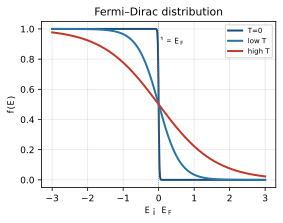
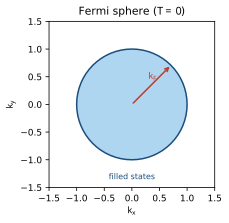
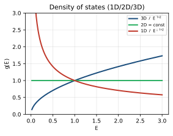

<!-- 固態物理 單元05：自由電子費米氣體（Free Electron Fermi Gas） · 從高中到資格考 -->

# 固態物理 單元05 — 自由電子費米氣體（Free Electron Fermi Gas）
### 從高中概念建到資格考

> **使用說明**：本篇從你高中會的「電子在盒子裡」「波耳模型」「$T=\tfrac12mv^2$」出發，一路接到 Kittel Ch6 等級的費米能（Fermi energy）、能態密度（density of states, DOS）、電子比熱、與維德曼–夫蘭茲定律（Wiedemann–Franz law）。符號點 `▸` 就地展開。專有名詞第一次出現用「中文（English）」對照。配套：[單元整理](../考古題/單元整理.html)（出題頻率）、[逐題詳解](../考古題/詳解/index.html)、[教材直讀](../教材/index.html)。
> **慣例（本篇符號）**：自由電子色散 $E=\dfrac{\hbar^2 k^2}{2m}$；含自旋簡併（spin degeneracy）2；倒空間每個 $\mathbf k$ 態占體積 $(2\pi/L)^d$；費米能 $E_F$、費米波數（Fermi wavevector）$k_F$、費米速度（Fermi velocity）$v_F$、費米溫度（Fermi temperature）$T_F=E_F/k_B$；玻茲曼常數 $k_B$、普朗克常數 $\hbar=h/2\pi$；電子電荷量值 $e>0$（電子帶 $-e$）；弛豫時間（relaxation time）$\tau$、平均自由程（mean free path）$\ell=v\tau$。
>
> 📖 **本單元權威出處與教材對照（Textbook & Reference Alignment）**：
> - **Kittel 原文 8e**：Chapter 6（Free Electron Fermi Gas, pp. 131–160），核心公式：Eq. (17) 費米能、Eq. (21) 能態密度、Eq. (25) 零溫總能量、Eq. (44) 電子熱容、Eq. (50) Drude 電導率、Eq. (58) Wiedemann-Franz 定律。
> - **林盛煇《固態物理導論》**：第 5 章（§5.1 Drude 與 Sommerfeld 模型、§5.2 費米球與費米能、§5.3 能態密度、§5.4 電子熱容、§5.5 電導與 Wiedemann-Franz 定律）。
> - **Ashcroft & Mermin**：Ch. 1（Drude Theory of Metals）、Ch. 2（Sommerfeld Theory of Metals）。
> - **臺大資格考真題對照**：2013–2025 共 10 次命題（2013, 2014, 2015, 2016, 2017, 2020, 2021, 2022, 2023, 2025），第二梯隊極高頻考點。

---

## 🧭 為什麼要這個單元？（在解決什麼問題、與其他章節的關係）

### 為什麼要學「自由電子費米氣體」？

金屬會導電、導熱、有微小的電子比熱——這些都是**電子**的戲。最簡單能算的模型：把價電子當成關在盒子裡、彼此不相干的**量子氣體**，並把離子背景**抹平**成均勻正電（完全忽略晶格細節）。模型雖粗，卻能定量解釋一大堆金屬性質，是電子理論的起點。第二梯隊。

### 在解決什麼問題？

> **核心問題**：為什麼金屬的電子比熱比古典預期**小約 100 倍**？電子的能量、導電與導熱該怎麼算？

關鍵是電子是費米子，遵守**費米–狄拉克分布**：絕大多數電子被包立原理鎖在費米海深處，只有**費米面附近**的少數電子能參與。由此推出 $k_F$、費米能 $E_F$、能態密度，以及電導、熱導與**維德曼–夫蘭茲定律**。

### 與其他章節的關係

| 相關章節 | 關係 |
|---|---|
| **01 晶體結構（往前接）** | 用週期邊界（Born–von Kármán）把電子裝進晶體；$k$-空間每態體積由晶體體積定 |
| **04 聲子（對照）** | 總比熱 = 電子 $\gamma T$ + 聲子 $A T^3$ |
| **06 能帶（往後升級）** | 把抹平的離子背景換回**週期性位能** → 拋物線開出能隙 → 能帶 |
| **08 磁性／09 超導（往後給）** | 包立順磁、朗道抗磁、BCS 配對都建在費米面上 |

> **一句話**：這是「先把離子背景抹平」的零階電子模型；unit06 把週期性加回去，就從費米氣體長出能帶。

---

## 🎯 這個單元在考什麼（出題地位）

自由電子費米氣體是**第二梯隊高頻單元**：2013–2025 共 13 卷中考了 **10 次**（只缺 2018、2019、2024）。它跨「觀念敘述」（Drude/Sommerfeld 的成就與失敗）與「硬推導／數值估算」兩種題型，幾乎年年能出。近年 2019–2025 的四段式考卷（Crystal / Diffraction / Phonons / **Electrons**）裡，Electrons 那一段常常就落在這個單元（DOS、$E_F$ 估算、簡併判定）。

| 題型 | 典型配分 | 代表年份 | 你要會的招式 |
|---|---|---|---|
| Drude → Sommerfeld 敘述（成就/失敗） | 10–15% | 2013, 2014, 2016 | 換統計（MB→FD+Pauli）解決了什麼、又沒解決什麼 |
| 填 k 球推 $E_F,T_F,v_F$（數值） | 15–40% | 2017, 2022 | $n=Z\rho N_A/M$ → $k_F=(3\pi^2n)^{1/3}$ → $E_F$ |
| DOS（1D／2D／3D 各不同） | 10–25% | 2016, 2023, 2025 | $g_{3D}\propto E^{1/2}$、$g_{2D}=$ 常數、$g_{1D}\propto E^{-1/2}$ |
| $U_0=\tfrac35 NE_F$、電子比熱 $C_{el}=\gamma T$ | 15% | 2016, 2020 | 為何只有 $E_F$ 附近 $\sim k_BT$ 的電子被激發 |
| 輸運：$\sigma,\mu,K=\tfrac13Cv\ell$、Wiedemann–Franz | 20–30% | 2014, 2015 | 一條 $\tau$ 串起電導與熱導，相除得勞侖茲數 |

> **一句話**：把「電子填進 $k$ 空間的球」這一張圖學透，這單元的所有題目（$E_F$、DOS、比熱、熱導、勞侖茲數）都是同一張圖在不同維度／不同物理量上的投影。

---

## 🧗 高中起點：你已經會的

- **電子在一維盒子裡**（infinite potential well）：駐波條件 $k=n\pi/L$，能量 $E_n=\dfrac{\hbar^2}{2m}\Big(\dfrac{n\pi}{L}\Big)^2$。本單元把它升到 3D 並改用週期邊界。
- **波耳模型（Bohr model）**：電子繞核、能階量子化、角動量 $L=n\hbar$。給你「電子的能量是離散的、被量子數標記」的直覺。
- **動能 $T=\tfrac12 mv^2$ 與動量 $p=mv=\hbar k$**：費米能就是「填到最頂那顆電子」的動能。
- **歐姆定律 $V=IR$ / $\mathbf J=\sigma\mathbf E$**：本單元要從「電子在電場中被加速又被碰撞」推出 $\sigma=ne^2\tau/m$。
- **理想氣體與等分定理（equipartition）**：每個自由度平均能 $\tfrac12 k_BT$。Drude 用它、結果錯了 100 倍，正是 Sommerfeld 要修的。
- **包立不相容原理（Pauli exclusion principle）**：一個量子態最多兩個電子（自旋上、下）。這是整個費米氣體的地基。

---

## 📚 主線：從高中一路推到考試級

### 1. 為什麼需要「費米氣體」：德魯德的成就與失敗（Drude model）

**你高中學過的**：金屬會導電，因為裡面有可以自由跑的電子（「電子海」）。

**為什麼需要新東西**：1900 年德魯德（P. Drude）把這些自由電子當成**古典理想氣體**——用馬克士威–玻茲曼分布（Maxwell–Boltzmann distribution），電子像撞球一樣亂跑、偶爾撞到離子。這個圖像對了一半，卻在一個地方災難性地失敗，逼出了 1928 年的索末菲（Sommerfeld）修正。

**定義（中英對照）**：

- **德魯德模型（Drude model）**：價電子 = 古典自由氣體，遵守 MB 統計；與離子（實則雜質與聲子）碰撞，平均弛豫時間（relaxation time）$\tau$，每次碰撞把速度隨機化。
- **索末菲修正（Sommerfeld correction）**：保留「自由電子」，但把統計換成費米–狄拉克分布（Fermi–Dirac distribution）＋包立不相容。

<b>▸ 弛豫時間 / 碰撞時間 τ（relaxation time / collision time）</b>

### 你高中學過的
有摩擦的等速下落：重力與空氣阻力平衡 → 達到「終端速度」。電子在電場中也一樣，被電場加速、被碰撞拉回，最後維持一個平均「漂移速度」。

### 為什麼要這個
我們不可能追蹤每顆電子的每次碰撞，所以用一個平均量 $\tau$＝「兩次碰撞之間的平均時間」來概括所有散射。它把複雜的微觀碰撞濃縮成一個阻尼項。

### 定義
含碰撞阻尼的運動方程：
$$m\frac{d\mathbf v}{dt}=\mathbf F-\frac{m\mathbf v}{\tau}.$$
平均自由程（mean free path）$\ell=v\tau$＝兩次碰撞間走的平均距離。

**範例 1（熱身）**：只有電場 $\mathbf E$、達穩態 → 漂移速度 $\mathbf v_d=-\dfrac{e\tau}{m}\mathbf E$（下面 §6 會推）。
**範例 2（中階）**：銅室溫 $\tau\sim2\times10^{-14}$ s、$v_F\sim1.6\times10^6$ m/s → $\ell\sim30$ nm（約上百個原子間距，古典圖像其實解釋不了為何這麼長，要 Bloch）。
**範例 3（對到考題）**：2014 Q8 用同一個 $\tau$ 串起電導 $\sigma=ne^2\tau/m$ 與電子熱導 $K_{el}$，相除時 $\tau$ 消掉 → 維德曼–夫蘭茲定律。

#### Drude 的成就與失敗（2013 Q9、2016 Q2 必背）

| | 內容 |
|---|---|
| **成就** | 歐姆定律與 $\sigma=ne^2\tau/m$、霍爾效應（Hall effect）、交流電導與電漿頻率（plasma frequency）、維德曼–夫蘭茲定律（數值「幸運地」約對）。 |
| **失敗** | ① 預測電子比熱 $\tfrac32 Nk_B$（與溫度無關），**比實測大約 100 倍**；② 勞侖茲數靠「過大的 $v^2$ × 過大的 $C$」兩個錯誤相消才對；③ 無法解釋為何有絕緣體；④ 某些金屬霍爾係數為**正**；⑤ 磁阻與熱電勢量級錯。 |

> **小結**：Drude 對「載電」這件事大致成功（$\sigma,\mu,$ 霍爾），但對「載熱／比熱」這件事用錯了統計。修法只有一個字：把馬克士威–玻茲曼換成費米–狄拉克。

---

### 2. 為什麼比熱錯 100 倍：費米–狄拉克分布（Fermi–Dirac distribution）

**你高中學過的**：理想氣體升溫，每個分子都分到 $\sim k_BT$ 的能量（等分定理）。

**為什麼需要新東西**：電子有包立不相容——**一個態只能塞兩顆**（自旋上下）。在 $T=0$ 時，電子不是全擠在最低能階，而是**從底一路填到一個最高能量 $E_F$**（像把水倒進杯子，會填到一個水位）。升溫時，深埋在水位以下的電子**沒有空位可跳**（上方的態都被占了），只有最頂端 $\sim k_BT$ 寬的那一薄層電子能被激發。這就是「只有一小撮電子參與比熱」的根本原因。

**定義（中英對照）**：

- **費米–狄拉克分布（Fermi–Dirac distribution）**：溫度 $T$ 下，能量 $E$ 的態被占據的機率
$$f(E)=\frac{1}{e^{(E-\mu)/k_BT}+1}.$$
- **化學勢（chemical potential）$\mu$**：使總電子數守恆的能量參數。$T=0$ 時 $\mu=E_F$。

<b>▸ 費米–狄拉克占據機率 f(E) 與化學勢 μ</b>

### 你高中學過的
擲骰子的機率介於 0 與 1；玻茲曼因子 $e^{-E/k_BT}$ 說「能量越高越難占據」。

### 為什麼要這個
古典玻茲曼因子允許「一個態塞無限多顆」，對電子不對。$f(E)$ 多了分母的「$+1$」，正是包立不相容的數學體現——機率永遠 $\le1$（一個態最多被占滿）。

### 定義
$$f(E)=\frac{1}{e^{(E-\mu)/k_BT}+1},\qquad 0\le f\le1.$$
- $E\ll\mu$：$f\to1$（填滿）。
- $E=\mu$：$f=\tfrac12$（半滿，這就是「水位」位置）。
- $E\gg\mu$：$f\to e^{-(E-\mu)/k_BT}$（退回玻茲曼尾巴）。

**範例 1（熱身，$T=0$）**：$f(E)=1$（$E<E_F$）或 $0$（$E>E_F$）——完美階梯，水位 $=E_F$。
**範例 2（中階，低溫 $k_BT\ll\mu$）**：階梯在 $E_F$ 處被「模糊」開一條寬 $\sim k_BT$ 的過渡帶；金屬室溫 $k_BT/E_F\sim0.003$，所以幾乎還是階梯。
**範例 3（對到考題，2016 Q2a）**：要會畫 $k_BT\sim0.01\mu$（近階梯）與 $k_BT\sim0.5\mu$（大幅平滑、拖長尾、趨近 MB）兩條曲線。

> **小結**：費米–狄拉克分布的「$+1$」是包立不相容的指紋。低溫時它幾乎是階梯，只有 $E_F$ 附近 $\sim k_BT$ 寬度的電子是「活的」——這一句話之後會直接給出電子比熱 $\propto T$。

<b>📝 更多範例（點開）：費米–狄拉克 f(E) 各點求值與對稱性</b>

**範例 A（$f$ 在幾個能量的值，室溫金屬）**：取 $k_BT=0.025\,\mathrm{eV}$（300 K）、$\mu=5\,\mathrm{eV}$。算 $E=\mu$：
$$f(\mu)=\frac{1}{e^{0}+1}=\frac{1}{1+1}=\frac12.$$
算 $E=\mu+k_BT$（高出一個 $k_BT$）：$\dfrac{E-\mu}{k_BT}=1$，
$$f=\frac{1}{e^{1}+1}=\frac{1}{2.718+1}=\frac{1}{3.718}=0.269.$$
算 $E=\mu-k_BT$：指數 $=-1$，
$$f=\frac{1}{e^{-1}+1}=\frac{1}{0.368+1}=\frac{1}{1.368}=0.731.$$
注意 $0.269+0.731=1.000$——這是下面範例 B 的對稱性。

**範例 B（電洞–電子對稱：$f(\mu+\delta)+f(\mu-\delta)=1$）**：令 $a=\dfrac{\delta}{k_BT}$。
$$f(\mu+\delta)+f(\mu-\delta)=\frac{1}{e^{a}+1}+\frac{1}{e^{-a}+1}.$$
第二項分子分母同乘 $e^{a}$：$\dfrac{e^{a}}{1+e^{a}}$。相加：
$$\frac{1}{e^{a}+1}+\frac{e^{a}}{e^{a}+1}=\frac{1+e^{a}}{e^{a}+1}=1.$$
意義：高於 $\mu$ 處「被占的機率」等於低於 $\mu$ 同距處「空著（電洞）的機率」——分布對 $\mu$ 反對稱，這保證升溫時 $\mu$ 附近上下抵銷、總電子數不變。

**範例 C（玻茲曼尾巴：$E\gg\mu$ 退回古典）**：當 $E-\mu\gg k_BT$，分母 $e^{(E-\mu)/k_BT}\gg1$，可丟掉 $+1$：
$$f(E)=\frac{1}{e^{(E-\mu)/k_BT}+1}\approx\frac{1}{e^{(E-\mu)/k_BT}}=e^{-(E-\mu)/k_BT}.$$
這就是馬克士威–玻茲曼因子。例如 $E-\mu=5k_BT$：精確 $f=\dfrac{1}{e^5+1}=\dfrac{1}{148.4+1}=6.69\times10^{-3}$，近似 $e^{-5}=6.74\times10^{-3}$，誤差 $<1\%$——稀薄高能尾巴處 FD 與 MB 幾乎一樣。

<figure style="margin:1.3em 0;text-align:center">
<svg viewBox="0 0 480 250" width="100%" style="max-width:560px;border:1px solid #ddd;border-radius:8px;background:#fff;padding:6px;box-sizing:border-box" xmlns="http://www.w3.org/2000/svg">
<g font-family="-apple-system,sans-serif" font-size="12">
<line x1="55" y1="210" x2="445" y2="210" stroke="#333" stroke-width="1.5"/>
<line x1="55" y1="210" x2="55" y2="30" stroke="#333" stroke-width="1.5"/>
<text x="450" y="226" fill="#333">E</text>
<text x="18" y="44" fill="#333">f(E)</text>
<line x1="48" y1="50" x2="62" y2="50" stroke="#888" stroke-width="1"/>
<text x="42" y="54" text-anchor="end" font-size="10.5" fill="#888">1</text>
<line x1="48" y1="130" x2="62" y2="130" stroke="#888" stroke-width="1"/>
<text x="42" y="134" text-anchor="end" font-size="10.5" fill="#888">½</text>
<polyline points="55,50 270,50 270,210 445,210" fill="none" stroke="#1a4d7c" stroke-width="2.4"/>
<polyline points="55,51 130,52 185,54 225,60 248,72 262,95 270,130 278,165 292,188 315,200 360,206 445,209" fill="none" stroke="#c0392b" stroke-width="2.4"/>
<line x1="270" y1="210" x2="270" y2="40" stroke="#2e8b2e" stroke-width="1.2" stroke-dasharray="4,3"/>
<text x="270" y="227" text-anchor="middle" font-size="12" fill="#2e8b2e">Eꜰ（μ）</text>
<circle cx="270" cy="130" r="4" fill="#2e8b2e"/>
<text x="318" y="128" font-size="11" fill="#2e8b2e">f = ½ 在 Eꜰ</text>
<line x1="248" y1="40" x2="292" y2="40" stroke="#e67e22" stroke-width="1.4" marker-start="url(#fda1)" marker-end="url(#fda2)"/>
<defs>
<marker id="fda1" markerWidth="9" markerHeight="9" refX="6" refY="3" orient="auto"><path d="M6,0 L0,3 L6,6 Z" fill="#e67e22"/></marker>
<marker id="fda2" markerWidth="9" markerHeight="9" refX="6" refY="3" orient="auto"><path d="M0,0 L6,3 L0,6 Z" fill="#e67e22"/></marker>
</defs>
<text x="270" y="35" text-anchor="middle" font-size="11.5" fill="#e67e22">寬 ≈ kT</text>
<text x="150" y="44" font-size="12" fill="#1a4d7c">T=0：階梯</text>
<text x="350" y="180" font-size="12" fill="#c0392b">T&gt;0：抹開</text>
</g>
</svg>
<figcaption style="font-size:0.9em;color:#555;margin-top:0.5em">費米–狄拉克 f(E)=1⁄(e^((E−μ)⁄kT)+1)。<b style="color:#1a4d7c">T=0（藍）</b>是完美階梯：E&lt;Eꜰ 全填（f=1）、E&gt;Eꜰ 全空（f=0）。<b style="color:#c0392b">T&gt;0（紅）</b>只把 <b style="color:#2e8b2e">Eꜰ</b> 附近寬 <b style="color:#e67e22">≈ kT</b> 的一段抹開；不論溫度，f(Eꜰ)=½ 永遠成立（「水位」位置）。金屬室溫 kT⁄Eꜰ ~ 0.003，所以幾乎還是階梯。<b>考點（2016 Q2a）</b>：要會畫 kT≈0.01μ（近階梯）與 kT≈0.5μ（大幅平滑、拖長尾趨近 MB）兩條對比。</figcaption>
</figure>

---

### 3. 把電子裝進盒子：週期邊界與 k 空間每態體積（Born–von Kármán）

**你高中學過的**：一維無限位能井裡的駐波，$k=n\pi/L$，能階離散。

**為什麼需要新東西**：固體是 3D 的、而且有 $\sim10^{23}$ 顆電子。我們需要 (1) 升到 3D，(2) 用一個更方便計數的邊界條件。固定端駐波（$\sin$）在計數時要小心只取正 $k$；改用**週期性邊界條件（Born–von Kármán boundary condition）**——假裝盒子首尾相接——可以讓 $k$ 取正負、用平面波 $e^{i\mathbf k\cdot\mathbf r}$，計數最乾淨，且在 $L$ 很大時物理結果與固定端完全一樣。

**定義（中英對照）**：

- **週期性邊界（Born–von Kármán boundary condition）**：$\psi(\mathbf r+L\hat e_i)=\psi(\mathbf r)$，即把長度 $L$ 的盒子在每個方向首尾接成環。

#### Step 1 — 由週期邊界定出允許的 $\mathbf k$（2025 Q3b 直接考）

平面波解 $\psi=e^{i\mathbf k\cdot\mathbf r}$。在 $x$ 方向套週期邊界：
$$e^{ik_x(x+L)}=e^{ik_x x}\ \Rightarrow\ e^{ik_xL}=1\ \Rightarrow\ k_xL=2\pi n_x\ (n_x\in\mathbb Z).$$
故每個分量 $k_i=\dfrac{2\pi}{L}n_i$。**相鄰 $\mathbf k$ 的最短間距**
$$\boxed{\Delta k_{\min}=\frac{2\pi}{L}.}$$

#### Step 2 — 每個 $\mathbf k$ 態在 k 空間占的體積

三個方向各間隔 $2\pi/L$ → 每個允許的 $\mathbf k$ 點獨占一個小盒子，體積
$$\boxed{\left(\frac{2\pi}{L}\right)^3=\frac{(2\pi)^3}{V}\quad(\text{3D};\ V=L^3).}$$
2D 換成 $(2\pi/L)^2=(2\pi)^2/A$，1D 換成 $2\pi/L$。**這一條是本單元所有計數的母公式。**

<b>📝 更多範例（點開）：用母公式數球／圓／線內的態數</b>

**範例 A（3D 球內態數，含自旋）**：半徑 $k$ 的球，k 空間體積 $V_k=\dfrac43\pi k^3$。每態占 $(2\pi/L)^3=(2\pi)^3/V$，再乘自旋 2：
$$N=2\times\frac{V_k}{(2\pi)^3/V}=2\times\frac{\frac43\pi k^3\cdot V}{(2\pi)^3}=2\times\frac{\frac43\pi k^3\,V}{8\pi^3}=\frac{2\cdot4\pi k^3 V}{3\cdot8\pi^3}=\frac{8\pi k^3 V}{24\pi^3}=\frac{k^3 V}{3\pi^2}.$$
逐步約分：分子分母同除 $8\pi$ → $\dfrac{\pi k^3V}{3\pi^3}=\dfrac{Vk^3}{3\pi^2}$。這正是 §4 的 $N=\dfrac{V}{3\pi^2}k_F^3$。

**範例 B（2D 圓內態數，含自旋）**：半徑 $k$ 的圓，面積 $A_k=\pi k^2$。每態占 $(2\pi/L)^2=(2\pi)^2/A$，乘自旋 2：
$$N=2\times\frac{\pi k^2}{(2\pi)^2/A}=2\times\frac{\pi k^2\cdot A}{4\pi^2}=\frac{2\pi k^2 A}{4\pi^2}=\frac{k^2 A}{2\pi}.$$
中間 $\dfrac{2\pi}{4\pi^2}=\dfrac{1}{2\pi}$，故 $N=\dfrac{Ak^2}{2\pi}$（§5 Step 2 會用）。

**範例 C（1D 線段內態數，含自旋）**：1D 中 $|k|<k_0$ 涵蓋 $-k_0$ 到 $+k_0$，長度 $2k_0$。每態占 $2\pi/L$，乘自旋 2：
$$N=2\times\frac{2k_0}{2\pi/L}=2\times\frac{2k_0 L}{2\pi}=\frac{4k_0 L}{2\pi}=\frac{2k_0 L}{\pi}.$$
即線密度（含自旋）為 $\dfrac{2L}{2\pi}=\dfrac{L}{\pi}$ 每單位 $k$，乘上區間長 $2k_0$ 也得 $\dfrac{2k_0L}{\pi}$，一致。

**範例 D（具體數字檢查）**：取 $L=1\,\mathrm{cm}=10^{-2}\,\mathrm m$，則 $\Delta k_{\min}=\dfrac{2\pi}{L}=\dfrac{2\pi}{10^{-2}}=628\,\mathrm{m^{-1}}$。一個半徑 $k=10^{10}\,\mathrm{m^{-1}}$ 的費米球，每邊裝得下 $\dfrac{2k}{\Delta k}=\dfrac{2\times10^{10}}{628}\approx3.2\times10^7$ 個格點 → 三維約 $(3.2\times10^7)^3\sim10^{22}$ 態，量級對得上 $\sim10^{23}$ 顆電子。

<figure style="margin:1.3em 0;text-align:center">
<svg viewBox="0 0 420 250" width="100%" style="max-width:480px;border:1px solid #ddd;border-radius:8px;background:#fff;padding:6px;box-sizing:border-box" xmlns="http://www.w3.org/2000/svg">
<g font-family="-apple-system,sans-serif" font-size="12">
<line x1="40" y1="200" x2="395" y2="200" stroke="#bbb" stroke-width="1.2"/>
<line x1="210" y1="225" x2="210" y2="25" stroke="#bbb" stroke-width="1.2"/>
<text x="398" y="204" fill="#888">k_x</text>
<text x="218" y="36" fill="#888">k_y</text>
<rect x="170" y="120" width="40" height="40" fill="#6aa1d6" fill-opacity="0.35" stroke="#c0392b" stroke-width="1.6"/>
<g fill="#1a4d7c"><circle cx="90" cy="40" r="3.2"/><circle cx="130" cy="40" r="3.2"/><circle cx="170" cy="40" r="3.2"/><circle cx="210" cy="40" r="3.2"/><circle cx="250" cy="40" r="3.2"/><circle cx="290" cy="40" r="3.2"/><circle cx="330" cy="40" r="3.2"/>
<circle cx="90" cy="80" r="3.2"/><circle cx="130" cy="80" r="3.2"/><circle cx="170" cy="80" r="3.2"/><circle cx="210" cy="80" r="3.2"/><circle cx="250" cy="80" r="3.2"/><circle cx="290" cy="80" r="3.2"/><circle cx="330" cy="80" r="3.2"/>
<circle cx="90" cy="120" r="3.2"/><circle cx="130" cy="120" r="3.2"/><circle cx="170" cy="120" r="3.2"/><circle cx="210" cy="120" r="3.2"/><circle cx="250" cy="120" r="3.2"/><circle cx="290" cy="120" r="3.2"/><circle cx="330" cy="120" r="3.2"/>
<circle cx="90" cy="160" r="3.2"/><circle cx="130" cy="160" r="3.2"/><circle cx="170" cy="160" r="3.2"/><circle cx="210" cy="160" r="3.2"/><circle cx="250" cy="160" r="3.2"/><circle cx="290" cy="160" r="3.2"/><circle cx="330" cy="160" r="3.2"/></g>
<line x1="170" y1="178" x2="210" y2="178" stroke="#2e8b2e" stroke-width="1.4" marker-start="url(#gka)" marker-end="url(#gkb)"/>
<defs>
<marker id="gka" markerWidth="9" markerHeight="9" refX="6" refY="3" orient="auto"><path d="M6,0 L0,3 L6,6 Z" fill="#2e8b2e"/></marker>
<marker id="gkb" markerWidth="9" markerHeight="9" refX="6" refY="3" orient="auto"><path d="M0,0 L6,3 L0,6 Z" fill="#2e8b2e"/></marker>
</defs>
<text x="190" y="193" text-anchor="middle" font-size="11.5" fill="#2e8b2e">2π/L</text>
<text x="190" y="115" text-anchor="middle" font-size="11" fill="#c0392b">每態 1 盒</text>
<text x="120" y="225" text-anchor="middle" font-size="11.5" fill="#1a4d7c">允許的 k 點：間距 2π/L</text>
</g>
</svg>
<figcaption style="font-size:0.9em;color:#555;margin-top:0.5em">週期邊界（Born–von Kármán）逼出 k 只能取 <b style="color:#1a4d7c">間距 2π/L 的格點</b>（藍點）。每個允許的 k 態因此<b style="color:#c0392b">獨占一個小盒（紅框）</b>，面積（2D）=(2π/L)²=(2π)²/A、體積（3D）=(2π/L)³=(2π)³/V。要數「半徑 k 的圓／球內有幾個態」，就用「圓（球）面積（體積）÷ 小盒」再 ×2（自旋）——這是填球、算 DOS、算總能的<b>母公式</b>。<b>考點（2025 Q3b）</b>：直接由 e^(ik_xL)=1 推 Δk=2π/L。</figcaption>
</figure>

<b>▸ k 空間每態體積 (2π/L)^d（density of allowed states in k-space）</b>

### 你高中學過的
一維盒子能階間距 $\Delta k=\pi/L$（固定端）。週期邊界改成 $2\pi/L$（因為 $k$ 可正可負，間距加倍但範圍也加倍，態數一樣）。

### 為什麼要這個
要「數有幾個態」最快的方法不是逐個數，而是用「總體積 ÷ 每態體積」。$(2\pi/L)^d$ 就是那個分母。

### 定義
$\mathbf k=\dfrac{2\pi}{L}(n_x,n_y,n_z)$；k 空間中體積 $V_k$ 內的態數（每自旋）$=\dfrac{V_k}{(2\pi/L)^3}=V_k\cdot\dfrac{V}{(2\pi)^3}$。

**範例 1（熱身）**：半徑 $k$ 的球體積 $\tfrac43\pi k^3$，內含態數（含自旋 ×2）$=2\cdot\dfrac{V}{(2\pi)^3}\cdot\tfrac43\pi k^3=\dfrac{V k^3}{3\pi^2}$。
**範例 2（中階，2D）**：面積 $A$、$\mathbf k$ 間距 $(2\pi/L)^2$ → 半徑 $k$ 的圓內（含自旋）$N=2\cdot\dfrac{A}{(2\pi)^2}\pi k^2=\dfrac{Ak^2}{2\pi}$。
**範例 3（對到考題，2025 Q3）**：spin-up only 不乘 2，2D 圓內 $N=\dfrac{A}{(2\pi)^2}\pi k^2=\dfrac{Ak^2}{4\pi}$ → 微分得常數 DOS。

> **小結**：週期邊界 → $\mathbf k$ 變成間距 $2\pi/L$ 的格點 → 每態占 $(2\pi/L)^d$。接下來填球、算 DOS、算總能，全靠這一條。

---

### 4. 費米能完整推導：填 k 球 → $k_F$ → $E_F$（核心中的核心）

> 📖 **本節核心出處與說明（Ref）**：
> - **權威教材**：Kittel 8e Ch. 6 Eq. (15)–(17) pp. 137–138 ｜ 林盛煇 §5.2 ｜ A&M Ch. 2
> - **歷年考題**：[NTU 2014](../考古題/詳解/固態_2014_詳解.html), [2016](../考古題/詳解/固態_2016_詳解.html), [2017 Q2](../考古題/詳解/固態_2017_詳解.html), [2022 Q4](../考古題/詳解/固態_2022_詳解.html)
> - **觀念說明**：三維費米球半徑 $k_F = (3\pi^2 n)^{1/3}$，費米能量 $E_F = \frac{\hbar^2}{2m}(3\pi^2 n)^{2/3}$，絕對零度基態總動能 $U_0 = \frac{3}{5}NE_F$。

**你高中學過的**：把水倒進杯子會填到一個水位；把電子倒進 $k$ 空間（每態占 $(2\pi/L)^3$、每態裝 2 顆）會填成一個球。

**定義（中英對照）**：

- **費米球（Fermi sphere）**：$T=0$ 時被占據的 $\mathbf k$ 態構成的球；球面半徑 $k_F$ = 費米波數（Fermi wavevector）。
- **費米能（Fermi energy）$E_F$**：基態中最高被占態的能量，$E_F=\dfrac{\hbar^2k_F^2}{2m}$。
- **費米速度 / 費米溫度（Fermi velocity / temperature）**：$v_F=\hbar k_F/m$、$T_F=E_F/k_B$。

#### Step 1 — 電子數 $N$ 等於費米球內的態數（含自旋 ×2）

費米球體積 $\tfrac43\pi k_F^3$，每態占 $(2\pi)^3/V$，自旋簡併 2：
$$N=2\cdot\frac{V}{(2\pi)^3}\cdot\frac43\pi k_F^3=\frac{V}{3\pi^2}k_F^3.$$
這就是 2017 年直接考的「$N$ 與 $k_F/V$ 的關係」。**$\boxed{N=\dfrac{V}{3\pi^2}k_F^3}$**。

<figure style="margin:1.3em 0;text-align:center">
<svg viewBox="0 0 440 280" width="100%" style="max-width:500px;border:1px solid #ddd;border-radius:8px;background:#fff;padding:6px;box-sizing:border-box" xmlns="http://www.w3.org/2000/svg">
<defs>
<radialGradient id="fsph4a" cx="38%" cy="32%" r="72%"><stop offset="0" stop-color="#b9d6ef"/><stop offset="1" stop-color="#6aa1d6"/></radialGradient>
<marker id="fsar4a" markerWidth="10" markerHeight="10" refX="6" refY="3" orient="auto"><path d="M0,0 L6,3 L0,6 Z" fill="#c0392b"/></marker>
</defs>
<g font-family="-apple-system,sans-serif" font-size="12">
<line x1="40" y1="155" x2="400" y2="155" stroke="#bbb" stroke-width="1.2"/>
<line x1="220" y1="265" x2="220" y2="20" stroke="#bbb" stroke-width="1.2"/>
<text x="404" y="159" fill="#888">k_x</text>
<text x="228" y="30" fill="#888">k_y</text>
<g stroke="#cfe0f0" stroke-width="0.8">
<line x1="100" y1="35" x2="100" y2="275"/><line x1="160" y1="35" x2="160" y2="275"/><line x1="280" y1="35" x2="280" y2="275"/><line x1="340" y1="35" x2="340" y2="275"/>
<line x1="40" y1="95" x2="400" y2="95"/><line x1="40" y1="215" x2="400" y2="215"/>
</g>
<circle cx="220" cy="155" r="92" fill="url(#fsph4a)" fill-opacity="0.85" stroke="#1a4d7c" stroke-width="2.4"/>
<g fill="#13395d"><circle cx="220" cy="155" r="3"/><circle cx="190" cy="155" r="3"/><circle cx="250" cy="155" r="3"/><circle cx="220" cy="125" r="3"/><circle cx="220" cy="185" r="3"/><circle cx="190" cy="125" r="3"/><circle cx="250" cy="125" r="3"/><circle cx="190" cy="185" r="3"/><circle cx="250" cy="185" r="3"/><circle cx="160" cy="155" r="3"/><circle cx="280" cy="155" r="3"/><circle cx="220" cy="95" r="3"/><circle cx="220" cy="215" r="3"/></g>
<g fill="#999"><circle cx="100" cy="95" r="2.6"/><circle cx="340" cy="95" r="2.6"/><circle cx="100" cy="215" r="2.6"/><circle cx="340" cy="215" r="2.6"/><circle cx="340" cy="155" r="2.6"/><circle cx="100" cy="155" r="2.6"/></g>
<line x1="220" y1="155" x2="285" y2="90" stroke="#c0392b" stroke-width="2.2" marker-end="url(#fsar4a)"/>
<text x="262" y="108" font-size="13" font-weight="bold" fill="#c0392b">kꜰ</text>
<text x="220" y="258" text-anchor="middle" font-size="12.5" font-weight="bold" fill="#1a4d7c">費米球：k &lt; kꜰ 全填，球面 = 費米面</text>
<text x="358" y="48" font-size="11" fill="#999">空態</text>
</g>
</svg>
<figcaption style="font-size:0.9em;color:#555;margin-top:0.5em">T=0 時電子填進 k 空間：每個 <b style="color:#1a4d7c">k 態</b>占小盒 (2π⁄L)³、每態裝 2 顆（自旋）。由低能往上填成一顆<b style="color:#1a4d7c">費米球</b>，半徑 = <b style="color:#c0392b">費米波數 kꜰ</b>，球面就是<b>費米面（Fermi surface）</b>；球外（灰點）是空態。球內態數 ×2 = N 給出 N = V⁄3π²·kꜰ³。<b>考點（2017）</b>：把 4⁄3·πkꜰ³ ÷ (2π)³⁄V ×2 一步步寫清楚就拿分；kꜰ 只由電子密度 n 決定，與盒子形狀無關。</figcaption>
</figure>

#### Step 2 — 反解 $k_F$，用電子密度 $n=N/V$

$$k_F^3=3\pi^2\frac{N}{V}=3\pi^2 n\ \Rightarrow\ \boxed{k_F=(3\pi^2 n)^{1/3}.}$$

> 注意：$k_F$ 只由電子**密度** $n$ 決定，與盒子大小、形狀無關——這是費米氣體最重要的「純密度」結論。

#### Step 3 — 把 $k_F$ 換成能量得費米能

代入 $E_F=\dfrac{\hbar^2 k_F^2}{2m}$：
$$\boxed{E_F=\frac{\hbar^2}{2m}\big(3\pi^2 n\big)^{2/3}.}$$
費米速度與費米溫度：
$$v_F=\frac{\hbar k_F}{m}=\frac{\hbar}{m}(3\pi^2 n)^{1/3},\qquad T_F=\frac{E_F}{k_B}.$$

<b>📝 更多範例（點開）：n → k_F → E_F → v_F → T_F 一條龍代數</b>

**範例 A（鈉 Na，一價，完整代入）**：$n=2.5\times10^{28}\,\mathrm{m^{-3}}$。
先 $k_F$：
$$k_F=(3\pi^2 n)^{1/3}=(3\times9.87\times2.5\times10^{28})^{1/3}=(7.40\times10^{29})^{1/3}.$$
取對數估：$\log_{10}(7.40\times10^{29})=29.87$，除以 3 得 $9.96$ → $k_F=10^{9.96}=9.1\times10^{9}\,\mathrm{m^{-1}}$。
再 $E_F$：
$$E_F=\frac{\hbar^2k_F^2}{2m}=\frac{(1.055\times10^{-34})^2(9.1\times10^{9})^2}{2\times9.1\times10^{-31}}=\frac{1.113\times10^{-68}\times8.28\times10^{19}}{1.82\times10^{-30}}=5.06\times10^{-19}\,\mathrm J.$$
換 eV：$\dfrac{5.06\times10^{-19}}{1.6\times10^{-19}}=3.2\,\mathrm{eV}$。
$v_F=\dfrac{\hbar k_F}{m}=\dfrac{1.055\times10^{-34}\times9.1\times10^{9}}{9.1\times10^{-31}}=1.06\times10^{6}\,\mathrm{m/s}$；
$T_F=\dfrac{E_F}{k_B}=\dfrac{5.06\times10^{-19}}{1.38\times10^{-23}}=3.7\times10^{4}\,\mathrm K$。

**範例 B（為何 $E_F\propto n^{2/3}$，符號推導）**：把 $k_F=(3\pi^2n)^{1/3}$ 代進 $E_F=\dfrac{\hbar^2k_F^2}{2m}$：
$$E_F=\frac{\hbar^2}{2m}\big[(3\pi^2n)^{1/3}\big]^2=\frac{\hbar^2}{2m}(3\pi^2n)^{2/3}=\frac{\hbar^2}{2m}(3\pi^2)^{2/3}\,n^{2/3}.$$
指數 $\tfrac13\times2=\tfrac23$。故密度加倍時 $E_F$ 變 $2^{2/3}=1.587$ 倍（2021 考點）；而 $v_F\propto n^{1/3}$，加倍只變 $2^{1/3}=1.26$ 倍。

**範例 C（由 $E_F$ 反推 $n$）**：已知某金屬 $E_F=5\,\mathrm{eV}=8.0\times10^{-19}\,\mathrm J$。反解 $k_F$：
$$k_F=\sqrt{\frac{2mE_F}{\hbar^2}}=\sqrt{\frac{2\times9.1\times10^{-31}\times8.0\times10^{-19}}{(1.055\times10^{-34})^2}}=\sqrt{\frac{1.456\times10^{-48}}{1.113\times10^{-68}}}=\sqrt{1.308\times10^{20}}=1.14\times10^{10}\,\mathrm{m^{-1}}.$$
再由 $n=\dfrac{k_F^3}{3\pi^2}=\dfrac{(1.14\times10^{10})^3}{29.6}=\dfrac{1.48\times10^{30}}{29.6}=5.0\times10^{28}\,\mathrm{m^{-3}}$。一價金屬的典型量級。

<b>▸ 費米四件套：E_F, k_F, T_F, v_F（能量 / 波數 / 溫度 / 速度）</b>

### 你高中學過的
$T=\tfrac12 mv^2=\dfrac{p^2}{2m}$、$p=\hbar k$。$E_F$ 就是「填到最頂那顆電子」的這個動能。

### 為什麼要這個
$E_F$ 是金屬電子的「能量尺」：$E_F\sim$ 數 eV、$T_F\sim10^4$–$10^5$ K，遠大於室溫 $300$ K，所以金屬電子在室溫是**高度簡併（degenerate）**的——幾乎還是 $T=0$ 的階梯。這解釋了為何電子比熱那麼小。

### 定義
$$k_F=(3\pi^2 n)^{1/3},\quad E_F=\frac{\hbar^2 k_F^2}{2m}=\frac{\hbar^2}{2m}(3\pi^2 n)^{2/3},\quad v_F=\frac{\hbar k_F}{m},\quad T_F=\frac{E_F}{k_B}.$$

**範例 1（熱身，Na 一價）**：$n\approx2.5\times10^{28}\,\mathrm{m^{-3}}$ → $E_F\approx3.2$ eV、$T_F\approx3.7\times10^4$ K。
**範例 2（中階，Cu 一價）**：$n\approx8.5\times10^{28}\,\mathrm{m^{-3}}$ → $E_F\approx7.0$ eV、$v_F\approx1.6\times10^6$ m/s。
**範例 3（對到考題，2022 Q5 鋁三價）**：$n\approx1.81\times10^{29}\,\mathrm{m^{-3}}$ → $E_F\approx11.7$ eV、$T_F\approx1.36\times10^5$ K（§9 完整數值）。

<figure style="margin:1.3em 0;text-align:center">
<svg viewBox="0 0 500 195" width="100%" style="max-width:600px;border:1px solid #ddd;border-radius:8px;background:#fff;padding:6px;box-sizing:border-box" xmlns="http://www.w3.org/2000/svg">
<g font-family="-apple-system,sans-serif" font-size="11.5">
<text x="250" y="22" text-anchor="middle" font-size="13" font-weight="bold" fill="#1a4d7c">溫度尺度（對數軸）：為何金屬電子在室溫近乎 T=0</text>
<line x1="55" y1="110" x2="455" y2="110" stroke="#333" stroke-width="1.5"/>
<g stroke="#333" stroke-width="1.2">
<line x1="75" y1="105" x2="75" y2="115"/><line x1="170" y1="105" x2="170" y2="115"/><line x1="265" y1="105" x2="265" y2="115"/><line x1="360" y1="105" x2="360" y2="115"/><line x1="430" y1="105" x2="430" y2="115"/>
</g>
<g font-size="10.5" fill="#555" text-anchor="middle">
<text x="75" y="128">1 K</text><text x="170" y="128">10² K</text><text x="265" y="128">10⁴ K</text><text x="360" y="128">10⁵ K</text><text x="430" y="128">10⁶ K</text>
</g>
<line x1="195" y1="60" x2="195" y2="110" stroke="#2e8b2e" stroke-width="2.2"/>
<circle cx="195" cy="60" r="4" fill="#2e8b2e"/>
<text x="195" y="52" text-anchor="middle" font-size="11.5" font-weight="bold" fill="#2e8b2e">室溫 300 K</text>
<rect x="255" y="72" width="115" height="22" fill="#e67e22" fill-opacity="0.2" stroke="#e67e22" stroke-width="1.1"/>
<text x="312" y="87" text-anchor="middle" font-size="11" fill="#e67e22">Tꜰ ~ 10⁴–10⁵ K</text>
<line x1="262" y1="72" x2="262" y2="110" stroke="#1a4d7c" stroke-width="2"/>
<circle cx="262" cy="72" r="3.5" fill="#1a4d7c"/>
<text x="262" y="160" text-anchor="middle" font-size="11" fill="#1a4d7c">Na 3.7×10⁴ K</text>
<line x1="350" y1="72" x2="350" y2="110" stroke="#c0392b" stroke-width="2"/>
<circle cx="350" cy="72" r="3.5" fill="#c0392b"/>
<text x="350" y="160" text-anchor="middle" font-size="11" fill="#c0392b">Al 1.36×10⁵ K</text>
<line x1="195" y1="175" x2="262" y2="175" stroke="#888" stroke-width="1.1" marker-start="url(#tfm1)" marker-end="url(#tfm2)"/>
<defs>
<marker id="tfm1" markerWidth="9" markerHeight="9" refX="6" refY="3" orient="auto"><path d="M6,0 L0,3 L6,6 Z" fill="#888"/></marker>
<marker id="tfm2" markerWidth="9" markerHeight="9" refX="6" refY="3" orient="auto"><path d="M0,0 L6,3 L0,6 Z" fill="#888"/></marker>
</defs>
<text x="150" y="179" text-anchor="end" font-size="10.5" fill="#888">差約 100 倍 →</text>
</g>
</svg>
<figcaption style="font-size:0.9em;color:#555;margin-top:0.5em"><b>費米溫度的尺度感</b>：Tꜰ = Eꜰ⁄k_B，金屬約 <b style="color:#e67e22">10⁴–10⁵ K</b>（Na 3.7×10⁴、Al 1.36×10⁵），遠高於<b style="color:#2e8b2e">室溫 300 K</b>約 100 倍。因為 T⁄Tꜰ ~ 0.003，費米階梯只被抹開極窄一條 → 金屬電子在室溫是<b>高度簡併（degenerate）</b>，幾乎還是 T=0 的階梯。<b>注意陷阱</b>：Tꜰ 不是電子的實際溫度，只是把 Eꜰ 換算成溫度的「參考尺度」；電子實際溫度仍是 T。這把「比熱小 100 倍」「室溫近階梯」一次講清。</figcaption>
</figure>

> **小結**：三步——填球得 $N=\dfrac{V}{3\pi^2}k_F^3$、反解 $k_F=(3\pi^2n)^{1/3}$、換能量 $E_F=\dfrac{\hbar^2}{2m}(3\pi^2n)^{2/3}$。背這條公式時，記住「立方根來自三維球、$3\pi^2$ 來自每態體積 ÷ 自旋」。

<figure style="margin:1.3em 0;text-align:center">
<svg viewBox="0 0 460 270" width="100%" style="max-width:520px;border:1px solid #ddd;border-radius:8px;background:#fff;padding:6px;box-sizing:border-box" xmlns="http://www.w3.org/2000/svg">
<defs>
<linearGradient id="par4a" x1="0" y1="0" x2="0" y2="1"><stop offset="0" stop-color="#9cc3e6"/><stop offset="1" stop-color="#6aa1d6"/></linearGradient>
</defs>
<g font-family="-apple-system,sans-serif" font-size="12">
<line x1="40" y1="220" x2="430" y2="220" stroke="#333" stroke-width="1.5"/>
<line x1="235" y1="240" x2="235" y2="30" stroke="#333" stroke-width="1.5"/>
<text x="425" y="240" fill="#333">k</text>
<text x="245" y="42" fill="#333">E</text>
<text x="235" y="237" text-anchor="middle" font-size="11" fill="#888">0</text>
<path d="M85,200 L100,165 L120,128 L145,95 L175,68 L205,52 L235,46 L265,52 L295,68 L325,95 L350,128 L370,165 L385,200 Z" fill="url(#par4a)" stroke="#1a4d7c" stroke-width="1.2"/>
<polyline points="60,46 80,87 105,131 130,167 160,200 195,225 235,235 275,225 310,200 340,167 365,131 390,87 410,46" fill="none" stroke="#1a4d7c" stroke-width="2.4"/>
<line x1="85" y1="200" x2="385" y2="200" stroke="#c0392b" stroke-width="1.6"/>
<text x="55" y="196" font-size="12" fill="#c0392b">Eꜰ</text>
<line x1="85" y1="220" x2="85" y2="200" stroke="#c0392b" stroke-width="1.1" stroke-dasharray="3,3"/>
<line x1="385" y1="220" x2="385" y2="200" stroke="#c0392b" stroke-width="1.1" stroke-dasharray="3,3"/>
<text x="85" y="237" text-anchor="middle" font-size="11.5" fill="#c0392b">−kꜰ</text>
<text x="385" y="237" text-anchor="middle" font-size="11.5" fill="#c0392b">+kꜰ</text>
<text x="235" y="100" text-anchor="middle" font-size="12.5" font-weight="bold" fill="#1a4d7c">E = ℏ²k²/2m</text>
<text x="235" y="186" text-anchor="middle" font-size="11.5" fill="#13395d">填滿（E ≤ Eꜰ）</text>
<text x="350" y="70" font-size="11" fill="#888">空態</text>
</g>
</svg>
<figcaption style="font-size:0.9em;color:#555;margin-top:0.5em">自由電子色散是<b>拋物線</b> E = ℏ²k²⁄2m。T=0 時把態由低能往上填，填到 <b style="color:#c0392b">Eꜰ</b> 為止——對應 k 從 <b style="color:#c0392b">−kꜰ 到 +kꜰ</b> 全被佔據（藍色填充），上方留空。把這條拋物線繞 k=0 在 3D 旋轉，就是下圖的費米球；切到能量軸的高度就是 Eꜰ。<b>考點</b>：v_F = ℏkꜰ⁄m 是拋物線在 kꜰ 處的斜率（群速度），unit06 把這條拋物線在 BZ 邊界掰開能隙就長出能帶。</figcaption>
</figure>

---

### 5. 能態密度逐一推導：3D、2D、1D（2016 / 2023 / 2025 都考）

> 📖 **本節核心出處與說明（Ref）**：
> - **權威教材**：Kittel 8e Ch. 6 Eq. (21) pp. 139–141 ｜ 林盛煇 §5.3
> - **歷年考題**：[NTU 2016 Q4](../考古題/詳解/固態_2016_詳解.html), [2023 Q4](../考古題/詳解/固態_2023_詳解.html), [2024 Q4](../考古題/詳解/固態_2024_詳解.html), [2025 Q2](../考古題/詳解/固態_2025_詳解.html)
> - **觀念說明**：自由電子態密度維度冪次 $D(E) \propto E^{d/2 - 1}$：3D 正比於 $E^{1/2}$，2D 為能量無關之常數，1D 正比於 $E^{-1/2}$（凡霍夫奇異點）。

**你高中學過的**：「每單位能量有幾個座位」——能態密度（density of states, DOS）$g(E)$ 就是這個。

**為什麼需要新東西**：很多物理量（比熱、磁化率、光吸收）只關心「費米面附近有多少態可用」，這就是 $g(E_F)$。而 DOS 的形狀隨**維度**完全不同，是考試最愛的對照題。

**定義**：$g(E)\,dE$ = 能量落在 $[E,E+dE]$ 之間的態數。通法：先數出能量 $<E$ 的總態數 $N(E)$，再微分 $g(E)=\dfrac{dN}{dE}$。

#### Step 1 — 3D DOS：$g(E)\propto E^{1/2}$

由 §4 Step 1，半徑 $k$ 球內態數（含自旋）$N(k)=\dfrac{V}{3\pi^2}k^3$。用 $k=\dfrac{\sqrt{2mE}}{\hbar}$：
$$N(E)=\frac{V}{3\pi^2}\left(\frac{2mE}{\hbar^2}\right)^{3/2}=\frac{V}{3\pi^2}\left(\frac{2m}{\hbar^2}\right)^{3/2}E^{3/2}.$$
微分：
$$\boxed{g(E)=\frac{dN}{dE}=\frac{V}{2\pi^2}\left(\frac{2m}{\hbar^2}\right)^{3/2}E^{1/2}\ \propto\ E^{1/2}.}$$
一個常考的等價寫法：$g(E_F)=\dfrac{3N}{2E_F}$（把 $N(E_F)$ 與 $g(E_F)$ 相除即得，比熱會用到）。

#### Step 2 — 2D DOS：常數（2016 Q2e、2025 Q3c）

由範例，半徑 $k$ 圓內態數（含自旋）$N(k)=\dfrac{A k^2}{2\pi}$。用 $k^2=\dfrac{2mE}{\hbar^2}$：
$$N(E)=\frac{A}{2\pi}\frac{2mE}{\hbar^2}=\frac{A m E}{\pi\hbar^2}\ \Rightarrow\ \boxed{g(E)=\frac{dN}{dE}=\frac{A m}{\pi\hbar^2}=\text{常數（與 }E\text{ 無關）}.}$$
（2025 Q3c 問 **spin-up only**：不乘自旋的 2，得 $g_{\uparrow}(E)=\dfrac{Am}{2\pi\hbar^2}$，仍是常數。）

#### Step 3 — 1D DOS：$g(E)\propto E^{-1/2}$（2023 Q7）

1D 中，$\mathbf k$ 軸上每自旋的線密度 $\dfrac{L}{2\pi}$，且給定 $E$ 對應 $\pm k$ **兩個**點。母公式：
$$g(E)=\frac{L}{2\pi}\cdot 2\cdot\frac{dk}{dE}=\frac{L}{\pi}\frac{1}{|dE/dk|}\quad(\text{每自旋}).$$
- **$E=Ak$（線性，如石墨烯 Dirac／聲子）**：$|dE/dk|=A$ 常數 → $g=\dfrac{L}{\pi A}=$ 常數。
- **$E=Bk^2$（拋物，自由電子 $B=\hbar^2/2m$）**：$\dfrac{dE}{dk}=2Bk=2\sqrt{BE}$ →
$$\boxed{g(E)=\frac{L}{\pi}\frac{1}{2\sqrt{BE}}\ \propto\ E^{-1/2}\quad(\text{能帶底 }E\to0\text{ 發散，van Hove 奇點}).}$$

<b>📝 更多範例（點開）：三維 DOS 各種寫法與數值，逐步微分</b>

**範例 A（3D DOS 完整微分，不跳步）**：起點 $N(E)=\dfrac{V}{3\pi^2}\Big(\dfrac{2m}{\hbar^2}\Big)^{3/2}E^{3/2}$。把常數記作 $C=\dfrac{V}{3\pi^2}\Big(\dfrac{2m}{\hbar^2}\Big)^{3/2}$，則
$$g(E)=\frac{dN}{dE}=C\frac{d}{dE}E^{3/2}=C\cdot\frac32 E^{1/2}=\frac32 C\,E^{1/2}.$$
把 $C$ 還原：$\dfrac32\times\dfrac{V}{3\pi^2}=\dfrac{3V}{6\pi^2}=\dfrac{V}{2\pi^2}$，故
$$g(E)=\frac{V}{2\pi^2}\Big(\frac{2m}{\hbar^2}\Big)^{3/2}E^{1/2}.$$
分母由 $3\pi^2$ 變 $2\pi^2$，正是 $\tfrac32\div3=\tfrac12$ 的結果。

**範例 B（導出 $g(E_F)=\dfrac{3N}{2E_F}$）**：把 $N(E)=CE^{3/2}$ 與 $g(E)=\tfrac32 CE^{1/2}$ 在 $E=E_F$ 相除，常數 $C$ 約掉：
$$\frac{g(E_F)}{N}=\frac{\tfrac32 CE_F^{1/2}}{CE_F^{3/2}}=\frac32\cdot\frac{E_F^{1/2}}{E_F^{3/2}}=\frac32\cdot E_F^{-1}=\frac{3}{2E_F}\ \Rightarrow\ \boxed{g(E_F)=\frac{3N}{2E_F}.}$$
這條接電子比熱 $\gamma$（§7）。物理意義：費米面態密度 = 平均態密度 $N/E_F$ 的 $\tfrac32$ 倍（因 $g$ 隨 $\sqrt E$ 上升、頂端最密）。

**範例 C（2D DOS 微分與 spin-up）**：$N(E)=\dfrac{Am}{\pi\hbar^2}E$（含自旋）對 $E$ 線性，故
$$g(E)=\frac{dN}{dE}=\frac{Am}{\pi\hbar^2}\times\frac{d}{dE}E=\frac{Am}{\pi\hbar^2}\times1=\frac{Am}{\pi\hbar^2}\quad(\text{常數}).$$
只算 spin-up（不乘自旋 2）時整體少一半：$g_\uparrow(E)=\dfrac{Am}{2\pi\hbar^2}$，仍與 $E$ 無關（2025 Q3c）。

**範例 D（1D 由母公式逐步）**：自由電子 $E=Bk^2$，$B=\dfrac{\hbar^2}{2m}$。先 $\dfrac{dE}{dk}=2Bk$；又 $k=\sqrt{E/B}$，故 $\dfrac{dE}{dk}=2B\sqrt{E/B}=2\sqrt{B^2\cdot E/B}=2\sqrt{BE}$。代入 $g=\dfrac{L}{\pi}\dfrac{1}{|dE/dk|}$：
$$g(E)=\frac{L}{\pi}\cdot\frac{1}{2\sqrt{BE}}=\frac{L}{2\pi\sqrt{B}}\,E^{-1/2}\propto E^{-1/2}.$$
與線性色散 $E=Ak$ 對比：那裡 $\dfrac{dE}{dk}=A$ 為常數 → $g=\dfrac{L}{\pi A}$ 為常數（聲子／石墨烯 Dirac）。差別全在「$dE/dk$ 是否隨 $E$ 變」。

<b>▸ 能態密度 g(E)（density of states）與維度三件套</b>

### 你高中學過的
直方圖：把資料按區間分桶，每桶的高度＝「落在這個區間有幾個」。$g(E)$ 就是把態按能量分桶的高度。

### 為什麼要這個
比熱、磁化率、光吸收只看「$E_F$ 附近能用的態數」。DOS 把「$k$ 空間怎麼填」翻譯成「$E$ 軸上每單位能量有幾個座位」。

### 定義（自由電子，含自旋）
$$g_{3D}\propto E^{1/2},\qquad g_{2D}=\text{常數},\qquad g_{1D}\propto E^{-1/2}.$$
形狀來源：$N(E)\propto k^d\propto E^{d/2}$，微分得 $g\propto E^{d/2-1}$。

**範例 1（熱身）**：3D $d=3$ → $E^{3/2-1}=E^{1/2}$ ✓。
**範例 2（中階）**：2D $d=2$ → $E^{2/2-1}=E^0=$ 常數 ✓。
**範例 3（對到考題）**：1D $d=1$ → $E^{1/2-1}=E^{-1/2}$（2023 Q7b）✓。

> **小結**：DOS 的維度三件套 $g\propto E^{(d-2)/2}$——3D 升、2D 平、1D 降。記住「冪次 $=\dfrac{d}{2}-1$」一招通殺；2D 的「常數」是 2016/2025 最愛考的點。

<figure style="margin:1.3em 0;text-align:center">
<svg viewBox="0 0 540 200" width="100%" style="max-width:660px;border:1px solid #ddd;border-radius:8px;background:#fff;padding:6px;box-sizing:border-box" xmlns="http://www.w3.org/2000/svg">
<g font-family="-apple-system,sans-serif" font-size="11.5">
<g transform="translate(0,0)">
<text x="90" y="20" text-anchor="middle" font-size="13" font-weight="bold" fill="#1a4d7c">1D：g ∝ E^(−½)</text>
<line x1="30" y1="160" x2="165" y2="160" stroke="#333" stroke-width="1.4"/>
<line x1="30" y1="160" x2="30" y2="35" stroke="#333" stroke-width="1.4"/>
<polyline points="34,40 38,62 44,80 54,98 70,113 92,124 122,134 160,140" fill="none" stroke="#c0392b" stroke-width="2.2"/>
<text x="168" y="164" fill="#333">E</text>
<text x="95" y="150" text-anchor="middle" font-size="11" fill="#c0392b">底部發散</text>
</g>
<g transform="translate(185,0)">
<text x="90" y="20" text-anchor="middle" font-size="13" font-weight="bold" fill="#2e8b2e">2D：g = 常數</text>
<line x1="30" y1="160" x2="165" y2="160" stroke="#333" stroke-width="1.4"/>
<line x1="30" y1="160" x2="30" y2="35" stroke="#333" stroke-width="1.4"/>
<polyline points="30,95 160,95" fill="none" stroke="#2e8b2e" stroke-width="2.2"/>
<polyline points="30,95 30,160" fill="none" stroke="#2e8b2e" stroke-width="1.4" stroke-dasharray="3,3"/>
<text x="168" y="164" fill="#333">E</text>
<text x="95" y="86" text-anchor="middle" font-size="11" fill="#2e8b2e">Am/πℏ²</text>
</g>
<g transform="translate(370,0)">
<text x="90" y="20" text-anchor="middle" font-size="13" font-weight="bold" fill="#1a4d7c">3D：g ∝ E^(½)</text>
<line x1="30" y1="160" x2="165" y2="160" stroke="#333" stroke-width="1.4"/>
<line x1="30" y1="160" x2="30" y2="35" stroke="#333" stroke-width="1.4"/>
<polyline points="30,160 44,148 64,134 90,119 122,104 160,90 160,90" fill="none" stroke="#1a4d7c" stroke-width="2.2"/>
<text x="168" y="164" fill="#333">E</text>
<text x="100" y="150" text-anchor="middle" font-size="11" fill="#1a4d7c">底部 →0</text>
</g>
</g>
</svg>
<figcaption style="font-size:0.9em;color:#555;margin-top:0.5em">自由電子 DOS 的<b>維度三件套</b>：冪次 = d⁄2 − 1。<b style="color:#c0392b">1D ∝ E^(−½)</b>（能帶底 E→0 發散，van Hove 奇點，2023 Q7）；<b style="color:#2e8b2e">2D = 常數 Am⁄πℏ²</b>（與 E 無關，2016 Q2e / 2025 Q3c 最愛考）；<b style="color:#1a4d7c">3D ∝ E^(½)</b>（底部從 0 上升）。記法：N(E) ∝ k^d ∝ E^(d⁄2)，微分降一次冪即得 g ∝ E^(d⁄2 − 1)。</figcaption>
</figure>

---

### 6. 基態總能 $U_0=\tfrac35 NE_F$（2016 Q2c）

**你高中學過的**：把每顆電子的動能加起來＝總動能。費米球裡的電子動能從 0 到 $E_F$ 都有，平均下來不是 $E_F$ 而是 $\tfrac35 E_F$。

#### Step 1 — 對費米球做能量積分（含自旋 ×2）

每態能量 $\dfrac{\hbar^2k^2}{2m}$，殼層態數 $2\cdot\dfrac{V}{(2\pi)^3}\cdot4\pi k^2\,dk$：
$$U_0=2\cdot\frac{V}{(2\pi)^3}\int_0^{k_F}\frac{\hbar^2k^2}{2m}\,4\pi k^2\,dk=\frac{V}{\pi^2}\frac{\hbar^2}{2m}\int_0^{k_F}k^4\,dk=\frac{V}{\pi^2}\frac{\hbar^2}{2m}\frac{k_F^5}{5}.$$

#### Step 2 — 除以 $N=\dfrac{V}{3\pi^2}k_F^3$

$$\frac{U_0}{N}=\frac{\dfrac{V}{\pi^2}\dfrac{\hbar^2}{2m}\dfrac{k_F^5}{5}}{\dfrac{V}{3\pi^2}k_F^3}=\frac{3}{5}\frac{\hbar^2k_F^2}{2m}=\frac35 E_F\ \Rightarrow\ \boxed{U_0=\frac35 NE_F.}$$

> **小結**：每顆電子平均動能 $\tfrac35 E_F<E_F$（因為大多數電子在球內部、能量低於球面）。順帶一個常考的衍生：費米氣體壓力 $P=\dfrac{2}{3}\dfrac{U_0}{V}\propto n^{5/3}$，由此可定義體積模量（bulk modulus）。

<b>📝 更多範例（點開）：平均能、電子氣壓強、體積模數的完整代數</b>

**範例 A（平均動能與密度關係）**：每電子平均動能
$$\bar E=\frac{U_0}{N}=\frac35 E_F=\frac35\cdot\frac{\hbar^2}{2m}(3\pi^2n)^{2/3}\propto n^{2/3}.$$
電子濃度加倍（$n\to2n$）：$\bar E\to\bar E\times2^{2/3}$。算 $2^{2/3}$：$2^{2/3}=(2^2)^{1/3}=4^{1/3}=1.587$。故平均能變 $1.59$ 倍（2021 考點）。

**範例 B（電子氣壓強 $P$，完整微分）**：把 $U_0=\dfrac35NE_F$ 寫成 $V$ 的函數。因 $E_F\propto n^{2/3}=(N/V)^{2/3}\propto V^{-2/3}$（固定 $N$），所以
$$U_0=\frac35 N\cdot\frac{\hbar^2}{2m}(3\pi^2)^{2/3}\Big(\frac NV\Big)^{2/3}=\underbrace{\frac35 N^{5/3}\frac{\hbar^2}{2m}(3\pi^2)^{2/3}}_{\text{記作 }K}\;V^{-2/3}.$$
壓強 $P=-\dfrac{dU_0}{dV}$（固定 $N$、$T=0$）：
$$P=-K\frac{d}{dV}V^{-2/3}=-K\Big(-\frac23\Big)V^{-5/3}=\frac23 K V^{-5/3}=\frac23\cdot\frac{U_0\,V^{2/3}}{1}\cdot V^{-5/3}=\frac23\frac{U_0}{V}.$$
（用 $K=U_0 V^{2/3}$ 還原。）故
$$\boxed{P=\frac23\frac{U_0}{V}=\frac23\cdot\frac35\frac{NE_F}{V}=\frac25 nE_F\propto n^{5/3}.}$$
最後一步：$nE_F\propto n\cdot n^{2/3}=n^{5/3}$。

**範例 C（鈉的電子氣壓強數值）**：Na 取 $n=2.5\times10^{28}\,\mathrm{m^{-3}}$、$E_F=3.2\,\mathrm{eV}=5.1\times10^{-19}\,\mathrm J$：
$$P=\frac25 nE_F=0.4\times2.5\times10^{28}\times5.1\times10^{-19}=5.1\times10^{9}\,\mathrm{Pa}\approx5\times10^{4}\,\mathrm{atm}.$$
（$1\,\mathrm{atm}=1.013\times10^5\,\mathrm{Pa}$。）這個「量子壓強」高得驚人——是金屬不被自身正離子吸引塌縮的主因。

**範例 D（體積模數 $B$，再微分一次）**：體積模數 $B=-V\dfrac{dP}{dV}$。由 $P=\dfrac23 KV^{-5/3}$：
$$\frac{dP}{dV}=\frac23 K\Big(-\frac53\Big)V^{-8/3}=-\frac{10}{9}KV^{-8/3}\ \Rightarrow\ B=-V\Big(-\frac{10}{9}KV^{-8/3}\Big)=\frac{10}{9}KV^{-5/3}.$$
而 $P=\dfrac23 KV^{-5/3}$，故 $B=\dfrac{10/9}{2/3}P=\dfrac{10}{9}\cdot\dfrac32 P=\dfrac{5}{3}P$。代回 $P=\tfrac25 nE_F$：
$$\boxed{B=\frac53 P=\frac53\cdot\frac25 nE_F=\frac23 nE_F.}$$
Na 數值：$B=\tfrac23\times2.5\times10^{28}\times5.1\times10^{-19}=8.5\times10^{9}\,\mathrm{Pa}$，與實測 $\sim6\times10^9$ Pa 同量級（自由電子模型給出的粗估）。

<figure style="margin:1.3em 0;text-align:center">
<svg viewBox="0 0 480 250" width="100%" style="max-width:560px;border:1px solid #ddd;border-radius:8px;background:#fff;padding:6px;box-sizing:border-box" xmlns="http://www.w3.org/2000/svg">
<defs>
<linearGradient id="occ6a" x1="0" y1="0" x2="0" y2="1"><stop offset="0" stop-color="#9cc3e6"/><stop offset="1" stop-color="#6aa1d6"/></linearGradient>
</defs>
<g font-family="-apple-system,sans-serif" font-size="12">
<line x1="55" y1="200" x2="445" y2="200" stroke="#333" stroke-width="1.5"/>
<line x1="55" y1="200" x2="55" y2="30" stroke="#333" stroke-width="1.5"/>
<text x="450" y="216" fill="#333">E</text>
<text x="20" y="40" fill="#333">g(E)·f(E)</text>
<path d="M55,200 L75,186 L95,176 L120,164 L150,151 L185,140 L225,129 L270,120 L310,113 L310,200 Z" fill="url(#occ6a)" stroke="#1a4d7c" stroke-width="1.6"/>
<polyline points="310,113 312,150 314,200" fill="none" stroke="#1a4d7c" stroke-width="1.6"/>
<polyline points="55,200 75,186 95,176 120,164 150,151 185,140 225,129 270,120 310,113" fill="none" stroke="#1a4d7c" stroke-width="2"/>
<polyline points="310,113 345,108 385,103 430,98" fill="none" stroke="#1a4d7c" stroke-width="1.2" stroke-dasharray="4,3"/>
<text x="180" y="123" text-anchor="middle" font-size="11.5" fill="#1a4d7c">被佔據 ∝ √E（填到 Eꜰ）</text>
<line x1="310" y1="200" x2="310" y2="105" stroke="#c0392b" stroke-width="1.3" stroke-dasharray="4,3"/>
<text x="310" y="218" text-anchor="middle" font-size="12" fill="#c0392b">Eꜰ</text>
<line x1="55" y1="160" x2="310" y2="160" stroke="#2e8b2e" stroke-width="1.2" stroke-dasharray="5,4"/>
<text x="150" y="175" text-anchor="middle" font-size="11.5" fill="#2e8b2e">平均動能 = ⅗ Eꜰ</text>
<line x1="210" y1="200" x2="210" y2="160" stroke="#2e8b2e" stroke-width="2.2"/>
<text x="210" y="194" text-anchor="middle" font-size="13" font-weight="bold" fill="#2e8b2e">↑</text>
<text x="385" y="115" font-size="11" fill="#888">T=0 階梯切斷</text>
</g>
</svg>
<figcaption style="font-size:0.9em;color:#555;margin-top:0.5em"><b>佔據態分布 g(E)·f(E)</b>：T=0 時 f(E) 是階梯（填到 <b style="color:#c0392b">Eꜰ</b> 切斷），而 g(E)∝√E，故被佔據態密度從 0 上升到 Eꜰ。藍色填充面積 = 總電子數 N。電子能量從 0 到 Eꜰ 都有，<b style="color:#2e8b2e">能量加權平均只有 ⅗ Eꜰ</b>（綠線）——這就是 U₀=⅗NEꜰ 的圖像。<b>考點（2016 Q2c / 2021）</b>：平均動能 ⅗Eꜰ ∝ n^(⅔)，電子濃度加倍 → 平均能 ×2^(⅔) ≈ 1.59 倍。</figcaption>
</figure>

---

### 7. 電子比熱 $C_{el}=\gamma T$ 的來源（2014 Q7、2020）

> 📖 **本節核心出處與說明（Ref）**：
> - **權威教材**：Kittel 8e Ch. 6 Eq. (44) p. 146 ｜ 林盛煇 §5.4 ｜ A&M Ch. 2
> - **歷年考題**：[NTU 2014 Q7](../考古題/詳解/固態_2014_詳解.html), [2016 Q4](../考古題/詳解/固態_2016_詳解.html), [2020 Q5](../考古題/詳解/固態_2020_詳解.html)
> - **觀念說明**：受限於泡利不相容原理，僅有費米面厚度 $\sim k_B T$ 範圍內的電子可吸收熱能激發，推導出電子低溫比熱 $C_{\text{el}} = \gamma T = \frac{\pi^2}{3} D(E_F) k_B^2 T$。

**你高中學過的**：升溫要花能量，比熱 $C=dU/dT$。古典等分給每顆電子 $\tfrac32 k_B$，預測 $C_{el}=\tfrac32 Nk_B$（常數）——這正是 Drude 錯 100 倍的地方。

**為什麼是線性 $\propto T$**：因為包立不相容，深埋費米海的電子**沒有空位可跳**，只有費米面 $\pm k_BT$ 寬的那一薄層電子能被熱激發。

#### Step 1 — 可被激發的電子數（定性，2014 Q7b）

費米面寬度 $\sim k_BT$ 內的電子才有空態可去：
$$\Delta N\approx g(E_F)\,k_BT\sim N\frac{k_BT}{E_F}=N\frac{T}{T_F}.$$
（用了 $g(E_F)\sim N/E_F$。）

<figure style="margin:1.3em 0;text-align:center">
<svg viewBox="0 0 480 250" width="100%" style="max-width:560px;border:1px solid #ddd;border-radius:8px;background:#fff;padding:6px;box-sizing:border-box" xmlns="http://www.w3.org/2000/svg">
<g font-family="-apple-system,sans-serif" font-size="12">
<line x1="55" y1="210" x2="445" y2="210" stroke="#333" stroke-width="1.5"/>
<line x1="55" y1="210" x2="55" y2="30" stroke="#333" stroke-width="1.5"/>
<text x="450" y="226" fill="#333">E</text>
<text x="20" y="42" fill="#333">f(E)</text>
<rect x="250" y="40" width="50" height="170" fill="#e67e22" fill-opacity="0.18"/>
<polyline points="55,55 130,56 190,58 230,63 250,72 262,90 275,118 287,150 300,165 312,170 350,171 430,172" fill="none" stroke="#1a4d7c" stroke-width="2.2"/>
<line x1="275" y1="40" x2="275" y2="210" stroke="#c0392b" stroke-width="1.3" stroke-dasharray="4,3"/>
<text x="275" y="227" text-anchor="middle" font-size="12" fill="#c0392b">Eꜰ</text>
<line x1="250" y1="30" x2="300" y2="30" stroke="#e67e22" stroke-width="1.4" marker-start="url(#cwa)" marker-end="url(#cwb)"/>
<defs>
<marker id="cwa" markerWidth="9" markerHeight="9" refX="6" refY="3" orient="auto"><path d="M6,0 L0,3 L6,6 Z" fill="#e67e22"/></marker>
<marker id="cwb" markerWidth="9" markerHeight="9" refX="6" refY="3" orient="auto"><path d="M0,0 L6,3 L0,6 Z" fill="#e67e22"/></marker>
</defs>
<text x="275" y="25" text-anchor="middle" font-size="12" fill="#e67e22">寬 ≈ kT</text>
<text x="130" y="48" font-size="11.5" fill="#1a4d7c">深海電子：被鎖死</text>
<text x="350" y="165" font-size="11.5" fill="#888">上方空態</text>
<path d="M252,150 C262,130 268,110 270,95" fill="none" stroke="#2e8b2e" stroke-width="1.6" marker-end="url(#cwc)"/>
<defs><marker id="cwc" markerWidth="10" markerHeight="10" refX="6" refY="3" orient="auto"><path d="M0,0 L6,3 L0,6 Z" fill="#2e8b2e"/></marker></defs>
<text x="200" y="135" font-size="11.5" fill="#2e8b2e">只有橘窗 ±kT 的電子</text>
<text x="200" y="151" font-size="11.5" fill="#2e8b2e">能跳到上方空態</text>
</g>
</svg>
<figcaption style="font-size:0.9em;color:#555;margin-top:0.5em"><b>Sommerfeld 熱窗口</b>：升溫只把 f(E) 在 <b style="color:#c0392b">Eꜰ</b> 附近寬 <b style="color:#e67e22">≈ kT</b> 的橘色窗口抹開。深海電子上方全被佔滿、<b>沒有空位可跳</b>，被包立原理鎖死；只有橘窗內 ΔN ≈ g(Eꜰ)·kT ~ N·(T/Tꜰ) 顆電子是「活的」。可激發比例 ∝ T、每個再多得 ~kT → U ∝ T² → <b>C_el ∝ T</b>。<b>考點（2014 Q7b / 2020）</b>：這就是電子比熱比古典 ³⁄₂Nk 小約 100 倍（因子 ~ T/Tꜰ ~ 0.003）的根本原因。</figcaption>
</figure>

#### Step 2 — 額外能量與比熱

每個被激發的電子約多得 $k_BT$：
$$\Delta U\sim\Delta N\cdot k_BT\sim Nk_B\frac{T^2}{T_F}\ \Rightarrow\ C_{el}=\frac{d\,\Delta U}{dT}\sim 2Nk_B\frac{T}{T_F}\ \propto\ T.$$
**線性的根源**：可激發比例 $\propto T$、每個再得 $\propto T$ → $U\propto T^2$ → $C\propto T$。

#### Step 3 — 索末菲展開給出精確係數（Sommerfeld expansion，定性即可）

嚴格做「費米面附近的小修正積分」（索末菲展開）得
$$\boxed{C_{el}=\frac{\pi^2}{3}k_B^2\,g(E_F)\,T\equiv\gamma T,\qquad \gamma=\frac{\pi^2}{3}k_B^2\,g(E_F)=\frac{\pi^2}{2}\frac{Nk_B}{T_F}.}$$
$\gamma$ 稱索末菲參數（Sommerfeld parameter）；它正比於 $g(E_F)$ → **量低溫比熱的 $\gamma$ 就等於量費米面的態密度**（這也是 2022 Q7「測 DOS 的實驗技術」的一個答案）。

<b>📝 更多範例（點開）：γ 的兩種寫法、C_el / C_古典 比值、C/T 作圖</b>

**範例 A（$\gamma$ 兩種寫法等價，用 $g(E_F)=\tfrac{3N}{2E_F}$）**：把 3D 的 $g(E_F)=\dfrac{3N}{2E_F}$ 代進 $\gamma=\dfrac{\pi^2}{3}k_B^2 g(E_F)$：
$$\gamma=\frac{\pi^2}{3}k_B^2\cdot\frac{3N}{2E_F}=\frac{\pi^2\cdot3}{3\cdot2}\frac{Nk_B^2}{E_F}=\frac{\pi^2}{2}\frac{Nk_B^2}{E_F}.$$
再用 $E_F=k_BT_F$ 把分母換成溫度：
$$\gamma=\frac{\pi^2}{2}\frac{Nk_B^2}{k_BT_F}=\frac{\pi^2}{2}\frac{Nk_B}{T_F}.$$
兩種寫法（含 $g(E_F)$ 或含 $T_F$）就此互通。

**範例 B（與古典 $\tfrac32Nk_B$ 比，為何小 100 倍）**：低溫電子比熱
$$C_{el}=\gamma T=\frac{\pi^2}{2}\frac{Nk_B}{T_F}T=\frac{\pi^2}{2}Nk_B\frac{T}{T_F}.$$
與古典等分 $C_{cl}=\tfrac32Nk_B$ 相除：
$$\frac{C_{el}}{C_{cl}}=\frac{\frac{\pi^2}{2}Nk_B(T/T_F)}{\frac32 Nk_B}=\frac{\pi^2/2}{3/2}\frac{T}{T_F}=\frac{\pi^2}{3}\frac{T}{T_F}.$$
代金屬 $T/T_F\approx300/(5\times10^4)=6\times10^{-3}$：比值 $=\dfrac{9.87}{3}\times6\times10^{-3}=3.29\times6\times10^{-3}\approx0.020$ → 約 $\tfrac1{50}$，與「小 1–2 個數量級」一致。

**範例 C（由實測 $\gamma$ 反推 $T_F$）**：設量到某金屬 $\gamma=1.4\,\mathrm{mJ\,mol^{-1}K^{-2}}$，每莫耳 $N=N_A=6.02\times10^{23}$。由 $\gamma=\dfrac{\pi^2}{2}\dfrac{Nk_B}{T_F}$ 反解：
$$T_F=\frac{\pi^2}{2}\frac{Nk_B}{\gamma}=\frac{9.87}{2}\cdot\frac{6.02\times10^{23}\times1.38\times10^{-23}}{1.4\times10^{-3}}=4.94\times\frac{8.31}{1.4\times10^{-3}}=4.94\times5.94\times10^{3}=2.9\times10^{4}\,\mathrm K.$$
（用 $N_Ak_B=R=8.31\,\mathrm{J\,mol^{-1}K^{-1}}$。）量級 $\sim10^4$ K，與直接由 $n$ 算的 $T_F$ 一致——這就是「量比熱即量 DOS」。

**範例 D（$C/T$ 對 $T^2$ 作圖取截距／斜率）**：總低溫比熱 $C=\gamma T+AT^3$。同除 $T$：
$$\frac{C}{T}=\gamma+AT^2.$$
以 $y=C/T$、$x=T^2$ 作圖得直線：**截距 $=\gamma$**（電子，量 $g(E_F)$）、**斜率 $=A$**（聲子 Debye，量 $\Theta_D$）。例如兩點 $(x_1,y_1)=(4,1.6)$、$(x_2,y_2)=(16,2.2)$（任意單位）：斜率 $A=\dfrac{2.2-1.6}{16-4}=\dfrac{0.6}{12}=0.05$，截距 $\gamma=1.6-0.05\times4=1.4$。

<b>▸ 索末菲參數 γ 與索末菲展開（Sommerfeld expansion）</b>

### 你高中學過的
近似：當修正很小時，把函數在某點泰勒展開只取前幾項。

### 為什麼要這個
$T\ll T_F$ 時，費米分布只在 $E_F$ 附近被「啃」掉一小口；索末菲展開就是把「總能量隨 $T$ 的變化」展開成 $T$ 的冪級數，領先項給 $T^2$（故 $C\propto T$）。

### 定義
$$C_{el}=\gamma T,\qquad \gamma=\frac{\pi^2}{3}k_B^2\,g(E_F).$$
固體總低溫比熱（電子＋聲子）：$C=\gamma T+AT^3$，即 $\dfrac{C}{T}=\gamma+AT^2$。

**範例 1（熱身）**：作 $C/T$ 對 $T^2$ 的圖 → 截距 $=\gamma$（電子）、斜率 $=A$（聲子 Debye）。
**範例 2（中階，2014/2015）**：極低溫 $\gamma T$（線性）主導、稍高溫 $AT^3$（聲子）主導，因 $T<T^3$ 之比在 $T\to0$ 時電子贏。
**範例 3（對到考題，2020）**：問「電子比熱隨溫如何變」——從 0 K 線性上升；聲子/電子比熱之比 $\propto T^2$，故升溫聲子很快超車。

> **小結**：$C_{el}=\gamma T$ 的線性來自「只有 $E_F$ 附近 $\sim k_BT$ 的電子是活的」。$\gamma\propto g(E_F)$，所以這條同時是「測費米面態密度」的實驗鑰匙。

---

### 8. 輸運：歐姆定律、遷移率、熱導、維德曼–夫蘭茲（2014 Q8、2015）

> 📖 **本節核心出處與說明（Ref）**：
> - **權威教材**：Kittel 8e Ch. 6 Eq. (50)–(58) pp. 147–155 ｜ 林盛煇 §5.5 ｜ A&M Ch. 1
> - **歷年考題**：[NTU 2014 Q5（30分）](../考古題/詳解/固態_2014_詳解.html), [2015 Q5（20分）](../考古題/詳解/固態_2015_詳解.html)
> - **觀念說明**：歐姆定律 $\sigma = ne^2\tau/m$；維德曼–夫蘭茲定律表明金屬熱導與電導比值 $K/(\sigma T) = \frac{\pi^2 k_B^2}{3e^2} \approx 2.443 \times 10^{-8} \, \text{W}\cdot\Omega/\text{K}^2$ 為普適常數。

這是本單元配分最重的一段（2014 給 30 分）。一條主線：**同一個 $\tau$ 串起「載電」與「載熱」，相除時所有材料參數消掉，留下普適常數**。

#### Step 1 — 歐姆定律與 $\sigma=ne^2\tau/m$

電子（電荷 $-e$）在電場與碰撞阻尼下：
$$m\frac{d\mathbf v}{dt}=-e\mathbf E-\frac{m\mathbf v}{\tau}.$$
穩態（$d\mathbf v/dt=0$）→ 漂移速度
$$\mathbf v_d=-\frac{e\tau}{m}\mathbf E.$$
電流密度 $\mathbf J=-ne\mathbf v_d=\dfrac{ne^2\tau}{m}\mathbf E$，對照 $\mathbf J=\sigma\mathbf E$：
$$\boxed{\sigma=\frac{ne^2\tau}{m}.}$$

#### Step 2 — 遷移率 $\mu=e\tau/m$（mobility）

定義單位電場下的漂移速率：
$$\mu\equiv\frac{|\mathbf v_d|}{E}=\boxed{\frac{e\tau}{m}},\qquad \sigma=ne\cdot\frac{e\tau}{m}=ne\mu.$$
$\sigma=ne\mu$ 把「有多少載子（$n$）」與「每個跑多快（$\mu$）」分開——半導體章節很好用。

<b>▸ 電導率 σ（conductivity）、遷移率 μ（mobility）</b>

### 你高中學過的
歐姆定律 $V=IR$；電阻越小電流越大。$\sigma$ 是「導電能力」、$\rho=1/\sigma$ 是電阻率。

### 為什麼要這個
$\sigma=ne^2\tau/m$ 把宏觀電導拆成微觀量（載子數 $n$、碰撞時間 $\tau$、質量 $m$），讓我們能解釋「為何升溫電阻變大」（$\tau$ 因聲子散射變小）。

### 定義
$$\sigma=\frac{ne^2\tau}{m}=ne\mu,\qquad \mu=\frac{e\tau}{m}.$$

**範例 1（熱身）**：金屬升溫 → 聲子多 → $\tau\downarrow$ → $\sigma\downarrow$（電阻上升）。
**範例 2（中階）**：半導體升溫 → $n\propto e^{-E_g/2k_BT}$ 暴增、壓過 $\mu$ 下降 → $\sigma\uparrow$（與金屬相反）。
**範例 3（對到考題，2014 Q8b）**：證 $\sigma=ne\mu$ 且 $\mu=e\tau/m$，再接霍爾效應 $\mu=\sigma/ne$ 的量測。

#### Step 3 — 熱導 $K=\tfrac13 Cv\ell$（氣體動理論，2014 Q8c）

沿 $x$ 有溫度梯度 $dT/dx$。穿過 $x$ 平面的粒子，上一次碰撞發生在 $x-v_x\tau$，攜帶該處的熱能 $\varepsilon$。一階展開 $\varepsilon(x-v_x\tau)\approx\varepsilon(x)-v_x\tau\dfrac{d\varepsilon}{dx}$，能流
$$j_u=n\langle v_x\varepsilon\rangle=-n\tau\langle v_x^2\rangle\frac{d\varepsilon}{dx}.$$
用各向同性 $\langle v_x^2\rangle=\tfrac13 v^2$、鏈鎖律 $\dfrac{d\varepsilon}{dx}=\dfrac{d\varepsilon}{dT}\dfrac{dT}{dx}$、單位體積熱容 $C=n\dfrac{d\varepsilon}{dT}$：
$$j_u=-\frac13 Cv^2\tau\frac{dT}{dx}=-\frac13 Cv\ell\frac{dT}{dx}\quad(\ell=v\tau)\ \Rightarrow\ \boxed{K=\frac13 Cv\ell.}$$

#### Step 4 — 電子熱導 $K_{el}$（代入電子的 $C,v,\ell$）

取電子的三個量：單位體積電子比熱 $C=\dfrac{\pi^2}{2}nk_B\dfrac{T}{T_F}$、特徵速度 $v\to v_F$（$v_F^2=\dfrac{2E_F}{m}=\dfrac{2k_BT_F}{m}$）、$\ell=v_F\tau$ 故 $v\ell=v_F^2\tau$：
$$K_{el}=\frac13\left(\frac{\pi^2}{2}nk_B\frac{T}{T_F}\right)\left(\frac{2k_BT_F}{m}\right)\tau=\boxed{\frac{\pi^2 nk_B^2 T\tau}{3m}.}$$
（$T_F$ 與因子 2 對消，得到一個只含 $n,k_B,T,\tau,m$ 的乾淨式子。）

#### Step 5 — 維德曼–夫蘭茲定律與勞侖茲數（Wiedemann–Franz law, Lorenz number）

相除——**$n,\tau,m$ 全消**：
$$\frac{K_{el}}{\sigma}=\frac{\pi^2 nk_B^2 T\tau/(3m)}{ne^2\tau/m}=\frac{\pi^2}{3}\frac{k_B^2}{e^2}T.$$
$$\boxed{\frac{K_{el}}{\sigma T}=L=\frac{\pi^2}{3}\left(\frac{k_B}{e}\right)^2\approx2.45\times10^{-8}\ \mathrm{W\,\Omega\,K^{-2}}.}$$

<b>📝 更多範例（點開）：σ、L 的數值與「相除消參數」的完整代數</b>

**範例 A（勞侖茲數 $L$ 純數值代入）**：$\dfrac{k_B}{e}=\dfrac{1.38\times10^{-23}}{1.6\times10^{-19}}=8.62\times10^{-5}\,\mathrm{V/K}$。平方：
$$\Big(\frac{k_B}{e}\Big)^2=(8.62\times10^{-5})^2=7.43\times10^{-9}\,\mathrm{V^2/K^2}.$$
乘 $\dfrac{\pi^2}{3}=\dfrac{9.87}{3}=3.29$：
$$L=3.29\times7.43\times10^{-9}=2.45\times10^{-8}\,\mathrm{W\,\Omega\,K^{-2}}.$$
單位核對：$\mathrm{V^2/K^2}=\mathrm{(V/A)(A\cdot V)/K^2}=\Omega\cdot\mathrm{W/K^2}$，正是勞侖茲數的單位。

**範例 B（由 $\sigma$ 與 $L$ 預測熱導 $K$）**：銅室溫 $\sigma=5.9\times10^{7}\,\mathrm{S/m}$、$T=300\,\mathrm K$。由 $K=L\sigma T$：
$$K=2.45\times10^{-8}\times5.9\times10^{7}\times300=2.45\times5.9\times300\times10^{-1}=4.34\times10^{2}=434\,\mathrm{W\,m^{-1}K^{-1}}.$$
實測銅 $K\approx400\,\mathrm{W\,m^{-1}K^{-1}}$，吻合——這正是維德曼–夫蘭茲的威力：不用測熱導，由電導即可推出。

**範例 C（相除為何消掉 $n,\tau,m$，逐項對消）**：把兩式寫齊：
$$K_{el}=\frac{\pi^2 nk_B^2 T\tau}{3m},\qquad \sigma=\frac{ne^2\tau}{m}.$$
相除：
$$\frac{K_{el}}{\sigma}=\frac{\dfrac{\pi^2 nk_B^2 T\tau}{3m}}{\dfrac{ne^2\tau}{m}}=\frac{\pi^2 nk_B^2 T\tau}{3m}\times\frac{m}{ne^2\tau}=\frac{\pi^2 k_B^2 T}{3e^2}\cdot\underbrace{\frac{n\tau m}{m n\tau}}_{=1}=\frac{\pi^2}{3}\frac{k_B^2}{e^2}T.$$
$n$（載子數）、$\tau$（碰撞時間）、$m$（質量）三項分子分母各一份，全部約掉 → 只剩普適常數 ×$T$，再除 $T$ 即 $L$。

**範例 D（由 $\sigma$ 反推 $\tau$ 與 $\ell$）**：銅 $\sigma=5.9\times10^{7}\,\mathrm{S/m}$、$n=8.5\times10^{28}\,\mathrm{m^{-3}}$。由 $\sigma=\dfrac{ne^2\tau}{m}$ 解 $\tau$：
$$\tau=\frac{m\sigma}{ne^2}=\frac{9.1\times10^{-31}\times5.9\times10^{7}}{8.5\times10^{28}\times(1.6\times10^{-19})^2}=\frac{5.37\times10^{-23}}{8.5\times10^{28}\times2.56\times10^{-38}}=\frac{5.37\times10^{-23}}{2.18\times10^{-9}}=2.5\times10^{-14}\,\mathrm s.$$
配 $v_F=1.6\times10^6\,\mathrm{m/s}$：$\ell=v_F\tau=1.6\times10^6\times2.5\times10^{-14}=4.0\times10^{-8}\,\mathrm m=40\,\mathrm{nm}$（約上百個原子間距）。

<b>▸ 勞侖茲數 L（Lorenz number）與維德曼–夫蘭茲定律</b>

### 你高中學過的
會導電的金屬通常也會導熱（銅鍋、銅線）。這不是巧合——同一群電子既載電又載熱。

### 為什麼要這個
$K/\sigma T$ 是一個**不含任何材料參數**的普適常數，這在金屬理論史上是「電子氣圖像」的關鍵證據（連 Drude 都「幸運地」約對）。

### 定義
$$L\equiv\frac{K}{\sigma T}=\frac{\pi^2}{3}\left(\frac{k_B}{e}\right)^2\approx2.45\times10^{-8}\ \mathrm{W\,\Omega\,K^{-2}}.$$

**範例 1（熱身）**：$k_B/e=8.62\times10^{-5}$ V/K，平方 ×$\pi^2/3$ → $2.45\times10^{-8}$ ✓。
**範例 2（中階）**：實驗金屬室溫 $L\approx2.2$–$2.7\times10^{-8}$，與理論吻合（Drude 因兩個錯相消也約得此值）。
**範例 3（對到考題，2014 Q8e）**：先各自推 $\sigma$、$K_{el}$，再相除——重點是「$n,\tau,m$ 都消掉」這件事本身，證明 $L$ 普適。

> **小結**：輸運鏈一氣呵成——$\tau$ 給 $\sigma$ 與 $\mu$；氣體動理論給 $K=\tfrac13Cv\ell$；代電子的 $C_v,v_F$ 得 $K_{el}\propto T$；相除消掉一切材料參數 → 勞侖茲數 $L=\tfrac{\pi^2}{3}(k_B/e)^2$。物理核心：**同一批電子既載電又載熱**。
>
> （附帶：熱電效應（thermoelectric effect）——溫差驅動電壓的塞貝克係數（Seebeck coefficient / thermopower）$S$、電流伴隨熱流的珀耳帖係數（Peltier coefficient）$\Pi$，兩者由第二開爾文關係 $\Pi=ST$ 連結。2014 Q8f 考過，量級 $\mu$V/K。）

---

### 9. 數值題範本：鋁（Al，三價）算 $n,E_F,T_F$（2022 Q5）

**題意**：Al 莫耳質量 $M=26.98$ g/mol、密度 $\rho=2.70\,\mathrm{g/cm^3}$、每原子貢獻 $Z=3$ 個價電子。求 $n,E_F,T_F$。

#### Step 1 — 電子密度（顧好單位）

$$n=Z\frac{\rho N_A}{M}=3\times\frac{2.70\times6.022\times10^{23}}{26.98}=1.81\times10^{23}\,\mathrm{cm^{-3}}=\boxed{1.81\times10^{29}\,\mathrm{m^{-3}}.}$$
（換 SI：$1\,\mathrm{cm^{-3}}=10^6\,\mathrm{m^{-3}}$，是後面不出錯的關鍵。）

#### Step 2 — 費米波數

$$k_F=(3\pi^2 n)^{1/3}=(3\pi^2\times1.81\times10^{29})^{1/3}=(5.35\times10^{30})^{1/3}=1.75\times10^{10}\,\mathrm{m^{-1}}.$$

#### Step 3 — 費米能

$$E_F=\frac{\hbar^2 k_F^2}{2m}=\frac{(1.055\times10^{-34})^2(1.75\times10^{10})^2}{2\times9.1\times10^{-31}}=1.87\times10^{-18}\,\mathrm{J}=\boxed{11.7\ \mathrm{eV}.}$$

#### Step 4 — 費米溫度

$$T_F=\frac{E_F}{k_B}=\frac{1.87\times10^{-18}}{1.38\times10^{-23}}=\boxed{1.36\times10^5\ \mathrm{K}.}$$

<b>📝 更多範例（點開）：二維化學勢 μ(T) 解析、與多金屬數值練習</b>

**範例 A（2D 化學勢 $\mu(T)$ 的封閉解，2016 Q2）**：2D 自由電子 DOS 為常數 $g_0=\dfrac{m}{\pi\hbar^2}$（每單位面積、含自旋）。固定面密度 $n_s$：
$$n_s=\int_0^\infty g_0\,f(E)\,dE=g_0\int_0^\infty\frac{dE}{e^{(E-\mu)/k_BT}+1}.$$
令 $x=\dfrac{E-\mu}{k_BT}$、$dE=k_BT\,dx$，下限 $E=0\Rightarrow x=-\mu/k_BT$：
$$n_s=g_0 k_BT\int_{-\mu/k_BT}^\infty\frac{dx}{e^{x}+1}.$$
此積分有原函數 $\displaystyle\int\frac{dx}{e^x+1}=-\ln(1+e^{-x})$（可驗證：對 $-\ln(1+e^{-x})$ 微分得 $\dfrac{e^{-x}}{1+e^{-x}}=\dfrac{1}{e^x+1}$ ✓）。代上下限（上限 $x\to\infty$ 時 $\ln(1+e^{-x})\to0$）：
$$n_s=g_0k_BT\Big[0-\big(-\ln(1+e^{\mu/k_BT})\big)\Big]=g_0k_BT\ln\!\big(1+e^{\mu/k_BT}\big).$$
反解 $\mu$：
$$\boxed{\mu(T)=k_BT\ln\!\Big(e^{\,n_s/(g_0k_BT)}-1\Big).}$$

**範例 B（檢查 $T\to0$ 極限給 $\mu\to E_F$）**：$T\to0$ 時 $n_s/(g_0k_BT)$ 很大，$e^{\,n_s/(g_0k_BT)}\gg1$，故括號內 $\approx e^{\,n_s/(g_0k_BT)}$：
$$\mu\approx k_BT\cdot\frac{n_s}{g_0k_BT}=\frac{n_s}{g_0}.$$
而 2D 在 $T=0$ 時 $n_s=g_0E_F$（常數 DOS×高度 $E_F$），故 $\dfrac{n_s}{g_0}=E_F$。確認 $\mu(0)=E_F$ ✓。注意 2D 的特殊性：$\mu(T)$ 隨溫**下降**，且這條公式是少數能寫成封閉形式的化學勢。

**範例 C（鉀 K，一價，數值全程）**：K 的 $M=39.1\,\mathrm{g/mol}$、$\rho=0.86\,\mathrm{g/cm^3}$、$Z=1$。
$$n=Z\frac{\rho N_A}{M}=\frac{0.86\times6.02\times10^{23}}{39.1}=1.32\times10^{22}\,\mathrm{cm^{-3}}=1.32\times10^{28}\,\mathrm{m^{-3}}.$$
$$k_F=(3\pi^2 n)^{1/3}=(29.6\times1.32\times10^{28})^{1/3}=(3.91\times10^{29})^{1/3}=7.30\times10^{9}\,\mathrm{m^{-1}}.$$
$$E_F=\frac{\hbar^2k_F^2}{2m}=\frac{(1.055\times10^{-34})^2(7.30\times10^{9})^2}{2\times9.1\times10^{-31}}=\frac{1.113\times10^{-68}\times5.33\times10^{19}}{1.82\times10^{-30}}=3.26\times10^{-19}\,\mathrm J=2.0\,\mathrm{eV}.$$
$T_F=E_F/k_B=3.26\times10^{-19}/1.38\times10^{-23}=2.4\times10^{4}\,\mathrm K$。K 密度低、$E_F$ 也低（2.0 eV），與 Na 3.2 eV、Al 11.7 eV 成密度趨勢。

**範例 D（價數效應，同密度比較）**：若兩金屬原子數密度 $n_{at}$ 相同，三價（$Z=3$）的電子密度是一價的 3 倍，$E_F\propto n^{2/3}=3^{2/3}=2.08$ 倍。這就是為何 Al（三價）$E_F$ 遠高於 Na（一價）——一半來自更高的原子密度、一半來自每原子多給電子。

<figure style="margin:1.3em 0;text-align:center">
<svg viewBox="0 0 520 175" width="100%" style="max-width:640px;border:1px solid #ddd;border-radius:8px;background:#fff;padding:6px;box-sizing:border-box" xmlns="http://www.w3.org/2000/svg">
<g font-family="-apple-system,sans-serif" font-size="11.5">
<text x="260" y="20" text-anchor="middle" font-size="13" font-weight="bold" fill="#1a4d7c">數值題流水線：密度 → kꜰ → Eꜰ → Tꜰ</text>
<rect x="18" y="55" width="92" height="48" rx="6" fill="#eef5fb" stroke="#1a4d7c" stroke-width="1.4"/>
<text x="64" y="75" text-anchor="middle" font-size="11" fill="#1a4d7c">n = Zρ Nᴀ⁄M</text>
<text x="64" y="92" text-anchor="middle" font-size="10" fill="#555">cm⁻³ ×10⁶→m⁻³</text>
<rect x="142" y="55" width="92" height="48" rx="6" fill="#eef5fb" stroke="#2e8b2e" stroke-width="1.4"/>
<text x="188" y="78" text-anchor="middle" font-size="11" fill="#2e8b2e">kꜰ=(3π²n)^⅓</text>
<text x="188" y="93" text-anchor="middle" font-size="10" fill="#555">立方根</text>
<rect x="266" y="55" width="92" height="48" rx="6" fill="#fdf0e9" stroke="#e67e22" stroke-width="1.4"/>
<text x="312" y="78" text-anchor="middle" font-size="11" fill="#e67e22">Eꜰ=ℏ²kꜰ²⁄2m</text>
<text x="312" y="93" text-anchor="middle" font-size="10" fill="#555">J → eV ÷1.6e−19</text>
<rect x="390" y="55" width="92" height="48" rx="6" fill="#fcebe9" stroke="#c0392b" stroke-width="1.4"/>
<text x="436" y="78" text-anchor="middle" font-size="11" fill="#c0392b">Tꜰ=Eꜰ⁄k_B</text>
<text x="436" y="93" text-anchor="middle" font-size="10" fill="#555">~10⁴–10⁵ K</text>
<g stroke="#888" stroke-width="1.6" marker-end="url(#pl9)">
<line x1="112" y1="79" x2="138" y2="79"/><line x1="236" y1="79" x2="262" y2="79"/><line x1="360" y1="79" x2="386" y2="79"/>
</g>
<defs><marker id="pl9" markerWidth="9" markerHeight="9" refX="6" refY="3" orient="auto"><path d="M0,0 L6,3 L0,6 Z" fill="#888"/></marker></defs>
<text x="260" y="135" text-anchor="middle" font-size="11" fill="#c0392b">最常見扣分：n 沒從 cm⁻³ 換成 m⁻³（差 10⁶）→ Eꜰ 錯 100 倍</text>
<text x="260" y="155" text-anchor="middle" font-size="10.5" fill="#555">Al(Z=3)：n=1.81×10²⁹ → Eꜰ=11.7 eV → Tꜰ=1.36×10⁵ K</text>
</g>
</svg>
<figcaption style="font-size:0.9em;color:#555;margin-top:0.5em">數值題的四步流水線：<b style="color:#1a4d7c">n=ZρNᴀ⁄M</b>（先換 SI：cm⁻³×10⁶=m⁻³）→ <b style="color:#2e8b2e">kꜰ=(3π²n)^⅓</b>（立方根）→ <b style="color:#e67e22">Eꜰ=ℏ²kꜰ²⁄2m</b>（J 再 ÷1.6×10⁻¹⁹ 換 eV）→ <b style="color:#c0392b">Tꜰ=Eꜰ⁄k_B</b>。<b>最致命陷阱</b>：n 留在 cm⁻³ 直接代會錯 10⁶ 倍 → Eꜰ 錯 100 倍。本節 Al 範例與上方更多範例的 Na／K 都照這條走。</figcaption>
</figure>

> **小結**：$E_F\approx11.7$ eV、$T_F\approx1.36\times10^5\,\mathrm K\gg300$ K → 室溫下 Al 電子是高度簡併的費米氣（與 Kittel 表完全吻合）。順手可給 $v_F=\hbar k_F/m\approx2.0\times10^6$ m/s。三價金屬密度高、故 $E_F$ 偏高端（一價的 Na 只有 3.2 eV）。

---

## 🔑 必背公式速查（考前最後看）

| 公式與物理主題 | $\boxed{\ }$ 數學形式 | 物理說明與何時用 | 權威出處（Ref） |
|---|---|---|---|
| 3D 費米波數 | $k_F = (3\pi^2 n)^{1/3}$ | 由電子濃度 $n=N/V$ 求費米球半徑（含自旋 2 重簡併） | Kittel 8e Ch. 6 Eq. (15) p. 137 ｜ 林盛煇 §5.2 ｜ 2016, 2017, 2022 |
| 3D 費米能量 | $E_F = \frac{\hbar^2}{2m}(3\pi^2 n)^{2/3}$ | 絕對零度最高占據態能量，導出 $T_F=E_F/k_B$ 與 $v_F$ | Kittel 8e Ch. 6 Eq. (17) p. 138 ｜ 林盛煇 §5.2 ｜ 2014, 2016, 2022 |
| 態計數母公式 | $\Delta k_i = \frac{2\pi}{L},\quad \Delta V_k = \left(\frac{2\pi}{L}\right)^d$ | Born–von Kármán 週期邊界，一切態密度計數的數學母式 | Kittel 8e Ch. 6 Eq. (13) p. 136 ｜ 林盛煇 §5.2 ｜ 2025 Q2 |
| 三維能態密度（3D DOS） | $D_{3\text{D}}(E) = \frac{V}{2\pi^2}\left(\frac{2m}{\hbar^2}\right)^{3/2} E^{1/2}$ | 態密度正比於 $E^{1/2}$；在費米能處 $D(E_F)=\frac{3N}{2E_F}$ | Kittel 8e Ch. 6 Eq. (21) p. 139 ｜ 林盛煇 §5.3 ｜ 2016, 2022, 2023 |
| 二維能態密度（2D DOS） | $D_{2\text{D}}(E) = \frac{A m}{\pi \hbar^2} = \text{常數}$ | 二維電子氣（2DEG）能量無關之階梯型態密度 | Kittel 8e Ch. 6 p. 140 ｜ 林盛煇 §5.3 ｜ 2016, 2024, 2025 |
| 一維能態密度（1D DOS） | $D_{1\text{D}}(E) = \frac{L}{\pi\hbar}\sqrt{\frac{2m}{E}} \propto E^{-1/2}$ | 凡霍夫奇異點（Van Hove singularity）發散本質 | Kittel 8e Ch. 6 p. 141 ｜ 林盛煇 §5.3 ｜ 2023 Q4 |
| 零溫基態總動能 | $U_0 = \frac{3}{5} N E_F,\quad P_0 = \frac{2}{3}\frac{U_0}{V}$ | 費米簡併壓力起源，支撐金屬抗壓縮與白矮星抗塌縮 | Kittel 8e Ch. 6 Eq. (25) p. 141 ｜ 林盛煇 §5.2 ｜ 2016 Q4, 2021 |
| 電子低溫線性比熱 | $C_{\text{el}} = \gamma T = \frac{\pi^2}{3} D(E_F) k_B^2 T = \frac{\pi^2 n k_B^2}{2E_F} T$ | 僅費米面厚度 $\sim k_B T$ 內之電子可被熱激發 | Kittel 8e Ch. 6 Eq. (44) p. 146 ｜ 林盛煇 §5.4 ｜ 2014, 2016, 2020 |
| Drude 直流電導率 | $\sigma = \frac{n e^2 \tau}{m} = n e \mu,\quad \mu = \frac{e\tau}{m}$ | 歐姆定律微觀推導；弛豫時間 $\tau$ 與電子遷移率 $\mu$ | Kittel 8e Ch. 6 Eq. (50) p. 147 ｜ 林盛煇 §5.5 ｜ 2014, 2015, 2016 |
| 電子熱導率 | $K_{\text{el}} = \frac{1}{3} C_{\text{el}} v_F \ell = \frac{\pi^2 n k_B^2 T \tau}{3m}$ | 動力論熱傳輸，由費米速度電子主導傳熱 | Kittel 8e Ch. 6 Eq. (57) p. 154 ｜ 林盛煇 §5.5 ｜ 2014, 2015 |
| 維德曼–夫蘭茲定律 | $\frac{K}{\sigma T} = L = \frac{\pi^2 k_B^2}{3e^2} \approx 2.443 \times 10^{-8} \, \text{W}\cdot\Omega/\text{K}^2$ | 勞侖茲數，反映金屬熱導與電導由同組電子載運 | Kittel 8e Ch. 6 Eq. (58) p. 154 ｜ 林盛煇 §5.5 ｜ 2014, 2015 |

---

## 📚 本單元權威參考文獻與出處對照（References）

1. **Charles Kittel, *Introduction to Solid State Physics***, 8th Edition, John Wiley & Sons, 2005.
   - **Chapter 6: Free Electron Fermi Gas** (pp. 131–160)
     - Energy levels in one dimension & Pauli exclusion: pp. 133–135
     - Effect of temperature on Fermi-Dirac distribution: pp. 135–136, Eq. (7)
     - Free electron gas in three dimensions & Fermi sphere: pp. 137–139, Eq. (15)–(21)
     - Heat capacity of the electron gas (Sommerfeld expansion): pp. 141–146, Eq. (38)–(44)
     - Electrical conductivity & Ohm's law (Drude model): pp. 147–151, Eq. (50)
     - Thermal conductivity of metals & Wiedemann-Franz law: pp. 153–155, Eq. (58)
2. **林盛煇,《固態物理導論》**, 新文京開發出版.
   - **第 5 章：金屬自由電子氣** (pp. 169–216)
     - §5.1 Drude 模型與 Sommerfeld 量子修正
     - §5.2 零溫費米球、費米能與態計數
     - §5.3 能態密度（1D, 2D, 3D 電子氣）
     - §5.4 電子熱容之 Sommerfeld 展開推導
     - §5.5 電導率、熱導率與 Wiedemann-Franz 定律
3. **Neil W. Ashcroft & N. David Mermin, *Solid State Physics***, Saunders College Publishing, 1976.
   - **Chapter 1: The Drude Theory of Metals** (pp. 1–28)
   - **Chapter 2: The Sommerfeld Theory of Metals** (pp. 29–56)
4. **國立臺灣大學應用物理學研究所博士班資格考試題**：
   - 2025 Q2: Born-von Kármán 邊界條件、2D 自由電子 spin-up 能態密度
   - 2023 Q4: 1D 能態密度在線性色散與拋物線色散下的差異
   - 2022 Q4: 鋁（Al，3 價金屬）費米能、費米溫度與能態密度實驗測量
   - 2021 Q5: 金屬電子濃度加倍對平均基態能量之影響
   - 2020 Q5: 電子熱容隨溫度演化、高低溫電子/聲子比熱交叉比對
   - 2017 Q2: 三維電子氣由 k 空間球推導 $N$ 與 $k_F/V$ 關係
   - 2016 Q4 (15分): 費米分佈作圖、基態能量 $U_0 = rac{3}{5}NE_F$、2D 電子氣
   - 2015 Q5 (20分) & 2014 Q5 (30分): 歐姆定律推導、熱導率、Wiedemann-Franz 定律與熱電勢
   - 2013 Q7/Q8: Drude 模型成敗與 Sommerfeld 量子統計修正

---

## 📝 歷年考題實戰

- **[2013 Q9]** Drude 理論描述、成就與失敗；Sommerfeld 修正及其成就/失敗（觀念敘述）→ [2013 詳解](../考古題/詳解/固態_2013_詳解.html)
- **[2014 Q7]** $C/T=\gamma+AT^2$；定性推電子比熱 $\propto T$ 與 Debye $T^3$ → [2014 詳解](../考古題/詳解/固態_2014_詳解.html)
- **[2014 Q8 · 30pts]** 歐姆定律推 $\sigma=ne^2\tau/m$、遷移率 $\mu=e\tau/m$、熱導 $K=\tfrac13Cv\ell$、電子熱導、**維德曼–夫蘭茲與勞侖茲數**、熱電效應（thermopower/Peltier）→ [2014 詳解](../考古題/詳解/固態_2014_詳解.html)
- **[2015 · 20pts]** 同 2014 的歐姆／熱導／維德曼–夫蘭茲 → [2015 詳解](../考古題/詳解/固態_2015_詳解.html)
- **[2016 Q2 · 15pts]** 畫不同溫度費米分布；Sommerfeld 對 Drude 的修正；證 3D $U_0=\tfrac35NE_F$；**2D 電子氣**的 $n$–$k_F$、$g(E)$、$\mu(T)$–$E_F$ → [2016 詳解](../考古題/詳解/固態_2016_詳解.html)
- **[2017]** 3D $N$ 個自由電子在 0 K 占據 $k$ 空間球，推 $N$ 與 $k_F/V$ 關係 → [2017 詳解](../考古題/詳解/固態_2017_詳解.html)
- **[2020]** 電子熱容隨溫變化（從 0 K、從室溫起）；聲子/電子熱容比隨溫變化 → [2020 詳解](../考古題/詳解/固態_2020_詳解.html)
- **[2021]** 金屬電子濃度加倍 ⇒ 平均電子能變化（用 $E_F\propto n^{2/3}$、$\bar E=\tfrac35E_F$）→ [2021 詳解](../考古題/詳解/固態_2021_詳解.html)
- **[2022 Q5]** 鋁（每原子 3 價電子）算電子密度、費米能、費米溫度；測 DOS 的兩種實驗技術 → [2022 詳解](../考古題/詳解/固態_2022_詳解.html)
- **[2023 Q7]** 1D DOS：$E\sim k$ 與 $E\sim k^2$ 兩種色散（常數 vs $E^{-1/2}$）→ [2023 詳解](../考古題/詳解/固態_2023_詳解.html)
- **[2025 Q3]** Bloch 波函數的 $\mathbf k$ 間距（Born–von Kármán $\Delta k=2\pi/L$）；**2D 自由電子 spin-up DOS** → [2025 詳解](../考古題/詳解/固態_2025_詳解.html)

---

## ✅ 自我檢核 ＋ 常見陷阱

**你應該能默寫／回答：**
1. 由週期邊界推出每態占 $k$ 空間體積 $(2\pi/L)^3$，相鄰 $\mathbf k$ 間距 $2\pi/L$。
2. 三步推 $E_F=\dfrac{\hbar^2}{2m}(3\pi^2n)^{2/3}$（填球 → $k_F$ → 換能量）。
3. 完整推 3D／2D／1D 三種 DOS，並說出冪次 $\tfrac d2-1$ 的來源。
4. 證 $U_0=\tfrac35NE_F$（對費米球積分後除以 $N$）。
5. 定性說清楚為何 $C_{el}\propto T$（只有 $E_F$ 附近 $\sim k_BT$ 的電子被激發）。
6. 推 $\sigma=ne^2\tau/m$、$\mu=e\tau/m$、$K=\tfrac13Cv\ell$，並相除得勞侖茲數 $L=\tfrac{\pi^2}{3}(k_B/e)^2$。
7. 由密度算金屬 $n,E_F,T_F$（記得 $\mathrm{cm^{-3}}\to\mathrm{m^{-3}}$ 乘 $10^6$）。
8. 說出 Drude／Sommerfeld 各自的兩個成就與兩個失敗。

**常見陷阱（中英對照）：**
- **忘了自旋簡併（spin degeneracy）**：填球計數要 ×2；但若題目問「spin-up only」（2025 Q3c）就**不**乘 2。
- **單位沒換**：$n$ 用 $\mathrm{cm^{-3}}$ 直接代會錯 $10^6$ 倍 → $E_F$ 錯 $100$ 倍。先全換 SI。
- **DOS 冪次背反**：1D 是 $E^{-1/2}$（能帶底發散）、3D 是 $E^{+1/2}$，別搞混；2D 是常數。
- **$T_F$ 不是電子溫度**：$T_F=E_F/k_B$ 只是把能量換算成溫度的「參考尺度」，電子實際溫度仍是 $T$。
- **平均能不是 $E_F$**：是 $\tfrac35E_F$（$U_0=\tfrac35NE_F$）；「電子濃度加倍 ⇒ 平均能」要用 $\bar E\propto E_F\propto n^{2/3}$，加倍 → ×$2^{2/3}\approx1.59$ 倍。
- **Sommerfeld 沒修「自由」**：它修對了統計（比熱、勞侖茲數），但仍是自由電子，**擋不住能隙／絕緣體／正霍爾係數**——那要下一單元的 Bloch 理論。

---

## 🔭 信心評估 ＋ 下一步

**信心：高。** 本單元所有推導（$E_F$、三維 DOS、$U_0=\tfrac35NE_F$、輸運鏈與勞侖茲數）都是 Kittel Ch6 標準結果，且與 anchor 詳解（2013/2014/2016/2022/2023/2025）的數值與式子完全一致。最易失分處是「單位換算」與「自旋因子要不要乘」，務必在考場上明確標出。

**下一步**：自由電子氣是把離子位能設為零的極限；現實金屬與半導體要把週期位能加回來——那就是 **unit06 能帶與 Bloch 電子**（Bloch 定理、能隙 $2|U_G|$、有效質量、Kronig–Penney）。本單元的「填 $k$ 球、DOS、$\sigma=ne\mu$」會在 unit06（有效質量取代 $m$）與 **unit07 半導體**（載子數 $\propto e^{-E_g/2k_BT}$、退化判定）裡反覆出現。建議連著讀 unit06、unit07。
