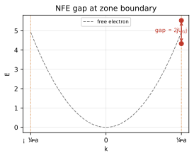
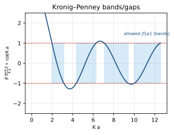
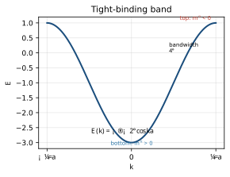

<!-- 固態物理 單元06：能帶理論／Bloch 電子（Energy Bands / Bloch Electrons） · 從高中到資格考 -->

# 固態物理 單元06 — 能帶理論／Bloch 電子（Energy Bands / Bloch Electrons）
### 從高中概念建到資格考

> **使用說明**：本篇從你高中會的東西（波 $y=A\sin(kx-\omega t)$、單變數微分、向量內積、$2\times2$ 行列式、等比級數、$E=\frac12mv^2$）出發，一路推到 Kittel 第 7 章（含第 9 章 tight-binding）等級。符號點 `▸` 就地展開（你高中學過的→為什麼→定義→範例1/2/3）。專有名詞第一次出現用「中文（English）」對照。配套：[單元整理](../考古題/單元整理.html)（出題頻率）、[逐題詳解](../考古題/詳解/index.html)、[教材直讀](../教材/index.html)。
> **慣例（本篇符號）**：晶格平移向量（lattice translation vector）$\mathbf R$（1D 寫 $R=na$，$n\in\mathbb Z$、$a$ 為晶格常數）；倒晶格向量（reciprocal lattice vector）$\mathbf G$，1D 最短的是 $G=2\pi/a$；波向量（wavevector）$\mathbf k$，自由電子能量 $E=\hbar^2k^2/2m$；約化普朗克常數 $\hbar=h/2\pi$；第一布里淵區（first Brillouin zone, BZ）邊界在 1D 是 $k=\pm\pi/a$；週期位能（periodic potential）$U(\mathbf r)$ 滿足 $U(\mathbf r+\mathbf R)=U(\mathbf r)$，其 Fourier 分量寫 $U_{\mathbf G}$。**本篇用 $\mathbf k$ 表 Bloch 標籤（晶體動量），用 $\mathbf K$ 表波動方程裡 $\sqrt{2mE}/\hbar$ 的「能量波數」——兩者不同，Kronig–Penney 那節會特別提醒。**
>
> 📖 **本單元權威出處與教材對照（Textbook & Reference Alignment）**：
> - **Kittel 原文 8e**：Chapter 7（Energy Bands, pp. 161–196），核心公式：Eq. (6) BZ 邊界能隙、Eq. (7) Bloch 定理、Eq. (24) 中心方程、Eq. (28)–(32) Kronig-Penney 模型、Eq. (50) 有效質量、Eq. (60) 緊束縛模型。
> - **林盛煇《固態物理導論》**：第 6 章（§6.1 週期位能與能隙、§6.2 布洛赫定理兩種證法、§6.3 近自由電子模型、§6.4 Kronig-Penney 模型、§6.5 緊束縛模型、§6.6 有效質量與電洞）。
> - **Ashcroft & Mermin**：Ch. 8（Bloch's Theorem）、Ch. 9（Nearly Free Electrons）、Ch. 10（Tight-Binding）。
> - **臺大資格考真題對照**：2013–2025 共 11 次命題（2013, 2014, 2015, 2016, 2017, 2018, 2019, 2020, 2021, 2024, 2025），第一梯隊推導大題重鎮。

---

## 🧭 為什麼要這個單元？（在解決什麼問題、與其他章節的關係）

### 為什麼要學「能帶／Bloch 電子」？

自由電子模型（unit05）有個致命破口：它把晶格抹平了，於是**解釋不了為什麼有些材料導電、有些絕緣**。把 unit01 的**週期性位能**加回電子，能量就裂成一條條**能帶**、中間夾著**能隙**——這正是區分金屬／半導體／絕緣體的根本。第一梯隊、年年必考。

### 在解決什麼問題？

> **核心問題**：電子在**週期性位能**中的波函數長什麼樣？能隙從哪來？電子在晶格裡又該怎麼「運動」？

三個答案：(1) **Bloch 定理** $\psi_{\mathbf k}(\mathbf r)=e^{i\mathbf k\cdot\mathbf r}u_{\mathbf k}(\mathbf r)$（週期性的直接結果）；(2) 能隙開在**布里淵區邊界**（Bragg 反射讓行進波變駐波）；(3) 電子的響應用**晶體動量** $\hbar\mathbf k$ 與**有效質量** $m^*$ 描述。

### 與其他章節的關係

| 相關章節 | 關係 |
|---|---|
| **01 晶體結構（往前接）** | 晶格的平移週期性正是 Bloch 定理的前提 |
| **02 倒晶格（往前接）** | 能帶畫在第一布里淵區；能隙開在 BZ 邊界 |
| **05 自由電子（往前升級）** | 自由電子拋物線 + 週期微擾 → 在 BZ 邊界開 gap |
| **07 半導體（往後給）** | 電洞、有效質量、direct/indirect gap 全在這裡定義 |

> **一句話**：unit05 是「沒有晶格」的電子、unit06 是「加回晶格」的電子——加回去的那一刻能隙誕生，半導體（unit07）才有舞台。

---

## 🎯 這個單元在考什麼（出題地位）

能帶理論是**第一梯隊（幾乎年年考，先吃滿）**單元：2013–2025 共 13 卷裡出現 **11 次**，是「電子」四大段裡最會出長推導的一塊。題型橫跨「硬核證明」（2013–2016 的 Bloch 定理、Kronig–Penney）到「概念圖像」（2017–2018 的能帶圖分材料、Dirac point）。典型配分 **15–55%**（2017 單一大題就 55%）。

| 最常見題型 | 出過的年份 | 對應本篇章節 |
|---|---|---|
| Bloch 定理陳述 + 證明（平移算符法／Kittel 法） | 2013, 2014, 2015, 2016, 2025 | §3, §4 |
| 能隙（energy gap）來源、$U(x)=2U\cos Gx$ 證 $E_g=2U$ | 2013, 2014, 2015, 2018, 2020 | §5 |
| 近自由電子（NFE）vs 自由電子比較 | 2014, 2016 | §5 |
| Kronig–Penney 模型（$P\ll1$ 求最低能、$k=\pi/a$ 能隙） | 2014, 2015, 2016 | §6 |
| 晶體動量（crystal momentum）$\hbar\mathbf k$ 非真動量、為何限第一 BZ | 2016 | §7 |
| 有效質量（effective mass）定義、可為負、電洞速度 | 2017, 2021 | §8 |
| 緊束縛（tight-binding）$E(k)=-\alpha-2\gamma\cos ka$、最高能在何處 | 2025 | §9 |
| 用能帶圖描述 insulator/metal/semimetal/n/p | 2017 | §10 |
| 各向異性能帶 DOS、Dirac point/graphene 線性色散 | 2018, 2024 | §10（連單元 05/07） |

> **一句話**：這個單元的主軸是「**週期性 → 平移對稱 → Bloch 標籤 $\mathbf k$；在 BZ 邊界 Bragg 反射混成駐波 → 開能隙 → 能帶**」。把「Bloch 定理證明」「BZ 邊界開 gap=2|U_G|」「$1/m^*=E''/\hbar^2$」三條手推背熟，就吃下絕大多數配分。

## 🧗 高中起點：你已經會的

- **波 $y=A\sin(kx-\omega t)$**：$k$ 是波數、波長 $\lambda=2\pi/k$；平面波寫成複數 $e^{i(kx-\omega t)}$。← Bloch 波、自由電子波函數。
- **單變數微分／二階導**：$\frac{dE}{dk}$ 是斜率、$\frac{d^2E}{dk^2}$ 是曲率（凹/凸）。← 群速、有效質量。
- **向量內積 $\mathbf k\cdot\mathbf r=k_xx+k_yy+k_zz$**：投影、相位。← 3D Bloch 波 $e^{i\mathbf k\cdot\mathbf r}$。
- **$2\times2$ 行列式 / 解二元一次方程組**：$\begin{vmatrix}a&b\\c&d\end{vmatrix}=ad-bc=0$ 給特徵值。← 簡併微擾的久期方程（secular equation）。
- **等比級數 / 歐拉公式 $e^{i\phi}=\cos\phi+i\sin\phi$**：相位相加；$\cos Gx=\frac12(e^{iGx}+e^{-iGx})$。← 把位能拆成 Fourier 分量。
- **牛頓第二定律 $F=ma$、動能 $E=\frac12mv^2$**：力 → 加速度。← 半古典運動方程、有效質量。
- **波耳模型 / 量子化**：在有限尺寸或週期性下，允許的 $k$ 變成離散格點。← Born–von Kármán 邊界、能帶內 $k$ 點數。

---

## 📚 主線：從高中一路推到考試級

整個單元就是一條因果鏈，先把它記住，後面每節都是這條鏈上的一環：

$$\underbrace{U(\mathbf r+\mathbf R)=U(\mathbf r)}_{\text{週期位能}}\ \Rightarrow\ \underbrace{[T_{\mathbf R},H]=0}_{\text{平移對稱}}\ \Rightarrow\ \underbrace{\psi_{\mathbf k}=e^{i\mathbf k\cdot\mathbf r}u_{\mathbf k}}_{\text{Bloch 定理}}\ \Rightarrow\ \underbrace{\text{BZ 邊界 Bragg 反射}}_{\text{駐波}}\ \Rightarrow\ \underbrace{E_g=2|U_{\mathbf G}|}_{\text{能隙}}\ \Rightarrow\ \underbrace{E_n(\mathbf k)}_{\text{能帶}}\ \Rightarrow\ \underbrace{1/m^*=E''/\hbar^2}_{\text{有效質量}}$$

---

### 1. 為什麼需要「能帶」？自由電子模型的破口（why bands）

**你高中／單元05 學過的**：自由電子費米氣體（free electron Fermi gas）把金屬電子當成「關在盒子裡、彼此不相干、也不感受離子」的氣體，能量是一條連續拋物線
$$E(\mathbf k)=\frac{\hbar^2k^2}{2m}.$$
它成功解釋了金屬的比熱 $\propto T$、Wiedemann–Franz 定律。

**為什麼需要新東西**：這條連續拋物線**永遠沒有能隙**——所以自由電子模型預測**所有固體都是金屬**。但實鑽石是絕緣體、矽是半導體。差在哪？差在我們把離子的**週期位能**忽略了。一旦把 $U(\mathbf r)$（離子排成週期陣列產生的位能）加回 Schrödinger 方程，連續拋物線會在某些 $\mathbf k$ 被「切開」，留下一段段「沒有任何電子態」的能量區間 = **能隙（energy gap）**；被能隙隔開的允許區間就是**能帶（energy band）**。

**定義（中英對照）**：
- **能帶（energy band）**：一段連續的允許電子能量區間。
- **能隙（energy gap）／禁帶（forbidden band）**：能帶之間沒有任何傳播態的能量區間；電子能量不可能落在這裡。

<b>▸ 週期位能 U(r) 與它的 Fourier 分量 U_G</b>

### 你高中學過的
週期函數（如 $\sin,\cos$）可以拆成不同頻率的弦波相加（傅立葉級數）。$\cos Gx=\frac12(e^{iGx}+e^{-iGx})$。

### 為什麼要這個
晶體裡離子排成週期陣列 → 它對電子的位能也週期 $U(\mathbf r+\mathbf R)=U(\mathbf r)$。週期函數最自然的展開是「**只含倒晶格向量 $\mathbf G$ 的諧波**」，因為只有這些波長才跟晶格週期合拍：
$$U(\mathbf r)=\sum_{\mathbf G}U_{\mathbf G}\,e^{i\mathbf G\cdot\mathbf r}.$$

### 定義
$U_{\mathbf G}$ 是第 $\mathbf G$ 個 Fourier 分量（一個複數），$U_{\mathbf G}=\frac1V\int_{\text{cell}}U(\mathbf r)e^{-i\mathbf G\cdot\mathbf r}\,d\mathbf r$。位能實數 ⇒ $U_{-\mathbf G}=U_{\mathbf G}^*$。能隙的大小就由這些 $U_{\mathbf G}$ 決定（§5）。

**範例 1（熱身）**：$U(x)=2U\cos(Gx)$，$G=2\pi/a$。用歐拉公式拆：$2U\cos Gx=U\,e^{iGx}+U\,e^{-iGx}$，所以 $U_{+G}=U_{-G}=U$。**注意 Fourier 分量是 $U$，不是 $2U$**（2013/2014 必考陷阱）。
**範例 2（中階）**：$\delta$ 函數位能 $U(x)=A\sum_n\delta(x-na)$ → 每個 $U_G=A/a$ 都相等（$\delta$ 含所有諧波）。這就是 Kronig–Penney（§6）。
**範例 3（考題）**：弱週期位能下，只有最小的幾個 $U_{\mathbf G}$ 重要；在 BZ 邊界開的第一個能隙 $=2|U_{G_1}|$（$G_1$ 是最短倒晶格向量）。

> **小結**：自由電子模型唯一缺的是「週期位能」。補上它 → 能帶與能隙就長出來，固體才分得出金屬/半導體/絕緣體。

---

### 2. 平移算符（translation operator）：把「週期性」變成可操作的對稱（the symmetry tool）

**你高中學過的**：把一個函數 $f(x)$ 整體往左移 $a$，得到 $f(x+a)$。連續移兩次 $a$ 等於一次移 $2a$。

**為什麼需要新東西**：物理裡「對稱」總對應「守恆量」（轉動對稱→角動量守恆）。晶格的對稱是「平移 $\mathbf R$ 不變」。我們要把這個對稱寫成一個**算符**，才能用量子力學的「對易 → 共同本徵態」機器，逼出 Bloch 定理。

**定義（中英對照）**：**平移算符（translation operator）** $T_{\mathbf R}$ 定義為
$$T_{\mathbf R}\,f(\mathbf r)\equiv f(\mathbf r+\mathbf R).$$

<b>▸ 平移算符 T_R 與對易子 [T_R, H]</b>

### 你高中學過的
函數平移 $f(x)\to f(x+a)$；兩個運算「先後做」的順序有時可換、有時不可換。

### 為什麼要這個
若 $T_{\mathbf R}$ 與哈密頓量（Hamiltonian）$H$ **可交換順序**（對易），量子力學保證它們有「共同本徵態」——這就給每個電子態貼上一個 $\mathbf k$ 標籤。

### 定義
- 算符 $T_{\mathbf R}f(\mathbf r)=f(\mathbf r+\mathbf R)$。
- 對易子（commutator）$[T_{\mathbf R},H]\equiv T_{\mathbf R}H-HT_{\mathbf R}$。若 $=0$ 稱兩者**對易（commute）**。

### 為何 $[T_{\mathbf R},H]=0$
$H=-\frac{\hbar^2}{2m}\nabla^2+U(\mathbf r)$。動能項 $\nabla^2$ 平移不變；位能項 $U(\mathbf r+\mathbf R)=U(\mathbf r)$（週期）。所以平移前後 $H$ 長一樣 → $T_{\mathbf R}(H\psi)=H(T_{\mathbf R}\psi)$ → $[T_{\mathbf R},H]=0$。

**範例 1（熱身）**：自由電子 $U=0$，$H$ 純動能，對**任意**平移都不變（連續平移對稱）→ 動量本徵態 $e^{ikx}$ 是共同本徵態。
**範例 2（中階）**：週期位能下只對**晶格平移 $\mathbf R$** 不變（不是任意平移）→ 共同本徵態是 Bloch 態，$\mathbf k$ 只在第一 BZ 不重複。
**範例 3（考題）**：$T_{\mathbf R}T_{\mathbf R'}=T_{\mathbf R+\mathbf R'}=T_{\mathbf R'}T_{\mathbf R}$——平移群可交換，是 §3 Step 2 的關鍵。

> **小結**：週期位能 ⇒ $[T_{\mathbf R},H]=0$。這一條是 Bloch 定理的全部地基。

---

### 3. Bloch 定理（Bloch theorem）— 證法 A：平移算符與 $H$ 對易（the operator proof）

> 📖 **本節核心出處與說明（Ref）**：
> - **權威教材**：Kittel 8e Ch. 7 p. 168 ｜ 林盛煇 §6.2 ｜ A&M Ch. 8
> - **歷年考題**：[NTU 2013](../考古題/詳解/固態_2013_詳解.html), [2014](../考古題/詳解/固態_2014_詳解.html), [2015 Q6](../考古題/詳解/固態_2015_詳解.html), [2016 Q5（25分）](../考古題/詳解/固態_2016_詳解.html)
> - **觀念說明**：利用晶格平移算符與哈密頓算符對易 $[T_{\mathbf R}, H] = 0$，由共同本徵態與阿貝爾群特性證明 $\psi(\mathbf r+\mathbf R) = e^{i\mathbf k \cdot \mathbf R}\psi(\mathbf r)$。

**定理（陳述）**：在週期位能中，單電子 Schrödinger 方程的本徵態可寫成「平面波 × 與晶格同週期的函數」：
$$\boxed{\ \psi_{\mathbf k}(\mathbf r)=e^{i\mathbf k\cdot\mathbf r}\,u_{\mathbf k}(\mathbf r),\qquad u_{\mathbf k}(\mathbf r+\mathbf R)=u_{\mathbf k}(\mathbf r)\ }$$
等價敘述：$\psi(\mathbf r+\mathbf R)=e^{i\mathbf k\cdot\mathbf R}\,\psi(\mathbf r)$（平移一個晶格向量，波函數只多一個相位）。

<b>▸ 晶格週期函數 u_k(r) 與 Bloch 波向量／晶體動量 k</b>

### 你高中學過的
平面波 $e^{ikx}$；週期函數 $u(x+a)=u(x)$。Bloch 態就是兩者相乘。

### 為什麼要這個
自由電子是純平面波 $e^{i\mathbf k\cdot\mathbf r}$（機率密度處處相同）。晶體裡電子密度應該在離子附近高一點——$u_{\mathbf k}(\mathbf r)$ 就是那個「在一個原胞內起伏、但每個原胞重複」的調制因子。

### 定義
$\psi_{\mathbf k}=e^{i\mathbf k\cdot\mathbf r}u_{\mathbf k}$；$u_{\mathbf k}(\mathbf r+\mathbf R)=u_{\mathbf k}(\mathbf r)$。$\mathbf k$ 是平移群的量子數（標籤），稱 **Bloch 波向量**；$\hbar\mathbf k$ 稱**晶體動量（crystal momentum）**（§7 解釋為何不是真動量）。

**範例 1（熱身）**：$U=0$（自由電子）→ $u_{\mathbf k}=$ 常數 → $\psi=e^{i\mathbf k\cdot\mathbf r}$，回到平面波 ✓。
**範例 2（中階）**：弱位能 → $u_{\mathbf k}$ 在離子上略大；BZ 邊界 → $u$ 使 $\psi$ 變駐波 $\cos,\sin$（§5）。
**範例 3（考題）**：2025 Q3(a) 直接問「3D Bloch 波函數」→ 答 $\psi_{\mathbf k}(\mathbf r)=e^{i\mathbf k\cdot\mathbf r}u_{\mathbf k}(\mathbf r)$，$u_{\mathbf k}(\mathbf r+\mathbf R)=u_{\mathbf k}(\mathbf r)$。

<figure style="margin:1.3em 0;text-align:center">
<svg viewBox="0 0 560 360" width="100%" style="max-width:640px;border:1px solid #ddd;border-radius:8px;background:#fff;padding:6px;box-sizing:border-box" xmlns="http://www.w3.org/2000/svg">
<defs>
<marker id="ar06bw" markerWidth="9" markerHeight="9" refX="6" refY="3" orient="auto"><path d="M0,0 L6,3 L0,6 Z" fill="#666"/></marker>
</defs>
<g font-family="-apple-system,sans-serif">
<text x="280" y="18" text-anchor="middle" font-size="13.5" font-weight="bold" fill="#1a4d7c">Bloch 波 ψₖ = e^(ikx) × uₖ(x)：平面波 × 週期調制</text>
<text x="14" y="58" font-size="12.5" font-weight="bold" fill="#1a4d7c">平面波 e^(ikx) 的實部（長波包絡）</text>
<line x1="30" y1="90" x2="540" y2="90" stroke="#bbb" stroke-width="1"/>
<polyline points="30,90 60,62 90,49 120,62 150,90 180,118 210,131 240,118 270,90 300,62 330,49 360,62 390,90 420,118 450,131 480,118 510,90 540,62" fill="none" stroke="#1a4d7c" stroke-width="2.2"/>
<text x="14" y="158" font-size="12.5" font-weight="bold" fill="#2e8b2e">週期函數 uₖ(x)（每個原胞重複，離子上偏高）</text>
<line x1="30" y1="195" x2="540" y2="195" stroke="#bbb" stroke-width="1"/>
<g stroke="#2e8b2e" stroke-width="2" fill="none"><path d="M30,178 Q47,150 64,178 Q81,206 98,178 Q115,150 132,178 Q149,206 166,178 Q183,150 200,178 Q217,206 234,178 Q251,150 268,178 Q285,206 302,178 Q319,150 336,178 Q353,206 370,178 Q387,150 404,178 Q421,206 438,178 Q455,150 472,178 Q489,206 506,178 Q523,150 540,178"/></g>
<g stroke="#888" stroke-width="0.8" stroke-dasharray="3,4"><line x1="30" y1="150" x2="540" y2="150"/><line x1="64" y1="225" x2="64" y2="135"/><line x1="132" y1="225" x2="132" y2="135"/><line x1="200" y1="225" x2="200" y2="135"/><line x1="268" y1="225" x2="268" y2="135"/><line x1="336" y1="225" x2="336" y2="135"/><line x1="404" y1="225" x2="404" y2="135"/><line x1="472" y1="225" x2="472" y2="135"/></g>
<text x="64" y="240" text-anchor="middle" font-size="11" fill="#2e8b2e">a</text>
<text x="132" y="240" text-anchor="middle" font-size="11" fill="#2e8b2e">2a</text>
<text x="200" y="240" text-anchor="middle" font-size="11" fill="#2e8b2e">3a</text>
<text x="14" y="270" font-size="12.5" font-weight="bold" fill="#c0392b">乘起來 ψₖ：細結構（uₖ）被慢包絡（e^(ikx)）調制</text>
<line x1="30" y1="312" x2="540" y2="312" stroke="#bbb" stroke-width="1"/>
<polyline points="30,303 39,290 48,303 57,316 66,303 75,283 84,272 93,283 102,300 111,279 120,266 129,280 138,302 147,294 156,308 165,322 174,310 183,326 192,340 201,328 210,335 219,326 228,338 237,329 246,340 255,331 264,341 273,332 282,341 291,332 300,341 309,328 318,335 327,322 336,329 345,310 354,322 363,308 372,318 381,300 390,310 399,294 408,302 417,290 426,300 435,284 444,294 453,282 462,290 471,280 480,288 489,283 498,289 507,288 516,292 525,295 534,300 540,303" fill="none" stroke="#c0392b" stroke-width="2"/>
<line x1="30" y1="278" x2="540" y2="278" stroke="#1a4d7c" stroke-width="0.9" stroke-dasharray="4,3" opacity="0.55"/>
<text x="430" y="300" font-size="10.5" fill="#1a4d7c">藍虛線 = e^(ikx) 包絡</text>
<line x1="30" y1="345" x2="548" y2="345" stroke="#444" stroke-width="1.1" marker-end="url(#ar06bw)"/>
<text x="540" y="358" text-anchor="end" font-size="11" fill="#444">x →</text>
</g>
</svg>
<figcaption style="font-size:0.9em;color:#555;margin-top:0.5em">Bloch 波就是兩件東西<b>相乘</b>：上排是<b>平面波</b> e^(ikx)（波長 2π/k，是慢慢起伏的「包絡」）；中排是<b>晶格週期函數</b> uₖ(x)（每隔一個晶格常數 a 完全重複，圖中故意讓它在離子位置鼓起、機率密度偏高）。乘起來（下排紅線）就是<b>細結構（每個原胞內的起伏）被一條慢包絡（藍虛線）調制</b>的波。自由電子是 uₖ = 常數 → 退回純平面波。這張圖就是 2025 Q3(a)「畫出 Bloch 波函數」要的圖像。</figcaption>
</figure>

#### Step 1 — 把平移寫成算符，並確認與 $H$ 對易
定義 $T_{\mathbf R}f(\mathbf r)=f(\mathbf r+\mathbf R)$。因動能平移不變、位能週期 $U(\mathbf r+\mathbf R)=U(\mathbf r)$，
$$T_{\mathbf R}\big(H\psi\big)=H(\mathbf r+\mathbf R)\psi(\mathbf r+\mathbf R)=H(\mathbf r)\big(T_{\mathbf R}\psi\big)\ \Rightarrow\ \boxed{[T_{\mathbf R},H]=0.}$$

#### Step 2 — 平移群互相對易 ⇒ 有共同本徵態
$$T_{\mathbf R}T_{\mathbf R'}=T_{\mathbf R+\mathbf R'}=T_{\mathbf R'}T_{\mathbf R}.$$
一族**互相對易、又都與 $H$ 對易**的算符，量子力學保證它們有**共同本徵態**——存在一組 $\psi$ 同時是所有 $T_{\mathbf R}$ 與 $H$ 的本徵態。下面就把這些 $\psi$ 找出來。

#### Step 3 — $T_{\mathbf R}$ 的本徵值模長必為 1
設 $T_{\mathbf R}\psi=c(\mathbf R)\,\psi$。平移不改變總機率（$\int|\psi(\mathbf r+\mathbf R)|^2d\mathbf r=\int|\psi(\mathbf r)|^2d\mathbf r$），所以
$$|c(\mathbf R)|^2=1\ \Rightarrow\ \boxed{|c(\mathbf R)|=1.}$$

#### Step 4 — 解函數方程，逼出指數相位
由 Step 2，$T_{\mathbf R}T_{\mathbf R'}\psi=T_{\mathbf R+\mathbf R'}\psi$，對本徵值即
$$c(\mathbf R)\,c(\mathbf R')=c(\mathbf R+\mathbf R').$$
這是「對加法為乘法同態」的條件。配上 $|c|=1$，唯一解是指數形（如同 $f(x+y)=f(x)f(y)$ 解出 $e^{\lambda x}$，這裡 $\lambda$ 為純虛數才滿足 $|c|=1$）：
$$\boxed{c(\mathbf R)=e^{i\mathbf k\cdot\mathbf R}}\quad(\text{某實向量 }\mathbf k).$$
代回 $T_{\mathbf R}\psi=c(\mathbf R)\psi$ 得 $\psi(\mathbf r+\mathbf R)=e^{i\mathbf k\cdot\mathbf R}\psi(\mathbf r)$——這已是 Bloch 定理的等價敘述。

#### Step 5 — 化成標準 Bloch 形 $\psi=e^{i\mathbf k\cdot\mathbf r}u_{\mathbf k}$
定義 $u_{\mathbf k}(\mathbf r)\equiv e^{-i\mathbf k\cdot\mathbf r}\psi(\mathbf r)$，驗證它週期：
$$u_{\mathbf k}(\mathbf r+\mathbf R)=e^{-i\mathbf k\cdot(\mathbf r+\mathbf R)}\psi(\mathbf r+\mathbf R)=e^{-i\mathbf k\cdot\mathbf r}\underbrace{e^{-i\mathbf k\cdot\mathbf R}\,e^{i\mathbf k\cdot\mathbf R}}_{=1}\psi(\mathbf r)=e^{-i\mathbf k\cdot\mathbf r}\psi(\mathbf r)=u_{\mathbf k}(\mathbf r).\ \blacksquare$$
於是 $\psi_{\mathbf k}(\mathbf r)=e^{i\mathbf k\cdot\mathbf r}u_{\mathbf k}(\mathbf r)$，$u_{\mathbf k}$ 與晶格同週期。**證畢。**

<b>📝 更多範例（點開）：平移本徵值、|c|=1、相位疊加都算一遍</b>

**範例 A（驗證 $T_R$ 的本徵值就是 $e^{ikR}$，1D 自由電子）**：取 $\psi(x)=e^{ikx}$，作用 $T_a$：
$$T_a\psi(x)=\psi(x+a)=e^{ik(x+a)}=e^{ika}\,e^{ikx}=e^{ika}\psi(x).$$
所以本徵值 $c(a)=e^{ika}$，模長 $|c(a)|=|e^{ika}|=\sqrt{\cos^2 ka+\sin^2 ka}=1$ ✓。再連續平移兩次：$T_aT_a\psi=T_{2a}\psi=e^{ik(2a)}\psi$，而 $c(a)\,c(a)=e^{ika}e^{ika}=e^{i2ka}=c(2a)$——驗證了 Step 4 的同態關係 $c(R)c(R')=c(R+R')$。

**範例 B（為什麼一定要 $|c|=1$：反例）**：若硬設 $c(a)=2$（實數、模長 $\ne1$），則 $T_{na}\psi=c(a)^n\psi=2^n\psi$。當 $n\to\infty$（往右無限多格）波幅 $2^n\to\infty$，無法歸一（$\int|\psi|^2=\infty$）。同理 $|c|<1$ 往左發散。唯一兩邊都不爆的選擇是 $|c|=1$，於是 $c=e^{i\theta}$，把 $\theta$ 寫成 $kR$（線性於 $R$ 才滿足同態）就得 $c(R)=e^{ikR}$。這就是 Step 3 的嚴格理由。

**範例 C（從 $\psi(x+a)=e^{ika}\psi(x)$ 反推 $u_k$ 週期，數值代一遍）**：設 $k=\frac{\pi}{2a}$，某 Bloch 態在 $x=0$ 取 $\psi(0)=1$。則 $\psi(a)=e^{ika}\psi(0)=e^{i\pi/2}=i$；$\psi(2a)=e^{ika}\psi(a)=i\cdot i=-1$。檢查 $u_k(x)=e^{-ikx}\psi(x)$：$u_k(0)=e^0\cdot1=1$，$u_k(a)=e^{-i\pi/2}\cdot i=(-i)(i)=1$，$u_k(2a)=e^{-i\pi}\cdot(-1)=(-1)(-1)=1$——三點全相等 $\Rightarrow u_k$ 果然以 $a$ 為週期 ✓。波函數 $\psi$ 每平移一格只轉相位、$u_k$ 數值不變，正是 Bloch 形的核心。

**範例 D（3D：平移向量相加的相位，2025 考點）**：3D Bloch 態滿足 $\psi(\mathbf r+\mathbf R)=e^{i\mathbf k\cdot\mathbf R}\psi(\mathbf r)$。沿 $\mathbf R_1=\mathbf a_1$ 再沿 $\mathbf R_2=\mathbf a_2$ 平移：
$$\psi(\mathbf r+\mathbf a_1+\mathbf a_2)=e^{i\mathbf k\cdot\mathbf a_2}\psi(\mathbf r+\mathbf a_1)=e^{i\mathbf k\cdot\mathbf a_2}e^{i\mathbf k\cdot\mathbf a_1}\psi(\mathbf r)=e^{i\mathbf k\cdot(\mathbf a_1+\mathbf a_2)}\psi(\mathbf r).$$
相位指數對平移向量**線性相加**——這正是 $c(\mathbf R)=e^{i\mathbf k\cdot\mathbf R}$ 為群同態的 3D 版，與先後順序無關（平移群可交換）。

> **小結**：整個證明唯一的輸入是「**平移對稱（週期位能）＋ 歸一不變**」。Bloch 不是假設，是對稱性的必然結果。這是 2013/2014/2016 的標準答案。

---

### 4. Bloch 定理 — 證法 B：Kittel 的傅立葉／中心方程（central equation）法（the Fourier proof）

證法 A 漂亮但抽象；考題（2014/2016 提示「或循 Kittel」）也接受**直接把波函數與位能展成 Fourier 級數**，硬解 Schrödinger 方程。這條路額外送你一個超有用的工具——**中心方程（central equation）**，後面 §5、§6 都靠它。

**設定**：1D Schrödinger 方程
$$-\frac{\hbar^2}{2m}\frac{d^2\psi}{dx^2}+U(x)\psi=E\psi.\tag{$\star$}$$

#### Step 1 — 把位能展成倒晶格諧波
週期位能只含倒晶格向量 $G$ 的諧波：
$$U(x)=\sum_{G}U_G\,e^{iGx},\qquad G=\frac{2\pi}{a}\times(\text{整數}).$$

#### Step 2 — 把波函數展成所有允許 $k$ 的平面波
有限長度 $L$ + 週期（Born–von Kármán）邊界 ⇒ 允許 $k=2\pi n/L$。先**不**假設 $\psi$ 週期，只寫最一般的 Fourier 級數：
$$\psi(x)=\sum_{k}C(k)\,e^{ikx}.$$

#### Step 3 — 代入 ($\star$)，逐項配係數
動能項：$-\frac{\hbar^2}{2m}\frac{d^2}{dx^2}e^{ikx}=\frac{\hbar^2k^2}{2m}e^{ikx}\equiv\lambda_k e^{ikx}$，其中 $\lambda_k\equiv\frac{\hbar^2k^2}{2m}$。位能項：
$$U(x)\psi=\sum_G\sum_{k'}U_G C(k')e^{i(k'+G)x}.$$
令 $k=k'+G$（即 $k'=k-G$），位能項變 $\sum_k\big[\sum_G U_G C(k-G)\big]e^{ikx}$。把 ($\star$) 整理成 $\sum_k[\,\cdots\,]e^{ikx}=0$。

#### Step 4 — 每個 Fourier 分量各自為零 ⇒ 中心方程
不同 $e^{ikx}$ 線性獨立，係數必須**逐個為零**：
$$\boxed{\ (\lambda_k-E)\,C(k)+\sum_{G}U_G\,C(k-G)=0\ }\tag{central equation}$$
這就是 **central equation**：把微分方程換成一組「只把相差 $G$ 的係數耦在一起」的代數方程。

#### Step 5 — 讀出 Bloch 形（這一步就是 Bloch 定理）
中心方程只耦合 $C(k),C(k-G),C(k-2G),\dots$——也就是**只有相差倒晶格向量的 $k$ 才互相牽連**。所以一個本徵態 $\psi$ 只由「某個 $k$ 加上所有 $k-G$」組成：
$$\psi_k(x)=\sum_G C(k-G)\,e^{i(k-G)x}=e^{ikx}\underbrace{\sum_G C(k-G)\,e^{-iGx}}_{\equiv\,u_k(x)}.$$
括起來的 $u_k(x)=\sum_G C(k-G)e^{-iGx}$ 只含 $e^{-iGx}$，而 $e^{-iG(x+a)}=e^{-iGx}$（因 $Ga=2\pi\times$整數），所以 $u_k(x+a)=u_k(x)$——**週期！** 於是 $\psi_k=e^{ikx}u_k$，再次得 Bloch 形。**證畢。**

> **小結**：兩種證法殊途同歸。證法 A 給「為什麼有 $\mathbf k$ 標籤」；證法 B 給「怎麼實際算能帶」的工具（central equation），且 Kittel 特別說它「即使 $\lambda_k$ 簡併也精確成立」。**考試遇到「Bloch 定理證明」兩法擇一即可；但 central equation 一定要會，因為 §5、§6 都用它。**

---

### 5. 能隙從哪來？近自由電子（nearly free electron）在 BZ 邊界開 gap（the origin of the gap）

> 📖 **本節核心出處與說明（Ref）**：
> - **權威教材**：Kittel 8e Ch. 7 Eq. (6) p. 167 ｜ 林盛煇 §6.1 ｜ A&M Ch. 9
> - **歷年考題**：[NTU 2013 Q9](../考古題/詳解/固態_2013_詳解.html), [2014 Q6](../考古題/詳解/固態_2014_詳解.html), [2018 Q3](../考古題/詳解/固態_2018_詳解.html), [2020 Q6](../考古題/詳解/固態_2020_詳解.html)
> - **觀念說明**：布拉格反射在布里淵區邊界形成兩組正交駐波 $\psi_+$（電子聚集於離子實勢能低）與 $\psi_-$（電子聚集於間隙勢能高），能量差即為能隙 $E_g = 2|U_G|$。

**你高中學過的**：兩道反向波疊加成**駐波**（站著不動的波，如吉他弦）。

**為什麼需要新東西**：自由電子拋物線連續無隙。但在 BZ 邊界 $k=\pm\pi/a$，電子波長 $\lambda=2\pi/k=2a$ 剛好滿足 Bragg 條件（$2a\cdot$... 對應 $n=1$ 反射），被晶格**強烈反射**：前進波 $e^{i\pi x/a}$ 與反射波 $e^{-i\pi x/a}$ 簡併（能量相同），被位能的 Fourier 分量耦成兩個駐波，能量裂開——這道裂縫就是能隙。

**定義（中英對照）**：
- **近自由電子模型（nearly free electron model, NFE）**：把週期位能當**微擾**加到自由電子上。
- **能隙 $E_g=2|U_G|$**：BZ 邊界裂開的大小 = 2 倍那個耦合的 Fourier 分量。

我們用 §4 的 central equation，在弱位能 $U(x)=2U\cos Gx$（$G=2\pi/a$，故 $U_G=U_{-G}=U$）下證 $E_g=2U$。

#### Step 1 — 在 BZ 邊界只保留兩個簡併分量
邊界 $k=\pi/a=G/2$。與它經由 $U_{\pm G}$ 耦合、且能量最接近的是 $k-G=-\pi/a$。注意
$$\lambda_k=\frac{\hbar^2}{2m}\Big(\frac\pi a\Big)^2=\lambda,\qquad \lambda_{k-G}=\frac{\hbar^2}{2m}\Big(-\frac\pi a\Big)^2=\lambda\quad(\text{兩者相等！})$$
弱位能下其他係數 $C(k\pm 2G)$ 很小，截斷成兩條方程（only $C(k)$ 與 $C(k-G)$）。

#### Step 2 — 寫出兩條中心方程
$$(\lambda-E)\,C(k)+U\,C(k-G)=0,$$
$$(\lambda-E)\,C(k-G)+U\,C(k)=0.$$
（因 $U_{+G}=U_{-G}=U$，兩條對稱。）

#### Step 3 — 久期方程（secular equation）給能量
非零解要求係數矩陣行列式為零：
$$\begin{vmatrix}\lambda-E & U\\ U & \lambda-E\end{vmatrix}=0\ \Rightarrow\ (\lambda-E)^2=U^2\ \Rightarrow\ E_\pm=\lambda\pm U.$$

#### Step 4 — 讀出能隙
$$\boxed{\ E_g=E_+-E_-=(\lambda+U)-(\lambda-U)=2U=2|U_G|.\ }$$

<figure style="margin:1.3em 0;text-align:center">
<svg viewBox="0 0 520 330" width="100%" style="max-width:600px;border:1px solid #ddd;border-radius:8px;background:#fff;padding:6px;box-sizing:border-box" xmlns="http://www.w3.org/2000/svg">
<defs>
<marker id="ar06nfe" markerWidth="9" markerHeight="9" refX="6" refY="3" orient="auto"><path d="M0,0 L6,3 L0,6 Z" fill="#444"/></marker>
</defs>
<g font-family="-apple-system,sans-serif">
<text x="260" y="18" text-anchor="middle" font-size="13.5" font-weight="bold" fill="#1a4d7c">近自由電子：BZ 邊界開能隙 E_g = 2|U_G|</text>
<line x1="260" y1="40" x2="260" y2="300" stroke="#444" stroke-width="1.2" marker-end="url(#ar06nfe)"/>
<line x1="40" y1="290" x2="495" y2="290" stroke="#444" stroke-width="1.2" marker-end="url(#ar06nfe)"/>
<text x="252" y="36" text-anchor="end" font-size="11.5" fill="#444">E</text>
<text x="490" y="307" font-size="11.5" fill="#444">k</text>
<g stroke="#aaa" stroke-width="0.9" stroke-dasharray="4,4"><line x1="120" y1="40" x2="120" y2="290"/><line x1="400" y1="40" x2="400" y2="290"/></g>
<text x="120" y="307" text-anchor="middle" font-size="11" fill="#666">−π/a</text>
<text x="400" y="307" text-anchor="middle" font-size="11" fill="#666">+π/a</text>
<text x="260" y="307" text-anchor="middle" font-size="11" fill="#666">0</text>
<polyline points="60,72 90,108 120,140 150,180 180,214 210,242 240,260 260,266 280,260 310,242 340,214 370,180 400,140 430,108 460,72" fill="none" stroke="#bbb" stroke-width="1.6" stroke-dasharray="5,4"/>
<text x="455" y="64" text-anchor="middle" font-size="10.5" fill="#999">自由拋物線</text>
<polyline points="60,108 90,128 118,150 120,150" fill="none" stroke="#1a4d7c" stroke-width="2.6"/>
<polyline points="120,182 150,206 180,232 210,252 240,264 260,268 280,264 310,252 340,232 370,206 400,182" fill="none" stroke="#1a4d7c" stroke-width="2.6"/>
<polyline points="400,150 402,150 430,128 460,108" fill="none" stroke="#1a4d7c" stroke-width="2.6"/>
<polyline points="120,150 122,150 150,128 180,108 210,92 240,82 260,80 280,82 310,92 340,108 370,128 398,150 400,150" fill="none" stroke="#c0392b" stroke-width="2.6"/>
<line x1="400" y1="150" x2="400" y2="182" stroke="#2e8b2e" stroke-width="2.4"/>
<line x1="120" y1="150" x2="120" y2="182" stroke="#2e8b2e" stroke-width="2.4"/>
<text x="416" y="170" font-size="11.5" font-weight="bold" fill="#2e8b2e">E_g</text>
<text x="430" y="86" font-size="11" fill="#c0392b">上分支 E₊</text>
<text x="60" y="100" font-size="11" fill="#1a4d7c">下分支 E₋</text>
</g>
</svg>
<figcaption style="font-size:0.9em;color:#555;margin-top:0.5em">灰虛線是<b>自由電子拋物線</b> E = ℏ²k²/2m（連續、無隙）。加上弱週期位能後，在每個<b>BZ 邊界 k = ±π/a</b>（前進波與反射波簡併處）拋物線被<b>切開</b>：下方一段（藍）變成<b>下分支 E₋</b>，上方接到<b>上分支 E₊</b>（紅），中間夾出寬度 <b>E_g = 2|U_G|</b> 的禁帶（綠線）。BZ 邊界上能帶<b>變平</b>（斜率 → 0，駐波），正是「沒有電子態」的能隙。把這條拋物線一段段切開，就得到能帶。</figcaption>
</figure>

#### Step 5 — 兩個解對應什麼駐波（物理圖像）
$E_-=\lambda-U$ 對應 $C(k)=-C(k-G)$ 還是 $+$？代回得：
$$\psi_+\propto e^{i\pi x/a}+e^{-i\pi x/a}=2\cos\frac{\pi x}{a},\qquad \psi_-\propto e^{i\pi x/a}-e^{-i\pi x/a}=2i\sin\frac{\pi x}{a}.$$
$|\psi_{\cos}|^2$ 把電子密度堆在**離子上**（位能低）→ 能量低 = 帶頂下緣 $E_-$（取 $U>0$ 時 $\cos$ 對應低能）；$|\psi_{\sin}|^2$ 堆在**離子間**（位能高）→ 能量高 = $E_+$。兩種「站法」的能量差正是 $2|U_G|$。

<b>📝 更多範例（點開）：給定 U(x) 算 E_g、久期方程、cos/sin 駐波</b>

**範例 A（$U(x)=2U\cos Gx$ → $E_g=2U$，完整代數）**：先把位能拆 Fourier：$2U\cos Gx=U e^{iGx}+U e^{-iGx}$，故 $U_{+G}=U_{-G}=U$。在 BZ 邊界 $k=G/2=\pi/a$，與 $k-G=-\pi/a$ 簡併（$\lambda_k=\lambda_{k-G}=\frac{\hbar^2}{2m}(\pi/a)^2\equiv\lambda$）。兩條中心方程
$$(\lambda-E)C(k)+U\,C(k-G)=0,\qquad (\lambda-E)C(k-G)+U\,C(k)=0.$$
行列式 $\begin{vmatrix}\lambda-E&U\\U&\lambda-E\end{vmatrix}=(\lambda-E)^2-U^2=0\Rightarrow E_\pm=\lambda\pm U$。能隙
$$E_g=E_+-E_-=(\lambda+U)-(\lambda-U)=2U=2|U_G|.$$
**陷阱**：$\cos$ 前面那個「$2U$」不是 $U_G$；$U_G=U$，能隙才剛好等於 $2U$（巧合地與 $\cos$ 前係數相同，但物理意義不同）。

**範例 B（$U(x)=2V\cos\frac{2\pi x}{a}+2W\cos\frac{4\pi x}{a}$ → 兩個能隙）**：第一項給 $U_{G_1}=V$（$G_1=2\pi/a$），第二項給 $U_{G_2}=W$（$G_2=4\pi/a$）。
- **第一 BZ 邊界 $k=\pi/a$**：由 $G_1$ 耦合 $\pm\pi/a$ → $E_{g,1}=2|U_{G_1}|=2V$。
- **第二 BZ 邊界 $k=2\pi/a$ 折回**：由 $G_2$ 耦合 $\pm2\pi/a$ → $E_{g,2}=2|U_{G_2}|=2W$。
注意 $V,W$ 各自獨立開自己的隙；通常 $|W|<|V|$（高階 Fourier 分量衰減）→ 第二能隙較窄。

**範例 C（數值代入）**：設 $a=3{\rm\,Å}=3\times10^{-10}$ m，$U=1.0$ eV。BZ 邊界 free 能量
$$\lambda=\frac{\hbar^2}{2m}\Big(\frac\pi a\Big)^2=\frac{(1.055\times10^{-34})^2}{2(9.11\times10^{-31})}\Big(\frac{3.1416}{3\times10^{-10}}\Big)^2\approx\frac{1.11\times10^{-68}}{1.82\times10^{-30}}\,(1.047\times10^{10})^2.$$
$(1.047\times10^{10})^2=1.097\times10^{20}$，故 $\lambda\approx6.11\times10^{-39}\times1.097\times10^{20}\approx6.7\times10^{-19}$ J $\approx4.2$ eV。於是 $E_-=\lambda-U\approx3.2$ eV、$E_+=\lambda+U\approx5.2$ eV，能隙 $E_g=2U=2.0$ eV。能隙只由 $U$ 定、與 $\lambda$（拋物線高度）無關。

**範例 D（駐波能量誰高，符號討論）**：$\psi_+=2\cos\frac{\pi x}{a}$ 的密度峰在 $x=0,a,2a,\dots$（離子位置）。若離子帶正電、位能 $U(x)$ 在離子處為**極小**（負最深），電子待在低位能處 → $E_{\cos}$ 較低 = $E_-$。$\psi_-=2i\sin\frac{\pi x}{a}$ 密度峰在 $x=a/2,3a/2,\dots$（離子之間）→ 位能高 → $E_{\sin}=E_+$。反之若 $U>0$ 在離子處為極大（如某些約定），$\cos$ 反而對應高能——所以**「誰高」取決於 $U_G$ 的正負號**，能隙大小 $2|U_G|$ 不變。

<figure style="margin:1.3em 0;text-align:center">
<svg viewBox="0 0 560 320" width="100%" style="max-width:640px;border:1px solid #ddd;border-radius:8px;background:#fff;padding:6px;box-sizing:border-box" xmlns="http://www.w3.org/2000/svg">
<defs>
<radialGradient id="ion06sw" cx="35%" cy="30%" r="75%"><stop offset="0" stop-color="#f0a79b"/><stop offset="1" stop-color="#c0392b"/></radialGradient>
</defs>
<g font-family="-apple-system,sans-serif">
<text x="280" y="18" text-anchor="middle" font-size="13.5" font-weight="bold" fill="#1a4d7c">兩種駐波怎麼站，決定誰能量高（BZ 邊界 k = π/a）</text>
<g fill="url(#ion06sw)" stroke="#7d2418" stroke-width="0.7"><circle cx="100" cy="150" r="10"/><circle cx="220" cy="150" r="10"/><circle cx="340" cy="150" r="10"/><circle cx="460" cy="150" r="10"/></g>
<g stroke="#888" stroke-width="0.8" stroke-dasharray="3,4"><line x1="100" y1="40" x2="100" y2="280"/><line x1="220" y1="40" x2="220" y2="280"/><line x1="340" y1="40" x2="340" y2="280"/><line x1="460" y1="40" x2="460" y2="280"/></g>
<text x="100" y="172" text-anchor="middle" font-size="10" fill="#7d2418">離子</text>
<text x="280" y="172" text-anchor="middle" font-size="10" fill="#555">離子間</text>
<text x="14" y="100" font-size="12" font-weight="bold" fill="#1a4d7c">|ψ_cos|²：密度堆在離子上 → 位能低 → E₋（低）</text>
<polyline points="40,128 70,82 100,55 130,82 160,128 190,82 220,55 250,82 280,128 310,82 340,55 370,82 400,128 430,82 460,55 490,82 520,128" fill="none" stroke="#1a4d7c" stroke-width="2.4"/>
<text x="14" y="244" font-size="12" font-weight="bold" fill="#c0392b">|ψ_sin|²：密度堆在離子間 → 位能高 → E₊（高）</text>
<polyline points="40,210 70,255 100,282 130,255 160,210 190,255 220,282 250,255 280,210 310,255 340,282 370,255 400,210 430,255 460,282 490,255 520,210" fill="none" stroke="#c0392b" stroke-width="2.4"/>
<line x1="528" y1="55" x2="528" y2="128" stroke="#2e8b2e" stroke-width="2"/>
<line x1="528" y1="210" x2="528" y2="282" stroke="#2e8b2e" stroke-width="2"/>
</g>
</svg>
<figcaption style="font-size:0.9em;color:#555;margin-top:0.5em">在 BZ 邊界 k = π/a，前進波與反射波簡併，混成兩個<b>駐波</b>。<b>ψ_cos</b>（藍）的機率密度峰落在<b>離子上</b>（位能最低處）→ 電子待在能量低的地方 → 對應<b>低能解 E₋</b>；<b>ψ_sin</b>（紅）的峰落在<b>離子之間</b>（位能高）→ 對應<b>高能解 E₊</b>。同一個 k 卻有兩種「站法」、兩個能量，差值就是能隙 E_g = E₊ − E₋ = 2|U_G|。「為什麼能隙在這裡開」的物理圖像就是這張圖。</figcaption>
</figure>

> **小結**：能隙 = 兩個簡併平面波被單一 Fourier 分量 $U_G$ 耦成駐波後的能量分裂 $=2|U_G|$。
> **致命陷阱（2013/2014 反覆考）**：$U(x)=2U\cos Gx$ 的 Fourier 分量是 $U_G=U$（不是 $2U$！），所以 $E_g=2|U_G|=2U$。那個「2」來自 $\pm G$ 兩個分量，別跟 $\cos$ 前的係數混淆。
> **NFE vs free 一句話**：自由電子 $E=\hbar^2k^2/2m$ 連續無隙（永遠金屬）；近自由電子在每個 BZ 邊界開 $E_g=2|U_{G_n}|$，把拋物線切成一條條能帶 → 才能解釋絕緣體/半導體。$U_G\to0$ 時 gap$\to0$ 回到自由電子。

---

### 6. 克勒尼希–潘尼模型（Kronig–Penney model）：唯一能解析解的能帶（the solvable model）

> 📖 **本節核心出處與說明（Ref）**：
> - **權威教材**：Kittel 8e Ch. 7 Eq. (28)–(32) pp. 175–178 ｜ 林盛煇 §6.4
> - **歷年考題**：[NTU 2014 Q6（15分）](../考古題/詳解/固態_2014_詳解.html), [2015 Q6](../考古題/詳解/固態_2015_詳解.html), [2016 Q5](../考古題/詳解/固態_2016_詳解.html)
> - **觀念說明**：週期方勢壘薛丁格方程解析解，色散超越方程 $P\frac{\sin Ka}{Ka} + \cos Ka = \cos ka$。弱勢極限 $P \ll 1$ 下第一能隙展開為 $E_g = \frac{2\hbar^2 P}{m a^2}$。

**為什麼需要新東西**：§5 是「弱位能微擾」。Kronig–Penney 給一個**位能不必弱、但能精確解**的 1D 模型——把位能取成週期 $\delta$ 函數（或方勢壘），直接解出整條色散關係。這是 2014/2015/2016 必考。

**模型**：位能 $U(x)=A\sum_n\delta(x-na)$（週期 $a$ 的 $\delta$ 牆）。用無量綱強度 $P\equiv\frac{mAa}{\hbar^2}$ 衡量牆有多高。解 Schrödinger 方程 + 接合條件 + Bloch 條件，得**超越方程（transcendental equation）**：
$$\boxed{\ P\,\frac{\sin Ka}{Ka}+\cos Ka=\cos ka\ }\qquad\text{其中}\quad K\equiv\frac{\sqrt{2mE}}{\hbar}.$$

<b>▸ 能量波數 K = √(2mE)/ℏ vs Bloch 波向量 k——別搞混</b>

### 你高中學過的
波數 $k=2\pi/\lambda$。

### 為什麼要這個
Kronig–Penney 裡有**兩個**「k」：$K$ 是「在 $\delta$ 牆之間自由區段的波函數 $e^{\pm iKx}$」的波數，純由能量定 $E=\hbar^2K^2/2m$；$k$ 是 Bloch 標籤（晶體動量），出現在右邊 $\cos ka$。左邊是 $K$（能量），右邊是 $k$（Bloch）。

### 定義
$K=\sqrt{2mE}/\hbar$（決定能量）；$k\in[-\pi/a,\pi/a]$（決定 Bloch 相位）。色散關係 = 把左邊 $f(Ka)$ 與右邊 $\cos ka$ 接起來。

**範例 1（熱身）**：$P=0$（無牆）→ 方程變 $\cos Ka=\cos ka$ → $K=k$ → $E=\hbar^2k^2/2m$ 自由電子 ✓。
**範例 2（中階）**：右邊 $\cos ka\in[-1,1]$；只有讓左邊 $f(Ka)\in[-1,1]$ 的 $Ka$（即能量 $E$）才有實 $k$ 解 → **允許能帶**；$|f|>1$ 的能量無解 → **禁帶（能隙）**。
**範例 3（考題）**：$k=0$ ⇒ 右邊 $=+1$；$k=\pi/a$（BZ 邊界）⇒ 右邊 $=\cos\pi=-1$。小量展開即得最低能與第一能隙（下面 Step）。

#### Step 1 — $P\ll1$、$k=0$ 的最低能量
$k=0$ ⇒ 右邊 $=\cos 0=1$。把左邊在小 $Ka$ 展開（$\sin x\approx x-\frac{x^3}6$、$\cos x\approx1-\frac{x^2}2$）：
$$P\,\frac{Ka-\frac{(Ka)^3}6}{Ka}+1-\frac{(Ka)^2}2=P\Big(1-\frac{(Ka)^2}6\Big)+1-\frac{(Ka)^2}2=1+P-(Ka)^2\Big(\frac12+\frac P6\Big).$$
令 $=1$：$P=(Ka)^2(\tfrac12+\tfrac P6)$。$P$ 小，保留領頭項 $P\approx\tfrac12(Ka)^2$：
$$(Ka)^2=2P\ \Rightarrow\ \boxed{\ E_{\min}=\frac{\hbar^2K^2}{2m}=\frac{\hbar^2}{2ma^2}(Ka)^2=\frac{\hbar^2 P}{m a^2}.\ }$$
（自由電子 $k=0$ 的最低能是 0；$\delta$ 牆把它推高到 $\hbar^2P/ma^2>0$。）

#### Step 2 — $P\ll1$、$k=\pi/a$ 的第一能隙
$k=\pi/a$ ⇒ 右邊 $=\cos\pi=-1$。設 $Ka=\pi+\varepsilon$（$\varepsilon$ 小）：$\sin(\pi+\varepsilon)\approx-\varepsilon$、$\cos(\pi+\varepsilon)\approx-1+\frac{\varepsilon^2}2$、$\frac{P}{\pi+\varepsilon}\approx\frac P\pi$。代左邊 $=-1$：
$$\frac P\pi(-\varepsilon)+\Big(-1+\frac{\varepsilon^2}2\Big)=-1\ \Rightarrow\ -\frac{P\varepsilon}\pi+\frac{\varepsilon^2}2=0\ \Rightarrow\ \varepsilon\Big(\frac\varepsilon2-\frac P\pi\Big)=0.$$
兩個解 $\varepsilon=0$（下帶邊 $K_-a=\pi$）與 $\varepsilon=\frac{2P}\pi$（上帶邊 $K_+a=\pi+\frac{2P}\pi$）。能隙：
$$E_g=\frac{\hbar^2}{2m}(K_+^2-K_-^2)=\frac{\hbar^2}{2ma^2}\Big[\big(\pi+\tfrac{2P}\pi\big)^2-\pi^2\Big]\approx\frac{\hbar^2}{2ma^2}\cdot 4P=\boxed{\ \frac{2\hbar^2 P}{m a^2}.\ }$$
（保留 $P$ 一階；$(\frac{2P}\pi)^2$ 為二階略去。）

<b>📝 更多範例（點開）：P = 0 退化、允許帶判定、第二能隙、小量展開</b>

**範例 A（$P=0$ 退回自由電子，逐步）**：超越方程 $P\frac{\sin Ka}{Ka}+\cos Ka=\cos ka$ 代 $P=0$：
$$0+\cos Ka=\cos ka\ \Rightarrow\ \cos Ka=\cos ka\ \Rightarrow\ Ka=ka\ \Rightarrow\ K=k.$$
代回 $E=\frac{\hbar^2K^2}{2m}=\frac{\hbar^2k^2}{2m}$——正是自由電子拋物線，**無能隙**（任何 $k$ 都有解）。$P\to0$ 是檢查 KP 對不對的標準極限。

**範例 B（判某能量是否在允許帶）**：取 $P=\frac{3\pi}{2}\approx4.71$。問 $Ka=\pi/2$ 的能量在不在允許帶？算左邊
$$f=P\frac{\sin(\pi/2)}{\pi/2}+\cos\frac\pi2=\frac{3\pi}{2}\cdot\frac{1}{\pi/2}+0=\frac{3\pi}{2}\cdot\frac{2}{\pi}=3.$$
$|f|=3>1$ → 落在 $[-1,1]$ 之外 → **無實 $k$ 解 → 禁帶**。再試 $Ka=\pi$：$f=P\frac{\sin\pi}{\pi}+\cos\pi=0+(-1)=-1$，$|f|=1$ → 恰在**帶邊**（$k=\pi/a$）。試 $Ka=\frac{3\pi}{2}$：$f=\frac{3\pi}{2}\cdot\frac{\sin(3\pi/2)}{3\pi/2}+\cos\frac{3\pi}{2}=\frac{3\pi}{2}\cdot\frac{-1}{3\pi/2}+0=-1$ → 又一個帶邊。

**範例 C（$k=0$ 最低能，完整展開）**：$k=0$ → 右邊 $=\cos0=1$。左邊小 $Ka$ 展開，用 $\sin x\approx x-\frac{x^3}6$、$\cos x\approx1-\frac{x^2}2$：
$$P\frac{Ka-\frac{(Ka)^3}{6}}{Ka}+1-\frac{(Ka)^2}{2}=P\Big(1-\frac{(Ka)^2}{6}\Big)+1-\frac{(Ka)^2}{2}=1+P-(Ka)^2\Big(\frac P6+\frac12\Big).$$
令 $=1$ → $P=(Ka)^2(\frac P6+\frac12)$。$P\ll1$ 時 $\frac P6$ 相對 $\frac12$ 可略 → $(Ka)^2\approx2P$。能量
$$E_{\min}=\frac{\hbar^2K^2}{2m}=\frac{\hbar^2}{2ma^2}(Ka)^2=\frac{\hbar^2}{2ma^2}\cdot2P=\frac{\hbar^2P}{ma^2}.$$
自由電子 $k=0$ 能量是 0；$\delta$ 牆把它頂高到 $\frac{\hbar^2P}{ma^2}>0$。

**範例 D（第二能隙在 $k=\pi/a$ 的更高帶，$Ka=2\pi$ 附近）**：第二能隙開在 $Ka\approx2\pi$（更高能帶）。設 $Ka=2\pi+\varepsilon$：$\sin(2\pi+\varepsilon)\approx\varepsilon$、$\cos(2\pi+\varepsilon)\approx1-\frac{\varepsilon^2}{2}$、$\frac{P}{2\pi+\varepsilon}\approx\frac{P}{2\pi}$。但 $k=\pi/a$ 時右邊 $=\cos\pi=-1$；而此處左邊 $\approx\frac{P}{2\pi}\varepsilon+1-\frac{\varepsilon^2}{2}\approx+1\ne-1$。正確對應：$Ka\approx2\pi$ 對應 $k=0$（右邊 $+1$），令 $\frac{P}{2\pi}\varepsilon+1-\frac{\varepsilon^2}{2}=1\Rightarrow\varepsilon(\frac{P}{2\pi}-\frac\varepsilon2)=0$ → $\varepsilon=0$ 或 $\varepsilon=\frac{P}{\pi}$。第二能隙
$$E_{g2}=\frac{\hbar^2}{2ma^2}\big[(2\pi+\tfrac P\pi)^2-(2\pi)^2\big]\approx\frac{\hbar^2}{2ma^2}\cdot2\cdot2\pi\cdot\frac P\pi=\frac{2\hbar^2P}{ma^2}.$$
數值上與第一能隙同階（弱牆 $\delta$ 位能各 $U_G$ 相等之故，呼應 §1 範例 2）。

> **小結**：Kronig–Penney 把抽象的「開能隙」變成可算的數。弱牆下 $E_g\propto P$（線性），$P\to0$ 時 gap$\to0$ 回自由電子 ✓——與 §5 的 $E_g=2|U_G|$ 同精神。圖像：$|f(Ka)|\le1$ 的 $Ka$ 區段是允許帶、$|f|>1$ 是禁帶。

<figure style="margin:1.3em 0;text-align:center">
<svg viewBox="0 0 530 320" width="100%" style="max-width:600px;border:1px solid #ddd;border-radius:8px;background:#fff;padding:6px;box-sizing:border-box" xmlns="http://www.w3.org/2000/svg">
<defs>
<marker id="ar06kp" markerWidth="9" markerHeight="9" refX="6" refY="3" orient="auto"><path d="M0,0 L6,3 L0,6 Z" fill="#444"/></marker>
</defs>
<g font-family="-apple-system,sans-serif">
<text x="265" y="18" text-anchor="middle" font-size="13.5" font-weight="bold" fill="#1a4d7c">|f(Ka)| ≤ 1 的能量 = 允許帶；|f| &gt; 1 = 禁帶</text>
<line x1="60" y1="44" x2="60" y2="300" stroke="#444" stroke-width="1.2"/>
<line x1="60" y1="172" x2="500" y2="172" stroke="#444" stroke-width="1.2" marker-end="url(#ar06kp)"/>
<text x="496" y="190" font-size="11" fill="#444">Ka →</text>
<line x1="60" y1="120" x2="490" y2="120" stroke="#c0392b" stroke-width="1.1" stroke-dasharray="5,3"/>
<line x1="60" y1="224" x2="490" y2="224" stroke="#c0392b" stroke-width="1.1" stroke-dasharray="5,3"/>
<text x="48" y="124" text-anchor="end" font-size="11" fill="#c0392b">+1</text>
<text x="48" y="228" text-anchor="end" font-size="11" fill="#c0392b">−1</text>
<text x="50" y="176" text-anchor="end" font-size="10.5" fill="#666">0</text>
<polyline points="60,60 80,84 100,114 120,150 140,186 160,214 180,228 200,222 220,196 240,158 260,128 280,116 300,128 320,158 340,196 360,232 380,258 400,260 420,240 440,206 460,170 480,142 490,132" fill="none" stroke="#1a4d7c" stroke-width="2.2"/>
<g fill="#2e8b2e" opacity="0.22"><rect x="106" y="44" width="83" height="256"/><rect x="245" y="44" width="79" height="256"/><rect x="404" y="44" width="86" height="256"/></g>
<g font-size="10.5" fill="#2e8b2e" font-weight="bold"><text x="147" y="296" text-anchor="middle">允許帶</text><text x="284" y="296" text-anchor="middle">允許帶</text><text x="447" y="296" text-anchor="middle">允許帶</text></g>
<g font-size="10.5" fill="#c0392b" font-weight="bold"><text x="83" y="296" text-anchor="middle">禁帶</text><text x="217" y="296" text-anchor="middle">禁帶</text><text x="364" y="296" text-anchor="middle">禁帶</text></g>
</g>
</svg>
<figcaption style="font-size:0.9em;color:#555;margin-top:0.5em">把 Kronig–Penney 的左邊 f(Ka) = P·sin(Ka)/(Ka) + cos(Ka) 畫出來（藍線）。右邊 cos(ka) 只能落在 [−1, +1]，所以<b>只有 f(Ka) 進到兩條紅虛線之間（|f| ≤ 1）的那些能量</b>（綠色帶，因 E ∝ K² 與 Ka 一一對應）才有實數 Bloch k 解 → <b>允許帶</b>；f 衝出 ±1 之外（|f| &gt; 1）的能量無解 → <b>禁帶（能隙）</b>。能量軸由此被切成「允許／禁／允許／禁…」一段段——這就是能帶結構的來源，與 §5 的 E_g = 2|U_G| 同一回事。</figcaption>
</figure>

---

### 7. 晶體動量（crystal momentum）$\hbar\mathbf k$：為何不是真動量、為何可限第一 BZ（why ℏk is special）

**你高中／普物學過的**：自由粒子 $p=\hbar k$，動量算符 $\hat p=-i\hbar\frac{d}{dx}$ 作用在 $e^{ikx}$ 給本徵值 $\hbar k$。

**為什麼需要新東西**：Bloch 態 $\psi_{\mathbf k}=e^{i\mathbf k\cdot\mathbf r}u_{\mathbf k}$ 不是動量本徵態，所以 $\hbar\mathbf k$ 不是真動量，只是一個守恆「標籤」。考題（2016）會明白問這兩件事。

#### Step 1 — Bloch 態不是動量本徵態
$$\hat p\,\psi_{\mathbf k}=-i\hbar\nabla\big(e^{i\mathbf k\cdot\mathbf r}u_{\mathbf k}\big)=\hbar\mathbf k\,\psi_{\mathbf k}+e^{i\mathbf k\cdot\mathbf r}\big(-i\hbar\nabla u_{\mathbf k}\big).$$
右邊第二項一般 $\ne$ 常數 $\times\psi_{\mathbf k}$（除非 $u_{\mathbf k}$ 是常數，即自由電子）。所以 $\psi_{\mathbf k}$ **不是 $\hat p$ 的本徵態** ⇒ $\hbar\mathbf k$ 不是這顆電子的真動量。

#### Step 2 — 那 $\hbar\mathbf k$ 是什麼？平移群的量子數
由 Bloch 定理 $\psi(\mathbf r+\mathbf R)=e^{i\mathbf k\cdot\mathbf R}\psi(\mathbf r)$，$e^{i\mathbf k\cdot\mathbf R}$ 是平移 $\mathbf R$ 時波函數乘上的相位。$\hbar\mathbf k$ 稱**晶體動量（crystal momentum）**，它在碰撞中守恆——但只**模一個 $\hbar\mathbf G$**：電子吸收聲子 $\mathbf q$ 時選擇定則是 $\mathbf k+\mathbf q=\mathbf k'+\mathbf G$。多出的 $\hbar\mathbf G$ 被**整個剛性晶格**吸收（晶格質量無窮大，不帶走能量）。真動量不守恆（離子隨時對電子施力），晶體動量才守恆。

#### Step 3 — 為何 $\mathbf k$ 可限第一 BZ（不漏不重）
比較 $\mathbf k$ 與 $\mathbf k+\mathbf G$ 給的平移相位：
$$e^{i(\mathbf k+\mathbf G)\cdot\mathbf R}=e^{i\mathbf k\cdot\mathbf R}\underbrace{e^{i\mathbf G\cdot\mathbf R}}_{=1}=e^{i\mathbf k\cdot\mathbf R}.$$
（$\mathbf G\cdot\mathbf R=2\pi\times$整數 ⇒ $e^{i\mathbf G\cdot\mathbf R}=1$。）所以 $\mathbf k$ 與 $\mathbf k+\mathbf G$ **標記同一個 Bloch 態族**（central equation 也只把相差 $\mathbf G$ 的 $k$ 耦在一起，§4 Step 5）。把每個 $\mathbf k$ 平移回第一 BZ 既不漏掉也不重複 → 故可限第一 BZ。這正是「約化區圖（reduced-zone scheme）」的根據。

<b>📝 更多範例（點開）：空晶格折回、選擇定則、Bloch 態非動量本徵態</b>

**範例 A（空晶格 empty-lattice：把高 BZ 拋物線折回第一 BZ）**：取 $U\to0$（空晶格），$E=\frac{\hbar^2}{2m}k^2$。第一 BZ 是 $k\in[-\pi/a,\pi/a]$。某電子真實 $k=\frac{3\pi}{2a}$（在第二 BZ）。折回：減一個 $G=\frac{2\pi}{a}$
$$k'=k-G=\frac{3\pi}{2a}-\frac{2\pi}{a}=-\frac{\pi}{2a}\in\Big[-\frac\pi a,\frac\pi a\Big]\ \checkmark.$$
但能量仍用真實 $k$ 算：$E=\frac{\hbar^2}{2m}\big(\frac{3\pi}{2a}\big)^2=\frac{\hbar^2}{2m}\cdot\frac{9\pi^2}{4a^2}=\frac{9\pi^2\hbar^2}{8ma^2}$。所以在約化區圖上，$k'=-\frac{\pi}{2a}$ 處除了第一帶（低能 $\frac{\hbar^2}{2m}(\frac{\pi}{2a})^2$）外，還疊了這個第二帶的高能值——**同一 $k'$ 多條帶**就是這樣折出來的。

**範例 B（空晶格在 $k=0$ 的折回能級，列前幾條）**：$k=0$（第一 BZ 中心）的所有等價 $k$ 是 $k+nG=\frac{2\pi n}{a}$（$n\in\mathbb Z$）。對應能量 $E_n=\frac{\hbar^2}{2m}\big(\frac{2\pi n}{a}\big)^2=\frac{2\pi^2\hbar^2}{ma^2}n^2$：
$$n=0:\ E=0;\quad n=\pm1:\ E=\frac{2\pi^2\hbar^2}{ma^2};\quad n=\pm2:\ E=\frac{8\pi^2\hbar^2}{ma^2}.$$
$n=\pm1$ 兩條簡併（同能）、$n=\pm2$ 兩條簡併。一旦加入弱位能 $U_G$，這些簡併處就裂開成能隙（§5）——空晶格折回圖是「能帶從哪冒出來」的骨架。

**範例 C（聲子吸收的選擇定則，數值）**：電子 $k=\frac{0.8\pi}{a}$ 吸收聲子 $q=\frac{0.6\pi}{a}$。普通動量守恆給 $k'=k+q=\frac{1.4\pi}{a}$，超出第一 BZ（$>\frac\pi a$）。折回（normal 變 Umklapp）：減 $G=\frac{2\pi}{a}$
$$k'=\frac{1.4\pi}{a}-\frac{2\pi}{a}=-\frac{0.6\pi}{a}\in\Big[-\frac\pi a,\frac\pi a\Big].$$
選擇定則 $k+q=k'+G$ 中 $G=\frac{2\pi}{a}$ 那份 $\hbar G$ 被整個剛性晶格吸收（晶格質量無窮大、不帶能量）。這就是 Umklapp 過程，晶體動量只守恆到「模 $\hbar G$」。

**範例 D（驗證 Bloch 態真的不是 $\hat p$ 本徵態，取具體 $u_k$）**：設 1D Bloch 態 $\psi_k=e^{ikx}u_k(x)$，$u_k(x)=1+\cos\frac{2\pi x}{a}$（合法週期函數）。作用動量算符 $\hat p=-i\hbar\frac{d}{dx}$：
$$\hat p\psi_k=-i\hbar\Big[ik\,e^{ikx}u_k+e^{ikx}u_k'\Big]=\hbar k\,\psi_k\;\underbrace{-\,i\hbar\,e^{ikx}u_k'}_{\ne\,\text{常數}\times\psi_k}.$$
其中 $u_k'=-\frac{2\pi}{a}\sin\frac{2\pi x}{a}$。第二項不是 $\psi_k$ 的常數倍（$u_k'/u_k$ 隨 $x$ 變），所以 $\psi_k$ **不是** $\hat p$ 的本徵態，$\hbar k$ 不是真動量——只有 $u_k=$ 常數（自由電子）時第二項才消失。

> **小結**：$\hbar\mathbf k$ = 晶體動量 = 平移群量子數；不是真動量（Bloch 態非動量本徵態），守恆只到模 $\hbar\mathbf G$；因 $\mathbf k\sim\mathbf k+\mathbf G$ 等價，可限第一 BZ。

<figure style="margin:1.3em 0;text-align:center">
<svg viewBox="0 0 600 290" width="100%" style="max-width:680px;border:1px solid #ddd;border-radius:8px;background:#fff;padding:6px;box-sizing:border-box" xmlns="http://www.w3.org/2000/svg">
<defs>
<marker id="ar06rz" markerWidth="9" markerHeight="9" refX="6" refY="3" orient="auto"><path d="M0,0 L6,3 L0,6 Z" fill="#444"/></marker>
<marker id="ar06rz2" markerWidth="11" markerHeight="11" refX="7" refY="3.5" orient="auto"><path d="M0,0 L7,3.5 L0,7 Z" fill="#e67e22"/></marker>
</defs>
<g font-family="-apple-system,sans-serif">
<text x="150" y="18" text-anchor="middle" font-size="13" font-weight="bold" fill="#1a4d7c">擴展區（extended）：一條長拋物線</text>
<line x1="150" y1="40" x2="150" y2="262" stroke="#444" stroke-width="1.1" marker-end="url(#ar06rz)"/>
<line x1="20" y1="255" x2="290" y2="255" stroke="#444" stroke-width="1.1" marker-end="url(#ar06rz)"/>
<text x="142" y="36" text-anchor="end" font-size="10.5" fill="#444">E</text>
<text x="285" y="272" font-size="10.5" fill="#444">k</text>
<g stroke="#aaa" stroke-width="0.8" stroke-dasharray="4,4"><line x1="90" y1="60" x2="90" y2="255"/><line x1="210" y1="60" x2="210" y2="255"/><line x1="30" y1="70" x2="30" y2="255"/><line x1="270" y1="70" x2="270" y2="255"/></g>
<text x="90" y="269" text-anchor="middle" font-size="9.5" fill="#666">−π/a</text>
<text x="210" y="269" text-anchor="middle" font-size="9.5" fill="#666">π/a</text>
<text x="30" y="269" text-anchor="middle" font-size="9.5" fill="#666">−2π/a</text>
<text x="270" y="269" text-anchor="middle" font-size="9.5" fill="#666">2π/a</text>
<polyline points="30,78 50,108 70,150 90,184 110,206 130,222 150,228 170,222 190,206 210,184 230,150 250,108 270,78" fill="none" stroke="#bbb" stroke-width="1.8" stroke-dasharray="5,4"/>
<polyline points="90,184 110,206 130,222 150,228 170,222 190,206 210,184" fill="none" stroke="#1a4d7c" stroke-width="2.6"/>
<polyline points="30,78 50,108 70,150 90,184" fill="none" stroke="#c0392b" stroke-width="2.6"/>
<polyline points="210,184 230,150 250,108 270,78" fill="none" stroke="#c0392b" stroke-width="2.6"/>
<text x="115" y="195" font-size="10" fill="#1a4d7c">第1帶</text>
<text x="40" y="100" font-size="10" fill="#c0392b">第2帶段</text>
<line x1="305" y1="150" x2="345" y2="150" stroke="#e67e22" stroke-width="2.6" marker-end="url(#ar06rz2)"/>
<text x="325" y="140" text-anchor="middle" font-size="10.5" fill="#e67e22">折回</text>
<text x="325" y="167" text-anchor="middle" font-size="9" fill="#e67e22">±G 平移</text>
<text x="470" y="18" text-anchor="middle" font-size="13" font-weight="bold" fill="#1a4d7c">約化區（reduced）：折回第一 BZ</text>
<line x1="470" y1="40" x2="470" y2="262" stroke="#444" stroke-width="1.1" marker-end="url(#ar06rz)"/>
<line x1="370" y1="255" x2="585" y2="255" stroke="#444" stroke-width="1.1" marker-end="url(#ar06rz)"/>
<text x="462" y="36" text-anchor="end" font-size="10.5" fill="#444">E</text>
<text x="580" y="272" font-size="10.5" fill="#444">k</text>
<g stroke="#aaa" stroke-width="0.8" stroke-dasharray="4,4"><line x1="400" y1="60" x2="400" y2="255"/><line x1="540" y1="60" x2="540" y2="255"/></g>
<text x="400" y="269" text-anchor="middle" font-size="9.5" fill="#666">−π/a</text>
<text x="540" y="269" text-anchor="middle" font-size="9.5" fill="#666">π/a</text>
<polyline points="400,184 423,206 447,222 470,228 493,222 517,206 540,184" fill="none" stroke="#1a4d7c" stroke-width="2.6"/>
<polyline points="400,120 423,100 447,86 470,82 493,86 517,100 540,120" fill="none" stroke="#c0392b" stroke-width="2.6"/>
<line x1="400" y1="150" x2="400" y2="184" stroke="#2e8b2e" stroke-width="2.4"/>
<line x1="540" y1="150" x2="540" y2="184" stroke="#2e8b2e" stroke-width="2.4"/>
<text x="455" y="220" font-size="10" fill="#1a4d7c">第1帶</text>
<text x="450" y="100" font-size="10" fill="#c0392b">第2帶</text>
<text x="552" y="170" font-size="9.5" font-weight="bold" fill="#2e8b2e">gap</text>
</g>
</svg>
<figcaption style="font-size:0.9em;color:#555;margin-top:0.5em">因為 k 與 k + G <b>標記同一個 Bloch 態</b>，能帶圖有兩種等價畫法。<b>左（擴展區）</b>：把自由拋物線一路畫到第二、第三 BZ。<b>右（約化區）</b>：把第一 BZ 外的每一段都<b>平移 ±G 折回 [−π/a, π/a] 之內</b>（橘箭頭），於是同一個 k 上疊出<b>多條能帶</b>（第1帶藍、第2帶紅…），帶與帶之間在 BZ 邊界留下能隙（綠線）。資格考畫能帶幾乎都用<b>約化區</b>，這也是為什麼一個固體會有「無限多條能帶」。</figcaption>
</figure>

---

### 8. 有效質量（effective mass）$m^*$：把晶格全部作用打包成一個數（Newton's law in a band）

> 📖 **本節核心出處與說明（Ref）**：
> - **權威教材**：Kittel 8e Ch. 7 Eq. (50) p. 187 ｜ 林盛煇 §6.6 ｜ A&M Ch. 12
> - **歷年考題**：[NTU 2016 Q5](../考古題/詳解/固態_2016_詳解.html), [2017 Q3](../考古題/詳解/固態_2017_詳解.html), [2021 Q6](../考古題/詳解/固態_2021_詳解.html)
> - **觀念說明**：有效質量張量 $1/m^* = \frac{1}{\hbar^2}\frac{d^2E}{dk^2}$ 反映能帶曲率。能帶頂端曲率為負時，電子在外力下呈現負慣性質量，物理等價於正電洞。

**你高中學過的**：牛頓第二定律 $F=ma$；波包以**群速（group velocity）** $v_g=\frac{d\omega}{dk}$ 前進（不是相速 $\omega/k$）。

**為什麼需要新東西**：Bloch 電子受離子週期力，真實受力極複雜。但只要把「電子波包」當粒子，它仍服從 $a=F/m^*$ 的牛頓形式——代價是 $m^*$ **不是真質量，而是能帶曲率的倒數**。這條（2017 Q2、2016 Q5d、2021 hole）必考。

<b>▸ 群速 v_g、半古典力 ℏk̇ = F、有效質量 m*</b>

### 你高中學過的
$F=ma$；波包以群速前進；自由粒子 $p=\hbar k$。

### 為什麼要這個
晶格的所有作用都被吸收進 $m^*$，就能只看**外力**寫一條簡單的 $a=F/m^*$。

### 定義
$$v_g=\frac1\hbar\frac{dE}{dk},\qquad \hbar\frac{dk}{dt}=F_{\text{ext}},\qquad \frac1{m^*}=\frac1{\hbar^2}\frac{d^2E}{dk^2}.$$
3D 時 $m^*$ 是張量：$\big(\frac1{m^*}\big)_{ij}=\frac1{\hbar^2}\frac{\partial^2E}{\partial k_i\partial k_j}$。

**範例 1（熱身）**：自由電子 $E=\hbar^2k^2/2m$ → $E''=\hbar^2/m$ → $m^*=m$（回真質量 ✓ 一致性檢查）。
**範例 2（中階）**：帶底拋物近似 $E\approx E_c+\frac{\hbar^2k^2}{2m^*}$ → 曲率正常數 → $m^*>0$。
**範例 3（考題 2021）**：價帶頂 $E=-10^{-37}|k|^2$（SI）→ $E''=-2\times10^{-37}<0$ → $m^*=\hbar^2/E''<0$，用電洞（hole）描述。

#### Step 1 — 群速與半古典運動方程 $\hbar\dot k=F$
波包速度 = 群速 $v_g=\frac{d\omega}{dk}=\frac1\hbar\frac{dE}{dk}$。外力 $F$ 在 $dt$ 內做功 $dE=F\,v_g\,dt=F\cdot\frac1\hbar\frac{dE}{dk}\,dt$。又 $dE=\frac{dE}{dk}\,dk$。兩式相等，消去共同因子 $\frac{dE}{dk}$：
$$dk=\frac F\hbar\,dt\ \Rightarrow\ \boxed{\ \hbar\frac{dk}{dt}=F.\ }$$
這就是「外力改變的是晶體動量 $\hbar k$」。

#### Step 2 — 對群速取時間微分得加速度
$$a=\frac{dv_g}{dt}=\frac{d}{dt}\Big(\frac1\hbar\frac{dE}{dk}\Big)=\frac1\hbar\frac{d}{dt}\frac{dE}{dk}.$$
用連鎖律把對 $t$ 換成對 $k$ 乘 $\frac{dk}{dt}$：
$$a=\frac1\hbar\frac{d^2E}{dk^2}\cdot\frac{dk}{dt}.$$

#### Step 3 — 代入 Step 1 的 $\dot k=F/\hbar$
$$a=\frac1\hbar\frac{d^2E}{dk^2}\cdot\frac F\hbar=\frac1{\hbar^2}\frac{d^2E}{dk^2}\,F.$$

#### Step 4 — 對照牛頓 $a=F/m^*$ 讀出有效質量
$$\boxed{\ \frac1{m^*}=\frac1{\hbar^2}\frac{d^2E}{dk^2}\quad\Longleftrightarrow\quad m^*=\hbar^2\Big/\frac{d^2E}{dk^2}.\ }$$

#### Step 5 — 何時為負？帶頂的負質量與電洞
$m^*$ 的符號全由**曲率**定：
- **帶底**（導帶最低點）色散向上彎，$E''>0$ → $m^*>0$。
- **帶頂**（價帶最高點）色散向下彎，$E''<0$ → $\boxed{m^*<0}$。

負 $m^*$ = 「加速度與外力反向」：在 BZ 邊界附近電子被晶格 **Bragg 反射**，晶格回傳的動量比外場給的多 → 淨加速度逆著外力。與其追蹤這顆負質量電子，不如改追蹤價帶頂的空缺——它行為如一顆**帶 $+e$、正有效質量 $|m^*|$ 的電洞（hole）**，$a=F/(+|m^*|)$ 又恢復直覺。電洞速度 = 該空缺處的群速 $v=\frac1\hbar\frac{dE}{dk}$（2021 hole velocity 即此）。

<b>📝 更多範例（點開）：給 E(k) 算 m*、群速、負質量、各向異性張量</b>

**範例 A（自由電子一致性檢查）**：$E=\frac{\hbar^2k^2}{2m}$。一階導 $\frac{dE}{dk}=\frac{\hbar^2k}{m}$，二階導 $\frac{d^2E}{dk^2}=\frac{\hbar^2}{m}$。代入
$$\frac1{m^*}=\frac1{\hbar^2}\frac{d^2E}{dk^2}=\frac1{\hbar^2}\cdot\frac{\hbar^2}{m}=\frac1m\ \Rightarrow\ m^*=m.$$
群速 $v_g=\frac1\hbar\frac{dE}{dk}=\frac1\hbar\cdot\frac{\hbar^2k}{m}=\frac{\hbar k}{m}=\frac{p}{m}$——回到普物的 $v=p/m$ ✓。

**範例 B（緊束縛帶，從帶底到帶頂算 $m^*$）**：$E(k)=E_0-2\gamma\cos ka$。導數 $\frac{dE}{dk}=2\gamma a\sin ka$，$\frac{d^2E}{dk^2}=2\gamma a^2\cos ka$。於是
$$m^*=\frac{\hbar^2}{2\gamma a^2\cos ka}.$$
- **帶底 $k=0$**：$\cos0=1$ → $m^*=\frac{\hbar^2}{2\gamma a^2}>0$（正常電子）。
- **帶頂 $k=\pi/a$**：$\cos\pi=-1$ → $m^*=-\frac{\hbar^2}{2\gamma a^2}<0$（負質量 → 電洞）。
- **反曲點 $k=\frac{\pi}{2a}$**：$\cos\frac\pi2=0$ → $m^*\to\infty$（電子對外力沒反應，群速在此最大 $v_g=\frac{2\gamma a}{\hbar}$）。

**範例 C（2021 價帶頂 hole，數值代入）**：$E(k)=-Ck^2$，$C=10^{-37}$ J·m²（SI）。$\frac{d^2E}{dk^2}=-2C=-2\times10^{-37}$。
$$m^*=\frac{\hbar^2}{d^2E/dk^2}=\frac{(1.055\times10^{-34})^2}{-2\times10^{-37}}=\frac{1.113\times10^{-68}}{-2\times10^{-37}}=-5.6\times10^{-32}\ \text{kg}.$$
負號 → 用電洞描述，電洞質量 $|m^*|\approx5.6\times10^{-32}$ kg $\approx0.06\,m_e$（$m_e=9.11\times10^{-31}$ kg）。電洞速度 = 該 $k$ 的群速 $v=\frac1\hbar\frac{dE}{dk}=\frac{-2Ck}{\hbar}$。

**範例 D（各向異性 2D 能帶，$m^*$ 是張量，2024 考點）**：$E=\frac{\hbar^2k_x^2}{2m_1}+\frac{\hbar^2k_y^2}{2m_2}$。逐分量取二階偏導：
$$\frac{\partial^2E}{\partial k_x^2}=\frac{\hbar^2}{m_1},\quad\frac{\partial^2E}{\partial k_y^2}=\frac{\hbar^2}{m_2},\quad\frac{\partial^2E}{\partial k_x\partial k_y}=0.$$
有效質量張量的逆 $\big(\frac1{m^*}\big)_{ij}=\frac1{\hbar^2}\frac{\partial^2E}{\partial k_i\partial k_j}$ 對角化：
$$\Big(\frac1{m^*}\Big)=\begin{pmatrix}1/m_1&0\\0&1/m_2\end{pmatrix}.$$
若 $m_1=2m_2$，沿 $x$ 方向電子重（難加速）、沿 $y$ 輕。態密度用幾何平均 $\sqrt{m_1m_2}=\sqrt2\,m_2$（§10、單元05）。

> **小結**：$m^*$ 的全部物理 = **能帶曲率的倒數**；曲率負給負質量（價帶頂）→ 改用正質量電洞，是半導體輸運的標準語言。量綱檢查：$[\hbar^2/E'']=\frac{(\text{J·s})^2}{\text{J·m}^2}=\text{kg}$ ✓。

<figure style="margin:1.3em 0;text-align:center">
<svg viewBox="0 0 540 320" width="100%" style="max-width:620px;border:1px solid #ddd;border-radius:8px;background:#fff;padding:6px;box-sizing:border-box" xmlns="http://www.w3.org/2000/svg">
<defs>
<marker id="ar06em" markerWidth="9" markerHeight="9" refX="6" refY="3" orient="auto"><path d="M0,0 L6,3 L0,6 Z" fill="#444"/></marker>
</defs>
<g font-family="-apple-system,sans-serif">
<text x="270" y="18" text-anchor="middle" font-size="13.5" font-weight="bold" fill="#1a4d7c">m* ∝ 1 / (d²E/dk²)：曲率定符號</text>
<line x1="270" y1="40" x2="270" y2="300" stroke="#444" stroke-width="1.1" marker-end="url(#ar06em)"/>
<line x1="50" y1="300" x2="510" y2="300" stroke="#444" stroke-width="1.1" marker-end="url(#ar06em)"/>
<text x="262" y="38" text-anchor="end" font-size="11" fill="#444">E</text>
<text x="505" y="318" font-size="11" fill="#444">k</text>
<g stroke="#aaa" stroke-width="0.8" stroke-dasharray="4,4"><line x1="70" y1="60" x2="70" y2="300"/><line x1="470" y1="60" x2="470" y2="300"/></g>
<text x="70" y="316" text-anchor="middle" font-size="10.5" fill="#666">−π/a</text>
<text x="470" y="316" text-anchor="middle" font-size="10.5" fill="#666">π/a</text>
<text x="262" y="316" text-anchor="middle" font-size="10.5" fill="#666">0</text>
<polyline points="70,90 100,98 130,116 160,144 190,178 220,210 250,232 270,238 290,232 320,210 350,178 380,144 410,116 440,98 470,90" fill="none" stroke="#1a4d7c" stroke-width="2.8"/>
<circle cx="270" cy="238" r="5" fill="#2e8b2e"/>
<text x="270" y="262" text-anchor="middle" font-size="11" fill="#2e8b2e" font-weight="bold">帶底</text>
<text x="270" y="276" text-anchor="middle" font-size="10" fill="#2e8b2e">凹向上 E''&gt;0 → m*&gt;0</text>
<circle cx="70" cy="90" r="5" fill="#c0392b"/>
<circle cx="470" cy="90" r="5" fill="#c0392b"/>
<text x="120" y="78" text-anchor="middle" font-size="11" fill="#c0392b" font-weight="bold">帶頂</text>
<text x="135" y="62" text-anchor="middle" font-size="10" fill="#c0392b">凹向下 E''&lt;0 → m*&lt;0（電洞）</text>
<circle cx="160" cy="144" r="4.5" fill="#e67e22"/>
<circle cx="380" cy="144" r="4.5" fill="#e67e22"/>
<text x="160" y="135" text-anchor="middle" font-size="9.5" fill="#e67e22">反曲點</text>
<text x="160" y="124" text-anchor="middle" font-size="9.5" fill="#e67e22">E''=0 → m*→∞</text>
<text x="382" y="135" text-anchor="middle" font-size="9.5" fill="#e67e22">反曲點</text>
</g>
</svg>
<figcaption style="font-size:0.9em;color:#555;margin-top:0.5em">沿一條能帶 E(k) 走，有效質量的符號完全跟著<b>曲率 d²E/dk²</b>跑。<b>帶底</b>（綠）色散<b>凹向上</b>，E'' &gt; 0 → <b>m* &gt; 0</b>（像普通電子）；<b>帶頂</b>（紅，BZ 邊界）色散<b>凹向下</b>，E'' &lt; 0 → <b>m* &lt; 0</b>——加速度逆著外力，改用<b>正質量電洞</b>描述。中間的<b>反曲點</b>（橘）曲率變號、E'' = 0 → m* → ∞（電子對外力完全沒反應）。所以「m* 大小、正負」其實是在問「這點能帶彎得多陡、往哪邊彎」，這就是 2016 Q5(d)、2021 hole 的全部。</figcaption>
</figure>

---

### 9. 緊束縛（tight-binding）模型：從原子軌道拼出能帶（the LCAO band）

> 📖 **本節核心出處與說明（Ref）**：
> - **權威教材**：Kittel 8e Ch. 7 Eq. (60) p. 191 ｜ 林盛煇 §6.5 ｜ A&M Ch. 10
> - **歷年考題**：[NTU 2025 Q3（20分）](../考古題/詳解/固態_2025_詳解.html)
> - **觀念說明**：由局域原子軌域線性組合（LCAO），一維 $s$ 能帶色散 $E(k) = \varepsilon_0 - \alpha - 2\gamma\cos(ka)$，總帶寬為 $4\gamma$，最高能量坐落於第一布里淵區邊界 $k=\pm\pi/a$。

**你高中學過的**：氫原子有 $1s$ 軌道；兩個原子靠近時軌道會重疊。

**為什麼需要新東西**：§5–6 是「電子幾乎自由、位能微擾」的觀點（適合金屬導帶）。緊束縛（tight-binding）／LCAO（linear combination of atomic orbitals）是**相反極限**：電子大致**綁在各自原子上**，只能微微跳到鄰居——適合 $d$ 帶、絕緣體價帶。2025 Q3(d) 考 1D H 原子 $1s$ 緊束縛。

**設定**：每個原子有一個 $s$ 軌道 $\phi(\mathbf r)$。用 Bloch 形把所有原子軌道線性組合：
$$\psi_{\mathbf k}(\mathbf r)=\frac1{\sqrt N}\sum_{\mathbf R}e^{i\mathbf k\cdot\mathbf R}\,\phi(\mathbf r-\mathbf R).$$

#### Step 1 — 驗證這是 Bloch 形
把 $\mathbf r\to\mathbf r+\mathbf T$（$\mathbf T$ 為晶格向量）：
$$\psi_{\mathbf k}(\mathbf r+\mathbf T)=\frac1{\sqrt N}\sum_{\mathbf R}e^{i\mathbf k\cdot\mathbf R}\phi(\mathbf r+\mathbf T-\mathbf R)=e^{i\mathbf k\cdot\mathbf T}\frac1{\sqrt N}\sum_{\mathbf R'}e^{i\mathbf k\cdot\mathbf R'}\phi(\mathbf r-\mathbf R')=e^{i\mathbf k\cdot\mathbf T}\psi_{\mathbf k}(\mathbf r),$$
（換指標 $\mathbf R'=\mathbf R-\mathbf T$）正是 Bloch 條件 ✓。

#### Step 2 — 一階能量 = 對角矩陣元
$$E(\mathbf k)=\langle\psi_{\mathbf k}|H|\psi_{\mathbf k}\rangle=\sum_{\boldsymbol\rho}e^{-i\mathbf k\cdot\boldsymbol\rho}\int\phi^*(\mathbf r-\boldsymbol\rho)\,H\,\phi(\mathbf r)\,d\mathbf r,$$
其中 $\boldsymbol\rho=\mathbf R_m-\mathbf R_j$ 是兩原子的相對位移。

#### Step 3 — 只留「同原子」與「最近鄰」兩種積分
定義兩個能量：
- **同原子項** $-\alpha\equiv\int\phi^*(\mathbf r)\,[H-\varepsilon_{\text{atom}}]\,\phi(\mathbf r)\,d\mathbf r$（晶體場把原子能階稍微壓低，$\alpha>0$）。
- **重疊積分（overlap / transfer integral）** $-\gamma\equiv\int\phi^*(\mathbf r-\boldsymbol\rho_{\text{nn}})\,[H-\varepsilon_{\text{atom}}]\,\phi(\mathbf r)\,d\mathbf r$（電子跳到最近鄰的振幅，$s$ 軌道 $\gamma>0$）。

更遠的鄰居重疊指數衰減，略去。於是
$$E(\mathbf k)=\varepsilon_{\text{atom}}-\alpha-\gamma\sum_{\boldsymbol\rho_{\text{nn}}}e^{-i\mathbf k\cdot\boldsymbol\rho_{\text{nn}}}.$$

#### Step 4 — 1D：兩個最近鄰 $\pm a$
1D 鏈每個原子有兩個最近鄰 $\boldsymbol\rho=\pm a$：
$$\sum e^{-ik\rho}=e^{-ika}+e^{+ika}=2\cos ka.$$
$$\boxed{\ E(k)=\varepsilon_{\text{atom}}-\alpha-2\gamma\cos ka.\ }$$
（常把常數 $\varepsilon_{\text{atom}}-\alpha$ 合寫，2025 詳解寫成 $E=\varepsilon_0-\alpha-2\gamma\cos ka$；單元整理寫成 $E=-\alpha-2\gamma\cos ka$，差一個能量原點而已。）

#### Step 5 — 能帶寬度、最高能在何處、有效質量
- **帶寬（bandwidth）**：$\cos ka\in[-1,1]$ → $E\in[\,(\varepsilon-\alpha)-2\gamma,\ (\varepsilon-\alpha)+2\gamma\,]$，**寬 $4\gamma$**（3D 簡單立方則 $12\gamma$，6 個最近鄰）。重疊 $\gamma$ 越小，帶越窄。
- **最高能在哪**（2025 必答）：$s$ 軌道 $\gamma>0$，$E=(\varepsilon-\alpha)-2\gamma\cos ka$ 在 $\cos ka=-1$（即 $k=\pm\pi/a$，**BZ 邊界**）最大；最低在 $k=0$。（若是 $p$ 軌道號相反，最高反而在 $k=0$。）
- **帶底有效質量**：$ka\ll1$ 時 $\cos ka\approx1-\frac{(ka)^2}2$ → $E\approx\text{const}+\gamma k^2a^2$ → $E''=2\gamma a^2$ → $m^*=\frac{\hbar^2}{2\gamma a^2}$。**重疊越小（帶越窄）→ $m^*$ 越大**（電子越重、越難動），與 §8 一致。

<b>📝 更多範例（點開）：1D 帶寬、3D 立方求和、p 軌道反號、帶底展開</b>

**範例 A（1D s 帶寬 $4\gamma$，端點代入）**：$E(k)=E_0-2\gamma\cos ka$（$E_0\equiv\varepsilon_{\rm atom}-\alpha$，$\gamma>0$）。$\cos ka$ 掃 $[-1,1]$：
$$E_{\max}=E_0-2\gamma(-1)=E_0+2\gamma\ (k=\pm\pi/a),\qquad E_{\min}=E_0-2\gamma(+1)=E_0-2\gamma\ (k=0).$$
帶寬 $W=E_{\max}-E_{\min}=(E_0+2\gamma)-(E_0-2\gamma)=4\gamma$。**最高能在 BZ 邊界 $k=\pm\pi/a$**（2025 必答）；$\gamma$ 越小帶越窄。

**範例 B（3D 簡單立方，6 個最近鄰，帶寬 $12\gamma$）**：6 個最近鄰 $\boldsymbol\rho=(\pm a,0,0),(0,\pm a,0),(0,0,\pm a)$。求和
$$\sum_{\rm nn}e^{-i\mathbf k\cdot\boldsymbol\rho}=2\cos k_xa+2\cos k_ya+2\cos k_za,$$
$$E(\mathbf k)=E_0-2\gamma(\cos k_xa+\cos k_ya+\cos k_za).$$
每個 $\cos\in[-1,1]$：$E_{\min}=E_0-6\gamma$（$\mathbf k=0$，三個 $\cos$ 全 $=1$）、$E_{\max}=E_0+6\gamma$（$\mathbf k=(\pi/a)(1,1,1)$，全 $=-1$）。帶寬 $=12\gamma$（最近鄰數 6 × $2\gamma$）。

**範例 C（$p$ 軌道反號，最高能跑到 $k=0$）**：$p$ 軌道有奇宇稱，最近鄰 transfer integral 變號 → 寫成 $E(k)=E_0+2\gamma_p\cos ka$（$\gamma_p>0$）。此時
$$E_{\max}=E_0+2\gamma_p\ (k=0),\qquad E_{\min}=E_0-2\gamma_p\ (k=\pm\pi/a).$$
**最高能在 $k=0$、最低在 BZ 邊界**——與 $s$ 軌道正好相反（陷阱題：看軌道符號決定最高能位置）。帶寬仍 $4\gamma_p$。

**範例 D（帶底 $m^*$ 與帶頂 $m^*$ 都算，1D s 帶）**：$E(k)=E_0-2\gamma\cos ka$，$E''=2\gamma a^2\cos ka$。
- **帶底 $k=0$**：$ka\ll1$，$\cos ka\approx1-\frac{(ka)^2}2$ → $E\approx(E_0-2\gamma)+\gamma a^2k^2$ → $E''=2\gamma a^2$ → $m^*=\frac{\hbar^2}{2\gamma a^2}>0$。
- **帶頂 $k=\pi/a$**：令 $k=\frac\pi a-q$，$\cos ka=\cos(\pi-qa)=-\cos qa\approx-1+\frac{(qa)^2}2$ → $E\approx(E_0+2\gamma)-\gamma a^2q^2$ → $E''=-2\gamma a^2$ → $m^*=-\frac{\hbar^2}{2\gamma a^2}<0$（電洞）。
帶底帶頂 $|m^*|$ 相等、符號相反——正是 §8「曲率定符號」的具體實例。$\gamma$ 越小（窄帶）→ $|m^*|$ 越大（重、難動）。

<figure style="margin:1.3em 0;text-align:center">
<svg viewBox="0 0 540 320" width="100%" style="max-width:620px;border:1px solid #ddd;border-radius:8px;background:#fff;padding:6px;box-sizing:border-box" xmlns="http://www.w3.org/2000/svg">
<defs>
<marker id="ar06tb" markerWidth="9" markerHeight="9" refX="6" refY="3" orient="auto"><path d="M0,0 L6,3 L0,6 Z" fill="#444"/></marker>
<marker id="ar06tbA" markerWidth="9" markerHeight="9" refX="6" refY="3" orient="auto"><path d="M0,0 L6,3 L0,6 Z" fill="#e67e22"/></marker>
<marker id="ar06tbB" markerWidth="9" markerHeight="9" refX="3" refY="3" orient="auto"><path d="M6,0 L0,3 L6,6 Z" fill="#e67e22"/></marker>
</defs>
<g font-family="-apple-system,sans-serif">
<text x="270" y="18" text-anchor="middle" font-size="13.5" font-weight="bold" fill="#1a4d7c">緊束縛 1D s 帶：E(k) = E₀ − 2γ cos(ka)，寬 4γ</text>
<line x1="60" y1="40" x2="60" y2="300" stroke="#444" stroke-width="1.1" marker-end="url(#ar06tb)"/>
<line x1="60" y1="300" x2="510" y2="300" stroke="#444" stroke-width="1.1" marker-end="url(#ar06tb)"/>
<text x="52" y="38" text-anchor="end" font-size="11" fill="#444">E</text>
<text x="505" y="318" font-size="11" fill="#444">k</text>
<g stroke="#aaa" stroke-width="0.8" stroke-dasharray="4,4"><line x1="100" y1="60" x2="100" y2="300"/><line x1="285" y1="60" x2="285" y2="300"/><line x1="470" y1="60" x2="470" y2="300"/><line x1="60" y1="90" x2="470" y2="90"/><line x1="60" y1="250" x2="470" y2="250"/></g>
<text x="100" y="316" text-anchor="middle" font-size="10.5" fill="#666">−π/a</text>
<text x="285" y="316" text-anchor="middle" font-size="10.5" fill="#666">0</text>
<text x="470" y="316" text-anchor="middle" font-size="10.5" fill="#666">π/a</text>
<text x="54" y="94" text-anchor="end" font-size="9.5" fill="#666">E₀+2γ</text>
<text x="54" y="254" text-anchor="end" font-size="9.5" fill="#666">E₀−2γ</text>
<polyline points="100,90 118,93 136,101 154,114 172,131 190,151 208,172 226,192 244,212 262,228 285,250 308,228 326,212 344,192 362,172 380,151 398,131 416,114 434,101 452,93 470,90" fill="none" stroke="#c0392b" stroke-width="2.8"/>
<circle cx="285" cy="250" r="5" fill="#2e8b2e"/>
<text x="285" y="272" text-anchor="middle" font-size="10" fill="#2e8b2e">帶底 k=0：凹向上 m*&gt;0</text>
<circle cx="100" cy="90" r="5" fill="#1a4d7c"/>
<circle cx="470" cy="90" r="5" fill="#1a4d7c"/>
<text x="160" y="78" text-anchor="middle" font-size="10" fill="#1a4d7c">帶頂 k=±π/a（最高能）</text>
<line x1="490" y1="90" x2="490" y2="250" stroke="#e67e22" stroke-width="2" marker-start="url(#ar06tbB)" marker-end="url(#ar06tbA)"/>
<text x="500" y="174" font-size="12" font-weight="bold" fill="#e67e22">4γ</text>
</g>
</svg>
<figcaption style="font-size:0.9em;color:#555;margin-top:0.5em">緊束縛 1D s 帶 E(k) = E₀ − 2γ cos(ka)。因 cos(ka) ∈ [−1, 1]，整條帶被夾在 E₀−2γ（k=0，cos=1）與 E₀+2γ（k=±π/a，cos=−1）之間 → <b>帶寬 = 4γ</b>（橘箭頭）。<b>最低能在 k=0</b>（凹向上 → m* &gt; 0），<b>最高能在 BZ 邊界 k=±π/a</b>（s 軌道 γ &gt; 0 的標準結論，2025 必答）。重疊 γ 越小帶越窄，帶底 m* = ℏ²/(2γa²) 越大（電子越重越難動）。若是 p 軌道符號相反，最高能會跑到 k=0。</figcaption>
</figure>

> **小結**：緊束縛把能帶當「原子軌道因重疊而展寬」。1D $s$ 帶 $E=-\alpha-2\gamma\cos ka$，寬 $4\gamma$，最高能在 BZ 邊界 $k=\pm\pi/a$。這是「窄帶／重 $m^*$」的標準圖像。

---

### 10. 把能帶圖讀成材料：insulator / metal / semimetal / 半導體（reading the band picture）

**為什麼需要這節**：2017 Q1(e) 直接要你「用價帶/導帶/$E_F$/能隙四個元件，畫出五種材料」。先建語言：

- **價帶（valence band）**：基態下被電子**填滿**的最高能帶。
- **導帶（conduction band）**：價帶上方、基態下**空**的能帶。
- **費米能（Fermi energy）$E_F$**：$T=0$ 時電子填到的最高能量。
- **能隙 $E_g$**：價帶頂到導帶底的禁帶寬度。

判準只有一條：**$E_F$ 處有沒有空態可導電？**

| 材料 | 能帶圖像 | $E_F$ 位置 | 導電性 |
|---|---|---|---|
| **絕緣體（insulator）** | 價帶全滿、導帶全空，$E_g\gtrsim3$ eV | 落在能隙正中央 | 室溫熱激發跨不過 → 不導電 |
| **金屬（metal）** | 某條能帶**部分填滿**（或導帶與價帶**重疊**） | 落在能帶**內部**（有大量空態） | 一加電場即導電 |
| **半金屬（semimetal，如 Bi、石墨）** | 導帶底**略低於**價帶頂，在 $k$ 空間不同點有**極小重疊** | 價帶頂溢出少量電子到導帶底 | 載子數很小但不為零（電子=電洞） |
| **半導體（semiconductor）** | 價帶滿、導帶空，但 $E_g$ 小（$\lesssim2$ eV） | 在能隙中（本質 intrinsic） | 室溫少量熱激發跨隙 → 弱導電 |
| **n 型（n-type）** | 摻施主（donor）→ 導帶下方多一群電子 | 靠近導帶底 | 多數載子 = 電子 |
| **p 型（p-type）** | 摻受主（acceptor）→ 價帶頂多一群電洞 | 靠近價帶頂 | 多數載子 = 電洞 |

**電子 vs 聲子能隙的對比（2017 Q1 核心）**：兩者活在**同一套倒晶格、同一套 BZ**，能隙都源自「在 BZ 邊界 Bragg 反射混成駐波」。差別三點：① 電子的隙來自**週期位能的 Fourier 分量 $U_G$**（單原子基元就有隙）；聲子的隙來自**基元裡兩種以上原子的質量/彈簧對比**（單原子鏈**沒有**隙，見單元04）。② 電子色散在帶底是拋物線 $E\propto k^2$；聲子聲學支 $k\to0$ 是線性 $\omega\propto k$ 且 $\omega\to0$。③ 電子有**無限多條**能帶（每個高階 BZ 對應更高一條帶，全有物理意義）；聲子只有 $3p$ 條支（基元 $p$ 原子），第一 BZ 已裝完所有模。

**石墨烯（graphene）/ Dirac point（2018）**：在 BZ 角落（K 點）導帶與價帶在**一個點**相觸，附近色散是**線性** $E=\pm\hbar v_F|k|$（不是拋物線）。曲率 → 無窮（線性沒有 $k^2$ 項）→ $m^*=\hbar^2/E''\to0$ ⇒ **無質量（massless）Dirac 費米子**。

**各向異性能帶 DOS（2024）**：2D 能帶 $E=\frac{\hbar^2k_x^2}{2m_1}+\frac{\hbar^2k_y^2}{2m_2}$（橢圓等能面），用變數縮放 $k_x\to\sqrt{m_1}$、$k_y\to\sqrt{m_2}$ 把橢圓拉回圓 → 2D DOS 仍是常數，只把 $m$ 換成幾何平均 $\sqrt{m_1m_2}$（詳見單元05 DOS）。

> **小結**：能帶圖只看一件事——$E_F$ 處有沒有空態。滿帶+大隙=絕緣體；部分填/重疊=金屬；微重疊=半金屬；小隙+摻雜=半導體（n/p）。

<figure style="margin:1.3em 0;text-align:center">
<svg viewBox="0 0 640 280" width="100%" style="max-width:720px;border:1px solid #ddd;border-radius:8px;background:#fff;padding:6px;box-sizing:border-box" xmlns="http://www.w3.org/2000/svg">
<g font-family="-apple-system,sans-serif">
<text x="320" y="18" text-anchor="middle" font-size="13.5" font-weight="bold" fill="#1a4d7c">看 E_F 落在「能帶內」還是「能隙中」</text>
<g transform="translate(0,0)">
<text x="75" y="42" text-anchor="middle" font-size="12" font-weight="bold" fill="#333">絕緣體</text>
<rect x="30" y="55" width="90" height="48" fill="#6aa1d6"/>
<rect x="30" y="148" width="90" height="48" fill="#e8eef5" stroke="#6aa1d6" stroke-width="1"/>
<text x="75" y="84" text-anchor="middle" font-size="9.5" fill="#fff">價帶滿</text>
<text x="75" y="177" text-anchor="middle" font-size="9.5" fill="#1a4d7c">導帶空</text>
<line x1="22" y1="125" x2="128" y2="125" stroke="#c0392b" stroke-width="1.6" stroke-dasharray="5,3"/>
<text x="75" y="218" text-anchor="middle" font-size="9.5" fill="#c0392b">E_F 在隙中央</text>
<text x="75" y="232" text-anchor="middle" font-size="8.5" fill="#666">大隙 ≳3eV</text>
</g>
<g transform="translate(128,0)">
<text x="75" y="42" text-anchor="middle" font-size="12" font-weight="bold" fill="#333">半導體</text>
<rect x="30" y="55" width="90" height="48" fill="#6aa1d6"/>
<rect x="30" y="138" width="90" height="48" fill="#e8eef5" stroke="#6aa1d6" stroke-width="1"/>
<text x="75" y="84" text-anchor="middle" font-size="9.5" fill="#fff">價帶滿</text>
<text x="75" y="167" text-anchor="middle" font-size="9.5" fill="#1a4d7c">導帶空</text>
<line x1="22" y1="120" x2="128" y2="120" stroke="#c0392b" stroke-width="1.6" stroke-dasharray="5,3"/>
<text x="75" y="218" text-anchor="middle" font-size="9.5" fill="#c0392b">E_F 在隙中</text>
<text x="75" y="232" text-anchor="middle" font-size="8.5" fill="#666">小隙 ≲2eV</text>
</g>
<g transform="translate(256,0)">
<text x="75" y="42" text-anchor="middle" font-size="12" font-weight="bold" fill="#333">金屬</text>
<rect x="30" y="55" width="90" height="68" fill="#e8eef5" stroke="#6aa1d6" stroke-width="1"/>
<rect x="30" y="90" width="90" height="33" fill="#6aa1d6"/>
<text x="75" y="78" text-anchor="middle" font-size="9" fill="#1a4d7c">空態</text>
<text x="75" y="113" text-anchor="middle" font-size="9" fill="#fff">填到一半</text>
<line x1="22" y1="90" x2="128" y2="90" stroke="#c0392b" stroke-width="1.8"/>
<text x="75" y="218" text-anchor="middle" font-size="9.5" fill="#c0392b">E_F 在帶內</text>
<text x="75" y="232" text-anchor="middle" font-size="8.5" fill="#666">部分填滿 → 導電</text>
</g>
<g transform="translate(384,0)">
<text x="75" y="42" text-anchor="middle" font-size="12" font-weight="bold" fill="#333">半金屬</text>
<rect x="30" y="70" width="44" height="50" fill="#6aa1d6"/>
<rect x="74" y="78" width="46" height="50" fill="#e8eef5" stroke="#6aa1d6" stroke-width="1"/>
<rect x="74" y="78" width="46" height="14" fill="#6aa1d6"/>
<text x="52" y="100" text-anchor="middle" font-size="8.5" fill="#fff">價帶</text>
<text x="97" y="112" text-anchor="middle" font-size="8.5" fill="#1a4d7c">導帶</text>
<line x1="22" y1="92" x2="128" y2="92" stroke="#c0392b" stroke-width="1.6" stroke-dasharray="5,3"/>
<text x="75" y="218" text-anchor="middle" font-size="9.5" fill="#c0392b">微重疊</text>
<text x="75" y="232" text-anchor="middle" font-size="8.5" fill="#666">電子=電洞 少量</text>
</g>
<g transform="translate(512,0)">
<text x="75" y="42" text-anchor="middle" font-size="12" font-weight="bold" fill="#333">n 型半導體</text>
<rect x="30" y="55" width="90" height="40" fill="#6aa1d6"/>
<rect x="30" y="130" width="90" height="56" fill="#e8eef5" stroke="#6aa1d6" stroke-width="1"/>
<rect x="30" y="130" width="90" height="10" fill="#2e8b2e"/>
<text x="75" y="80" text-anchor="middle" font-size="9" fill="#fff">價帶滿</text>
<text x="75" y="170" text-anchor="middle" font-size="9" fill="#1a4d7c">導帶</text>
<line x1="22" y1="124" x2="128" y2="124" stroke="#c0392b" stroke-width="1.6" stroke-dasharray="5,3"/>
<text x="75" y="218" text-anchor="middle" font-size="9.5" fill="#c0392b">E_F 近導帶底</text>
<text x="75" y="232" text-anchor="middle" font-size="8.5" fill="#2e8b2e">施主 → 多電子</text>
</g>
</g>
</svg>
<figcaption style="font-size:0.9em;color:#555;margin-top:0.5em">五種材料的差別<b>只有一條</b>：費米能 E_F（紅線）落在「能帶內」還是「能隙中」。<b>絕緣體 / 半導體</b>：價帶全滿、導帶全空，E_F 卡在能隙裡（半導體只是隙小，室溫能熱激發一點點）；<b>金屬</b>：某帶<b>部分填滿</b>，E_F 在帶內、上方就是空態，一加電場即導電；<b>半金屬</b>：導帶底<b>略低於</b>價帶頂、在 k 空間不同點微重疊，載子極少但不為零；<b>n 型</b>：摻施主在導帶底下方多一群電子（綠），E_F 被推到靠近導帶底。這正是 2017 Q1(e)「用價帶/導帶/E_F/能隙畫五種材料」的標準答案。</figcaption>
</figure>

---

## 🔑 必背公式速查（考前最後看）

| 公式與物理主題 | $\boxed{\ }$ 數學形式 | 物理說明與何時用 | 權威出處（Ref） |
|---|---|---|---|
| 布洛赫定理（Bloch's Theorem） | $\psi_{\mathbf k}(\mathbf r) = e^{i\mathbf k \cdot \mathbf r} u_{\mathbf k}(\mathbf r),\ u_{\mathbf k}(\mathbf r+\mathbf R)=u_{\mathbf k}(\mathbf r)$ | 週期晶格中單電子薛丁格方程式波函數的形式，具備晶格平移調幅 | Kittel 8e Ch. 7 Eq. (7) p. 168 ｜ 林盛煇 §6.2 ｜ 2013, 2014, 2015, 2016 |
| 平移算符對易證明 | $[T_{\mathbf R}, H] = 0 \implies T_{\mathbf R}\psi = c(\mathbf R)\psi,\ c(\mathbf R)=e^{i\mathbf k \cdot \mathbf R}$ | Bloch 定理的現代量子力學證明（群論基底） | Kittel 8e Ch. 7 p. 168 ｜ 林盛煇 §6.2 ｜ 2014, 2015, 2016 |
| 中心方程（Central Equation） | $(\lambda_{\mathbf k}-E)C(\mathbf k)+\sum_{\mathbf G} U_{\mathbf G}C(\mathbf k-\mathbf G)=0$ | 倒空間傅立葉展開薛丁格方程式，求解任意週期位能的矩陣方程 | Kittel 8e Ch. 7 Eq. (24) p. 173 ｜ 林盛煇 §6.3 ｜ 2013 Q9, 2016 |
| NFE 邊界能隙 | $E_g = 2|U_{\mathbf G}|$ | 近自由電子在第一 BZ 邊界駐波解能量分裂 | Kittel 8e Ch. 7 Eq. (6) p. 167 ｜ 林盛煇 §6.1 ｜ 2013, 2014, 2018, 2020 |
| Kronig–Penney 色散方程 | $P\frac{\sin Ka}{Ka}+\cos Ka = \cos ka,\quad K=\frac{\sqrt{2mE}}{\hbar}$ | 方位壘週期晶格的精確解析超越方程，解出能帶與禁帶分佈 | Kittel 8e Ch. 7 Eq. (28) p. 175 ｜ 林盛煇 §6.4 ｜ 2014, 2015, 2016 |
| Kronig–Penney 弱勢極限 | $E(0)\approx \frac{\hbar^2 P}{m a^2},\quad E_g(\pi/a)\approx \frac{2\hbar^2 P}{m a^2}$ | 當 $P\ll 1$ 時基態能量微移與能隙展開式 | Kittel 8e Ch. 7 p. 177 ｜ 林盛煇 §6.4 ｜ 2014 Q6 (15分) |
| 半古典運動方程 | $v_g = \frac{1}{\hbar}\nabla_{\mathbf k}E(\mathbf k),\quad \hbar \frac{d\mathbf k}{dt} = \mathbf F_{\text{ext}}$ | 電子在能帶中的群速度與晶體動量 $\hbar\mathbf k$ 之牛頓型外力響應 | Kittel 8e Ch. 7 Eq. (40) p. 182 ｜ 林盛煇 §6.6 ｜ 2016, 2021 |
| 有效質量張量 | $\left(\frac{1}{m^*}\right)_{ij} = \frac{1}{\hbar^2}\frac{\partial^2 E}{\partial k_i \partial k_j}$ | 電子與晶格位能作用後的慣性質量；能帶頂端曲率為負對應正電洞 | Kittel 8e Ch. 7 Eq. (50) p. 187 ｜ 林盛煇 §6.6 ｜ 2016, 2017, 2021 |
| 一維緊束縛模型（Tight-Binding） | $E(k) = \varepsilon_0 - \alpha - 2\gamma\cos(ka)$ | 原子軌域線性組合（LCAO），能帶寬度 $4\gamma$，$s$ 軌道最高能在 $k=\pm\pi/a$ | Kittel 8e Ch. 7 Eq. (60) p. 191 ｜ 林盛煇 §6.5 ｜ 2025 Q3 (20分) |
| 晶體動量非真動量 | $\mathbf k \sim \mathbf k + \mathbf G$ | 晶格平移對稱破壞連續平移對稱，動量只在模 $\hbar\mathbf G$ 意義下守恆 | Kittel 8e Ch. 7 p. 180 ｜ 林盛煇 §6.6 ｜ 2016, 2018 |

---

## 📚 本單元權威參考文獻與出處對照（References）

1. **Charles Kittel, *Introduction to Solid State Physics***, 8th Edition, John Wiley & Sons, 2005.
   - **Chapter 7: Energy Bands** (pp. 161–196)
     - Nearly free electron model & origin of the energy gap: pp. 164–168, Eq. (6)
     - Bloch functions & Bloch theorem: pp. 168–170, Eq. (7)
     - Central equation & Fourier analysis of wave equation: pp. 171–174, Eq. (24)
     - Kronig-Penney model of a periodic potential: pp. 175–178, Eq. (28)–(32)
     - Number of orbitals in a band: pp. 179–180
     - Velocity and acceleration of electron & effective mass: pp. 181–187, Eq. (40)–(50)
     - Tight-binding method for energy bands: pp. 189–193, Eq. (59)–(64)
2. **林盛煇,《固態物理導論》**, 新文京開發出版.
   - **第 6 章：能帶理論** (pp. 217–274)
     - §6.1 週期位能與能隙起源（布拉格反射與駐波）
     - §6.2 布洛赫定理（平移算符法與傅立葉展開法）
     - §6.3 近自由電子模型與中心方程式
     - §6.4 Kronig-Penney 模型之嚴格解與極限分析
     - §6.5 緊束縛模型（LCAO 與能帶寬度）
     - §6.6 電子半古典運動方程式、有效質量與電洞
3. **Neil W. Ashcroft & N. David Mermin, *Solid State Physics***, Saunders College Publishing, 1976.
   - **Chapter 8: Electron Levels in a Periodic Potential (Bloch's Theorem)** (pp. 133–150)
   - **Chapter 9: Electrons in a Weak Periodic Potential** (pp. 151–174)
   - **Chapter 10: The Tight-Binding Method** (pp. 175–194)
4. **國立臺灣大學應用物理學研究所博士班資格考試題**：
   - 2025 Q3: 3D Bloch 波函數、1D tight-binding (1s 軌域) 最高能級位置
   - 2024 Q4: 2D 各向異性能帶 $m_1 = 2m_2$ 時的態密度推導
   - 2021 Q6: 能隙吸收光譜臨界波長、價帶頂電洞有效質量與群速度
   - 2020 Q6 & 2019 Q5: 能隙物理起源、禁帶內電子波函數特徵、能隙加倍之影響
   - 2018 Q3: 自由電子弱位能模型、Dirac 錐線性色散與無質量費米子
   - 2017 Q3: 電子與聲子能帶圖比較、有效質量定義、導體/絕緣體能帶判據
   - 2016 Q5 (25分): Bloch 定理證明、晶體動量物理本質、Kronig-Penney 模型
   - 2015 Q6 (20分) & 2014 Q6: Bloch 定理平移算符法證明、Kronig-Penney 弱勢展開
   - 2013 Q9–Q11: Bloch 定理與中心方程證明、$U(x)=2U\cos(Gx)$ 能隙嚴格推導

---

## 📝 歷年考題實戰

| 年份 · 題 | 一句題意 | 詳解連結 |
|---|---|---|
| **2013 Q10** | Bloch 定理陳述 + 證明（平移算符法） | [2013 Q10](../考古題/詳解/固態_2013_詳解.html) |
| **2013 Q11** | 能隙起源；$U(x)=2U\cos Gx$ 證 BZ 邊界 $E_g=2U$（退化微擾 + central equation） | [2013 Q11](../考古題/詳解/固態_2013_詳解.html) |
| **2014 Q9** | Bloch 定理證明（平移算符 / Kittel 法） | [2014 Q9](../考古題/詳解/固態_2014_詳解.html) |
| **2014 Q10** | free vs nearly-free 比較、能隙來源 $E_g=2|U_G|$ | [2014 Q10](../考古題/詳解/固態_2014_詳解.html) |
| **2014 Q11** | Kronig–Penney（$P\ll1$ 求 $k=0$ 最低能、$k=\pi/a$ 能隙） | [2014 Q11](../考古題/詳解/固態_2014_詳解.html) |
| **2015** | Bloch function 形式 + 證明；能隙來源；半導體 gap 溫度依賴；Kronig–Penney | [2015](../考古題/詳解/固態_2015_詳解.html) |
| **2016 Q4** | Bloch 定理 + 證明；free vs NFE + gap；晶體動量非真動量；限第一 BZ；Kronig–Penney | [2016 Q4](../考古題/詳解/固態_2016_詳解.html) |
| **2016 Q5(d)** | 由 Bloch 運動方程推 effective mass equation | [2016 Q5](../考古題/詳解/固態_2016_詳解.html) |
| **2017 Q1** | 電子 vs 聲子的能帶色散與能隙起源；建構 BZ；五種材料能帶圖 | [2017 Q1](../考古題/詳解/固態_2017_詳解.html) |
| **2017 Q2** | 用牛頓第二定律式完整推有效質量；可否為負 | [2017 Q2](../考古題/詳解/固態_2017_詳解.html) |
| **2018** | 自由電子簡單模型解釋 gap；gap 由位能高度定；Dirac point/graphene massless | [2018](../考古題/詳解/固態_2018_詳解.html) |
| **2020** | 能隙來源；能量落在 gap 內的電子會怎樣；gap 加倍對平均電子能 | [2020](../考古題/詳解/固態_2020_詳解.html) |
| **2021** | gap 來源；吸收 $\lambda<\lambda_0$ 定 gap 寬；價帶頂 $E=-10^{-37}\|k\|^2$ 求 hole 有效質量與速度 | [2021](../考古題/詳解/固態_2021_詳解.html) |
| **2024 Q4** | 2D 各向異性能帶（$m_1=2m_2$）的 DOS | [2024 Q4](../考古題/詳解/固態_2024_詳解.html) |
| **2025 Q3** | 3D Bloch 波函數；1D tight-binding（H 原子 $1s$）能帶最高能在 $k$ 空間何處 | [2025 Q3](../考古題/詳解/固態_2025_詳解.html) |

---

## ✅ 自我檢核 ＋ 常見陷阱

**你應該能默寫/回答：**
1. Bloch 定理兩種寫法（$\psi=e^{i\mathbf k\cdot\mathbf r}u_{\mathbf k}$ 與 $\psi(\mathbf r+\mathbf R)=e^{i\mathbf k\cdot\mathbf R}\psi$），並用平移算符法五步證出。
2. 寫出 central equation，並說明它「只把相差 $\mathbf G$ 的 $k$ 耦在一起」⇒ Bloch 形（證法 B）。
3. 在 BZ 邊界用 $2\times2$ 久期方程證 $E_g=2|U_G|$；說明 $\cos/\sin$ 駐波哪個能量低。
4. 寫出 Kronig–Penney 超越方程，並在 $P\ll1$ 算 $k=0$ 最低能 $\frac{\hbar^2P}{ma^2}$、$k=\pi/a$ 能隙 $\frac{2\hbar^2P}{ma^2}$。
5. 解釋 $\hbar\mathbf k$ 為何不是真動量（Bloch 態非動量本徵態），守恆只到模 $\hbar\mathbf G$；為何可限第一 BZ。
6. 從 $v_g\to\hbar\dot k=F\to a$ 四步推 $1/m^*=E''/\hbar^2$；說明帶頂為何 $m^*<0$ → 電洞。
7. 寫出 1D tight-binding $E(k)=-\alpha-2\gamma\cos ka$，說最高能在 $k=\pm\pi/a$、帶寬 $4\gamma$、$m^*=\hbar^2/2\gamma a^2$。
8. 用能帶圖分 insulator/metal/semimetal/n/p；說電子隙（$U_G$）與聲子隙（雙原子）的異同。

**常見陷阱：**
- **Fourier 係數陷阱**：$U(x)=2U\cos Gx$ 的分量是 $U_G=U$（不是 $2U$），所以 $E_g=2|U_G|=2U$。那個「2」來自 $\pm G$ 兩項。
- **$K$ vs $k$**：Kronig–Penney 左邊的 $K=\sqrt{2mE}/\hbar$（能量波數），右邊 $\cos ka$ 的 $k$ 是 Bloch 標籤——兩者不同，別代成一個。
- **晶體動量 ≠ 真動量**：$\hbar\mathbf k$ 不是 $\hat p$ 的本徵值；別把 $\hbar\dot k=F$ 誤讀成「真動量受外力」（真動量還含離子力）。
- **負質量不違反物理**：$m^*<0$ 只是「電子被晶格反推」的記帳；改用正質量電洞描述電流方向才正確。
- **tight-binding 最高能位置看軌道符號**：$s$ 軌道（$\gamma>0$）最高在 $k=\pm\pi/a$；$p$ 軌道反過來在 $k=0$。

---

## 🔭 信心評估 ＋ 下一步

**信心：高。** 本單元六條主推導（Bloch 兩證法、$E_g=2|U_G|$、Kronig–Penney、$1/m^*=E''/\hbar^2$、tight-binding）全部是 Kittel Ch7（含 Ch9 tight-binding）的標準內容，且與 2013/2014/2016/2017/2025 既有詳解逐字對齊，代數不跳步。這是「電子」四大段裡最會出長推導、CP 值最高的一塊，務必練到能默寫。

**下一步**：
- 往上接 unit05（自由電子費米氣體）——能帶是「自由電子 + 週期位能」，DOS、$E_F$、群速概念共用。
- 往下接 unit07（半導體）——有效質量、電洞、direct/indirect gap、pn 接面全建在本單元的能帶圖上。
- 橫向接 unit04（聲子）——聲子能帶與電子能帶共用 BZ 與「Bragg 反射開隙」的機制，2017/2018 愛拿來對比。
