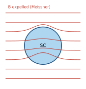
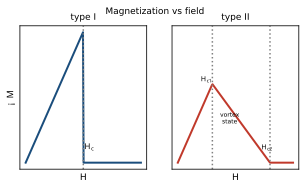

<!-- 固態物理 單元09：超導（Superconductivity） · 從高中到資格考 -->

# 固態物理 單元09 — 超導（Superconductivity）
### 從高中概念建到資格考

> **使用說明**：本篇從你高中會的東西（電阻、磁鐵與磁場、相變/熔點、波耳模型的量子化）出發，一路接到 Kittel 第 10 章等級。每個新符號點 `▸` 就地展開（你高中學過的 → 為什麼要這個 → 定義 → 範例1/2/3）。專有名詞第一次出現用「中文（English）」對照。配套：[單元整理](../考古題/單元整理.html)（出題頻率）、[逐題詳解](../考古題/詳解/index.html)、[教材直讀](../教材/index.html)。
> **慣例（本篇符號）**：臨界溫度 $T_c$；外加磁場強度 $H$、臨界場 $H_c$（第二類用 $H_{c1},H_{c2}$）；磁感應強度 $\mathbf B$（材料內部實際磁場）、磁化強度 $\mathbf M$、磁化率 $\chi$；磁通量 $\Phi$、磁通量子 $\Phi_0=h/2e$；超導能隙 $E_g=2\Delta$；普朗克常數 $h$、約化 $\hbar=h/2\pi$、電子電荷 $e>0$、波茲曼常數 $k_B$。SI 制下真空 $\mathbf B=\mu_0\mathbf H$。
>
> 📖 **本單元權威出處與教材對照（Textbook & Reference Alignment）**：
> - **Kittel 原文 8e**：Chapter 10（Superconductivity, pp. 259–296），核心公式：Eq. (1) 臨界場拋物線近似、Eq. (19)–(26) 倫敦方程式、Eq. (35) 磁通量子、Eq. (38) BCS 能隙。
> - **林盛煇《固態物理導論》**：第 9 章（§9.1 零電阻與邁斯納效應、§9.2 熱力學臨界場、§9.3 倫敦方程與穿透深度、§9.4 第一類/第二類超導體與渦旋、§9.5 BCS 理論與能隙、§9.6 磁通量子化）。
> - **Ashcroft & Mermin**：Ch. 34（Superconductivity）。
> - **臺大資格考真題對照**：2013–2025 共 2 次命題（2013 Q14, 2025 Q5），2025 重新入卷的高價值冷門單元。

---

## 🧭 為什麼要這個單元？（在解決什麼問題、與其他章節的關係）

### 為什麼要學「超導」？

某些材料冷到**臨界溫度** $T_c$ 以下，電阻**驟降為零**、且會把磁場完全排出體外（**邁斯納效應**）。這不是「電阻很小」，而是電子進入一種**集體量子態**——unit05 的費米氣體在低溫被「配對」重組。第四梯隊，但邁斯納、第一/二類、磁通量子化是常見考點。

### 在解決什麼問題？

> **核心問題**：零電阻與完全抗磁是怎麼同時發生的？磁通量子 $\Phi_0=h/2e$ 裡那個「**2**」從哪來？

關鍵：費米面附近的電子透過**電子–聲子交互作用**配成 **Cooper 對**（那個 2 = 一對兩顆電子），打開**能隙**、形成宏觀波函數。由此理解臨界場 $H_c$、第一/第二類、以及 BCS 的同位素效應。

### 與其他章節的關係

| 相關章節 | 關係 |
|---|---|
| **05 自由電子（往前接）** | 正常態是費米氣體，配對發生在費米面 |
| **04 聲子（往前接）** | 配對的吸引力來自電子–聲子作用；同位素效應 $T_c\propto M^{-1/2}$ 直指聲子 |
| **08 磁性（對照）** | 邁斯納 = 完全抗磁 $\chi=-1$，與磁性的 $\chi$ 語言相連 |

> **一句話**：unit05 的費米氣體在低溫「配對」就成了超導；而把它們黏起來的膠，正是 unit04 的聲子。

---

## 🎯 這個單元在考什麼（出題地位）

超導是**第四梯隊**——多數年份不考，但 **2025 年又回鍋**，所以「不能裸考」。它幾乎不出長計算，全是**定性觀念送分題**：說清楚「零電阻 ≠ 邁斯納效應」「第一類 vs 第二類」「渦旋態只在第二類」「$\Phi_0=h/2e$ 那個 2 哪來」就拿滿。

| 最常見題型 | 出現年份 | 本篇對應節 |
|---|---|---|
| 超導體的電性與磁性性質為何 | 2013 | §1、§2、全篇 |
| 第一/第二類何者允許磁通渦旋穿透（周圍仍超導） | 2025 | §4 |
| 磁通量子化 $\Phi_0=h/2e$ 的意義 | 2025（變化）、2013 | §5 |
| BCS 配對概念、能隙、同位素效應 | 必背 | §6 |

> **一句話**：這單元的全部得分點，就是把「零電阻」與「完全抗磁（邁斯納）」分清楚，再把「第一類單一 $H_c$ / 第二類有 $H_{c1},H_{c2}$ 與渦旋」對好。觀念對了就是滿分，不用算。

---

## 🧗 高中起點：你已經會的

把這幾個高中/普物工具擺上桌，本單元每個概念都只是它們的延伸：

- **電阻與歐姆定律 $V=IR$**：金屬有電阻，電流會發熱（焦耳熱 $P=I^2R$）。$R=0$ 代表通電不耗能、電流可永遠跑下去。
- **磁鐵與磁場線**：磁場可以穿過、繞過或被擋開一塊材料。把磁場「完全擋在外面」是很特別的事。
- **抗磁 vs 順磁（單元 08）**：抗磁體 $\chi<0$，會被磁場「推開」；超導體是**最強的抗磁體**，$\chi=-1$。
- **相變與熔點**：水到 $0^\circ$C 結冰、$100^\circ$C 沸騰，是溫度跨過臨界值時材料「整個換一種狀態」。超導也是這種**相變（phase transition）**，臨界溫度叫 $T_c$。
- **波耳模型的量子化**：氫原子角動量只能取 $\hbar$ 的整數倍。超導裡「磁通只能取 $\Phi_0$ 的整數倍」是同一種量子化精神。
- **波的相位**：$y=A\sin(kx-\omega t)$ 裡那個相位。超導體裡所有電子對「共用同一個相位」，這是它一切神奇性質的根。

---

## 📚 主線：從高中一路推到考試級

### 1. 零電阻（zero resistance）：超導的第一張臉

**你高中學過的**：金屬通電會發熱，因為電子撞上晶格振動（聲子）與雜質，產生電阻 $R$。溫度越低、撞得越少、電阻越小——但一般金屬降到絕對零度仍有「殘餘電阻」（雜質造成）。

**為什麼需要新東西**：1911 年 Kamerlingh Onnes 把水銀冷到約 $4.2\,$K，電阻**突然掉到完全測不到的零**——不是慢慢變小，是**在某個溫度斷崖式歸零**。這不是「低溫的好導體」，是一種全新狀態。

**定義（中英對照）**：

> **超導態（superconducting state）**＝當溫度低於**臨界溫度（critical temperature）$T_c$** 時，材料的**直流電阻嚴格為零**。在超導環上激發的電流（**持久電流（persistent current）**）可流動數年而無可測量的衰減。

但零電阻**只是一半的故事**——下一節的邁斯納效應才是超導的真正定義。

<b>▸ 臨界溫度 T_c（critical temperature）</b>

### 你高中學過的
水的熔點 $0^\circ$C：溫度跨過它，冰↔水整個換狀態。$T_c$ 就是「正常態↔超導態」的那個門檻溫度。

### 為什麼要這個
超導不是漸變，是**相變**：$T>T_c$ 是普通金屬（有電阻），$T<T_c$ 是超導（無電阻、抗磁）。要有一個數字標記這個門檻。

### 定義
$T_c$ ＝零場下電阻歸零、邁斯納效應出現的溫度。它是材料的固有常數：Hg 約 $4.2\,$K、Pb 約 $7.2\,$K、Nb 約 $9.3\,$K；高溫超導 YBCO 約 $90\,$K。

**範例 1（熱身）**：Pb 的 $T_c=7.2\,$K。把鉛冷到 $4\,$K（$<T_c$）→ 超導；放到 $10\,$K（$>T_c$）→ 普通金屬。
**範例 2（中階）**：$T_c$ 隨外加磁場降低——加場會「壓低」門檻（見 §3 的 $H_c(T)$ 曲線）。
**範例 3（考題用法）**：2013 第 16 題要你說「電性」，標準答：$T<T_c$ 直流電阻為零、可載持久電流、有臨界電流密度 $J_c$（電流太大也會破超導）。

> **小結**：$T<T_c$ → 直流電阻為零、持久電流不衰減。但這只是兩大標誌的第一個。

<figure style="margin:1.3em 0;text-align:center">
<svg viewBox="0 0 430 250" width="100%" style="max-width:520px;border:1px solid #ddd;border-radius:8px;background:#fff;padding:6px;box-sizing:border-box" xmlns="http://www.w3.org/2000/svg">
<g font-family="-apple-system,sans-serif" font-size="11.5">
<line x1="60" y1="210" x2="400" y2="210" stroke="#333" stroke-width="1.4"/>
<line x1="60" y1="210" x2="60" y2="30" stroke="#333" stroke-width="1.4"/>
<text x="400" y="232" text-anchor="end" fill="#333">溫度 T (K)</text>
<text x="22" y="40" fill="#333">電阻 R</text>
<line x1="200" y1="210" x2="200" y2="48" stroke="#c0392b" stroke-width="1" stroke-dasharray="4,3"/>
<text x="200" y="44" text-anchor="middle" font-size="12" font-weight="bold" fill="#c0392b">T_c</text>
<polyline points="200,210 205,210 215,210 230,210 250,210 280,154 310,118 345,90 385,72" fill="none" stroke="#1a4d7c" stroke-width="2.4"/>
<line x1="200" y1="210" x2="62" y2="210" stroke="#1a4d7c" stroke-width="2.4"/>
<circle cx="200" cy="210" r="4" fill="#1a4d7c"/>
<text x="120" y="200" text-anchor="middle" font-size="11" fill="#2e8b2e" font-weight="bold">R = 0（超導）</text>
<text x="320" y="60" text-anchor="middle" font-size="11" fill="#1a4d7c">正常金屬：R 隨 T 上升</text>
<path d="M250,180 L210,206" stroke="#c0392b" stroke-width="1.6" fill="none" marker-end="url(#scR)"/>
<text x="262" y="178" font-size="10.5" fill="#c0392b">斷崖式驟降</text>
<defs><marker id="scR" markerWidth="9" markerHeight="9" refX="6" refY="3" orient="auto"><path d="M0,0 L6,3 L0,6 Z" fill="#c0392b"/></marker></defs>
</g>
</svg>
<figcaption style="font-size:0.9em;color:#555;margin-top:0.5em"><b>電阻 R(T)</b>：一般金屬降溫時 R 緩慢下降但有殘餘值；超導體在 <b style="color:#c0392b">T_c</b> 處 R <b>斷崖式驟降為嚴格的 0</b>（不是慢慢變小）。<b style="color:#2e8b2e">T&lt;T_c</b> 整段 R≡0，環中可載「持久電流」數年不衰減。這正是 1911 年 Onnes 冷卻水銀（T_c≈4.2 K）看到的現象，也是 2013 第 16 題「電性」的核心。</figcaption>
</figure>

---

### 2. 邁斯納效應（Meissner effect）：完全抗磁，不只是零電阻

> 📖 **本節核心出處與說明（Ref）**：
> - **權威教材**：Kittel 8e Ch. 10 Eq. (2) pp. 264–266 ｜ 林盛煇 §9.1 ｜ A&M Ch. 34
> - **歷年考題**：[NTU 2013 Q14（15分）](../考古題/詳解/固態_2013_詳解.html)
> - **觀念說明**：邁斯納效應表明超導體內部實際磁感應強度嚴格為零（$\mathbf B = 0, \chi = -1$），這是熱力學平衡基態，而非僅僅是「零電阻完美導體」的動態電磁感應屏蔽。

**你高中學過的**：磁鐵靠近一塊金屬，磁場線多半會穿進去。抗磁體（單元 08）會稍微把磁場推開一點點（$\chi$ 很小的負數）。

**為什麼需要新東西**：1933 年 Meissner 與 Ochsenfeld 發現：把材料冷到 $T_c$ 以下，它會把**內部的磁場完全擠出去**，內部 $\mathbf B=0$。關鍵在「**主動排出**」——就算你**先**加磁場、**再**降溫，磁場也會在跨過 $T_c$ 的瞬間被趕出來。這是純「完美導體」做不到的。

**完美導體 vs 超導體（為什麼零電阻不夠）**：

### Step 1：完美導體只「鎖住」磁場，不主動排出
法拉第定律告訴我們，理想 $R=0$ 的導體裡 $\dfrac{d\mathbf B}{dt}=0$：**內部磁場凍結在你進入零電阻那一刻的值**。若先加場、後變零電阻，磁場就被**鎖在裡面**，$\mathbf B\neq0$。

→ 完美導體的內部磁場 $\boxed{\mathbf B=\mathbf B_{\text{進入瞬間}}\ (\text{可能}\neq0)}$。

### Step 2：超導體不管歷史，一律把 $\mathbf B$ 歸零
實驗事實：超導體**無論加場與降溫的先後順序**，平衡態內部一律 $\mathbf B=0$。它在表面自發產生**抗磁屏蔽電流**，製造出與外場剛好抵銷的磁場。

→ 超導體內部 $\boxed{\mathbf B=0}$（這是定義性質，比零電阻更強）。

### Step 3：所以超導體是「完美抗磁體」
由 $\mathbf B=\mu_0(\mathbf H+\mathbf M)=0$ 得 $\mathbf M=-\mathbf H$，故磁化率
$$\boxed{\chi=\frac{M}{H}=-1.}$$
這是抗磁的極致（一般抗磁體 $\chi\sim-10^{-5}$）。磁浮列車、磁鐵懸浮在超導體上方，靠的就是這個 $\chi=-1$ 的完全抗磁。

> **小結**：**零電阻 ≠ 邁斯納效應**。零電阻只「鎖住」磁場；邁斯納效應是**主動排出**磁場、內部 $\mathbf B=0$、$\chi=-1$。**兩者合起來才是超導**。這是 2013 與 2025 兩年考題的命門。

<b>📝 更多範例（點開）：邁斯納磁化率 χ=−1 的代數</b>

**範例 A（從 B=0 一步步推出 χ=−1）**：SI 制磁感應強度與磁場、磁化的關係是 $\mathbf B=\mu_0(\mathbf H+\mathbf M)$。邁斯納態的定義是內部 $\mathbf B=0$。把 $\mathbf B=0$ 代入：

$$0=\mu_0(\mathbf H+\mathbf M).$$

因為 $\mu_0\neq0$，兩邊同除 $\mu_0$ 得 $0=\mathbf H+\mathbf M$，移項得 $\mathbf M=-\mathbf H$。再用磁化率定義 $\chi\equiv M/H$（這裡 $M,H$ 取同方向的分量大小）：

$$\chi=\frac{M}{H}=\frac{-H}{H}=-1.$$

每一步都是純代數移項，沒有近似。$\chi=-1$ 就是「完全抗磁」的數值上限。

**範例 B（和普通抗磁體比強度）**：銅的抗磁率約 $\chi_{\text{Cu}}\approx-1.0\times10^{-5}$。超導體 $\chi=-1$。比值

$$\frac{\chi_{\text{超導}}}{\chi_{\text{Cu}}}=\frac{-1}{-1.0\times10^{-5}}=1.0\times10^{5}.$$

所以超導的抗磁強度是普通抗磁體的約 $10^5$ 倍——這就是「完美抗磁」一詞的量化意義。

**範例 C（相對磁導率 μ_r=0）**：相對磁導率定義 $\mu_r=1+\chi$。把邁斯納的 $\chi=-1$ 代入：

$$\mu_r=1+(-1)=0.$$

$\mu_r=0$ 表示材料把磁場「磁導」降到零，等價於 $\mathbf B=\mu_0\mu_r\mathbf H=\mu_0\cdot0\cdot\mathbf H=0$，與「內部 $\mathbf B=0$」完全自洽——三種講法（$B=0$、$\chi=-1$、$\mu_r=0$）說的是同一件事。

**範例 D（懸浮判據的觀念數字）**：完美抗磁體被磁場「推開」，磁化能密度 $u=\tfrac12\mu_0 M^2$。設外場 $H=8.0\times10^{4}\,$A/m（約 0.1 T），$M=-H=-8.0\times10^{4}\,$A/m，則

$$u=\tfrac12\mu_0 M^2=\tfrac12(4\pi\times10^{-7})(8.0\times10^{4})^2\approx\tfrac12(1.2566\times10^{-6})(6.4\times10^{9})\approx4.0\times10^{3}\ \text{J/m}^3.$$

這個被排出磁場儲存的能量密度，正是磁鐵能穩穩浮在超導體上方的能量來源。

<figure style="margin:1.3em 0;text-align:center">
<svg viewBox="0 0 520 250" width="100%" style="max-width:640px;border:1px solid #ddd;border-radius:8px;background:#fff;padding:6px;box-sizing:border-box" xmlns="http://www.w3.org/2000/svg">
<defs><marker id="scM" markerWidth="9" markerHeight="9" refX="6" refY="3" orient="auto"><path d="M0,0 L6,3 L0,6 Z" fill="#1a4d7c"/></marker></defs>
<g font-family="-apple-system,sans-serif" font-size="11">
<g transform="translate(0,0)">
<text x="120" y="22" text-anchor="middle" font-size="12.5" font-weight="bold" fill="#333">T &gt; T_c（正常態）</text>
<g stroke="#1a4d7c" stroke-width="1.6" fill="none" marker-end="url(#scM)">
<line x1="40" y1="60" x2="200" y2="60"/><line x1="40" y1="100" x2="200" y2="100"/><line x1="40" y1="140" x2="200" y2="140"/><line x1="40" y1="180" x2="200" y2="180"/></g>
<circle cx="120" cy="120" r="34" fill="#6aa1d6" fill-opacity="0.35" stroke="#888" stroke-width="1.3"/>
<text x="120" y="124" text-anchor="middle" font-size="10.5" fill="#444">磁場穿過</text>
<text x="120" y="222" text-anchor="middle" font-size="11" fill="#555">磁力線直接穿入樣品</text>
</g>
<g transform="translate(280,0)">
<text x="120" y="22" text-anchor="middle" font-size="12.5" font-weight="bold" fill="#c0392b">T &lt; T_c（超導態）</text>
<g stroke="#1a4d7c" stroke-width="1.6" fill="none">
<path d="M40,60 L200,60" marker-end="url(#scM)"/><path d="M40,180 L200,180" marker-end="url(#scM)"/>
<path d="M40,100 C95,100 95,72 120,72 C145,72 145,100 200,100" marker-end="url(#scM)"/>
<path d="M40,140 C95,140 95,168 120,168 C145,168 145,140 200,140" marker-end="url(#scM)"/></g>
<circle cx="120" cy="120" r="34" fill="#2e8b2e" fill-opacity="0.25" stroke="#2e8b2e" stroke-width="1.6"/>
<text x="120" y="118" text-anchor="middle" font-size="10.5" font-weight="bold" fill="#2e8b2e">B = 0</text>
<text x="120" y="132" text-anchor="middle" font-size="9.5" fill="#2e8b2e">χ = −1</text>
<text x="120" y="222" text-anchor="middle" font-size="11" fill="#555">磁力線被排出、繞過樣品</text>
</g>
</g>
</svg>
<figcaption style="font-size:0.9em;color:#555;margin-top:0.5em"><b>邁斯納效應</b>：T&gt;T_c 時磁力線直接穿過材料；冷到 <b style="color:#c0392b">T&lt;T_c</b> 後，超導體在表面自發產生屏蔽電流，把磁場<b>主動排出</b>，內部 <b style="color:#2e8b2e">B=0</b>（χ=−1，完美抗磁）。關鍵差別：純「完美導體」只會「凍結」進入瞬間的磁場（B=常數），唯有超導體不管加場順序、平衡態一律 B=0——這才是「主動排出 vs 鎖住」的命門。</figcaption>
</figure>

<b>▸ 磁化率 χ = -1（完全抗磁 perfect diamagnetism）</b>

### 你高中學過的
單元 08 的 $\mathbf M=\chi\mathbf H$：材料被磁化的程度。順磁 $\chi>0$、抗磁 $\chi<0$。

### 為什麼要這個
要用一個數字描述「超導體把磁場排得多乾淨」。$\chi=-1$ 是理論上限——排得一乾二淨。

### 定義
SI 制 $\mathbf B=\mu_0(\mathbf H+\mathbf M)$。邁斯納態 $\mathbf B=0\Rightarrow\mathbf M=-\mathbf H\Rightarrow\chi=-1$。

**範例 1（熱身）**：一般銅 $\chi\approx-10^{-5}$（極弱抗磁）；超導體 $\chi=-1$，強了 $10^5$ 倍。
**範例 2（中階）**：邁斯納屏蔽電流只流在表面薄層內（厚度為**穿透深度（penetration depth）$\lambda$**，約幾十 nm），不是整塊體積。
**範例 3（考題用法）**：2013 第 16 題「磁性」標準答：邁斯納效應＝完全排磁、內部 $B=0$、$\chi=-1$，且主動排出已存在磁場（非僅完美導體鎖磁）。

<figure style="margin:1.3em 0;text-align:center">
<svg viewBox="0 0 440 250" width="100%" style="max-width:540px;border:1px solid #ddd;border-radius:8px;background:#fff;padding:6px;box-sizing:border-box" xmlns="http://www.w3.org/2000/svg">
<g font-family="-apple-system,sans-serif" font-size="11.5">
<rect x="60" y="40" width="50" height="180" fill="#6aa1d6" fill-opacity="0.45" stroke="#1a4d7c" stroke-width="1.3"/>
<text x="85" y="234" text-anchor="middle" font-size="10.5" fill="#1a4d7c">表面薄層</text>
<rect x="110" y="40" width="280" height="180" fill="#2e8b2e" fill-opacity="0.12" stroke="#2e8b2e" stroke-width="1.1"/>
<text x="250" y="135" text-anchor="middle" font-size="12" fill="#2e8b2e">超導內部 B = 0</text>
<line x1="60" y1="30" x2="60" y2="226" stroke="#333" stroke-width="1.2"/>
<text x="44" y="42" text-anchor="middle" font-size="11" fill="#333">B</text>
<text x="60" y="245" text-anchor="middle" font-size="10.5" fill="#333">表面 (x=0)</text>
<polyline points="60,48 70,62 80,82 92,108 105,138 120,166 140,192 170,208 230,217 390,219" fill="none" stroke="#c0392b" stroke-width="2.4"/>
<text x="50" y="52" font-size="11" fill="#c0392b" font-weight="bold">B₀</text>
<line x1="60" y1="120" x2="110" y2="120" stroke="#e67e22" stroke-width="1.4" stroke-dasharray="3,2"/>
<text x="120" y="118" font-size="10.5" fill="#e67e22">x = λ → B 降到 B₀/e ≈ 0.37 B₀</text>
<text x="250" y="200" text-anchor="middle" font-size="11.5" fill="#c0392b">B(x) = B₀ e^(−x/λ)</text>
</g>
</svg>
<figcaption style="font-size:0.9em;color:#555;margin-top:0.5em"><b>London 穿透深度 λ</b>：磁場並非在表面瞬間歸零，而是<b>指數衰減</b> B(x)=B₀e^(−x/λ) 滲入一層薄殼。走到一個 λ（典型幾十 nm）磁場已降到 B₀/e≈37%。屏蔽電流也只流在這層內。這解釋了「內部 B=0」的細節：邁斯納其實是表面薄層在擋場，深處才真正 B=0。</figcaption>
</figure>

<b>📝 更多範例（點開）：London 場衰減 B(x)=B₀e^(−x/λ) 與 λ 的數值</b>

**範例 A（一個 λ 後磁場剩多少）**：London 方程解出磁場由表面 $x=0$ 往內指數衰減 $B(x)=B_0\,e^{-x/\lambda}$。問走到一個穿透深度 $x=\lambda$ 時磁場剩多少？代入 $x=\lambda$：

$$B(\lambda)=B_0\,e^{-\lambda/\lambda}=B_0\,e^{-1}=\frac{B_0}{e}.$$

數值 $e\approx2.71828$，所以 $B(\lambda)=B_0/2.71828\approx0.368\,B_0$——剩約 $36.8\%$。這就是「特徵長度」的定義：每走一個 $\lambda$，磁場乘上一次 $1/e$。

**範例 B（走兩個、三個 λ）**：續上，$x=2\lambda$ 時 $B=B_0e^{-2}=B_0/e^2\approx0.135\,B_0$（剩 $13.5\%$）；$x=3\lambda$ 時 $B=B_0e^{-3}\approx0.0498\,B_0$（剩約 $5\%$）。可見走三個 $\lambda$（典型約 $100\,$nm）磁場已幾近消失，深處才真正 $B=0$。

**範例 C（磁場降到一半要走多深）**：問 $B(x)=\tfrac12B_0$ 時 $x=?$。列式 $B_0e^{-x/\lambda}=\tfrac12B_0$，兩邊除 $B_0$ 得 $e^{-x/\lambda}=\tfrac12$。取自然對數：$-x/\lambda=\ln\tfrac12=-\ln2$，故

$$x=\lambda\ln2\approx0.693\,\lambda.$$

若 $\lambda=50\,$nm，則 $x\approx34.7\,$nm 處磁場恰好砍半。這是「半值深度」。

**範例 D（用 London 公式估 λ）**：London 穿透深度的公式 $\lambda=\sqrt{\dfrac{m}{\mu_0 n_s q^2}}$（$m$ 電子質量、$n_s$ 超導電子數密度、$q$ 載流子電荷）。代入 $n_s=4.0\times10^{28}\,$m$^{-3}$、$q=e=1.6\times10^{-19}\,$C、$m=9.11\times10^{-31}\,$kg：先算分母 $\mu_0 n_s q^2=(4\pi\times10^{-7})(4.0\times10^{28})(1.6\times10^{-19})^2$。其中 $(1.6\times10^{-19})^2=2.56\times10^{-38}$，乘起來 $\mu_0 n_s q^2\approx(1.2566\times10^{-6})(4.0\times10^{28})(2.56\times10^{-38})\approx1.287\times10^{-15}\,$（SI 單位）。於是

$$\lambda=\sqrt{\frac{9.11\times10^{-31}}{1.287\times10^{-15}}}=\sqrt{7.08\times10^{-16}}\approx2.66\times10^{-8}\ \text{m}\approx27\ \text{nm},$$

正落在「幾十 nm」的典型範圍。$n_s$ 越大、$\lambda$ 越小（屏蔽越有效），$T\to T_c$ 時 $n_s\to0$ 使 $\lambda\to\infty$（屏蔽失效）。

---

### 3. 臨界場 $H_c$ 與熱力學相變圖像

**你高中學過的**：水的相圖——在「溫度–壓力」平面上有一條線分開冰、水、汽。跨過線就換相。

**為什麼需要新東西**：超導不只怕熱（$T>T_c$ 會破），也**怕磁場**。磁場太強會把超導態「摧毀」回正常態。要有一條臨界場曲線 $H_c(T)$ 來圈出「超導存在的區域」。

**定義（中英對照）**：

> **臨界場（critical field）$H_c$**＝在溫度 $T$ 下，能維持超導的最大外加磁場。超過 $H_c$ 就回正常態。它隨溫度變化，經驗式近似
> $$
> \boxed{H_c(T)\approx H_c(0)\left[1-\left(\frac{T}{T_c}\right)^2\right].}
> $$
> $T=0$ 時最大、$T\to T_c$ 時 $H_c\to0$。

在 $T$–$H$ 平面上，這條拋物線**圈出超導區**（曲線內超導、曲線外正常）——就是超導的「相圖」，跨線即相變。

<b>▸ 臨界場 H_c(T)（critical field）</b>

### 你高中學過的
熔點隨壓力變化的相圖曲線。$H_c(T)$ 就是超導的相界線：橫軸 $T$、縱軸 $H$。

### 為什麼要這個
要同時表達「太熱」與「磁場太強」兩種破壞超導的方式，用一條曲線把可超導的 $(T,H)$ 區域框出來。

### 定義
$H_c(T)=H_c(0)[1-(T/T_c)^2]$。$H_c(0)$ 是絕對零度的臨界場（第一類超導體典型 $\sim0.01$–$0.1\,$T，很小，這也是第一類沒大用的原因）。

### 範例
**範例 1（熱身）**：$T=T_c$ 代入 → $H_c=0$：到了臨界溫度，再小的磁場都能破超導。
**範例 2（中階）**：第一類超導體只有**一條** $H_c$：$H<H_c$ 完全超導（邁斯納）、$H>H_c$ 完全正常，中間沒有過渡態。
**範例 3（考題用法）**：能量觀點——超導態比正常態低了「凝聚能（condensation energy）」$\tfrac12\mu_0H_c^2$（每單位體積）；磁場做功超過這個能量差，超導就划不來而崩潰。

> **小結**：超導被 $T$ 與 $H$ 兩個門檻夾住。$H_c(T)$ 是相界線，曲線內超導、外正常，是個不折不扣的熱力學相變。

<b>📝 更多範例（點開）：臨界場拋物線 H_c(T)=H_c(0)[1−(T/T_c)²] 代數</b>

**範例 A（半溫時的臨界場）**：經驗式 $H_c(T)=H_c(0)\big[1-(T/T_c)^2\big]$。取 $T=\tfrac12T_c$，逐步代入：先算 $T/T_c=\tfrac12$，平方 $(T/T_c)^2=\tfrac14$，再 $1-\tfrac14=\tfrac34$。所以

$$H_c(\tfrac12T_c)=H_c(0)\cdot\tfrac34=0.75\,H_c(0).$$

溫度降到一半臨界溫度，臨界場已回到絕對零度值的 $75\%$。檢查兩端點：$T=0$ 得 $H_c=H_c(0)\cdot1=H_c(0)$（最大）；$T=T_c$ 得 $H_c=H_c(0)\cdot0=0$（歸零），與物理一致。

**範例 B（給臨界場反推溫度）**：問在什麼溫度時 $H_c$ 降到 $H_c(0)$ 的一半？列式 $H_c(0)[1-(T/T_c)^2]=\tfrac12H_c(0)$，兩邊除 $H_c(0)$：$1-(T/T_c)^2=\tfrac12$，移項 $(T/T_c)^2=\tfrac12$，開根號

$$\frac{T}{T_c}=\sqrt{\tfrac12}=\frac{1}{\sqrt2}\approx0.707\ \Rightarrow\ T\approx0.707\,T_c.$$

例如 Pb 的 $T_c=7.2\,$K，則 $T\approx0.707\times7.2\approx5.09\,$K 時臨界場剩一半。

**範例 C（凝聚能密度）**：超導態比正常態每單位體積低了「凝聚能」$u_{\text{cond}}=\tfrac12\mu_0H_c^2$。取第一類典型 $H_c=8.0\times10^{4}\,$A/m（即 $\mu_0H_c\approx0.1\,$T）：

$$u_{\text{cond}}=\tfrac12\mu_0H_c^2=\tfrac12(4\pi\times10^{-7})(8.0\times10^{4})^2=\tfrac12(1.2566\times10^{-6})(6.4\times10^{9})\approx4.0\times10^{3}\ \text{J/m}^3.$$

這就是「磁場做功若超過 $u_{\text{cond}}$，超導就划不來而崩潰」的能量門檻。

**範例 D（曲線斜率，靠近 T_c 時近似線性）**：把括號展開 $H_c(T)=H_c(0)-H_c(0)\,T^2/T_c^2$，對 $T$ 微分得斜率 $\dfrac{dH_c}{dT}=-\dfrac{2H_c(0)}{T_c^2}\,T$。在 $T=T_c$ 處斜率為 $-\dfrac{2H_c(0)}{T_c^2}\cdot T_c=-\dfrac{2H_c(0)}{T_c}$。所以靠近 $T_c$ 時曲線以這個有限負斜率切到橫軸（不是垂直落下）——這對畫相圖的形狀很重要。

<figure style="margin:1.3em 0;text-align:center">
<svg viewBox="0 0 440 250" width="100%" style="max-width:520px;border:1px solid #ddd;border-radius:8px;background:#fff;padding:6px;box-sizing:border-box" xmlns="http://www.w3.org/2000/svg">
<g font-family="-apple-system,sans-serif" font-size="11.5">
<path d="M60,50 C60,50 200,52 300,120 C360,162 390,210 405,210 L60,210 Z" fill="#2e8b2e" fill-opacity="0.16"/>
<line x1="60" y1="210" x2="410" y2="210" stroke="#333" stroke-width="1.4"/>
<line x1="60" y1="210" x2="60" y2="35" stroke="#333" stroke-width="1.4"/>
<text x="410" y="232" text-anchor="end" fill="#333">溫度 T</text>
<text x="30" y="46" fill="#333">H</text>
<polyline points="60,50 110,57 160,77 210,109 250,144 285,179 305,200 320,210" fill="none" stroke="#1a4d7c" stroke-width="2.6"/>
<text x="44" y="54" font-size="11" font-weight="bold" fill="#1a4d7c">H_c(0)</text>
<circle cx="60" cy="50" r="3.5" fill="#1a4d7c"/>
<text x="155" y="155" text-anchor="middle" font-size="12" fill="#2e8b2e" font-weight="bold">超導區</text>
<text x="160" y="172" text-anchor="middle" font-size="9.5" fill="#2e8b2e">(邁斯納 B=0)</text>
<text x="320" y="95" text-anchor="middle" font-size="12" fill="#c0392b" font-weight="bold">正常態</text>
<line x1="320" y1="210" x2="320" y2="216" stroke="#c0392b" stroke-width="1"/>
<text x="320" y="230" text-anchor="middle" font-size="11" font-weight="bold" fill="#c0392b">T_c</text>
<text x="240" y="60" text-anchor="middle" font-size="10.5" fill="#1a4d7c">H_c(T)=H_c(0)[1−(T/T_c)²]</text>
</g>
</svg>
<figcaption style="font-size:0.9em;color:#555;margin-top:0.5em"><b>臨界場相圖 H_c(T)</b>：拋物線 H_c(T)=H_c(0)[1−(T/T_c)²] 圈出<b style="color:#2e8b2e">超導區</b>（曲線內，邁斯納 B=0），曲線外是<b style="color:#c0392b">正常態</b>。兩種破壞方式：往右跨（T→T_c，再小的場都能破）、或往上跨（H&gt;H_c）。T=0 時臨界場最大 H_c(0)；T=T_c 時 H_c=0。這就是超導的熱力學相圖，跨線即相變。</figcaption>
</figure>

---

### 4. 第一類 vs 第二類超導體（type I / type II）★2025 考點

> 📖 **本節核心出處與說明（Ref）**：
> - **權威教材**：Kittel 8e Ch. 10 pp. 266–270 ｜ 林盛煇 §9.4
> - **歷年考題**：[NTU 2025 Q5（15分）](../考古題/詳解/固態_2025_詳解.html)
> - **觀念說明**：由穿透深度與同調長度之比 $\kappa = \lambda/\xi$ 決定界面能正負。第二類超導體在 $H_{c1} < H < H_{c2}$ 進入渦旋混合態，磁通以量子化渦旋線形式穿透，維持周圍超導性。

**你高中學過的**：「有沒有中間地帶」的差別——有些開關只有開/關（第一類），有些有可調的「半開」狀態（第二類）。

**為什麼需要新東西**：實驗發現超導體對磁場的反應分兩種。差別在於：磁場是「要嘛全擋、要嘛全進」，還是「可以部分穿透、其餘地方仍超導」。這正是 **2025 第 4(b) 題**的標準答案。

**定義（中英對照）**：

> **第一類超導體（type I superconductor）**：只有**單一臨界場 $H_c$**。$H<H_c$ → 完全邁斯納（$\mathbf B=0$）；$H>H_c$ → 整塊回正常態。**沒有中間態、不形成渦旋。**（多為純金屬，如 Pb、Hg、Sn。）
>
> **第二類超導體（type II superconductor）**：有**兩個臨界場 $H_{c1}<H_{c2}$**。
> - $H<H_{c1}$：完全邁斯納（$\mathbf B=0$），跟第一類一樣。
> - $H_{c1}<H<H_{c2}$：**混合態（mixed state）/ 渦旋態（vortex state）**——磁場以**量子化磁通渦旋（quantized flux vortex）**的形式**部分穿入**體內，**每根渦旋芯是正常態、但渦旋周圍仍然超導**。
> - $H>H_{c2}$：回完全正常態。
> （多為合金與化合物，如 Nb–Ti、Nb₃Sn、所有高溫超導；$H_{c2}$ 可達數十特斯拉，這是它能做超導磁鐵的原因。）

### Step 1：渦旋態如何讓磁場「又進又超導」
在 $H_{c1}<H<H_{c2}$，材料不想全擋（耗能太大）也不想全放（還能超導就賺）。折衷方案：讓磁場集中成一根根細管子（渦旋）穿過去，每根管子裡是正常態、攜帶**剛好一個磁通量子**，管子之間的材料仍是超導。

→ 混合態 $\boxed{=\text{超導海} + \text{量子化磁通渦旋陣列（正常芯）}}$。

### Step 2：哪一類允許渦旋穿透？（2025 答案）
只有**第二類**有 $H_{c1},H_{c2}$ 與混合態，才會出現「磁通渦旋穿入、周圍仍超導」。**第一類沒有這個中間態**——它只有單一 $H_c$，跨過就整塊崩。

→ $\boxed{\text{允許磁通渦旋穿透並周圍仍超導者 = 第二類（type II）。}}$

<b>▸ 下/上臨界場 H_c1, H_c2（lower/upper critical field）</b>

### 你高中學過的
門檻不只一個的情況。$H_{c1}$ 是「磁場開始能鑽進來」的門檻；$H_{c2}$ 是「超導終於撐不住」的門檻。

### 為什麼要這個
第二類超導體的相圖有**三段**（邁斯納 / 混合 / 正常），需要兩個臨界場把它們分開。

### 定義
$H_{c1}$＝下臨界場，超過它磁通渦旋開始穿入（混合態起點）。$H_{c2}$＝上臨界場，超過它超導完全消失（混合態終點）。恒有 $H_{c1}<H_{c2}$。

### 範例
**範例 1（熱身）**：$H<H_{c1}$ 時第二類與第一類無法區分（都完全抗磁）。差別只在 $H_{c1}$ 以上才顯現。
**範例 2（中階）**：渦旋數量隨 $H$ 增加而增多，$H\to H_{c2}$ 時渦旋芯（正常區）幾乎填滿整塊，超導被擠到零。
**範例 3（考題用法）**：2025 第 4(b) 與 2013 第 16 題都要寫出「$H_{c1}<H<H_{c2}$ 混合態、量子化磁通渦旋穿入、渦旋芯周圍仍超導」這句完整描述。

> **小結**：**第一類＝單一 $H_c$、無渦旋**；**第二類＝雙臨界場 $H_{c1},H_{c2}$、中間是渦旋態（芯正常、周圍超導）**。「誰能進渦旋」→ **第二類**。這是 2025 的整題答案。

<b>📝 更多範例（點開）：第二類 H_c1/H_c2 與渦旋數量的代數</b>

**範例 A（判斷在哪一態）**：某第二類超導體 $H_{c1}=0.02\,$T、$H_{c2}=15\,$T。施加 $H=5\,$T，問它在哪一態？逐一比較：$H=5>H_{c1}=0.02$（已過下臨界場），且 $H=5<H_{c2}=15$（還沒到上臨界場），故 $H_{c1}<H<H_{c2}$ →**混合態（渦旋態）**：磁通以渦旋穿入、渦旋之間仍超導。若改加 $H=0.01\,$T$<H_{c1}$→完全邁斯納（$B=0$）；加 $H=20\,$T$>H_{c2}$→完全正常態。

**範例 B（渦旋密度與磁通量子）**：混合態中每根渦旋帶恰好一個磁通量子 $\Phi_0=2.07\times10^{-15}\,$Wb。若平均磁感應強度 $B=0.1\,$T，則單位面積渦旋數（渦旋密度）

$$n_v=\frac{B}{\Phi_0}=\frac{0.1}{2.07\times10^{-15}}\approx4.83\times10^{13}\ \text{根/m}^2.$$

換算成每平方公分 $n_v\approx4.83\times10^{9}\,$根/cm$^2$——非常密。場越強、渦旋越多越密。

**範例 C（渦旋三角晶格間距）**：渦旋排成三角（六角）晶格時，密度與間距 $d$ 的關係 $n_v=\dfrac{2}{\sqrt3\,d^2}$。反解 $d=\sqrt{\dfrac{2}{\sqrt3\,n_v}}$。沿用範例 B 的 $n_v=4.83\times10^{13}\,$m$^{-2}$：

$$d=\sqrt{\frac{2}{1.732\times4.83\times10^{13}}}=\sqrt{2.39\times10^{-14}}\approx1.55\times10^{-7}\ \text{m}\approx155\ \text{nm}.$$

渦旋彼此相距約 $155\,$nm。也可用更簡單的近似 $d\approx\sqrt{\Phi_0/B}=\sqrt{2.07\times10^{-15}/0.1}\approx1.44\times10^{-7}\,$m（同數量級）。

**範例 D（上臨界場與相干長度）**：上臨界場 $H_{c2}=\dfrac{\Phi_0}{2\pi\mu_0\xi^2}$（$\xi$ 為相干長度＝渦旋芯半徑尺度）。給 $\xi=5\,$nm$=5\times10^{-9}\,$m：先算 $\xi^2=2.5\times10^{-17}\,$m$^2$，分母 $2\pi\mu_0\xi^2=2\pi(4\pi\times10^{-7})(2.5\times10^{-17})\approx1.97\times10^{-22}$。於是

$$\mu_0H_{c2}=\frac{\Phi_0}{2\pi\xi^2}=\frac{2.07\times10^{-15}}{2\pi(2.5\times10^{-17})}\approx13.2\ \text{T}.$$

相干長度越短（芯越小）→ $H_{c2}$ 越大。這就是為什麼第二類能撐到數十特斯拉、能做超導磁鐵。

<figure style="margin:1.3em 0;text-align:center">
<svg viewBox="0 0 360 320" width="100%" style="max-width:420px;border:1px solid #ddd;border-radius:8px;background:#fff;padding:6px;box-sizing:border-box" xmlns="http://www.w3.org/2000/svg">
<defs><radialGradient id="scV" cx="50%" cy="50%" r="50%"><stop offset="0" stop-color="#f0a79b"/><stop offset="0.5" stop-color="#c0392b"/><stop offset="0.65" stop-color="#c0392b"/><stop offset="1" stop-color="#2e8b2e" stop-opacity="0"/></radialGradient></defs>
<g font-family="-apple-system,sans-serif" font-size="11">
<rect x="40" y="40" width="280" height="240" fill="#2e8b2e" fill-opacity="0.16" stroke="#2e8b2e" stroke-width="1.4" rx="6"/>
<text x="180" y="26" text-anchor="middle" font-size="12.5" font-weight="bold" fill="#1a4d7c">第二類混合態（H_c1 &lt; H &lt; H_c2）</text>
<g>
<circle cx="100" cy="100" r="22" fill="url(#scV)"/><circle cx="100" cy="100" r="7" fill="#c0392b"/>
<circle cx="180" cy="100" r="22" fill="url(#scV)"/><circle cx="180" cy="100" r="7" fill="#c0392b"/>
<circle cx="260" cy="100" r="22" fill="url(#scV)"/><circle cx="260" cy="100" r="7" fill="#c0392b"/>
<circle cx="140" cy="160" r="22" fill="url(#scV)"/><circle cx="140" cy="160" r="7" fill="#c0392b"/>
<circle cx="220" cy="160" r="22" fill="url(#scV)"/><circle cx="220" cy="160" r="7" fill="#c0392b"/>
<circle cx="100" cy="220" r="22" fill="url(#scV)"/><circle cx="100" cy="220" r="7" fill="#c0392b"/>
<circle cx="180" cy="220" r="22" fill="url(#scV)"/><circle cx="180" cy="220" r="7" fill="#c0392b"/>
<circle cx="260" cy="220" r="22" fill="url(#scV)"/><circle cx="260" cy="220" r="7" fill="#c0392b"/></g>
<text x="180" y="180" text-anchor="middle" font-size="11" fill="#2e8b2e" font-weight="bold">超導海</text>
<line x1="282" y1="100" x2="318" y2="70" stroke="#333" stroke-width="1" marker-end="url(#scVa)"/>
<defs><marker id="scVa" markerWidth="8" markerHeight="8" refX="5" refY="3" orient="auto"><path d="M0,0 L5,3 L0,6 Z" fill="#333"/></marker></defs>
<text x="180" y="302" text-anchor="middle" font-size="10.5" fill="#c0392b">每根渦旋芯＝正常態，攜帶 1 個 Φ₀</text>
<text x="320" y="64" text-anchor="end" font-size="10" fill="#c0392b">正常芯</text>
</g>
</svg>
<figcaption style="font-size:0.9em;color:#555;margin-top:0.5em"><b>渦旋晶格（Abrikosov lattice）</b>：第二類在 H_c1&lt;H&lt;H_c2 採折衷——磁場集中成一根根<b style="color:#c0392b">渦旋</b>穿入，每根<b>芯是正常態、攜帶恰好一個磁通量子 Φ₀=h/2e</b>，渦旋之間的<b style="color:#2e8b2e">材料仍是超導海</b>。渦旋自然排成三角晶格。場越強→渦旋越多越密，H→H_c2 時正常芯填滿、超導被擠到零。記牢「<b>芯正常、周圍超導</b>」（別寫反）。</figcaption>
</figure>

---

### 5. 磁通量子化 $\Phi_0=h/2e$：那個 2 哪來

> 📖 **本節核心出處與說明（Ref）**：
> - **權威教材**：Kittel 8e Ch. 10 Eq. (35) pp. 280–282 ｜ 林盛煇 §9.6
> - **歷年考題**：[NTU 2025 Q5](../考古題/詳解/固態_2025_詳解.html)
> - **觀念說明**：由超導波函數單值性條件推導，磁通量子 $\Phi_0 = \frac{h}{2e} \approx 2.068 \times 10^{-15} \, \text{Wb}$，分母的「2」是 BCS 電子對（Cooper pair）電荷 $q=-2e$ 的直接實驗證據。

**你高中學過的**：波耳模型——氫原子的角動量只能是 $\hbar$ 的整數倍，不能連續。這就是**量子化**：某個物理量只能取「基本單位的整數倍」。

**為什麼需要新東西**：超導環裡的磁通量（穿過環的磁場 × 面積）也被量子化——只能是某個基本單位 $\Phi_0$ 的整數倍。而那個基本單位裡有個耐人尋味的 **2**：$\Phi_0=h/2e$，不是 $h/e$。這個 2 是**「電子成對」的鐵證**。

**定義（中英對照）**：

> **磁通量子（magnetic flux quantum）**
> $$
> \boxed{\Phi_0=\frac{h}{2e}\approx2.07\times10^{-15}\ \text{Wb}.}
> $$
> 穿過超導環（或一根渦旋）的磁通只能取 $\Phi=n\Phi_0$（$n$ 為整數）。每根第二類渦旋恰好攜帶**一個** $\Phi_0$。

### Step 1：量子化來自單一相位的波函數
超導體裡所有載流子凝聚成**同一個巨觀波函數**（共用一個相位 $\theta$）。波函數繞環一圈回到原點，相位必須對齊（多繞 $2\pi$ 的整數倍），這個「單值條件」逼出磁通量子化 $\Phi=n\,(h/q)$，其中 $q$ 是載流子電荷。

→ 量子化單位 $\boxed{=h/q}$。

### Step 2：那個 2 ＝載流子是「電子對」
若載流子是單個電子，$q=e$，量子應是 $h/e$。但實驗測到的是 $h/2e$——**剛好一半**。唯一解釋：超導的載流子帶電 $q=2e$，是**兩個電子綁成一對**（即 §6 的 Cooper pair）。

→ $\boxed{\Phi_0=\dfrac{h}{2e}\ \Rightarrow\ \text{載流子電荷}=2e\ \Rightarrow\ \text{電子成對}.}$

<b>▸ 磁通量子 Φ_0 = h/2e（超導配對 flux quantum）</b>

### 你高中學過的
磁通量 $\Phi=B\times A$（磁場 × 面積，單位 Wb）；波耳的量子化（量只能取基本單位的整數倍）。

### 為什麼要這個
超導環/渦旋的磁通不能連續取值，需要一個「最小磁通包」當單位，且它的數值會洩漏載流子帶多少電荷。

### 定義
$\Phi_0=h/2e=2.07\times10^{-15}\,$Wb。超導磁通 $\Phi=n\Phi_0$。分母的 $2e$ 直接證明配對。

### 範例
**範例 1（熱身）**：若超導載流子是單電子，會量到 $h/e$。實測 $h/2e$ → 載流子帶 $2e$。
**範例 2（中階）**：第二類混合態中每根渦旋帶 $1\Phi_0$；外場越強、渦旋越多，總磁通 $\approx N\Phi_0$。
**範例 3（考題用法）**：2025 第 4 題「變化」與 2013 第 16 題都點名 $\Phi_0=h/2e$；面試常追問「那個 2 哪來」→ 答 Cooper pair（配對電荷 $2e$）。

> **小結**：磁通量子 $\Phi_0=h/2e$；分母的 **2** 是「電子成對（Cooper pair）」的直接證據。記住這個推論鏈，是面試與口試的高頻送分。

<b>📝 更多範例（點開）：磁通量子 Φ₀=h/2e 的數值與量子化代數</b>

**範例 A（算出 Φ₀ 的數值）**：磁通量子 $\Phi_0=\dfrac{h}{2e}$。代入 $h=6.626\times10^{-34}\,$J·s、$e=1.602\times10^{-19}\,$C：先算分母 $2e=2\times1.602\times10^{-19}=3.204\times10^{-19}\,$C，再相除

$$\Phi_0=\frac{6.626\times10^{-34}}{3.204\times10^{-19}}=2.068\times10^{-15}\ \text{Wb}.$$

這就是課本的 $\Phi_0\approx2.07\times10^{-15}\,$Wb。對照若用單電子 $h/e=2h/(2e)=2\Phi_0\approx4.14\times10^{-15}\,$Wb，是實測值的兩倍——實測剛好是一半，正是「載流子 $2e$」的鐵證。

**範例 B（量子化整數倍）**：超導環磁通只能取 $\Phi=n\Phi_0$（$n$ 為整數）。問環內磁通 $\Phi=6.2\times10^{-15}\,$Wb 對應 $n$ 多少？

$$n=\frac{\Phi}{\Phi_0}=\frac{6.2\times10^{-15}}{2.07\times10^{-15}}\approx3.0.$$

得 $n=3$（整數，合法）。若量到 $\Phi=5.0\times10^{-15}\,$Wb，則 $n\approx2.42$ 不是整數→不被允許，磁通會「跳」到最近的整數倍（$n=2$ 或 $3$）。

**範例 C（給環面積求量子化磁場）**：半徑 $r=1\,$mm 的超導環，面積 $A=\pi r^2=\pi(10^{-3})^2\approx3.14\times10^{-6}\,$m$^2$。讓環中只穿過一個磁通量子（$n=1$），所需平均磁場

$$B_1=\frac{\Phi_0}{A}=\frac{2.07\times10^{-15}}{3.14\times10^{-6}}\approx6.6\times10^{-10}\ \text{T}.$$

這是極微弱的磁場（約地磁的億分之一），說明 SQUID 能藉磁通量子化偵測到極小磁場。

**範例 D（單值條件如何逼出量子化）**：巨觀波函數 $\psi=|\psi|e^{i\theta}$，繞超導環一圈相位改變必須是 $2\pi$ 整數倍：$\oint\nabla\theta\cdot d\mathbf{l}=2\pi n$。相位梯度與向量勢的關係給出 $\oint\nabla\theta\cdot d\mathbf{l}=\dfrac{q}{\hbar}\oint\mathbf A\cdot d\mathbf{l}=\dfrac{q}{\hbar}\Phi$（$\Phi=\oint\mathbf A\cdot d\mathbf{l}$ 為穿環磁通）。令兩式相等：$\dfrac{q}{\hbar}\Phi=2\pi n$，解出

$$\Phi=\frac{2\pi\hbar}{q}\,n=\frac{h}{q}\,n.$$

用 $\hbar=h/2\pi$ 把 $2\pi\hbar$ 換成 $h$。量子單位是 $h/q$；超導載流子 $q=2e$，故 $\Phi_0=h/2e$——分母那個 2 就是這樣從「載流子電荷」掉出來的。

<figure style="margin:1.3em 0;text-align:center">
<svg viewBox="0 0 420 240" width="100%" style="max-width:500px;border:1px solid #ddd;border-radius:8px;background:#fff;padding:6px;box-sizing:border-box" xmlns="http://www.w3.org/2000/svg">
<defs><marker id="scF" markerWidth="9" markerHeight="9" refX="6" refY="3" orient="auto"><path d="M0,0 L6,3 L0,6 Z" fill="#1a4d7c"/></marker></defs>
<g font-family="-apple-system,sans-serif" font-size="11.5">
<circle cx="130" cy="120" r="80" fill="none" stroke="#2e8b2e" stroke-width="18" stroke-opacity="0.55"/>
<text x="130" y="218" text-anchor="middle" font-size="11" fill="#2e8b2e" font-weight="bold">超導環</text>
<g stroke="#1a4d7c" stroke-width="1.8" fill="none" marker-end="url(#scF)">
<line x1="110" y1="150" x2="110" y2="92"/><line x1="130" y1="155" x2="130" y2="92"/><line x1="150" y1="150" x2="150" y2="92"/></g>
<text x="130" y="128" text-anchor="middle" font-size="12" font-weight="bold" fill="#1a4d7c">Φ</text>
<text x="270" y="70" font-size="13" font-weight="bold" fill="#c0392b">Φ = n Φ₀</text>
<text x="270" y="98" font-size="12" fill="#333">n = 0, 1, 2, 3 … 整數</text>
<text x="270" y="130" font-size="12" fill="#c0392b">Φ₀ = h / 2e</text>
<text x="270" y="152" font-size="11" fill="#555">≈ 2.07 × 10⁻¹⁵ Wb</text>
<text x="270" y="184" font-size="11" fill="#1a4d7c">分母 2 ← 載流子 = 2e</text>
<text x="270" y="204" font-size="11" fill="#1a4d7c">（一對電子 Cooper pair）</text>
</g>
</svg>
<figcaption style="font-size:0.9em;color:#555;margin-top:0.5em"><b>磁通量子化</b>：超導體裡所有載流子共用同一個巨觀波函數（單一相位 θ）。波函數繞環一圈相位須對齊（差 2π 整數倍）這個「單值條件」逼出穿環磁通只能取 <b style="color:#c0392b">Φ=nΦ₀</b>（n 為整數），如同波耳「角動量取 ℏ 整數倍」的精神。量子單位為 h/q；實測 <b style="color:#c0392b">Φ₀=h/2e</b>（不是 h/e），<b>分母的 2 證明載流子帶 2e＝電子成對</b>。每根第二類渦旋恰帶 1 個 Φ₀。</figcaption>
</figure>

---

### 6. BCS 配對（BCS pairing）：能隙與同位素效應（定性）

> 📖 **本節核心出處與說明（Ref）**：
> - **權威教材**：Kittel 8e Ch. 10 Eq. (11), (38) pp. 268, 282 ｜ 林盛煇 §9.5
> - **歷年考題**：[NTU 2013 Q14](../考古題/詳解/固態_2013_詳解.html)
> - **觀念說明**：電子透過交換虛聲子形成有效吸引力而凝聚成 Cooper 對；BCS 能隙 $2\Delta(0) = 3.528 k_B T_c$；同位素效應 $T_c \propto M^{-1/2}$ 證實了聲子參與配對機制。

**你高中學過的**：同性電荷相斥——兩個電子應該互相排斥，怎麼會「成對」？

**為什麼需要新東西**：1957 年 Bardeen–Cooper–Schrieffer（BCS）理論解釋了配對機制。關鍵是：在晶格裡，兩個電子可以透過**晶格振動（聲子）**間接吸引，壓過庫侖斥力而綁成一對。

**定義（中英對照）**：

### Step 1：電子–聲子吸引（electron–phonon attraction）
一個電子飛過，把附近的正離子稍微吸過來，局部正電荷變密。第二個電子被這團「殘留的正電荷」吸引。中介者是晶格振動（聲子）。

→ 兩電子間出現 $\boxed{\text{聲子中介的有效吸引力}}$。

### Step 2：庫柏對（Cooper pair）
在費米面附近，動量相反、自旋相反的兩個電子（$\mathbf k\uparrow$ 與 $-\mathbf k\downarrow$）靠這個吸引綁成一對，總動量為零、總電荷 $2e$、總自旋為零（像個玻色子）。

→ 形成 $\boxed{\text{庫柏對（Cooper pair），電荷}\ 2e}$（這就是 §5 那個 2 的來源）。

<figure style="margin:1.3em 0;text-align:center">
<svg viewBox="0 0 460 220" width="100%" style="max-width:560px;border:1px solid #ddd;border-radius:8px;background:#fff;padding:6px;box-sizing:border-box" xmlns="http://www.w3.org/2000/svg">
<defs>
<radialGradient id="scE" cx="35%" cy="30%" r="75%"><stop offset="0" stop-color="#84b4df"/><stop offset="1" stop-color="#1a4d7c"/></radialGradient>
<radialGradient id="scI" cx="35%" cy="30%" r="75%"><stop offset="0" stop-color="#f0a79b"/><stop offset="1" stop-color="#c0392b"/></radialGradient>
<marker id="scEa" markerWidth="9" markerHeight="9" refX="6" refY="3" orient="auto"><path d="M0,0 L6,3 L0,6 Z" fill="#1a4d7c"/></marker></defs>
<g font-family="-apple-system,sans-serif" font-size="11">
<g fill="url(#scI)" stroke="#8a2a1e" stroke-width="0.6">
<circle cx="60" cy="70" r="8"/><circle cx="160" cy="70" r="8"/><circle cx="300" cy="70" r="8"/><circle cx="400" cy="70" r="8"/>
<circle cx="60" cy="170" r="8"/><circle cx="160" cy="170" r="8"/><circle cx="300" cy="170" r="8"/><circle cx="400" cy="170" r="8"/>
<circle cx="232" cy="70" r="8"/><circle cx="228" cy="170" r="8"/></g>
<text x="408" y="170" font-size="9" fill="#c0392b">＋ 離子</text>
<circle cx="120" cy="120" r="9" fill="url(#scE)"/><text x="120" y="124" text-anchor="middle" font-size="9" fill="#fff">e⁻</text>
<line x1="129" y1="116" x2="172" y2="106" stroke="#1a4d7c" stroke-width="1.6" marker-end="url(#scEa)"/>
<text x="120" y="146" text-anchor="middle" font-size="9.5" fill="#1a4d7c">電子1 飛過</text>
<g stroke="#888" stroke-width="0.7" stroke-dasharray="2,2">
<line x1="210" y1="78" x2="232" y2="100"/><line x1="254" y1="78" x2="232" y2="100"/><line x1="210" y1="162" x2="228" y2="142"/><line x1="246" y1="162" x2="228" y2="142"/></g>
<ellipse cx="232" cy="120" rx="30" ry="40" fill="#e67e22" fill-opacity="0.22" stroke="#e67e22" stroke-width="1.1" stroke-dasharray="4,3"/>
<text x="232" y="124" text-anchor="middle" font-size="9.5" fill="#e67e22" font-weight="bold">正電荷</text>
<text x="232" y="136" text-anchor="middle" font-size="9.5" fill="#e67e22" font-weight="bold">變密</text>
<circle cx="320" cy="120" r="9" fill="url(#scE)"/><text x="320" y="124" text-anchor="middle" font-size="9" fill="#fff">e⁻</text>
<line x1="311" y1="124" x2="266" y2="132" stroke="#2e8b2e" stroke-width="1.8" marker-end="url(#scEg)"/>
<defs><marker id="scEg" markerWidth="9" markerHeight="9" refX="6" refY="3" orient="auto"><path d="M0,0 L6,3 L0,6 Z" fill="#2e8b2e"/></marker></defs>
<text x="330" y="146" text-anchor="middle" font-size="9.5" fill="#2e8b2e">電子2 被吸來</text>
<text x="232" y="206" text-anchor="middle" font-size="11" fill="#333">經晶格畸變（聲子）中介 → 兩電子有效吸引 → 成 Cooper 對</text>
</g>
</svg>
<figcaption style="font-size:0.9em;color:#555;margin-top:0.5em"><b>Cooper 對的形成</b>：兩個同性電子本該相斥，但在晶格裡——<b style="color:#1a4d7c">電子1</b> 飛過會把附近<b style="color:#c0392b">正離子</b>吸近，留下一團<b style="color:#e67e22">正電荷變密</b>的畸變；<b style="color:#2e8b2e">電子2</b> 被這團殘留正電荷吸引。中介者是晶格振動（聲子）。淨效果是兩電子間出現「聲子中介的有效吸引力」，壓過庫侖斥力，把費米面附近 k↑ 與 −k↓ 的電子綁成一對（總動量 0、總電荷 2e、自旋 0）。同位素效應 T_c ∝ M⁻¹ᐟ² 正是聲子參與的鐵證。</figcaption>
</figure>

### Step 3：能隙（energy gap）$E_g=2\Delta$ 與凝聚
所有庫柏對凝聚到同一量子態（單一相位，§5），形成超流體。要拆散一對、激發出單電子，得跨越一道**能隙**
$$\boxed{E_g=2\Delta.}$$
正是這道能隙保護了超導：低溫下沒有足夠能量拆對，電子對暢行無阻 → **零電阻**。BCS 給出 $\Delta(0)\approx1.76\,k_BT_c$。

### Step 4：同位素效應（isotope effect）——配對機制的指紋
若配對真的靠聲子，那 $T_c$ 應與離子質量有關（質量影響振動頻率）。實驗測到
$$\boxed{T_c\propto M^{-1/2},}$$
同一元素的不同同位素（質量 $M$ 不同）有不同 $T_c$。這直接證明**聲子（晶格振動）參與配對**——是 BCS 機制最有力的實驗支持。

<figure style="margin:1.3em 0;text-align:center">
<svg viewBox="0 0 430 250" width="100%" style="max-width:520px;border:1px solid #ddd;border-radius:8px;background:#fff;padding:6px;box-sizing:border-box" xmlns="http://www.w3.org/2000/svg">
<g font-family="-apple-system,sans-serif" font-size="11.5">
<line x1="60" y1="210" x2="400" y2="210" stroke="#333" stroke-width="1.4"/>
<line x1="60" y1="210" x2="60" y2="30" stroke="#333" stroke-width="1.4"/>
<text x="400" y="232" text-anchor="end" fill="#333">溫度 T</text>
<text x="32" y="42" fill="#333">Δ</text>
<polyline points="60,55 100,56 140,60 180,68 215,80 245,96 275,118 300,142 320,166 335,186 348,202 355,210" fill="none" stroke="#1a4d7c" stroke-width="2.6"/>
<line x1="60" y1="55" x2="355" y2="55" stroke="#c0392b" stroke-width="0.9" stroke-dasharray="4,3"/>
<text x="46" y="59" font-size="10.5" font-weight="bold" fill="#c0392b">Δ(0)</text>
<text x="135" y="48" font-size="10.5" fill="#c0392b">Δ(0) ≈ 1.76 k_B T_c</text>
<circle cx="60" cy="55" r="3.5" fill="#1a4d7c"/>
<line x1="355" y1="210" x2="355" y2="216" stroke="#c0392b" stroke-width="1"/>
<text x="355" y="230" text-anchor="middle" font-size="11" font-weight="bold" fill="#c0392b">T_c</text>
<circle cx="355" cy="210" r="3.5" fill="#1a4d7c"/>
<text x="150" y="130" text-anchor="middle" font-size="11" fill="#2e8b2e">能隙開著</text>
<text x="150" y="146" text-anchor="middle" font-size="9.5" fill="#2e8b2e">→ 拆不開對 → R=0</text>
<text x="330" y="100" text-anchor="middle" font-size="10.5" fill="#c0392b">T→T_c</text>
<text x="330" y="116" text-anchor="middle" font-size="10.5" fill="#c0392b">Δ→0 閉合</text>
</g>
</svg>
<figcaption style="font-size:0.9em;color:#555;margin-top:0.5em"><b>能隙 Δ(T) 的 BCS 曲線</b>：T=0 時能隙最大 <b style="color:#c0392b">Δ(0)≈1.76 k_B T_c</b>，升溫時緩降、靠近 T_c 時急速塌陷，到 <b style="color:#c0392b">T_c 時 Δ→0</b>（配對全散、能隙閉合、超導消失）。能隙是「拆散一對庫柏對所需最小能量」E_g=2Δ（拆一對＝造兩個單電子激發各需 Δ）。低溫下沒有足夠熱能跨越能隙拆對，電子對暢行無阻 → 這就是零電阻的微觀理由。</figcaption>
</figure>

<b>▸ 超導能隙 E_g = 2Δ（superconducting energy gap）</b>

### 你高中學過的
半導體的能隙（單元 07）：跨過它才能把電子從價帶激發到導帶。超導能隙概念類似，但隔開的是「配對的超導態」與「拆開的單電子態」。

### 為什麼要這個
要解釋「為什麼零電阻」與「為什麼有 $T_c$」。能隙是配對穩定性的量度，也是抵抗散射、保證無電阻的屏障。

### 定義
$E_g=2\Delta$＝拆散一個庫柏對所需的最小能量（拆一對 = 造兩個單電子激發，各需 $\Delta$）。BCS：$\Delta(0)\approx1.76\,k_BT_c$；升溫到 $T_c$ 時 $\Delta\to0$（配對全散）。

### 範例
**範例 1（熱身）**：$T=0$ 沒有熱能拆對，能隙全開，電阻為零。
**範例 2（中階）**：$T\to T_c$ 時 $\Delta\to0$、能隙閉合、超導消失——這給出 $T_c$ 與 $\Delta$ 的關聯。
**範例 3（考題用法）**：定性題常問「為什麼超導零電阻」→ 答：電子成 Cooper pair 凝聚、有能隙保護，散射無法拆對，故無電阻；同位素效應 $T_c\propto M^{-1/2}$ 證明聲子配對。

> **小結**：聲子中介吸引 → 庫柏對（電荷 $2e$）→ 凝聚成單一量子態、有能隙 $2\Delta$ 保護 → 零電阻。同位素效應 $T_c\propto M^{-1/2}$ 是聲子配對的鐵證。

<b>📝 更多範例（點開）：能隙 Δ、同位素效應、比熱跳變的代數</b>

**範例 A（從 T_c 算能隙）**：BCS 給出 $\Delta(0)\approx1.76\,k_BT_c$，整個能隙 $E_g=2\Delta(0)\approx3.52\,k_BT_c$。取 Nb 的 $T_c=9.3\,$K、$k_B=1.38\times10^{-23}\,$J/K：

$$\Delta(0)=1.76\times(1.38\times10^{-23})\times9.3\approx2.26\times10^{-22}\ \text{J}.$$

換成毫電子伏（$1\,$eV$=1.6\times10^{-19}\,$J）：$\Delta(0)\approx\dfrac{2.26\times10^{-22}}{1.6\times10^{-19}}\approx1.41\times10^{-3}\,$eV$=1.41\,$meV。整個能隙 $E_g=2\Delta\approx2.83\,$meV——這正是 STM 穿隧能譜能量到的尺度。

**範例 B（同位素效應比兩個 T_c）**：同位素效應 $T_c\propto M^{-1/2}$，即 $T_c\sqrt M=$ 常數，故兩同位素 $\dfrac{T_{c,2}}{T_{c,1}}=\sqrt{\dfrac{M_1}{M_2}}$。水銀同位素 $M_1=199.5$、$M_2=203.4$（原子質量單位），$T_{c,1}=4.185\,$K：

$$T_{c,2}=T_{c,1}\sqrt{\frac{M_1}{M_2}}=4.185\sqrt{\frac{199.5}{203.4}}=4.185\sqrt{0.9808}\approx4.185\times0.9904\approx4.145\ \text{K}.$$

較重同位素 $T_c$ 略低，與實驗一致——直接證明聲子（離子質量）參與配對。

**範例 C（同位素指數 α 的對數做法）**：寫成 $T_c\propto M^{-\alpha}$，理想 BCS $\alpha=0.5$。由兩組數據反推 $\alpha=-\dfrac{\ln(T_{c,2}/T_{c,1})}{\ln(M_2/M_1)}$。代範例 B 的數字：分子 $\ln(4.145/4.185)=\ln(0.99044)\approx-0.00960$，分母 $\ln(203.4/199.5)=\ln(1.01955)\approx0.01936$，故

$$\alpha=-\frac{-0.00960}{0.01936}\approx0.496\approx0.5.$$

實測 $\alpha\approx0.5$，漂亮地落在 BCS 預測上。

**範例 D（比熱跳變 ΔC/C_n）**：相變在 $T_c$ 處比熱不連續，BCS 給出無因次跳變 $\dfrac{\Delta C}{C_n}\bigg|_{T_c}=1.43$，其中 $C_n=\gamma T_c$ 是正常態（電子）比熱、$\gamma$ 是 Sommerfeld 係數。若某金屬 $\gamma=1.6\times10^{-3}\,$J·mol$^{-1}$K$^{-2}$、$T_c=7.2\,$K，先算正常態比熱 $C_n=\gamma T_c=1.6\times10^{-3}\times7.2\approx1.15\times10^{-2}\,$J·mol$^{-1}$K$^{-1}$，則跳變

$$\Delta C=1.43\times C_n=1.43\times1.15\times10^{-2}\approx1.65\times10^{-2}\ \text{J·mol}^{-1}\text{K}^{-1}.$$

超導態比熱在 $T_c$ 處**向上跳**這一塊（不是放熱潛熱，零場下是二級相變）。這個 $1.43$ 是 BCS 的另一個普適常數，與 $3.52$（能隙比）並列為 BCS 三大無因次指紋。

<figure style="margin:1.3em 0;text-align:center">
<svg viewBox="0 0 430 250" width="100%" style="max-width:520px;border:1px solid #ddd;border-radius:8px;background:#fff;padding:6px;box-sizing:border-box" xmlns="http://www.w3.org/2000/svg">
<g font-family="-apple-system,sans-serif" font-size="11.5">
<line x1="60" y1="210" x2="400" y2="210" stroke="#333" stroke-width="1.4"/>
<line x1="60" y1="210" x2="60" y2="30" stroke="#333" stroke-width="1.4"/>
<text x="400" y="232" text-anchor="end" fill="#333">溫度 T</text>
<text x="30" y="42" fill="#333">C</text>
<line x1="250" y1="210" x2="250" y2="40" stroke="#c0392b" stroke-width="1" stroke-dasharray="4,3"/>
<text x="250" y="230" text-anchor="middle" font-size="11" font-weight="bold" fill="#c0392b">T_c</text>
<polyline points="62,205 110,196 160,184 210,170 250,160" fill="none" stroke="#888" stroke-width="1.8" stroke-dasharray="5,3"/>
<text x="150" y="150" font-size="10" fill="#888">正常態 C_n=γT（延伸）</text>
<polyline points="62,208 100,201 140,190 175,174 205,150 230,116 248,78" fill="none" stroke="#1a4d7c" stroke-width="2.6"/>
<polyline points="250,160 290,176 330,188 380,198" fill="none" stroke="#1a4d7c" stroke-width="2.6"/>
<circle cx="250" cy="78" r="3.5" fill="#1a4d7c"/>
<circle cx="250" cy="160" r="3.5" fill="#888"/>
<line x1="262" y1="78" x2="262" y2="160" stroke="#2e8b2e" stroke-width="1.6" marker-start="url(#scCa)" marker-end="url(#scCa)"/>
<defs><marker id="scCa" markerWidth="8" markerHeight="8" refX="4" refY="3" orient="auto"><path d="M0,0 L5,3 L0,6 Z" fill="#2e8b2e"/></marker></defs>
<text x="300" y="118" font-size="10.5" fill="#2e8b2e" font-weight="bold">ΔC = 1.43 C_n</text>
<text x="150" y="100" text-anchor="middle" font-size="10.5" fill="#1a4d7c">超導態（往上跳）</text>
<text x="345" y="180" text-anchor="middle" font-size="10" fill="#1a4d7c">指數壓低</text>
</g>
</svg>
<figcaption style="font-size:0.9em;color:#555;margin-top:0.5em"><b>電子比熱跳變 C(T)</b>：零場下超導相變是二級相變——在 <b style="color:#c0392b">T_c</b> 處比熱<b>不連續向上跳</b>一塊 <b style="color:#2e8b2e">ΔC=1.43 C_n</b>（C_n=γT_c 為正常態值），無潛熱。T&lt;T_c 時因能隙打開、激發被指數壓低，比熱隨溫度急速下降（∝e^(−Δ/k_B T)）。這個 1.43 與能隙比 3.52、同位素指數 0.5 並列為 BCS 三大無因次指紋，是「超導是集體相變」的熱力學證據。</figcaption>
</figure>

---

## 🔑 必背公式速查（考前最後看）

| 公式與物理主題 | $\boxed{\ }$ 數學形式 | 物理說明與何時用 | 權威出處（Ref） |
|---|---|---|---|
| 完全抗磁邁斯納效應 | $\mathbf B = \mu_0(\mathbf H + \mathbf M) = 0 \implies \chi = -1$ | 邁斯納態熱力學平衡本質，與純零電阻完全不同 | Kittel 8e Ch. 10 Eq. (2) p. 264 ｜ 林盛煇 §9.1 ｜ 2013 Q14 |
| 第一類熱力學臨界場 | $H_c(T) = H_c(0)\left[1 - \left(\frac{T}{T_c}\right)^2\right]$ | 磁場破壞超導態的經驗相界曲線 | Kittel 8e Ch. 10 Eq. (1) p. 263 ｜ 林盛煇 §9.2 ｜ 2013 Q14 |
| 第二類超導體渦旋態 | $H_{c1} < H < H_{c2} \implies \text{混合態（渦旋態）}$ | 磁通以量子化渦旋線形式穿透，芯部正常而周圍超導 | Kittel 8e Ch. 10 p. 268 ｜ 林盛煇 §9.4 ｜ 2025 Q5 (15分) |
| 倫敦穿透深度 | $\lambda_L = \sqrt{\frac{m}{\mu_0 n_s e^2}},\quad \nabla^2 \mathbf B = \frac{1}{\lambda_L^2}\mathbf B$ | 磁場在超導體表面指數衰減之特徵屏蔽長度 | Kittel 8e Ch. 10 Eq. (25) p. 274 ｜ 林盛煇 §9.3 ｜ 2013 Q14 |
| 超導磁通量子 | $\Phi_0 = \frac{h}{2e} \approx 2.068 \times 10^{-15} \, \text{Wb}$ | 分母因子 2 源自 Cooper 電子對電荷 $q=-2e$ | Kittel 8e Ch. 10 Eq. (35) p. 280 ｜ 林盛煇 §9.6 ｜ 2025 Q5 |
| BCS 零溫超導能隙 | $E_g = 2\Delta(0) = 3.528 k_B T_c \approx 3.53 k_B T_c$ | 電子對束縛能，低溫單粒子激發的禁帶寬度 | Kittel 8e Ch. 10 Eq. (38) p. 282 ｜ 林盛煇 §9.5 ｜ 2013 Q14 |
| 同位素效應 | $T_c \propto M^{-\alpha} \approx M^{-1/2}$ | 晶格離子質量依賴性，證明電子配對媒介為聲子 | Kittel 8e Ch. 10 Eq. (11) p. 268 ｜ 林盛煇 §9.5 ｜ 2013 Q14 |

---

## 📚 本單元權威參考文獻與出處對照（References）

1. **Charles Kittel, *Introduction to Solid State Physics***, 8th Edition, John Wiley & Sons, 2005.
   - **Chapter 10: Superconductivity** (pp. 259–296)
     - Experimental survey: zero resistance, critical temperature & critical fields: pp. 260–264, Eq. (1)
     - Meissner effect & perfect diamagnetism: pp. 264–266, Eq. (2)
     - Type I and Type II superconductors (vortex state): pp. 266–270
     - Thermodynamics of the superconducting transition: pp. 270–273
     - London equations & magnetic penetration depth: pp. 273–276, Eq. (19)–(26)
     - BCS theory of superconductivity & energy gap: pp. 279–283, Eq. (38)
     - Flux quantization in a superconductive ring: pp. 280–282, Eq. (35)
     - Josephson superconducting tunneling (DC & AC effects): pp. 287–290
2. **林盛煇,《固態物理導論》**, 新文京開發出版.
   - **第 9 章：超導物理** (pp. 371–412)
     - §9.1 零電阻與邁斯納效應之實驗驗證
     - §9.2 熱力學臨界磁場與比熱跳變
     - §9.3 倫敦唯象理論與磁場穿透深度
     - §9.4 第一類與第二類超導體之微觀渦旋構造
     - §9.5 BCS 微觀理論要點、庫珀對與超導能隙
     - §9.6 磁通量子化與約瑟夫森穿隧效應
3. **Neil W. Ashcroft & N. David Mermin, *Solid State Physics***, Saunders College Publishing, 1976.
   - **Chapter 34: Superconductivity** (pp. 725–756)
4. **國立臺灣大學應用物理學研究所博士班資格考試題**：
   - 2025 Q5 (15分): 第二類超導體渦旋態（Vortex state）構造與磁通量子穿透
   - 2013 Q14 (15分): 邁斯納效應與完全抗磁、倫敦穿透深度、BCS 能隙與同位素效應

---

## 📝 歷年考題實戰

- **[2025 Q4(b)（5%）](../考古題/詳解/固態_2025_詳解.html)**：type I / type II 何者允許磁通渦旋穿透（周圍仍超導）。標準答：**第二類**——$H_{c1}<H<H_{c2}$ 混合態，量子化磁通渦旋穿入、渦旋芯周圍仍超導；第一類單一 $H_c$、不形成 vortex。同題變化點名 $\Phi_0=h/2e$。對應 §4、§5。
- **[2013 Q16（3 pts）](../考古題/詳解/固態_2013_詳解.html)**：超導體的電性與磁性性質為何。標準答：**電性**——$T<T_c$ 直流電阻為零、可載持久電流不衰減、有臨界電流密度 $J_c$；**磁性**——邁斯納效應（完全排磁、內部 $B=0$、$\chi=-1$、主動排出磁場，非僅完美導體鎖磁）、第一類有單一 $H_c$、第二類有 $H_{c1}<H<H_{c2}$ 混合態與量子化磁通渦旋（$\Phi_0=h/2e$）。對應 §1、§2、§4、§5。

> **答題模板（背這段就夠）**：「超導兩大標誌＝**零電阻**＋**邁斯納效應**。零電阻：$T<T_c$ 直流電阻為零、持久電流。邁斯納：完全抗磁 $\chi=-1$、內部 $B=0$、主動排出磁場（強過完美導體）。第一類單一 $H_c$；第二類 $H_{c1}<H<H_{c2}$ 為渦旋態（芯正常、周圍超導），每渦旋帶 $\Phi_0=h/2e$，那個 2 來自 Cooper pair。」

---

## ✅ 自我檢核 ＋ 常見陷阱

你應該能不看書回答：

1. 超導的**兩大標誌**是哪兩個？（零電阻 + 邁斯納效應）
2. **零電阻和邁斯納效應差在哪**？（零電阻只鎖磁場；邁斯納主動排出、內部 $B=0$、$\chi=-1$）
3. 第一類與第二類**對磁場的反應**各如何？（一類單一 $H_c$；二類 $H_{c1}/H_{c2}$ 加渦旋態）
4. **渦旋態**裡，渦旋芯是什麼態、周圍是什麼態？（芯正常、周圍超導）
5. $\Phi_0=h/2e$ 的 **2 哪來**？（載流子電荷 $2e$，即 Cooper pair）
6. **BCS 配對**的中介是什麼？（晶格振動／聲子的有效吸引）
7. **同位素效應** $T_c\propto M^{-1/2}$ 說明了什麼？（聲子參與配對）
8. 超導為何**零電阻**？（Cooper pair 凝聚、能隙 $2\Delta$ 保護、散射拆不開對）

**常見陷阱**：
- **陷阱 1**：把超導當成「電阻很小的好導體」。錯——它是**嚴格零電阻 + 完全抗磁**的新相，且邁斯納效應是「完美導體」沒有的（主動排磁 vs 鎖磁）。
- **陷阱 2**：以為**第一類也有渦旋**。錯——渦旋態（vortex / mixed state）**只在第二類**（$H_{c1}<H<H_{c2}$）。
- **陷阱 3**：把渦旋芯說成超導、周圍正常。**反了**——芯是正常態，周圍才是超導。
- **陷阱 4**：寫 $\Phi_0=h/e$。錯——是 $h/2e$，分母的 2 是配對的指紋，寫錯就丟掉整個「Cooper pair」論點。

---

## 🔭 信心評估 ＋ 下一步

**信心評估**：本單元是**純定性送分題**，沒有長計算。只要把「零電阻 vs 邁斯納」「第一類 vs 第二類」「$\Phi_0=h/2e$ 與配對」三條對好，2013 與 2025 兩種題型直接滿分。背熟上面的「答題模板」即可，準備時間極短，CP 值高。

**下一步**：接 unit10 實驗與進階主題（Experimental Techniques / Advanced）——超導常與 STM 穿隧能譜（可測超導能隙 $2\Delta$）一起出現。也回看 unit08 磁性（Magnetism）：邁斯納的 $\chi=-1$ 是抗磁的極致、$H_c(T)$ 相圖與順磁/抗磁同源；2025 第 4 題正是「鐵磁 + 超導」合併一題，兩單元一起讀最划算。配對中介的聲子可回看 unit04（Phonons），能隙概念可對照 unit07（Semiconductors）。
