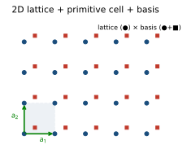
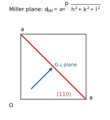
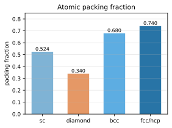

<!-- Kittel 章節導讀：第1章 晶體結構（Crystal Structure） -->

# Kittel 第1章 對照導讀 — 晶體結構（Crystal Structure）

> **這頁是什麼**：讀 Kittel 這一章時的對照地圖——概念橋（高中→大學→固態）＋術語速查。這裡**不重教推導**，只幫你把翻譯本那一章「翻成人話、搭好概念橋」。完整課文見 [Kittel 翻譯本對應章節](../Kittel_翻譯.html)；想看完整推導與考題，見 [單元教學 unit01](../../單元教學/unit01_晶體結構.html)；想練歷年題見 [逐題詳解](../../考古題/詳解/index.html)。

## 🗺️ 這一章在講什麼（3–6 句白話）

這一章在回答一個很基本的問題：**「晶體」到底是什麼東西、要怎麼用數學描述它？** Kittel 的主線是：先把無限大的晶體拆成「**晶格（lattice，純數學的點陣）× 基元（basis，掛在每個點上的那組原子）**」；再問「什麼樣的格子才算合格」——答案是二維 5 種、三維 14 種**布拉維晶格（Bravais lattice）**，因為週期性只允許 1、2、3、4、6 重旋轉對稱（**沒有 5 重**）。接著教怎麼挑「重複單元」（原胞、慣用晶胞、Wigner–Seitz 胞），怎麼用**密勒指標（Miller indices）**標記晶面方向。最後用 NaCl、CsCl、hcp、鑽石、ZnS 五個具體結構收尾，並用**填充率（packing fraction）**比較誰最緊密。整章順序大致是：晶格平移向量 → 基元 → 原胞 → 14 種布拉維晶格 → 晶面指標 → 簡單晶體結構。

一句話記住整章的骨：

$$\boxed{\text{晶體結構}=\text{晶格（lattice）}\times\text{基元（basis）}}$$

「晶格」管「怎麼重複」，「基元」管「每格放什麼」。後面所有「一個胞裡幾顆原子」的題目，本質都是在數基元。

## 🌉 概念三層對應表（高中 → 大學普物 → 本章固態物理）

| 高中你學過的 | 大學普物的版本 | 本章固態物理變成 |
|---|---|---|
| 平面/空間座標，向量加法 $\mathbf a+\mathbf b$ | 三維向量、線性組合、基底 | 晶格平移向量 $\mathbf T=u_1\mathbf a_1+u_2\mathbf a_2+u_3\mathbf a_3$（$u_i$ 整數），描述「整體平移後晶體不變」 |
| 用磁磚鋪滿地板、壁紙重複圖案 | 週期函數、平移對稱 | 晶體 = 晶格（怎麼重複）× 基元（每格放什麼） |
| 正多邊形能否密鋪平面（正三、四、六可，正五不行） | 對稱操作、旋轉群 | 晶格只允許 1、2、3、4、6 重旋轉軸（**5 重不存在**），導出 2D 5 種、3D 14 種布拉維晶格 |
| 平行四邊形 / 平行六面體面積、體積 | 純量三重積 $\lvert\mathbf a_1\cdot(\mathbf a_2\times\mathbf a_3)\rvert$ | 原胞（primitive cell）體積，且每個原胞恰含 1 個格點 |
| 直線截距式 $\frac{x}{a}+\frac{y}{b}=1$ | 平面方程、法向量 | 密勒指標 $(hkl)$：取截距倒數再化最小整數比 |
| 球裝箱、球佔多少空間 | 體積比、$V_{\text{球}}=\frac43\pi r^3$ | 填充率 $\eta=\dfrac{N_{\text{cell}}\cdot\frac43\pi r^3}{V_{\text{cell}}}$（fcc/hcp 最大 $\approx0.74$） |
| 點到點的距離（畢氏） | 向量長度、座標幾何 | 最近鄰距離、配位數（coordination number，最近鄰原子數） |

## 🔑 專有名詞 × 範例（速查）

<b>▸ 晶格（lattice）／晶格平移向量（lattice translation vector）</b>

**白話**：一堆「環境完全相同的數學點」排成的無限陣列；它只是骨架，先別管上面放什麼原子。
**高中接點**：像壁紙上「圖案中心」連成的規則網格。
**定義**：所有 $\mathbf T=u_1\mathbf a_1+u_2\mathbf a_2+u_3\mathbf a_3$（$u_i\in\mathbb Z$）構成的點集；從任一格點看晶體，景象都一樣。
**範例**：取 $\mathbf a_1=a\hat x,\ \mathbf a_2=a\hat y,\ \mathbf a_3=a\hat z$ 就是簡單立方晶格的骨架。
**在 Kittel 哪裡**：「晶格平移向量」一節，式 (1)。

<b>▸ 基元／基底（basis）</b>

**白話**：掛在每個格點上的那一組原子——晶體 = 晶格 × 基元。
**高中接點**：壁紙上「重複出現的那一朵花」。
**定義**：第 $j$ 顆原子相對格點的位置 $\mathbf r_j=x_j\mathbf a_1+y_j\mathbf a_2+z_j\mathbf a_3$，其中 $0\le x_j,y_j,z_j\le 1$。
**範例**：NaCl 的基元 = 一個 $\text{Na}^+$（在 $000$）＋ 一個 $\text{Cl}^-$（在 $\frac12\frac12\frac12$），共 2 顆；鑽石的基元 = 2 顆相同碳原子。
**在 Kittel 哪裡**：「基底與晶體結構」一節，式 (2)。

<b>▸ 原胞（primitive cell）</b>

**白話**：能鋪滿全空間、體積最小的重複盒子；**恰含 1 個格點**。
**高中接點**：能完整覆蓋壁紙又不重複的「最小一塊」。
**定義**：由原始平移向量 $\mathbf a_1,\mathbf a_2,\mathbf a_3$ 張成的平行六面體，體積 $V_c=\lvert\mathbf a_1\cdot(\mathbf a_2\times\mathbf a_3)\rvert$。
**範例**：簡單立方原胞體積 $a^3$（1 格點）；bcc 慣用立方含 2 格點，原胞體積為 $\frac12 a^3$；fcc 含 4 格點，原胞體積 $\frac14 a^3$。
**在 Kittel 哪裡**：「原始晶格胞」一節，圖 3、表 2。

<b>▸ Wigner–Seitz 胞（Wigner–Seitz cell）</b>

**白話**：最「公平、最對稱」的那種原胞畫法。
**高中接點**：地圖上「離哪個基地台最近」的勢力範圍（Voronoi 區）。
**定義**：把一個格點連到所有鄰格點，在每條連線中點作垂直平分面（2D 為中垂線），所圍最小區域。
**範例**：bcc 的 Wigner–Seitz 胞是菱形十二面體；它在第 2 章倒晶格裡會變成「第一布里淵區」的造法（埋下伏筆）。
**在 Kittel 哪裡**：圖 4 與其說明。

<b>▸ 布拉維晶格（Bravais lattice）</b>

**白話**：合格的「格子型」；每個格點看出去的環境都一模一樣。
**高中接點**：正多邊形密鋪——能無縫鋪滿平面的那幾種。
**定義**：點集 $\{\mathbf R\}$ 對「平移與相減」封閉；二維有 5 種、三維有 14 種，依 7 大晶系分類。
**範例**：立方晶系有 3 種——簡單立方 (sc)、體心立方 (bcc)、面心立方 (fcc)。蜂巢（石墨烯）**不是**布拉維晶格（A、B 兩碳環境不同），要拆成三角格 + 2 碳基元。
**在 Kittel 哪裡**：「基本格子類型」「二維/三維晶格類型」各節，表 1。

<b>▸ 密勒指標（Miller indices）$(hkl)$／方向 $[uvw]$</b>

**白話**：給「一族平行晶面」或「一個方向」貼的標籤。
**高中接點**：直線截距式 $\frac{x}{a}+\frac{y}{b}=1$ 的三維推廣。
**定義**：求面在三軸的截距（以 $a_1,a_2,a_3$ 為單位）→ 取倒數 → 化成最小整數比，括 $(hkl)$。方向用 $[uvw]$，等價面群用 $\{hkl\}$。
**範例**：截距 $3,2,2$ → 倒數 $\frac13,\frac12,\frac12$ → 最小整數比 $(233)$。立方晶體的六個面是 $\{100\}$。
**在 Kittel 哪裡**：「晶面指數系統」一節，圖 13、14。

<b>▸ 配位數（coordination number）／最近鄰（nearest neighbor）</b>

**白話**：一顆原子身邊「貼得最近」的原子有幾顆。
**高中接點**：一顆球周圍緊貼幾顆同樣大的球。
**定義**：最近鄰原子的數目；常與填充率正相關。
**範例**：sc 為 6、bcc 為 8、fcc 與 hcp 為 12、鑽石為 4。
**在 Kittel 哪裡**：表 2（立方晶格特性）、鑽石與 hcp 各節。

<b>▸ 填充率／堆積因子（packing fraction / atomic packing factor）</b>

**白話**：把原子當硬球，球實際佔了盒子多少體積。
**高中接點**：球裝箱問題，$V_{\text{球}}=\frac43\pi r^3$。
**定義**：$\eta=\dfrac{N_{\text{cell}}\cdot\frac43\pi r^3}{V_{\text{cell}}}$，其中 $r$ 由「相切條件」定。
**範例**：sc $=\frac{\pi}{6}\approx0.524$；bcc $=\frac{\sqrt3}{8}\pi\approx0.680$；fcc/hcp $=\frac{\pi}{3\sqrt2}\approx0.740$；鑽石只有 $\approx0.34$。
**在 Kittel 哪裡**：表 2、hcp 與鑽石各節。

<b>▸ 六方最密堆積（hexagonal close-packed, hcp）與堆疊序</b>

**白話**：把同樣的硬球一層層堆到最緊，兩種堆法之一。
**高中接點**：水果攤疊橘子。
**定義**：以最密層 $A$、$B$、$C$ 描述堆疊——$ABABAB\cdots$ 為 hcp，$ABCABC\cdots$ 為 fcc；理想 hcp 的 $c/a=\sqrt{8/3}\approx1.633$。
**範例**：Mg 的 $c/a\approx1.623$（接近理想）；hcp 與 fcc 填充率都是 $0.74$。
**在 Kittel 哪裡**：「六方密堆積結構」一節，圖 19–21。

<b>▸ 鑽石結構（diamond structure）與立方鋅硫（zinc blende）</b>

**白話**：兩個 fcc 沿體對角線錯開 $\frac14$ 套在一起；四面體鍵結。
**高中接點**：正四面體（鍵角 $109.47°$）。
**定義**：fcc 晶格 + 在 $000$ 與 $\frac14\frac14\frac14$ 各放一原子的基元（鑽石為同種、ZnS 為異種）。
**範例**：Si、Ge 為鑽石結構（$a=5.430,\ 5.658$ Å）；GaAs 為 ZnS 結構（$a\approx5.65$ Å）。鑽石不具反演對稱被破壞時就成 ZnS。
**在 Kittel 哪裡**：「鑽石結構」「立方鋅黃石結構」各節，圖 22–24。

## 🧭 建議的讀法（一個 5 步小流程）

1. **先分清 lattice / basis**：讀到任何晶體，先問「晶格是哪種布拉維晶格？基元是哪幾顆原子？」NaCl 例：晶格 fcc、基元 = $\text{Na}^+ + \text{Cl}^-$。
2. **數每胞格點數**：用角 $\tfrac18$、面 $\tfrac12$、體 $1$ 的分數法。fcc 慣用立方：$8\times\tfrac18+6\times\tfrac12=4$。
3. **算原胞體積**：$V_c=\lvert\mathbf a_1\cdot(\mathbf a_2\times\mathbf a_3)\rvert$。
4. **要比較緊密度就算填充率**：先用相切條件定球半徑 $r$（如 fcc 面對角線 $4r=\sqrt2\,a$），再代 $\eta=\dfrac{N_{\text{cell}}\cdot\frac43\pi r^3}{V_{\text{cell}}}$。
5. **標記晶面/方向**：截距 → 倒數 → 最小整數比，面寫 $(hkl)$、方向寫 $[uvw]$。

把這 5 步走熟，這章的計算題幾乎都能拆解。

## ⚠️ 讀這章常卡的點 ＋ 翻譯雷區

- **晶格（lattice）≠ 晶體（crystal）**：晶格只是數學點陣，晶體 = 晶格 × 基元。所有「一個胞裡幾顆原子」的題，本質都在數基元。翻譯本「格點 / 基元 / 基底」術語混用，記住 lattice point（格點）是幾何點、basis（基元/基底）才是原子。

- **慣用晶胞 ≠ 原胞**：fcc 的慣用立方含 4 個格點、bcc 含 2 個，但「原胞只含 1 個格點」。翻譯本表 2 的「體積，原始晶胞」寫成 $\frac12 a^3$、$\frac14 a^3$ 就是這個意思；算密度/填充率前先確認用哪種胞、含幾顆。

- **為什麼是 5 / 14 而不是更多**：因為週期晶格只允許 1、2、3、4、6 重旋轉（**沒有 5 重**，五邊形鋪不滿平面，圖 5）。很多「置心」其實能換基底化簡回較小晶系，剔除重複後恰好 2D 5 種、3D 14 種。

- **密勒指標要「取倒數」這一步最常忘**：截距 $4,1,2$ → 倒數 $\frac14,1,\frac12$ → 最小整數比 $(142)$；截距在無限遠（平面平行於某軸）→ 指標為 $0$。負截距寫成上加橫線 $\bar h$（翻譯本可能寫成負號）。

- **翻譯本亂碼與 OCR 雜訊**：滿頁的 `�`、`==> picture ... omitted <==` 是機器轉檔殘留。像 hcp 的 $c/a$ 在翻譯本被打成「$(83)^{1/2}$」「$1.633$」拆散——正解是 $c/a=\sqrt{8/3}\approx1.633$。立方對角線夾角「$109°28'$」即 $109.47°$。遇到怪符號請對照 [原文](../Kittel_原文.html)。

- **「直接成像 / 非理想晶體 / 多型性」是補充閱讀**：STM 影像、隨機堆疊、polytypism（多型）這些是科普性段落，考試重點仍在前半（晶格、原胞、指標、填充率）。

## 📝 實際範例（Worked Examples）

> 三個有具體數字、逐步解、答案 boxed 的例題，把「填充率（packing fraction）／最近鄰（nearest neighbor）／面間距（interplanar spacing）／hcp 理想比」一次練熟。

### 例題 1：面心立方（fcc）的填充率 $=0.74$ 完整算

**題目**：把 fcc 結構的原子當成互相相切的硬球（hard sphere），慣用立方晶胞（conventional cubic cell）邊長為 $a$，求其原子填充率（atomic packing factor）$\eta$。

**Step 1（數每胞原子數）**：fcc 慣用立方有 8 個角、6 個面心。角原子各算 $\tfrac18$、面心原子各算 $\tfrac12$：

$$N_{\text{cell}}=8\times\tfrac18+6\times\tfrac12=1+3=4$$

**Step 2（找相切方向）**：fcc 的原子沿「面對角線（face diagonal）」相切，不是沿邊。面對角線長度 $=\sqrt2\,a$，上面恰好排了「半顆 + 一整顆 + 半顆」共 4 個半徑：

$$4r=\sqrt2\,a$$

**Step 3（解球半徑 $r$）**：

$$r=\frac{\sqrt2}{4}a=\frac{a}{2\sqrt2}$$

**Step 4（算單顆球體積）**：

$$\frac43\pi r^3=\frac43\pi\left(\frac{a}{2\sqrt2}\right)^3=\frac43\pi\cdot\frac{a^3}{16\sqrt2}=\frac{\pi a^3}{12\sqrt2}$$

**Step 5（填充率 = 球總體積 / 晶胞體積）**：晶胞體積 $V_{\text{cell}}=a^3$，

$$\eta=\frac{N_{\text{cell}}\cdot\frac43\pi r^3}{V_{\text{cell}}}=\frac{4\cdot\dfrac{\pi a^3}{12\sqrt2}}{a^3}=\frac{4\pi}{12\sqrt2}=\frac{\pi}{3\sqrt2}$$

**Step 6（化成小數）**：$\dfrac{\pi}{3\sqrt2}=\dfrac{3.14159}{4.2426}\approx0.7405$。

$$\boxed{\eta_{\text{fcc}}=\frac{\pi}{3\sqrt2}\approx0.74\ \text{（無單位，dimensionless）}}$$

### 例題 2：銅（Cu, fcc, $a=3.61$ Å）的最近鄰距離與 $d_{200}$

**題目**：銅為 fcc 結構，慣用立方邊長 $a=3.61$ Å。求 (a) 最近鄰距離（nearest-neighbor distance）$d_{\text{nn}}$；(b) (200) 晶面間距（interplanar spacing）$d_{200}$。

**Step 1（fcc 最近鄰在哪）**：最近鄰沿面對角線方向，距離 = 面對角線的一半：

$$d_{\text{nn}}=\frac{\sqrt2\,a}{2}=\frac{a}{\sqrt2}$$

**Step 2（代數字算 $d_{\text{nn}}$）**：

$$d_{\text{nn}}=\frac{3.61}{\sqrt2}=\frac{3.61}{1.4142}\approx2.553\ \text{Å}$$

**Step 3（立方晶系面間距公式）**：立方晶系（cubic system）的面間距為

$$d_{hkl}=\frac{a}{\sqrt{h^2+k^2+l^2}}$$

**Step 4（代入 $(hkl)=(200)$）**：$h^2+k^2+l^2=2^2+0+0=4$，

$$d_{200}=\frac{a}{\sqrt4}=\frac{a}{2}=\frac{3.61}{2}=1.805\ \text{Å}$$

$$\boxed{d_{\text{nn}}\approx2.55\ \text{Å},\qquad d_{200}=1.805\ \text{Å}}$$

### 例題 3：理想六方最密堆積（hcp）的 $c/a=\sqrt{8/3}$

**題目**：在理想 hcp（hexagonal close-packed）中，硬球在每一層密堆，上一層球嵌進下一層的凹洞。已知底面內最近鄰距離 $=a$（即球直徑 $2r=a$），用幾何證明理想軸比（axial ratio）$c/a=\sqrt{8/3}\approx1.633$。

**Step 1（建立四面體模型）**：下層取三顆兩兩相切的球，球心構成邊長 $a$ 的正三角形；上層那顆球坐落在三球凹洞，與三顆都相切。四個球心構成邊長 $a$ 的正四面體（regular tetrahedron）。

**Step 2（求三角形外接圓半徑）**：底面正三角形的外接圓半徑（circumradius）

$$R=\frac{a}{\sqrt3}$$

**Step 3（求上層球心到底面的垂直高度 $h$）**：正四面體的棱長為 $a$，由畢氏定理（Pythagorean theorem），$h^2+R^2=a^2$：

$$h^2=a^2-\frac{a^2}{3}=\frac{2a^2}{3}\ \Rightarrow\ h=a\sqrt{\frac23}$$

**Step 4（$c$ 是兩個層間距）**：一個 hcp 的 $c$ 軸跨越 $A\!\to\!B\!\to\!A$ 兩個層間距，故 $c=2h$：

$$c=2a\sqrt{\frac23}$$

**Step 5（算軸比 $c/a$）**：

$$\frac{c}{a}=2\sqrt{\frac23}=\sqrt{4\cdot\frac23}=\sqrt{\frac83}\approx1.633$$

$$\boxed{\left(\frac{c}{a}\right)_{\text{ideal}}=\sqrt{\frac83}\approx1.633\ \text{（無單位）}}$$

## 🔗 延伸
- 完整課文：[Kittel 翻譯本](../Kittel_翻譯.html)（搜尋「晶體結構」「晶格平移向量」即可定位）
- 深入推導＋考題：[單元教學 unit01](../../單元教學/unit01_晶體結構.html)
- 練歷年題：[逐題詳解](../../考古題/詳解/index.html)
