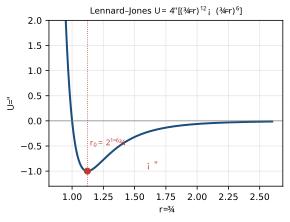
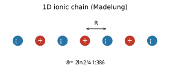

<!-- Kittel 章節導讀：第3章 晶體鍵結與彈性常數（Crystal Binding and Elastic Constants） -->

# Kittel 第3章 對照導讀 — 晶體鍵結與彈性常數（Crystal Binding and Elastic Constants）

> **這頁是什麼**：讀 Kittel 這一章時的對照地圖——概念橋（高中→大學→固態）＋術語速查。完整課文見 [Kittel 翻譯本對應章節](../Kittel_翻譯.html)；想看完整推導與考題，見 [單元教學 unit03](../../單元教學/unit03_晶體鍵結.html)。

## 🗺️ 這一章在講什麼（3–6 句白話）

這一章在回答一個很單純的問題：**是什麼把一堆原子黏成晶體？** 答案歸根究底只有一件事——電子的負電荷與原子核的正電荷之間的靜電作用（磁力很弱、重力可忽略）。

章節大致分兩半。**前半談「鍵結（binding）」**：依「最外層電子怎麼分佈」把晶體分成五大類——惰性氣體（凡得瓦力）、離子晶體（庫侖吸引＋馬德隆能）、共價晶體（共用電子對）、金屬（電子海）、氫鍵；每一類都算它的**內聚能（cohesive energy）**，也就是把晶體拆成無限遠中性原子所需的能量。

**後半談「彈性常數（elastic constants）」**：把晶體當成連續彈性體，用**虎克定律（Hooke's law）**把應力（stress）和應變（strain）連起來，導出立方晶體只有 3 個獨立彈性剛度常數 $C_{11},C_{12},C_{44}$，再用它們算出體積模數與彈性波速度。

## 🌉 概念三層對應表（高中 → 大學普物 → 本章固態物理）

| 高中你學過的 | 大學普物的版本 | 本章固態物理變成 |
|---|---|---|
| 庫侖定律 $F=kq_1q_2/r^2$、靜電位能 $U=kq_1q_2/r$ | 多電荷系統的位能疊加 | 把整個晶格的庫侖能加總 → **馬德隆能（Madelung energy）** $U=-\alpha q^2/R$ |
| 彈簧位能 $U=\tfrac12kx^2$、簡諧運動 | 兩耦合諧振子的正規模 | 兩個原子用諧振子近似 → 推出 **凡得瓦力（van der Waals）** $\propto -1/R^6$ |
| 鍵結（共價、離子）只是化學名詞 | 量子化學的軌域、自旋 | 五種鍵結用「最外層電子分佈」統一分類，並能**算能量** |
| 重疊的東西會互相擠 | 包立不相容原理（Pauli）、電子組態 | 電荷重疊 → 排斥能 $\propto B/R^{12}$ 或 $\lambda e^{-r/\rho}$ |
| 虎克定律 $F=-kx$、楊氏模數 $\sigma=E\varepsilon$ | 應力張量、應變張量（多分量） | $e_{xx},e_{xy}\dots$ 六個應變 × 六個應力 → 彈性常數矩陣 |
| 一維波 $v=f\lambda$、聲速 | 連續介質中的彈性波方程 | 立方晶體的彈性波速 $v=\sqrt{C/\rho}$，沿 [100]/[110]/[111] 各不同 |
| 體積會被壓縮 | 壓縮率、可壓縮性 | **體積模數（bulk modulus）** $B$ 用 $C_{11},C_{12}$ 表示，$K=1/B$ |

## 🔑 專有名詞 × 範例（速查）

<b>▸ 內聚能 / 結合能（cohesive energy / binding energy）</b>

**白話**：把晶體「拆光」變成一個個飄在無限遠、靜止不動的中性原子，要花多少能量。
**高中接點**：像「拆掉一棟用磁鐵蓋的房子要出多少力氣」；化學裡的「鍵能」加總概念。
**定義**：把晶體分離成相距無限遠、靜止、同電子組態之中性自由原子所需的能量。（離子晶體用「**晶格能 lattice energy**」一詞，是拆成自由離子。）
**範例**：惰性氣體鍵結很弱（Ar 約 0.08 eV/atom），而 C、Si、Ge 那一欄強很多；熔點、體積模數大致跟著它走。
**在 Kittel 哪裡**：開頭「晶體鍵結與彈性常數」總述，表 1。

<b>▸ 凡得瓦–倫敦作用（van der Waals–London interaction）</b>

**白話**：兩個本來中性的原子，靠電子雲「同步抖動」誘導出偶極，互相吸引。
**高中接點**：兩個彈簧（諧振子）耦合在一起，總能量會下降一點點。
**定義**：誘導偶極–偶極吸引，能量隨距離 $\propto -1/R^6$；屬量子效應（來自零點能下降）。
**範例**：惰性氣體晶體（Ne、Ar…）以及許多有機分子晶體，主要就靠這個力凝聚。
**在 Kittel 哪裡**：「惰性氣體的晶體 → 范德瓦爾斯–倫敦相互作用」一節，式 (3)–(9)。

<b>▸ 藍納–瓊斯位能（Lennard–Jones potential）</b>

**白話**：把「遠處吸引 $-1/R^6$」和「太近排斥 $+1/R^{12}$」合起來的一條 U 形位能曲線。
**高中接點**：位能井——有個最低點（平衡），左邊很陡（不能再靠近），右邊平緩。
**定義**：$\displaystyle U(R)=4\epsilon\!\left[\left(\frac{\sigma}{R}\right)^{12}-\left(\frac{\sigma}{R}\right)^{6}\right]$，其中 $4\epsilon\sigma^{6}=A,\;4\epsilon\sigma^{12}=B$。
**範例**：最小值在 $R/\sigma=2^{1/6}\approx1.12$，最深處能量為 $-\epsilon$，且 $U=0$ 於 $R=\sigma$。
**在 Kittel 哪裡**：「排斥相互作用 → 平衡晶格常數」，式 (10)，圖 6。

<b>▸ 排斥相互作用 與 包立原理（repulsive interaction & Pauli principle）</b>

**白話**：原子靠太近時電子雲重疊，被迫塞到更高能階，所以「推開」。
**高中接點**：包立不相容原理——兩電子不能所有量子數都相同。
**定義**：經驗形式 $B/R^{12}$（惰性氣體）或指數形 $\lambda e^{-r/\rho}$（離子晶體），$\rho$ 是作用範圍。
**範例**：把兩個 H 原子壓到質子幾乎相碰，自旋平行時要把一個電子從 1s 抬到 2s，多花 19.60 eV——這就是包立帶來的排斥。
**在 Kittel 哪裡**：「排斥相互作用」一節，圖 5。

<b>▸ 馬德隆能 / 馬德隆常數（Madelung energy / constant）</b>

**白話**：把離子晶體裡「每個離子對所有其他離子的庫侖能」全部加總後的那個吸引能。
**高中接點**：庫侖位能 $\pm q^2/r$ 的無限多項相加（正負交錯）。
**定義**：$\displaystyle \alpha=\sum_j \frac{(\pm)}{p_{ij}}$（以最近鄰距離 $R$ 為單位），總能 $U_{\text{tot}}=-\dfrac{N\alpha q^2}{R}+(\text{排斥})$。
**範例**：一維交錯離子鏈 $\alpha=2\ln 2\approx1.386$；NaCl 結構 $\alpha=1.747565$、CsCl $=1.762675$、ZnS $=1.6381$。
**在 Kittel 哪裡**：「靜電或馬德隆能 → 馬德隆常數的計算」，式 (21)–(25)，圖 9、10。

<b>▸ 共價鍵 與 交換作用（covalent bond & exchange interaction）</b>

**白話**：兩原子各出一個電子、共用一對自旋反平行的電子，把彼此黏住，方向性很強。
**高中接點**：化學的「電子對／同極鍵」；自旋反平行才能擠在同一空間。
**定義**：共用電子對、自旋反平行；能量隨自旋方向變化的庫侖能稱為**交換作用（exchange interaction）**。
**範例**：C、Si、Ge 取鑽石結構，四面體配位、只有 4 個最近鄰，空間填充率僅 0.34（緊密堆積是 0.74），但鍵很強。
**在 Kittel 哪裡**：「共價晶體」一節，圖 11、12；分數離子性見表 8。

<b>▸ 金屬鍵 / 電子海（metallic bond / electron sea）</b>

**白話**：價電子全被「抽出來」變成共有的電子海，正離子泡在裡面；電子動能降低就是鍵的來源。
**高中接點**：金屬「自由電子」導電的圖像。
**定義**：傳導電子相較自由原子能量被降低；鍵不算強，傾向緊密堆積（fcc、hcp、bcc）。
**範例**：鹼金屬結合能遠小於鹼金屬鹵化物；過渡金屬因 $d$ 殼層而鍵結特別強。
**在 Kittel 哪裡**：「金屬」「氫鍵」「原子半徑／離子晶體半徑」各節。

<b>▸ 應變 與 應力（strain & stress）</b>

**白話**：應變是「形狀被拉/壓/剪了多少」（無單位比例）；應力是「單位面積上的力」。
**高中接點**：虎克定律 $F=-kx$、楊氏模數 $\sigma=E\varepsilon$ 的多分量升級版。
**定義**：六個應變分量 $e_{xx},e_{yy},e_{zz},e_{xy},e_{yz},e_{zx}$（無因次）；六個獨立應力分量（力矩平衡使 $X_y=Y_x$，9→6 個）。
**範例**：體膨脹（dilation）＝ 體積分數變化 $\approx e_{xx}+e_{yy}+e_{zz}$。
**在 Kittel 哪裡**：「彈性應變分析 → 伸張 → 應力分量」各節，圖 14–16。

<b>▸ 彈性剛度常數 與 順從常數（elastic stiffness $C$ & compliance $S$）</b>

**白話**：把六個應力和六個應變連起來的「比例係數矩陣」；$C$ 是「要多硬」、$S$ 是它的逆「多軟」。
**高中接點**：虎克定律的彈簧常數 $k$，但這裡是 6×6 的版本。
**定義**：$\text{應力}=C\cdot\text{應變}$，$\text{應變}=S\cdot\text{應力}$；對稱性使 36 → 21 個，立方晶體再減到 **3 個**：$C_{11},C_{12},C_{44}$。
**範例**：立方晶體彈性能密度 $U=\tfrac12C_{11}(e_{xx}^2+e_{yy}^2+e_{zz}^2)+\tfrac12C_{44}(e_{xy}^2+e_{yz}^2+e_{zx}^2)+C_{12}(e_{yy}e_{zz}+e_{zz}e_{xx}+e_{xx}e_{yy})$。
**在 Kittel 哪裡**：「彈性順從與剛性常數 → 彈性能量密度 → 立方晶體的彈性剛性常數」，矩陣 (50)。

<b>▸ 體積模數 與 可壓縮性（bulk modulus $B$ & compressibility $K$）</b>

**白話**：「要把它壓小一點點有多難」——$B$ 大＝難壓；$K=1/B$ 是它的倒數。
**高中接點**：氣體「壓縮」概念的固體版。
**定義**：立方晶體 $B=\tfrac13(C_{11}+2C_{12})$，可壓縮性 $K=1/B$。
**範例**：熔點、結合能、體積模數三者大致同向變化（鍵越強越硬越難熔）。
**在 Kittel 哪裡**：「體模數與壓縮率」一節。

<b>▸ 立方晶體中的彈性波（elastic waves in cubic crystals）</b>

**白話**：把彈性常數丟進牛頓第二定律，就得到聲波在晶體裡跑多快；不同方向、不同偏振速度不同。
**高中接點**：弦波/聲波 $v=\sqrt{T/\mu}$ 的固體三維版。
**定義**：[100] 縱波 $v=\sqrt{C_{11}/\rho}$、橫波 $v=\sqrt{C_{44}/\rho}$；[110] 縱波 $v=\sqrt{(C_{11}+C_{12}+2C_{44})/2\rho}$。
**範例**：沿 [100] 與 [111] 兩個橫波模式簡併（速度相等）；一般方向則否。
**在 Kittel 哪裡**：「立方晶體中的彈性波 → [100] 方向的波 → [110] 方向的波」，圖 20。

<b>▸ 分數離子性（fractional ionic character）</b>

**白話**：一個鍵到底「幾分離子、幾分共價」的量化指標（0 到 1）。
**高中接點**：電負度差越大越像離子鍵的直覺。
**定義**：J. C. Phillips 半經驗理論給出的 0–1 數值。
**範例**：Si=0.00（純共價）、SiC=0.18、GaAs=0.31、NaCl=0.94、RbF=0.96（幾乎純離子）。
**在 Kittel 哪裡**：「共價晶體」末，表 8。

## ⚠️ 讀這章常卡的點 ＋ 翻譯雷區

- **CGS vs SI 單位切換**：Kittel 在離子晶體那節用 CGS，庫侖作用寫成 $-q^2/r$；換 SI 要把 $q^2 \to q^2/4\pi\varepsilon_0$。算馬德隆能、做習題 5 時最常在這裡掉分，對照原文 [../Kittel_原文.html](../Kittel_原文.html) 確認。
- **「結合能」與「晶格能」不是同一件事**：結合能（binding/cohesive）拆成中性**原子**；晶格能（lattice）拆成自由**離子**。NaCl 的圖 8 就是用「電離能、電子親和力」把兩者接起來（7.9 與 6.4 eV 不要混用）。
- **$\rho$（rho）這個符號身兼三職**：在 LJ／離子排斥裡是「排斥作用範圍」（$\lambda e^{-r/\rho}$、$\rho\approx0.1R_0$）；在彈性波那節 $\rho$ 卻是「質量密度」。同一章兩個意思，看上下文。
- **馬德隆級數要「正負交錯排」才會收斂**：三維直接硬加不會收斂；翻譯本可能讓你以為只是普通求和。Kittel 特別提到要重排（Ewald 方法，附錄 B）。
- **翻譯本亂碼／OCR 雷區**：標題出現「水晶結合」「光子 I」其實是「晶體鍵結／聲子」的誤譯；不少公式被替換成 `==> picture intentionally omitted <==`（如式 (3)(9)(10)(50)），務必回 [Kittel 翻譯本](../Kittel_翻譯.html) 或 [原文](../Kittel_原文.html) 補上。表 1/4 的數字欄位也被擠在一起，別照抄排版。
- **彈性常數的「9→6→21→3」是兩步**：先力矩平衡讓應力 9→6 個獨立分量；再由能量是應變二次式、對稱性把剛度 36→21；最後立方對稱（四個三重旋轉軸）再砍到 3 個。別把這三次化簡混成一步。

## 📝 實際範例（Worked Examples）

### 例題 1：藍納–瓊斯（Lennard–Jones）位能的平衡距離

**題目**：給定藍納–瓊斯位能 $\displaystyle U(r)=4\epsilon\!\left[\left(\dfrac{\sigma}{r}\right)^{12}-\left(\dfrac{\sigma}{r}\right)^{6}\right]$，求兩原子的平衡距離 $r_0$（以 $\sigma$ 為單位）。

**Step 1**：平衡點是位能極小值，條件為 $\dfrac{dU}{dr}=0$。

**Step 2**：逐項對 $r$ 微分。利用 $\dfrac{d}{dr}r^{-n}=-n\,r^{-n-1}$：

$$\frac{dU}{dr}=4\epsilon\left[12\,\sigma^{12}\,(-r^{-13})-6\,\sigma^{6}\,(-r^{-7})\right]=4\epsilon\left[-\frac{12\sigma^{12}}{r^{13}}+\frac{6\sigma^{6}}{r^{7}}\right].$$

**Step 3**：令其為 0，並把括號內整理：

$$\frac{12\sigma^{12}}{r^{13}}=\frac{6\sigma^{6}}{r^{7}}\;\Longrightarrow\;\frac{12\sigma^{12}}{6\sigma^{6}}=\frac{r^{13}}{r^{7}}\;\Longrightarrow\;2\sigma^{6}=r^{6}.$$

**Step 4**：兩邊開六次方，得 $r_0=2^{1/6}\,\sigma$。代入數值 $2^{1/6}\approx1.1225$：

$$\boxed{r_0=2^{1/6}\,\sigma\approx1.12\,\sigma}$$

（順帶一提，把 $r_0$ 代回可得井深 $U(r_0)=-\epsilon$。）

### 例題 2：一維離子鏈的馬德隆常數（Madelung constant）

**題目**：一條無限長、交錯排列正負離子的一維鏈，相鄰離子距離為 $R$（電荷 $\pm q$）。求其馬德隆常數 $\alpha$。

**Step 1**：定義 $\displaystyle \alpha=\sum_j \frac{(\pm)}{p_{ij}}$，其中 $p_{ij}R$ 是第 $j$ 個離子到參考離子的距離。取一個正離子當參考。

**Step 2**：左右對稱，所以只算一側再乘 2。最近鄰是異號（吸引，取 $+$），第二近鄰是同號（排斥，取 $-$），如此正負交錯，且第 $n$ 鄰距離為 $nR$：

$$\alpha=2\left(\frac{1}{1}-\frac{1}{2}+\frac{1}{3}-\frac{1}{4}+\cdots\right).$$

**Step 3**：括號內正是 $\ln(1+x)$ 在 $x=1$ 的展開 $\displaystyle \ln(1+x)=x-\frac{x^2}{2}+\frac{x^3}{3}-\cdots$，故括號 $=\ln 2$。

**Step 4**：得 $\alpha=2\ln 2$，代入 $\ln 2\approx0.6931$：

$$\boxed{\alpha=2\ln 2\approx1.386}$$

### 例題 3：估算 NaCl 每離子對的馬德隆能（SI 單位）

**題目**：NaCl 結構馬德隆常數 $\alpha=1.748$、最近鄰距離 $r_0=2.82$ Å。用 SI 制估算每一對 Na$^+$–Cl$^-$ 的馬德隆（庫侖）能 $\displaystyle U_M=-\dfrac{\alpha e^2}{4\pi\varepsilon_0 r_0}$，並換算成 eV。

**Step 1**：列出常數（SI）：$e=1.602\times10^{-19}$ C、$\varepsilon_0=8.854\times10^{-12}$ F/m、$r_0=2.82\times10^{-10}$ m。

**Step 2**：先算分子 $\alpha e^2=1.748\times(1.602\times10^{-19})^2=1.748\times2.566\times10^{-38}=4.486\times10^{-38}$ C²。

**Step 3**：再算分母 $4\pi\varepsilon_0 r_0=4\pi\times8.854\times10^{-12}\times2.82\times10^{-10}=3.137\times10^{-20}$ F·m/m。

**Step 4**：相除並加負號：

$$U_M=-\frac{4.486\times10^{-38}}{3.137\times10^{-20}}=-1.430\times10^{-18}\ \text{J}.$$

**Step 5**：換算成 eV（除以 $1.602\times10^{-19}$ J/eV）：$U_M=-1.430\times10^{-18}/1.602\times10^{-19}\approx-8.93$ eV。

$$\boxed{U_M=-\frac{\alpha e^2}{4\pi\varepsilon_0 r_0}\approx-1.43\times10^{-18}\ \text{J}\approx-8.9\ \text{eV}}$$

（注意：這只是庫侖吸引部分；加上排斥能後實際晶格能約 $-7.9$ eV 量級，與量熱實驗一致。）

## 🔗 延伸
- 完整課文：[Kittel 翻譯本](../Kittel_翻譯.html)（搜尋「晶體鍵結與彈性常數」「馬德隆」「彈性剛性常數」即可定位）
- 深入推導＋考題：[單元教學 unit03 晶體鍵結](../../單元教學/unit03_晶體鍵結.html)
- 練歷年題：[逐題詳解](../../考古題/詳解/index.html)
