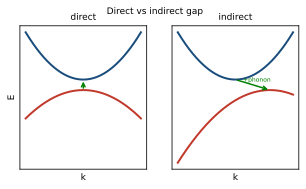
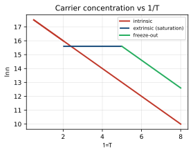
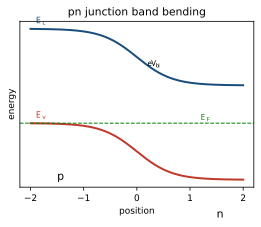

<!-- Kittel 章節導讀：第8章 半導體晶體（Semiconductor Crystals） -->

# Kittel 第8章 對照導讀 — 半導體晶體（Semiconductor Crystals）

> **這頁是什麼**：讀 Kittel 這一章時的對照地圖——概念橋（高中→大學普物→固態）＋術語速查。完整課文見 [Kittel 翻譯本對應章節](../Kittel_翻譯.html)；想看完整推導與考題，見 [單元教學 unit07](../../單元教學/unit07_半導體.html)。

## 🗺️ 這一章在講什麼（白話）

第8章是把第7章「能帶（energy band）」的結果拿來解釋一種特殊材料：**半導體**。主線是這樣走的：

1. 半導體就是**能隙（energy gap）很小**的絕緣體——0 K 時價帶（valence band）全滿、導帶（conduction band）全空，所以不導電；但室溫的熱就足以把少數電子激發過能隙，於是「導帶多了電子、價帶少了電子」一起導電。
2. 價帶頂少一個電子的「空缺」叫**電洞（hole）**，它在電磁場中表現得像一顆帶 $+e$ 的正電粒子——這是本章最核心、最常考的概念。
3. 晶體裡的電子不照真質量走，而照**有效質量（effective mass）** $m^*$ 走，$m^*$ 由能帶 $E(k)$ 的曲率倒數決定。Si、Ge、GaAs 的能帶形狀（直接/間接、各向異性橢球面）就靠迴旋共振（cyclotron resonance）量 $m^*$。
4. 本徵（intrinsic）載子濃度隨溫度的關係 $n_i\propto T^{3/2}e^{-E_g/2k_BT}$，以及 $np$ 乘積與費米能無關，是計算題的主角。
5. 最後談**摻雜（doping）**：五價雜質給電子叫施主（donor）、三價雜質要電子叫受主（acceptor），用波耳模型估電離能；再帶到半金屬、超晶格、Bloch 振盪、Zener 穿隧等延伸題。

對齊 Kittel 節次順序：能隙 → 運動方程式 → 電洞 → 有效質量 → Si/Ge → 本徵載子濃度 → 遷移率 → 雜質導電（施主/受主）→ 熱電效應 → 半金屬 → 超晶格。

## 🌉 概念三層對應表（高中 → 大學普物 → 本章固態物理）

| 高中你學過的 | 大學普物的版本 | 本章固態物理變成 |
|---|---|---|
| 電流＝電荷×數量×速度 | 歐姆定律 $\sigma=ne\mu$（$n$=載子數，$\mu$=遷移率） | 電導率為電子＋電洞貢獻和 $\sigma=ne\mu_e+pe\mu_h$，導不導電全看 $n,p$ 怎麼隨 $T$ 變 |
| 一排座位坐滿就沒人能動 | 滿能帶（filled band）不導電 | 價帶頂少一顆電子 → **電洞**，像帶 $+e$ 的正電載子在跑 |
| 二次函數 $y=\tfrac12ax^2$ 開口由 $a=y''$ 決定 | 自由電子 $E=\hbar^2k^2/2m$，係數含 $1/m$ | **有效質量** $\dfrac{1}{m^*}=\dfrac{1}{\hbar^2}\dfrac{d^2E}{dk^2}$（曲率倒數），能帶頂曲率為負 → $m^*<0$ |
| 牛頓第二定律 $F=ma$ | $\dfrac{d(m\mathbf v)}{dt}=\mathbf F$ | 晶體動量定理 $\hbar\dfrac{d\mathbf k}{dt}=\mathbf F$（外力改變的是 $\hbar k$，加速度仍 $a=F/m^*$） |
| 波耳氫原子 $E=-13.6\text{ eV}/n^2$、玻爾半徑 $0.53$ Å | 庫侖束縛態、電離能 | **施主電離能**：把 $e^2\to e^2/\epsilon$、$m\to m_e^*$，$E_d$ 縮小成幾 meV，軌道半徑放大數十倍 |
| 玻茲曼因子 $e^{-E/k_BT}$（高能態被佔機率隨 $T$ 升） | 費米—狄拉克分佈在 $\varepsilon-\mu\gg k_BT$ 退化成 $e^{-(\varepsilon-\mu)/k_BT}$ | **本徵載子濃度** $n_i\propto T^{3/2}e^{-E_g/2k_BT}$——溫度一升，載子數指數暴增 |
| 光被吸收要有足夠能量 | 光子能量 $h\nu$ 達門檻才激發 | **直接/間接能隙**：吸收光子產生電子—電洞對，間接能隙還要一顆**聲子（phonon）**幫忙湊波向量 |
| 指南針兩端電壓 | 溫差產生電動勢（熱電偶） | **熱電效應**：加熱一端量電壓極性，可判斷 $n$ 型或 $p$ 型（Peltier、Seebeck/Kelvin 關係） |

## 🔑 專有名詞 × 範例（速查）

<b>▸ 能隙（energy gap, $E_g$）</b>

**白話**：導帶最低點（導帶邊緣 conduction band edge）和價帶最高點（價帶邊緣 valence band edge）之間的能量差，這段是電子不能存在的「禁帶（forbidden band）」。
**高中接點**：原子能階之間的「跳一階要的能量」，放大成整塊材料的版本。
**定義**：$E_g=E_c-E_v$。
**範例**：Si 的 $E_g\approx1.11$ eV、Ge $\approx0.66$ eV（300 K）；能隙越窄，同溫下本徵載子越多，所以 Ge 比 Si 導電。電阻率高於 $10^{14}$ Ω·cm 才算絕緣體。
**在 Kittel 哪裡**：開章「能隙（BAND GAP）」節、表1（各晶體 $E_g$）。

<b>▸ 電洞（hole, 濃度 $p$）</b>

**白話**：價帶頂缺一顆電子留下的空缺，行為像帶正電 $+e$ 的粒子。
**高中接點**：滿座位抽走一人，「空位」反方向移動——追蹤空位比追蹤 $N-1$ 個人簡單。
**定義**：若電子從 $\mathbf k_e$ 態被移走，電洞波向量 $\mathbf k_h=-\mathbf k_e$、電荷 $+e$、能量 $\varepsilon_h(\mathbf k_h)=-\varepsilon_e(\mathbf k_e)$、有效質量 $m_h=-m_e>0$。
**範例**：填滿能帶總波向量為 0（反演對稱）；拿掉 $\mathbf k_e$ 那顆後，系統總波向量變 $-\mathbf k_e$，這就歸給電洞。電子與電洞漂移方向相反，但電流同向（都順電場）。
**在 Kittel 哪裡**：「電洞」節，圖7–10、五步驟方框。

<b>▸ 有效質量（effective mass, $m^*$）</b>

**白話**：晶體裡的電子被晶格週期勢「改裝」過，受外力時的加速度好像質量是 $m^*$ 而不是真質量 $m$。
**高中接點**：拋物線開口越窄（曲率大）→ 對應質量越小，加速越快。
**定義**：$\dfrac{1}{m^*}=\dfrac{1}{\hbar^2}\dfrac{d^2E}{dk^2}$；各向異性時是逆有效質量張量 $\left(\dfrac{1}{m^*}\right)_{\alpha\beta}=\dfrac{1}{\hbar^2}\dfrac{\partial^2E}{\partial k_\alpha\partial k_\beta}$。
**範例**：半導體能帶寬約 20 eV、能隙約 0.2–2 eV，所以能隙附近曲率被放大、$m^*$ 降到 $0.01$–$0.1\,m$。GaAs 導帶 $m_e^*\approx0.067\,m$。能帶頂曲率為負 → $m_e^*<0$，正好讓電洞質量 $m_h>0$。
**在 Kittel 哪裡**：「有效質量」「有效質量的物理詮釋」節，式（28）（29）。

<b>▸ 晶體動量／運動方程式（crystal momentum, $\hbar\mathbf k$）</b>

**白話**：外力改變的不是真動量 $m\mathbf v$，而是 $\hbar\mathbf k$。
**高中接點**：牛頓第二定律「力＝動量變化率」的晶體版。
**定義**：$\hbar\dfrac{d\mathbf k}{dt}=\mathbf F$（含電場與洛倫茲力 $\mathbf F=-e(\mathbf E+\mathbf v\times\mathbf B)$）；群速度 $\mathbf v_g=\hbar^{-1}\nabla_{\mathbf k}E(\mathbf k)$。
**範例**：磁場中 $d\mathbf k/dt\perp\nabla_{\mathbf k}E$，所以電子在 $k$ 空間沿等能面運動，$\mathbf k$ 在 $\mathbf B$ 上的投影守恆——這是迴旋共振軌道的根據。
**在 Kittel 哪裡**：「運動方程式」「物理導出 $\hbar\dot{\mathbf k}=\mathbf F$」節，式（5）（7）。

<b>▸ 直接／間接能隙（direct / indirect gap）</b>

**白話**：導帶谷底和價帶峰頂在不在同一個 $\mathbf k$ 上。同一個 $\mathbf k$＝直接；錯開＝間接。
**高中接點**：吸收光子要「能量對得上」，間接能隙還得「動量也對得上」。
**定義**：光子波向量幾乎為 0，所以直接躍遷在 $E$-$k$ 圖上是垂直線；間接躍遷帶邊在 $k$ 空間相隔很遠，需發射/吸收一顆聲子湊波向量守恆 $\mathbf k_g=\mathbf K$（聲子）。
**範例**：Si、Ge 是間接能隙（吸收弱、需聲子），所以不適合做發光元件；InSb、GaAs 是直接能隙（吸收閾值尖銳），適合做雷射/LED。
**在 Kittel 哪裡**：「能隙」節，圖4、5、6，表1 用 $i/d$ 標記。

<b>▸ 迴旋共振（cyclotron resonance, $\omega_c$）</b>

**白話**：用靜磁場把載子轉成螺旋軌道，再用射頻電場「踩在同步頻率」上共振吸收，從共振條件反推 $m^*$。
**高中接點**：圓周運動 + 共鞦韆「同步推才盪得高」。
**定義**：$\omega_c=\dfrac{eB}{m^*}$；要看到共振需 $\omega_c\tau\gg1$（碰撞間至少轉一弧度）。
**範例**：取 $m^*/m=0.1$、$f_c=24$ GHz，則 $B\approx860$ G。Ge 沿 $\langle111\rangle$ 有縱向 $m_l=1.59\,m$、橫向 $m_t=0.082\,m$ 的橢球面；Si 沿 $\langle100\rangle$ 是 $m_l=0.92\,m$、$m_t=0.19\,m$。
**在 Kittel 哪裡**：「半導體中的有效質量」節，圖12、13、16，式（30）（34）。

<b>▸ 本徵載子濃度（intrinsic carrier concentration, $n_i$）</b>

**白話**：純半導體裡靠熱激發產生的電子數（＝電洞數）。
**高中接點**：玻茲曼因子——越高的能隙、越低的溫度，越難激發。
**定義**：$np=4\left(\dfrac{k_BT}{2\pi\hbar^2}\right)^3(m_em_h)^{3/2}e^{-E_g/k_BT}$（與費米能無關）；本徵時 $n=p=n_i\propto T^{3/2}e^{-E_g/2k_BT}$。
**範例**：300 K 時 $n_i$ 約 Ge $1.7\times10^{13}$、Si $4.6\times10^{9}$ cm$^{-3}$。$np$ 乘積在固定 $T$ 為常數，所以摻雜增加 $n$ 必使 $p$ 下降（補償 compensation）。
**在 Kittel 哪裡**：「本徵載子濃度」節，式（43）（45）、圖18。

<b>▸ 遷移率（mobility, $\mu_e,\mu_h$）</b>

**白話**：單位電場下載子的漂移速度大小，跑得多快。
**高中接點**：阻力下的等速漂移，$v=\mu E$。
**定義**：$\mu=\dfrac{|v_{\text{drift}}|}{E}=\dfrac{e\tau}{m^*}$（$\tau$ 為碰撞時間）；$\sigma=ne\mu_e+pe\mu_h$。
**範例**：室溫 Si 電子 1350、電洞 480 cm$^2$/V·s；GaAs 電子高達 8000。電洞通常比電子慢（價帶帶緣簡併造成帶間散射）。本徵區的 $\sigma$ 由載子數的 $e^{-E_g/2k_BT}$ 主導，所以**半導體電導隨 $T$ 升**（與金屬相反）。
**在 Kittel 哪裡**：「本徵流動性（遷移率）」節，表3。

<b>▸ 施主／受主（donor / acceptor, $E_d,E_a$）</b>

**白話**：五價雜質（P、As、Sb）多一顆電子可給出 → 施主，做出 $n$ 型；三價雜質（B、Al、Ga、In）缺一電子要從價帶拿 → 受主，做出 $p$ 型。
**高中接點**：波耳氫原子——那顆多出來/缺掉的電子，就是「住在晶體裡、被介電質屏蔽的氫」。
**定義**：用波耳模型替換 $e^2\to e^2/\epsilon$、$m\to m_e^*$：$E_d=\dfrac{m_e^*}{m}\dfrac{1}{\epsilon^2}\times13.6\text{ eV}$；軌道半徑 $a=\dfrac{\epsilon\,m}{m_e^*}\times0.53\text{ Å}$。
**範例**：Ge 用 $m_e^*=0.1m$、$\epsilon=15.8$ 估得 $E_d\approx5$ meV，半徑約 80 Å（實測 P/As/Sb 約 9–13 meV）；Si 約 20–50 meV。室溫 $k_BT\approx26$ meV，所以這些雜質在室溫已大致電離。
**在 Kittel 哪裡**：「雜質導電性」「施主能態」「受主能態」節，表4（$\epsilon$）、表5（$E_d$）、表6（$E_a$）。

<b>▸ $n$ 型／$p$ 型與補償（n-type / p-type / compensation）</b>

**白話**：施主多 → 電子主導導電（$n$ 型）；受主多 → 電洞主導（$p$ 型）。同時摻兩種會互相抵消。
**高中接點**：正負相消——多餘電子去填空缺。
**定義**：$np=\text{const}$（固定 $T$），故引入適量反型雜質可大幅降低總載子 $n+p$，稱補償。Hall 電壓符號可粗判 $n$/$p$ 型。
**範例**：硼摻入矽（$1$ 個 B 對 $10^5$ 個 Si）使室溫電導增加 $10^3$ 倍。圖22：以 $n=10^{10}$ cm$^{-3}$ 為對稱中心，$n$ 較大為 $n$ 型、較小為 $p$ 型。
**在 Kittel 哪裡**：「施主與受主的熱電離」節，式（53）、圖21、22。

<b>▸ 半金屬／超晶格／Bloch 振盪／Zener 穿隧（semimetal / superlattice / Bloch oscillation / Zener tunneling）</b>

**白話**：本章末段四個延伸主題。半金屬＝導帶價帶微微重疊；超晶格＝人造週期堆疊產生迷你能帶；Bloch 振盪＝定電場下電子在能帶內來回振盪；Zener 穿隧＝強場下跨能帶穿隧。
**高中接點**：能帶圖被外場「傾斜」後的後果。
**定義**：Bloch 頻率 $\omega_B=\dfrac{eEA}{\hbar}$（$A$=超晶格週期）；半金屬 As/Sb/Bi 屬第 V 族，$n_e=n_h$。
**範例**：Bi 的 $n_e=n_h\approx3\times10^{17}$ cm$^{-3}$（遠低於金屬的 $\sim10^{22}$）；GaAs/GaAlAs 超晶格週期約 5 nm。Zener 二極體就是利用帶間穿隧崩潰。
**在 Kittel 哪裡**：「半金屬」「超晶格」「Bloch 振盪器」「Zener 穿隧」節，表7。

## ⚠️ 讀這章常卡的點 ＋ 翻譯雷區

- **晶體動量 $\hbar\mathbf k$ 不是真動量**：$\hbar\,d\mathbf k/dt=\mathbf F$ 不違反牛頓定律。晶體裡的電子除了外力，還受晶格週期勢的力；$\mathbf k$ 改變時動量還有一部分轉移給晶格（翻譯本「物理導出」一節亂碼較多，建議只抓結論 $\hbar\dot{\mathbf k}=\mathbf F$，細節對照 ../Kittel_原文.html 附錄 E）。
- **電洞波向量符號**：圖7上電洞畫在 $\mathbf k_e$ 的位置，但**真實波向量是 $\mathbf k_h=-\mathbf k_e$**。翻譯本這段繞口，務必盯住「移走 $\mathbf k_e$ 的電子 → 電洞 $-\mathbf k_e$」。
- **能隙因子 $E_g$ 還是 $E_g/2$**：$np$ 乘積帶 $e^{-E_g/k_BT}$，但本徵 $n_i=p_i$ 各帶 $e^{-E_g/2k_BT}$（開根號）。考試常在這裡掉分。
- **兩個 $\mu$ 同字母**：化學勢（費米能）$\mu$ 與遷移率 $\mu_e,\mu_h$ 撞字母，Kittel 也提醒過，靠上下文分辨。
- **$np$ 與材料是否本徵無關**：式（43）只要費米能距兩帶邊都 $\gg k_BT$ 就成立，摻雜樣品照用。別誤以為只適用純材料。
- **翻譯本術語混雜**：同一頁可能「電洞／空穴」「遷移率／流動性／本徵流動性」「本徵／內在／內在溫度範圍」交替出現，且夾雜未翻的英文整段（如 $p$-type 那段）。看到 `�`、`==> picture omitted <==`、半句英文時，對照 ../Kittel_原文.html 確認。

## 📝 實際範例（Worked Examples）

### 例題 1：Si pn 接面的內建電位（built-in voltage）

**題目**：一個矽（Si）pn 接面，$p$ 側受主濃度 $N_a=10^{17}\,\mathrm{cm^{-3}}$、$n$ 側施主濃度 $N_d=10^{17}\,\mathrm{cm^{-3}}$，本徵載子濃度 $n_i=1.5\times10^{10}\,\mathrm{cm^{-3}}$，溫度 $T=300\,\mathrm{K}$。求內建電位（built-in voltage）$V_{bi}$。

公式：$V_{bi}=\dfrac{k_BT}{e}\ln\dfrac{N_aN_d}{n_i^2}$。

**Step 1**：先算熱電壓（thermal voltage）$\dfrac{k_BT}{e}$。
$k_B=1.38\times10^{-23}\,\mathrm{J/K}$，$T=300\,\mathrm{K}$，$e=1.60\times10^{-19}\,\mathrm{C}$。
$$\frac{k_BT}{e}=\frac{(1.38\times10^{-23})(300)}{1.60\times10^{-19}}=\frac{4.14\times10^{-21}}{1.60\times10^{-19}}=0.0259\,\mathrm{V}\approx25.9\,\mathrm{mV}.$$

**Step 2**：算對數內的比值 $\dfrac{N_aN_d}{n_i^2}$。
$$N_aN_d=(10^{17})(10^{17})=10^{34}\,\mathrm{cm^{-6}},\qquad n_i^2=(1.5\times10^{10})^2=2.25\times10^{20}\,\mathrm{cm^{-6}}.$$
$$\frac{N_aN_d}{n_i^2}=\frac{10^{34}}{2.25\times10^{20}}=4.44\times10^{13}.$$

**Step 3**：取自然對數。
$$\ln(4.44\times10^{13})=\ln(4.44)+13\ln(10)=1.49+13\times2.303=1.49+29.93=31.4.$$

**Step 4**：兩者相乘。
$$V_{bi}=0.0259\times31.4=0.814\,\mathrm{V}.$$

$$\boxed{V_{bi}\approx0.81\ \mathrm{V}}$$

### 例題 2：本徵載子濃度（intrinsic carrier concentration）的溫度依賴

**題目**：矽（Si）能隙 $E_g=1.12\,\mathrm{eV}$，本徵載子濃度滿足 $n_i\propto T^{3/2}e^{-E_g/2k_BT}$。試比較 $T_1=300\,\mathrm{K}$ 與 $T_2=400\,\mathrm{K}$ 兩溫度下的 $n_i$ 比值，說明其溫度依賴有多敏感。

**Step 1**：寫出比值，兩個比例常數相消。
$$\frac{n_i(T_2)}{n_i(T_1)}=\left(\frac{T_2}{T_1}\right)^{3/2}\exp\!\left[-\frac{E_g}{2k_B}\left(\frac{1}{T_2}-\frac{1}{T_1}\right)\right].$$

**Step 2**：算冪次前因子（pre-factor）。
$$\left(\frac{400}{300}\right)^{3/2}=(1.333)^{3/2}=1.540.$$

**Step 3**：算指數項。先用 $k_B=8.617\times10^{-5}\,\mathrm{eV/K}$，故 $\dfrac{E_g}{2k_B}=\dfrac{1.12}{2\times8.617\times10^{-5}}=6499\,\mathrm{K}$。
$$\frac{1}{T_2}-\frac{1}{T_1}=\frac{1}{400}-\frac{1}{300}=0.00250-0.00333=-8.33\times10^{-4}\,\mathrm{K^{-1}}.$$
$$-\frac{E_g}{2k_B}\left(\frac{1}{T_2}-\frac{1}{T_1}\right)=-6499\times(-8.33\times10^{-4})=+5.42.$$
$$e^{5.42}=226.$$

**Step 4**：相乘得比值。
$$\frac{n_i(400\,\mathrm{K})}{n_i(300\,\mathrm{K})}=1.540\times226\approx348.$$

由此可見：溫度只升 $100\,\mathrm{K}$，本徵載子數就暴增約 350 倍——主導項是指數因子 $e^{-E_g/2k_BT}$，這正是半導體電導率隨溫度上升而增大的根源。

$$\boxed{\dfrac{n_i(400\,\mathrm{K})}{n_i(300\,\mathrm{K})}\approx3.5\times10^{2}}$$

### 例題 3：由霍爾係數（Hall coefficient）反推載子濃度

**題目**：對一塊 $n$ 型半導體量得霍爾係數 $R_H=-6.25\,\mathrm{cm^3/C}$（負號表示電子主導）。已知 $R_H=-\dfrac{1}{ne}$，求載子濃度 $n$。電子電荷 $e=1.60\times10^{-19}\,\mathrm{C}$。

**Step 1**：由 $R_H=-\dfrac{1}{ne}$ 解出 $n$。
$$n=-\frac{1}{R_H\,e}=\frac{1}{|R_H|\,e}.$$

**Step 2**：把單位統一成 CGS-實用混合制（$R_H$ 以 $\mathrm{cm^3/C}$、$e$ 以 $\mathrm{C}$），代入數值。
$$n=\frac{1}{(6.25\,\mathrm{cm^3/C})(1.60\times10^{-19}\,\mathrm{C})}=\frac{1}{1.00\times10^{-18}\,\mathrm{cm^3}}.$$

**Step 3**：取倒數。
$$n=1.00\times10^{18}\,\mathrm{cm^{-3}}.$$

這個量級（$\sim10^{18}\,\mathrm{cm^{-3}}$）遠高於室溫 Si 的本徵值（$\sim10^{10}\,\mathrm{cm^{-3}}$），符合中度摻雜（doping）$n$ 型樣品的特徵。

$$\boxed{n\approx1.0\times10^{18}\ \mathrm{cm^{-3}}}$$

## 🔗 延伸
- 完整課文：[Kittel 翻譯本](../Kittel_翻譯.html)（搜尋「半導體晶體」「有效質量」即可定位）
- 深入推導＋考題：[單元教學 unit07](../../單元教學/unit07_半導體.html)
- 練歷年題：[逐題詳解](../../考古題/詳解/index.html)
