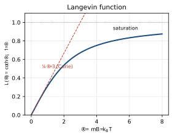
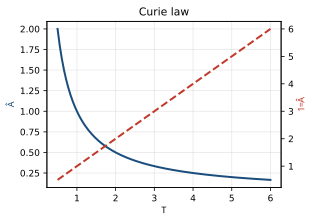
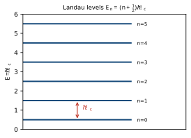

<!-- Kittel 章節導讀：第11–12章 磁性（Diamagnetism, Paramagnetism, Ferromagnetism & Antiferromagnetism） -->

# Kittel 第11–12章 對照導讀 — 磁性（Magnetism）

> **這頁是什麼**：讀 Kittel 第11章（抗磁性與順磁性）＋第12章（鐵磁性與反鐵磁性）時的對照地圖——概念橋（高中→大學普物→固態）＋術語速查。完整課文見 [Kittel 翻譯本對應章節](../Kittel_翻譯.html)；想看完整推導與考題，見 [單元教學 unit08](../../單元教學/unit08_磁性.html)。

## 🗺️ 這兩章在講什麼（白話）

材料對磁場的反應，按「磁化率 $\chi$ 的正負與隨溫度行為」分成幾類，這兩章就把它們一一拆解：

1. **抗磁性（diamagnetism）**：所有材料都有的「楞次定律式」反應——磁場一來，電子軌道感應出反向電流，產生**負**的 $\chi$（與溫度無關）。Langevin 結果 $\chi=-\dfrac{N Z e^2\langle r^2\rangle}{6mc^2}$。
2. **順磁性（paramagnetism）**：原子有未填滿殼層、帶永久磁矩時，磁矩想順著場排，產生**正**的 $\chi$。古典是 Langevin/居里定律 $\chi=C/T$；量子版用 Brillouin 函數，並靠 Hund 規則定基態 $J$、Landé 算 $g$ 因子。還有與溫度無關的 Van Vleck 順磁與金屬的 Pauli 自旋順磁。
3. 第11章末談**絕熱去磁致冷（adiabatic demagnetization）**——用順磁鹽降到 mK，再用核自旋降到 μK。
4. **鐵磁性（ferromagnetism）**：自旋之間有「交換場（exchange field）」逼它們平行，產生**自發磁化**。平均場（mean field）近似給居里溫度 $T_C$ 與居里—魏斯定律；交換場的物理來源是量子力學的**交換積分（Heisenberg model）** $U=-2J\,\mathbf S_i\cdot\mathbf S_j$。
5. 自旋有序的基本激發是**磁振子（magnon）**，色散 $\hbar\omega\propto k^2$，導致低溫磁化的 **Bloch $T^{3/2}$ 定律**；中子散射可量磁振子譜。
6. 最後是**亞鐵磁（ferrimagnetism）**（磁鐵礦 Fe₃O₄、尖晶石、石榴石）與**反鐵磁（antiferromagnetism）**（相鄰自旋反平行，$T_N$ 為 Néel 溫度），以及鐵磁能帶模型解釋 Fe/Co/Ni。

對齊 Kittel 節次：（11章）Langevin 抗磁 → 順磁量子理論 → Hund 規則 → 晶場分裂與軌道淬滅 → Van Vleck → 絕熱去磁 → Pauli 順磁；（12章）交換場與 $T_C$ → 飽和磁化 → 磁振子與 $T^{3/2}$ → 中子散射 → 亞鐵磁 → 反鐵磁 → 鐵磁能帶。

## 🌉 概念三層對應表（高中 → 大學普物 → 本章固態物理）

| 高中你學過的 | 大學普物的版本 | 本章固態物理變成 |
|---|---|---|
| 指南針在磁場中被擺正 | 磁矩能量 $U=-\boldsymbol\mu\cdot\mathbf B$，平行最穩 | 順磁：$N$ 顆磁矩想排齊，被熱對抗 → 磁化 $M$ |
| 楞次定律：感應電流反抗磁通變化 | 感應電流產生反向磁矩 | **抗磁性**：$\chi<0$，$\chi=-\dfrac{NZe^2\langle r^2\rangle}{6mc^2}$（Langevin） |
| 玻茲曼因子 $e^{-U/k_BT}$ | 兩能階佔據比 $N_2/N_1=e^{-\Delta/k_BT}$ | **居里定律** $\chi=C/T$；量子版 $M=Ng\mu_B J\,B_J(x)$（Brillouin 函數） |
| 溫度越高越亂（熵越大） | 熵 $S=k_B\ln G$ | **絕熱去磁致冷**：等熵移除磁場使自旋系統「看起來更冷」，達 mK～μK |
| 電子繞核轉、有角動量 | 軌道角動量 $\mathbf L$、自旋 $\mathbf S$、總 $\mathbf J=\mathbf L+\mathbf S$ | **Hund 規則**定基態：先最大 $S$、再最大 $L$、再定 $J$（半滿前 $|L-S|$、半滿後 $L+S$） |
| 一群小磁鐵會互相影響排列 | 偶極—偶極作用（其實太弱） | **交換場/交換積分** $U=-2J\mathbf S_i\cdot\mathbf S_j$（Heisenberg），來自庫侖能＋包立原理，可達 $10^7$ G |
| 簡諧波／琴弦上的波 | 聲子（phonon）：原子位置的振盪波 | **磁振子（magnon）**：自旋相對方向的振盪波，$\hbar\omega\propto k^2$ |
| 鐵磁鐵加熱會失去磁性 | 相變、序參數 | **居里溫度 $T_C$**：自發磁化在 $T<T_C$ 出現、$T>T_C$ 消失（二級相變） |
| 兩磁鐵 N-S 相吸排成一列 | 自旋有序排列 | **反鐵磁（$T_N$）相鄰反平行**、**亞鐵磁**部分抵消後留淨磁矩 |

## 🔑 專有名詞 × 範例（速查）

<b>▸ 磁化率（magnetic susceptibility, $\chi$）</b>

**白話**：材料被外場磁化的「敏感度」，磁化 $M$ 對場的線性響應係數。
**高中接點**：「給多少場、出多少磁化」的比例常數。
**定義**：$\chi=\dfrac{M}{B}$（CGS）或 $M=\chi H$（SI），無量綱。$\chi<0$ 抗磁、$\chi>0$ 順磁。常見也用每莫耳的 $\chi_M$。
**範例**：惰性氣體莫耳抗磁率（CGS, $10^{-6}$ cm³/mol）：He $-1.9$、Ar $-19.4$、Xe $-43.0$（皆負，典型抗磁）。
**在 Kittel 哪裡**：第11章開頭定義、圖1（各類 $\chi$ 的特徵曲線）。

<b>▸ 抗磁性（diamagnetism, Langevin）</b>

**白話**：磁場使電子軌道感應出反向電流，產生與場相反的磁矩，所有物質都有。
**高中接點**：楞次定律——感應電流反抗磁通變化。
**定義**：$\chi=-\dfrac{NZe^2}{6mc^2}\langle r^2\rangle$（$Z$=電子數，$\langle r^2\rangle$=電子均方半徑）。
**範例**：球對稱分佈時 $\langle\rho^2\rangle=\tfrac23\langle r^2\rangle$；量子版用一階微擾得到同樣形式。與溫度無關。
**在 Kittel 哪裡**：「Langevin 抗磁方程式」「單核系統抗磁性的量子理論」節，式（5）。

<b>▸ 順磁性與居里定律（paramagnetism, Curie law）</b>

**白話**：帶永久磁矩的原子想順場排，溫度越低排得越齊，$\chi$ 越大。
**高中接點**：磁矩能量 $U=-\boldsymbol\mu\cdot\mathbf B$ ＋ 玻茲曼因子。
**定義**：$\chi=\dfrac{C}{T}$（$C$=居里常數）；自旋 $S=\tfrac12$ 雙能階 $M=N\mu\tanh(\mu B/k_BT)$；一般 $M=Ng\mu_B J\,B_J(x)$，$x=g\mu_B JB/k_BT$。
**範例**：釓鹽 $\chi^{-1}$ 對 $T$ 是過原點直線（居里定律）；1.3 K、5 T 時磁矩達飽和 99.5%（Brillouin 函數的飽和段）。
**在 Kittel 哪裡**：「順磁性」「順磁性的量子理論」節，式（19）（22），圖4、5。

<b>▸ 玻爾磁子與 $g$ 因子（Bohr magneton $\mu_B$, Landé $g$-factor）</b>

**白話**：磁矩的自然單位；$g$ 因子是把總角動量 $J$ 換算成磁矩的比例。
**高中接點**：磁矩 $\propto$ 角動量（旋磁比 gyromagnetic ratio）。
**定義**：$\mu_B=\dfrac{e\hbar}{2mc}$；自由電子自旋 $g\approx2.0023$；自由原子 $g=1+\dfrac{J(J+1)+S(S+1)-L(L+1)}{2J(J+1)}$（Landé）。能階 $U=m_J\,g\mu_B B$。
**範例**：有效磁子數 $p=g[J(J+1)]^{1/2}$，例 Gd³⁺（$^8S_{7/2}$）$p_{\text{calc}}=7.94$，實測 8.0。
**在 Kittel 哪裡**：「順磁性的量子理論」節，式（13），表1（稀土）、表2（鐵族）。

<b>▸ Hund 規則（Hund's rules）</b>

**白話**：決定未滿殼層原子基態的三條口訣。
**高中接點**：電子填軌域、包立不相容。
**定義**：(1) 取包立允許的最大 $S$；(2) 與該 $S$ 相容的最大 $L$；(3) 殼層未滿半 $J=|L-S|$，過半 $J=L+S$（半滿 $L=0$ 故 $J=S$）。
**範例**：Mn²⁺ 的 3d⁵ 半滿，五個電子各佔一軌且同向 → $S=\tfrac52$、$L=0$、$J=\tfrac52$（$^6S_{5/2}$）。Ce³⁺（一個 $f$ 電子）$J=|L-S|=\tfrac52$；Pr³⁺（兩個 $f$）$J=L+S$ 受包立限制取 $L=5,S=1\Rightarrow J=4$。
**在 Kittel 哪裡**：「Hund 規則」節，表1、表2。

<b>▸ 晶場分裂與軌道角動量淬滅（crystal field splitting, quenching of $L$）</b>

**白話**：固體中相鄰離子的不均勻電場（晶體場）破壞 $L$-$S$ 耦合，使 $\langle L_z\rangle$ 平均為零，軌道對磁矩的貢獻被「淬滅」。
**高中接點**：外電場改變電子雲分佈、改變能階。
**定義**：晶場勢如 $A(x^2-y^2)+B(3z^2-r^2)$（最低次、滿足 $\nabla^2\varphi=0$）；淬滅後磁矩主要剩自旋。
**範例**：鐵族（3d 最外層）軌道被淬滅，磁子數用 $p=2[S(S+1)]^{1/2}$（純自旋）算才對得上實測；稀土（4f 深藏內層）不被淬滅，用 $g[J(J+1)]^{1/2}$。Jahn–Teller 效應（離子自發位移降能）對 Mn³⁺、Cu²⁺ 很顯著。
**在 Kittel 哪裡**：「晶場分裂」「軌道角動量的淬滅」節，圖6、式（24）（26）。

<b>▸ 絕熱（等熵）去磁致冷（adiabatic demagnetization）</b>

**白話**：固定溫度加磁場使自旋有序（熵降）；再絕熱移除磁場，自旋系統「看起來」回到更低溫。
**高中接點**：熵＝亂度，$S=k_B\ln G$。
**定義**：自旋熵僅是 $B/T$ 的函數；最終溫度 $T_2=T_1\dfrac{B_\Delta}{B}$，$B_\Delta$ 為局部交互作用等效場。
**範例**：順磁鹽可達 $10^{-3}$ K；核去磁（核磁矩弱 $\sim10^{-3}$ 倍）再降兩個數量級——Cu 核從 0.012 K 起，達 $\sim1.2\times10^{-6}$ K，$B_\Delta\approx3.1$ G。
**在 Kittel 哪裡**：「等熵去磁致冷」「核去磁」節，圖7、8、9、式（41）。

<b>▸ Pauli 自旋順磁與 Van Vleck 順磁（Pauli / Van Vleck paramagnetism）</b>

**白話**：金屬導電電子的順磁很弱且**與溫度無關**（只有費米面 $k_BT$ 範圍內的電子能翻轉）；Van Vleck 是基態無磁矩但被激發態混入產生的溫度無關順磁。
**高中接點**：費米—狄拉克分佈（並非每顆電子都能自由翻轉）。
**定義**：Pauli $\chi=\dfrac{3N\mu_B^2}{2\varepsilon_F}$（與 $T$ 無關），只有比例 $T/T_F$ 的電子有貢獻；Landau 抗磁是其 $-\tfrac13$。
**範例**：Na 中電子—電子作用可使自旋 $\chi$ 再增約 75%。過渡金屬 $\chi$ 遠大於鹼金屬 → 費米面態密度高。
**在 Kittel 哪裡**：「傳導電子的順磁化率」「Van Vleck 無溫度依賴順磁性」節，式（45）（46），圖10。

<b>▸ 交換場與交換積分（exchange field / Heisenberg model, $J$）</b>

**白話**：鐵磁靠一個強大的「內場」逼自旋平行——它不是真磁場，而是量子力學交換作用的等效。
**高中接點**：磁矩之間想排齊；但偶極場太弱，真正主角是包立原理＋庫侖能。
**定義**：平均場 $B_E=\lambda M$（魏斯場/分子場）；微觀來源 $U=-2J\,\mathbf S_i\cdot\mathbf S_j$（Heisenberg），$J>0$ 鐵磁、$J<0$ 反鐵磁。
**範例**：Fe（$T_C\approx1000$ K）估 $\lambda\approx5000$、$B_E\approx10^7$ G（$10^3$ T），比真實偶極場（$\sim10^3$ G）大 $\sim10^4$ 倍。平均場 $J\approx\dfrac{3k_BT_C}{2zS(S+1)}$，Fe 對應 $J\approx11.9$ meV。
**在 Kittel 哪裡**：「居里點與交換積分」節，式（1）（6）（7）。

<b>▸ 居里溫度與居里—魏斯定律（Curie temperature $T_C$, Curie–Weiss law）</b>

**白話**：鐵磁體在 $T_C$ 以上變回順磁（自發磁化消失），以下出現自發磁化。
**高中接點**：磁鐵加熱會退磁。
**定義**：$\chi=\dfrac{C}{T-T_C}$（順磁區，居里—魏斯），$T_C=C\lambda$；$T<T_C$ 由 $M=N\mu\tanh(\mu\lambda M/k_BT)$ 解出非零自發 $M$。
**範例**：Fe 1043 K、Co 1388 K、Ni 627 K、Gd 292 K。$M(T)$ 隨 $T$ 平滑下降、$T\to T_C$ 趨零（二級相變）；$1/\chi$ 對 $T$ 在 $T_C$ 以上是直線（圖2，鎳）。
**在 Kittel 哪裡**：「居里點與交換積分」「飽和磁化強度的溫度依賴」節，式（3）（4），圖2、3、4。

<b>▸ 磁振子與 Bloch $T^{3/2}$ 定律（magnon / spin wave, Bloch $T^{3/2}$ law）</b>

**白話**：鐵磁基態全自旋平行；最低能激發不是「翻一個自旋」，而是所有自旋分攤一點傾斜的波——磁振子。
**高中接點**：琴弦上的波（聲子的自旋版）。
**定義**：一維 $\hbar\omega=4JS(1-\cos ka)$，長波 $\hbar\omega\approx(2JSa^2)k^2\equiv Dk^2$；激發一個磁振子＝翻轉一個自旋。
**範例**：$\hbar\omega\propto k^2$（聲子是 $\propto k$）；熱激發磁振子數 $\propto T^{3/2}$ 使 $\Delta M/M(0)\propto T^{3/2}$——這就是 **Bloch $T^{3/2}$ 定律**（Ni 的 $A\approx7.5\times10^{-6}$ deg$^{-3/2}$）。中子可量磁振子譜。
**在 Kittel 哪裡**：「旋磁子（磁振子）」「自旋波的量子化」「中子磁散射」節，式（22）（24），圖10、13。

<b>▸ 亞鐵磁與反鐵磁（ferrimagnetism / antiferromagnetism, Néel）</b>

**白話**：相鄰自旋被負交換積分逼成反平行——完全抵消＝反鐵磁；只抵消一部分、留淨磁矩＝亞鐵磁。
**高中接點**：兩個方向相反的磁矩相加。
**定義**：反鐵磁有 Néel 溫度 $T_N$，下面兩子晶格反平行；亞鐵磁 $T_C=\lambda(C_AC_B)^{1/2}$，$1/\chi$ 對 $T$ 呈曲線（不是直線）。尖晶石 $J_{AB}$ 最強且為負。
**範例**：磁鐵礦 Fe₃O₄：若全平行應 $\sim14\,\mu_B$/式單位，但 Fe³⁺ 反向抵消後只剩 Fe²⁺ 貢獻 $\approx4.1\,\mu_B$（實測符合）。YIG（Y₃Fe₅O₁₂）兩子晶格 $3-2=1$ 個 Fe³⁺ 淨值 $\approx5\,\mu_B$。
**在 Kittel 哪裡**：「亞鐵磁有序」「反鐵磁有序」「鐵石榴石」節，圖14、15、16，式（33）—（37）。

## ⚠️ 讀這兩章常卡的點 ＋ 翻譯雷區

- **交換場不是真磁場**：$B_E=\lambda M$ 高達 $10^7$ G，但它不進馬克士威方程（沒有 $\nabla\times\mathbf H$ 對應的電流源），只是交換作用的等效。翻譯本腳註講得繞，記住「分子場/魏斯場＝交換作用的等效場」。
- **$2J$ 還是 $J$、$J>0$ 還是 $<0$**：Kittel 用 $U=-2J\mathbf S_i\cdot\mathbf S_j$，$J>0$ 為鐵磁、$J<0$ 反鐵磁；別的書常寫 $-J\mathbf S_i\cdot\mathbf S_j$ 差一個 2，比較公式時要對齊慣例。
- **稀土用 $g[J(J+1)]^{1/2}$、鐵族用 $2[S(S+1)]^{1/2}$**：差別在 4f（深藏、不淬滅）vs 3d（最外層、軌道被晶場淬滅）。考試最愛在這裡設陷阱（Eu³⁺、Sm³⁺ 還要算 Van Vleck 多重態修正）。
- **磁振子 $\omega\propto k^2$、聲子 $\omega\propto k$**：兩者長波行為不同，連帶低溫熱效應不同（磁化偏差 $\propto T^{3/2}$）。別把聲子的線性色散套到磁振子。
- **CGS / SI 單位混用**：第12章開頭就提醒 (CGS) $B=H+4\pi M$、(SI) $B=\mu_0(H+M)$；$\chi$、$\mu_B=\dfrac{e\hbar}{2mc}$（CGS）的因子常讓人對不上。1 T ＝ $10^4$ G。翻譯本公式多沿 CGS，換 SI 要補/去 $c$。
- **翻譯本亂碼與半翻段落**：圖2/圖3 文字錯置、$p_z/p_x/p_y$ 寫成 `<form>zf(r)</form>`、Van Vleck 與 Pauli 段落整段未翻英文、「旋磁子／磁振子／旋波子」三種譯名混用。遇到 `�`、`==> picture omitted <==`、半句英文，對照 ../Kittel_原文.html。

## 📝 實際範例（Worked Examples）

### 例題 1：朗之萬（Langevin）順磁率與居里定律（Curie law）

**題目**：一固體每單位體積含 $N=6\times10^{28}\,\mathrm{m^{-3}}$ 個原子，每個原子帶永久磁矩 $\mu=1\,\mu_B=9.27\times10^{-24}\,\mathrm{J/T}$。在小場、室溫（$T=300\,\mathrm{K}$）下，順磁率（古典居里結果）為 $\chi=\dfrac{N\mu^2\mu_0}{3k_BT}$（SI）。估算 $\chi$ 的數量級。

**Step 1**：算分子 $N\mu^2\mu_0$。其中 $\mu_0=4\pi\times10^{-7}\,\mathrm{T\cdot m/A}=1.257\times10^{-6}$。
$$\mu^2=(9.27\times10^{-24})^2=8.59\times10^{-47}\,\mathrm{J^2/T^2}.$$
$$N\mu^2=(6\times10^{28})(8.59\times10^{-47})=5.16\times10^{-18}.$$
$$N\mu^2\mu_0=(5.16\times10^{-18})(1.257\times10^{-6})=6.48\times10^{-24}.$$

**Step 2**：算分母 $3k_BT$。
$$3k_BT=3\times(1.38\times10^{-23})\times300=1.24\times10^{-20}\,\mathrm{J}.$$

**Step 3**：相除得 $\chi$。
$$\chi=\frac{6.48\times10^{-24}}{1.24\times10^{-20}}=5.2\times10^{-4}.$$

這是無量綱的體積磁化率（SI），數量級 $\sim10^{-4}$，正是典型順磁固體室溫的值（遠小於 1，故「小場線性響應」近似成立）。

$$\boxed{\chi\approx5\times10^{-4}\ (\text{無量綱, SI})}$$

### 例題 2：朗道能階（Landau level）間距

**題目**：自由電子在磁場 $B=1\,\mathrm{T}$ 中形成朗道能階，相鄰能階間距為 $\hbar\omega_c$，其中迴旋頻率（cyclotron frequency）$\omega_c=\dfrac{eB}{m}$。求此間距，並以 eV 表示。電子質量 $m=9.11\times10^{-31}\,\mathrm{kg}$、$e=1.60\times10^{-19}\,\mathrm{C}$、$\hbar=1.055\times10^{-34}\,\mathrm{J\cdot s}$。

**Step 1**：算迴旋頻率 $\omega_c$。
$$\omega_c=\frac{eB}{m}=\frac{(1.60\times10^{-19})(1)}{9.11\times10^{-31}}=1.757\times10^{11}\,\mathrm{rad/s}.$$

**Step 2**：算能階間距 $\hbar\omega_c$（焦耳）。
$$\hbar\omega_c=(1.055\times10^{-34})(1.757\times10^{11})=1.854\times10^{-23}\,\mathrm{J}.$$

**Step 3**：換算成 eV（除以 $1.60\times10^{-19}\,\mathrm{J/eV}$）。
$$\hbar\omega_c=\frac{1.854\times10^{-23}}{1.60\times10^{-19}}=1.16\times10^{-4}\,\mathrm{eV}.$$

這間距（$\sim10^{-4}\,\mathrm{eV}$）遠小於室溫熱能 $k_BT\approx0.026\,\mathrm{eV}$，所以要觀測朗道量子化（如 de Haas–van Alphen 效應）通常需強場 ＋ 低溫。

$$\boxed{\hbar\omega_c\approx1.16\times10^{-4}\ \mathrm{eV}\ (=1.85\times10^{-23}\ \mathrm{J})}$$

### 例題 3：玻爾磁子（Bohr magneton）與居里常數（Curie constant）

**題目**：自旋 $S=\tfrac12$、$g=2$ 的系統，磁矩 $\mu=g\sqrt{S(S+1)}\,\mu_B$。已知玻爾磁子 $\mu_B=\dfrac{e\hbar}{2m}=9.27\times10^{-24}\,\mathrm{J/T}$。對濃度 $N=1\times10^{28}\,\mathrm{m^{-3}}$ 的這種離子，居里定律寫成 $\chi=\dfrac{C}{T}$。求居里常數 $C=\dfrac{N\mu^2\mu_0}{3k_B}$，並算 $T=300\,\mathrm{K}$ 時的 $\chi$。

**Step 1**：先算有效磁矩 $\mu$。
$$\sqrt{S(S+1)}=\sqrt{\tfrac12\cdot\tfrac32}=\sqrt{0.75}=0.866,$$
$$\mu=2\times0.866\times\mu_B=1.732\,\mu_B=1.732\times(9.27\times10^{-24})=1.606\times10^{-23}\,\mathrm{J/T}.$$

**Step 2**：算 $\mu^2$ 與分子（含 $\mu_0=1.257\times10^{-6}$）。
$$\mu^2=(1.606\times10^{-23})^2=2.58\times10^{-46}\,\mathrm{J^2/T^2}.$$
$$N\mu^2\mu_0=(1\times10^{28})(2.58\times10^{-46})(1.257\times10^{-6})=3.24\times10^{-24}.$$

**Step 3**：除以 $3k_B$ 得居里常數 $C$（單位 K）。
$$C=\frac{N\mu^2\mu_0}{3k_B}=\frac{3.24\times10^{-24}}{3\times1.38\times10^{-23}}=\frac{3.24\times10^{-24}}{4.14\times10^{-23}}=0.0783\,\mathrm{K}.$$

**Step 4**：代入居里定律 $\chi=C/T$，取 $T=300\,\mathrm{K}$。
$$\chi=\frac{0.0783}{300}=2.6\times10^{-4}.$$

居里定律的核心特徵就在這裡：$\chi\propto 1/T$——溫度越低，磁矩越易排齊、$\chi$ 越大；把 $1/\chi$ 對 $T$ 作圖得過原點直線，斜率即 $1/C$。

$$\boxed{C\approx0.078\ \mathrm{K},\qquad \chi(300\,\mathrm{K})\approx2.6\times10^{-4}}$$

## 🔗 延伸
- 完整課文：[Kittel 翻譯本](../Kittel_翻譯.html)（搜尋「抗磁性與順磁性」「鐵磁性與反鐵磁性」即可定位）
- 深入推導＋考題：[單元教學 unit08](../../單元教學/unit08_磁性.html)
- 練歷年題：[逐題詳解](../../考古題/詳解/index.html)
