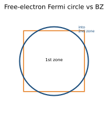
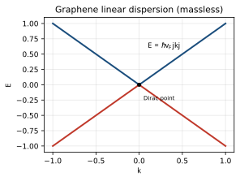
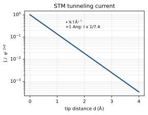

<!-- Kittel 章節導讀：第9章 費米面與金屬（Fermi Surfaces and Metals）＋實驗與進階 -->

# Kittel 第9章 對照導讀 — 費米面與金屬（Fermi Surfaces and Metals）＋實驗與進階

> **這頁是什麼**：讀 Kittel 這一章時的對照地圖——概念橋（高中→大學普物→固態）＋術語速查。完整課文見 [Kittel 翻譯本對應章節](../Kittel_翻譯.html)；想看完整推導與考題，見 [單元教學 unit10 實驗與進階](../../單元教學/unit10_實驗與進階.html)。
>
> **章次提醒**：本章是 Kittel「第 9 章 費米面與金屬」（chapter 9: fermi surfaces and metals）。本檔依排版命名 `ch10`，並順帶帶到 unit10 的「實驗量測／Dirac·graphene」等跨章進階主題，別被檔名混淆。
>
> **符號慣例（對齊本章）**：費米面（Fermi surface）是 $\mathbf k$ 空間中能量等於費米能 $\varepsilon_F$ 的等能面；波向量 $\mathbf k$、倒格點向量 $\mathbf G$、平移向量 $\mathbf T$；費米波數 $k_F$、費米速度 $v_F$；緊束縛重疊積分 $\gamma$、有效質量 $m^*$；迴旋頻率 $\omega_c=eB/m^*c$；dHvA 週期 $\Delta(1/B)$、極值面積 $S$。

## 🗺️ 這一章在講什麼（3–6 句白話）

金屬最深刻的定義是「**有費米面的固體**」——它是 $\mathbf k$ 空間中分隔「被佔據」與「未被佔據」軌域的那張面，金屬的電性全由它的形狀與體積決定。這章先教三種畫布里淵區的方式（延拓／簡約／週期區），把自由電子的球形費米面折回第一區、再在週期區看清連通性（Harrison 構造法）；接著用近自由電子修正（區邊界開能隙、面垂直交界、尖角磨圓）得到真實金屬的費米面，並分出電子型/電洞型/開放軌道。第二大塊是「怎麼算能帶」：緊束縛法（原子軌域線性組合，能帶寬度正比於重疊）、Wigner–Seitz 法（解釋鹼金屬凝聚能）、與偽勢法（核內真實強勢可換成幾乎為零的有效弱勢）。最後一大塊是「怎麼量費米面」：磁場把軌道量子化成朗道能級，磁性質隨 $1/B$ 週期振盪——這就是 de Haas–van Alphen（dHvA）效應，量出極值面積 $S$ 就能重建費米面（書中以金、銅為例）。

## 🌉 概念三層對應表（高中 → 大學普物 → 本章固態物理）

| 高中你學過的 | 大學普物的版本 | 本章固態物理變成 |
|---|---|---|
| 座標平面把點分類 | 波向量空間 $\mathbf k$、波 $\psi\propto e^{i\mathbf k\cdot\mathbf r}$ | **費米面**：$\mathbf k$ 空間中 $\varepsilon(\mathbf k)=\varepsilon_F$ 的面，分開填滿與空態 |
| 週期性磁磚可平移重複 | 倒晶格、布里淵區 | **三種區方案**：把區外的 $\mathbf k$ 用 $\mathbf G$ 平移回第一區（簡約區），或週期重複（週期區） |
| 兩個彈簧耦合，頻率分裂 | 微擾、能階分裂 | **緊束縛能帶**：$N$ 個原子的一個原子能階分裂成 $N$ 個態，能帶寬 $\propto$ 重疊 $\gamma$ |
| 圓周運動 $mv^2/r=evB$ | 帶電粒子在磁場中繞圈、迴旋頻率 | 電子沿費米面等能線繞行；**電子型/電洞型/開放軌道**三類 |
| 角動量取 $\hbar$ 整數倍 | Bohr–Sommerfeld 量子化 | **朗道能級**：磁場中軌道面積量子化，等間隔出現在 $1/B$ |
| $E=p^2/2m$、有效斜率＝難不難推動 | 色散關係 $\varepsilon(\mathbf k)$、有效質量 | **有效質量** $m^*=\hbar^2/(\partial^2\varepsilon/\partial k^2)$，能帶越窄 $m^*$ 越大 |
| 指數函數掉得很快 | 量子穿隧 $I\propto e^{-2\kappa z}$ | **STM**（進階）：探針靠穿隧電流逐點掃出原子級表面圖 |
| 光子無質量、$E=pc$ | 線性色散 | **石墨烯 Dirac 點**（進階）：$E\propto k$ ⇒ 有效質量為零的「像光」電子 |

## 🔑 專有名詞 × 範例（速查）

<b>▸ 費米面（Fermi surface）</b>

**白話**：$\mathbf k$ 空間裡「填到這就滿了」的那張面，金屬的電性都看它。
**高中接點**：座標平面上一條把「裡面/外面」分開的界線。
**定義**：$\varepsilon(\mathbf k)=\varepsilon_F$ 的等能面；$0\,$K 時分隔已佔據與未佔據軌域。
**範例**：fcc 單價金屬（Cu）電子濃度 $n=4/a^3$，自由電子 $k_F$ 對應直徑 $9.80/a$，略小於六角面間距 $10.88/a$，故銅費米面伸出八個「頸」碰到區邊界。
**在 Kittel 哪裡**：開章定義、圖 1、「銅的費米面」節、圖 29。

<b>▸ 簡約區方案（reduced zone scheme）</b>

**白話**：把區外所有 $\mathbf k$ 都用倒格點向量搬回第一區來畫。
**高中接點**：週期磁磚——任一格都能平移成同一塊。
**定義**：總能找到 $\mathbf G$ 使 $\mathbf k'=\mathbf k+\mathbf G$ 落在第一區；同一 $\mathbf k$ 的不同能量＝不同能帶 $n$。
**範例**：方格晶格第二區四片三角形各用不同 $\mathbf G$ 平移，拼回第一區後費米面片段連起來（圖 7、8）。
**在 Kittel 哪裡**：「簡約區方案」「週期區域方案」節、圖 3、4。

<b>▸ 週期區方案（periodic zone scheme）</b>

**白話**：把第一區一直複製貼滿整個 $\mathbf k$ 空間，看清費米面到底連不連。
**高中接點**：把同一塊磁磚無限拼貼。
**定義**：能量是 $\mathbf k$ 的週期函數 $\varepsilon_{\mathbf k+\mathbf G}=\varepsilon_{\mathbf k}$。
**範例**：方格第三區在週期區裡長成「一朵朵花」的格子（圖 9）；連通性一目了然。
**在 Kittel 哪裡**：「週期區域方案」節、圖 4c、9。

<b>▸ 近自由電子費米面（nearly free electron）＋ Harrison 構造</b>

**白話**：先畫自由電子球，再用四條手繪規則修正成真實金屬的費米面。
**高中接點**：先畫理想圓，再按條件修圓角。
**定義**：四事實——區邊界開能隙、費米面常垂直交區邊、晶格把尖角磨圓、包圍體積只看電子濃度。Harrison 法：每個倒格點畫自由電子球，落在 $m$ 個球內＝第 $m$ 帶被佔據。
**範例**：二價 Be、Mg 各兩個價電子，費米面體積正好一個布里淵區，但因是球形會溢進第二區。
**在 Kittel 哪裡**：「近自由電子」節、圖 10、11。

<b>▸ 電子軌道／電洞軌道／開放軌道（electron / hole / open orbits）</b>

**白話**：電子在磁場中沿費米面繞——繞填滿態是電子型、繞空態是電洞型、繞不回來是開放型。
**高中接點**：帶電粒子在磁場中繞圈（正負電荷繞向相反）。
**定義**：環繞已填滿態＝電子軌道；環繞空態＝電洞軌道（行為像 $+e$）；跨區不閉合＝開放軌道（影響磁阻）。
**範例**：銅/金的「狗骨」軌道是電洞型（能量往軌道內部增加，圖 30）。
**在 Kittel 哪裡**：「電子軌道、空穴軌道與開放軌道」節、圖 12–15。

<b>▸ 緊束縛法（tight-binding / LCAO）與有效質量 $m^*$</b>

**白話**：用原子軌域疊出晶體波函數；原子靠得越近、重疊越多、能帶越寬。
**高中接點**：兩個彈簧耦合，本來一個頻率分裂成兩個。
**定義**：$N$ 個原子 → 每個原子能階分裂成 $N$ 個態；sc 結構 $\varepsilon_{\mathbf k}=\varepsilon_s-\alpha-2\gamma(\cos k_xa+\cos k_ya+\cos k_za)$，能帶寬 $12\gamma$；$m^*=\hbar^2/2\gamma a^2$。
**範例**：重疊 $\gamma$ 越小，能帶越窄、$m^*$ 越大（內層 d 電子就是窄帶大 $m^*$）。
**在 Kittel 哪裡**：「能帶的緊束縛方法」節、圖 16、17。

<b>▸ Wigner–Seitz 法與凝聚能（cohesive energy）</b>

**白話**：把晶胞當小球解 $\mathbf k=0$ 波函數，解釋鹼金屬為何比自由原子穩定。
**高中接點**：邊界條件改變→能量改變（像箱中粒子換邊界）。
**定義**：邊界條件由 $\psi\to0$（自由原子）改成 $d\psi/dr=0$（相鄰原子中點），曲率變小→動能變低→能量下降。
**範例**：鈉 $\mathbf k=0$ 軌域從自由原子 $-5.15\,$eV 降到 $-8.2\,$eV；平均電子能 $-6.3\,$eV，凝聚能 $\approx1.1\,$eV，與實驗 $1.13\,$eV 吻合。
**在 Kittel 哪裡**：「Wigner–Seitz 方法」「凝聚能」節、圖 19–21。

<b>▸ 偽勢法（pseudopotential）</b>

**白話**：核內真實的強位能可換成「幾乎為零」的有效弱勢，外圍波函數照樣對。
**高中接點**：只要外面結果一樣，裡面怎麼換無所謂（散射相移相同即可）。
**定義**：核內節點來自與核心軌域正交的要求；抵消後有效偽勢近乎零（cancellation theorem）。空心核模型 ECM：$r<R_e$ 內設勢為零。
**範例**：鈉 $r=0.15a_0$ 處真實離子勢 $\approx-50.4$（Ry 單位），偽勢比它弱 200 倍以上（圖 22a）。
**在 Kittel 哪裡**：「偽勢法」節、圖 22a、22b。

<b>▸ 朗道能級（Landau level）與軌道量子化</b>

**白話**：磁場把電子軌道「量子化」成一圈圈能級，磁場越強圈越疏。
**高中接點**：圓周運動 + 角動量量子化（波耳模型精神）。
**定義**：Bohr–Sommerfeld 給 $\mathbf k$ 空間軌道面積 $S_n=(n+\gamma)2\pi eB/\hbar c$；每能級簡併度 $D=eL^2B/2\pi\hbar c$，能量 $E_n=(n-\tfrac12)\hbar\omega_c$。
**範例**：磁場增強時最高填滿能級量子數一格一格往下掉（圖 25）；總能量隨 $1/B$ 振盪（圖 26）。
**在 Kittel 哪裡**：「磁場中軌道的量子化」節、圖 23–27；亦見 unit10 §7。

<b>▸ de Haas–van Alphen 效應（dHvA）與極值軌道</b>

**白話**：低溫強磁場下，金屬磁矩隨 $1/B$ 週期振盪；量週期就反推費米面。
**高中接點**：週期現象——等間隔重複（這裡橫軸是 $1/B$ 不是 $B$）。
**定義**：$\Delta(1/B)=\dfrac{2\pi e}{\hbar c\,S}$，$S$ 為垂直 $\mathbf B$ 的費米面**極值面積**（週期駐定的軌道才主導，相位相消濾掉其餘）。
**範例**：金的腹部軌道週期 $2\times10^{-9}\,$G$^{-1}$ ⇒ $S\approx4.8\times10^{16}\,$cm$^{-2}$，與自由電子球 $4.5\times10^{16}\,$cm$^{-2}$ 大致相符；另有「頸」與「狗骨」軌道。
**在 Kittel 哪裡**：「de Haas–van Alphen 效應」「極值軌道」「金的費米面」節、圖 28–31。

<b>▸ 磁性崩潰（magnetic breakdown）</b>

**白話**：磁場夠強時電子直接走自由粒子大圈軌道，把能帶分類給跳過去。
**高中接點**：外力夠大時「規則」失效（晶格勢退居微擾）。
**定義**：條件 $\hbar\omega_c\,\varepsilon_F\gtrsim E_g^2$，比「磁分裂超過能隙」寬鬆得多，小能隙金屬尤其易發生。
**範例**：鎵中六角面自旋-軌道分裂 $\sim10^{-3}\,$eV、$\varepsilon_F\sim10\,$eV，崩潰約在 $B\sim1000\,$G。
**在 Kittel 哪裡**：「磁性崩解」節、圖 33。

<b>▸（進階）石墨烯 Dirac 點（graphene Dirac point）</b>

**白話**：石墨烯在某些點能帶呈線性、電子「像光子」一樣無有效質量。
**高中接點**：光子 $E=pc$，能量正比動量（線性）。
**定義**：Dirac 點附近 $E=\hbar v_F|\mathbf k|$（線性色散）⇒ 有效質量為零。
**範例**：unit10 §4，2018 年考過——線性色散 ⇒ massless（接費米面/能帶概念）。
**在 Kittel 哪裡**：Kittel 本章未專論；屬跨章/進階，見 [unit10 §4](../../單元教學/unit10_實驗與進階.html)。

## ⚠️ 讀這章常卡的點 ＋ 翻譯雷區

- **三種區方案別搞混**：延拓區（extended，不同帶畫在不同區）、簡約區（reduced，全擠回第一區）、週期區（periodic，週期重複）。判斷「能帶」用簡約區最清楚，判斷「連通性」用週期區最清楚（圖 4）。
- **dHvA 週期對 $1/B$ 不是對 $B$**：振盪等間隔出現在 $1/B$ 軸上，$\Delta(1/B)\propto1/S$。考試最常錯把橫軸當成 $B$。
- **$S$ 是「極值面積」不是「整個費米面」**：響應由週期駐定（極值）的軌道主導，靠相位相消濾掉其餘截面——這就是為什麼即使費米面很複雜也能量到尖銳訊號。
- **電洞軌道的「正電荷」是表象**：電洞型軌道中電子在磁場裡「繞向像帶 $+e$」，是因為它環繞的是空態、能量往內增加；別誤以為真有正電粒子（呼應第 8 章電洞處理）。
- **緊束縛：能帶寬 $\propto$ 重疊，不是 $\propto$ 原子數**：$N$ 個原子給 $N$ 個態（決定態密度），但能帶**寬度**由最近鄰重疊積分 $\gamma$ 決定。重疊小 → 窄帶 → 大 $m^*$。
- **翻譯亂碼與排版雷區**：本章公式幾乎全被轉成 `==> picture ... omitted <==`，正文夾雜 `�` 與英文殘句（如 6209、6225、6315 行的中英混排）。緊束縛 fcc 公式（式 15）、量子化 $S_n$、dHvA $\Delta(1/B)$ 等關鍵式都被圖片吞掉，**凡公式請對照 [Kittel 原文](../Kittel_原文.html)**。另注意中文人譯名偶有不一致（「布里淵/布里渦/布里渦」「德哈斯/德豪斯」「邁斯納/梅斯納」皆指同一詞）。

## 📝 實際範例（Worked Examples）

> 以下例題用 SI 單位、CODATA 常數：$\hbar=1.055\times10^{-34}\,\mathrm{J\cdot s}$、$e=1.602\times10^{-19}\,\mathrm{C}$。長度換算 $1\,\mathrm{\AA}=10^{-10}\,\mathrm{m}$，能量換算 $1\,\mathrm{eV}=1.602\times10^{-19}\,\mathrm{J}$。

### 例題 1：STM 穿隧電流（tunneling current）對距離的指數靈敏度

**題目**：掃描穿隧顯微鏡（scanning tunneling microscope, STM）的穿隧電流 $I\propto e^{-2\kappa d}$，其中 $d$ 是探針與表面的間距、衰減常數 $\kappa\approx1.0\,\mathrm{\AA^{-1}}$。若把間距增加 $\Delta d=1\,\mathrm{\AA}$，問電流降為原來的百分之幾？

**Step 1**：寫出前後電流比。設原間距 $d_0$，新間距 $d_0+\Delta d$，則
$$\frac{I(d_0+\Delta d)}{I(d_0)}=\frac{e^{-2\kappa(d_0+\Delta d)}}{e^{-2\kappa d_0}}=e^{-2\kappa\,\Delta d}.$$

**Step 2**：代入 $\kappa=1.0\,\mathrm{\AA^{-1}}$、$\Delta d=1\,\mathrm{\AA}$（單位 $\mathrm{\AA^{-1}}\times\mathrm{\AA}$ 相消，指數無因次）
$$2\kappa\,\Delta d=2\times1.0\times1=2,\qquad \frac{I}{I_0}=e^{-2}.$$

**Step 3**：算數值 $e^{-2}=0.135$。

$$\boxed{\frac{I}{I_0}=e^{-2}\approx0.135=13.5\%}$$
（換言之，探針只升高一個原子尺度 $1\,\mathrm{\AA}$，電流就掉到約 1/7——這正是 STM 能達原子級垂直解析度的原因。）

### 例題 2：石墨烯（graphene）線性色散下的電子能量

**題目**：石墨烯在 Dirac 點附近能量隨波數線性變化 $E=\hbar v_F|k|$（線性色散，linear dispersion），費米速度（Fermi velocity）$v_F\approx1\times10^6\,\mathrm{m/s}$。求 $k=0.1\,\mathrm{\AA^{-1}}$ 對應的能量（以 J 與 eV 表示）。

**Step 1**：把波數換成 SI 單位。$k=0.1\,\mathrm{\AA^{-1}}=0.1\times10^{10}\,\mathrm{m^{-1}}=1\times10^{9}\,\mathrm{m^{-1}}$。

**Step 2**：代入 $E=\hbar v_F k$
$$E=(1.055\times10^{-34}\,\mathrm{J\cdot s})\times(1\times10^{6}\,\mathrm{m/s})\times(1\times10^{9}\,\mathrm{m^{-1}}).$$

**Step 3**：逐步乘指數 $(-34)+6+9=-19$、係數 $1.055\times1\times1=1.055$
$$E=1.055\times10^{-19}\,\mathrm{J}.$$

**Step 4**：換成 eV（除以 $1.602\times10^{-19}\,\mathrm{J/eV}$）
$$E=\frac{1.055\times10^{-19}}{1.602\times10^{-19}}\,\mathrm{eV}=0.659\,\mathrm{eV}.$$

$$\boxed{E=\hbar v_F k\approx1.06\times10^{-19}\,\mathrm{J}\approx0.66\,\mathrm{eV}}$$

### 例題 3：de Haas–van Alphen 週期與費米面截面（Fermi surface cross-section）

**題目**：de Haas–van Alphen（dHvA）效應的振盪在 $1/B$ 軸上等間隔出現，週期 $\Delta(1/B)=\dfrac{2\pi e}{\hbar A}$（SI），其中 $A$ 是垂直磁場 $\mathbf B$ 的費米面極值截面積。取一個自由電子型費米面 $k_F\approx1\times10^{10}\,\mathrm{m^{-1}}$，估 $A$ 與 dHvA 週期的數量級。

**Step 1**：截面取圓 $A=\pi k_F^2=\pi(1\times10^{10})^2\,\mathrm{m^{-2}}=3.14\times10^{20}\,\mathrm{m^{-2}}$（量級 $\sim10^{20}\,\mathrm{m^{-2}}$）。

**Step 2**：算分子 $2\pi e=2\pi\times1.602\times10^{-19}=1.006\times10^{-18}\,\mathrm{C}$。

**Step 3**：算分母 $\hbar A=(1.055\times10^{-34})(3.14\times10^{20})=3.31\times10^{-14}\,\mathrm{J\cdot s\cdot m^{-2}}$。

**Step 4**：相除
$$\Delta(1/B)=\frac{1.006\times10^{-18}}{3.31\times10^{-14}}\,\mathrm{T^{-1}}=3.0\times10^{-5}\,\mathrm{T^{-1}}.$$

**Step 5**：解讀數量級。週期 $\sim10^{-5}\,\mathrm{T^{-1}}$ 表示要掃過約 $\Delta B\sim B^2\,\Delta(1/B)$ 才看到一個振盪：在 $B\sim10\,\mathrm{T}$ 時 $\Delta B\sim10^2\times3\times10^{-5}=3\times10^{-3}\,\mathrm{T}$，即每變化幾 mT 就一個振盪——所以 dHvA 需要強磁場、低溫、純樣品。週期越小代表 $A$（費米面）越大，量到 $\Delta(1/B)$ 就能反推 $A$。

$$\boxed{A\sim3\times10^{20}\,\mathrm{m^{-2}}\ \Rightarrow\ \Delta\!\left(\tfrac1B\right)=\frac{2\pi e}{\hbar A}\sim3\times10^{-5}\,\mathrm{T^{-1}},\qquad \Delta(1/B)\propto\frac1A}$$

## 🔗 延伸

- 完整課文：[Kittel 翻譯本](../Kittel_翻譯.html)（搜尋「費米面與金屬」或「de Haas」即可定位本章）
- 深入推導＋考題（含實驗量測、STM、石墨烯、朗道能階）：[單元教學 unit10 實驗與進階](../../單元教學/unit10_實驗與進階.html)
- 練歷年題：[逐題詳解](../../考古題/詳解/index.html)
