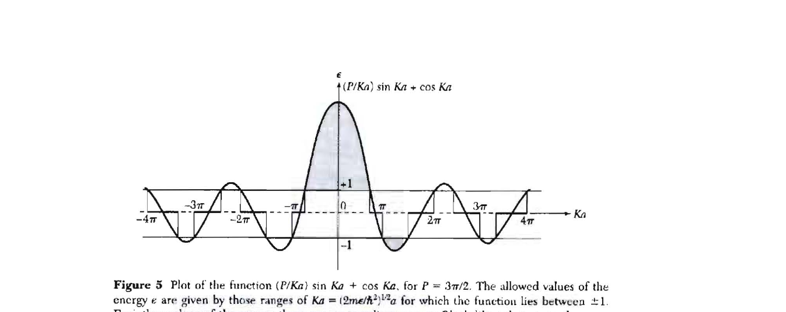

<!-- source: 歷年原卷/固態物理導論_2014.md -->

# 固態物理導論 2014 資格考 — 教學版逐題詳解（硬年份 · 代數不跳步）

> **這份是「硬年份」校準**：2014 共 **11 小題 / 120 分**，重頭戲是 **Q8（30 分）的完整輸運鏈**——Ohm's law → mobility → 熱導 $K=\tfrac13Cvl$ → 電子熱導 → **Wiedemann–Franz / Lorentz number** → thermoelectric（thermopower / Peltier / Kelvin 關係）。另含 **結構因子四晶格消光表（Q2）、bcc 原胞為菱面體（Q3e）、Lennard–Jones（Q6）、低溫比熱 $C/T=\gamma+AT^2$（Q7）、Bloch 定理證明（Q9）、Kronig–Penney（Q11）**——全是能展開成長推導的料。
> 寫法同 QFT tutorials：每題 `📋原題 → 🎯核心訊息 →（推導重題才有）📚前情提要 / 🔍符號說明 → 解答 Step（不跳代數，$\boxed{}$ 收尾，`> 小結`）→ ✅自我檢核 → 🔀變化 → 信心`。共用觀念見 [`_共用觀念與公式.html`](_共用觀念與公式.html)。

## 🧭 全卷約定
- cubic 慣用立方邊 $a$；倒晶格 $\mathbf a_i\cdot\mathbf b_j=2\pi\delta_{ij}$；自由電子 $E=\hbar^2k^2/2m$，含自旋簡併 2。
- Drude/Sommerfeld 符號：$n=$ 電子數密度、$\tau=$ 碰撞（弛豫）時間、$m=$ 電子質量、$v_F,\ E_F=k_BT_F$。
- 配分：**1(10)·2(10)·3(15)·4(2)·5(3)·6(10)·7(15)·8(30)·9(10)·10(5)·11(10) ＝ 120**。閉書，符號依 Kittel。

---

# 📘 第 1 題 — Bragg 與 von Laue 繞射的等價（10 pts）

## 📋 原題
> What are Bragg and von Laue formulations of x-ray diffraction by a crystal? Demonstrate the equivalence of the two formulations.

## 🎯 核心訊息
> 兩種說法描述**同一件事**：Bragg 把晶體看成一疊鏡面、要求路徑差為整數波長；von Laue 直接要求動量轉移 $\Delta\mathbf k$ 等於倒晶格向量 $\mathbf G$。把 $|\mathbf G|=2\pi n/d$ 與 $|\Delta\mathbf k|=2k\sin\theta$ 對上，立刻回到 $2d\sin\theta=n\lambda$。

## 解答

### (1) Bragg 表述
把晶體看成一族間距 $d$ 的平行原子面，X 光對每個面做鏡面反射。相鄰兩面反射的**路徑差** $=2d\sin\theta$（$\theta$ 為掠射角，量自晶面）。建設性干涉要求
$$\boxed{2d\sin\theta=n\lambda,\quad n\in\mathbb Z^+.}$$

### (2) von Laue 表述
彈性散射 $|\mathbf k'|=|\mathbf k|=2\pi/\lambda$。把每個晶格點當散射源，所有散射波建設性疊加的條件是**動量轉移等於倒晶格向量**：
$$\boxed{\Delta\mathbf k=\mathbf k'-\mathbf k=\mathbf G,\qquad \mathbf G=h\mathbf b_1+k\mathbf b_2+l\mathbf b_3.}$$

### (3) 證兩者等價
**Step 1 — 把 $|\Delta\mathbf k|$ 用角度寫出。** 彈性散射且入射、出射夾角為 $2\theta$（散射角）：
$$|\Delta\mathbf k|=2k\sin\theta=\frac{4\pi}{\lambda}\sin\theta.$$
**Step 2 — 把 $|\mathbf G|$ 用面間距寫出。** 平面 $(hkl)$ 的法向就是 $\mathbf G$，最短的 $\mathbf G$ 對應面間距 $d=2\pi/|\mathbf G|$；第 $n$ 階用 $\mathbf G_n=n\mathbf G_{\min}$：
$$|\mathbf G_n|=\frac{2\pi n}{d}.$$
**Step 3 — von Laue $\Rightarrow$ Bragg。** 要 $\Delta\mathbf k=\mathbf G$，先要長度相等 $|\Delta\mathbf k|=|\mathbf G_n|$：
$$\frac{4\pi}{\lambda}\sin\theta=\frac{2\pi n}{d}\ \Longrightarrow\ 2d\sin\theta=n\lambda.\ \blacksquare$$
> **小結**：方向相等（$\Delta\mathbf k\parallel\mathbf G\perp$ 晶面）↔ Bragg 的「鏡面反射幾何」；長度相等 ↔ Bragg 的 $2d\sin\theta=n\lambda$。同一條件的兩種語言。

## ✅ 自我檢核
$\sin\theta=\dfrac{n\lambda}{2d}\le1\Rightarrow\lambda\le2d/n$：波長太長就繞不出（與 $|\mathbf G|\le2k$ 同義）✓。

## 🔀 變化的可能情況
- 常追問「為什麼用 X 光不用可見光」：需 $\lambda\lesssim$ 原子間距（Å 級）→ X 光。
- 換成 Ewald 球作圖版（2021 給 $\lambda$ 算角）。

## 信心：**高**（標準等價證明，Kittel Ch2）。

---

# 📗 第 2 題 — 結構因子與消光（簡單立方 / bcc / fcc / diamond）（10 pts）

## 📋 原題
> (a) What is the structure factor? Calculate it for (b) simple cubic, (c) bcc, (d) fcc, (e) diamond. Tabulate the reflections possibly present in these lattices.

## 🎯 核心訊息
> **倒晶格決定峰位置、結構因子決定峰強度**。$S_{\mathbf G}=\sum_j f_j e^{-i2\pi(hx_j+ky_j+lz_j)}$ 對 basis 內各原子做相位和；某些 $(hkl)$ 相位剛好相消 → $S=0$ → 該反射**消光**。四個晶格差在 basis 不同。

## 🔍 符號說明

<b>▸ 結構因子 $S_{\mathbf G}$ 與原子位置相位和</b>

### 你普物學過的
多狹縫干涉：每條縫的貢獻帶一個相位 $e^{i\phi_j}$，加總後某些方向相消。

### 為什麼要這個
晶體繞射峰只在 $\Delta\mathbf k=\mathbf G$ 出現，但「**出現的峰夠不夠強**」由一個原胞內所有原子的相位和決定。

### 定義
$$S_{\mathbf G}=\sum_{j\in\text{basis}} f_j\,e^{-i\mathbf G\cdot\mathbf r_j}=\sum_j f_j\,e^{-i2\pi(hx_j+ky_j+lz_j)},$$
其中 $\mathbf r_j=(x_j,y_j,z_j)$ 為分數座標，$f_j$ 為原子散射因子。強度 $\propto|S_{\mathbf G}|^2$。

**範例 1（熱身）**：basis 只有 $(0,0,0)$ → $S=f$，所有 $(hkl)$ 都在（簡單立方）。
**範例 2（中階）**：basis $(0,0,0),(\tfrac12,\tfrac12,\tfrac12)$ → $S=f[1+(-1)^{h+k+l}]$（bcc）。
**範例 3（本題）**：diamond ＝ fcc 再加 $(\tfrac14\tfrac14\tfrac14)$，多一個 $[1+e^{-i\pi(h+k+l)/2}]$ 因子 → (200)、(222) 消光。

## 解答

### (a) 結構因子定義
一個原胞對 $\mathbf G=(hkl)$ 反射的散射振幅 $=S_{\mathbf G}=\sum_j f_j e^{-i2\pi(hx_j+ky_j+lz_j)}$。峰強 $\propto|S_{\mathbf G}|^2$；$S=0$ 即消光。

### (b) 簡單立方（basis：$(0,0,0)$）
$$S=f\ \Rightarrow\ \boxed{\text{所有 }(hkl)\text{ 都出現。}}$$

### (c) bcc（basis：$(000),(\tfrac12\tfrac12\tfrac12)$）
$$S=f\big[1+e^{-i\pi(h+k+l)}\big]=f\big[1+(-1)^{h+k+l}\big]=\boxed{\begin{cases}2f,& h{+}k{+}l\ \text{偶}\\[2pt]0,& h{+}k{+}l\ \text{奇}\end{cases}}$$

### (d) fcc（basis：$(000),(\tfrac12\tfrac120),(\tfrac120\tfrac12),(0\tfrac12\tfrac12)$）
$$S=f\big[1+e^{-i\pi(h+k)}+e^{-i\pi(h+l)}+e^{-i\pi(k+l)}\big]=\boxed{\begin{cases}4f,& h,k,l\ \text{全奇 或 全偶}\\[2pt]0,& \text{奇偶混合}\end{cases}}$$

### (e) diamond（fcc ＋ 額外 $(\tfrac14\tfrac14\tfrac14)$）
$$S=S_{\text{fcc}}\cdot\Big[1+e^{-i\frac{\pi}{2}(h+k+l)}\Big].$$
在 fcc 允許（全奇／全偶）之上再加判據：
- **全奇**（$h{+}k{+}l$ 奇）：$|1+e^{-i\pi\cdot\text{奇}/2}|=|1\mp i|=\sqrt2\ne0$ → **出現**。
- **全偶**：$h{+}k{+}l\equiv0\ (\mathrm{mod}\,4)$ → 因子 $=2$ → 出現；$h{+}k{+}l\equiv2\ (\mathrm{mod}\,4)$ → 因子 $=0$ → **消光**（如 (200)、(222)）。

### 反射出現表
| $(hkl)$ | sc | bcc | fcc | diamond |
|---|:--:|:--:|:--:|:--:|
| 100 | ✓ | — | — | — |
| 110 | ✓ | ✓ | — | — |
| 111 | ✓ | — | ✓ | ✓ |
| 200 | ✓ | ✓ | ✓ | **—**（$2\!\!\mod4$）|
| 210 | ✓ | — | — | — |
| 211 | ✓ | ✓ | — | — |
| 220 | ✓ | ✓ | ✓ | ✓ |
| 311 | ✓ | — | ✓ | ✓ |
| 222 | ✓ | ✓ | ✓ | **—** |
| 400 | ✓ | ✓ | ✓ | ✓ |

> **小結**：sc 全收；bcc 留 $h{+}k{+}l$ 偶；fcc 留全奇/全偶；diamond 在 fcc 之上再砍掉 $h{+}k{+}l\equiv2\,(\mathrm{mod}\,4)$。

<figure style="margin:1.3em 0;text-align:center">
<svg viewBox="0 0 640 230" width="100%" style="max-width:660px;border:1px solid #ddd;border-radius:8px;background:#fff;padding:6px;box-sizing:border-box" xmlns="http://www.w3.org/2000/svg">
<g font-family="-apple-system,sans-serif" font-size="11.5">
<text x="320" y="20" text-anchor="middle" font-size="13.5" font-weight="bold" fill="#1a4d7c">basis 相位和 → 某些 (hkl) 相消（消光）</text>
<text x="95" y="46" text-anchor="middle" font-size="12.5" font-weight="bold" fill="#1a4d7c">bcc：h+k+l 偶 → 同相加成</text>
<line x1="40" y1="120" x2="180" y2="120" stroke="#bbb" stroke-width="1"/>
<line x1="40" y1="120" x2="160" y2="120" stroke="#1a4d7c" stroke-width="2.4"/>
<polygon points="160,114 174,120 160,126" fill="#1a4d7c"/>
<line x1="40" y1="120" x2="160" y2="120" stroke="#c0392b" stroke-width="2.4" stroke-dasharray="4 3"/>
<text x="110" y="142" text-anchor="middle" fill="#2e8b2e">f + f = 2f（同相）</text>
<text x="110" y="158" text-anchor="middle" fill="#555">(000) 與 (½½½) 相位差 = 偶π</text>
<text x="350" y="46" text-anchor="middle" font-size="12.5" font-weight="bold" fill="#c0392b">bcc：h+k+l 奇 → 反相相消</text>
<line x1="250" y1="120" x2="430" y2="120" stroke="#bbb" stroke-width="1"/>
<line x1="250" y1="120" x2="410" y2="120" stroke="#1a4d7c" stroke-width="2.4"/>
<polygon points="410,114 424,120 410,126" fill="#1a4d7c"/>
<line x1="410" y1="120" x2="250" y2="120" stroke="#c0392b" stroke-width="2.4" stroke-dasharray="4 3"/>
<polygon points="264,114 250,120 264,126" fill="#c0392b"/>
<text x="340" y="142" text-anchor="middle" fill="#c0392b">f + (−f) = 0（反相）</text>
<text x="340" y="158" text-anchor="middle" fill="#555">相位差 = 奇π → 消光</text>
<text x="540" y="46" text-anchor="middle" font-size="12.5" font-weight="bold" fill="#2e8b2e">|S| 大小</text>
<line x1="475" y1="200" x2="610" y2="200" stroke="#888" stroke-width="1.2"/>
<line x1="490" y1="200" x2="490" y2="70" stroke="#888" stroke-width="1.2"/>
<rect x="500" y="80" width="22" height="120" fill="#1a4d7c"/>
<text x="511" y="216" text-anchor="middle" fill="#555">2f 偶</text>
<rect x="540" y="200" width="22" height="0" fill="#c0392b" stroke="#c0392b"/>
<line x1="540" y1="200" x2="562" y2="200" stroke="#c0392b" stroke-width="3"/>
<text x="551" y="216" text-anchor="middle" fill="#555">0 奇</text>
</g>
</svg>
<figcaption style="font-size:0.86em;color:#555;margin-top:0.4em">圖 Q2：bcc 兩原子的散射波——h+k+l 偶時同相加成（2f）、奇時反相完全抵消（0，消光）。</figcaption>
</figure>

<b>📝 更多範例（點開）：結構因子逐項相位和算到底</b>

**範例 A（bcc 把 (111) 與 (200) 算到底）**：bcc basis $(0,0,0),(\tfrac12,\tfrac12,\tfrac12)$，$S=f\big[1+e^{-i\pi(h+k+l)}\big]$。

- $(111)$：$h+k+l=3$（奇）。$e^{-i\pi\cdot3}=e^{-3\pi i}=\cos3\pi-i\sin3\pi=-1-0=-1$。故 $S=f[1+(-1)]=0$ → **消光**。
- $(200)$：$h+k+l=2$（偶）。$e^{-i\pi\cdot2}=e^{-2\pi i}=\cos2\pi-i\sin2\pi=1$。故 $S=f[1+1]=2f$ → **出現**，強度 $\propto|2f|^2=4f^2$。

**範例 B（fcc 把四項一個一個加）**：fcc basis $(000),(\tfrac12\tfrac120),(\tfrac120\tfrac12),(0\tfrac12\tfrac12)$，

$$S=f\big[1+e^{-i\pi(h+k)}+e^{-i\pi(h+l)}+e^{-i\pi(k+l)}\big].$$

取 $(110)$（奇偶混合）：各指數 $h+k=2,\ h+l=1,\ k+l=1$。代入

$$S=f\big[1+e^{-i2\pi}+e^{-i\pi}+e^{-i\pi}\big]=f\big[1+1+(-1)+(-1)\big]=0\ \Rightarrow\ \text{消光}.$$

取 $(111)$（全奇）：$h+k=2,\ h+l=2,\ k+l=2$，三個指數都偶：

$$S=f\big[1+e^{-i2\pi}+e^{-i2\pi}+e^{-i2\pi}\big]=f[1+1+1+1]=4f\ \Rightarrow\ \text{出現}.$$

**範例 C（NaCl：兩種 $f$ 不完全相消）**：NaCl ＝ fcc 點陣，basis Na 在 $(000)$、Cl 在 $(\tfrac12\tfrac12\tfrac12)$，散射因子 $f_{\mathrm{Na}}\ne f_{\mathrm{Cl}}$。連同 fcc 的允許條件，

$$S=\big[f_{\mathrm{Na}}+f_{\mathrm{Cl}}e^{-i\pi(h+k+l)}\big]\times\underbrace{\big[1+e^{-i\pi(h+k)}+e^{-i\pi(h+l)}+e^{-i\pi(k+l)}\big]}_{\text{fcc 因子}}.$$

在 fcc 允許峰（全奇／全偶）裡，第二因子 $=4$。第一因子：

- 全偶（如 200）：$h+k+l$ 偶 → $e^{-i\pi(h+k+l)}=+1$ → $S=4(f_{\mathrm{Na}}+f_{\mathrm{Cl}})$（**強峰**）。
- 全奇（如 111）：$h+k+l$ 奇 → $e^{-i\pi(h+k+l)}=-1$ → $S=4(f_{\mathrm{Na}}-f_{\mathrm{Cl}})$（**弱峰**，因兩者相近但不等）。

所以 NaCl 不像單原子 fcc 那樣全奇峰與全偶峰一樣強，而是被 $f_{\mathrm{Na}}\pm f_{\mathrm{Cl}}$ 調制——這正是用繞射分辨「離子晶體」的依據。

## ✅ 自我檢核
bcc (100) 消、(110) 在 ✓；fcc (100)(110) 消、(111)(200) 在 ✓；diamond (200) 消但 (220) 在 ✓（皆與實驗一致）。

## 🔀 變化的可能情況
常單獨問「哪些峰消失」「為何 diamond (200) 不見」；或換 NaCl（兩種 $f$ 不全消，只調制強度）。

## 信心：**高**（Kittel Ch2 標準題）。

---

# 📙 第 3 題 — Bravais 晶格、bcc 原胞、fcc 性質（15 pts）

## 📋 原題
> (a) What is a Bravais lattice? (b) 2D distinctive lattice types（畫）。(c) 3D distinctive lattice types（畫）。(d) primitive cell？(e) bcc 的原胞是哪一種 Bravais lattice？算角度與晶格常數。(f) fcc 的：慣用胞體積、慣用胞格點數、原胞體積、原胞格點數、最近鄰數、最近鄰距離、堆積率。(g) 證 cubic 中 $[hkl]\perp(hkl)$ 並求面間距。

## 🎯 核心訊息
> 一條主線：**Bravais（重複格點）→ primitive cell（含 1 格點的最小胞）→ 用 primitive vectors 算幾何量**。bcc 的原胞是個**菱面體（rhombohedral）**，夾角 $\arccos(-\tfrac13)=109.47^\circ$；fcc 的七個數字是默記的標準結果。

## 🔍 符號說明

<b>▸ primitive vectors → 用內積/外積讀幾何</b>

### 你學過的
向量內積給夾角（$\cos\theta=\frac{\mathbf u\cdot\mathbf v}{|\mathbf u||\mathbf v|}$），外積三重積給體積。

### 為什麼要這個
原胞的「邊長、夾角、體積、最近鄰」全是 primitive vectors 的內積/外積。

### 定義
- 菱面體（rhombohedron）：三邊等長 $a'$、三夾角相等 $\alpha$ 的原胞。
- 堆積率 $=\dfrac{(\text{胞內原子數})\times\frac43\pi r^3}{V_{\text{cell}}}$，$r=\tfrac12(\text{最近鄰距離})$。

**範例 1（熱身）**：簡單立方 $\mathbf a_i=a\hat e_i$，夾角 $90^\circ$、最近鄰 12→6、堆積率 $\pi/6\approx0.52$。
**範例 2（中階）**：bcc 原胞三向量 $|\mathbf a_i|=\tfrac{\sqrt3}{2}a$，兩兩內積 $-a^2/4$ → 夾角 $109.47^\circ$（本題 e）。
**範例 3（本題 f）**：fcc 最近鄰距離 $a/\sqrt2$、堆積率 $\pi/(3\sqrt2)\approx0.74$。

## 解答

### (a) Bravais lattice
所有 $\mathbf R=n_1\mathbf a_1+n_2\mathbf a_2+n_3\mathbf a_3\ (n_i\in\mathbb Z)$ 構成、且**從任一格點看出去環境都完全相同**的無限點陣。$\mathbf a_i$ 為 primitive vectors。

### (b) 2D：**5 種**
oblique（斜方）、square（正方）、rectangular（矩形）、centered rectangular（有心矩形）、hexagonal（六方）。

### (c) 3D：**14 種**（7 晶系 × 允許置心）
cubic（P, I, F）、tetragonal（P, I）、orthorhombic（P, C, I, F）、monoclinic（P, C）、triclinic（P）、trigonal/rhombohedral（R）、hexagonal（P）。共 14。

### (d) primitive cell
含**恰 1 個格點**的最小重複體積，$V=|\mathbf a_1\cdot(\mathbf a_2\times\mathbf a_3)|$；可平移鋪滿全空間、形狀可選（Wigner–Seitz 為對稱選法）。

### (e) bcc 的原胞 ＝ 菱面體（完整計算）
**Step 1 — primitive vectors（立方邊 $a$）。**
$$\mathbf a_1=\tfrac a2(\hat x+\hat y-\hat z),\quad \mathbf a_2=\tfrac a2(-\hat x+\hat y+\hat z),\quad \mathbf a_3=\tfrac a2(\hat x-\hat y+\hat z).$$
**Step 2 — 邊長。** $|\mathbf a_i|=\tfrac a2\sqrt{1+1+1}=\boxed{\tfrac{\sqrt3}{2}a}$（菱面體晶格常數）。
**Step 3 — 夾角。** 取 $\mathbf a_1\cdot\mathbf a_2=\tfrac{a^2}4[(1)(-1)+(1)(1)+(-1)(1)]=-\tfrac{a^2}4$，
$$\cos\alpha=\frac{\mathbf a_1\cdot\mathbf a_2}{|\mathbf a_1||\mathbf a_2|}=\frac{-a^2/4}{3a^2/4}=-\frac13\ \Rightarrow\ \boxed{\alpha=\arccos(-\tfrac13)\approx109.47^\circ.}$$
> **小結**：bcc 原胞是**三邊 $\tfrac{\sqrt3}2a$、三夾角 $109.47^\circ$ 的菱面體（rhombohedral）**，每胞 1 格點（慣用立方胞含 2 格點，故原胞體積 $a^3/2$）。

### (f) fcc 的七個數字
| 量 | 值 | 說明 |
|---|---|---|
| 慣用胞體積 | $a^3$ | |
| 慣用胞格點數 | $4$ | $8\times\tfrac18+6\times\tfrac12$ |
| 原胞體積 | $a^3/4$ | $4$ 格點均分 |
| 原胞格點數 | $1$ | 定義 |
| 最近鄰數 | $12$ | 面心配位 |
| 最近鄰距離 | $a/\sqrt2$ | 面對角線一半 $=\tfrac{\sqrt2}2a$ |
| 堆積率 | $\dfrac{\pi}{3\sqrt2}\approx0.74$ | 見下 |

**堆積率算式**：$r=\tfrac12\cdot\tfrac a{\sqrt2}=\tfrac{a}{2\sqrt2}$，
$$\text{PF}=\frac{4\cdot\frac43\pi r^3}{a^3}=\frac{\frac{16}{3}\pi\cdot\frac{a^3}{16\sqrt2}}{a^3}=\boxed{\frac{\pi}{3\sqrt2}=\frac{\pi\sqrt2}{6}\approx0.74.}$$

### (g) $[hkl]\perp(hkl)$（cubic）＋面間距
**Step 1.** 平面 $(hkl)$ 的法向 = 倒晶格向量 $\mathbf G=h\mathbf b_1+k\mathbf b_2+l\mathbf b_3$。cubic 時 $\mathbf b_i=\tfrac{2\pi}a\hat e_i$，故 $\mathbf G=\tfrac{2\pi}a(h\hat x+k\hat y+l\hat z)$。
**Step 2.** 方向 $[hkl]=h\hat x+k\hat y+l\hat z\parallel\mathbf G\perp$ 平面 ✓（**只在 cubic 成立**，因 $\mathbf b_i\parallel\mathbf a_i$）。
**Step 3.** 面間距 $d=\dfrac{2\pi}{|\mathbf G|}=\boxed{\dfrac{a}{\sqrt{h^2+k^2+l^2}}}$。

<figure style="margin:1.3em 0;text-align:center">
<svg viewBox="0 0 620 250" width="100%" style="max-width:660px;border:1px solid #ddd;border-radius:8px;background:#fff;padding:6px;box-sizing:border-box" xmlns="http://www.w3.org/2000/svg">
<g font-family="-apple-system,sans-serif" font-size="11.5">
<text x="310" y="20" text-anchor="middle" font-size="13.5" font-weight="bold" fill="#1a4d7c">bcc 原胞 = 菱面體（三邊等長、夾角 109.47°）</text>
<text x="150" y="44" text-anchor="middle" font-size="12" font-weight="bold" fill="#555">慣用立方（邊 a，2 格點）</text>
<polygon points="60,210 200,210 250,150 110,150" fill="#f4f8fc" stroke="#888" stroke-width="1.2"/>
<line x1="60" y1="210" x2="60" y2="100" stroke="#888" stroke-width="1.2"/>
<line x1="200" y1="210" x2="200" y2="100" stroke="#888" stroke-width="1.2"/>
<line x1="250" y1="150" x2="250" y2="40" stroke="#888" stroke-width="1.2"/>
<line x1="110" y1="150" x2="110" y2="40" stroke="#888" stroke-width="1.2"/>
<polygon points="60,100 200,100 250,40 110,40" fill="none" stroke="#888" stroke-width="1.2"/>
<g fill="#1a4d7c"><circle cx="60" cy="210" r="4.5"/><circle cx="200" cy="210" r="4.5"/><circle cx="250" cy="150" r="4.5"/><circle cx="110" cy="150" r="4.5"/><circle cx="60" cy="100" r="4.5"/><circle cx="200" cy="100" r="4.5"/><circle cx="250" cy="40" r="4.5"/><circle cx="110" cy="40" r="4.5"/></g>
<circle cx="155" cy="125" r="6" fill="#c0392b"/>
<text x="172" y="124" fill="#c0392b" font-size="11">體心 (½½½)</text>
<line x1="60" y1="210" x2="155" y2="125" stroke="#e67e22" stroke-width="2"/>
<line x1="200" y1="210" x2="155" y2="125" stroke="#e67e22" stroke-width="2"/>
<line x1="250" y1="150" x2="155" y2="125" stroke="#e67e22" stroke-width="2"/>
<text x="470" y="44" text-anchor="middle" font-size="12" font-weight="bold" fill="#c0392b">原胞 3 向量（√3·a/2）</text>
<line x1="430" y1="200" x2="510" y2="200" stroke="#888" stroke-width="1"/>
<line x1="430" y1="200" x2="540" y2="120" stroke="#c0392b" stroke-width="2.4"/>
<polygon points="540,120 530,124 537,130" fill="#c0392b"/>
<line x1="430" y1="200" x2="470" y2="110" stroke="#1a4d7c" stroke-width="2.4"/>
<polygon points="470,110 467,121 475,116" fill="#1a4d7c"/>
<path d="M 470 175 A 30 30 0 0 1 495 165" fill="none" stroke="#2e8b2e" stroke-width="1.6"/>
<text x="500" y="172" fill="#2e8b2e" font-size="12">109.47°</text>
<text x="475" y="226" text-anchor="middle" fill="#555">cosα = (−a²/4)/(3a²/4) = −1/3</text>
</g>
</svg>
<figcaption style="font-size:0.86em;color:#555;margin-top:0.4em">圖 Q3：bcc 體心連到三個角頂的 primitive vectors，兩兩夾角 arccos(−1/3)=109.47°，三邊等長 √3·a/2。</figcaption>
</figure>

<b>📝 更多範例（點開）：原胞夾角、堆積率、面間距逐步算</b>

**範例 A（fcc 原胞夾角 60°，完整）**：fcc primitive vectors $\mathbf a_1=\tfrac a2(\hat x+\hat y),\ \mathbf a_2=\tfrac a2(\hat y+\hat z),\ \mathbf a_3=\tfrac a2(\hat z+\hat x)$。先求邊長與內積：

$$|\mathbf a_1|=\tfrac a2\sqrt{1+1+0}=\tfrac{a}{\sqrt2},\qquad \mathbf a_1\cdot\mathbf a_2=\tfrac{a^2}4(\,0+1+0\,)=\tfrac{a^2}4.$$

故

$$\cos\alpha=\frac{\mathbf a_1\cdot\mathbf a_2}{|\mathbf a_1||\mathbf a_2|}=\frac{a^2/4}{(a/\sqrt2)^2}=\frac{a^2/4}{a^2/2}=\frac12\ \Rightarrow\ \alpha=60^\circ.$$

所以 fcc 原胞也是菱面體，但邊 $a/\sqrt2$、夾角 $60^\circ$（對照 bcc 的 $\tfrac{\sqrt3}2a$、$109.47^\circ$）。

**範例 B（bcc 堆積率 0.68，完整）**：bcc 慣用立方含 2 顆原子，最近鄰沿體對角線：體對角線長 $\sqrt3\,a$，相鄰原子相切 → $2r=\tfrac{\sqrt3}2a$（體對角線一半），即 $r=\tfrac{\sqrt3}4a$。

$$\text{PF}=\frac{2\cdot\tfrac43\pi r^3}{a^3}=\frac{\tfrac83\pi\big(\tfrac{\sqrt3}4a\big)^3}{a^3}=\frac{\tfrac83\pi\cdot\tfrac{3\sqrt3}{64}a^3}{a^3}=\frac{8\cdot3\sqrt3}{3\cdot64}\pi=\frac{\sqrt3}{8}\pi\approx0.68.$$

驗：$0.68<0.74$（fcc）合理（bcc 配位 8 < fcc 配位 12）。

**範例 C（cubic 面間距三例）**：用 $d_{hkl}=\dfrac{a}{\sqrt{h^2+k^2+l^2}}$。

- $(100)$：$\sqrt{1+0+0}=1$ → $d=a$。
- $(110)$：$\sqrt{1+1+0}=\sqrt2$ → $d=a/\sqrt2\approx0.707a$。
- $(111)$：$\sqrt{1+1+1}=\sqrt3$ → $d=a/\sqrt3\approx0.577a$。

可見指標越高、面越密、面間距越小，排序 $d_{100}>d_{110}>d_{111}$ ✓。

## ✅ 自我檢核
bcc 原胞 1 格點 × 2 ＝ 慣用胞 2 格點 ✓；fcc 堆積率 0.74 > bcc 0.68 > sc 0.52 ✓；cubic $d_{100}=a$ ✓。

## 🔀 變化的可能情況
常把 (e) 換成「fcc 的原胞」（也是菱面體，邊 $a/\sqrt2$、夾角 $60^\circ$）；(f) 換問 bcc 七數字。

## 信心：**高**（Kittel Ch1，全標準）。

---

# 📕 第 4 題 — photon / neutron / electron 繞射差異（2 pts）

## 📋 原題
> Crystal structures studied via diffraction of photons, neutrons, electrons. Describe and give the differences.

## 🎯 核心訊息
> 三者**峰位置相同**（同一倒晶格），**強度/適用對象不同**（作用對象不同）。

## 解答
- **X-ray（photon）**：與**電子雲**作用，散射強度 $\propto Z$ → 對輕原子（H）不敏感，最常用。
- **Neutron**：與**原子核**（短程核力）及**磁矩**作用 → 可定輕原子位置、可測磁結構；散射長度隨同位素跳動。
- **Electron**：與**總靜電位**（核＋電子）作用，截面大、穿透淺 → 適合薄膜/表面（LEED、TEM），但多重散射強。
$$\boxed{\text{峰位置同（倒晶格決定），強度不同（form factor 不同）。}}$$

## ✅ 自我檢核：中子能看 H、X 光看不太到 ✓。
## 🔀 變化：常追問「為何測磁結構用中子」（中子帶磁矩）。
## 信心：**高**。

---

# 📒 第 5 題 — 晶體鍵結類型（3 pts）

## 📋 原題
> Principal types of crystalline binding? At least one material example each.

## 🎯 核心訊息
> 五類鍵結，由弱到強：van der Waals < hydrogen < metallic ≲ ionic ≲ covalent。

## 解答
| 類型 | 機制 | 例 |
|---|---|---|
| van der Waals | 瞬時偶極–感應偶極 | Ar、固態 CH₄ |
| hydrogen bond | H 橋接電負性原子 | 冰 H₂O、HF |
| ionic | 庫侖（陰陽離子） | NaCl、KCl |
| covalent | 共享電子對 | diamond、Si |
| metallic | 自由電子海 | Na、Cu |

## ✅ 自我檢核：惰性氣體 = van der Waals、金屬 = metallic ✓。
## 🔀 變化：常追問各鍵結的 cohesive energy 量級或熔點趨勢。
## 信心：**高**。

---

# 📓 第 6 題 — Lennard–Jones 與惰性氣體晶體（10 pts）

## 📋 原題
> $U_{\text{tot}}=2N\varepsilon\Big[\sum_j' p_{ij}^{-12}\big(\tfrac\sigma R\big)^{12}-\sum_j' p_{ij}^{-6}\big(\tfrac\sigma R\big)^{6}\Big]$。
> (a) 兩項各代表什麼？(b) fcc 已知 $\sum p_{ij}^{-12}\approx12.132,\ \sum p_{ij}^{-6}\approx14.454$：求平衡最近鄰距離與 cohesive energy（Ne, Ar, Kr, Xe）；會發現此模型下四者**相同**。(c) 既然模型給的 cohesive energy 相同，為何實測沸點/熔點不同？

## 🎯 核心訊息
> $r^{-12}$ = 泡利排斥、$r^{-6}$ = van der Waals 吸引；對 $R$ 極小化得 $R_0\approx1.09\,\sigma$、$U_0\approx-8.6\,N\varepsilon$。**以 $\sigma,\varepsilon$ 為單位四者同形**，差異全藏在各自的 $\sigma,\varepsilon$ 值裡。

## 📚 前情提要
$p_{ij}$ 是第 $j$ 鄰原子到參考原子的距離「**以最近鄰距離 $R$ 為單位**」的純數；故 $\sum p_{ij}^{-n}$ 是純數的晶格和（fcc 給定 $A_{12}=12.132,\ A_6=14.454$）。把 $U$ 寫成 $R$ 的函數再極小化即可。
> **留存**：這題 ＝ 2016 Q3 同型，只是這裡 $A_{12},A_6$ 的數值版。

## 🔍 符號說明

<b>▸ Lennard–Jones 雙項與晶格和 $A_{12},A_6$</b>

### 你學過的
分子間有「近距硬排斥 + 遠距軟吸引」，合起來一個有最小值的位能井。

### 為什麼要這個
惰性氣體晶體 cohesive energy ＝ 對所有原子對求和；fcc 的幾何把求和濃縮成兩個常數。

### 定義
$$U(R)=2N\varepsilon\Big[A_{12}\big(\tfrac\sigma R\big)^{12}-A_6\big(\tfrac\sigma R\big)^{6}\Big],\quad A_{12}=\sum_j p_{ij}^{-12},\ A_6=\sum_j p_{ij}^{-6}.$$

**範例 1（熱身）**：單一對 $U=4\varepsilon[(\sigma/r)^{12}-(\sigma/r)^6]$ → 極小在 $r=2^{1/6}\sigma\approx1.12\sigma$。
**範例 2（中階）**：晶格和把 $4\to A_{12},A_6$，極小略移到 $R_0=(2A_{12}/A_6)^{1/6}\sigma$。
**範例 3（本題）**：fcc $A_{12}=12.132,A_6=14.454$ → $R_0\approx1.09\sigma$。

## 解答

### (a) 兩項意義
- $\big(\sigma/R\big)^{12}$（正）：近距離**電子雲重疊的泡利排斥**（主導短程）。
- $\big(\sigma/R\big)^{6}$（負）：瞬時偶極–感應偶極的 **van der Waals 吸引**（London 色散力）。

### (b) 平衡距離與 cohesive energy（完整）
**Step 1 — 極小化 $dU/dR=0$。**
$$\frac{dU}{dR}=2N\varepsilon\Big[-12A_{12}\frac{\sigma^{12}}{R^{13}}+6A_6\frac{\sigma^6}{R^7}\Big]=0\ \Rightarrow\ 12A_{12}\frac{\sigma^{6}}{R^{6}}=6A_6.$$
**Step 2 — 解 $R_0$。**
$$\Big(\frac{R_0}{\sigma}\Big)^6=\frac{2A_{12}}{A_6}=\frac{2(12.132)}{14.454}=1.679\ \Rightarrow\ \boxed{R_0=\Big(\tfrac{2A_{12}}{A_6}\Big)^{1/6}\sigma\approx1.09\,\sigma.}$$
**Step 3 — 代回求 cohesive energy。** 用 $\big(\tfrac\sigma{R_0}\big)^6=\dfrac{A_6}{2A_{12}}$：
$$U(R_0)=2N\varepsilon\Big[A_{12}\frac{A_6^2}{4A_{12}^2}-A_6\frac{A_6}{2A_{12}}\Big]=2N\varepsilon\Big(\frac{A_6^2}{4A_{12}}-\frac{A_6^2}{2A_{12}}\Big)=-N\varepsilon\frac{A_6^2}{2A_{12}}.$$
$$\boxed{U_0=-N\varepsilon\frac{A_6^2}{2A_{12}}=-N\varepsilon\frac{(14.454)^2}{2(12.132)}\approx-8.6\,N\varepsilon.}$$
> **小結**：$R_0\approx1.09\sigma$、$U_0\approx-8.6N\varepsilon$ 都只含 $\sigma,\varepsilon$；**以 $\sigma,\varepsilon$ 為單位時 Ne/Ar/Kr/Xe 完全同形**，故「無量綱結果相同」。

### (c) 為何沸點/熔點不同
模型只說「$R_0\propto\sigma$、$|U_0|\propto\varepsilon$」**形式相同**，不是絕對值相同。Ne→Xe 原子越大、極化率越高 → **$\varepsilon$（van der Waals 強度）遞增** → 實際 $|U_0|\propto\varepsilon$ 遞增 → 沸點/熔點遞增（27→88→122→167 K）。另：最輕的 Ne **零點能**大，進一步削弱其有效結合。

<figure style="margin:1.3em 0;text-align:center">
<svg viewBox="0 0 600 260" width="100%" style="max-width:620px;border:1px solid #ddd;border-radius:8px;background:#fff;padding:6px;box-sizing:border-box" xmlns="http://www.w3.org/2000/svg">
<g font-family="-apple-system,sans-serif" font-size="11.5">
<text x="300" y="20" text-anchor="middle" font-size="13.5" font-weight="bold" fill="#1a4d7c">Lennard–Jones 位能井：排斥 r⁻¹² + 吸引 r⁻⁶</text>
<line x1="70" y1="220" x2="560" y2="220" stroke="#888" stroke-width="1.2"/>
<line x1="70" y1="40" x2="70" y2="240" stroke="#888" stroke-width="1.2"/>
<text x="556" y="238" text-anchor="end" fill="#555">R / σ</text>
<text x="58" y="48" text-anchor="end" fill="#555">U</text>
<line x1="70" y1="130" x2="560" y2="130" stroke="#ccc" stroke-width="1" stroke-dasharray="3 3"/>
<polyline points="118,50 124,90 130,118 138,138 148,150 160,156 175,158 195,156 220,152 250,148 290,144 340,140 400,137 470,134 555,132" fill="none" stroke="#1a4d7c" stroke-width="2.4"/>
<line x1="172" y1="158" x2="172" y2="220" stroke="#c0392b" stroke-width="1.4" stroke-dasharray="4 3"/>
<text x="172" y="236" text-anchor="middle" fill="#c0392b">R₀≈1.09σ</text>
<circle cx="172" cy="158" r="4.5" fill="#c0392b"/>
<line x1="70" y1="158" x2="172" y2="158" stroke="#2e8b2e" stroke-width="1.4" stroke-dasharray="4 3"/>
<text x="120" y="174" text-anchor="middle" fill="#2e8b2e">U₀≈−8.6Nε</text>
<text x="230" y="80" fill="#e67e22" font-size="11">+(σ/R)¹² 泡利排斥</text>
<text x="430" y="160" fill="#6aa1d6" font-size="11">−(σ/R)⁶ 吸引</text>
</g>
</svg>
<figcaption style="font-size:0.86em;color:#555;margin-top:0.4em">圖 Q6：L–J 位能井，最小值在 R₀≈1.09σ、深度 U₀≈−8.6Nε（fcc 晶格和 A₁₂,A₆）。</figcaption>
</figure>

<b>📝 更多範例（點開）：L–J 極小化、代數字、實際單位</b>

**範例 A（單一對極小 $1.12\sigma$，完整）**：單對 $U=4\varepsilon[(\sigma/r)^{12}-(\sigma/r)^6]$。令 $x=(\sigma/r)^6$，$U=4\varepsilon(x^2-x)$。

$$\frac{dU}{dx}=4\varepsilon(2x-1)=0\ \Rightarrow\ x=\tfrac12\ \Rightarrow\ (\sigma/r)^6=\tfrac12\ \Rightarrow\ r=2^{1/6}\sigma\approx1.122\,\sigma.$$

井深 $U(x=\tfrac12)=4\varepsilon(\tfrac14-\tfrac12)=-\varepsilon$。所以單對最小是 $-\varepsilon$，在 $1.12\sigma$。

**範例 B（fcc 晶格和把 $1.12$ 縮到 $1.09$，完整）**：晶格和版 $R_0=(2A_{12}/A_6)^{1/6}\sigma$。代入 $A_{12}=12.132,\ A_6=14.454$：

$$\frac{2A_{12}}{A_6}=\frac{2(12.132)}{14.454}=\frac{24.264}{14.454}=1.6787,\qquad R_0=1.6787^{1/6}\sigma.$$

取對數：$\ln1.6787=0.5181$，除以 6 得 $0.08635$，$e^{0.08635}=1.0902$ → $R_0\approx1.090\,\sigma$。比單對 $1.122\sigma$ 小，因為很多鄰居一起吸引、把平衡距離拉近一點。

**範例 C（Ar 代實際數值）**：Ar 取 $\sigma=3.40\,\text{Å},\ \varepsilon=0.0104\,\text{eV}$（Kittel 典型值）。

- 最近鄰距離 $R_0=1.090\times3.40=3.71\,\text{Å}$（實驗值 $\approx3.76\,\text{Å}$，零點能修正後更接近）。
- 每原子 cohesive energy：$U_0/N=-8.6\,\varepsilon=-8.6\times0.0104=-0.0894\,\text{eV}\approx-0.089\,\text{eV/atom}$（實驗 $\approx-0.080\,\text{eV}$，差異即零點能）。

兩個數量級都對 ✓——說明 L–J + fcc 晶格和是惰性氣體固體的好近似。

## ✅ 自我檢核
$R_0\approx1.09\sigma$、$U_0\approx-8.6N\varepsilon$ 為 Kittel 標準 fcc 結果 ✓；單一對極小 $1.12\sigma$ 因晶格和略縮到 $1.09\sigma$ 合理 ✓。

## 🔀 變化的可能情況
常改問「van der Waals 由兩耦合諧振子推導」；或給 $\sigma,\varepsilon$ 數值算實際 $R_0$(Å)、$U_0$(eV)。

## 信心：**高**（Kittel Ch3）。

---

# 📘 第 7 題 — 低溫比熱 $C/T=\gamma+AT^2$（15 pts）

## 📋 原題
> 遠低於 Debye 溫度與 Fermi 溫度時 $C/T=\gamma+AT^2$。(a) 解釋古典 Drude 失敗、Sommerfeld 成功給出正確電子比熱。(b) 用 Fermi–Dirac 分布的定性論證推電子比熱的 $T$ 線性。(c) 用 $k$ 空間中允許激發的聲子模定性推 Debye $T^3$。

## 🎯 核心訊息
> $C=\gamma T+AT^3$ 兩項：**電子 $\gamma T$**（只有 $E_F$ 附近 $\sim k_BT$ 寬的電子能被激發）＋**聲子 $AT^3$**（只有 $\hbar\omega<k_BT$、即 $k$ 空間半徑 $\propto T$ 的模能被激發）。畫 $C/T$ 對 $T^2$ 即可分離 $\gamma,A$。

## 🔍 符號說明

<b>▸ 「只有費米面/截止球附近能被熱激發」的計數法</b>

### 你學過的
能量尺 $k_BT$：只有與基態能差 $\lesssim k_BT$ 的自由度才會被熱「叫醒」。

### 為什麼要這個
電子受 Pauli 阻擋、聲子受色散限制，能參與比熱的自由度只有一小撮，計數方式決定 $T$ 的冪次。

### 定義/估計
- 電子：可激發比例 $\sim T/T_F$，每個得 $\sim k_BT$。
- 聲子：可激發模 $\sim(k_BT/\hbar v)^3$（球半徑 $\propto T$），每個得 $\sim k_BT$。

**範例 1（熱身）**：古典等分每自由度 $\tfrac12k_B$ → 電子給 $\tfrac32Nk_B$（過大 100 倍）。
**範例 2（中階）**：電子 $U\sim Nk_B T^2/T_F\Rightarrow C\propto T$。
**範例 3（本題）**：聲子 $U\sim T\cdot T^3=T^4\Rightarrow C\propto T^3$。

## 解答

### (a) Drude 失敗、Sommerfeld 成功
- **Drude（古典 Maxwell–Boltzmann）**：每電子貢獻等分 $\tfrac32k_B$，預測 $C_{el}=\tfrac32Nk_B$（與溫度無關），比實測大約 **100 倍**。
- **Sommerfeld（Fermi–Dirac ＋ Pauli）**：絕大多數電子深埋費米海、無空態可躍遷；只有費米面 $\pm k_BT$ 內的電子能被激發 → $C_{el}\propto T$ 且數值小，與實驗相符。

### (b) 電子比熱 $\propto T$（定性，完整）
**Step 1 — 可激發電子數。** 費米面寬度 $\sim k_BT$ 內的電子才有空態可去，數目 $\Delta N\approx g(E_F)\,k_BT\sim N\dfrac{k_BT}{E_F}=N\dfrac{T}{T_F}$。
**Step 2 — 額外能量。** 每個被激發電子約得 $k_BT$：
$$\Delta U\sim \Delta N\cdot k_BT\sim N k_B\frac{T^2}{T_F}.$$
**Step 3 — 比熱。**
$$C_{el}=\frac{d\,\Delta U}{dT}\sim 2Nk_B\frac{T}{T_F}\ \Rightarrow\ \boxed{C_{el}\propto T.}$$
嚴格係數 $C_{el}=\tfrac{\pi^2}{2}Nk_B\dfrac{T}{T_F}$，故 $\gamma=\tfrac{\pi^2}{2}\dfrac{Nk_B}{T_F}$。
> **小結**：線性的根源是「可激發比例 $\propto T$，每個再得 $\propto T$」中只取一次方——因為 $\Delta N\propto T$、$\Delta\varepsilon\propto T$ 給 $U\propto T^2$、$C\propto T$。

### (c) Debye $T^3$（定性，完整）
**Step 1 — 可激發聲子模。** 低溫只有 $\hbar\omega=\hbar vk<k_BT$ 的模被激發，即 $k$ 空間半徑 $k_T=\dfrac{k_BT}{\hbar v}\propto T$ 的球內。
**Step 2 — 模數。** 球內模數 $\propto k_T^3\propto T^3$。
**Step 3 — 能量與比熱。** 每個被激發模約得 $k_BT$：
$$U\sim (\text{模數})\times k_BT\propto T^3\cdot T=T^4\ \Rightarrow\ \boxed{C_{ph}=\frac{dU}{dT}\propto T^3.}$$
> **小結**：$T^3$ 來自「3 維 $k$ 空間球體積 $\propto T^3$」；1 維會是 $T$、2 維是 $T^2$。

<figure style="margin:1.3em 0;text-align:center">
<svg viewBox="0 0 600 250" width="100%" style="max-width:620px;border:1px solid #ddd;border-radius:8px;background:#fff;padding:6px;box-sizing:border-box" xmlns="http://www.w3.org/2000/svg">
<g font-family="-apple-system,sans-serif" font-size="11.5">
<text x="300" y="20" text-anchor="middle" font-size="13.5" font-weight="bold" fill="#1a4d7c">C/T 對 T² 是直線：截距 γ（電子）、斜率 A（聲子）</text>
<line x1="70" y1="210" x2="560" y2="210" stroke="#888" stroke-width="1.2"/>
<line x1="70" y1="40" x2="70" y2="210" stroke="#888" stroke-width="1.2"/>
<text x="556" y="232" text-anchor="end" fill="#555">T²</text>
<text x="44" y="50" fill="#555">C/T</text>
<line x1="70" y1="170" x2="540" y2="70" stroke="#1a4d7c" stroke-width="2.4"/>
<g fill="#c0392b"><circle cx="120" cy="159" r="4"/><circle cx="200" cy="142" r="4"/><circle cx="290" cy="123" r="4"/><circle cx="380" cy="104" r="4"/><circle cx="470" cy="85" r="4"/></g>
<line x1="70" y1="170" x2="125" y2="170" stroke="#2e8b2e" stroke-width="1.4" stroke-dasharray="4 3"/>
<circle cx="70" cy="170" r="4.5" fill="#2e8b2e"/>
<text x="78" y="188" fill="#2e8b2e">截距 = γ</text>
<line x1="300" y1="118" x2="420" y2="118" stroke="#e67e22" stroke-width="1.2"/>
<line x1="420" y1="118" x2="420" y2="93" stroke="#e67e22" stroke-width="1.2"/>
<text x="360" y="112" text-anchor="middle" fill="#e67e22">ΔT²</text>
<text x="436" y="110" fill="#e67e22">斜率 = A</text>
<text x="430" y="200" text-anchor="middle" fill="#555">C = γT + AT³</text>
</g>
</svg>
<figcaption style="font-size:0.86em;color:#555;margin-top:0.4em">圖 Q7：實驗點落在直線上，y 截距讀電子項 γ、斜率讀聲子項 A。</figcaption>
</figure>

<b>📝 更多範例（點開）：分離 γ/A、Debye T³ 係數、維度推冪次</b>

**範例 A（從兩個數據點解 $\gamma,A$）**：已知 $C/T=\gamma+AT^2$。某金屬量到 $T=2\,\text{K}$ 時 $C/T=3.0$、$T=4\,\text{K}$ 時 $C/T=6.0$（單位 mJ·mol⁻¹·K⁻²）。代入：

$$\begin{cases}3.0=\gamma+A(2)^2=\gamma+4A\\6.0=\gamma+A(4)^2=\gamma+16A\end{cases}$$

兩式相減：$6.0-3.0=(16-4)A\Rightarrow3.0=12A\Rightarrow A=0.25$。回代：$\gamma=3.0-4(0.25)=2.0$。所以 $\gamma=2.0\,\text{mJ·mol}^{-1}\text{K}^{-2}$、$A=0.25\,\text{mJ·mol}^{-1}\text{K}^{-4}$。

**範例 B（由 $A$ 反推 Debye 溫度）**：嚴格 Debye $A=\dfrac{12\pi^4}{5}\dfrac{Nk_B}{\Theta_D^3}$。對 1 mol（$Nk_B=R=8.314\,\text{J·mol}^{-1}\text{K}^{-1}$），用上題 $A=0.25\,\text{mJ·mol}^{-1}\text{K}^{-4}=2.5\times10^{-4}\,\text{J·mol}^{-1}\text{K}^{-4}$：

$$\Theta_D^3=\frac{12\pi^4}{5}\frac{R}{A}=\frac{12(97.41)}{5}\cdot\frac{8.314}{2.5\times10^{-4}}=233.8\times3.326\times10^{4}=7.78\times10^{6}.$$

$$\Theta_D=(7.78\times10^{6})^{1/3}\approx198\,\text{K}.$$

（$\pi^4=97.41$；量級與一般金屬 100–400 K 相符 ✓。）

**範例 C（維度決定聲子冪次）**：低溫可激發聲子在 $k$ 空間半徑 $k_T=k_BT/\hbar v\propto T$ 的「球」內，模數 $\propto$ 該球的 $d$ 維體積：

- 1D：可激發模數 $\propto k_T^1\propto T$，能量 $U\propto T\cdot k_BT=T^2$ → $C\propto T^1$。
- 2D：模數 $\propto k_T^2\propto T^2$，$U\propto T^2\cdot T=T^3$ → $C\propto T^2$。
- 3D：模數 $\propto k_T^3\propto T^3$，$U\propto T^3\cdot T=T^4$ → $C\propto T^3$（本題）。

通式 $C_{ph}\propto T^d$，所以 Debye 的 $T^3$ 正是「3 維」的指紋。

## ✅ 自我檢核
$C/T=\gamma+AT^2$：極低溫 $\gamma$（電子）主導、稍高 $AT^2$（聲子）主導；作 $C/T$–$T^2$ 圖截距 $\gamma$、斜率 $A$ ✓。

## 🔀 變化的可能情況
常追問嚴格 Debye $T^3$ 係數 $A=\tfrac{12\pi^4}{5}Nk_B/\Theta_D^3$，或 Sommerfeld 展開求 $\gamma=\tfrac{\pi^2}3k_B^2g(E_F)$。

## 信心：**高**（Kittel Ch5、Ch6）。

---

# 📕 第 8 題 — Ohm's law → 熱導 → Wiedemann–Franz → thermoelectric（30 pts）　★本卷重頭戲

## 📋 原題
> 自由電子氣。(a) 推 Ohm's law $\mathbf J=\sigma\mathbf E$、$\sigma=ne^2\tau/m$（$\tau$ 為碰撞時間）。(b) mobility $\mu=u/E$：證 $\sigma=ne\mu$ 且 $\mu=e\tau/m$。(c) 熱導 $j_u=-K\,dT/dx$，證 $K=\tfrac13Cvl$。(d) 用 Q7 的比熱（題給 $\gamma$ 寫成 $\tfrac12\pi^2Nk_B\,T/T_F$）推電子熱導 $K_{el}=\dfrac{\pi^2nk_B^2T\tau}{3m}$。(e) 取 $K_{el}/\sigma$ 推 Wiedemann–Franz law 與 Lorentz number。(f) 描述 thermoelectric effect，定義 thermopower、Peltier coefficient 及兩者關係。

## 🎯 核心訊息
> 一條 Drude/Sommerfeld 輸運鏈：**動量弛豫 $\tau$** 給 $\sigma=ne^2\tau/m$ 與 $\mu=e\tau/m$；**動能輸運的氣體動理論** 給 $K=\tfrac13Cvl$；把電子的 $C_v,v_F$ 代入得 $K_{el}\propto T$；相除消掉 $n,\tau,m$ → **$K/\sigma=\tfrac{\pi^2}3(k_B/e)^2T$**（Lorentz number 為普適常數）。最後 thermoelectric：$\nabla T$↔電場（Seebeck）、電流↔熱流（Peltier），用 Kelvin 關係 $\Pi=ST$ 串起。

## 🔍 符號說明

<b>▸ 弛豫時間 $\tau$、漂移速度、氣體動理論輸運</b>

### 你學過的
有摩擦的等速運動：外力與阻力平衡 → 定速（終端速度）。

### 為什麼要這個
電子在電場中被加速、又被碰撞隨機化，平均效果就是一個「漂移速度」與一個「弛豫時間 $\tau$」。

### 定義
- 運動方程（含碰撞阻尼）：$m\dfrac{d\mathbf v}{dt}=\mathbf F-\dfrac{m\mathbf v}{\tau}$。
- 平均自由程 $l=v\tau$；氣體動理論輸運係數 $\sim\tfrac13(\text{被輸運量密度})\,v\,l$。

**範例 1（熱身）**：只有電場 → 漂移 $v_d=-eE\tau/m$（本題 a,b）。
**範例 2（中階）**：被輸運量 = 熱能 → 熱導 $K=\tfrac13Cvl$（本題 c）。
**範例 3（本題 d）**：電子取 $C_v=\tfrac{\pi^2}2nk_B\tfrac T{T_F}$、$v\to v_F$、$l=v_F\tau$。

## 解答

### (a) Ohm's law、$\sigma=ne^2\tau/m$（3 pts，完整）
**Step 1 — 運動方程。** 電子受電場與碰撞阻尼：
$$m\frac{d\mathbf v}{dt}=-e\mathbf E-\frac{m\mathbf v}{\tau}.$$
**Step 2 — 穩態漂移速度。** 穩態 $d\mathbf v/dt=0$：
$$0=-e\mathbf E-\frac{m\mathbf v_d}{\tau}\ \Rightarrow\ \mathbf v_d=-\frac{e\tau}{m}\mathbf E.$$
**Step 3 — 電流密度。** $\mathbf J=-ne\mathbf v_d$：
$$\mathbf J=-ne\Big(-\frac{e\tau}{m}\mathbf E\Big)=\frac{ne^2\tau}{m}\mathbf E\ \Rightarrow\ \boxed{\mathbf J=\sigma\mathbf E,\quad \sigma=\frac{ne^2\tau}{m}.}$$

### (b) mobility（3 pts）
$$\mu\equiv\frac{|\mathbf v_d|}{E}=\boxed{\frac{e\tau}{m}.}$$
而 $\sigma=\dfrac{ne^2\tau}{m}=ne\cdot\dfrac{e\tau}{m}=\boxed{ne\mu.}$
> **小結**：$\sigma=ne\mu$ 把「有多少載子（$n$）× 每個跑多快（$\mu$）」分開——半導體裡很好用。

### (c) 熱導 $K=\tfrac13Cvl$（5 pts，氣體動理論，完整）
**Step 1 — 設定。** 沿 $x$ 有梯度 $dT/dx$。粒子數密度 $n$，各向同性速度 $v$。穿過 $x$ 平面的粒子，**上一次碰撞在 $x-v_x\tau$**，攜帶該處的熱能 $\varepsilon(T(x-v_x\tau))$。
**Step 2 — 能流。** 把 $\varepsilon$ 展開到一階：$\varepsilon(x-v_x\tau)\approx\varepsilon(x)-v_x\tau\dfrac{d\varepsilon}{dx}$。能流
$$j_u=n\langle v_x\,\varepsilon\rangle=n\Big\langle v_x\big(\varepsilon-v_x\tau\tfrac{d\varepsilon}{dx}\big)\Big\rangle=-n\tau\langle v_x^2\rangle\frac{d\varepsilon}{dx}.$$
（$\langle v_x\varepsilon(x)\rangle=0$，因 $\pm x$ 對稱。）
**Step 3 — 各向同性與鏈鎖律。** $\langle v_x^2\rangle=\tfrac13 v^2$，且 $\dfrac{d\varepsilon}{dx}=\dfrac{d\varepsilon}{dT}\dfrac{dT}{dx}$，$n\dfrac{d\varepsilon}{dT}=C$（單位體積熱容）：
$$j_u=-\frac13 n\tau v^2\frac{d\varepsilon}{dT}\frac{dT}{dx}=-\frac13 C v^2\tau\frac{dT}{dx}=-\frac13 C v\,l\frac{dT}{dx}\quad(l=v\tau).$$
**Step 4 — 對照定義 $j_u=-K\,dT/dx$。**
$$\boxed{K=\frac13 C v l.}$$

### (d) 電子熱導 $K_{el}$（5 pts，完整）
**Step 1 — 取電子的三個量。** 由 (c)，$K=\tfrac13 C_v v\,l$，電子取：
- 單位體積電子比熱（承 Q7，每體積）$C_v=\dfrac{\pi^2}{2}nk_B\dfrac{T}{T_F}$；
- 特徵速度 $v\to v_F$，$v_F^2=\dfrac{2E_F}{m}=\dfrac{2k_BT_F}{m}$；
- $l=v_F\tau\Rightarrow v\,l=v_F^2\tau$。

> 註：題目把 Q7 的係數寫成「$\gamma=\tfrac12\pi^2Nk_B\,T/T_F$」，嚴格說那是**比熱本身** $C_{el}=\tfrac{\pi^2}2Nk_B\tfrac{T}{T_F}$（$\gamma=C_{el}/T$ 才對）。此處取其每單位體積值 $C_v=\tfrac{\pi^2}2nk_B\tfrac{T}{T_F}$。

**Step 2 — 代入。**
$$K_{el}=\frac13\Big(\frac{\pi^2}{2}nk_B\frac{T}{T_F}\Big)\Big(\frac{2k_BT_F}{m}\Big)\tau.$$
**Step 3 — 化簡（$T_F$ 與因子 2 對消）。**
$$K_{el}=\frac13\cdot\frac{\pi^2}{2}\cdot 2\cdot\frac{nk_B^2 T\tau}{m}=\boxed{\frac{\pi^2 n k_B^2 T\tau}{3m}.}$$

### (e) Wiedemann–Franz law 與 Lorentz number（4 pts）
**Step 1 — 相除。**
$$\frac{K_{el}}{\sigma}=\frac{\pi^2 n k_B^2 T\tau/(3m)}{ne^2\tau/m}=\frac{\pi^2}{3}\frac{k_B^2}{e^2}T.$$
$n,\tau,m$ 全消！
**Step 2 — Wiedemann–Franz / Lorentz number。**
$$\boxed{\frac{K_{el}}{\sigma T}=L=\frac{\pi^2}{3}\Big(\frac{k_B}{e}\Big)^2\approx2.45\times10^{-8}\ \mathrm{W\,\Omega\,K^{-2}}.}$$
> **小結**：$L$ 不含材料參數 → 各金屬的 $K/\sigma T$ 在室溫普遍接近此值（Wiedemann–Franz 定律）。物理上，**同一群電子既載電又載熱**，故兩種電導比值是普適常數。

### (f) thermoelectric effect、thermopower、Peltier（10 pts）
**現象（Seebeck）**：導體兩端有溫差 $\Delta T$、無電流時，會產生開路電壓。**溫度梯度驅動載子擴散 → 建立反向電場平衡**。

**現象（Peltier）**：等溫下通過電流 $J$ 時，伴隨一道熱流 $J_Q$；在兩種不同材料的接面會**吸熱/放熱**。

**定義**
- **Thermopower（Seebeck 係數）$S$**：開路時 $\mathbf E=S\,\nabla T$，等價 $S=-\dfrac{\Delta V}{\Delta T}$（每單位溫差的熱電動勢）。
- **Peltier 係數 $\Pi$**：等溫時電荷流伴隨的熱流 $\mathbf J_Q=\Pi\,\mathbf J$，即 $\Pi=\dfrac{J_Q}{J}$（每單位電荷攜帶的熱）。

**兩者關係（第二 Kelvin/Thomson 關係）**
$$\boxed{\Pi=S\,T.}$$
（由 Onsager 倒易關係導出；物理上同一批載子既帶電又帶熱，故 $\Pi$ 與 $S$ 不獨立。）

**自由電子估計（加分）**：用 Mott 公式 $S=-\dfrac{\pi^2}{3}\dfrac{k_B^2T}{e}\dfrac{d\ln\sigma(E)}{dE}\Big|_{E_F}$，自由電子 $\sigma\propto E^{3/2}$：
$$S\approx-\frac{\pi^2}{2}\frac{k_B}{e}\frac{T}{T_F}\quad(\text{負號＝電子載子，量級 }\mu\mathrm{V/K}).$$

<figure style="margin:1.3em 0;text-align:center">
<svg viewBox="0 0 640 230" width="100%" style="max-width:680px;border:1px solid #ddd;border-radius:8px;background:#fff;padding:6px;box-sizing:border-box" xmlns="http://www.w3.org/2000/svg">
<g font-family="-apple-system,sans-serif" font-size="11.5">
<text x="320" y="20" text-anchor="middle" font-size="13.5" font-weight="bold" fill="#1a4d7c">輸運鏈：同一群電子既載電又載熱 → K/σT 普適</text>
<rect x="30" y="55" width="110" height="46" rx="7" fill="#eef5fb" stroke="#1a4d7c" stroke-width="1.4"/>
<text x="85" y="76" text-anchor="middle" fill="#1a4d7c">σ = ne²τ/m</text>
<text x="85" y="92" text-anchor="middle" fill="#555" font-size="10">電導（Ohm）</text>
<rect x="265" y="55" width="120" height="46" rx="7" fill="#fdeeec" stroke="#c0392b" stroke-width="1.4"/>
<text x="325" y="76" text-anchor="middle" fill="#c0392b">K = ⅓Cvl</text>
<text x="325" y="92" text-anchor="middle" fill="#555" font-size="10">熱導（動理論）</text>
<rect x="510" y="55" width="115" height="46" rx="7" fill="#eef7ee" stroke="#2e8b2e" stroke-width="1.4"/>
<text x="567" y="76" text-anchor="middle" fill="#2e8b2e">Kₑₗ = π²nk_B²Tτ/3m</text>
<rect x="200" y="150" width="240" height="50" rx="7" fill="#fff6ec" stroke="#e67e22" stroke-width="1.6"/>
<text x="320" y="172" text-anchor="middle" fill="#e67e22" font-size="12.5" font-weight="bold">K/σT = (π²/3)(k_B/e)²</text>
<text x="320" y="190" text-anchor="middle" fill="#555" font-size="10">Lorentz 數 ≈ 2.45×10⁻⁸ WΩK⁻²</text>
<line x1="140" y1="78" x2="263" y2="78" stroke="#888" stroke-width="1.6"/>
<polygon points="263,73 273,78 263,83" fill="#888"/>
<line x1="385" y1="78" x2="508" y2="78" stroke="#888" stroke-width="1.6"/>
<polygon points="508,73 518,78 508,83" fill="#888"/>
<line x1="85" y1="101" x2="270" y2="150" stroke="#6aa1d6" stroke-width="1.6" stroke-dasharray="4 3"/>
<line x1="567" y1="101" x2="370" y2="150" stroke="#6aa1d6" stroke-width="1.6" stroke-dasharray="4 3"/>
<text x="320" y="222" text-anchor="middle" fill="#555">相除消去 n, τ, m → 與材料無關</text>
</g>
</svg>
<figcaption style="font-size:0.86em;color:#555;margin-top:0.4em">圖 Q8：σ 與 Kₑₗ 共用同一組 n,τ,m，相除後全消，得普適 Lorentz 數。</figcaption>
</figure>

<b>📝 更多範例（點開）：σ、Lorentz 數、Π=ST 帶數字算到底</b>

**範例 A（由 $\sigma$ 反推弛豫時間 $\tau$，銅）**：銅 $\sigma=5.96\times10^{7}\,\Omega^{-1}\text{m}^{-1}$、$n=8.5\times10^{28}\,\text{m}^{-3}$、$m=9.11\times10^{-31}\,\text{kg}$、$e=1.6\times10^{-19}\,\text{C}$。由 $\sigma=ne^2\tau/m$：

$$\tau=\frac{m\sigma}{ne^2}=\frac{(9.11\times10^{-31})(5.96\times10^{7})}{(8.5\times10^{28})(1.6\times10^{-19})^2}.$$

分子 $=9.11\times5.96\times10^{-24}=5.43\times10^{-23}$。分母 $=8.5\times10^{28}\times2.56\times10^{-38}=2.176\times10^{-9}$。

$$\tau=\frac{5.43\times10^{-23}}{2.176\times10^{-9}}=2.50\times10^{-14}\,\text{s}\approx25\,\text{fs}.$$

合理（金屬室溫 $\tau\sim10^{-14}\,\text{s}$）✓。

**範例 B（Lorentz 數數值，逐步）**：$L=\dfrac{\pi^2}{3}\Big(\dfrac{k_B}{e}\Big)^2$。$k_B=1.381\times10^{-23}\,\text{J/K}$、$e=1.602\times10^{-19}\,\text{C}$：

$$\frac{k_B}{e}=\frac{1.381\times10^{-23}}{1.602\times10^{-19}}=8.62\times10^{-5}\,\text{V/K}.$$

平方：$(8.62\times10^{-5})^2=7.43\times10^{-9}\,\text{V}^2\text{/K}^2$。乘 $\pi^2/3=3.290$：

$$L=3.290\times7.43\times10^{-9}=2.45\times10^{-8}\,\text{W}\,\Omega\,\text{K}^{-2}.$$

與實驗金屬 $2.2$–$2.7\times10^{-8}$ 一致 ✓。

**範例 C（Peltier 與 Seebeck，$\Pi=ST$）**：某材料室溫 $T=300\,\text{K}$、Seebeck 係數 $S=200\,\mu\text{V/K}=2.0\times10^{-4}\,\text{V/K}$。由第二 Kelvin 關係：

$$\Pi=S\,T=(2.0\times10^{-4})(300)=6.0\times10^{-2}\,\text{V}=60\,\text{mV}.$$

意思是：等溫下每通過 1 庫侖電荷，接面搬運 $0.06\,\text{J}$ 的熱（$\Pi$ 單位 V＝J/C）。若電流 $I=2\,\text{A}$，Peltier 熱流 $\dot Q=\Pi I=0.06\times2=0.12\,\text{W}$——這就是熱電致冷的功率來源。

## ✅ 自我檢核
- 量綱：$\sigma=ne^2\tau/m$（$\mathrm{C^2\,s/(m^3\,kg)}=\Omega^{-1}m^{-1}$）✓。
- $L=\tfrac{\pi^2}3(k_B/e)^2$：$k_B/e=8.62\times10^{-5}\,$V/K，平方 $\times\pi^2/3\Rightarrow2.45\times10^{-8}$ ✓（實驗金屬 $2.2\!-\!2.7\times10^{-8}$）。
- $\Pi=ST$ 量綱：$S$ 為 V/K、$\Pi$ 為 V ✓。

## 🔀 變化的可能情況
- (c) 也可用「半個粒子往 ±x、能量差」版推 $K=\tfrac13Cvl$。
- (e) 常追問「為何高溫成立、低溫偏離」（低溫非彈性聲子散射使電/熱弛豫時間不同 → WF 偏離）。
- (f) 常加 Thomson effect（第三熱電效應）或實際 Seebeck 量級。

## 信心：**高**（Drude/Sommerfeld 輸運全標準，Kittel Ch6 / Ashcroft–Mermin Ch1）；唯題目 (d) 把 $\gamma$ 與 $C_{el}$ 寫法混用，已於 Step 1 註明取每體積比熱。

---

# 📗 第 9 題 — Bloch 定理與證明（10 pts）

## 📋 原題
> (a) Bloch 定理是什麼？(b) 證之（提示：構造波函數的平移算符，考慮它與 Hamiltonian 的對易關係；或循 Kittel）。

## 🎯 核心訊息
> Bloch 定理 ＝「平移算符與 $H$ 對易 → 共同本徵態 → 本徵值是模 1 相位 $e^{i\mathbf k\cdot\mathbf R}$」。一切（晶體動量、限於 BZ、能帶）都從這條長出來。

## 📚 前情提要
週期位能 $V(\mathbf r+\mathbf R)=V(\mathbf r)$ ⇒ 平移 $\mathbf R$ 不改變 $H$ ⇒ 定義平移算符 $T_{\mathbf R}$ 與 $H$ 對易 ⇒ 可同時對角化。$T_{\mathbf R}$ 的本徵值因「平移不改機率密度」而為模 1，寫成 $e^{i\mathbf k\cdot\mathbf R}$。
> **留存**：Bloch 不是假設，是「平移對稱（群）→ 守恆標籤（$\mathbf k$）」的必然。

## 🔍 符號說明

<b>▸ 平移算符 $T_{\mathbf R}$、對易、模 1 本徵值</b>

### 你學過的
對稱（如平移、旋轉）對應守恆量；對易的算符可同時有確定值。

### 為什麼要這個
週期晶體的對稱就是「平移晶格向量」，它生出量子數 $\mathbf k$。

### 定義
$T_{\mathbf R}f(\mathbf r)=f(\mathbf r+\mathbf R)$；若 $[T_{\mathbf R},H]=0$ 則有共同本徵態。歸一不變 $\Rightarrow|c(\mathbf R)|=1$。

**範例 1（熱身）**：自由粒子 $T_a e^{ikx}=e^{ika}e^{ikx}$，本徵值 $e^{ika}$。
**範例 2（中階）**：群性質 $T_{\mathbf R}T_{\mathbf R'}=T_{\mathbf R+\mathbf R'}\Rightarrow c(\mathbf R)c(\mathbf R')=c(\mathbf R+\mathbf R')$。
**範例 3（本題）**：$|c|=1$ ＋ 乘法同態 ⇒ $c=e^{i\mathbf k\cdot\mathbf R}$。

## 解答

### (a) Bloch 定理
週期位能下，單電子本徵態可寫成
$$\boxed{\psi_{\mathbf k}(\mathbf r)=e^{i\mathbf k\cdot\mathbf r}u_{\mathbf k}(\mathbf r),\quad u_{\mathbf k}(\mathbf r+\mathbf R)=u_{\mathbf k}(\mathbf r),}$$
等價敘述 $\psi(\mathbf r+\mathbf R)=e^{i\mathbf k\cdot\mathbf R}\psi(\mathbf r)$。

### (b) 證明（平移算符法，完整）
**Step 1 — 定義平移算符。** $T_{\mathbf R}f(\mathbf r)=f(\mathbf r+\mathbf R)$。因 $V(\mathbf r+\mathbf R)=V(\mathbf r)$ 且動能項平移不變，
$$T_{\mathbf R}H\psi=H(\mathbf r+\mathbf R)\psi(\mathbf r+\mathbf R)=H(\mathbf r)\,T_{\mathbf R}\psi\ \Rightarrow\ [T_{\mathbf R},H]=0.$$
**Step 2 — 平移群互相對易。** $T_{\mathbf R}T_{\mathbf R'}=T_{\mathbf R+\mathbf R'}=T_{\mathbf R'}T_{\mathbf R}$。一族互相對易又與 $H$ 對易的算符 → 有**共同本徵態**。
**Step 3 — 本徵值模 1。** 設 $T_{\mathbf R}\psi=c(\mathbf R)\psi$。歸一不變（$|T_{\mathbf R}\psi|^2$ 積分 ＝ $|\psi|^2$ 積分）⇒ $|c(\mathbf R)|=1$。
**Step 4 — 解函數方程。** 由 $T_{\mathbf R}T_{\mathbf R'}=T_{\mathbf R+\mathbf R'}$ 得 $c(\mathbf R)c(\mathbf R')=c(\mathbf R+\mathbf R')$；配上 $|c|=1$，唯一解是
$$c(\mathbf R)=e^{i\mathbf k\cdot\mathbf R}\quad(\text{某實向量 }\mathbf k).$$
故 $\psi(\mathbf r+\mathbf R)=e^{i\mathbf k\cdot\mathbf R}\psi(\mathbf r)$。
**Step 5 — 化成 Bloch 形。** 令 $u_{\mathbf k}(\mathbf r)\equiv e^{-i\mathbf k\cdot\mathbf r}\psi(\mathbf r)$：
$$u_{\mathbf k}(\mathbf r+\mathbf R)=e^{-i\mathbf k\cdot(\mathbf r+\mathbf R)}\psi(\mathbf r+\mathbf R)=e^{-i\mathbf k\cdot\mathbf r}e^{-i\mathbf k\cdot\mathbf R}\,e^{i\mathbf k\cdot\mathbf R}\psi(\mathbf r)=u_{\mathbf k}(\mathbf r).\ \blacksquare$$
> **小結**：唯一輸入是「平移對稱 ＋ 歸一不變」。

## ✅ 自我檢核
$\mathbf k$ 與 $\mathbf k+\mathbf G$ 給相同 $c(\mathbf R)$（$e^{i\mathbf G\cdot\mathbf R}=1$）→ 可限於第一 BZ ✓。

## 🔀 變化的可能情況
也可走 central equation（把 $\psi,V$ 展成 Fourier 級數），或加問「為何 $\hbar\mathbf k$ 不是真動量」。

## 信心：**高**（Kittel Ch7）。

---

# 📙 第 10 題 — free vs nearly-free electron、能隙來源（5 pts）

## 📋 原題
> 自由電子模型無法解釋絕緣體/半導體（沒有能隙概念）。比較 free 與 nearly-free electron model 的差異，並解釋 energy gap 的來源（不必完整計算）。

## 🎯 核心訊息
> 自由電子 $E=\hbar^2k^2/2m$ 連續無隙；加上**週期位能的 Fourier 分量 $U_G$**，在 BZ 邊界兩個簡併平面波混成駐波，能量劈裂 $2|U_G|$ → 開隙。

## 解答
- **Free electron**：忽略離子位能，$E(k)=\hbar^2k^2/2m$ 連續拋物線，**無能隙** → 永遠是金屬，無法區分絕緣/半導體。
- **Nearly-free electron**：保留弱週期位能 $U(\mathbf r)=\sum_G U_G e^{i\mathbf G\cdot\mathbf r}$。在 BZ 邊界 $k=\pm\pi/a$，兩個簡併態 $e^{\pm i\pi x/a}$ 被 $U_G$ 耦合（簡併微擾），混成兩個駐波
$$\psi_+\propto\cos\tfrac{\pi x}a,\quad \psi_-\propto\sin\tfrac{\pi x}a.$$
- **能隙來源**：$\psi_+$ 電子密度堆在離子上（位能低）、$\psi_-$ 堆在離子間（位能高），兩者能量差
$$\boxed{E_{\text{gap}}=2|U_G|.}$$
此即「填滿一帶後遇到能隙 → 絕緣/半導體」的微觀起源。

## ✅ 自我檢核：$U_G\to0$ 時 gap $\to0$，回到自由電子 ✓。
## 🔀 變化：常接 Kronig–Penney 把 gap 算成具體值（見 Q11）。
## 信心：**高**（Kittel Ch7）。

---

# 📒 第 11 題 — Kronig–Penney 模型（$P\ll1$）（10 pts）

## 📋 原題
> δ-函數位能，$P\ll1$。(a) 求 $k=0$ 的最低能量。(b) 同一問題，求 $k=\pi/a$ 的第一能隙。

## ⚠️ 原圖（Fig. 5）與判讀

Fig. 5 畫的是 $f(Ka)=\dfrac{P}{Ka}\sin Ka+\cos Ka$（圖示 $P=3\pi/2$）。**允許能帶** ＝ 使 $|f(Ka)|\le1$ 的 $Ka$ 區段（因色散關係右邊是 $\cos ka\in[-1,1]$）；$|f|>1$ 的區段無實 $k$ 解 → **禁帶（能隙）**。$Ka=(2mE/\hbar^2)^{1/2}a$。

## 🎯 核心訊息
> δ-KP 色散：$\dfrac{P}{Ka}\sin Ka+\cos Ka=\cos ka$，$K=\sqrt{2mE}/\hbar$。$k=0$ 取右邊 $=+1$、$k=\pi/a$ 取右邊 $=-1$，各自小量展開即得最低能與第一能隙。

## 🔍 符號說明

<b>▸ δ-Kronig–Penney 色散與小 $P$ 展開</b>

### 你學過的
週期方勢中解 Schrödinger，匹配邊界 → 得到一條把 $E$（藏在 $K$）與 $k$ 綁住的超越方程。

### 為什麼要這個
這條方程左邊超出 $[-1,1]$ 的地方就是能隙；展開它就能算帶邊與隙寬。

### 定義
$$f(Ka)\equiv\frac{P}{Ka}\sin(Ka)+\cos(Ka)=\cos(ka),\quad P=\frac{mUba}{\hbar^2}\ (\text{勢強度，無量綱}).$$

**範例 1（熱身）**：$P=0$ → $\cos Ka=\cos ka$ → $K=k$，回自由電子、無隙。
**範例 2（中階）**：$k=0$ 取 $f=+1$，小 $Ka$ 展開定最低帶底。
**範例 3（本題）**：$k=\pi/a$ 取 $f=-1$，設 $Ka=\pi+\delta$ 展開定第一隙。

## 解答

### (a) $k=0$ 的最低能量（$P\ll1$，完整）
**Step 1 — 設定。** $k=0\Rightarrow\cos ka=1$，最低帶 $Ka$ 小。
**Step 2 — 小量展開。** $\sin Ka\approx Ka-\tfrac{(Ka)^3}6,\ \cos Ka\approx1-\tfrac{(Ka)^2}2$：
$$\frac{P}{Ka}\Big(Ka-\tfrac{(Ka)^3}6\Big)+1-\tfrac{(Ka)^2}2=P\Big(1-\tfrac{(Ka)^2}6\Big)+1-\tfrac{(Ka)^2}2=1.$$
**Step 3 — 解 $(Ka)^2$。**
$$P-(Ka)^2\Big(\frac P6+\frac12\Big)=0\Rightarrow (Ka)^2=\frac{P}{\frac12+\frac P6}\xrightarrow{P\ll1}2P.$$
**Step 4 — 換成能量。**
$$E_{\min}=\frac{\hbar^2K^2}{2m}=\frac{\hbar^2}{2ma^2}(Ka)^2=\boxed{\frac{\hbar^2P}{ma^2}.}$$
> **小結**：δ 勢（排斥）把帶底從 0 推高到 $\hbar^2P/ma^2$。

### (b) $k=\pi/a$ 的第一能隙（$P\ll1$，完整）
**Step 1 — 設定。** $k=\pi/a\Rightarrow\cos ka=\cos\pi=-1$。設 $Ka=\pi+\delta$（$\delta$ 小）。
**Step 2 — 小量展開。** $\sin(\pi+\delta)\approx-\delta,\ \cos(\pi+\delta)\approx-1+\tfrac{\delta^2}2,\ \dfrac{P}{\pi+\delta}\approx\dfrac P\pi$：
$$\frac P\pi(-\delta)+\Big(-1+\frac{\delta^2}2\Big)=-1\ \Rightarrow\ -\frac{P\delta}\pi+\frac{\delta^2}2=0.$$
**Step 3 — 兩個帶邊。**
$$\delta\Big(\frac\delta2-\frac P\pi\Big)=0\Rightarrow \delta=0\ \text{或}\ \delta=\frac{2P}\pi.$$
即 $K_-a=\pi$、$K_+a=\pi+\dfrac{2P}\pi$。
**Step 4 — 隙寬。**
$$E_{\text{gap}}=\frac{\hbar^2}{2m}(K_+^2-K_-^2)=\frac{\hbar^2}{2ma^2}\Big[\big(\pi+\tfrac{2P}\pi\big)^2-\pi^2\Big]=\frac{\hbar^2}{2ma^2}\Big[4P+\frac{4P^2}{\pi^2}\Big].$$
$$\xrightarrow{P\ll1}\ \boxed{E_{\text{gap}}\approx\frac{2\hbar^2P}{ma^2}.}$$
> **小結**：弱勢時 gap $\propto P$（線性），與 NFE 的「gap $=2|U_G|$」同精神。

<figure style="margin:1.3em 0;text-align:center">
<svg viewBox="0 0 600 270" width="100%" style="max-width:620px;border:1px solid #ddd;border-radius:8px;background:#fff;padding:6px;box-sizing:border-box" xmlns="http://www.w3.org/2000/svg">
<g font-family="-apple-system,sans-serif" font-size="11.5">
<text x="300" y="20" text-anchor="middle" font-size="13.5" font-weight="bold" fill="#1a4d7c">Kronig–Penney：f(Ka) 超出 [−1,1] 處 = 禁帶</text>
<line x1="50" y1="150" x2="560" y2="150" stroke="#888" stroke-width="1.2"/>
<line x1="50" y1="50" x2="50" y2="250" stroke="#888" stroke-width="1.2"/>
<line x1="50" y1="100" x2="560" y2="100" stroke="#2e8b2e" stroke-width="1.2" stroke-dasharray="5 3"/>
<line x1="50" y1="200" x2="560" y2="200" stroke="#2e8b2e" stroke-width="1.2" stroke-dasharray="5 3"/>
<text x="44" y="104" text-anchor="end" fill="#2e8b2e">+1</text>
<text x="44" y="204" text-anchor="end" fill="#2e8b2e">−1</text>
<text x="556" y="168" text-anchor="end" fill="#555">Ka</text>
<rect x="50" y="50" width="510" height="50" fill="#fdeeec" opacity="0.6"/>
<rect x="50" y="200" width="510" height="50" fill="#fdeeec" opacity="0.6"/>
<polyline points="60,60 90,120 120,170 150,205 175,215 200,200 230,160 265,120 300,95 330,90 360,100 390,128 420,168 450,205 475,213 500,200 530,165 555,135" fill="none" stroke="#1a4d7c" stroke-width="2.2"/>
<text x="135" y="240" text-anchor="middle" fill="#c0392b" font-size="10">禁帶 |f|>1</text>
<text x="310" y="78" text-anchor="middle" fill="#c0392b" font-size="10">禁帶</text>
<text x="220" y="138" text-anchor="middle" fill="#1a4d7c" font-size="10">允許帶 |f|≤1</text>
<circle cx="60" cy="60" r="3.5" fill="#e67e22"/>
<text x="78" y="50" fill="#e67e22" font-size="10">k=0 帶底</text>
</g>
</svg>
<figcaption style="font-size:0.86em;color:#555;margin-top:0.4em">圖 Q11：曲線 f(Ka)=(P/Ka)sinKa+cosKa；落在 ±1 帶內為允許帶、衝出去（粉色區）為禁帶。</figcaption>
</figure>

<b>📝 更多範例（點開）：KP 小量展開、帶邊、隙寬逐步算</b>

**範例 A（$P=0$ 退化檢查）**：$P=0$ 時色散 $\cos Ka=\cos ka$，最簡單解 $Ka=ka$ → $K=k$。能量 $E=\hbar^2K^2/2m=\hbar^2k^2/2m$ → 回到自由電子拋物線、處處 $|cos Ka|\le1$、**無禁帶**。這驗證「禁帶純粹由 $P>0$ 生出」。

**範例 B（$k=0$ 帶底，把展開補滿）**：$k=0\Rightarrow\cos ka=1$。設 $u=Ka$ 小，$\sin u\approx u-\tfrac{u^3}6$、$\cos u\approx1-\tfrac{u^2}2$：

$$\frac{P}{u}\Big(u-\frac{u^3}6\Big)+1-\frac{u^2}2=P-\frac{Pu^2}6+1-\frac{u^2}2=1.$$

消去兩邊的 $1$：$P=u^2\big(\tfrac P6+\tfrac12\big)$。$P\ll1$ 時 $\tfrac P6\ll\tfrac12$，故 $u^2\approx\dfrac{P}{1/2}=2P$。換能量：

$$E_{\min}=\frac{\hbar^2K^2}{2m}=\frac{\hbar^2}{2ma^2}u^2=\frac{\hbar^2}{2ma^2}(2P)=\frac{\hbar^2P}{ma^2}.$$

**範例 C（$k=\pi/a$ 第一隙，兩帶邊逐步）**：$k=\pi/a\Rightarrow\cos ka=-1$。設 $Ka=\pi+\delta$（$\delta$ 小）。用 $\sin(\pi+\delta)=-\sin\delta\approx-\delta$、$\cos(\pi+\delta)=-\cos\delta\approx-1+\tfrac{\delta^2}2$、$\dfrac{P}{\pi+\delta}\approx\dfrac P\pi$：

$$\frac P\pi(-\delta)+\Big(-1+\frac{\delta^2}2\Big)=-1\ \Rightarrow\ -\frac{P\delta}\pi+\frac{\delta^2}2=0\ \Rightarrow\ \delta\Big(\frac\delta2-\frac P\pi\Big)=0.$$

兩根 $\delta=0$（下邊 $K_-a=\pi$）與 $\delta=\tfrac{2P}\pi$（上邊 $K_+a=\pi+\tfrac{2P}\pi$）。隙寬：

$$E_{\text{gap}}=\frac{\hbar^2}{2ma^2}\Big[(K_+a)^2-(K_-a)^2\Big]=\frac{\hbar^2}{2ma^2}\Big[\big(\pi+\tfrac{2P}\pi\big)^2-\pi^2\Big].$$

展開 $\big(\pi+\tfrac{2P}\pi\big)^2=\pi^2+2\pi\cdot\tfrac{2P}\pi+\tfrac{4P^2}{\pi^2}=\pi^2+4P+\tfrac{4P^2}{\pi^2}$，減 $\pi^2$ 留 $4P+\tfrac{4P^2}{\pi^2}$。$P\ll1$ 丟掉 $P^2$：

$$E_{\text{gap}}\approx\frac{\hbar^2}{2ma^2}(4P)=\frac{2\hbar^2P}{ma^2}.$$

正好是帶底能量 $E_{\min}=\hbar^2P/ma^2$ 的 2 倍——好記的數字。

## ✅ 自我檢核
$P\to0$：$E_{\min}\to0$、$E_{\text{gap}}\to0$，回自由電子 ✓；圖上 $|f|>1$ 的窗口隨 $P$ 變寬 → gap 隨 $P$ 增 ✓。

## 🔀 變化的可能情況
常改問 $k=\pi/a$ 處的能量本身，或方勢壘版 KP、或大 $P$（窄能帶）極限。

## 信心：**高**（Kittel Ch7，δ-KP 為標準題；色散關係依 Fig. 5 與 Kittel 取 $P/(Ka)$ 前置）。

---

## 📊 本卷信心總表（2014：硬年份）
| 題 | 主題 | 配分 | 信心 | 重頭推導 |
|---|---|:--:|:--:|---|
| 1 | Bragg = von Laue 等價 | 10 | 高 | $2d\sin\theta=n\lambda\Leftrightarrow\Delta\mathbf k=\mathbf G$ |
| 2 | 結構因子四晶格 + 消光表 | 10 | 高 | sc/bcc/fcc/diamond $S_{\mathbf G}$ |
| 3 | Bravais / bcc 原胞 / fcc 性質 | 15 | 高 | bcc 菱面體 $109.47^\circ$、fcc 七數字 |
| 4 | photon/neutron/electron 繞射 | 2 | 高 | — |
| 5 | 晶體鍵結類型 | 3 | 高 | — |
| 6 | Lennard–Jones | 10 | 高 | $R_0\approx1.09\sigma,\ U_0\approx-8.6N\varepsilon$ |
| 7 | 低溫比熱 $C/T=\gamma+AT^2$ | 15 | 高 | 電子 $\propto T$、Debye $\propto T^3$ |
| 8 | **輸運鏈（30 分）** | 30 | 高 | **$\sigma,\mu,K=\tfrac13Cvl,K_{el},$ WF/Lorentz, thermoelectric** |
| 9 | Bloch 定理 + 證明 | 10 | 高 | 平移算符法完整 |
| 10 | free vs NFE、能隙來源 | 5 | 高 | gap $=2|U_G|$ |
| 11 | Kronig–Penney | 10 | 高 | $E_{\min},\ E_{\text{gap}}=2\hbar^2P/ma^2$ |

> **唯一需提醒**：Q8(d) 原卷把 $\gamma$ 與電子比熱 $C_{el}$ 寫法混用（$\gamma=\tfrac12\pi^2Nk_B\,T/T_F$ 實為 $C_{el}$，$\gamma=C_{el}/T$ 才對），已在解答 Step 1 註明取每單位體積比熱 $C_v$，最終 $K_{el}=\pi^2nk_B^2T\tau/3m$ 與原卷一致。其餘全為 Kittel 標準推導。
