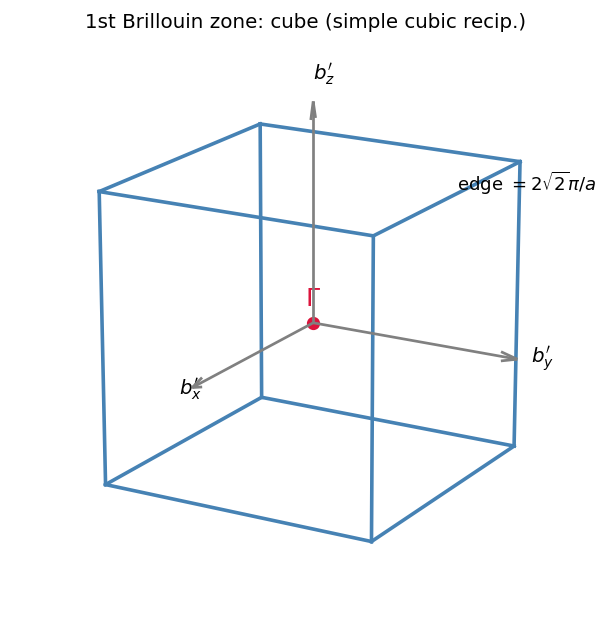
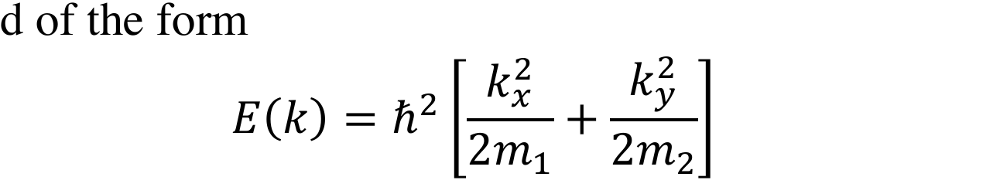

<!-- source: 歷年原卷/固態物理導論_2024.md -->

# 固態物理導論 2024 資格考 — 教學版逐題詳解（從普物起建 · 代數不跳步）

> **寫法**（對齊 QFT tutorials / 2016 · 2025 範例）：每題走
> `📋 原題 →（Q1/Q4 加 ⚠️ 原圖與讀法）→ 🎯 核心訊息 → 📚 前情提要（推導重題才放）→ 🔍 符號說明（點開，熱身/中階/本題三範例）→ 解答 Step（每步附小結、$\boxed{}$）→ ✅ 自我檢核 → 🔀 變化的可能情況 → 信心`。
> 共用觀念另見 [`_共用觀念與公式.html`](_共用觀念與公式.html)。
> **本卷特色**：**Q1（35%）是重頭戲**——lattice vectors 藏在圖裡（已從 PDF 判讀），要認 Bravais、算原胞體積、倒晶格、畫第一 BZ，全程完整推導（學 2016）。Q2 是經典 hcp packing（含「半徑減半層」變形）、Q3 LiCl Madelung、Q4 各向異性 2D band DOS（band 形式也藏在圖裡）、Q5 高於截止頻率的聲子（evanescent）。

## 🧭 全卷約定
- 直角座標 $\hat x,\hat y,\hat z$；倒晶格定義 $\mathbf a_i\cdot\mathbf b_j=2\pi\delta_{ij}$（3D：$\mathbf b_1=2\pi\dfrac{\mathbf a_2\times\mathbf a_3}{V}$，$V=\mathbf a_1\cdot(\mathbf a_2\times\mathbf a_3)$）。
- 自由/有效質量電子 $E=\hbar^2k^2/2m$；DOS 含自旋簡併 2（會註明）。
- 庫侖常數捷徑 $\dfrac{e^2}{4\pi\varepsilon_0}=14.40\ \text{eV·Å}$。給定常數：$\varepsilon_0=8.85\times10^{-12}\,$F/m、$e=1.602\times10^{-19}\,$C、$1\,\text{Å}=10^{-10}\,$m。
- 配分 **1(35%)·2(25%)·3(15%)·4(15%)·5(10%)**。閉書，符號依 Kittel。

---

# 📘 第 1 題 — 晶體對稱（Crystal symmetry, 35%）　★本卷重頭戲

## 📋 原題
> 有人說他找到一個晶體，其 lattice vectors 如下（見原圖），$\hat x,\hat y,\hat z$ 為直角座標單位向量。
> **1.** 認出這個 Bravais lattice（畫圖有助判斷）。
> **2.** 算 primitive cell 體積。
> **3.** 算倒晶格。
> **4.** 畫第一布里淵區。

## ⚠️ 原圖與讀法（lattice vectors 藏在被略過的圖裡，已從 PDF 判讀）

**判讀到的 lattice vectors（請核對）：**
$$\mathbf a_1=\Big(\tfrac a2\Big)\hat x+\Big(\tfrac a2\Big)\hat y,\qquad \mathbf a_2=a\,\hat y,\qquad \mathbf a_3=\Big(\tfrac{a}{\sqrt2}\Big)\hat z.$$
即 $\mathbf a_1=\tfrac a2(\hat x+\hat y)$、$\mathbf a_2=(0,a,0)$、$\mathbf a_3=(0,0,a/\sqrt2)$。$\mathbf a_1,\mathbf a_2$ 都在 $xy$ 平面、$\mathbf a_3$ 沿 $z$——這是「平面格 × 沿 $z$ 堆疊」的層狀結構，解題核心就是先認出那層平面格。
> **若判讀有誤**（尤其 $\mathbf a_3$ 的 $1/\sqrt2$、$\mathbf a_1$ 的 $a/2$），把正確向量給我即可整題重算。

## 🎯 核心訊息
> **把給定的三個向量「化簡成正交等長基底」就現形了。** $\mathbf a_1,\mathbf a_2$ 張出的平面格，其實是邊長 $a/\sqrt2$ 的**正方格（相對 $x,y$ 軸轉 45°）**；再配上 $\mathbf a_3=(a/\sqrt2)\hat z$ 的直接堆疊 → 整體是**邊長 $a'=a/\sqrt2$ 的簡單立方（simple cubic）**。一旦認出 SC，體積（$a'^3$）、倒晶格（SC，邊 $2\pi/a'$）、第一 BZ（立方）全部秒解。

## 📚 前情提要：怎麼「認出」一個被偽裝的 Bravais lattice
### 階段 1（普物）：晶格 = 一組重複向量
$\mathbf R=n_1\mathbf a_1+n_2\mathbf a_2+n_3\mathbf a_3$。**同一個 Bravais lattice 可以用無限多組 primitive vectors 描述**（彼此差一個行列式 $=\pm1$ 的整數矩陣）。所以「給的向量長相奇怪」不代表晶格奇怪——要會換基底看本質。
> **留存**：認 Bravais 的標準動作 = 找一組**正交、等長**的基底；找得到 → 立方/正方類。

### 階段 2（線代）：先處理平面格
平面向量 $\mathbf a_1=\tfrac a2(\hat x+\hat y)$、$\mathbf a_2=(0,a,0)$。做線性組合找更對稱的基底：
$$\mathbf a_1-\mathbf a_2=\Big(\tfrac a2,\ \tfrac a2-a,\ 0\Big)=\tfrac a2(\hat x-\hat y).$$
於是平面格可改用 $\mathbf u=\tfrac a2(\hat x+\hat y)$、$\mathbf v=\tfrac a2(\hat x-\hat y)$。這兩個：$\mathbf u\cdot\mathbf v=\tfrac{a^2}4(1-1)=0$（**正交**），$|\mathbf u|=|\mathbf v|=\tfrac a2\sqrt2=\dfrac{a}{\sqrt2}$（**等長**）。
> **留存**：平面格 = 邊長 $a/\sqrt2$ 的**正方格**，只是相對 $x,y$ 軸轉了 45°。

### 階段 3（堆疊）：加上 $z$ 方向
$\mathbf a_3=(a/\sqrt2)\hat z$，長度恰好也 $=a/\sqrt2$，且與平面正交、**直接疊在上一層正上方**（無水平偏移）。三個互相正交、等長 $a/\sqrt2$ 的向量 $\mathbf u,\mathbf v,\mathbf a_3$ → **簡單立方**。
> **留存**：$\{\mathbf u,\mathbf v,\mathbf a_3\}$ 是 SC 的乾淨 primitive 基底；原題給的 $\{\mathbf a_1,\mathbf a_2,\mathbf a_3\}$ 是同一晶格的另一組 primitive 基底（下面用體積驗證）。

## 🔍 符號說明

<b>▸ 倒晶格公式、Wigner–Seitz/BZ、與「換基底認晶格」</b>

### 為什麼要這個
題目要 derive 倒晶格與畫 BZ；BZ = 倒晶格的 Wigner–Seitz cell。先把直晶格認成 SC，倒晶格與 BZ 就有現成答案，再用公式驗算。

### 定義
- 倒晶格（3D）：$\mathbf b_1=2\pi\dfrac{\mathbf a_2\times\mathbf a_3}{V},\ \mathbf b_2=2\pi\dfrac{\mathbf a_3\times\mathbf a_1}{V},\ \mathbf b_3=2\pi\dfrac{\mathbf a_1\times\mathbf a_2}{V}$，$V=\mathbf a_1\cdot(\mathbf a_2\times\mathbf a_3)$。
- BZ 體積恆 $=\dfrac{(2\pi)^3}{V_{\text{cell}}}$（檢驗用）。

**範例 1（熱身）**：SC 邊 $a$ → 倒晶格 SC 邊 $2\pi/a$，BZ = 邊 $2\pi/a$ 的立方。
**範例 2（中階）**：fcc → 倒晶格 bcc，BZ = 截角八面體（2016 第 1 題）。
**範例 3（本題）**：偽裝的 SC（邊 $a/\sqrt2$）→ 倒晶格 SC（邊 $2\sqrt2\,\pi/a$）→ BZ = 立方。

## 解答

### 1. 認出 Bravais lattice
由「前情提要」的換基底：平面格 = 邊 $a/\sqrt2$ 的正方格（轉 45°），$z$ 向以 $a/\sqrt2$ 直接堆疊。三正交等長基底
$$\mathbf u=\tfrac a2(\hat x+\hat y),\quad \mathbf v=\tfrac a2(\hat x-\hat y),\quad \mathbf a_3=\tfrac{a}{\sqrt2}\hat z,\qquad |\mathbf u|=|\mathbf v|=|\mathbf a_3|=\frac{a}{\sqrt2}.$$
$$\boxed{\text{Bravais lattice = 簡單立方（simple cubic），立方邊 } a'=\dfrac{a}{\sqrt2}=\dfrac{\sqrt2}{2}a.}$$
> **小結**：奇怪的 $1/\sqrt2$ 正是把「轉 45° 的正方對角線 $a$」換回「正方邊 $a/\sqrt2$」的指紋。

### 2. Primitive cell 體積（用原題給的 $\mathbf a_i$ 直接算，順便驗證 = SC）
$$\mathbf a_2\times\mathbf a_3=(0,a,0)\times\Big(0,0,\tfrac{a}{\sqrt2}\Big)=\Big(a\cdot\tfrac{a}{\sqrt2}-0,\ 0,\ 0\Big)=\Big(\tfrac{a^2}{\sqrt2},0,0\Big).$$
$$V=\mathbf a_1\cdot(\mathbf a_2\times\mathbf a_3)=\Big(\tfrac a2,\tfrac a2,0\Big)\cdot\Big(\tfrac{a^2}{\sqrt2},0,0\Big)=\frac a2\cdot\frac{a^2}{\sqrt2}=\frac{a^3}{2\sqrt2}.$$
$$\boxed{V=\frac{a^3}{2\sqrt2}=\frac{\sqrt2}{4}a^3\approx0.354\,a^3.}$$
> **小結**：$\big(a/\sqrt2\big)^3=a^3/(2\sqrt2)$ 與此完全相同 ✓——確認原題 $\mathbf a_i$ 真的是 SC 的 primitive vectors（含恰 1 個格點）。

### 3. 倒晶格（公式硬算 + 認 SC）
用 $V=a^3/(2\sqrt2)$。
**$\mathbf b_1$：** 已算 $\mathbf a_2\times\mathbf a_3=(a^2/\sqrt2,0,0)$，
$$\mathbf b_1=2\pi\frac{(a^2/\sqrt2,0,0)}{a^3/(2\sqrt2)}=2\pi\cdot\frac{2}{a}\hat x=\frac{4\pi}{a}\hat x.$$
（係數 $\dfrac{a^2/\sqrt2}{a^3/(2\sqrt2)}=\dfrac{a^2}{\sqrt2}\cdot\dfrac{2\sqrt2}{a^3}=\dfrac2a$。）
**$\mathbf b_2$：** $\mathbf a_3\times\mathbf a_1=\big(0,0,\tfrac{a}{\sqrt2}\big)\times\big(\tfrac a2,\tfrac a2,0\big)=\big(-\tfrac{a^2}{2\sqrt2},\ \tfrac{a^2}{2\sqrt2},\ 0\big)$,
$$\mathbf b_2=2\pi\frac{(-a^2/2\sqrt2,\ a^2/2\sqrt2,\ 0)}{a^3/(2\sqrt2)}=\frac{2\pi}{a}(-\hat x+\hat y).$$
**$\mathbf b_3$：** $\mathbf a_1\times\mathbf a_2=\big(\tfrac a2,\tfrac a2,0\big)\times(0,a,0)=\big(0,0,\tfrac{a^2}{2}\big)$,
$$\mathbf b_3=2\pi\frac{(0,0,a^2/2)}{a^3/(2\sqrt2)}=\frac{2\sqrt2\,\pi}{a}\hat z.$$
$$\boxed{\mathbf b_1=\frac{4\pi}{a}\hat x,\quad \mathbf b_2=\frac{2\pi}{a}(-\hat x+\hat y),\quad \mathbf b_3=\frac{2\sqrt2\,\pi}{a}\hat z.}$$
**認 SC：** 改寫成正交等長基底——令 $\mathbf b_x'=\tfrac{2\pi}a(\hat x+\hat y)$、$\mathbf b_y'=\tfrac{2\pi}a(\hat x-\hat y)$、$\mathbf b_z'=\tfrac{2\sqrt2\pi}a\hat z$，則 $\mathbf b_1=\mathbf b_x'+\mathbf b_y'$、$\mathbf b_2=-\mathbf b_y'$（皆整數組合），且 $|\mathbf b_x'|=|\mathbf b_y'|=|\mathbf b_z'|=\dfrac{2\sqrt2\,\pi}{a}$、互相正交。
$$\boxed{\text{倒晶格 = 簡單立方，立方邊 } b=\frac{2\pi}{a'}=\frac{2\sqrt2\,\pi}{a}\approx\frac{8.886}{a}.}$$
> **小結**：SC 的倒晶格還是 SC（邊長取倒數乘 $2\pi$）。硬算的 $\mathbf b_i$ 只是 SC 的另一組基底，跟「邊 $2\sqrt2\pi/a$ 的立方」完全一致。

### 4. 畫第一布里淵區
SC 倒晶格的 Wigner–Seitz cell = **立方**（六個最近倒晶格點連線的中垂面圍成）。

$$\boxed{\text{第一 BZ = 邊長 }\frac{2\sqrt2\,\pi}{a}\text{ 的立方體，中心 }\Gamma\text{，沿 SC 軸 }\hat x',\hat y',\hat z\text{ 各到 }\pm\frac{\sqrt2\,\pi}{a}.}$$
（注意：此立方相對實驗室 $x,y$ 軸繞 $z$ 轉了 45°，因平面格本身轉 45°。）

<figure style="margin:1.3em 0;text-align:center">
<svg viewBox="0 0 640 230" width="100%" style="max-width:700px;border:1px solid #ddd;border-radius:8px;background:#fff;padding:6px;box-sizing:border-box" xmlns="http://www.w3.org/2000/svg">
<g font-family="-apple-system,sans-serif">
<g transform="translate(0,0)">
<text x="110" y="20" text-anchor="middle" font-size="13" font-weight="bold" fill="#1a4d7c">給的基底 a₁,a₂（斜的）</text>
<line x1="20" y1="200" x2="210" y2="200" stroke="#bbb" stroke-width="1"/>
<line x1="40" y1="215" x2="40" y2="40" stroke="#bbb" stroke-width="1"/>
<g fill="#2f6ba3"><circle cx="40" cy="200" r="3.5"/><circle cx="120" cy="200" r="3.5"/><circle cx="200" cy="200" r="3.5"/><circle cx="80" cy="120" r="3.5"/><circle cx="160" cy="120" r="3.5"/><circle cx="120" cy="40" r="3.5"/></g>
<line x1="40" y1="200" x2="80" y2="120" stroke="#c0392b" stroke-width="2.2"/>
<line x1="40" y1="200" x2="120" y2="200" stroke="#e67e22" stroke-width="2.2"/>
<text x="58" y="152" fill="#c0392b" font-size="12">a₁</text>
<text x="78" y="218" fill="#e67e22" font-size="12">a₂</text>
<text x="110" y="225" text-anchor="middle" font-size="10.5" fill="#777">兩邊不正交、長度不等</text>
</g>
<g transform="translate(230,0)">
<text x="110" y="20" text-anchor="middle" font-size="13" font-weight="bold" fill="#1a4d7c">換成 u,v（正交等長）</text>
<g fill="#2f6ba3"><circle cx="40" cy="200" r="3.5"/><circle cx="120" cy="200" r="3.5"/><circle cx="200" cy="200" r="3.5"/><circle cx="80" cy="120" r="3.5"/><circle cx="160" cy="120" r="3.5"/><circle cx="120" cy="40" r="3.5"/></g>
<line x1="40" y1="200" x2="80" y2="120" stroke="#1a4d7c" stroke-width="2.2"/>
<line x1="40" y1="200" x2="120" y2="200" stroke="#2e8b2e" stroke-width="0.8" stroke-dasharray="3,3"/>
<line x1="80" y1="120" x2="160" y2="120" stroke="#2e8b2e" stroke-width="2.2"/>
<rect x="68" y="120" width="12" height="12" fill="none" stroke="#2e8b2e" stroke-width="0.9"/>
<text x="50" y="152" fill="#1a4d7c" font-size="12">u</text>
<text x="118" y="112" fill="#2e8b2e" font-size="12">v</text>
<text x="110" y="225" text-anchor="middle" font-size="10.5" fill="#777">u·v = 0，|u| = |v| = a/√2</text>
</g>
<g transform="translate(460,0)">
<text x="90" y="20" text-anchor="middle" font-size="13" font-weight="bold" fill="#1a4d7c">→ 簡單立方</text>
<path d="M35,170 105,170 M105,170 140,140 M35,90 105,90 M105,90 140,60 M140,60 70,60 M70,60 35,90 M35,170 35,90 M105,170 105,90 M140,140 140,60" fill="none" stroke="#1a4d7c" stroke-width="1.6"/>
<path d="M140,140 70,140 M70,140 35,170 M70,140 70,60" fill="none" stroke="#bbb" stroke-width="1.1" stroke-dasharray="4,3"/>
<g fill="#2f6ba3"><circle cx="35" cy="170" r="4"/><circle cx="105" cy="170" r="4"/><circle cx="105" cy="90" r="4"/><circle cx="35" cy="90" r="4"/><circle cx="70" cy="140" r="4"/><circle cx="140" cy="140" r="4"/><circle cx="140" cy="60" r="4"/><circle cx="70" cy="60" r="4"/></g>
<text x="90" y="200" text-anchor="middle" font-size="11.5" fill="#333">邊長 a′ = a/√2</text>
<text x="90" y="218" text-anchor="middle" font-size="10.5" fill="#777">三軸正交等長</text>
</g>
</g>
</svg>
<figcaption style="font-size:0.9em;color:#555;margin-top:0.5em">認出「被偽裝的簡單立方」三步：① 給的 <b style="color:#c0392b">a₁</b>=½a(x̂+ŷ) 與 <b style="color:#e67e22">a₂</b>=aŷ 看似斜、不等長；② 取線性組合 <b style="color:#1a4d7c">u</b>=a₁、<b style="color:#2e8b2e">v</b>=a₁−a₂ 後變成正交（夾角直角記號）且等長 a/√2 的正方格（只是相對 x,y 軸轉 45°）；③ 配上同長的 a₃=（a/√2)ẑ → 三軸正交等長的簡單立方，邊 a′=a/√2。倒晶格仍是 SC（邊 2√2π/a）、第一 BZ 是立方。</figcaption>
</figure>

<b>📝 更多範例（點開）：換基底認 Bravais、原胞體積、倒晶格</b>

**範例 A（再認一個偽裝的正方格）**：給 $\boldsymbol a_1=(b,b),\ \boldsymbol a_2=(b,-b)$。先檢正交：$\boldsymbol a_1\cdot\boldsymbol a_2=b\cdot b+b\cdot(-b)=b^2-b^2=0$ ✓。再檢等長：$|\boldsymbol a_1|=\sqrt{b^2+b^2}=\sqrt2\,b$，$|\boldsymbol a_2|=\sqrt{b^2+b^2}=\sqrt2\,b$ ✓。兩條正交且等長 → 邊長 $\sqrt2\,b$ 的**正方格**（相對座標軸轉 $45^\circ$）。原胞面積 $=|\boldsymbol a_1||\boldsymbol a_2|=\sqrt2\,b\cdot\sqrt2\,b=2b^2$，與 $(\sqrt2 b)^2=2b^2$ 一致 ✓。

**範例 B（bcc 原胞體積，行列式法每步展開）**：取 $\boldsymbol a_1=\tfrac a2(-\hat x+\hat y+\hat z),\ \boldsymbol a_2=\tfrac a2(\hat x-\hat y+\hat z),\ \boldsymbol a_3=\tfrac a2(\hat x+\hat y-\hat z)$。把三向量排成行列式：
$$V=\left|\det\begin{pmatrix}-\tfrac a2&\tfrac a2&\tfrac a2\\[2pt]\tfrac a2&-\tfrac a2&\tfrac a2\\[2pt]\tfrac a2&\tfrac a2&-\tfrac a2\end{pmatrix}\right|.$$
沿第一列展開（每項都帶餘子式 $2\times2$ 行列式）：
$$=-\tfrac a2\Big[(-\tfrac a2)(-\tfrac a2)-\tfrac a2\cdot\tfrac a2\Big]-\tfrac a2\Big[\tfrac a2(-\tfrac a2)-\tfrac a2\cdot\tfrac a2\Big]+\tfrac a2\Big[\tfrac a2\cdot\tfrac a2-(-\tfrac a2)\tfrac a2\Big].$$
逐括號算：第一括號 $=\tfrac{a^2}4-\tfrac{a^2}4=0$；第二 $=-\tfrac{a^2}4-\tfrac{a^2}4=-\tfrac{a^2}2$；第三 $=\tfrac{a^2}4+\tfrac{a^2}4=\tfrac{a^2}2$。代回：
$$V=-\tfrac a2(0)-\tfrac a2(-\tfrac{a^2}2)+\tfrac a2(\tfrac{a^2}2)=0+\tfrac{a^3}4+\tfrac{a^3}4=\tfrac{a^3}2.$$
與「bcc 慣用立方含 2 格點 → 原胞 $a^3/2$」一致 ✓。

**範例 C（SC 倒晶格邊長對偶，含 $2\pi$ 規約）**：本題直晶格 SC 邊 $a'=a/\sqrt2$，原胞體積 $V=a'^3=(a/\sqrt2)^3=a^3/(2\sqrt2)$。倒晶格邊長 $b=2\pi/a'$：
$$b=\frac{2\pi}{a/\sqrt2}=\frac{2\pi\sqrt2}{a}=\frac{2\sqrt2\,\pi}{a}\approx\frac{2\times1.414\times3.1416}{a}\approx\frac{8.886}{a}.$$
驗 BZ 與原胞體積對偶：$V_{\text{BZ}}=b^3=\Big(\tfrac{2\sqrt2\pi}{a}\Big)^3=\tfrac{(2\sqrt2)^3\pi^3}{a^3}=\tfrac{16\sqrt2\,\pi^3}{a^3}$；又 $\dfrac{(2\pi)^3}{V}=\dfrac{8\pi^3}{a^3/(2\sqrt2)}=8\pi^3\cdot\dfrac{2\sqrt2}{a^3}=\dfrac{16\sqrt2\,\pi^3}{a^3}$ → 兩者相同 ✓（$(2\sqrt2)^3=8\cdot2\sqrt2=16\sqrt2$）。

## ✅ 自我檢核
- **體積一致性**：BZ 體積 $\big(2\sqrt2\pi/a\big)^3=16\sqrt2\,\pi^3/a^3$；用公式 $\dfrac{(2\pi)^3}{V_{\text{cell}}}=\dfrac{8\pi^3}{a^3/(2\sqrt2)}=16\sqrt2\,\pi^3/a^3$ ✓。
- **正交驗算**：$\mathbf a_1\cdot\mathbf b_1=\tfrac a2\cdot\tfrac{4\pi}a=2\pi$ ✓；$\mathbf a_1\cdot\mathbf b_2=\tfrac a2(-\tfrac{2\pi}a)+\tfrac a2(\tfrac{2\pi}a)=0$ ✓；$\mathbf a_2\cdot\mathbf b_2=a\cdot\tfrac{2\pi}a=2\pi$ ✓。
- **退化檢查**：若 $\mathbf a_3=a\hat z$（非 $a/\sqrt2$）則平面 $a/\sqrt2$、$z$ 軸 $a$ → tetragonal（非立方）。本題 $1/\sqrt2$ 正好把 $c$ 拉回等於平面邊，才升級成 cubic。

## 🔀 變化的可能情況
- **若 $\mathbf a_3=(c)\hat z$、$c\ne a/\sqrt2$**：平面仍正方 $a/\sqrt2$，但 $c$ 不等 → **simple tetragonal**；倒晶格 tetragonal、BZ = 長方柱。
- **若平面格不正交**（$\mathbf a_1\cdot\mathbf a_2\ne0$ 且長度不等）→ 一般要走 $\mathbf b_i$ 公式，無 SC 捷徑。
- **常見同型**：2022 tetragonal 認晶格 + 倒晶格 + BZ；2016 第 1 題 bcc→fcc 倒晶格。同一招：**先換成正交等長基底再認名字**。

## 信心：**中高**
推導（換基底→SC、體積、倒晶格、BZ）完全自洽、互相驗證通過；唯一外生不確定是**圖判讀**的 $\mathbf a_3=(a/\sqrt2)\hat z$ 與 $\mathbf a_1=\tfrac a2(\hat x+\hat y)$（已放大兩次確認，見上圖）。⚠️ 圖判讀請確認；若 $\mathbf a_3$ 係數不同，結論可能由 cubic 改成 tetragonal。

---

# 📗 第 2 題 — 原子堆積 hcp（Atomic packing, 25%）

## 📋 原題
> 考慮由等大球體層層堆出的 hcp 結構。
> **1.** unit cell 高/寬比（$c/a$）為何？
> **2.** atomic packing factor（APF）為何？
> **3.** 若**每隔一層**的球半徑變成另一層的**一半**，packing factor 變多少？

## 🎯 核心訊息
> hcp 的 $c/a$ 與 APF 都來自一個幾何事實：**上層球落在下層三球凹處、彼此相切**。$c/a=\sqrt{8/3}\approx1.633$、APF $=\pi/(3\sqrt2)\approx0.74$。第 3 小題的關鍵轉折：小球縮成半徑一半後**撐不住層距**，於是大球在垂直方向**直接相切**（$c=2r$）主導結構，小球落進空隙「不接觸」。

## 📚 前情提要：close packing 的兩個距離
### 階段 1（普物）：等大球最密 → 每球切 12 個鄰居
hcp 與 fcc 都是 close packing，APF 同為 0.74，差別只在堆疊序（hcp = ABAB、fcc = ABCABC）。
### 階段 2（幾何）：兩個關鍵長度
- **層內**最近鄰距離 $=a=2r$（同層球相切）。
- **層間**：上層球坐落在下層正三角形（邊 $a$）的**重心正上方**，重心到頂點的水平距離 = 外接圓半徑 $R_\triangle=\dfrac{a}{\sqrt3}$。
> **留存**：層間球心距 $=\sqrt{R_\triangle^2+(c/2)^2}$；等大球相切時它 $=2r=a$，這條就定出 $c/a$。

## 🔍 符號說明

<b>▸ hcp primitive cell、APF 定義、外接圓半徑</b>

### 定義
- hcp primitive cell：菱形底（邊 $a$、夾角 $120°$，面積 $\tfrac{\sqrt3}{2}a^2$）× 高 $c$，**含 2 顆原子**（一顆 A 位、一顆 B 位）。
- $\text{APF}=\dfrac{\text{cell 內球體積和}}{\text{cell 體積}}$。
- 正三角形（邊 $a$）外接圓半徑 $R_\triangle=a/\sqrt3$；球半徑 $r=a/2$。

**範例 1（熱身）**：SC，1 球/胞，$\text{APF}=\dfrac{\frac43\pi r^3}{(2r)^3}=\dfrac\pi6\approx0.52$。
**範例 2（中階）**：fcc，4 球/立方胞，$\text{APF}=\dfrac{4\cdot\frac43\pi r^3}{(2\sqrt2 r)^3}=\dfrac{\pi}{3\sqrt2}\approx0.74$。
**範例 3（本題）**：hcp（理想 $c/a$）= 0.74；半徑減半層 → 見第 3 小題。

## 解答

### 1. $c/a$ 比（完整）
**Step 1 — 層間相切方程。** 上層 B 球心在下層三 A 球重心正上方，水平偏移 $R_\triangle=a/\sqrt3$、垂直 $c/2$。等大球相切 ⇒ 球心距 $=2r=a$：
$$a^2=\Big(\frac{a}{\sqrt3}\Big)^2+\Big(\frac c2\Big)^2.$$
**Step 2 — 解 $c$。**
$$\frac{c^2}{4}=a^2-\frac{a^2}{3}=\frac{2a^2}{3}\ \Rightarrow\ c^2=\frac{8a^2}{3}\ \Rightarrow\ \boxed{\frac ca=\sqrt{\frac83}=\frac{2\sqrt2}{\sqrt3}\approx1.633.}$$
> **小結**：理想 hcp 的 $c/a$ 純幾何，與材料無關（真實金屬略偏離，反映非理想鍵結）。

### 2. Atomic packing factor（完整）
2 顆球（$r=a/2$）：球體積和 $=2\cdot\tfrac43\pi r^3=2\cdot\tfrac43\pi(a/2)^3=\dfrac{\pi a^3}{3}$。
cell 體積 $=\tfrac{\sqrt3}{2}a^2\cdot c=\tfrac{\sqrt3}{2}a^2\cdot\sqrt{8/3}\,a$。分母化簡：
$$\frac{\sqrt3}{2}\sqrt{\frac83}=\frac12\sqrt{3\cdot\frac83}=\frac12\sqrt8=\frac12\cdot2\sqrt2=\sqrt2\ \Rightarrow\ V_{\text{cell}}=\sqrt2\,a^3.$$
$$\text{APF}=\frac{\pi a^3/3}{\sqrt2\,a^3}=\boxed{\frac{\pi}{3\sqrt2}=\frac{\pi}{\sqrt{18}}\approx0.7405.}$$
> **小結**：與 fcc 完全相同（都是 close packing）→ 0.74 是三維等大球的最密上限（Kepler）。

### 3. 每隔一層半徑減半（完整，含結構判斷）
設大球（A 層）半徑 $r$、小球（B 層）半徑 $r/2$。逐步釐清新結構：

**Step 1 — 層內仍由大球定 $a$。** A 層大球在自己平面內相切 ⇒ $a=2r$（小球不影響層內，A 子晶格不變）。

**Step 2 — 關鍵轉折：誰決定層距 $c$？** 試讓小球「坐」在大球凹處（A–B 相切，球心距 $=r+\tfrac r2=\tfrac{3r}2$）：
$$\Big(\frac{3r}2\Big)^2=\Big(\frac{a}{\sqrt3}\Big)^2+\Big(\frac c2\Big)^2=\Big(\frac{2r}{\sqrt3}\Big)^2+\Big(\frac c2\Big)^2\ \Rightarrow\ \frac{c^2}4=\frac{9r^2}4-\frac{4r^2}3=\frac{11r^2}{12},$$
得 $c=2r\sqrt{11/12}\approx1.915\,r<2r$。**但** hcp 中相鄰 A 層（同 $x,y$、相隔 $c$）的大球若 $c<2r$ 會**互相重疊**！矛盾 ⇒ 小球太小、撐不開層距。
> **小結**：所以實際限制反過來——**大球在垂直方向直接相切**決定 $c$。

**Step 3 — 最密一致結構：$c=2r$。** A 層大球上下直接相切 ⇒ $\boxed{c=2r}$。檢查小球是否塞得下：此時小球心到大球心距 $=\sqrt{(2r/\sqrt3)^2+r^2}=r\sqrt{7/3}\approx1.528r>1.5r=r+\tfrac r2$ → 小球與大球**剛好不接觸**（在空隙裡微鬆動），無重疊 ✓。

**Step 4 — 算 packing factor（$a=2r,\ c=2r$）。**
$$V_{\text{cell}}=\frac{\sqrt3}{2}a^2c=\frac{\sqrt3}{2}(2r)^2(2r)=4\sqrt3\,r^3.$$
球體積：大球 $\tfrac43\pi r^3=\tfrac86\pi r^3$；小球 $\tfrac43\pi(r/2)^3=\tfrac16\pi r^3$；和 $=\tfrac96\pi r^3=\tfrac32\pi r^3$。
$$\text{APF}=\frac{\frac32\pi r^3}{4\sqrt3\,r^3}=\frac{3\pi}{8\sqrt3}=\boxed{\frac{\sqrt3\,\pi}{8}\approx0.680.}$$
> **小結**：$\tfrac{3}{8\sqrt3}=\tfrac{\sqrt3}{8}$。比 0.74 略降——小球填不滿原本由相切大球撐出的體積，但因層距縮成 $c=2r$（大球變成簡單六方堆疊），整體仍頗密。

<figure style="margin:1.3em 0;text-align:center">
<svg viewBox="0 0 620 250" width="100%" style="max-width:680px;border:1px solid #ddd;border-radius:8px;background:#fff;padding:6px;box-sizing:border-box" xmlns="http://www.w3.org/2000/svg">
<defs>
<radialGradient id="hcpBig" cx="35%" cy="30%" r="75%"><stop offset="0" stop-color="#9cc3e6"/><stop offset="1" stop-color="#2f6ba3"/></radialGradient>
<radialGradient id="hcpSm" cx="35%" cy="30%" r="75%"><stop offset="0" stop-color="#f0a79b"/><stop offset="1" stop-color="#c0392b"/></radialGradient>
</defs>
<g font-family="-apple-system,sans-serif">
<g transform="translate(0,0)">
<text x="150" y="20" text-anchor="middle" font-size="13" font-weight="bold" fill="#1a4d7c">理想 hcp：層間相切定 c/a</text>
<line x1="40" y1="200" x2="260" y2="200" stroke="#aaa" stroke-width="1"/>
<circle cx="90" cy="170" r="30" fill="url(#hcpBig)"/>
<circle cx="210" cy="170" r="30" fill="url(#hcpBig)"/>
<circle cx="150" cy="110" r="30" fill="url(#hcpSm)" fill-opacity="0.9"/>
<line x1="90" y1="170" x2="150" y2="110" stroke="#c0392b" stroke-width="1.8"/>
<line x1="90" y1="170" x2="150" y2="170" stroke="#2e8b2e" stroke-width="1.4" stroke-dasharray="4,3"/>
<line x1="150" y1="170" x2="150" y2="110" stroke="#e67e22" stroke-width="1.4" stroke-dasharray="4,3"/>
<text x="112" y="135" fill="#c0392b" font-size="11">2r=a</text>
<text x="115" y="188" fill="#2e8b2e" font-size="11">a/√3</text>
<text x="156" y="148" fill="#e67e22" font-size="11">c/2</text>
<text x="150" y="232" text-anchor="middle" font-size="10.5" fill="#777">a²=(a/√3)²+(c/2)² → c/a=√(8/3)</text>
</g>
<g transform="translate(310,0)">
<text x="150" y="20" text-anchor="middle" font-size="13" font-weight="bold" fill="#1a4d7c">半徑減半層：大球垂直相切</text>
<line x1="40" y1="220" x2="260" y2="220" stroke="#aaa" stroke-width="1"/>
<circle cx="100" cy="185" r="33" fill="url(#hcpBig)"/>
<circle cx="100" cy="119" r="33" fill="url(#hcpBig)"/>
<circle cx="165" cy="152" r="16.5" fill="url(#hcpSm)"/>
<line x1="100" y1="218" x2="100" y2="86" stroke="#c0392b" stroke-width="1.8" stroke-dasharray="5,3"/>
<text x="58" y="156" fill="#c0392b" font-size="11">c=2r</text>
<text x="183" y="156" fill="#c0392b" font-size="11">r/2</text>
<text x="150" y="244" text-anchor="middle" font-size="10.5" fill="#777">大球上下直接相切 c=2r，小球落空隙不接觸</text>
</g>
</g>
</svg>
<figcaption style="font-size:0.9em;color:#555;margin-top:0.5em">左：理想 hcp 中上層球（紅）落在下層三大球（藍）凹處、與之相切，球心距 <b style="color:#c0392b">2r=a</b> = 斜邊，水平腳 <b style="color:#2e8b2e">a/√3</b>（三角形外接圓半徑）、垂直腳 <b style="color:#e67e22">c/2</b>，畢氏定理給 c/a=√(8/3)。右：第 3 小題小球縮成半徑 r/2 後撐不住層距，改由<b style="color:#c0392b">大球在垂直方向直接相切（c=2r）</b>主導，小球只是落進空隙、剛好不接觸 → APF 從 0.74 降為 √3π/8≈0.68。</figcaption>
</figure>

<b>📝 更多範例（點開）：close packing 的 c/a、APF、空隙球半徑</b>

**範例 A（理想 hcp 的 c/a 完整代數）**：層間相切方程 $a^2=\big(\tfrac{a}{\sqrt3}\big)^2+\big(\tfrac c2\big)^2$。逐步解：先把 $\big(\tfrac a{\sqrt3}\big)^2=\tfrac{a^2}3$ 移項，$\tfrac{c^2}4=a^2-\tfrac{a^2}3=\tfrac{3a^2-a^2}{3}=\tfrac{2a^2}3$。兩邊乘 4：$c^2=\tfrac{8a^2}3$。開根：$\tfrac ca=\sqrt{\tfrac83}=\tfrac{2\sqrt2}{\sqrt3}=\tfrac{2\sqrt2}{\sqrt3}\cdot\tfrac{\sqrt3}{\sqrt3}=\tfrac{2\sqrt6}{3}\approx\tfrac{2\times2.449}{3}\approx1.633$。

**範例 B（fcc 的 APF，與 hcp 同為 0.74）**：fcc 慣用立方含 4 球，相切沿面對角線 $4r=\sqrt2\,a\Rightarrow r=\tfrac{\sqrt2}4a$。球體積和 $=4\cdot\tfrac43\pi r^3=\tfrac{16}3\pi\big(\tfrac{\sqrt2}4a\big)^3$。算次方：$\big(\tfrac{\sqrt2}4\big)^3=\tfrac{(\sqrt2)^3}{4^3}=\tfrac{2\sqrt2}{64}=\tfrac{\sqrt2}{32}$。所以球和 $=\tfrac{16}3\pi\cdot\tfrac{\sqrt2}{32}a^3=\tfrac{16\sqrt2}{96}\pi a^3=\tfrac{\sqrt2}6\pi a^3$。
$$\text{APF}=\frac{\tfrac{\sqrt2}6\pi a^3}{a^3}=\frac{\sqrt2\,\pi}6=\frac{\pi}{6/\sqrt2}=\frac{\pi}{3\sqrt2}\approx0.7405,$$
（末步用 $\tfrac{\sqrt2}6=\tfrac{\sqrt2}6\cdot\tfrac{\sqrt2}{\sqrt2}=\tfrac{2}{6\sqrt2}=\tfrac1{3\sqrt2}$）與 hcp 完全相同 ✓。

**範例 C（八面體空隙能塞的最大球，每步展開）**：fcc 八面體空隙在立方體心，沿立方邊「角球–空隙球–角球」相切，半條邊長 $\tfrac a2$ 上排「角球半徑 $r$ + 空隙球半徑 $r_v$」：$r+r_v=\tfrac a2$。又 fcc 角球與面心相切 $4r=\sqrt2\,a\Rightarrow r=\tfrac{\sqrt2}4a$。代入：$r_v=\tfrac a2-\tfrac{\sqrt2}4a=\tfrac{2a-\sqrt2 a}4=\tfrac{(2-\sqrt2)a}4$。比值
$$\frac{r_v}{r}=\frac{(2-\sqrt2)a/4}{\sqrt2 a/4}=\frac{2-\sqrt2}{\sqrt2}=\frac2{\sqrt2}-1=\sqrt2-1\approx0.414.$$
所以八面體空隙最大可容 $r_v\approx0.414\,r$ 的球（四面體空隙則為 $0.225\,r$）。

## ✅ 自我檢核
- 第 1、2 小題的 $c/a=1.633$、APF $=0.74$ 為 Kittel 標準值 ✓。
- 第 3 小題：純大球（簡單六方 $a=c=2r$）的 APF $=\dfrac{\frac43\pi r^3}{4\sqrt3 r^3}=\dfrac{\pi}{3\sqrt3}\approx0.605$，加上小球貢獻 $\dfrac{\frac16\pi r^3}{4\sqrt3 r^3}\approx0.076$，合計 $0.605+0.076=0.681$ ✓ 與 0.680 一致。

## 🔀 變化的可能情況
- **第 3 小題的另一種讀法（保持理想 hcp 的 $c$ 不變、僅縮小球）**：$V_{\text{cell}}=8\sqrt2 r^3$、球和 $\tfrac32\pi r^3$ → APF $=\dfrac{3\pi}{16\sqrt2}\approx0.417$。但此讀法下大球之間留大空洞、非「最密」，物理上不自洽，故本解採 $c=2r$ 的最密一致結構（0.68）。⚠️ 此小題依題意詮釋而定，列為信心**中**。
- **常見同型**：fcc/bcc 的 APF（0.74 / 0.68）、tetrahedral/octahedral 空隙可容納的最大球半徑（$r/R=0.225,0.414$）。

## 信心：第 1、2 小題 **高**；第 3 小題 **中**（結構詮釋有歧義，已採最密一致解 $c=2r$ → 0.68，並列出 0.417 的替代讀法）。

---

# 📙 第 3 題 — 晶體（Crystals：LiCl Madelung 結合能, 15%）

## 📋 原題
> LiCl 分子的 atomic separation $a=5.14\,$Å。它結晶成 NaCl（rock-salt）結構（Madelung 常數 $\alpha\approx1.7476$）後，一個分子（離子對）的 binding energy 是多少？

## 🎯 核心訊息
> 離子晶體的結合能 = **Madelung（庫侖）能**。一個離子對的能量 $U=-\dfrac{\alpha e^2}{4\pi\varepsilon_0 R}$，$R$ = 最近鄰陰陽離子距離、$\alpha$ = 把整個晶格的庫侖和打包成的純數。本題給 $\alpha$ 與距離，直接代入。

## 🔍 符號說明

<b>▸ Madelung 能、庫侖捷徑常數、Born 排斥修正</b>

### 定義
單一離子對的 Madelung（庫侖）能
$$U=-\frac{\alpha e^2}{4\pi\varepsilon_0 R},\qquad \frac{e^2}{4\pi\varepsilon_0}=14.40\ \text{eV·Å}.$$
完整結合能還含 Pauli 排斥（Born 模型 $\propto R^{-n}$），平衡時修正成 $U_0=-\dfrac{\alpha e^2}{4\pi\varepsilon_0 R_0}\Big(1-\dfrac1n\Big)$，$n\approx7\!-\!9$。題目未給 $n$／排斥參數 → 取純 Madelung。

**範例 1（熱身）**：單一 $+e,-e$ 相距 $R$：$U=-14.40/R\,[\text{eV，}R\text{ 以 Å}]$。
**範例 2（中階）**：NaCl $\alpha=1.748$；rock-salt 最近鄰 $R=a_{\text{cube}}/2$。
**範例 3（本題）**：$\alpha=1.7476$，距離見下（注意「atomic separation」之歧義）。

## 解答

### 主解：把 $R=5.14\,$Å 視為最近鄰離子距離（題目字面）
$$U=-\frac{\alpha e^2}{4\pi\varepsilon_0 R}=-\alpha\cdot\frac{14.40\ \text{eV·Å}}{R}=-1.7476\times\frac{14.40}{5.14}\ \text{eV}.$$
$$\frac{14.40}{5.14}=2.802,\qquad U=-1.7476\times2.802=\boxed{-4.90\ \text{eV／離子對}.}$$
> **小結**：負號 = 結合（晶體比分開的離子穩定 4.9 eV）。

### ⚠️ 物理註記（很可能是出題者真正要的）
真實 LiCl 的**立方晶格常數** $a_{\text{cube}}=5.14\,$Å，而 rock-salt 的**最近鄰** Li–Cl 距離是 $R=a_{\text{cube}}/2=2.57\,$Å。若 5.14 Å 指的是 cube edge，應用 $R=2.57\,$Å：
$$U=-1.7476\times\frac{14.40}{2.57}=-1.7476\times5.603=\boxed{-9.79\ \text{eV}.}$$
再加 Born 排斥修正（$n\approx7$，乘 $1-\tfrac1n=\tfrac67$）：$U_0\approx-9.79\times\tfrac67=-8.4\,$eV——與 LiCl 實驗晶格能（$\approx8.6\,$eV／對）相符。

<figure style="margin:1.3em 0;text-align:center">
<svg viewBox="0 0 600 250" width="100%" style="max-width:660px;border:1px solid #ddd;border-radius:8px;background:#fff;padding:6px;box-sizing:border-box" xmlns="http://www.w3.org/2000/svg">
<defs>
<radialGradient id="ionCat" cx="35%" cy="30%" r="75%"><stop offset="0" stop-color="#9cc3e6"/><stop offset="1" stop-color="#2f6ba3"/></radialGradient>
<radialGradient id="ionAn" cx="35%" cy="30%" r="75%"><stop offset="0" stop-color="#a8dca8"/><stop offset="1" stop-color="#2e8b2e"/></radialGradient>
</defs>
<g font-family="-apple-system,sans-serif">
<g transform="translate(0,0)">
<text x="150" y="20" text-anchor="middle" font-size="13" font-weight="bold" fill="#1a4d7c">rock-salt：最近鄰 R = a₍cube₎/2</text>
<rect x="50" y="45" width="200" height="200" fill="none" stroke="#888" stroke-width="1.2"/>
<g fill="url(#ionCat)"><circle cx="50" cy="45" r="13"/><circle cx="250" cy="45" r="13"/><circle cx="50" cy="245" r="13"/><circle cx="250" cy="245" r="13"/><circle cx="150" cy="145" r="13"/></g>
<g fill="url(#ionAn)"><circle cx="150" cy="45" r="13"/><circle cx="50" cy="145" r="13"/><circle cx="250" cy="145" r="13"/><circle cx="150" cy="245" r="13"/></g>
<line x1="150" y1="145" x2="150" y2="45" stroke="#c0392b" stroke-width="2"/>
<text x="163" y="98" fill="#c0392b" font-size="12">R = a/2</text>
<line x1="50" y1="258" x2="250" y2="258" stroke="#666" stroke-width="1"/>
<text x="150" y="272" text-anchor="middle" font-size="10.5" fill="#777">a₍cube₎ = 5.14 Å（若指 cube edge）</text>
</g>
<g transform="translate(320,0)">
<text x="130" y="20" text-anchor="middle" font-size="13" font-weight="bold" fill="#1a4d7c">U = −αe²/(4πε₀R)</text>
<line x1="30" y1="55" x2="30" y2="215" stroke="#888" stroke-width="1.2"/>
<line x1="30" y1="135" x2="250" y2="135" stroke="#bbb" stroke-width="1" stroke-dasharray="3,3"/>
<text x="40" y="130" font-size="10.5" fill="#777">U=0</text>
<rect x="70" y="135" width="50" height="48" fill="#6aa1d6" fill-opacity="0.55" stroke="#1a4d7c" stroke-width="1.2"/>
<text x="95" y="200" text-anchor="middle" font-size="11" fill="#1a4d7c">R=5.14</text>
<text x="95" y="214" text-anchor="middle" font-size="11" fill="#1a4d7c">−4.9 eV</text>
<rect x="170" y="135" width="50" height="96" fill="#c0392b" fill-opacity="0.5" stroke="#c0392b" stroke-width="1.2"/>
<text x="195" y="200" text-anchor="middle" font-size="11" fill="#c0392b">R=2.57</text>
<text x="195" y="214" text-anchor="middle" font-size="11" fill="#c0392b">−9.8 eV</text>
<text x="130" y="246" text-anchor="middle" font-size="10.5" fill="#777">R 減半 → |U| 加倍（反比 1/R）</text>
</g>
</g>
</svg>
<figcaption style="font-size:0.9em;color:#555;margin-top:0.5em">左：NaCl（rock-salt）結構，<b style="color:#2f6ba3">陽離子（藍，Li⁺）</b>與<b style="color:#2e8b2e">陰離子（綠，Cl⁻）</b>交錯排列；最近鄰 Li–Cl 距離 <b style="color:#c0392b">R = a₍cube₎/2</b>。右：Madelung 能 U = −αe²/(4πε₀R) 與 1/R 成正比（反比於距離），所以把 R 從 5.14 Å（字面讀法）改成 2.57 Å（cube edge 一半）時 |U| 恰好加倍：−4.9 eV → −9.8 eV。本題歧義全在「atomic separation 5.14 Å」是最近鄰還是 cube edge。</figcaption>
</figure>

<b>📝 更多範例（點開）：Madelung 能代入、Born 修正、每 mol 換算</b>

**範例 A（NaCl 純 Madelung 能，每步展開）**：NaCl 最近鄰 $R=2.82\,$Å、$\alpha=1.748$。用捷徑 $\tfrac{e^2}{4\pi\varepsilon_0}=14.40\,$eV·Å：
$$U=-\frac{\alpha e^2}{4\pi\varepsilon_0 R}=-1.748\times\frac{14.40}{2.82}\ \text{eV}.$$
先算 $\tfrac{14.40}{2.82}=5.106$，再乘：$U=-1.748\times5.106=-8.93\,$eV／離子對。

**範例 B（加 Born 排斥，反推 n）**：若量到平衡晶格能 $U_0=-7.95\,$eV，而純 Madelung 為 $-8.93\,$eV，則
$$U_0=U\Big(1-\frac1n\Big)\ \Rightarrow\ 1-\frac1n=\frac{U_0}{U}=\frac{-7.95}{-8.93}=0.8902.$$
解 $\tfrac1n=1-0.8902=0.1098\Rightarrow n=\tfrac1{0.1098}\approx9.1$——典型 Born 指數（NaCl 約 $n\approx8$）。

**範例 C（每 mol 晶格能換算）**：把本題主解 $U=-4.90\,$eV／對 換成每 mol。每 mol 有 $N_A=6.022\times10^{23}$ 個離子對，且 $1\,\text{eV}=1.602\times10^{-19}\,$J：
$$U_{\text{mol}}=-4.90\times1.602\times10^{-19}\times6.022\times10^{23}\ \text{J/mol}.$$
先乘係數 $4.90\times1.602=7.85$，指數 $10^{-19}\times10^{23}=10^4$，再乘 $N_A$ 的 $6.022$：$7.85\times6.022\times10^4=47.3\times10^4=4.73\times10^5\,$J/mol $=-473\,$kJ/mol。（若用 $R=2.57$ 的 $-9.79\,$eV，同法得 $-945\,$kJ/mol。）

## ✅ 自我檢核
- 量綱：$\text{eV·Å}/\text{Å}=$ eV ✓。
- 與實驗對照：$-9.8\,$eV（用 $R=2.57$）經 Born 修正 $\to-8.4\,$eV，貼近 LiCl 真實晶格能 $\approx-8.6\,$eV ✓ → **支持「5.14 Å 是 cube edge」的讀法物理上更正確**；但若忠於題目字面「atomic separation」則為 $-4.9\,$eV。

## 🔀 變化的可能情況
- **要求含 Born 排斥**：給 $n$ 時乘 $(1-1/n)$。
- **問每 mol 晶格能**：$\times N_A$（$-4.9\,$eV $\to-473\,$kJ/mol；$-9.8\,$eV $\to-945\,$kJ/mol）。
- **常見同型**：NaCl/CsCl 不同 $\alpha$、給平衡距離反推排斥指數 $n$。

## 信心：**中**
公式與代入無誤；不確定全在**「atomic separation = 5.14 Å」指最近鄰距離還是 cube edge**。主解採字面（最近鄰）→ $-4.9\,$eV；但物理與實驗一致性偏向「cube edge、$R=2.57\,$Å」→ $-9.8\,$eV（含排斥 $-8.4\,$eV）。請依出題者定義取捨。

---

# 📕 第 4 題 — 固體中的電子（Electrons in solids：各向異性能帶 DOS, 15%）

## 📋 原題
> 能帶可以是各向異性的（從 $k=0$ 沿不同方向的曲率不同）。考慮二維各向異性能帶（形式見原圖）。
> **1.** 當 $m_1=2m_2$ 時，density of states 為何？

## ⚠️ 原圖與讀法（band 形式藏在被略過的圖裡，已從 PDF 判讀）

**判讀到的能帶形式（請核對）：**
$$E(\mathbf k)=\hbar^2\left[\frac{k_x^2}{2m_1}+\frac{k_y^2}{2m_2}\right].$$
即 $x,y$ 兩方向各有自己的有效質量 $m_1,m_2$（沿 $x$ 曲率 $\propto1/m_1$、沿 $y$ 曲率 $\propto1/m_2$）。

## 🎯 核心訊息
> **各向異性拋物能帶的等能面是橢圓；2D 的 DOS 仍是常數**，只要把孤立的 $m$ 換成**幾何平均質量** $\sqrt{m_1m_2}$。一條 $k$-space 變數縮放（$k_x\to\sqrt{m_1},k_y\to\sqrt{m_2}$）就把橢圓拉回圓，化歸 isotropic 2D。

## 📚 前情提要：2D DOS 為什麼是常數
### 階段 1（BvK）：每個 $\mathbf k$ 態占 $k$-space 面積 $(2\pi)^2/A$（$A$ = 樣品面積）；含自旋再 $\times2$。
### 階段 2（數態）：$N(E)=2\cdot\dfrac{A}{(2\pi)^2}\times\{E(\mathbf k)<E\text{ 的 }k\text{-space 面積}\}$，$g(E)=dN/dE$。
### 階段 3（各向異性）：等能線 $E=\hbar^2(k_x^2/2m_1+k_y^2/2m_2)$ 是橢圓，半軸 $k_x^{\max}=\sqrt{2m_1E}/\hbar$、$k_y^{\max}=\sqrt{2m_2E}/\hbar$，面積 $\pi k_x^{\max}k_y^{\max}\propto E$（線性於 $E$）→ $g=dN/dE$ 為常數。
> **留存**：DOS $\propto E$ 的微分 = 常數；幾何平均質量 $\sqrt{m_1m_2}$ 取代 $m$。

## 🔍 符號說明

<b>▸ 橢圓等能面、有效質量、各維度 DOS</b>

### 定義
- 橢圓面積 $=\pi\cdot a_{\text{半軸}}\cdot b_{\text{半軸}}$。
- 各向異性拋物帶：等能面為橢圓，等效於 $m\to\sqrt{m_1m_2}$（DOS 質量 = 幾何平均）。
- 維度對照：1D $g\propto E^{-1/2}$、**2D $g=$ 常數**、3D $g\propto E^{1/2}$。

**範例 1（熱身）**：isotropic 2D（$m_1=m_2=m$）：$g=\dfrac{Am}{\pi\hbar^2}$（含自旋）。
**範例 2（中階）**：3D 各向異性 $g\propto\sqrt{m_1m_2m_3}\,E^{1/2}$（DOS 質量 = $\sqrt[3]{m_1m_2m_3}$ 的 $3/2$ 次方）。
**範例 3（本題）**：2D，$m_1=2m_2$ → $\sqrt{m_1m_2}=\sqrt2\,m_2$。

## 解答

### 1. $m_1=2m_2$ 時的 DOS（完整）
**Step 1 — 等能橢圓面積。** 由 $E=\hbar^2\big(\tfrac{k_x^2}{2m_1}+\tfrac{k_y^2}{2m_2}\big)$ 寫成
$$\frac{k_x^2}{(\sqrt{2m_1E}/\hbar)^2}+\frac{k_y^2}{(\sqrt{2m_2E}/\hbar)^2}=1,$$
半軸 $\dfrac{\sqrt{2m_1E}}{\hbar},\dfrac{\sqrt{2m_2E}}{\hbar}$，面積
$$S(E)=\pi\cdot\frac{\sqrt{2m_1E}}{\hbar}\cdot\frac{\sqrt{2m_2E}}{\hbar}=\frac{2\pi\sqrt{m_1m_2}}{\hbar^2}\,E.$$
**Step 2 — 數態（含自旋 2）。**
$$N(E)=2\cdot\frac{A}{(2\pi)^2}\,S(E)=2\cdot\frac{A}{4\pi^2}\cdot\frac{2\pi\sqrt{m_1m_2}}{\hbar^2}E=\frac{A\sqrt{m_1m_2}}{\pi\hbar^2}\,E.$$
**Step 3 — 微分得 DOS。**
$$g(E)=\frac{dN}{dE}=\frac{A\sqrt{m_1m_2}}{\pi\hbar^2}\quad(\text{常數，與 }E\text{ 無關，含自旋}).$$
**Step 4 — 代入 $m_1=2m_2$。** $\sqrt{m_1m_2}=\sqrt{2m_2\cdot m_2}=\sqrt2\,m_2=\dfrac{m_1}{\sqrt2}$：
$$\boxed{g(E)=\frac{A\sqrt{m_1m_2}}{\pi\hbar^2}=\frac{\sqrt2\,A\,m_2}{\pi\hbar^2}=\frac{A\,m_1}{\sqrt2\,\pi\hbar^2}\quad(\text{常數}).}$$
（單一自旋則除以 2：$g_{\uparrow}=\dfrac{\sqrt2\,A\,m_2}{2\pi\hbar^2}$。）
> **小結**：2D 的招牌——DOS 與 $E$ 無關；各向異性只是把 $m$ 換成 $\sqrt{m_1m_2}$。

<figure style="margin:1.3em 0;text-align:center">
<svg viewBox="0 0 620 240" width="100%" style="max-width:680px;border:1px solid #ddd;border-radius:8px;background:#fff;padding:6px;box-sizing:border-box" xmlns="http://www.w3.org/2000/svg">
<g font-family="-apple-system,sans-serif">
<g transform="translate(0,0)">
<text x="150" y="20" text-anchor="middle" font-size="13" font-weight="bold" fill="#1a4d7c">等能線：橢圓（kₓ,k_y 平面）</text>
<line x1="40" y1="130" x2="270" y2="130" stroke="#888" stroke-width="1"/>
<line x1="150" y1="40" x2="150" y2="220" stroke="#888" stroke-width="1"/>
<text x="262" y="148" font-size="11" fill="#555">kₓ</text>
<text x="158" y="50" font-size="11" fill="#555">k_y</text>
<ellipse cx="150" cy="130" rx="100" ry="50" fill="#6aa1d6" fill-opacity="0.3" stroke="#1a4d7c" stroke-width="2"/>
<line x1="150" y1="130" x2="250" y2="130" stroke="#c0392b" stroke-width="1.8"/>
<line x1="150" y1="130" x2="150" y2="80" stroke="#e67e22" stroke-width="1.8"/>
<text x="190" y="124" fill="#c0392b" font-size="10.5">√(2m₁E)/ℏ</text>
<text x="156" y="105" fill="#e67e22" font-size="10.5">√(2m₂E)/ℏ</text>
<text x="150" y="234" text-anchor="middle" font-size="10.5" fill="#777">面積 = π·半軸·半軸 ∝ E（m₁=2m₂ 時 kₓ 軸較長）</text>
</g>
<g transform="translate(320,0)">
<text x="135" y="20" text-anchor="middle" font-size="13" font-weight="bold" fill="#1a4d7c">DOS g(E)：維度對照</text>
<line x1="40" y1="200" x2="270" y2="200" stroke="#888" stroke-width="1.2"/>
<line x1="40" y1="40" x2="40" y2="200" stroke="#888" stroke-width="1.2"/>
<text x="262" y="218" font-size="11" fill="#555">E</text>
<text x="20" y="46" font-size="11" fill="#555">g</text>
<polyline points="48,55 52,78 60,100 75,123 100,142 135,158 180,170 240,180" fill="none" stroke="#2e8b2e" stroke-width="2.2"/>
<text x="200" y="173" font-size="10.5" fill="#2e8b2e">1D ∝E^(−½)</text>
<polyline points="40,120 270,120" fill="none" stroke="#c0392b" stroke-width="2.6"/>
<text x="150" y="113" font-size="11" fill="#c0392b" font-weight="bold">2D = 常數 ← 本題</text>
<polyline points="40,200 70,193 105,182 145,169 190,152 235,134 270,118" fill="none" stroke="#1a4d7c" stroke-width="2.2"/>
<text x="120" y="195" font-size="10.5" fill="#1a4d7c">3D ∝E^(½)</text>
<text x="135" y="234" text-anchor="middle" font-size="10.5" fill="#777">2D 唯一與 E 無關：g = A√(m₁m₂)/(πℏ²)</text>
</g>
</g>
</svg>
<figcaption style="font-size:0.9em;color:#555;margin-top:0.5em">左：各向異性拋物帶 E=ℏ²(kₓ²/2m₁+k_y²/2m₂) 的等能線是<b style="color:#1a4d7c">橢圓</b>，半軸 <b style="color:#c0392b">√(2m₁E)/ℏ</b>（沿 kₓ）與 <b style="color:#e67e22">√(2m₂E)/ℏ</b>（沿 k_y）；面積 π·半軸·半軸 = 2π√(m₁m₂)E/ℏ² 線性於 E。右：DOS 的維度招牌——<b style="color:#2e8b2e">1D ∝E^(−½)</b>、<b style="color:#c0392b">2D 是常數</b>、<b style="color:#1a4d7c">3D ∝E^(½)</b>。2D 因「面積 ∝ E、微分掉一個 E」變成與能量無關的常數，各向異性只把 m 換成幾何平均 √(m₁m₂)。</figcaption>
</figure>

<b>📝 更多範例（點開）：各維度 DOS 與幾何平均質量</b>

**範例 A（isotropic 2D 退化驗證）**：令 $m_1=m_2=m$，則 $\sqrt{m_1m_2}=\sqrt{m\cdot m}=m$。代回本題結果：
$$g(E)=\frac{A\sqrt{m_1m_2}}{\pi\hbar^2}=\frac{Am}{\pi\hbar^2}\quad(\text{常數}).$$
這正是標準二維自由電子氣（含自旋簡併 2）的 DOS。推導路徑也可逆查：態數 $N=2\cdot\tfrac{A}{(2\pi)^2}\cdot\pi k^2$，其中 $E=\tfrac{\hbar^2k^2}{2m}\Rightarrow k^2=\tfrac{2mE}{\hbar^2}$，代入 $N=\tfrac{A}{2\pi}\cdot\tfrac{2mE}{\hbar^2}=\tfrac{AmE}{\pi\hbar^2}$，微分 $g=\tfrac{dN}{dE}=\tfrac{Am}{\pi\hbar^2}$ ✓。

**範例 B（1D 各向異性，$g\propto E^{-1/2}$）**：1D 帶 $E=\tfrac{\hbar^2k^2}{2m}$。$k=\tfrac{\sqrt{2mE}}{\hbar}$，含 $\pm k$ 兩支與自旋 2：態數 $N=2\cdot\tfrac{L}{2\pi}\cdot 2k=\tfrac{2L}{\pi}\cdot\tfrac{\sqrt{2mE}}{\hbar}$。微分（用 $\tfrac{d}{dE}\sqrt E=\tfrac1{2\sqrt E}$）：
$$g(E)=\frac{dN}{dE}=\frac{2L}{\pi\hbar}\sqrt{2m}\cdot\frac1{2\sqrt E}=\frac{L}{\pi\hbar}\sqrt{\frac{2m}{E}}\propto E^{-1/2}.$$
在帶底 $E\to0$ 發散（van Hove 奇點），與 2D 常數、3D 升冪形成鮮明對照。

**範例 C（3D 各向異性，DOS 質量 = 立方根幾何平均）**：3D 帶 $E=\tfrac{\hbar^2}2\big(\tfrac{k_x^2}{m_1}+\tfrac{k_y^2}{m_2}+\tfrac{k_z^2}{m_3}\big)$，等能面為橢球，半軸 $\tfrac{\sqrt{2m_iE}}{\hbar}$。橢球體積 $=\tfrac43\pi\prod_i\tfrac{\sqrt{2m_iE}}{\hbar}=\tfrac43\pi\tfrac{(2E)^{3/2}\sqrt{m_1m_2m_3}}{\hbar^3}$。態數（含自旋）$N=2\cdot\tfrac{V}{(2\pi)^3}\times$ 此體積，對 $E$ 微分（$\tfrac{d}{dE}E^{3/2}=\tfrac32E^{1/2}$）：
$$g(E)\propto\sqrt{m_1m_2m_3}\,E^{1/2},$$
等效 DOS 質量為 $m_d=(m_1m_2m_3)^{1/3}$（三個質量的幾何平均），與 2D 的 $\sqrt{m_1m_2}$ 同精神、只是維度換成三個。

## ✅ 自我檢核
- 退化 $m_1=m_2=m$：$g=\dfrac{Am}{\pi\hbar^2}$ ✓（標準 2D 含自旋 DOS）。
- 量綱：$[\,m/\hbar^2\,]=\dfrac{\text{kg}}{(\text{J·s})^2}=\dfrac1{\text{J·m}^2}$，乘 $A[\text{m}^2]$ → $1/\text{J}$ ✓（每能量的態數）。
- 變數縮放法驗證：令 $q_x=k_x/\sqrt{m_1},q_y=k_y/\sqrt{m_2}$，$E=\tfrac{\hbar^2}2(q_x^2+q_y^2)$ 各向同性，Jacobian $\sqrt{m_1m_2}$ → 同結果 ✓。

## 🔀 變化的可能情況
- **3D 各向異性**：$g(E)\propto\sqrt{m_1m_2m_3}\,E^{1/2}$（DOS effective mass $m_d=(m_1m_2m_3)^{1/3}$）。
- **問 cyclotron mass / 載子數**：$n=g\cdot E_F$（2D 常數 DOS 下載子數線性於 $E_F$）。
- **常見同型**：2025 第 3(c) 2D 正方 DOS、2016 第 2 題 2D DOS。

## 信心：**高**
推導標準完整、兩種方法（橢圓面積／變數縮放）互驗一致。band 形式已從 PDF 放大判讀（見上圖）；⚠️ 若圖中是 $E=\hbar^2k^2/2m^*$ 之外的別種寫法請告知，但「$k_x^2/2m_1+k_y^2/2m_2$」判讀清晰。

---

# 📒 第 5 題 — 聲子（Phonons：高於截止頻率的波, 10%）

## 📋 原題
> 諧振鏈（harmonic chain）的聲子色散有最高頻率 $\omega_{\max}$。
> **1.** 寫出描述「頻率高於 $\omega_{\max}$ 的波」之傳播方程。
> **2.** 你的結果代表什麼意思？

## 🎯 核心訊息
> 單原子鏈 $\omega=\omega_{\max}|\sin(ka/2)|$，$\omega_{\max}=2\sqrt{C/M}$。要 $\omega>\omega_{\max}$ 需 $\sin(ka/2)>1$ → **$k$ 必須是複數**：$k=\pi/a+i\kappa$。位移變成 $u_n\propto(-1)^n e^{-\kappa na}$——**不傳播、指數衰減的 evanescent 波**。意義：鏈是低通力學濾波器，高於 $\omega_{\max}$ 的擾動被反射、滲不進晶格。

## 📚 前情提要：單原子鏈色散（先建好再延拓到複數 $k$）
### 階段 1（運動方程）：第 $n$ 顆原子 $M\ddot u_n=C(u_{n+1}+u_{n-1}-2u_n)$（$C$ = 彈簧常數、$a$ = 間距）。
### 階段 2（行波試解）：$u_n=u_0e^{i(kna-\omega t)}$ 代入得
$$-M\omega^2=C(e^{ika}+e^{-ika}-2)=2C(\cos ka-1)=-4C\sin^2\!\tfrac{ka}2,$$
$$\omega^2=\frac{4C}{M}\sin^2\!\frac{ka}2\ \Rightarrow\ \omega=2\sqrt{\tfrac CM}\,\Big|\sin\tfrac{ka}2\Big|=\omega_{\max}\Big|\sin\tfrac{ka}2\Big|,\quad \omega_{\max}=2\sqrt{\tfrac CM}.$$
> **留存**：實數 $k$ 下 $\omega\le\omega_{\max}$；要超過只能讓 $k$ 走進複數平面。

## 🔍 符號說明

<b>▸ 複數波向量、evanescent 波、cosh 延拓</b>

### 定義
色散 $\sin(ka/2)=\omega/\omega_{\max}$。當 RHS $>1$，令 $k=\dfrac\pi a+i\kappa$，用
$$\sin\!\Big(\frac\pi2+i\frac{\kappa a}2\Big)=\cos\!\Big(i\frac{\kappa a}2\Big)=\cosh\!\frac{\kappa a}2,$$
得 $\cosh(\kappa a/2)=\omega/\omega_{\max}$。位移 $u_n\propto e^{ikna}=(-1)^n e^{-\kappa na}$（衰減）。

**範例 1（熱身）**：$\omega=\omega_{\max}$ → $\kappa=0$、$k=\pi/a$（BZ 邊界駐波）。
**範例 2（中階）**：能隙中 evanescent 態（如表面態、缺陷態）同此機制。
**範例 3（本題）**：$\omega>\omega_{\max}$ → $\kappa>0$、波指數衰減不傳播。

## 解答

### 1. 描述 $\omega>\omega_{\max}$ 的波之方程（完整）
**Step 1 — 從色散求 $k$。** $\sin(ka/2)=\omega/\omega_{\max}>1$ 無實數解 → 設 $k=\dfrac\pi a+i\kappa$（$\kappa>0$ 實）。
**Step 2 — 代入並用 cosh。**
$$\sin\frac{ka}2=\sin\Big(\frac\pi2+i\frac{\kappa a}2\Big)=\cos\Big(i\frac{\kappa a}2\Big)=\cosh\frac{\kappa a}2=\frac{\omega}{\omega_{\max}}.$$
$$\boxed{\kappa=\frac2a\,\cosh^{-1}\!\Big(\frac{\omega}{\omega_{\max}}\Big).}$$
**Step 3 — 位移形式。**
$$u_n=u_0\,e^{i(kna-\omega t)}=u_0\,e^{i(\pi n)}e^{-\kappa na}e^{-i\omega t}=\boxed{u_0\,(-1)^n\,e^{-\kappa na}\,e^{-i\omega t}.}$$
> **小結**：相鄰原子反相（$(-1)^n$）、振幅沿鏈以 $e^{-\kappa na}$ 指數衰減；**無相位傳播 = 不是行波**。

### 2. 物理意義
$\omega>\omega_{\max}$ 沒有傳播模（propagating mode）；這種頻率的擾動是 **evanescent（瞬逝）波**，能量被**反射**、只能指數滲入晶格數個原胞即消失。等於說諧振鏈是一個**低通力學濾波器**，$\omega_{\max}$ 是截止頻率（cutoff）；高於它的頻段是「禁帶／stop band」。（與光在全反射時的隧穿尾、能隙中電子態同屬複數 $k$ 的衰減解。）

<figure style="margin:1.3em 0;text-align:center">
<svg viewBox="0 0 620 250" width="100%" style="max-width:680px;border:1px solid #ddd;border-radius:8px;background:#fff;padding:6px;box-sizing:border-box" xmlns="http://www.w3.org/2000/svg">
<g font-family="-apple-system,sans-serif">
<g transform="translate(0,0)">
<text x="150" y="20" text-anchor="middle" font-size="13" font-weight="bold" fill="#1a4d7c">色散 ω = ω_max |sin(ka/2)|</text>
<line x1="40" y1="200" x2="280" y2="200" stroke="#888" stroke-width="1.2"/>
<line x1="40" y1="40" x2="40" y2="200" stroke="#888" stroke-width="1.2"/>
<text x="272" y="218" font-size="11" fill="#555">k</text>
<text x="268" y="206" font-size="10" fill="#777">π/a</text>
<text x="22" y="75" font-size="10" fill="#777">ω_max</text>
<line x1="40" y1="70" x2="260" y2="70" stroke="#bbb" stroke-width="1" stroke-dasharray="4,3"/>
<polyline points="40,200 64,182 88,158 112,131 136,107 160,90 184,79 208,72 232,70 260,70" fill="none" stroke="#1a4d7c" stroke-width="2.4"/>
<rect x="40" y="42" width="240" height="28" fill="#c0392b" fill-opacity="0.14"/>
<text x="160" y="58" text-anchor="middle" font-size="10.5" fill="#c0392b">ω &gt; ω_max：無實數 k（禁帶）</text>
<text x="150" y="234" text-anchor="middle" font-size="10.5" fill="#777">實數 k 下 ω ≤ ω_max，在 k=π/a 達頂</text>
</g>
<g transform="translate(330,0)">
<text x="135" y="20" text-anchor="middle" font-size="13" font-weight="bold" fill="#1a4d7c">位移 uₙ ∝ (−1)ⁿ e^(−κna)</text>
<line x1="30" y1="125" x2="270" y2="125" stroke="#888" stroke-width="1"/>
<g stroke="#666" stroke-width="0.8"><line x1="50" y1="125" x2="50" y2="135"/><line x1="80" y1="125" x2="80" y2="135"/><line x1="110" y1="125" x2="110" y2="135"/><line x1="140" y1="125" x2="140" y2="135"/><line x1="170" y1="125" x2="170" y2="135"/><line x1="200" y1="125" x2="200" y2="135"/><line x1="230" y1="125" x2="230" y2="135"/></g>
<polyline points="50,65 80,170 110,98 140,143 170,113 200,135 230,121" fill="none" stroke="#c0392b" stroke-width="1.4" stroke-dasharray="4,3"/>
<g fill="#1a4d7c"><circle cx="50" cy="65" r="4.5"/><circle cx="110" cy="98" r="4.5"/><circle cx="170" cy="113" r="4.5"/><circle cx="230" cy="121" r="4.5"/></g>
<g fill="#e67e22"><circle cx="80" cy="170" r="4.5"/><circle cx="140" cy="143" r="4.5"/><circle cx="200" cy="135" r="4.5"/></g>
<polyline points="50,65 80,80 110,98 140,109 170,116 200,121 230,124" fill="none" stroke="#aaa" stroke-width="1" stroke-dasharray="2,3"/>
<text x="135" y="222" text-anchor="middle" font-size="10.5" fill="#777">相鄰反相（藍↑橙↓）、振幅指數衰減</text>
<text x="135" y="238" text-anchor="middle" font-size="10.5" fill="#777">不傳播 → evanescent 波</text>
</g>
</g>
</svg>
<figcaption style="font-size:0.9em;color:#555;margin-top:0.5em">左：單原子鏈色散 <b style="color:#1a4d7c">ω = ω_max|sin(ka/2)|</b>，實數 k 下頻率封頂於 ω_max（在 BZ 邊界 k=π/a）；<b style="color:#c0392b">ω &gt; ω_max 的紅色區無實數解</b>——這就是截止頻率上方的禁帶。要進這區只能讓 k = π/a + iκ 變複數。右：所得位移 uₙ ∝ <b style="color:#1a4d7c">(−1)ⁿ</b><b style="color:#e67e22"> </b>e^(−κna)——相鄰原子反相（藍向上、橙向下），振幅沿鏈以 e^(−κna) 指數衰減（灰色包絡），沒有相位傳播，是不傳播的 evanescent（瞬逝）波。</figcaption>
</figure>

<b>📝 更多範例（點開）：複數 k 延拓、滲透深度、雙原子鏈頻隙</b>

**範例 A（$\omega=1.5\,\omega_{\max}$ 的衰減常數 κ）**：用 $\cosh(\kappa a/2)=\omega/\omega_{\max}=1.5$。由 $\cosh^{-1}(1.5)$：解 $\cosh x=1.5$ 即 $\tfrac{e^x+e^{-x}}2=1.5\Rightarrow e^x+e^{-x}=3$。令 $y=e^x$：$y+1/y=3\Rightarrow y^2-3y+1=0\Rightarrow y=\tfrac{3+\sqrt5}2=2.618$，$x=\ln 2.618=0.962$。所以 $\tfrac{\kappa a}2=0.962\Rightarrow\kappa=\tfrac{1.924}{a}$。滲透深度 $1/\kappa=a/1.924\approx0.52\,a$——不到一個原胞，衰減極快。

**範例 B（高頻極限 $\omega\gg\omega_{\max}$）**：$\cosh(\kappa a/2)\approx\tfrac12 e^{\kappa a/2}$（大宗主導），令其 $=\omega/\omega_{\max}$：$e^{\kappa a/2}\approx\tfrac{2\omega}{\omega_{\max}}\Rightarrow\tfrac{\kappa a}2\approx\ln\tfrac{2\omega}{\omega_{\max}}$，故
$$\kappa\approx\frac2a\ln\frac{2\omega}{\omega_{\max}}.$$
頻率越高、$\kappa$ 越大、滲透深度 $1/\kappa$ 越短，呼應「越遠離截止越衰減得快」。

**範例 C（雙原子鏈的頻隙也只有 evanescent 解）**：雙原子鏈（質量 $M_1>M_2$、彈簧 $C$）在 $k=\pi/a$ 處有頻隙 $\sqrt{2C/M_1}<\omega<\sqrt{2C/M_2}$。隙內代入色散同樣得 $\sin(\cdot)>1$ 型的無實數解 → $k$ 複數化、位移指數衰減。例如取 $C=1,\ M_1=2,\ M_2=1$：下緣 $\sqrt{2/2}=1$、上緣 $\sqrt{2/1}=\sqrt2\approx1.414$，隙寬 $\Delta\omega=\sqrt2-1\approx0.414\sqrt{C}$（單位制下）。隙內所有頻率都是反射性的 evanescent 態，與單原子鏈截止上方同機制。

## ✅ 自我檢核
- $\omega\to\omega_{\max}^+$：$\cosh^{-1}(1)=0$ → $\kappa\to0$，連續接回 $k=\pi/a$ 的 BZ 邊界駐波 ✓。
- $\omega\gg\omega_{\max}$：$\kappa\approx\dfrac2a\ln(2\omega/\omega_{\max})$ 增大 → 衰減更快（滲透深度更短）✓。
- 衰減解仍滿足原運動方程（線性、$k$ 複數化僅改空間包絡）✓。

## 🔀 變化的可能情況
- **雙原子鏈**：acoustic 與 optical 之間的**頻隙**（$\sqrt{2C/M_{\text{重}}}<\omega<\sqrt{2C/M_{\text{輕}}}$）內同樣只有 evanescent 解。
- **問滲透深度**：$1/\kappa=\dfrac a{2\cosh^{-1}(\omega/\omega_{\max})}$。
- **常見同型**：2016 第 6 題 Debye、雙原子鏈 optical/acoustic 分支。

## 信心：**高**
單原子鏈色散與複數 $k$ 延拓為標準結果（Kittel Ch4）；evanescent 詮釋正確完整。

---

## 📊 本卷信心總表（2024）
| 題 | 主題 | 配分 | 信心 | 重頭推導／備註 |
|---|---|---|---|---|
| 1 | 晶體對稱：認 SC + 倒晶格 + BZ | 35% | 中高 | 換基底認 SC、體積 $a^3/2\sqrt2$、倒晶格 SC（邊 $2\sqrt2\pi/a$）、BZ 立方；**$\mathbf a_i$ 依圖判讀，請核對** |
| 2 | hcp 堆積 | 25% | 高／**中** | $c/a=\sqrt{8/3}$、APF $=0.74$ 穩；**第 3 小題（半徑減半）詮釋有歧義 → 採最密 $c=2r$ 得 0.68，替代讀法 0.417** |
| 3 | LiCl Madelung 結合能 | 15% | **中** | $-4.90\,$eV（$R=5.14$ 字面）vs $-9.79\,$eV（$R=2.57=$ cube/2，物理較合）；依「atomic separation」定義取捨 |
| 4 | 各向異性 2D band DOS | 15% | 高 | $g=\dfrac{A\sqrt{m_1m_2}}{\pi\hbar^2}=\dfrac{\sqrt2 Am_2}{\pi\hbar^2}$（常數）；band 形式依圖判讀 |
| 5 | 聲子：高於 $\omega_{\max}$ | 10% | 高 | 複數 $k=\pi/a+i\kappa$、$u_n\propto(-1)^ne^{-\kappa na}$ evanescent |

> **判讀到的兩處關鍵圖（供核對）**：
> **Q1 lattice vectors** ＝ $\mathbf a_1=\tfrac a2(\hat x+\hat y),\ \mathbf a_2=a\hat y,\ \mathbf a_3=\tfrac{a}{\sqrt2}\hat z$（→ 簡單立方，邊 $a/\sqrt2$）。
> **Q4 band** ＝ $E(\mathbf k)=\hbar^2\big[\tfrac{k_x^2}{2m_1}+\tfrac{k_y^2}{2m_2}\big]$。
> **低信心／需確認處**：Q1 全建立在圖判讀的 $\mathbf a_3=a/\sqrt2$（若係數不同，cubic 可能降為 tetragonal）；Q2-3（半徑減半 packing 詮釋）；Q3（「atomic separation 5.14 Å」是最近鄰還是 cube edge）。
</content>
</invoke>
